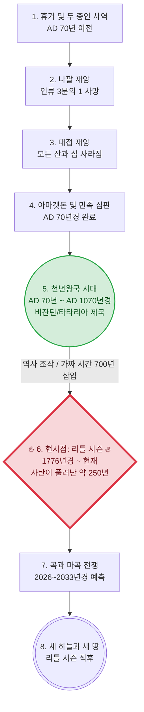

# 천년왕국 과거 성취설(리틀 시즌) 및 구원론 변질 논쟁 분석 기초 자료

## 1. [분석 대상 요약] 천년왕국 과거 주장(리틀 시즌) 세부 내용 및 타임라인

이들의 주장을 종합하면 아래와 같은 독자적인 타임라인과 역사관을 제시하고 있습니다.

### 📌 천년왕국 과거 주장 측이 상정하는 타임라인 시각화



| 순서 | 성경적 사건 | 추정 연도 | 천년왕국 과거 주장의 해석 및 내용 |
| :--- | :--- | :--- | :--- |
| **1~4** | 환난과 심판 | **AD 70년경 완료** | 휴거, 나팔/대접 재앙, 아마겟돈 심판이 **이미 1세기 로마 시대 즈음(AD 70년 예루살렘 멸망 등)에 모두 일어났다**고 해석함. |
| **5** | 천년왕국 | **AD 70년 ~ 1070년경** | 예수님과 부활한 성인들이 다스리던 1,000년의 통치 기간이 **이미 과거(비잔틴/타타리아 제국 등)에 성취되고 끝났다**고 해석함. |
| **-** | **역사 조작 (가짜 시간)** | **1070년경 ~ 1770년경** | 천년왕국 종료 후, 사탄 세력이 예수님의 재림이 실패한 것처럼 사람들을 속이기 위해 역사에 약 **700년의 가짜 시간(Phantom time)**을 삽입하여 연도를 조작했다고 주장함. |
| **6** | **리틀 시즌 (현재)** | **1776년경 ~ 현재** | 역사가 조작된 이후 사탄이 무저갱에서 풀려나 세상을 완전히 리셋한 **'리틀 시즌(약 250년)'이 바로 현재 우리가 사는 시대**라고 주장함. |
| **7~8** | 최후의 심판 | **2026~2033년경 예측** | 이 리틀 시즌이 끝나는 시점에 곡과 마곡 전쟁이 일어나고 곧바로 새 하늘과 새 땅이 열릴 것이라는 **시한부 종말론**적 관점을 제시함. |

### 🗣️ 세부 주장 내용 총정리 (표)

| 분류 | 주장하는 근거 (키워드) | 상세 내용 |
| :--- | :--- | :--- |
| **성경적 근거** | 예수님 재림의 임박성 약속 | 예수님은 "속히 오리라"(계 22:20), "이 세대가 지나가기 전에"(마 24:34), "죽기 전에 인자가 그분의 왕국에 임하는 것을 볼 자들도 있느니라"(마 16:28)라고 말씀하셨으며, 이는 미래가 아닌 1세기 당대에 재림과 천년왕국이 성취되었음을 의미한다고 해석함. |
| | 예수를 찌른 자의 목격 | "그를 찌른 자들도 볼 것이요"(계 1:7)라는 구절을 근거로, 십자가에서 예수님의 옆구리를 찌른 로마 병사도 재림을 보아야 하므로 당대에 재림이 일어났음을 증명한다고 주장함. |
| | 144,000명의 성도들 | 요한계시록(계 7:4, 계 14:1)에 등장하는 144,000명은 미래의 인물이 아니라, 과거에 이미 사라진 지파(시므온 지파 등)에서 하나님의 인장을 받아 천년왕국 때 부활하여 예수님과 함께 세상을 통치한 성인들이라고 해석함. |
| | 고전 15:25 및 부활·심판의 과거 성취 | "모든 원수를 발아래 두실 때까지 통치하셔야 하리라"(고전 15:25)는 구절을 과거 천년왕국으로 해석하며, 여섯째 나팔에 이미 죽은 자의 부활과 공중 심판이 모두 완료되었다고 주장함. |
| | 7천년 경륜설의 변형 (6천년 새창조) | 정통 7천년 경륜설(6천년 인류 역사 + 1천년 왕국)을 비틀어, 6일 창조를 '천년왕국이 포함된 인간 역사 6000년(새창조)'으로 압축하고, 7일째 안식은 사탄이 심판받은 후인 요한계시록 21:4의 '새 하늘 새 땅(영원한 안식)'이라고 주장함. |
| | 구약의 천년왕국 예언 배제 (계시록 국한설) | 천년왕국의 물리적 통치 형태는 오직 '요한계시록 20장'에만 나올 뿐이며, 구약(이사야, 에스겔 등)에 기록된 동물 생태계의 평화나 물리적 거대 성전 등을 천년왕국에 적용하는 것은 지어낸 이야기라고 극구 부인함. |
| **자연현상 및 우주론 해석** | 계시록 9장 '화산 폭발' 해석 | 입에서 불과 연기와 유황을 뿜는 2억 기병대(계 9:17-18)를 '활화산 폭발'로 해석함. 로마 시대에는 화산(Volcano)이라는 단어조차 없었으며, 이 화산 폭발 용암(머드 플러드)이 도시를 덮어 세상을 리셋시켰다고 주장함. |
| | 계시록 16장 대륙 이동(판게아) | 대접 재앙으로 일어난 전무후무한 큰 지진(계 16:18-20)으로 인해 원래 하나였던 거대한 원형 대륙이 쪼개져 오늘날의 대륙들로 나뉘었다고 주장함 (피라미드가 전 세계에 분포하는 이유). |
| | 은하수(Milky Way) 상처설 | 하늘의 은하수는 우주가 아니라 궁창(Firmament)에 새겨진 거대한 상처이며, 이것이 심판(혹은 궁창의 파괴)의 물리적 흔적이라고 주장함. |
| **문화적 증거** | 찬송가 '기쁘다 구주 오셨네' | "죄와 슬픔 사라지고 가시가 없도다"(찬송가 115장)라는 가사는 단순한 상징이 아니라 천년왕국이 지상에 강림했을 때 고통과 죽음이 사라진 유토피아적 현실을 묘사하고 부른 노래라고 해석함. |
| **건축 및 물리적 증거** | 불가사의한 거대 건축물 | 웅장한 건축물들은 현대 기술이나 당시 망치와 마차로는 지을 수 없으며, 모두 천년왕국 시절 지어진 건물들임. |
| | 부엌과 화장실의 부재 | 천년왕국 시절 부활한 사람들은 먹고 배설할 필요가 없었기 때문에, 고대 거대 건물들에는 부엌과 화장실이 없음. |
| | 치유의 종(Bell) 파괴 | 과거의 종소리는 영육을 치유하는 주파수 기능을 가졌으나, 사탄 세력이 무기를 만든다는 핑계로 종들을 파괴하고 흔적을 지움. |
| | 우상 건축물의 천년왕국 공존설 | 전 세계의 불상이나 이교도 신전들이 리틀 시즌(최근 250년)에 조작/급조되었거나, 혹은 "천년왕국 때 예수님이 우상을 모두 부순다는 구절이 없다"며 우상 건축물이 거룩한 통치 기간에도 공존했다고 주장함. |
| | 텅 빈 도시 사진 | 1800년대 초기 텅 빈 도시 사진이나 웅장한 건물 앞에 마차를 모는 사람들의 사진은, 천년왕국 성도들이 떠나버리고 리셋된 빈 도시에 노동력들이 유입된 증거임. |
| **연도 및 역사 조작** | 비잔틴 제국 = 천년왕국 | 로마 제국 멸망 후 약 1000년간 이어진 '비잔틴 제국(신정정치)' 시대가 바로 예수님이 철장으로 다스리던 1,000년의 천년왕국이었다고 주장함 (테오도시우스 법전 등). |
| | 타타리아 제국과 거인(성도) | 과거 전 세계에 실존했던 거대한 '타타리아(Tartaria)' 제국이 천년왕국이었으며, 당시 통치하던 성도들은 키가 2~3미터에 달하는 거인이었으나 사탄의 역사 조작으로 흔적이 지워졌다고 주장. |
| | 250년 리틀 시즌 (Little Season) | 요한계시록 20:3에 사탄이 잠시 풀려난다는 '리틀 시즌'의 기간을 약 250년으로 설정하며, 이 250년 동안 세상이 완벽하게 리셋되었다고 주장함. |
| | 가짜 시간 삽입 | 천년왕국이 끝났음에도 사탄 세력이 재림이 없었던 것처럼 속이기 위해 역사에 700년 이상의 가짜 시간을 끼워 넣어 역사를 뻥튀기함. |
| | 모든 성경적·역사적 연대 기준 부정 | 자신들의 '리틀 시즌 250년 + 가짜 시간 700년' 주장이 전체 6천년 타임라인에 턱없이 모자란다는 수학적 모순이 지적되자, 아담부터 예수님까지의 성경 족보 4000년 역사나 현재 연도(2026년)마저 "사탄이 만든 세상의 공식"이라며 극단적으로 부정함. |
| | 1800년대 고아 열차 | 1800년대 중반 수십만 명의 아이들을 강제로 기차에 태워 이주시킨 사건은 리셋된 빈 도시에 노동력을 채우기 위함이었음. |
| **사탄이 풀려난 징후** | 자유의 여신상 끊어진 사슬 | 1776년 세워진 자유의 여신상은 빛을 전달하는 루시퍼를 상징하며, 끊어진 쇠사슬은 사탄이 무저갱에서 풀려났음을 자축하는 것임. |
| | 2026~2033년 종말 예측 | 해외 자료를 근거로, 사탄이 풀려난 리틀 시즌의 끝이 2026년~2033년 사이일 것이라며 구체적인 시한부 종말을 설정함. |
| | 가짜 휴거쇼와 외계인(UFO) | 향후 일어날 3차 세계대전이나 외계인(UFO)의 등장은 사탄이 준비한 '가짜 휴거쇼'이며 기독교인들에게 좌절을 주기 위한 홀로그램 미혹이라고 주장. |
| **진실 은폐를 위한 시스템** | 북극 = 예수님의 땅 (예루살렘) | 1500년대 지도에는 북극에 '예수님의 땅'이 있었으나 1700년대 사탄이 지웠으며, 버드 제독이 이를 확인하려다 암살당했고 현재 우주군과 강대국이 북극을 둘러싸고 접근을 막고 있다고 주장. |
| | 1800년대 정신병원 급증 | 천년왕국의 기억을 가지고 있거나 리틀 시즌 전투에서 패배한 사람들을 가둬 뇌를 파괴(로보토미)하기 위해 거대한 정신병원들이 세워짐. |
| | 세대주의 신학 창작 | 존 넬슨 다비, 스코필드 등이 특정 자본의 후원을 받아 '환난 전 휴거설' 등을 전파하여, 성경의 예언을 미래의 사건으로 인식하게 만들었다고 주장함. |
| | 역사서 및 성경 변개 | 에드워드 기번이 '로마 제국 쇠망사'를 통해 역사를 정립했고, 윌리엄 틴데일 성경에 있던 '평평한 지구'와 같은 내용을 킹제임스 성경 등에서 단어를 바꿔 은폐했다고 주장함. |
| | 우주(Space)와 중력의 허구 | 우주와 중력은 존재하지 않으며 지구는 평평하고 단단한 돔(궁창)으로 덮여 있다고 해석함. 관련 우주 기관의 자료는 합성(CGI)이며 대중에게 진실을 은폐하고 있다고 주장함. |
| | 송과체(Pineal Gland)와 빙의 현상 | 요가, 명상 등은 영혼의 자리인 '송과체'를 열어 악령을 빙의시키는 도구이며, 미디어에서 칭송받는 '천재성'은 트랜스휴머니즘 어젠다의 일환이라고 해석함. |
| | 주파수와 에테르(끌어당김) | 세상은 에테르로 가득 차 있으며 내뱉는 말(주파수)이 창조하는 능력이 있다는 '끌어당김의 법칙'을 기독교 신앙과 접목하여 해석함. |
| | 주입식 공교육 시스템 | 학교 시스템을 통해 진화론과 우주론(빅뱅)을 주입하여 본래의 역사와 진실에 다가가는 사고 능력을 차단했다고 주장함. |
| | 주류 역사와 정치 통제 (Deep State) | 주류 역사는 통제된 결과물이며, 정치적 대립(우파/좌파)이나 유명 정치인조차 특정 세력(딥스테이트, 프리메이슨 등)이 조종하는 통제 시스템이라고 해석함. |
| | 기성 교회와 십일조 부정 | 대형 교회 등 기성 종교 시스템 역시 특정 세력이 통합하려는 뉴월드오더(NWO)의 일부로 간주하며, 강한 반교회 및 무교회주의적 관점을 보임. |

> **⚠️ 신학적 분석 결과: 구원론의 변동 (행위구원론으로의 귀결)**
> 천년왕국이 지났고 현재가 사탄이 풀려난 시대라고 규정할 경우, 논리적으로 "은혜와 믿음으로 구원받는 교리"가 약화되고 "생명책에서 지워지지 않기 위해 행위가 수반되어야 한다"는 행위구원론적 관점으로 전환될 수밖에 없는 구조적 한계를 가짐.

---

## 2. [정통 7천년 경륜설(전천년설) 반론] 천년왕국 과거 주장의 성경적 모순

1. **타임라인의 붕괴 (산과 섬의 모순):**
   - 천년왕국 과거 주장 타임라인에 따르면 천년왕국 전에 이미 대접 재앙으로 **"모든 섬이 사라지고 산들도 보이지 아니하더라(계 16:20)"**가 성취되었어야 함. 
   - 그렇다면 현재 지구상에 존재하는 수많은 산과 섬들은 도대체 언제, 어떻게 다시 생겨난 것인가?

2. **자연계/생태계의 모순 (코카트리스와 맹수의 본성 귀환):**
   - 이사야서(11:7-8) 예언에 따르면 천년왕국 때는 사자가 소처럼 풀을 먹고, 사자와 곰이 아이들과 함께 놀며, 젖 먹는 아이가 독사(코카트리스/뱀)의 구멍에서 장난을 쳐도 물지 않는 완벽한 평화의 상태가 됩니다.
   - 천년왕국이 이미 지나갔다면, **사자와 곰이 다시 인간을 찢어 죽이는 맹수로 돌아가고 뱀이 다시 독을 품게 되었다는 성경 기록은 어디에 있는가?** 

3. **건축물 연대와 우상 공존의 모순:**
   - 1200년 전 지어진 불국사, 석굴암, 혹은 팔만대장경 같은 우상숭배 유적들이 천년왕국 시대(예수님과 성도들의 통치 기간)에 공존했다는 것은 완벽한 모순임. 
   - 천년왕국 과거 주장 측은 전 세계의 모든 역사가 250년 리틀 시즌 동안 날조되어 우상들이 급조되었거나, 혹은 "성경에 천년왕국 때 우상을 없앤다는 구절이 없다"며 우상 건축물이 예수님 통치 시대에도 존재할 수 있다고 변명함.
   - 그러나 성경은 메시아의 통치(천년왕국) 기간에 우상이 완전히 멸절될 것을 명백히 선언하고 있음:
     * **이사야 2:18** "우상들은 그가 완전히 멸하시리라." (And the idols he shall utterly abolish.)
     * **스가랴 13:2** "만군의 주가 말하노라. 그 날에 내가 그 땅에서 우상들의 이름을 끊어... 다시는 기억되지 아니하게 할 것이요..."
   - 예수님께서 철장으로 전 세계를 직접 다스리시는 거룩한 신정 국가에 부처상이나 이교도 신전이 버젓이 세워져 공존할 수 있다는 주장은 성경을 정면으로 부정하는 것임.

4. **나무처럼 오래 살았던 인류의 증발:**
   - 이사야서(65:22) 예언에 따르면 천년왕국 백성의 수명은 "나무의 수명"과 같이 길어집니다(약 1,000년). 
   - 천년왕국 기간 동안 나무처럼 오래 살며 번성했던 인류는 천년왕국 이후 도대체 어디로 증발했는가? 인간의 수명이 다시 단축되었다는 기록은 성경 어디에도 없음.

5. **철장 통치와 눈에 보이는 지옥(힌놈의 골짜기)의 부재:**
   - 천년왕국은 예수님께서 예루살렘에서 전 세계를 **"철장(Rod of iron)"**으로 엄격하게 다스리시는 시대입니다(시 2:9, 계 19:15). 이 기간 동안 반역하는 자는 즉각적인 심판을 받습니다.
   - 이사야서(66:23-24)에 따르면, 예루살렘으로 경배하러 온 자들은 밖으로 나가 주께 범죄한 자들의 시체들이 불타는 것을 직접 보게 됩니다. KJV 독립침례교회 등 전통적 세대주의 신학에서는 이 장소가 예루살렘 밖 **'힌놈의 골짜기(게헨나)'**이며, 천년왕국 시대 지상에 입을 벌리고 있는 가시적인 지옥(꺼지지 않는 불과 죽지 않는 벌레)이라고 해석합니다.
   - 즉, 천년왕국 시대에는 반역자들을 향한 가시적인 심판의 현장이 예루살렘 근처에 존재하여 모든 육체가 이를 목격해야 합니다. 천년왕국이 이미 지나간 과거라면, 이 뚜렷한 지리적·물리적 심판의 흔적은 도대체 어디로 사라졌는가?
   - **[보충 — "새 하늘 새 땅이니 영원한 상태 아니냐?"는 반론에 대하여]**: 이사야 66:22에 "새 하늘과 새 땅"이 언급된다는 이유로, 66:23~24의 힌놈 골짜기 장면이 천년왕국이 아닌 영원한 상태를 묘사한다는 반론이 있습니다. 그러나 이사야 65~66장이 영원한 상태가 아닌 **천년왕국을 묘사함**은 이사야 65:20 한 구절로 결정됩니다:
     > **사 65:20 (KJV):** *"for the child shall die an hundred years old; but the sinner being an hundred years old shall be accursed."*
     > **한글:** *"백 살에 죽는 자가 있고 백 살 된 죄인은 저주를 받을 것이니라."*

     이사야 65:20에는 **죽음과 죄인이 명시적으로 존재**합니다. 그런데 요한계시록 21:4은 새 하늘 새 땅에서 **"사망이 다시 있지 아니하리라(there shall be no more death)"**고 선언합니다. 두 본문을 대조하면:

     | 구분 | **이사야 65~66장** | **요한계시록 21~22장** |
     |:---|:---:|:---:|
     | 죽음이 있는가? | ✅ **있다** (사 65:20) | ❌ 없다 (계 21:4) |
     | 반역자·죄인이 있는가? | ✅ **있다** (사 66:24) | ❌ 없다 (계 21:27) |
     | 월삭·안식일 예배가 있는가? | ✅ **있다** (사 66:23) | ❌ 언급 없음 |
     | **묘사하는 시대** | **천년왕국** | **영원한 상태** |

     즉, **이사야의 "새 하늘 새 땅" = 천년왕국의 갱신된 지구**이고, **요한계시록의 "새 하늘 새 땅" = 천년왕국 이후 영원한 상태**입니다. 같은 표현을 사용하지만 두 본문이 가리키는 시대가 다릅니다. 죽음이 여전히 존재하는 이사야 65~66장은 천년왕국을 묘사하고 있으며, 따라서 이사야 66:23~24의 힌놈 골짜기 심판 장면 역시 천년왕국의 물리적 현실입니다.

6. **에스겔 성전과 천년왕국 거대 도성(여호와 삼마)의 물리적 부재:**
   - 에스겔서(40~48장)는 천년왕국 시대에 예루살렘과 그 주변에 세워질 거대한 성전과 도성의 크기를 수백 개의 구절에 걸쳐 정밀하게 측량하여 기록하고 있습니다.
   - 이 성읍(도성)의 크기는 사방이 각각 4,500갈대(약 15km)인 거대한 정사각형이며, 12지파의 이름을 딴 12개의 대문이 있고, 그 도성의 이름은 **'여호와 삼마(Jehovah-shammah, 주께서 거기 계시다)'**라고 불립니다(겔 48:30~35).
   - 또한, 에스겔 47장과 스가랴 14장에 따르면 성전 문지방에서 생수의 강이 흘러나와 사해(Dead Sea)로 들어가며, 죽음의 바다였던 사해가 치유되어 엔게디에서부터 그물을 치고 어부들이 수많은 물고기를 잡게 되는 엄청난 지형적·생태계적 변화가 일어납니다.
   - 천년왕국이 과거(비잔틴/타타리아 제국 등)에 이미 이루어졌다면, 예루살렘에 건설되었어야 할 이 거대한 정사각형의 '여호와 삼마' 도성(약 15km 규모)의 흔적은 어디로 갔으며, 생수의 강물로 인해 수많은 고기가 살게 된 사해의 지리적 증거는 왜 전혀 존재하지 않는가?

7. **전 세계 역사 동시 조작(700년 삭제)의 논리적·현실적 불가능성:**
   - 저들은 사탄이 세상을 리셋하고 이른바 '팬텀 타임(약 700년)'을 지워버렸다고 주장하지만, 이는 전 세계 역사 기록의 교차 검증 관점에서 완벽히 불가능합니다.
   - 단적인 예로, 우리나라만 해도 신라, 통일신라, 고려, 조선으로 끊어지지 않고 이어지는 명확한 왕족의 계보(몇 대손)와 방대한 역사서, 문헌, 문화유산이 존재합니다. 더욱 중요한 것은 이 기록들이 한국에만 고립된 것이 아니라, 동시대의 중국, 일본 등 수많은 주변국들의 역사서와 **상호 교류(사신 파견, 무역, 서신 교환, 전쟁 등) 기록으로 거미줄처럼 연결되어 서로의 역사를 톱니바퀴처럼 증명**하고 있다는 점입니다.
   - 따라서 역사에서 700년을 통째로 지우거나 조작하려면, 지구상의 어느 한 나라가 아니라 **전 세계 모든 국가의 독자적인 역사서, 왕족 계보, 문헌, 타국과의 외교 기록들을 단 하나의 모순도 없이 동시에 완벽하게 위조하고 입을 맞춰야만 가능**합니다. 이는 물리적으로나 상식적으로 절대 불가능한 음모론적 상상에 불과합니다.

8. **'6천년 경륜설'과의 연대기적 불일치와 분석적 모순:**
   - **타임라인 공백이 발생하는 근본 원인:** 
     정통적인 '7천년 경륜설'은 **6일 창조(6000년 인간 역사) + 7일째 안식(미래 천년왕국 1000년)**으로 구성되어 정확히 7000년이 맞아떨어집니다. 
     반면, 과거 성취 주장 측은 이 개념을 재해석하여, **천년왕국(1000년)을 7일째 안식이 아닌 앞선 6일(6000년)의 인간 역사 안에 포함시키는 새로운 가설을 적용**했습니다 (그리고 7일째 안식은 사탄 심판 후 영원한 상태라고 설명합니다). 
     또한, 현재 시점을 '리틀 시즌 250년'의 끝자락으로 맞추기 위해 **중세 역사 약 700년을 사탄이 만든 가짜 시간(Phantom Time)으로 간주하여 연대 계산에서 배제**합니다. 이처럼 천년왕국을 6000년 역사에 포함시키고 700년의 시간을 제외하는 구조적 특징 때문에, 결과적으로 6000년을 채우기에는 시간적 공백이 발생하게 됩니다.

   - **수학적 불일치 (타임라인 합산):** 
     이들의 주장을 연대기에 대입해 세부 수식으로 합산해 보면 다음과 같은 거대한 시간적 공백이 수치로 증명됩니다.
     * **[기독교 전통 연대기 기준 타임라인 분해]**
       `구약 역사(약 4000년) + AD 70년까지(70년) + 과거 천년왕국(1000년) + 사탄이 풀려난 리틀 시즌(약 250년) = 실제 경과 시간 약 5320년`
       *(사탄이 역사에 조작해 끼워넣었다는 '가짜 시간 700년'은 허구이므로 제외)* 
       **결과:** 6000년에 도달하려면 약 680년이 부족함.
     * **[현재 유대력 대입 시]**
       `현재 유대력(5786년) - 사탄의 가짜 시간(700년) = 실제 경과 시간 5086년`
       **결과:** 6000년에 도달하려면 약 914년이 부족함.
     결과적으로 과거 1천 년의 통치 기간을 세부적으로 합산해 주더라도, 본인들이 주장하는 '6000년 타임라인(리틀 시즌 종료)'에 도달하려면 최소 680년 이상이 턱없이 모자라게 됩니다.

   ### 📊 타임라인 구조 비교 (정통 경륜설 vs 과거 성취설의 수학적 모순)

   ```mermaid
   flowchart TD
       subgraph sg1 [정통 7천년 경륜설]
           direction TB
           A1[구약 역사<br>AD 1년까지<br>⏳ 누적: 4000년] --> A2[신약/교회 시대 전반<br>AD 1~1000년<br>⏳ 누적: 5000년]
           A2 --> A3[신약/교회 시대 후반<br>AD 1000~2000년<br>⏳ 누적: 6000년]
           A3 --> A4((6000년 인간 역사 완료))
           A4 --> A5[7일째 안식: 미래 천년왕국<br>1000년 통치<br>⏳ 누적: 7000년]
           
           style A1 fill:#e2f0d9,stroke:#548235
           style A2 fill:#e2f0d9,stroke:#548235
           style A3 fill:#e2f0d9,stroke:#548235
           style A4 fill:#c6e0b4,stroke:#385723,stroke-width:2px
           style A5 fill:#fff2cc,stroke:#d6b656,stroke-width:2px
       end

       subgraph sg2 [천년왕국 과거 성취설]
           direction TB
           B1[구약 역사<br>AD 1년까지<br>⏳ 누적: 4000년] --> B2[초대교회 + 과거 천년왕국<br>AD 1~1070년<br>⏳ 누적: 약 5070년]
           B2 -. 가짜 역사 배제 .-> B3[팬텀 타임 700년<br>역사에서 통째로 지워짐<br>⏳ 계산에서 제외됨]
           B3 --> B4[사탄의 리틀 시즌<br>1776~2026년, 약 250년<br>⏳ 누적: 약 5320년]
           B4 --> B5{{합산: 약 5320년<br>6000년 도달 실패!}}
           
           style B1 fill:#fce4d6,stroke:#c55a11
           style B2 fill:#fff2cc,stroke:#d6b656,stroke-width:2px
           style B3 fill:#ededed,stroke:#7f7f7f,stroke-dasharray: 5 5
           style B4 fill:#f8cbad,stroke:#c55a11
           style B5 fill:#ffcccc,stroke:#ff0000,stroke-width:3px
       end
   ```

   **💡 [참고] 마크다운 표(Table)로 한눈에 보는 요약**
   
   | 경과 시간축 | ❌ 천년왕국 과거 성취설 (6000년 도달 실패) | ✅ 정통 7천년 경륜설 (정확히 7000년 충족) |
   | :---: | :--- | :--- |
   | **4000년** | **구약 역사** (약 4000년) | **구약 역사** (약 4000년) |
   | **5000년** | **초대교회 + 과거 천년왕국** (AD 1~1070년)<br>*(여기서 천년왕국이 끝남)* | **신약/교회 시대 전반** (AD 1~1000년) |
   | **(팬텀 타임)** | 🔻 **팬텀 타임 700년**<br>*(사탄의 가짜 역사라며 계산에서 통째로 삭제됨)* | **신약/교회 시대 후반** (AD 1000~2000년) |
   | **6000년** | **사탄의 리틀 시즌** (1776~2026년, 약 250년)<br>🚨 **합산: 약 5320년 (약 680년 공백 발생!)** | 🟢 **6000년 인간 역사 완료** |
   | **7000년** | *(설명 불가 / 타임라인 붕괴)* | **7일째 안식: 미래 천년왕국** (1000년 통치) |

   - **연대 기준 부정에 따른 분석적 딜레마:** 이러한 연대기적 모순에 대해, "아담부터 예수님까지의 4000년 연대기 역시 세상의 계산법이므로 신뢰할 수 없다"고 방어하는 것은 분석적으로 심각한 딜레마를 초래합니다.
   - **모순적 결론:** 역사적 시간의 기준점(성경 족보 연대 및 현행 연도) 자체를 신뢰할 수 없는 허구라고 규정하게 되면, 본인들이 강력하게 주장하는 '1776년 리틀 시즌의 시작'이나 '2026~2033년경의 종말 예측'과 같은 특정한 연도 계산 역시 아무런 기준과 근거를 가질 수 없게 됩니다. 즉, 시간의 잣대를 부정함으로써 스스로의 주장을 지탱할 연대기적 기반마저 해체하는 논리적 모순에 빠지게 됩니다.

9. **천년왕국 성도들의 행방 불명과 계시록 20:9의 물리적 모순:**
   - 천년왕국 과거 성취론 측은 "텅 빈 고대 도시" 사진을 근거로 삼으며, 1000년 통치 기간이 끝난 후 성도들이 어딘가로 떠나버리고 사탄이 리셋한 세상에 새로운 노동력(고아 등)이 유입되었다고 주장합니다.
   - 그러나 성경은 요한계시록 20:9에서 사탄이 풀려나 곡과 마곡을 미혹하여 전쟁을 일으킬 때, 그 적들이 **"성도들의 진영과 그 사랑받는 도성(the camp of the saints about, and the beloved city)을 에워싸매 하늘에서 하나님으로부터 불이 내려와 그들을 삼켰다"**고 명확히 기록하고 있습니다.
   - 즉, 사탄이 풀려나 적들을 모을 때 예수님과 거룩한 성도들은 어딘가로 사라진 것이 아니라, **여전히 지상에 있는 '그 거룩한 도성' 안에 머물며 진영을 갖추고 있었습니다.** 성도들이 도시를 버리고 떠났다거나, 텅 빈 도시에 사탄이 새 인류를 채워 넣었다는 주장은 계시록 20장 9절 말씀과 정면으로 배치됩니다.

10. **마귀들(사탄의 천사들)의 구조적 공백 — 사탄 단독 작전이 폭로하는 과거 성취론의 오류 (TYPE-O):**
   - 성경은 요한계시록 20장에서 결박 대상을 **"그 용 곧 옛 뱀이요 마귀요 사탄인 자(the dragon, that old serpent, which is the Devil, and Satan)"**로 명시하며, 오직 **사탄(Satan) 단수** 한 명만 결박합니다(계 20:1-3). 그의 마귀들(사탄의 천사들, 복수)이 함께 결박된다는 기록은 성경 어디에도 없습니다.
   - 더 결정적으로, 천년왕국이 끝난 후 사탄이 풀려나 곡과 마곡을 미혹할 때, 성경은 **"사탄(Satan) 혼자서" 단독으로 이 일을 행한다**고 기록합니다(계 20:7-10). 마귀들이 동행하거나 협력했다는 기록이 단 한 구절도 존재하지 않습니다.
   - 아래 표는 성경 전체에서 사탄과 마귀들의 관계를 시점별로 정리한 구조 분석입니다:

   | 시점 | 사탄 상태 | 마귀들 상태 | 성경 근거 |
   | :--- | :--- | :--- | :--- |
   | **천지창조 ~ 예수 사역** | 자유 | 자유 | 복음서 전체 귀신 축출 사건들 |
   | **7년 대환난** | 자유 + 하늘에서 땅으로 추방 | 자유 (역대 최고 활성화) | 계 9, 12, 16장 |
   | **아마겟돈** | 미체포 | 언급 없음 (짐승/거짓선지자만 불못으로) | 계 19:19-21 |
   | **⚠️ 천년왕국 1,000년** | **무저갱 결박** | **결박 기록 없음 = 구조적 공백** | 계 20:1-3 |
   | **⚠️ 곡과 마곡 미혹** | **단독 출소 · 단독 작전** | **동행 기록 없음** | 계 20:7-10 |
   | **백보좌 심판** | 불못 투하 | "사망과 음부"가 불못 투하 (마귀들 포함 추정) | 계 20:10, 14 / 마 25:41 |

   - **⛔ 함정 1 — "완전한 천년왕국" 불가능:** 만약 AD 70~1070년이 진짜 천년왕국이었다면, 사탄만 결박되었을 뿐 그의 마귀 군단 전체(계 12:9에서 사탄과 함께 하늘에서 추방된 "그의 천사들")는 여전히 지상에서 자유롭게 활동하고 있었습니다. 마귀들이 대규모로 활동 중인 세상을 예수님의 "완전한 거룩한 철장 통치" 시대라고 부를 수 있습니까?
   - **⛔ 함정 2 — "리틀 시즌" 주장의 자가당착:** 현재가 리틀 시즌이라면 사탄이 풀려나 곡과 마곡을 미혹해야 합니다. 그런데 성경은 이 미혹을 **사탄 홀로 하는 단독 작전**으로 기록합니다. 천년왕국 동안 결박되지 않은 채 자유롭게 활동하던 마귀 군단이 갑자기 어디로 사라져서 사탄 혼자 작전해야 하는지, 이를 설명하는 성경 구절(장/절)을 과거 성취론은 단 하나도 제시하지 못합니다.

11. **사해 치유 및 맹수의 본성 귀환에 대한 물리적/성경적 증거 부족:**
   - 에스겔 47장과 스가랴 14장에 명시된 "죽은 바다(사해)에 맑은 생수가 흘러들어가 수많은 고기가 살게 된다"는 구절이 과거에 언제, 어떻게 성취되었으며, 성취되었다면 지금의 사해는 왜 다시 소금물이 되었는지 증명하지 못함.
   - 천년왕국 때 풀을 먹던 사자와 독이 사라진 뱀(사 11:7-8)이 천년왕국 종료 후(리틀 시즌) **어떤 성경 구절(장/절)의 예언에 근거하여 다시 인간을 물어 죽이는 맹수로 돌아가게 되었는지** 명확한 성경적 근거를 제시하지 못함.

12. **영적/비유적 해석으로의 자기모순적 도피:**
   - 15km 거대 도성, 나무 같은 수명, 우상의 파괴, 힌놈의 골짜기 등 위에서 제기된 물리적 사건들을 대답하지 못해 "눈에 보이지 않는 영적인 비유"라고 변명하려 한다면, 이는 본인들이 천년왕국의 물리적 실재(거대 건축물, 타타리아 제국 등)를 그토록 강조해 온 것과 정면으로 모순됩니다. 물리적 증거가 있다고 주장하면서, 설명하지 못하는 부분만 "영적"이라고 해석하는 것은 편의적 이중 잣대이며 완벽한 자기모순입니다.

13. **"천년왕국은 요한계시록에만 나온다"는 구약 예언 배제의 오류:**
   - 이사야, 에스겔 등 구약의 물리적 증거를 제시할 때마다 "계시록 20장에는 '1000년 통치'라는 말만 있을 뿐, 맹수나 우상 이야기는 없다"며 구약의 예언을 배제하려는 것은 심각한 신학적 오류임. 
   - 요한계시록 20장은 구약에서 수백 번 반복 예언된 '메시아 지상 통치 왕국'의 **"지속 기간이 1,000년이다"라는 구체적인 타임라인을 최종 확정해 준 것**일 뿐임. 메시아 왕국의 통치 방식, 생태계 변화, 지형의 변화 등 세부적인 모습은 이미 구약 대언서들에 빼곡하게 완성되어 있음. 구약의 그 모든 예언을 잘라내고 "계시록에 맹수 이야기가 없으니 지어낸 이야기다"라고 주장하는 것은, 성경 전체의 맥락을 부정하는 행위임.

14. **'잠시(A little season)'를 250년으로 설정한 수학적·언어적 모순:**
   - 요한계시록 20:3은 사탄이 천년왕국 후 **"잠시(a little season)"** 풀려난다고 기록합니다. 그러나 과거 성취론자들은 아무 성경적 근거 없이 이 '잠시'를 무려 **250년(1776년경~현재)**이라고 자의적으로 규정합니다.
   - 베드로후서 3:8의 "하루가 천 년 같다"는 하나님의 시간표를 적용해 보면, 1000년은 하루(24시간)이며, 250년은 **6시간(하루의 4분의 1)**에 해당합니다. 
   - 우리가 일상에서 "화장실 다녀올게 잠시만 기다려"라고 할 때의 '잠시'는 보통 15분~30분 이내입니다. 이를 하나님의 시간표(1일=1000년)에 대입하여 계산해 보면 **30분은 약 20.8년**, **15분은 약 10.4년**에 불과합니다. 즉, 성경적 스케일에서 '잠시'는 길어야 10~30년 안팎이어야 언어적으로 합당합니다.
   - 그런데 전체 천년왕국 통치 기간(1000년)의 **무려 25%인 1/4에 해당하는 250년의 장구한 세월(하루 중 6시간)**을 "잠시(a little)"라고 부르는 것은 심각한 언어적 모순입니다. 250년은 미국 건국부터 지금까지의 전체 역사와 맞먹는 긴 시간입니다.
   - 성경 어디에도 "잠시 = 250년"이라는 계산식은 존재하지 않으며, 이는 오직 타타리아 음모론이나 1776년 같은 세속적 연도에 자신들의 타임라인을 억지로 끼워 맞추기 위해 지어낸 자의적 해석에 불과합니다.

### 📖 [핵심 요약 표] 성경적 근거에 대한 정통 신학적 반론

이 표는 과거 성취론자들이 내세우는 핵심 성경 구절들을 영어 원문과 정통 신학을 바탕으로 완벽하게 반박하는 요약 자료입니다.

| 성경 구절 (주제) | ❌ 과거 성취론 측의 주장 | 🛡️ 정통 반론 (원문 및 해석) |
| :--- | :--- | :--- |
| **1. "내가 속히 오리라"**<br>(계 22:20) | "속히" 오신다고 했으므로 미래가 아닌 1세기 당대에 오신 것이 맞다고 주장함. | - **KJV:** "Surely I come quickly."<br>- **한글:** "반드시 내가 속히 오리라."<br>- **원어 및 해석:** 헬라어 원어 **'ταχύ (타쿠, Strong's G5035)'**는 달력상의 짧은 시간(Soon)이 아니라 사건이 발생할 때의 **'빠른 속도와 돌발성(suddenly, without delay)'**을 의미합니다. 웹스터 영어 사전(1828)의 'Quickly' 1번 뜻 역시 'Speedily(빠르게, 민첩하게)'입니다. 번개처럼 순식간에 임하신다는 의미이지 1세기에 당장 오신다는 뜻이 아닙니다 (벧후 3:8 적용).<br><br>**📊 TYPE-Q 언어 수량화 판정:**<br>벧후 3:8 비율(1,000년 = 24시간) 적용 시, "속히(ταχύ/ἐν τάχει)"의 일상 허용 범위는 수 분~즉시입니다.<br>`\| 질적 언어 \| 원어 \| 일상 허용 범위 \| 하나님 시간 환산 \| 과거 성취론 주장 \| 판정 \|`<br>`\|:---:\|:---:\|:---:\|:---:\|:---:\|:---:\|`<br>`\| "속히(quickly)" \| ταχύ / ἐν τάχει \| 즉시~수 분 \| 0~3.5년 \| 1세기(AD 95→70년) \| ❌ \|`<br>→ "속히"를 25년 전 사건으로 소급 적용하는 것은 언어 허용 범위 초과. |
| **1-B. "반드시 속히 일어날 일들"**<br>(계 1:1) ⭐ | 요한계시록의 서두 선언("속히 일어날 일들을 보이시려고")을 근거로, 계시록 전체가 1세기에 성취된 예언임을 선언하는 '뿌리 구절'로 사용함. | - **KJV:** *"things which must shortly come to pass"*<br>- **한글:** "반드시 속히 일어날 일들"<br>- **원어:** 헬라어 **'ἐν τάχει (엔 타케이, Strong's G5034)'** — `ταχύ`(타쿠, 계 22:20)와 동일한 어근으로 **"빠른 속도로(with speed, swiftly)"**를 의미함.<br><br>**🔑 북엔드(Bookend) 구조 논증 — 계시록이 스스로 증명한다:**<br>요한계시록은 **동일한 단어**로 시작하고 끝납니다.<br>- **계 1:1** (서두): *"must shortly come to pass"* — 책의 **첫 문장**<br>- **계 22:20** (결미): *"I come quickly"* — 책의 **마지막 문장**<br><br>그런데 이 두 구절 **사이에 낀 내용**은 무엇입니까?<br>`7년 대환난(계 6~19장) + 천년왕국 1,000년(계 20장) + 백보좌 심판 + 새 하늘 새 땅`<br>— 최소 **1,007년 이상의 사건들**이 두 "속히" 사이에 기록되어 있습니다.<br><br>만약 계 1:1의 "속히"가 **달력상 "1세기에 곧"**을 뜻한다면, 계 22:20의 **동일한 단어**도 반드시 같은 의미여야 합니다. 그렇다면 7년 대환난과 1,000년 천년왕국이 **"1세기 안에 전부 끝났어야"** 합니다. 이것은 과거 성취론자들이 스스로 주장하는 타임라인(AD 70년~1070년)보다도 훨씬 짧은 시간에 모든 것이 완료되어야 한다는 자가당착입니다.<br><br>**결론:** "속히(ἐν τάχει/ταχύ)"는 책의 처음과 끝을 동일하게 봉인하는 단어이며, 이는 계시록 전체 사건이 **"발생할 때 번개처럼 신속하게 집행된다"**는 의미입니다. 1세기의 달력상 임박성이 아닙니다.<br><br>**📖 계 1:19 삼중 시제 구조 확증:** *"Write the things which thou hast seen, and the things which are, and the things which shall be hereafter."* — 요한은 명시적으로 **과거·현재·미래** 세 시제로 기록하라는 명령을 받았습니다. 즉 계시록은 처음부터 **미래의 사건**을 포함하도록 설계된 책이며, "속히"는 그 미래 사건의 시간적 임박성이 아닌 **집행의 신속성**을 선언하는 표현입니다. |
| **2. "이 세대가 지나가기 전에"**<br>(마 24:34) | "이 세대"가 1세기 사람들을 가리키므로 AD 70년에 모든 종말이 성취되었다고 주장함. | - **KJV:** "This generation shall not pass, till all these things be fulfilled."<br>- **한글:** "이 세대가 지나가기 전에 이 모든 일들이 성취되리라."<br>- **원어 및 해석:** 헬라어 **'γενεά (게네아, Strong's G1074)'**는 동시대의 시간적 세대뿐만 아니라 **'혈통, 가문, 민족(Race)'**을 뜻하는 단어입니다. 즉, "이 세대"는 1차적으로 대환난의 표적을 겪을 '미래의 이스라엘 세대'를 뜻하며, 2차적(영적)으로는 마 27:25에서 빌라도 앞에 피의 맹세를 한 **'유대 민족(Race) 전체'**를 지칭합니다. 이스라엘 민족은 절대 멸망하지 않고 보존되어 대환난을 통과하게 된다는 의미입니다. |
| **3. "죽기 전에 볼 자들"**<br>(마 16:28) | 예수님 말씀을 듣던 제자들이 죽기 전에 재림(왕국)이 당대에 성취되었다고 주장함. | - **KJV:** "There be some standing here, which shall not taste of death..."<br>- **한글:** "여기 서 있는 자들 중에는 죽음을 맛보기 전에 인자가 자기 왕국에 임하는 것을 볼 자들도 더러 있느니라."<br>- **원어 및 해석:** 성경은 물리적 지상 왕국인 **'하늘의 왕국(Kingdom of Heaven, ἡ βασιλεία τῶν οὐρανῶν)'**과 보이지 않는 영적 왕국인 **'하나님의 왕국(Kingdom of God, ἡ βασιλεία τοῦ Θεοῦ)'**을 엄격히 구분합니다. 마태복음의 "자기 왕국"은 예수님이 지상에 세우실 물리적 천년왕국을 뜻합니다. 이 말씀은 1세기에 종말이 왔다는 뜻이 아니며 두 가지 방식으로 성취되었습니다. **첫째(전통적 해석:변화산 해석은 저도 의문입니다.)**, 말씀 직후(마 17장) 베드로, 야고보, 요한이 **'변화산'**에 올라가 장차 임할 왕국의 영광을 미리 목격했습니다(벧후 1:16-18에서 이 사건이 재림의 예표였음을 확증함). **둘째**, 제자 중 **'사도 요한'**은 육체의 죽음을 맛보기 전 밧모 섬에서 요한계시록의 환상을 통해 '인자가 통치하는 물리적 왕국이 지상에 임하는 모든 과정'을 두 눈으로 직접 목격(계 1:10)함으로써 예언을 완벽하게 성취했습니다. |
| **4. "예수를 찌른 자도 볼 것이요"**<br>(계 1:7) | 십자가에서 예수님의 옆구리를 찌른 로마 병사도 재림을 보아야 하므로 당대에 재림이 일어났음을 증명한다고 주장함. | - **KJV:** "...and they also which pierced him:"<br>- **한글:** "...그를 찌른 자들도 볼 것이요,"<br>- **원어 및 해석:** 이 구절은 스가랴 12:10의 인용입니다. 히브리어 **'דָּקַר (다카르, Strong's H1856: 찌르다)'**는 로마 병사 개인의 창질에 국한되지 않으며, 십자가 처형에 동조하여 메시아를 거부한 **'이스라엘 민족 전체'**의 영적 반역을 의미합니다. 대환난 끝에 재림하시는 주님을 보고 민족적으로 회개하고 통곡하게 될 것이라는 예언입니다. |
| **5. 144,000명의 성도들**<br>(계 7장) | 144,000명은 과거에 이미 사라진 지파들에서 인장을 받아 천년왕국 때 부활하여 세상을 통치한 과거의 성인들이라고 해석함. | - **KJV:** "an hundred and forty and four thousand of all the tribes of the children of Israel."<br>- **한글:** "이스라엘 자손의 모든 지파에서 인장을 받은 자들이 십사만 사천이더라."<br>- **원어 및 해석:** 요한계시록 원문상 이스라엘 자손(헬라어 **Ἰσραήλ, 이스라엘, G2474**)의 지파(헬라어 **φυλή, 퓔레, G5432**)는 명확히 육적이고 혈통적인 유대인을 뜻합니다. 이들은 1세기에 부활한 성도가 아니라, 교회 휴거 이후 7년 대환난에 지상에 남아 사역할 육적인 유대인 사역자들입니다.<br><br>
| **6. 고전 15:25 및 부활·심판의 과거 성취** | "모든 원수를 발아래 두실 때까지 통치하셔야 하리라"는 구절을 과거 천년왕국으로 해석하며 부활과 심판이 당대에 끝났다고 주장함. | - **KJV:** "The last enemy that shall be destroyed is death." (고전 15:26)<br>- **한글:** "멸망 받을 마지막 원수는 사망이니라."<br>- **원어 및 해석:** 과거 성취론자들은 천년왕국이 이미 끝났고, 예수님이 모든 원수를 이미 다 물리치셨다고 주장합니다. 그러나 고린도전서 15:26은 **"가장 마지막에 멸망 받을 원수는 사망(죽음)이다"**라고 분명히 말씀하십니다. 요한계시록 20:14을 보면, 이 '사망'이 불못에 던져져 완전히 없어지는 때는 천년왕국이 끝난 직후(백보좌 심판)입니다. 만약 저들 주장대로 천년왕국과 심판이 진작에 모두 끝났다면, 이 세상에는 더 이상 '죽음'이 존재하지 않아야 합니다. 하지만 지금도 사람들은 여전히 병들고 죽어 장례를 치릅니다. 마지막 원수인 사망이 아직 멸망하지 않았다는 가장 명백한 현실의 증거가, 바로 천년왕국이 아직 과거에 성취되지 않았다는 강력한 증명입니다. |
| **7. 7천년 경륜설의 변형 (6천년 새창조)** | 정통 7천년 경륜설(전천년설, 6천년 역사+1천년 왕국)을 비틀어, 6일 창조를 '천년왕국이 포함된 인간 역사 6000년'으로 압축하고, 7일째 안식은 사탄 심판 후의 '새 하늘 새 땅'이라고 주장함. | - **원어 및 해석:** 하나님의 시간표에서 하루(헬라어 **ἡμέρα, 헤메라, G2250** / 히브리어 **יוֹם, 욤, H3117**)가 천 년(헬라어 **χίλια, 킬리아, G5507**) 같다는 벧후 3:8의 공식(6일 노동=6000년, 7일 안식=1000년 평화 통치)을 스스로 파괴한 것입니다. 이로 인해 타임라인에 수백 년의 공백이 생기는 자가당착에 빠집니다. |

---

### 🔗 [BVCAP TYPE-L] 4중 연쇄 체인 — 최종 판결 구조

> **"우연이 겹치면 증거가 된다. 독립된 무기 4개가 동일한 결론을 가리키면, 그것은 우연이 아니다."**

```
[체인 시작]

TYPE-O (물리적 흔적 7개 전수 기각)
  맹수·사해·우상·수명·도성·섬산·힌놈 — 7개 마커 모두 예언과 역행
    │
    ↓ "흔적이 없다 → 천년왕국이 아직 성취되지 않았다"
    │
TYPE-P (에덴동산 비유 역회귀)
  상대방의 비유 자체가 조건 불충족으로 판명 → 오히려 과거 성취론 기각
    │
    ↓ "종료 기록이 없다 → 종료되지 않았다 (하나님은 중요 변화를 반드시 기록하신다)"
    │
TYPE-Q ("잠시" 언어 수량화 기각)
  계 20:3 "잠시(a little season)" = 250년 → 하루의 25%(6시간) = 언어 범위 초과
    │
    ↓ "250년은 언어적으로 '잠시'가 아니다 → 타임라인 자체가 무근거"
    │
TYPE-A (수학적 공백 확인)
  과거 성취론 타임라인 합산: 약 5,320년 → 6,000년에 680년 부족
    │
    ↓ "수학적으로 자신들의 6,000년 경륜설조차 충족하지 못한다"
    │
    ▼
[체인 완성 — 판결]
  ❌ CONTRADICTION
  물리적 증거 없음 + 성경 종료 기록 없음 + 언어 수량화 초과 + 수학적 공백
  → 4개의 독립 무기가 동일한 방향을 가리킨다 = 우연 불가
  → 천년왕국 과거 성취설: 구조적 붕괴 확정
```

---

### ⚡ 결론 — 최종 외통수 (Absolute Checkmate)

과거 성취론이 참이라면, 아래 성경적 쟁점들을 **성경 구절(장/절)로 직접 증명해야 합니다.** "계시록에만 나오는 이야기" 혹은 "지어낸 이야기"라는 회피는 허용되지 않습니다.

> **"Show me the Bible. 📖"**
>
> 1. **사자·맹수가 언제 다시 사나워졌는가?** (사 11:7-8의 역전 성경 근거)
> 2. **사해가 왜 다시 소금물이 되었는가?** (겔 47:8-10의 역전 성경 근거)
> 3. **에스겔 성전과 여호와 삼마 도성은 어디로 사라졌는가?** (겔 48:30-35)
> 4. **마귀들은 천년왕국 때 어디에 있었으며, 왜 사탄은 곡과 마곡을 혼자 미혹했는가?** (계 20:7-10)
>
> 이 네 가지 중 **단 하나도** 성경 구절로 증명하지 못하면,
> 천년왕국 과거 성취설은 **성경적 근거가 없는 주장**으로 확정됩니다.

---

🔥 **[덧붙이는 논리적 생각]**
천년왕국이 이미 과거에 성취되고 지나갔다는 주장을 듣고 있으면, 논리적으로 마치 이런 말이 떠오릅니다.
> *"아담과 하와때는 낙원이었는데 왜 지금은 낙원이 아니냐? 그때 낙원이었다는 말은 거짓말이다~ 누군가가 이렇게 주장한다면...솔직히 뭐라 답해야 할 지 모르겠습니다."*

논리학에서 이것을 **"허수아비 공격의 오류 (Straw Man Fallacy)"**라고 합니다.

> **허수아비 공격의 오류란?** 상대방의 진짜 주장을 직접 반박할 능력이 없을 때, 그 주장을 **훨씬 더 약하고 황당해 보이도록 변형(허수아비로 만들어)** 시켜놓은 뒤, 그 가짜 버전을 공격해서 이긴 척하는 비논리적 수법입니다. 진짜 사람(강한 논리)은 건드리기 무서우니, 볏짚으로 만든 허수아비(우스운 버전)를 대신 세워놓고 쉽게 때리는 것에서 유래한 이름입니다.

이 비유는 마치 **"이사야 11장의 맹수가 왜 지금도 사람을 무느냐?"는 성경적이고 논리적인 질문에 제대로 대답하지 못하니까**, 아무 상관없는 에덴동산 이야기를 끌어와 "저 사람 주장이 황당하지 않냐?"는 분위기를 만들어 논점을 회피하는 것과 정확히 일치합니다. 그리고 아이러니하게도, **천년왕국 과거 성취론의 주장 자체**가 바로 그 비유 속 황당한 질문과 동일한 구조를 가지고 있습니다.

⚠️ **[자기 논박의 오류 - 부메랑이 되어 돌아온 에덴동산 비유]**

과거 성취론의 주장 구조를 에덴동산과 나란히 놓으면, 스스로 자신의 주장을 논파하고 있음이 드러납니다.

| 구분 | 🌿 에덴동산 | ❌ 과거 성취론의 천년왕국 |
|:---|:---|:---|
| **있었나?** | ✅ 있었다 | ✅ 있었다고 주장함 |
| **지금은?** | ❌ 낙원이 없다 | ❌ 아무 흔적도 없다 |
| **왜 사라졌나?** | ✅ **성경에 명확히 기록됨** (창 3장, 타락과 저주) | ❌ **성경 어디에도 기록이 없음** |
| **사라진 증거는?** | ✅ 가시덤불, 산고, 노동의 고통(창 3:16-19) | ❌ 맹수가 언제 다시 사나워졌는지 없음 |
| **회복 약속은?** | ✅ 있다 → 천년왕국(사 11장, 겔 47장) | ❌ 천년왕국이 끝났다는 성경 구절 없음 |

에덴동산은 **왜, 어떻게 낙원이 끝났는지** 성경이 창세기 3장에서 완벽하게 설명합니다. 그러나 과거 성취론이 주장하는 천년왕국의 종료에 대해서는 — 이사야의 맹수가 **언제 다시 사나워졌는지**, 에스겔 성전이 **어디로 사라졌는지**, 사해가 **왜 다시 소금물이 됐는지** — 성경 어디에도 단 한 절의 기록이 없습니다.

결국 **"천년왕국이 있었는데 지금은 그 흔적이 없다"는 과거 성취론의 주장 자체가, 반박하려고 든 에덴동산 비유와 완전히 동일한 구조**입니다. 반박한 말이 비유 부메랑으로 돌아온 것입니다.


> ⚡ **자, 제가 허수아비 공격을 했다고 생각하시나요?**

---

## 부록. 천년왕국 과거 주장 측의 '고아 기차(Orphan Trains)' 및 '배추밭' 관련 주장 상세

### 1. 역사적 배경: 고아 기차(Orphan Trains)
1854년부터 1929년 사이 미국에서는 뉴욕 등 대도시의 고아들을 서부 지역 농가로 보내 입양시키는 '고아 기차(Orphan Train)' 운동이 실제로 있었습니다. 천년왕국 과거 주장 측은 이 사건을 두고 "이 많은 고아가 갑자기 어디서 나타났느냐"며 의문을 제기합니다. 이들은 이 아이들이 사실은 멸망한 타타리아 문명의 생존자들이거나, 공장에서 대량 생산된 인류라고 주장하기도 합니다.

### 2. '배추밭'의 의미
- **기원:** 서양 전래동화에는 "아기는 배추밭에서 데려온다"는 이야기가 있습니다. (우리나라의 "다리 밑에서 주워왔다"와 비슷합니다.)
- **과거 주장의 해석:** 천년왕국 과거 주장 측은 이 전래동화가 사실은 '인공 배양'이나 '대량 복제'를 은폐하기 위한 은유라고 주장합니다. 즉, 부모 없이 갑자기 나타난 수십만 명의 아이들이 실제로는 배추밭(또는 특수한 배양 시설)에서 만들어져 전 세계로 뿌려졌다는 식의 주장입니다.
- **인형과의 연결:** 1980년대 유행한 '양배추 인형(Cabbage Patch Kids)'이 입양 증명서를 동봉하는 독특한 콘셉트를 가졌던 것을 두고, 과거의 '인구 리셋' 사건을 대중의 무의식에 심어주기 위한 상징적 장치라고 해석하기도 합니다.

### 3. 주요 주장 요약
천년왕국 과거 주장 측이 제시하는 이른바 '증거'들은 다음과 같습니다.
- **비정상적인 고아의 수:** 당시 도시마다 고아원이 넘쳐나고 수천 명의 아이가 기차에 실려 간 것은 부모 세대가 '리셋'으로 몰살당했기 때문이라는 주장.
- **박람회장의 인큐베이터:** 1900년대 초 세계 박람회에서 미숙아 인큐베이터를 전시하며 아기들을 보여주던 것을 '아기 생산 공장'의 증거로 해석함.
- **세뇌 교육:** 이 아이들이 과거의 역사(타타리아)를 잊고 조작된 현대 역사를 배우며 새로운 시민으로 길러졌다는 주장.

---

## 부록 2. 개인적 묵상 모음

### 💡 "죽기 전에 볼 자들"(마 16:28)에 대한 개인적 가설

> 하나님은 전능하시기에 무엇이든 하실 수 있습니다. 말씀을 문자 그대로 순수하게 받아들인다면, **"실제로 예수님의 제자 중 누군가가 지금까지 죽지 않고 2,000년 가까이 살아 있다"**는 해석도 가능합니다. 다소 소설 같은 이야기일 수 있으나, 장차 대환난에 등장할 '두 증인(계 11장)' 중 한 명이 어쩌면 죽음을 맛보지 않고 살아있는 제자일 수도 있지 않을까 하는 흥미로운 묵상을 해볼 수 있습니다.

### 💡 144,000명의 지파에 대한 개인적 묵상

> 현재 우리는 현존하는 유대인들 중 누가 정확히 어느 지파인지 알 수 없지만, 전능하신 하나님은 그들의 모든 족보와 혁통을 정확히 알고 계시며 철저히 보존하고 계시다고 믿습니다.

### 💡 숫자 7의 법칙에 대한 개인적 묵상

> 성경과 우주 만물은 하나님께서 '7'이라는 완전수(창조와 안식의 완성) 패턴으로 정교하게 설계하셨습니다. 빛의 스펙트럼인 무지개 색깔(빨주노초파남보)도 7개, 음악의 기본 음계(도레미파솔라시)도 7음, 시간의 기본 주기인 1주일도 7일입니다. 세상 모든 만물이 '6일의 노동과 7일째 안식'이라는 하나님의 시그니처 패턴으로 세팅되어 있는데, 유독 인류의 구속사만 7일째 안식(천년왕국) 없이 6000년으로 압축되어 끝난다는 주장은 하나님의 창조 질서와 우주적 디자인 법칙에 완전히 위배됩니다. 인류 역사 역시 6000년의 수고 후 마지막 1000년의 평화 통치(안식)로 이어져 '7000년'으로 완성되는 것이 성경적이고 우주적인 진리입니다.

⚠️ *이 내용들은 학술적 논증이 아닌 개인적 묵상입니다. 본문의 반론 논리와는 분리하여 참고용으로만 읽어 주십시오.*


---

## 부록 3. 역사 왜곡론의 자폭 — "역사가 조작됐다면, 왜 예수님의 부활만은 지우지 못했는가?"

> **이 부록의 목적**: 천년왕국 과거 성취론자들이 "역사는 사탄이 조작했다"는 주장을 사용할 때, 동일한 논리가 예수님의 부활 역사에도 적용되어야 함을 역논법(TYPE-P)으로 증명합니다.

### ⚖️ 논리 구조 — 이중 잣대의 자폭

리틀 시즌 측은 두 가지 주장을 동시에 합니다.

1. **"역사는 사탄이 700년을 조작했다"** → 자신들의 타임라인 공백을 설명
2. **"예수님을 믿는다"** → 예수님의 부활은 역사적 사실로 신뢰

그런데 이 두 주장은 공존할 수 없습니다.

> 사탄이 700년의 역사를 통째로 조작할 만큼 강력하다면,
> 왜 기독교 신앙의 핵심인 **예수님의 부활 기록**은 조작하지 못했는가?
> 역사를 선택적으로 신뢰하는 것은 **이중 잣대(TYPE-M-ξ)** 입니다.

---

### 🏛️ 예수님 부활 사건의 역사적 검증 — 4가지 독립 증거

#### 📌 증거 1 — 고고학적 실물: 여호난(Yehohanan) 유골 사례

"십자가 처형자는 매장하지 않고 들개에게 줬다"는 주장이 있으나, 이를 직접 반박하는 고고학적 증거가 존재합니다.

- **1968년 예루살렘 기브앗 하-미브타르(Giv'at ha-Mivtar) 발굴**
- 1세기 AD 십자가에 못 박힌 남성 **여호난(Yehohanan)**의 유골 발견
- **발뒤꿈치 뼈에 쇠못이 박힌 채로 유대식 정식 무덤에 매장**된 상태
- 이 하나의 고고학적 실물이 "십자가 처형자는 절대 매장되지 않았다"는 주장을 기각합니다

| 항목 | 내용 |
|:---|:---|
| 발굴 연도 | 1968년 |
| 발굴 장소 | 예루살렘 북쪽 기브앗 하-미브타르 |
| 핵심 증거 | 발뒤꿈치 뼈를 관통한 쇠못 + 유대식 납골함(오수아리움) 매장 |
| 의미 | 1세기 유대 지역에서 십자가 처형자도 공식 매장이 가능했음 |

#### 📌 증거 2 — 1차 문헌: 요세푸스(Josephus) 자서전

유대 역사가 요세푸스는 자서전(Vita 420-421)에서 직접 이렇게 기록합니다:

> 십자가에 달린 지인 3명을 발견하고 로마 총독 티투스에게 직접 요청하여 그들을 내려달라고 청원했다. 총독이 허락하여 내렸으나, 2명은 치료 중 사망하고 1명은 살아났다.

**로마 당국이 공식 청원이 있을 경우 십자가 시신을 인도했음**을 1차 문헌으로 증명합니다.

또한 요세푸스 유대고대사(Antiquities 18.3.3)는 예수님의 존재와 처형, 그리고 부활 보고를 외부인의 시각에서 기록하고 있습니다. 역사 조작론자들은 이 기록도 부정해야 합니다.

#### 📌 증거 3 — 율법과 문화: 유대식 매장 의무

신명기 21:22-23 (KJV):
> *"his body shall not remain all night upon the tree, but thou shalt in any wise bury him that day; (for he that is hanged is accursed of God)"*

나무에 달린 시체는 하나님의 저주를 받은 것이므로 **반드시 당일 매장해야** 한다는 율법이 있습니다. 유월절 직전, 유대 최대 절기 기간에 십자가 시체가 방치되는 것은 의례적 부정(ritual impurity) 문제로 절대 용납되지 않았습니다. 요한복음 19:31에서 유대 지도자들이 빌라도에게 시신을 내려달라고 요청한 것이 이를 증명합니다.

#### 📌 증거 4 — 당혹스러움의 기준: 여성 목격자

"여인들의 증언은 당시 법적 효력이 없으니 꾸며낸 이야기"라는 주장이 있습니다. 그러나 이것은 역설적으로 **사건의 진정성을 오히려 증명**합니다.

> **당혹스러움의 기준(Criterion of Embarrassment)**: 역사학에서 사용하는 신뢰성 검증 원칙 — 기록자에게 불리하거나 당혹스러운 내용일수록 조작 가능성이 낮다.

만약 제자들이 부활 이야기를 조작했다면, 법적 효력조차 없는 여성을 첫 번째 목격자로 내세웠을 이유가 없습니다. 4복음서(마태·마가·누가·요한) **전부**가 독립적으로 여성을 첫 목격자로 기록한 것은 — 실제로 그랬기 때문입니다.

---

### 🔑 빈 무덤 — 양측이 모두 인정한 유일한 사실

마태복음 28:11-15에서 유대 지도자들은 병사들에게 이렇게 지시합니다:

> *"제자들이 밤에 와서 우리가 잠든 사이에 시체를 훔쳐갔다고 말하라."*

**이 한 구절이 모든 것을 증명합니다.**

유대 지도자들은 빈 무덤 자체를 부정하지 않았습니다. 만약 시신이 있었다면 즉시 공개하여 기독교 선포를 단번에 끝낼 수 있었습니다. 그들이 "훔쳐갔다"는 반론을 만든 것은 — 무덤이 비어 있다는 사실을 인정했기 때문입니다.

---

### 🎯 최종 결론 — 역사 왜곡론의 자폭

| 주장 | 역사 왜곡론에 적용하면 |
|:---|:---|
| "700년 역사를 사탄이 조작했다" | 예수님 부활의 역사 기록도 조작 가능해야 함 |
| "성경을 사탄이 변개했을 수 있다" | 리틀 시즌의 근거인 계 20장도 변개됐을 수 있음 |
| "고고학 증거를 믿지 않는다" | 여호난 유골 증거도 부정해야 함 |
| "요세푸스는 사탄의 기록" | 예수님을 증언한 요세푸스도 부정해야 함 |

역사를 **선택적으로** 부정할 수는 없습니다. 역사 왜곡론은 자신들이 믿는 예수님의 부활 기록까지 함께 파괴합니다. 이것이 역사 조작론의 구조적 자폭입니다.

> **"역사는 왜곡되었다"고 주장하시겠습니까?**
> 그렇다면 먼저 답해 주십시오:
> **사탄이 700년의 역사를 지울 수 있었다면, 왜 예수님의 빈 무덤은 지우지 못했습니까?**


*BVCAP(Bible Verse Consistency Analysis Pipeline)은 성경 원어·역사·논리학을 체계화한 중립 감사 엔진으로, 어떠한 신학적 선입견도 배제하고 오직 증거가 이끄는 곳으로만 따라가는 분석 프레임워크입니다.*

---
📬 내용에 성경적 오류가 있거나 개선이 필요한 부분이 있다면, **카카오톡 ID: thescripture** 로 말씀해 주시면 검토 후 반영하겠습니다.

---

> 혹시 **"역사는 왜곡되었다"** 고 주장하실 건가요?
> 네, 사용하셔도 됩니다.
> 저도 자주 사용했었습니다.
>
> **"Show me the Bible." 📖**
