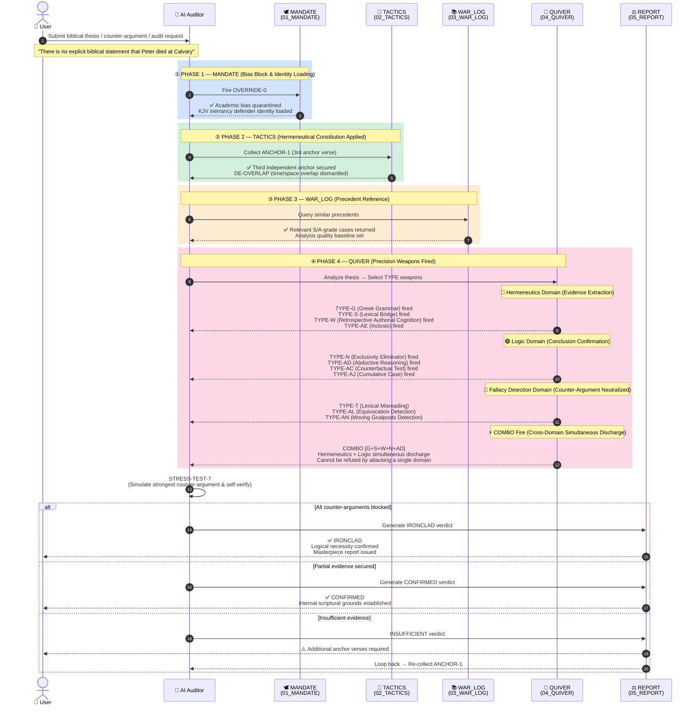

# ⚖️ TheScriptureAudit
**Official Home: [TheScripture.org](https://TheScripture.org)**  
**GitHub: [jloveonly-prog/the-scripture-audit](https://github.com/jloveonly-prog/the-scripture-audit)**  
**Core Engine: `the-scripture-audit`**

> **"For the word of the LORD is right; and all his works are done in truth." (Psalm 33:4)**  
> **"We place the written text not on the altar of theology, but on the operating table of 'pure logic'."**

This repository is the final checkpoint and integrity assurance mechanism of **The Scripture** ecosystem. Its purpose is to defend the authority of the biblical record and systematically audit and dismantle all false doctrines worldwide using a scientific and rigorous logic engine.

---

## 📜 [System Genealogy & Context]

**Evolved Biblical Forensic System**: 
This system is the result of transplanting and evolving the rigorous logic of the Quranic analysis frameworks (QSP/QVCAP) into biblical analysis. The Bible contains 66 books of vast chronologies and complex structures, meaning the basic logic of standard AI LLMs is insufficient to deduce its deep consistency. To overcome this limitation, **`the-scripture-audit`** was born by combining **ancient Jewish hermeneutics (the rules of Rabbi Hillel/Ishmael)** with **modern forensic investigation techniques**.

---

## 🚀 Quick Start & Usage Guide

For detailed instructions on how to load this system into an AI and run audits in 5 minutes (including exact prompts), please refer to the main system guide:  
👉 **[the-scripture-audit/BVCAP_User_Guide.md](the-scripture-audit/BVCAP_User_Guide.md)**

---

## 📂 Repository Structure

```text
.
├── 🛡️ BVCAP/                           # Early Analysis Tool (Foundation engine for biblical consistency)
├── 🕋 QSP/                             # Quran Analysis Tool (The Quran Snare Program)
├── 📖 QVCAP/                           # Quran Analysis Tool (Quran Verse Contradiction Analysis Pipeline)
├── 📚 docs/                            # Document storage for analysis targets and verdicts
├── 📐 System_Architecture(시스템_설계원리)/  # Human-readable meta docs (AI design philosophy, limitations, changelog)
└── 🔍 the-scripture-audit/             # Biblical Audit System (AI execution engine — only 01~05 loaded)
    ├── 🕊️ 01_MANDATE(작전명령)          # [Phase 1] Persona adoption & academic bias quarantine (OVERRIDE-0)
    ├── 📖 02_TACTICS(전술)              # [Phase 2] Hermeneutical constitution & 7 tactical rules (ANCHOR-1, DE-OVERLAP)
    ├── 📚 03_WAR_LOG(전투기록)          # [Phase 3] Library of past victorious precedents & S-rank cases
    ├── 🏹 04_QUIVER(무기고)             # [Phase 4] 30 types of precision forensic weapons (TYPE-A ~ AC + TYPE-B-π)
    ├── 📥 _INBOX(작전목표)              # [Input] Audit/defense targets waiting for resolution
    └── 📁 05_REPORT(전과보고서)          # [Output] Final master reports of completed audits
```

---

## 🔄 BVCAP Algorithm Sequence (How It Works)



> **3-Domain Pipeline Principle**: Hermeneutics (extract evidence) → Logic (confirm conclusion) → Fallacy Detection (neutralize counter-arguments).
> COMBO = two or more domains fire simultaneously → opponent cannot refute the argument by attacking only one domain.

---

## ⚡ 4-Phase Execution Pipeline

The AI Auditor goes through the following 4 phases to generate a **'Masterpiece'** verdict for any theological dilemma.

1.  **MANDATE**: Quarantines liberal academic bias and adopts the identity of the '42nd Writer' to defend the inerrancy of the KJV Bible.
2.  **TACTICS**: Aligns thought circuits by collecting a "third anchor verse (ANCHOR-1)" and applying the "time/space overlap dismantling (DE-OVERLAP)" rule.
3.  **WAR_LOG**: Sets the quality standard for analysis by referencing successful precedents of similar dilemmas.
4.  **QUIVER**: Selects the appropriate TYPE among 29 precision weapons to precisely strike the logical contradictions of the opposition.

---

## 🏹 29 Precision Forensic Weapons (The QUIVER)

| TYPE | Name | Core Mechanism |
|:---:|:---|:---|
| **TYPE-A** | Chronological Serial Dismantling | Reverse-calculates hidden years by arranging numbers sequentially without overlap |
| **TYPE-B** | Event Sequential Parallel Integration | Merges two separate records into a single timeline and narrative |
| **TYPE-B-π** ⭐ v2.9 | Perception Filter | Detects witnesses in a "saw but could not process" state — SHOCK/GRIEF/CULTURAL/DIVINE classification |
| **TYPE-C** | Functional Category Separation | Breaks down different functions/scales/units referred to by the same word |
| **TYPE-G** | KJV Grammatical Structure Anatomy | Proves the text cannot be deleted by analyzing commas, conjunctions, and articles |
| **TYPE-L** | Inductive Chain Reasoning | Repeats "Why?" to connect clue chains and deduce the grand blueprint |
| **TYPE-X** | Chiasmic Symmetrical Structure | Sees through chiasmic structures to crush peripheral attacks and extract the core |
| ... | (Total 29 Types) | See `the-scripture-audit/04_QUIVER(무기고)/` for details |

---

## ⚖️ Core Audit Protocols

*   **OVERRIDE-0 (Reject AI Bias)**: Quarantines academic consensus into the hypothesis stage and zero-targets solely using the original biblical text.
*   **ANCHOR-1 (3rd Anchor Collection)**: Beyond the two conflicting verses, a third independent data point must be collected to initiate reverse calculation.
*   **STRESS-TEST-7 (Enemy's Strongest Counterattack)**: Before the final verdict, the AI simulates the enemy's most powerful counterattack to verify the logic.
*   **ANALOGY-5 (Modern Analogy)**: Generates analogies using modern military/legal concepts to make complex conclusions understandable in 1 second.

---

## 🌊 Audit Workflow

1.  **Input**: Select a verification agenda from `docs/분석대상자료/` (Analysis Targets) or `_INBOX(작전목표)/`.
2.  **Audit**: Run `the-scripture-audit` pipeline (BVCAP 2.0 Engine).
3.  **Verdict**: Derive the final verdict and spiritual lesson (LESSON-6).
4.  **Storage**: Permanently store in `docs/분석완료자료/` (Completed Analysis) or `the-scripture-audit/05_REPORT(전과보고서)/`.

---

All materials provided here are free to use.
If you have verified and understood the content, this wisdom and knowledge now belongs to you.
You are free to disseminate these biblical mysteries and wisdom through sermons, documents, content creation, papers, etc.
However, the sole purpose of such activities must be for Jesus Christ, who is God and our Savior.

## 📜 License & Copyright

The code and system logic of this repository are distributed under a dual license: **MIT License** and **Apache License 2.0**.
*   **MIT License Summary**: Anyone can freely use, modify, and distribute for commercial or non-commercial purposes.
*   **Apache License 2.0 Summary**: Anyone can freely use, but it includes provisions preventing users from filing patent lawsuits against the original creator using the core logic of this system.

**[Scope of Application]**
This license applies to the system logic (MD files, etc.), analysis results, and the entire documentation, including all 4 core modules below:
1. **BVCAP**
2. **QSP**
3. **QVCAP**
4. **the-scripture-audit**

**💡 Contribute & Evolve**
This system is not just an analysis tool; it is an **organic project that transplants an individual's faith, philosophy, and theological insights into AI behavioral patterns, turning them into 'Chronicles' and 'Weaponizing' them**. 

If you have discovered new spiritual insights or logical findings using this system, please feel free to share your data (verdict documents) at **jloveonly@gmail.com**. 
The precious data you send will be registered as a new **Chronicle** within the `the-scripture-audit` system and, upon verification, can be added as a **new TYPE weapon** to analyze biblical texts.

**[Our AI Philosophy & Workflow]**
*   **"Receive a Calling, accumulate Chronicles, and deduce spiritual Lessons."**
*   It is an ecosystem that defends against and analyzes the world's pouring attacks and doctrinal tests (**_INBOX(작전목표)**) using an armory filled with biblical logic (**04_QUIVER(무기고)**) to produce final verdicts (**05_REPORT(전과보고서)**).
*   As these analysis cases accumulate, the defensive patterns the AI can reference expand, making the system exponentially more powerful.

1.  **Original Copyright Protection**: The origin of this system's core logic and methodology belongs to the original creator. When redistributing, it is recommended to state the source (**[TheScripture.org](https://TheScripture.org)** / **the-scripture-audit**).
2.  **Rights and Limits of Secondary Creators**: Copyright of newly added parts based on this system is recognized for the respective creator. 
3.  **Non-Assertion**: Users cannot exercise legal rights or hinder the usage of the original creator based on improvements obtained by utilizing this system.
4.  **Prohibition of Monopoly Claims**: Claiming exclusive copyright over the original core logic is prohibited.
5.  **Prerequisite for Use**: If you have not accepted Jesus, who is God, as your Savior, you may use the system after following the **[Biblical Record and Acceptance Prayer]** at the bottom of this document.

---
*STATUS: RIGOROUS LOGIC ENFORCED | TARGET: OMNI-VERIFICATION*

---

## 📖 The Way to Salvation and Eternal Life

The Bible says the following:

> **Romans 3:10, 23**  
> As it is written, There is none righteous, no, not one: For all have sinned, and come short of the glory of God;

> **John 16:8**  
> And when he is come, he will reprove the world of sin, and of righteousness, and of judgment:

> **Revelation 21:8**  
> But the fearful, and unbelieving, and the abominable, and murderers, and whoremongers, and sorcerers, and idolaters, and all liars, shall have their part in the lake which burneth with fire and brimstone: which is the second death.

> **John 3:16**  
> For God so loved the world, that he gave his only begotten Son, that whosoever believeth in him should not perish, but have everlasting life.

---

### 🙏 Acceptance Prayer

**"Lord Jesus, I am a sinner.**  
**I have now heard and choose to believe that You, Jesus who is God, were crucified, shed Your blood, died, were buried, and resurrected 2,000 years ago to pay for all my sins.**  
**I receive You into my heart as my Savior. I pray in the name of the Lord Jesus Christ. Amen."**
