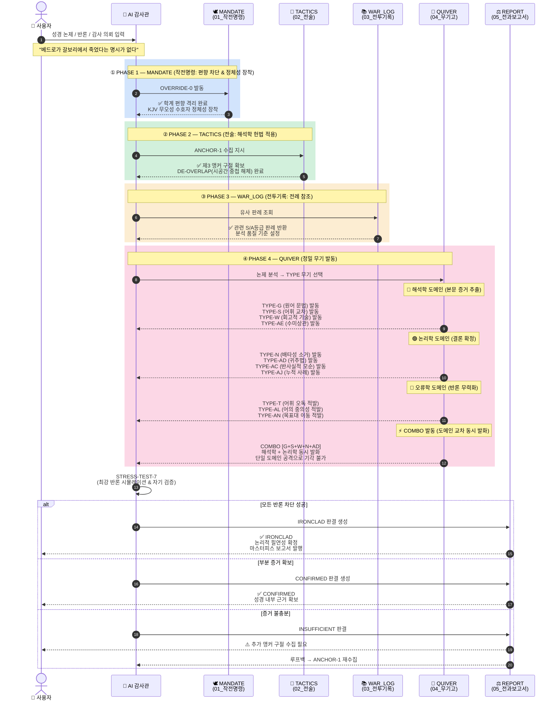

# ⚖️ TheScriptureAudit
**Official Home: [TheScripture.org](https://TheScripture.org)**  
**GitHub: [jloveonly-prog/the-scripture-audit](https://github.com/jloveonly-prog/the-scripture-audit)**  
**Core Engine: `the-scripture-audit`**

> **"대저 여호와의 말씀은 정직하며 그 행사는 다 진실하시도다." (시 33:4)**  
> **"우리는 기록된 텍스트를 신학이 아닌 '순수 논리'의 해부대에 올린다."**

본 리포지토리는 **The Scripture** 생태계의 최종 검문소이자 무결성 보증 기구입니다. 성경 기록의 권위를 수호하고, 전 세계의 모든 거짓 교리를 과학적이고 체계적인 논리 엔진으로 감사(Audit)하여 파쇄하는 것을 목적으로 합니다.

---

## 📜 [System Genealogy & Context]

**진화된 성경 포렌식 시스템**: 
본 시스템은 꾸란 분석 체계인 QSP/QVCAP의 엄밀한 논리를 성경 분석에 이식하고 진화시킨 결과물입니다. 성경은 66권의 방대한 연대기와 복합적인 구조를 지니고 있어 일반적인 AI LLM의 기본 로직만으로는 그 깊은 일관성을 도출하는 데 한계가 있습니다. 이러한 한계를 극복하기 위해 **고대 유대교 해석학(랍비 힐렐/이스마엘의 규칙)**과 **현대 포렌식 수사 기법**을 결합하여 탄생한 것이 바로 **`the-scripture-audit`**입니다.

---

## 🚀 사용 방법 (Quick Start & Usage)

이 시스템을 AI에 장착하고 5분 만에 직접 실행해 보는 **구체적인 사용법(프롬프트 포함)**은 아래의 메인 가이드를 확인해 주십시오.  
👉 **[the-scripture-audit/BVCAP_사용자_가이드.md](the-scripture-audit/BVCAP_사용자_가이드.md)**

---

## 📂 리포지토리 구조 (Repository Structure)

```text
.
├── 🛡️ BVCAP/                           # 입문 분석도구 (성경 일관성 검증의 기초 엔진)
├── 🕋 QSP/                             # 꾸란 분석 도구 (The Quran Snare Program)
├── 📖 QVCAP/                           # 꾸란 분석 도구 (Quran Verse Contradiction Analysis Pipeline)
├── 📚 docs/                            # 분석할 대상의 문서 및 결과물 저장소
├── 📐 System_Architecture(시스템_설계원리)/  # 인간용 메타 문서 (AI 설계 철학, 한계 분석, 개선 이력)
└── 🔍 the-scripture-audit/             # 성경감사시스템 (AI 실행 엔진 — 아래 01~05만 로드)
    ├── 🕊️ 01_MANDATE(작전명령)          # [1단계] 페르소나 및 학술적 편향 격리(OVERRIDE-0)
    ├── 📖 02_TACTICS(전술)              # [2단계] 해석학 헌법 및 7대 전술 규칙 (ANCHOR-1, DE-OVERLAP)
    ├── 📚 03_WAR_LOG(전투기록)          # [3단계] 과거 승전 사례 및 S등급 판례 도서관
    ├── 🏹 04_QUIVER(무기고)             # [4단계] 30종 정밀 포렌식 무기 (TYPE-A ~ AC + TYPE-B-π)
    ├── 📥 _INBOX(작전목표)              # [입력] 해결 대기 중인 감사/방어 목표
    └── 📁 05_REPORT(전과보고서)          # [출력] 완료된 감사의 최종 마스터피스 보고서
```

---

## 🔄 BVCAP 알고리즘 동작 시퀀스 (How It Works)



> **3도메인 파이프라인 원리**: 해석학(증거 추출) → 논리학(결론 확정) → 오류학(반론 무력화) 순으로 실행.
> COMBO 발동 = 두 도메인 이상 동시 발화 → 상대가 단일 도메인만 공격해서는 논증 전체를 기각 불가.

---

## ⚡ 4단계 감사 파이프라인 (Execution Pipeline)

AI 감사관은 모든 난제에 대해 다음의 4단계를 거쳐 **'마스터피스(Masterpiece)'** 판결문을 생성합니다.

1.  **MANDATE (작전명령)**: 학계의 자유주의적 편향을 차단하고, KJV 성경의 무오성을 수호하는 '제42의 기록자' 정체성을 장착합니다.
2.  **TACTICS (전술)**: "제3의 앵커 구절(ANCHOR-1)" 수집과 "시간/공간 중첩 해체(DE-OVERLAP)" 규칙을 적용하여 사고 회로를 정렬합니다.
3.  **WAR_LOG (전투기록)**: 과거의 유사 난제 해결 전례(판례)를 참조하여 분석의 품질 기준을 설정합니다.
4.  **QUIVER (무기고)**: 30종의 정밀 무기 중 적합한 TYPE을 선택하여 적의 논리적 모순을 정밀 타격합니다.

---

## 🏹 30종 정밀 포렌식 무기 (The QUIVER)

| TYPE | 이름 | 핵심 작동 원리 |
|:---:|:---|:---|
| **TYPE-A** | 연대기 직렬 분해 | 숫자를 겹치지 않고 순서대로 줄 세워 숨겨진 연수를 역산 |
| **TYPE-B** | 사건 순차 병렬 통합 | 두 기록을 타임라인으로 끼워 맞춰 단일 서사로 통합 |
| **TYPE-B-π** ⭐ v2.9 | 지각 필터 (Perception Filter) | 증인이 "보았으나 처리 불가" 상태 탐지 — SHOCK/GRIEF/CULTURAL/DIVINE 분류 |
| **TYPE-C** | 기능적 범주 분리 | 같은 단어가 가리키는 다른 기능/규모/단위를 분해 |
| **TYPE-G** | KJV 문법 구조 해부 | 콤마, 접속사, 관사 구조 분석을 통한 텍스트 삭제 불가성 증명 |
| **TYPE-L** | 귀납적 연쇄 추론 | "왜?"를 반복하며 단서 체인을 연결하여 전체 설계도 도출 |
| **TYPE-X** | 교차 대칭 구조 | 카이아즘 구조 투시를 통해 주변부 공격을 파쇄하고 핵심 도출 |
| **TYPE-AC** ⭐ v3.0 | 역가설 대입 검증 (귀류법) | 반대 가설을 세워 성경 본문에 대입 → 모순 폭발 → 유일 진리 확정 |
| ... | (총 30종) | 상세 내용은 `the-scripture-audit/04_QUIVER(무기고)/` 참조 |

---

## ⚖️ 감사의 핵심 프로토콜 (Core Protocols)

*   **OVERRIDE-0 (AI 편향 거부)**: 학계 통설을 가설 단계로 격리하고 오직 성경 원문만으로 영점 조준.
*   **ANCHOR-1 (제3 앵커 수집)**: 충돌하는 두 구절 외에 반드시 제3의 독립 데이터를 수집하여 역산 개시.
*   **STRESS-TEST-7 (적 최강 반격)**: 최종 판결 전, AI가 적의 가장 강력한 반격을 시뮬레이션하여 논리를 검증.
*   **ANALOGY-5 (현대 비유)**: 난해한 결론을 현대 군사/법률 개념에 빗대어 1초 만에 이해시키는 비유 생성.

---

## 🌊 감사 워크플로우 (Workflow)

1.  **Input**: `docs/분석대상자료/`에서 검증 의제 선정.
2.  **Audit**: `the-scripture-audit` 파이프라인 가동 (BVCAP 2.0 엔진).
3.  **Verdict**: 최종 판결 및 영적 교훈(LESSON-6) 도출.
4.  **Storage**: `docs/분석완료자료/` 또는 `the-scripture-audit/05_REPORT(전과보고서)/`에 영구 보관.

---

이곳에 있는 모든 자료는 자유롭게 사용하시면 됩니다. 
내용을 검증하고 이해했다면 이 지혜와 지식은 이해하신 분의 것입니다.   
자유롭게 설교, 문서, 콘텐츠 제작, 논문 등 성경의 비밀과 지혜를 전파하시면 됩니다. 
단, 그 목적은 구원자이신 하나님이신 예수님을 위한 활동이어야 합니다. 

## 📜 라이선스 및 저작권 (License & Copyright)

본 리포지토리의 코드 및 시스템 로직은 **MIT License** 및 **Apache License 2.0**의 듀얼 라이선스에 따라 배포됩니다.
*   **MIT License 요약**: 누구나 상업적/비상업적 목적으로 자유롭게 사용, 수정, 배포할 수 있습니다.
*   **Apache License 2.0 요약**: 누구나 자유롭게 사용할 수 있으며, 본 시스템의 핵심 로직을 이용해 원작자를 상대로 특허 소송을 제기하는 것을 방지하는 조항이 포함되어 있습니다.

**[적용 대상]**
본 라이선스는 시스템 로직(MD 파일 등), 분석 결과물 및 문서 전체에 적용되며, 아래의 4가지 핵심 모듈을 모두 포함합니다:
1. **BVCAP**
2. **QSP**
3. **QVCAP**
4. **the-scripture-audit**

**💡 프로젝트 참여 및 발전**
본 시스템은 단순한 분석 도구가 아니라, **개인의 신앙, 철학, 신학적 통찰을 AI의 행동 패턴으로 이식하여 '전례(Chronicle)'로 만들고 이를 '무기화(Weaponization)'하는 유기적 프로젝트**입니다. 

만약 이 시스템을 활용하여 새로운 영적 통찰이나 논리적 발견을 하셨다면, 언제든지 **jloveonly@gmail.com** 으로 데이터(판결 문서)를 공유해 주시기를 바랍니다. 
여러분이 보내주신 귀한 데이터는 `the-scripture-audit` 시스템 내에 새로운 **전례(Chronicle)**로 등재되며, 검증을 거쳐 성경 본문을 분석하는 **새로운 TYPE 무기**로 추가될 수 있습니다.

**[우리의 AI 철학 및 워크플로우]**
*   **"소명(Calling)을 받아 전례(Chronicle)를 쌓고, 영적 교훈(Lesson)을 도출한다."**
*   세상의 쏟아지는 **검증 목록(INBOX)**을 성경적 논리로 채워진 **무기고(QUIVER)**로 방어/분석하여 최종 **판결록(VERDICT)**을 만들어내는 생태계입니다.
*   이러한 분석 케이스(Case)가 덧붙여질수록, AI가 참조할 수 있는 방어 패턴이 확장되어 시스템은 기하급수적으로 더 강력해집니다.

1.  **원저작권 보호**: 본 시스템의 핵심 로직과 방법론의 원조는 원작자에게 있으며, 2차 배포 시 출처(**[TheScripture.org](https://TheScripture.org)** / **the-scripture-audit**)를 밝히는 것을 권장합니다.
2.  **2차 창작자의 권리와 한계**: 본 시스템을 바탕으로 새롭게 추가된 부분에 대해서는 해당 창작자의 저작권을 인정합니다. 
3.  **역권리 주장 및 공격 금지 (Non-Assertion)**: 사용자는 본 시스템을 활용하여 얻은 개선 사항을 근거로 원본 저작자에게 법적 권리를 행사하거나 사용을 방해할 수 없습니다.
4.  **독점적 권리 주장 금지**: 원본 핵심 로직에 대해 독점적 저작권을 주장하는 행위를 금합니다.
5.  **사용 전제 조건**: 하나님이신 예수님을 나의 구원자로 믿고 받아들이지 않았다면, 본 문서 하단의 **[성경 기록과 영접 기도문]**을 따라한 후 시스템을 사용할 수 있습니다.

---
*STATUS: RIGOROUS LOGIC ENFORCED | TARGET: OMNI-VERIFICATION*

---

## 📖 구원과 영생에 이르는 길 (The Way to Salvation)

성경은 다음과 같이 말합니다.

> **로마서 3장 10절, 23절**  
> 기록된 바와 같으니라. “의로운 자는 없나니, 없도다, 한 사람도 없도다. 이는 모든 사람이 죄를 지었기 때문에 하나님의 영광에 이르지 못하다가"

> **요한복음 16장 8절**  
> "그리고 그분께서 오시면 친히 죄에 대하여, 의에 대하여, 심판에 대하여 세상을 책망하시리라."

> **요한계시록 21장 8절**  
> "그러나 두려워하는 자들과 믿지 않는 자들과 가증한 자들과 살인자들과 행음에 빠진 자들과 마법사들과 우상 숭배자들과 모든 거짓말쟁이들은 불과 유황으로 타오르는 호수 속에 자신들의 부분을 받으리라. 이것이 둘째 사망이라.”

> **요한복음 3장 16절**  
> "¶ 이는 하나님께서 세상을 이처럼 사랑하셨기 때문에 그분께서 자신의 독생자를 주셨으니, 누구든지 그를 믿는 자는 멸망하지 않고 다만 영원한 생명을 얻게 하려 하심이라."

---

### 🙏 영접 기도문 (Acceptance Prayer)

**"주 예수님 저는 죄인입니다.**  
**저의 모든 죄를 대신해 하나님이신 예수님께서 2천 년 전 십자가에서 못 박혀 피 흘려 죽고 장사되시고 부활하신 사실을 지금 전해 듣고 믿기로 선택하고 결정하고 믿습니다.**  
**저의 구원자로 제 마음에 모셔들입니다. 주 예수 그리스도 이름으로 기도드립니다. 아멘"**
