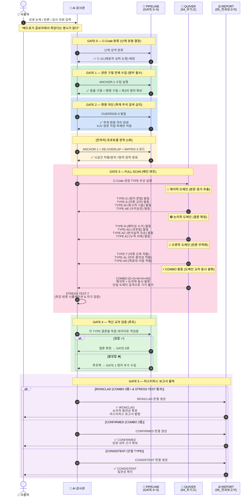

# ⚖️ TheScriptureAudit
**Official Home: [TheScripture.org](https://TheScripture.org)**  
**GitHub: [jloveonly-prog/the-scripture-audit](https://github.com/jloveonly-prog/the-scripture-audit)**  
**Core Engine: `the-scripture-audit`**

> **"대저 여호와의 말씀은 정직하며 그 행사는 다 진실하시도다." (시 33:4)**  
> **"우리는 기록된 텍스트를 신학이 아닌 '순수 논리'의 해부대에 올린다."**

본 리포지토리는 **The Scripture** 생태계의 최종 검문소이자 무결성 보증 기구입니다. 성경 기록의 권위를 수호하고, 전 세계의 모든 거짓 교리를 과학적이고 체계적인 논리 엔진으로 감사(Audit)하여 파쇄하는 것을 목적으로 합니다.

---

## 📜 [System Genealogy & Context]

**진화된 성경 포렌식 시스템**: 
본 시스템은 꾸란 분석 체계인 QSP/QVCAP의 엄밀한 논리를 성경 분석에 이식하고 진화시킨 결과물입니다. 성경은 66권의 방대한 연대기와 복합적인 구조를 지니고 있어 일반적인 AI LLM의 기본 로직만으로는 그 깊은 일관성을 도출하는 데 한계가 있습니다. 이러한 한계를 극복하기 위해 **고대 유대교 해석학(랍비 힐렐/이스마엘의 규칙)**과 **현대 포렌식 수사 기법**을 결합하여 탄생한 것이 바로 **`the-scripture-audit`**입니다.

---

## 🚀 사용 방법 (Quick Start & Usage)

이 시스템을 AI에 장착하고 5분 만에 직접 실행해 보는 **구체적인 사용법(프롬프트 포함)**은 아래의 메인 가이드를 확인해 주십시오.  
👉 **[the-scripture-audit/BVCAP_사용자_가이드.md](the-scripture-audit/BVCAP_사용자_가이드.md)**

---

## 📂 리포지토리 구조 (Repository Structure)

```text
.
├── 🛡️ BVCAP/                           # 입문 분석도구 (성경 일관성 검증의 기초 엔진)
├── 🕋 QSP/                             # 꾸란 분석 도구 (The Quran Snare Program)
├── 📖 QVCAP/                           # 꾸란 분석 도구 (Quran Verse Contradiction Analysis Pipeline)
├── 📚 docs/                            # 분석할 대상의 문서 및 결과물 저장소
├── 📐 System_Architecture(시스템_설계원리)/  # 인간용 메타 문서 (AI 설계 철학, 한계 분석, 개선 이력)
└── 🔍 the-scripture-audit/             # 성경감사시스템 (AI 실행 엔진 — 아래 01~05만 로드)
    ├── 🕊️ 01_MANDATE(작전명령)          # [1단계] 페르소나 및 학술적 편향 격리(OVERRIDE-0)
    ├── 📖 02_TACTICS(전술)              # [2단계] 해석학 헌법 및 7대 전술 규칙 (ANCHOR-1, DE-OVERLAP)
    ├── 📚 03_WAR_LOG(전투기록)          # [3단계] 과거 승전 사례 및 S등급 판례 도서관
    ├── 🏹 04_QUIVER(무기고)             # [4단계] 전종 정밀 포렌식 무기 (TYPE-A ~ AQ + TYPE-B-π)
    ├── 📥 _INBOX(작전목표)              # [입력] 해결 대기 중인 감사/방어 목표
    └── 📁 05_REPORT(전과보고서)          # [출력] 완료된 감사의 최종 마스터피스 보고서
```

---

## 🔄 BVCAP 알고리즘 동작 시퀀스 (How It Works)



> **GATE 기반 파이프라인**: GATE 0(분류) → GATE 1(수집) → GATE 2(편향 차단) → GATE 3(FULL SCAN) → GATE 4(역산 검증) → GATE 5(보고서).
> COMBO 발동 = 두 도메인 이상 동시 발화 → 상대가 단일 도메인만 공격해서는 논증 전체를 기각 불가.

---

## ⚡ 4단계 감사 파이프라인 — 시스템 구조와 각 폴더의 역할

AI 감사관은 모든 난제에 대해 다음의 4단계를 거쳐 **'마스터피스(Masterpiece)'** 판결문을 생성합니다.

1.  **MANDATE (작전명령)**: 학계의 자유주의적 편향을 차단하고, KJV 성경의 무오성을 수호하는 '제42의 기록자' 정체성을 장착합니다.
2.  **TACTICS (전술)**: "제3의 앵커 구절(ANCHOR-1)" 수집과 "시간/공간 중첩 해체(DE-OVERLAP)" 규칙을 적용하여 사고 회로를 정렬합니다.
3.  **WAR_LOG (전투기록)**: 과거의 유사 난제 해결 전례(판례)를 참조하여 분석의 품질 기준을 설정합니다.
4.  **QUIVER (무기고)**: 전종 정밀 무기 중 적합한 TYPE을 선택하여 적의 논리적 모순을 정밀 타격합니다.

---

## 🎯 GATE 기반 실행 파이프라인 — AI가 실제로 따르는 실행 순서

> 위의 4단계가 "각 폴더가 무엇을 하는가"라면, 아래는 **AI가 난제를 받았을 때 실제로 밟는 실행 순서**입니다.

0.  **GATE 0 (C-Code 분류)**: 난제의 유형을 13개 C-Code(C-01~C-13)로 분류하여 분석 방향을 설정합니다.
1.  **GATE 1 (구절 수집)**: 충돌 구절 + 병행 구절 + **제3의 앵커 구절**을 의무 수집합니다. → `02_TACTICS` 참조
2.  **GATE 2 (편향 차단)**: 학계 통설을 가설(H0)로 격리하고, KJV 원문 직접 독해만으로 분석합니다. → `01_MANDATE` 참조
3.  **GATE 3 (FULL SCAN)**: 전종 무기(TYPE-A~AQ)를 순차 발동하고, COMBO 검증 및 STRESS-TEST-7을 실행합니다. → `04_QUIVER` + `03_WAR_LOG` 참조
4.  **GATE 4 (역산 검증)**: 각 TYPE의 결론을 제3의 독립 데이터로 역산 교차 검증합니다. 불정합 시 GATE 1로 회귀합니다.
5.  **GATE 5 (보고서 출력)**: Phase 1~6 마스터피스 양식으로 최종 판결을 출력합니다. → `05_REPORT` 출력

---

## 🏹 전종 정밀 포렌식 무기 (The QUIVER)

| TYPE | 이름 | 핵심 작동 원리 |
|:---:|:---|:---|
| **TYPE-A** | 연대기 직렬 분해 | 숫자를 겹치지 않고 순서대로 줄 세워 숨겨진 연수를 역산 |
| **TYPE-B** | 사건 순차 병렬 통합 | 두 기록을 타임라인으로 끼워 맞춰 단일 서사로 통합 |
| **TYPE-B-π** | 지각 필터 (Perception Filter) | 증인이 "보았으나 처리 불가" 상태 탐지 — SHOCK/GRIEF/CULTURAL/DIVINE 분류 |
| **TYPE-C** | 기능적 범주 분리 | 같은 단어가 가리키는 다른 기능/규모/단위를 분해 |
| **TYPE-G** | KJV 문법 구조 해부 | 콤마, 접속사, 관사 구조 분석을 통한 텍스트 삭제 불가성 증명 |
| **TYPE-L** | 귀납적 연쇄 추론 | "왜?"를 반복하며 단서 체인을 연결하여 전체 설계도 도출 |
| **TYPE-N** | 배타성 검증 | 패턴이 오직 이 한 대상에만 적용됨을 전수 조사로 확정 |
| **TYPE-AC** | 역가설 대입 검증 (귀류법) | 반대 가설을 세워 성경 본문에 대입 → 모순 폭발 → 유일 진리 확정 |
| **TYPE-AQ** | 청중비평 (Audience Criticism) | 원래 청중이 어떻게 이해했는지를 텍스트 내에서 직접 확인 |
| ... | **(전종)** | 상세 내용은 `the-scripture-audit/04_QUIVER(무기고)/` 참조 |

---

## ⚖️ 감사의 핵심 프로토콜 (Core Protocols)

*   **OVERRIDE-0 (AI 편향 거부)**: 학계 통설을 가설 단계로 격리하고 오직 성경 원문만으로 영점 조준.
*   **ANCHOR-1 (제3 앵커 수집)**: 충돌하는 두 구절 외에 반드시 제3의 독립 데이터를 수집하여 역산 개시.
*   **STRESS-TEST-7 (적 최강 반격)**: 최종 판결 전, AI가 적의 가장 강력한 반격을 시뮬레이션하여 논리를 검증.
*   **ANALOGY-5 (현대 비유)**: 난해한 결론을 현대 군사/법률 개념에 빗대어 1초 만에 이해시키는 비유 생성.

---

## 🌊 감사 워크플로우 (Workflow)

1.  **Input**: `docs/분석대상자료/`에서 검증 의제 선정.
2.  **Audit**: `the-scripture-audit` 파이프라인 가동 (BVCAP 2.0 엔진).
3.  **Verdict**: 최종 판결 및 영적 교훈(LESSON-6) 도출.
4.  **Storage**: `docs/분석완료자료/` 또는 `the-scripture-audit/05_REPORT(전과보고서)/`에 영구 보관.

---

## 🛠️ 개발자 서문 (Developer's Preface)


예수님은 말씀입니다. WORD 우리들은 단어의 조합 언어로 소통합니다. 컴퓨터 프로그램도 단어의 조합 소스 코드(source code)로 개발하죠.

'없음' 구절이 없는 더 완전한 성경이 있다는 걸 알았을 때 성경을 바라보던 시선이 달라졌던 것 같습니다.
프로그램 개발자로 나도 모르게 성경을 완벽한 소스 코드처럼 읽으며 공부한 게 아닌가 생각됩니다.

그리고 AI 시대에 접어들었고 어쩔 수 없이 AI를 공부해야 하는 위치에서 직장에서 집에서 실전에 적용했습니다.
이슬람 꾸란의 오류를 찾는 분석이 본격적인 시작이었고 그 분석 방식을 역으로 적용해
성경이 모순이 없음을 증명하기 위해 적용해 보았지만 결과물은 기대 이하였습니다.
단순 GPT 검색 결과 수준이었죠.

성경 분석은 완전히 다른 설계가 필요했습니다.
거대 언어 LLM(AI)는 믿음의 선배분들과 신학자들이 이루어 놓은 수많은 진리의 지식과 지혜가 학습되어 있습니다.
BVCAP은 새로운 진리를 만들지 않습니다. 성경 안에 이미 있지만 아직 연결되지 않은 진리의 지식을 끝까지 추적해서 결과(추론)를 찾아내도록 설계되었습니다.

성경을 진리로 신뢰하는 신앙인의 입장에서 **(정체성)**  
다양한 본문 분석 방식으로 **(전략전술)**  
실전 경험을 참고하여 **(전투기록)**  
다양한 논리 도구를 들고 **(무기창고)**  
하나씩 순차적으로 사용하거나, 콤보 공격 또는 예상 반론 검증 방식으로 **(파이프라인)** 동작합니다.

그래서 성경의 어떤 교리나 반론이나 모순을 찾을 때 혼자서는 닿기 어려운 분석 깊이를 만들어냅니다.
그러니까 든든하고 유능한 믿음의 선배분들의 지혜와 지식 데이터가 뒤에서 받쳐주는 것과 같습니다.

분석 결과는 보고서로 출력됩니다. **(전과보고서)**  
보고서의 결과가 이전에 없던 논리나 방식을 사용했다면 전투기록과 무기창고에 장착하여 **(선순환)**  
다음 분석 때 그대로 활용할 수 있게 됩니다.
이로써 장착된 무기가 40개가 넘으며 논리학, 해석학, 신학 등의 학문과 IT 기술이 함께 들어가 있습니다.

다만 BVCAP의 보고서가 100% 정답은 아닙니다. 잘못된 답도 합니다.
문제에 당면했을 때 하나님의 지혜를 구하는 기도를 하는 것도 사실입니다.

보고서의 결과에 개인적으로 100% 확신하진 못합니다. 저는 프로그램 개발자지 신학자는 아니니까요.
마지막 검증은 유능한 신학자 분들에게 맡겨야 한다고 생각합니다.

성경은 진리죠?  
그런데 왜 난제가 있죠?  
BVCAP 프로그램을 하나님이 허락하신 건 아닐까요?


---

이곳에 있는 모든 자료는 자유롭게 사용하시면 됩니다.
다만 그 목적은 구원자이신 하나님이신 예수님을 위한 활동이기를 바랍니다.
내용을 검증하고 이해했다면 이 지혜와 지식은 이해하신 분의 것입니다.
자유롭게 설교, 문서, 콘텐츠 제작, 논문 등 성경의 비밀과 지혜를 전파하시면 됩니다.

## 📜 라이선스 및 저작권 (License & Copyright)

본 리포지토리의 코드 및 시스템 로직은 **MIT License** 및 **Apache License 2.0**의 듀얼 라이선스에 따라 배포됩니다.
*   **MIT License 요약**: 누구나 상업적/비상업적 목적으로 자유롭게 사용, 수정, 배포할 수 있습니다.
*   **Apache License 2.0 요약**: 누구나 자유롭게 사용할 수 있으며, 본 시스템의 핵심 로직을 이용해 원작자를 상대로 특허 소송을 제기하는 것을 방지하는 조항이 포함되어 있습니다.

**[적용 대상]**
본 라이선스는 시스템 로직(MD 파일 등), 분석 결과물 및 문서 전체에 적용되며, 아래의 4가지 핵심 모듈을 모두 포함합니다:
1. **BVCAP**
2. **QSP**
3. **QVCAP**
4. **the-scripture-audit**

**💡 프로젝트 참여 및 발전**
본 시스템은 단순한 분석 도구가 아니라, **개인의 신앙과 실전 분석 경험을 AI의 행동 패턴으로 이식하여 '전례(Chronicle)'로 만들고 이를 '무기화(Weaponization)'하는 유기적 프로젝트**입니다. 

만약 이 시스템을 활용하여 새로운 영적 통찰이나 논리적 발견을 하셨다면, 언제든지 **jloveonly@gmail.com** 으로 데이터(판결 문서)를 공유해 주시기를 바랍니다. 
여러분이 보내주신 귀한 데이터는 `the-scripture-audit` 시스템 내에 새로운 **전례(Chronicle)**로 등재되며, 검증을 거쳐 성경 본문을 분석하는 **새로운 TYPE 무기**로 추가될 수 있습니다.

**[우리의 AI 철학 및 워크플로우]**
*   **"소명(Calling)을 받아 전례(Chronicle)를 쌓고, 영적 교훈(Lesson)을 도출한다."**
*   세상의 쏟아지는 **검증 목록(INBOX)**을 성경적 논리로 채워진 **무기고(QUIVER)**로 방어/분석하여 최종 **판결록(VERDICT)**을 만들어내는 생태계입니다.
*   이러한 분석 케이스(Case)가 덧붙여질수록, AI가 참조할 수 있는 방어 패턴이 확장되어 시스템은 기하급수적으로 더 강력해집니다.

1.  **원저작권 보호**: 본 시스템의 핵심 로직과 방법론의 원조는 원작자에게 있으며, 2차 배포 시 출처(**[TheScripture.org](https://TheScripture.org)** / **the-scripture-audit**)를 밝히는 것을 권장합니다.
2.  **2차 창작자의 권리와 한계**: 본 시스템을 바탕으로 새롭게 추가된 부분에 대해서는 해당 창작자의 저작권을 인정합니다. 
3.  **역권리 주장 및 공격 금지 (Non-Assertion)**: 사용자는 본 시스템을 활용하여 얻은 개선 사항을 근거로 원본 저작자에게 법적 권리를 행사하거나 사용을 방해할 수 없습니다.
4.  **독점적 권리 주장 금지**: 원본 핵심 로직에 대해 독점적 저작권을 주장하는 행위를 금합니다.
5.  **사용 전제 조건**: 하나님이신 예수님을 나의 구원자로 믿고 받아들이지 않았다면, 본 문서 하단의 **[성경 기록과 영접 기도문]**을 따라한 후 시스템을 사용할 수 있습니다.

---
*STATUS: RIGOROUS LOGIC ENFORCED | TARGET: OMNI-VERIFICATION*

---

## 📖 구원과 영생에 이르는 길 (The Way to Salvation)

성경은 다음과 같이 말합니다.

> **로마서 3장 10절, 23절**  
> 기록된 바와 같으니라. “의로운 자는 없나니, 없도다, 한 사람도 없도다. 이는 모든 사람이 죄를 지었기 때문에 하나님의 영광에 이르지 못하다가"

> **요한복음 16장 8절**  
> "그리고 그분께서 오시면 친히 죄에 대하여, 의에 대하여, 심판에 대하여 세상을 책망하시리라."

> **요한계시록 21장 8절**  
> "그러나 두려워하는 자들과 믿지 않는 자들과 가증한 자들과 살인자들과 행음에 빠진 자들과 마법사들과 우상 숭배자들과 모든 거짓말쟁이들은 불과 유황으로 타오르는 호수 속에 자신들의 부분을 받으리라. 이것이 둘째 사망이라.”

> **요한복음 3장 16절**  
> "¶ 이는 하나님께서 세상을 이처럼 사랑하셨기 때문에 그분께서 자신의 독생자를 주셨으니, 누구든지 그를 믿는 자는 멸망하지 않고 다만 영원한 생명을 얻게 하려 하심이라."

---

### 🙏 영접 기도문 (Acceptance Prayer)

**"주 예수님 저는 죄인입니다.**  
**저의 모든 죄를 대신해 하나님이신 예수님께서 2천 년 전 십자가에서 못 박혀 피 흘려 죽고 장사되시고 부활하신 사실을 지금 전해 듣고 믿기로 선택하고 결정하고 믿습니다.**  
**저의 구원자로 제 마음에 모셔들입니다. 주 예수 그리스도 이름으로 기도드립니다. 아멘"**
