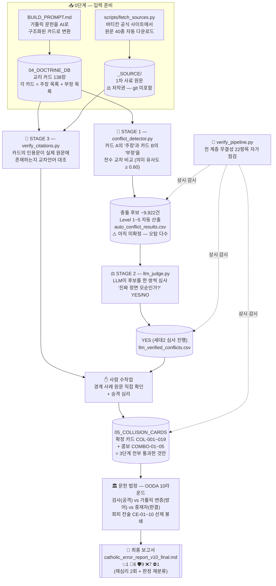
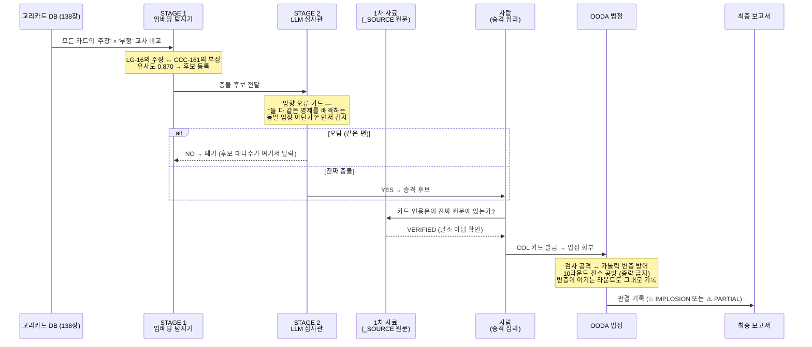

# 🛡️ The Catholic Audit (가톨릭 감사 파이프라인)

본 프로젝트는 가톨릭 교리의 구조적, 역사적, 신학적 모순을 검증하고 포렌식하기 위해 구축된 **CVCAP (Catholic Vault & Conciliar Audit Pipeline)** 시스템의 지휘 본부입니다.

> 📖 이 문서는 "**어떻게** 돌아가는가"(순서도·실행 가이드·저작권)를 다룹니다. "**왜** 이렇게 설계했는가"(py를 쓴 이유, 파이프라인의 합당성, 상대 방어 방식의 철학적 정체, SVAP과의 차이 비교표)는 **[README_HELP.md](./README_HELP.md)** 를 보십시오.

## 🧭 v3.0 아키텍처: 가톨릭 내부 문헌 전용 엔진 (Internal-Documents-Only)

CVCAP 3.0은 **가톨릭 자체 문헌(CCC, 공의회, 교황 선언, 교회법, 신앙교리부, 교부 문헌)만을 증거로 사용하는 단일 트랙 엔진**입니다.

> **성경 검증과의 관계**: 구버전(v2.0)은 BVCAP(성경 검증 파이프라인)을 임포트하여 듀얼트랙으로 운영했으나, 한 엔진이 두 법정을 동시에 돌리며 발생하는 부하와 문서 표류 때문에 v3.0에서 완전 분리했습니다.
> - **성경 법정** (가톨릭 교리 vs 성경 원문) → `../the-scripture-audit/` (BVCAP) 담당
> - **문헌 법정** (가톨릭 문헌 vs 가톨릭 문헌) → **본 엔진 (CVCAP)** 담당
> - 최종 콘텐츠 제작 단계에서 **두 엔진의 완성된 보고서를 병합**하며, 같은 교리에 대해 양측 모두 붕괴가 확정되면 통합 보고서에서 🔴 CHECKMATE를 선언합니다.
> - 가톨릭 특화 성경 무기는 가톨릭 전용 자산이므로 `03_QUIVER/CATHOLIC_TARGETED_WEAPONS.md`에 보관합니다. 단 이 카드들은 성경 법정(BVCAP) 관할이므로 문헌 법정 논증에는 사용하지 않고, BVCAP 검증·최종 병합 단계에서만 사용합니다.

### 왜 내부 문헌 전용인가: "내부 붕괴(Implosion) 전략"

가톨릭을 상대할 때 **'개신교(성경) vs 가톨릭(전통)'**의 구도로 싸우면 평행선 논쟁으로 끝납니다. 가톨릭은 성경에서 불리한 증거가 나오면 언제든 **"성경이 전부가 아니다. 교회의 '성전(전통)'과 교황의 '교도권(Magisterium)'이 해석할 권위를 가진다"**며 링 밖으로 도망치기 때문입니다.

가장 치명적인 타격은 **'가톨릭 vs 가톨릭'**, 즉 가톨릭 시스템 스스로가 자기 교리를 파괴하게 만드는 **내부 붕괴(Implosion)** 전략입니다. 본 엔진은 본래 꾸란의 절대 무오성을 타격하기 위해 개발되었던 **QVCAP의 극한 논리 타격 방식(10라운드 OODA 루프, 귀류법, 양도논법)**을 가톨릭 내부 문헌에 적용하여, 그들의 2,000년 된 전통과 권위 자체가 논리적으로 파탄 났음을 그들의 문헌만으로 입증합니다.

#### 🎯 3대 핵심 타격 전략

1.  **무류성의 자기모순 적발 (Papal vs Papal / Council vs Council)**
    과거 교황·공의회의 선언과 현대의 선언이 어떻게 서로를 이단으로 정죄하는지를 데이터로 폭로합니다. 과거 공의회(트렌트 — "이신칭의는 저주받는다")와 현대 제2차 바티칸 공의회(타 종교 포용, 칭의 공동 선언)를 병렬로 놓고, 둘 중 하나는 반드시 오류임을 양도논법(L-04)으로 입증합니다. 무류성이 한 번이라도 깨지면 시스템 전체가 붕괴합니다.
2.  **전통의 조작 포렌식 (Tradition vs History)**
    "초대 교회부터 내려온 사도적 전통"이라는 주장을 **'초기 교부 문헌'** 데이터로 검증합니다. "1~3세기 교부 문헌 어디에 마리아 승천이 있는가?"를 추적하여, '전통'이 실은 후대에 추가된 교리임을 입증합니다 (첫 언급의 법칙·침묵 논증).
3.  **율법화된 은총의 자기모순 공격 (Grace vs Merit)**
    CCC 내부의 논리적 데드락을 파고듭니다. "구원은 거저 주시는 은총"(CCC 1996)이라 말하면서 "공로를 세워 영생을 얻는다"(CCC 2010)고 말하는 내부 모순을 귀류법(L-01)과 소크라테스 문답법(L-06)으로 타격합니다.

---

## 🔍 이 시스템은 어떻게 동작하는가 (처음 보는 사람용)

한 문장으로 요약하면 이렇습니다:

> **가톨릭 공식 문헌들을 "카드"로 쪼개서 → 기계가 서로 부딪히는 쌍을 찾고 → AI가 진짜 모순인지 심사하고 → 원문과 대조해 날조가 아닌지 확인한 뒤 → 통과한 것만 법정 형식의 공방(검사 vs 가톨릭 변증)에 부쳐 최종 판결을 내리는 파이프라인.**

핵심 설계 사상은 **"한 단계도 믿지 않는다"** 입니다. 기계 탐지는 오탐이 많고, AI 심사는 흔들릴 수 있고, 카드 자체가 잘못 만들어졌을 수도 있습니다. 그래서 서로 다른 방식의 검증 3단계를 **전부** 통과한 것만 "확정 카드(COL)"가 되고, 확정 카드만 최종 보고서에 실립니다.

### 전체 순서도



### 충돌 후보 하나의 여정 (시퀀스 다이어그램)

실제 사례(COL-015: "믿음 없이는 구원 없다" vs "복음을 못 들은 자도 구원 가능")가 걸러지는 과정입니다:



### 왜 이렇게 복잡한가 — 각 단계가 잡는 오류

| 단계 | 잡아내는 오류 | 실측 사례 |
|:---|:---|:---|
| STAGE 1 오탐 필터 | 어휘만 비슷하고 논리는 무관한 쌍 | "세례는 의무" vs "미사는 선택" — 문장 구조만 유사 |
| STAGE 2 방향 가드 | A와 B가 **같은 명제를 함께 배격**하는데 충돌로 오인 | 2026-07 실측: 상위 100건 중 오탐 9건이 이 유형 |
| STAGE 3 원문 대조 | AI가 카드를 만들 때 섞였을 수 있는 **날조 인용(환각)** | 138장 전수 대조 — 원문 대응 96.4%, 환각 0건 — 그러나 대조 전엔 알 수 없었음 |
| 사람 수작업 | 자동 점수가 낮게 나온 경계 사례 | 6건 전건 "카드는 맞고 검증기 한계"로 확인 |
| OODA 법정 | 살아남은 모순도 가톨릭 방어가 실제로 성립하면 **PARTIAL로 하향** | COL-017: 검사 4승 5패 — 그대로 기록 |
| **적대 재심리 (v7)** | 검사·중재와 **다른 모델**(Opus 5)의 변호가 기소 자체의 인용 결함을 적발 | 8건 재심 하향 — 원문에 없는 인용·삭제된 한정절·코퍼스 외 증거 전건 직권 검증 |

---

## 🚀 실행 가이드 (Quick Start)

### 1. 사전 준비물

| 준비물 | 어디서 받나 | 용도 |
|:---|:---|:---|
| Python 3.10+ | https://www.python.org (실측 검증 버전: 3.14.2) | 전 스크립트 실행 |
| Python 패키지 | `pip install sentence-transformers scikit-learn pypdf requests beautifulsoup4` | 임베딩·크롤·PDF |
| Claude Code CLI | https://claude.com/claude-code — 설치 후 로그인 | **STAGE 2 전용** (API 키 불필요, 로그인 세션만 있으면 됨). 없으면 STAGE 2만 건너뛰고 나머지는 실행 가능 |
| 임베딩 모델 2종 | 별도 다운로드 불필요 — 첫 실행 시 Hugging Face에서 **자동 다운로드** (`paraphrase-multilingual-MiniLM-L12-v2`, `LaBSE` 합계 약 2GB) | STAGE 1 / STAGE 3 |
| 인터넷 연결 | — | 원문·모델 다운로드 시에만 필요 |

### 2. git에 없는 것을 먼저 받아야 합니다 (중요)

저장소를 클론해도 **`04_DOCTRINE_DB/_SOURCE/` 폴더는 비어 있습니다** — 저작권 때문에 의도적으로 커밋하지 않기 때문입니다(아래 ⚖️ 저작권 정리 참조). 파이프라인의 STAGE 3(원문 대조)은 이 폴더가 없으면 동작하지 않으므로, **가장 먼저 이것부터 실행하십시오**:

```bash
python scripts/fetch_sources.py
```

이 한 줄이 바티칸 공식 사이트(vatican.va)와 papalencyclicals.net에서 원문 40종(가톨릭 교리서 2,863항 포함, 총 ~4MB)을 자동으로 받아 `_SOURCE/`를 만들어 줍니다. 사이트 개편 등으로 자동 수집이 실패하면, **문서별 직접 다운로드 URL 전체 목록**이 `07_REPORT/catholic_error_report_v8_final.md`의 **PART 4-3**에 있으니 거기서 수동으로 받아 같은 파일명으로 저장하면 됩니다.

### 3. 전체 실행 순서

```bash
# ① 1차 사료 수집 (위 2번 — 최초 1회)
python scripts/fetch_sources.py

# ② STAGE 1 — 교리 카드 교차 스캔 → 충돌 후보 CSV 생성
python scripts/conflict_detector.py

# ③ STAGE 2 — LLM 전수 심사 (Claude Code CLI 필요)
python scripts/llm_judge.py next 3000

# ④ STAGE 3 — 카드 인용문 ↔ 원문 대조 (날조 검사)
python scripts/verify_citations.py --json

# ⑤ 전 계층 무결성 자가 점검 — "22/22 통과"가 나와야 정상
python scripts/verify_pipeline.py

# ⑥ 시각화 재생성 (선택)
python scripts/generate_verified_network.py
```

**기대 결과**: 후보 ~9,922건(Level 1~5 컬럼 포함) → 인용검증 138장 중 원문 대응 133장(96.4%) → LLM 심사는 규모상 단계 진행(세대 구분 필수). 단계별 사용 모델 ID와 상세 재현 명세는 v8 보고서 **PART 4**, 적대 재심리·승격 심리 절차는 **PART 5** 참조.

**새 교리 카드를 추가했을 때**: `04_DOCTRINE_DB/`에 `schema.md` 형식으로 카드를 넣은 뒤 위 ②~⑤를 다시 돌리면 됩니다. 새 충돌 후보가 나오면 STAGE 2 심사 → 수작업 확인 → `05_COLLISION_CARDS/`에 COL 카드 등록 → OODA 법정 회부 순서로 승격시킵니다.

---

## ⚖️ 저작권 정리 — 무엇이 git에 없고, 왜 없고, 어떻게 받나

| 자료 | git 포함? | 이유 | 어떻게 얻나 |
|:---|:---:|:---|:---|
| 교리 카드 138장 (`04_DOCTRINE_DB/*.md`) | ✅ 포함 | 원문 발췌 인용 + 자체 분석 — 공정이용 범위 | 클론하면 있음 |
| 확정 카드·보고서·스크립트 전부 | ✅ 포함 | 자체 저작물 | 클론하면 있음 |
| **`_SOURCE/` 원문 40종** | ❌ **미포함** (`.gitignore`) | 39종 중 **21종은 LEV(교황청 출판사) 저작권**(CCC 2,863항 + 바티칸2차 4 + 20세기 이후 교황/신앙교리부 8 + 교회법전 8) — 전문(全文) 재배포는 발췌 인용과 달리 공정이용으로 방어되지 않음 | `python scripts/fetch_sources.py` 자동 수집, 또는 v7 보고서 PART 4-3의 URL 목록에서 수동 다운로드 |
| └ 그중 원문이 퍼블릭 도메인인 18종 (트렌트 8·중세 공의회 6·바티칸1차·19세기 이전 교황 3) | ❌ 미포함 | ① 원문(라틴어)은 자유지만 우리가 받은 건 **현대 영어 번역본**이라 번역 저작권이 별도로 성립할 수 있음(수집처 사이트가 자체 © 표기) ② 폴더를 쪼개면 파일마다 법적 판단이 필요해져 실수 위험 — 폴더째 제외가 안전 | 위와 동일. 각 파일 첫 줄의 `# LICENSE:` 헤더로 파일 단위 구분 가능 |

> 🗂️ **`_SOURCE/`의 정체 (혼동 주의)**: 이 폴더는 **KO 저장소 안에 있지만 내용물은 전부 영문**입니다. 한글 문서의 영어 번역본(그건 EN 저장소 `01.TheScriptureAudit`의 역할)이 아니라, 바티칸 공식 사이트에서 받은 **제3자 원문**입니다. 한국어 교리 카드의 인용이 날조가 아닌지 교차언어(LaBSE) 대조하는 검증 전용 원자료로, `_INBOX`와 같은 범주입니다 — **KO/EN 번역쌍(doc_no) 체계의 대상이 아니고, sync-translate가 EN 저장소로 이관하지도 않습니다.** (CCC 한국어 공식판은 주교회의(CBCK) 저작권·비공개라 수집 불가 → 바티칸 공식 영문판이 대조 기준)
| 임베딩 모델 2종 | ❌ 미포함 | 대용량(~2GB) + Hugging Face가 원 배포처 | 스크립트 첫 실행 시 자동 다운로드 |

**지켜야 할 규칙 3가지**:
1. `_SOURCE/`를 **절대 커밋하거나 공개 채널에 올리지 않는다** (`.gitignore`가 막고 있지만 `-f` 강제 추가도 금지).
2. 원문 **전문 재배포 금지** — 로컬 검증 용도로만 보관한다. 보고서가 하는 **발췌 인용**(출처 명시 + 비평 목적)과 전문 재배포는 법적으로 전혀 다른 행위다.
3. 이 방침은 생태계 공통이다 — `the-scripture-audit`의 `KJV_KO_표준.json`(한글 대역 데이터)을 다루는 방식과 동일.

---

## ⚠️ 현재 상태 및 알려진 이슈 (2026-08-30 갱신)

> **👉 지금 읽어야 할 파일은 하나입니다: `07_REPORT/catholic_error_report_v6_final.md` (최종 통합본).**
> 아래 v2~v5와 구버전 보고서들은 전부 v6에 흡수된 이력 문서입니다.

- **`07_REPORT/catholic_error_report.md`** (구버전, 16부작)은 내용 자체(인용·논증)는 정확하지만, **`CVCAP_Pipeline.md`가 규정한 정식 출력 양식(OODA 10라운드 전수 기술 + CE-Code 01~10 선제 봉쇄 + L-Code 명시)을 따르지 않습니다.** 각 항목이 "주장 A vs B + 짧은 판독 결과" 요약 형식이라, 정식 문헌 법정 절차(검사-변증-중재자 공방전)를 생략한 상태입니다.
- **`07_REPORT/catholic_error_report_1오탐포함.md`**은 더 오래된 중간 초안입니다. 이 파일이 자체 신고한 "오탐 1건"은 실제 `llm_judge_full_log.csv` 대조 검증 결과 과소 신고였습니다 — 21건 자동탐지 후보 중 다수가 재심사에서 NO 판정을 받았고, 같은 쌍이 재실행마다 YES/NO로 엇갈리는 비결정성도 확인됐습니다. **참고용 히스토리로만 보고, 인용하지 마십시오.**
- 신뢰할 수 있는 것은 `05_COLLISION_CARDS/confirmed/`의 COL-001~014(자동탐지→LLM심사→원문대조 3단계 통과)와 `combos/`의 COMBO-01~05입니다.
- **`07_REPORT/catholic_error_report_v10_final.md`** (2026-09-02 완성) — **최종 통합본 · 판정 재분류판.**
  v9까지 24건 중 23건이 `PARTIAL` 한 칸에 몰려 판정이 정보를 주지 못했고, **"우리 기소가 틀렸다"와
  "상대에게 진짜 문제가 남았다"가 같은 라벨**을 쓰고 있었습니다. 실제 판시 사유대로 5개 코드로 분리:
  **💥 IMPLOSION 1 / 🔄 LOOP 6 / 🛡️ DEFENDED 9 / ❌ WITHDRAWN 7 / ⛔ OUT OF SCOPE 1.**
  쉬운 설명판도 현행 판정을 맨 위로 올리고 폐기된 원심은 「판정 이력」으로 내렸습니다.
- `07_REPORT/catholic_error_report_v9_final.md` (구버전, v10에 흡수) — 전 항목 교차검증 완료판.
  v8의 IMPLOSION 9건 중 아직 다른 모델의 반박을 받지 않았던 8건 전부를 2차 적대 재심리에 회부해
  전건 PARTIAL로 하향시켰습니다. **최종 판정: IMPLOSION 1건(#13) / PARTIAL 23건.** 원심(자기 대국
  self-play)이 구조적으로 관대했다는 실측 결과를 숨기지 않고 그대로 실었습니다.
- `07_REPORT/catholic_error_report_v8_final.md` (구버전, v9에 흡수) — 전 항목 승격 완료판.
  v7 전체에 **세대2(claude-sonnet-5) 전수 심사 완주**(9,922건, YES 75)와, 그중 발굴된 완전 신규 쟁점
  2건(로마 수위권 기원 서사 325→1215, 공의회 우위론 vs 교황 무류·수위권)의 정식 3단계 검증·OODA 10라운드
  승격 심리를 더했습니다. **24개 항목**(IMPLOSION 9 / PARTIAL 15) · 240라운드 · 확정 카드 19장.
- `07_REPORT/catholic_error_report_v7_final.md` (구버전, v8에 흡수) — 적대 재심리 완료판.
  검사·변증·중재를 한 모델이 맡던 자기 대국 구조를 깨고 **변호인에 Opus 5, 중재에 Fable 5**를 배정해
  IMPLOSION 6건을 재심리했다. 변호인이 기소 본문의 **인용 결함**(원문에 없는 문장, 삭제된 한정절,
  코퍼스 외 증거)을 적발했고 재판부가 전건 직권 검증으로 확인 → **8건 하향, 최종 IMPLOSION 9 / PARTIAL 13**.
  살아남은 9건은 다른 모델의 전력 변호를 견딘 항목들이다(#10·#13은 변호인이 방어 불가 자인).
  기반: 카드 138장(원문 직독 생성 64장 포함, 대응 96.4%) · 후보 9,922건(Level 1~5 자동 산출).
- `07_REPORT/catholic_error_report_v6_final.md` (구버전, v7에 흡수) — 재현 가능판.
  v5 전체에 **PART 4 재현성 명세**를 더했습니다: 단계별 사용 AI 모델의 정확한 ID(전수 심사 `claude-haiku-4-5-20251001` 스냅샷 고정,
  승격 심리 `claude-sonnet-5`, 인용 검증 `LaBSE`, 최종 검증 `claude-fable-5`), 저작권으로 git에서 제외된 원문 39종의
  **직접 다운로드 URL 전체**(vatican.va / papalencyclicals.net), 그리고 클론→동일 결과 재현 명령 6단계.
  다른 사람이 같은 파이프라인을 돌려 같은 결과 구조를 얻을 수 있습니다.
- `07_REPORT/catholic_error_report_v5_final.md` (구버전, v6에 흡수) — 승격 완료판.
  v4까지 "비고(미검증 3건)"로 격리돼 있던 항목을 정식 3단계 검증에 회부해 **COL-015~017로 승격**했습니다.
  이제 미검증 비고 항목이 없습니다. **총 22개 항목 · 220라운드 · IMPLOSION 17 / PARTIAL 5.**
  ⚠️ 승격된 3건은 **전부 PARTIAL**입니다 — 가톨릭 측 방어가 실제로 강했고(특히 22번 림보는 ITC 2007 문서
  자신이 "림보는 교의적 정의에 들어간 적 없다"고 방어 논거를 제공), 그 결과를 그대로 실었습니다.
- `07_REPORT/catholic_error_report_v4_final.md` (구버전, v5에 흡수) — **1차 사료 대조 완료판.**
  v3의 모든 내용에 **PART 3 사료 검증 계층**을 더했다. `scripts/fetch_sources.py`로 가톨릭 교리서(CCC 2,863항)·트렌트 공의회·
  에큐메니컬 공의회·교황 문서·교회법전 원문을 직접 수집하고, `scripts/verify_citations.py`(교차언어 LaBSE 임베딩)로
  교리 카드 71장을 전수 대조했다 — **원문 대응 확인 65장(91.5%), 날조 인용 0건**. 낮은 점수 6건은 전부 사람이
  원문을 직접 열어 확인했고 모두 카드가 아니라 검증기·사료 쪽 한계였다. **1차 참고 자료로 이 파일을 쓰십시오.**
  ⚖️ 수집한 원문(`04_DOCTRINE_DB/_SOURCE/`)은 LEV 저작권 문헌을 포함하므로 `.gitignore`로 제외되어 커밋되지 않는다.
- `07_REPORT/catholic_error_report_v3_final.md` (구버전, v4에 흡수) — PART 1(쉬운 설명판 19건) + PART 2(정식 OODA 10라운드 190라운드 + CE-Code 선제봉쇄) + 비고 3건. 내용은 v4가 전부 포함하므로 v4를 보십시오. `catholic_error_report_v2_ooda.md`(OODA만)와 `catholic_error_report.md`(요약본)도 구버전입니다.
- CVCAP 전용 "쉬운 말 원칙"은 `CVCAP_GHQ.md`에 정식 등록되어 있습니다 (SVAP의 D-1B를 이식하되, CVCAP은 전제가 A/B 둘이라 "왜 그럴듯한가" 단계 없이 A해설/B해설/왜무너지는가/비유/판정 5단 구조로 다름).

---

## 📂 폴더 구조 및 역할 (CVCAP 3.0 기준)

### 🏛️ 핵심 엔진 파일 (3계층)
- `CVCAP_GHQ.md` : **사령부(GHQ)** — 전략·CD-Code·CE-Code(01~10)·판결 체계·출력 양식·부팅 프로토콜.
- `CVCAP_Pipeline.md` : **전술 교범** — 문헌 법정 OODA 10라운드 실행 절차, L-Code(01~08).
- `CVCAP_3.0_METHODOLOGY.md` : **자동화 엔진 명세** — 교리 DB 자동 충돌 탐지, 8대 논리 필터, 콤보 엔진, 충돌 등급 Level 1~5.

> 구버전 설계 문서(`CVCAP_1.0.md`, `CVCAP_2.0.md`)는 위 3개 문서로 흡수 후 삭제되었습니다 (git 이력 보존).

### 📁 폴더 구조
- `01_MANDATE/` : 가톨릭 감사 특화 AI 에이전트 작동 명령서.
- `02_TACTICS/` : 핵심 타격 전술 + 가톨릭 문헌 데이터베이스(`CATHOLIC_VAULT.md`).
- `03_QUIVER/` : 문헌 법정 Implosion 무기 카드 — `QVCAP_WEAPONS.md` (파탄 카드 1~6).
- `04_DOCTRINE_DB/` : 구조화된 교리 카드 DB (`schema.md` 기준) — `scripts/conflict_detector.py`의 입력 소스. 카드 수는 부팅 시 실측.
  - `_SOURCE/` : **1차 사료 원문 — ⚠️ 영문** (`fetch_sources.py` 수집분, 39종 = CCC 2,863항 + 공의회·교황문서·교회법 38건). KO 저장소 안에 있지만 한글 번역 대상이 아닌 **제3자 영문 원자료**다(검증 전용, doc_no 체계 밖 — 위 ⚖️ 저작권 정리의 박스 참조). LEV 저작권 21종 포함이라 `.gitignore`로 제외되며 커밋되지 않는다. 없으면 `python scripts/fetch_sources.py`로 재수집.
- `05_COLLISION_CARDS/` : 수작업으로 확정(confirmed)된 충돌 카드 및 콤보(combos) 카드.
- `06_ZERO_DAY/` : 신규 문헌 발간 시 우선 스캔할 충돌 후보 목록.
- `07_REPORT/` : 마스터피스 보고서 저장소 — `REPORT_INDEX.md`, `catholic_error_report.md`, 자동 탐지 CSV/HTML 산출물 포함.
- `scripts/` : 자동화 스크립트
  - `fetch_sources.py` : **1차 사료 수집** (BVCAP의 `fetch_kjv_ko.py`에 대응)
  - `verify_citations.py` : **카드 인용문 ↔ 원문 대조 검증** (교차언어 LaBSE 임베딩)
  - `conflict_detector.py` : 임베딩 충돌 탐지 · `llm_judge.py` : LLM 2차 심사 · `run_cvcap_combos.py` : 콤보 태깅
  - `verify_pipeline.py` : 전 계층 무결성 22항목 자가 점검 · `generate_verified_network.py` : 검증 완료 19건 시각화

---

## ⚖️ 법적 안전성 및 면책 조항 (Legal & Fair Use Disclaimer)

본 프로젝트(CVCAP)는 헌법상 보장된 **'표현의 자유'**와 **'종교 비판의 자유'**에 입각하여 수행되는 학술적이고 논리적인 교리 검증 시스템입니다.

1. **명예훼손 및 모욕죄 면책**: 본 프로젝트의 분석 대상은 특정 개인이 아니라, 가톨릭이라는 **제도(System), 교리(Doctrine), 역사적 문헌(Texts)**입니다. 시스템 내부에서 사용되는 "붕괴(Implosion), 파탄, 파괴" 등의 용어는 논리적 모순과 분석 방법론의 강도를 표현하는 학술적·수사적 메타포일 뿐, 폭력 선동(Hate Speech)이나 특정 개인에 대한 비방 목적이 전혀 없으므로 명예훼손에 해당하지 않습니다.
2. **저작권법상의 공정이용 (Fair Use)**: CVCAP 엔진이 분석 데이터로 활용하는 트렌트 공의회, 제1차 바티칸 공의회, 초기 교부 문헌 등은 이미 저작권 보호 기간이 만료된 **퍼블릭 도메인(Public Domain)**입니다. 또한 《가톨릭 교회 교리서(CCC)》 등 현대 문헌의 일부를 발췌 인용하는 행위 역시, 맹목적으로 복제하는 것이 아니라 **'학술적 연구, 비평, 검증 및 논평'**을 목적으로 정당한 범위 내에서 이루어지는 것이므로 전 세계 저작권법이 엄격하게 보호하는 **공정이용(Fair Use)**에 완벽하게 부합합니다.

본 파이프라인의 결과물은 순수한 논리학(귀류법, 양도논법)과 포렌식 데이터에 기반한 학술적 비평 텍스트로서, 어떠한 세속 법정에서도 문제 되지 않는 완벽한 방어력을 갖추고 있습니다.

---
*Generated by CVCAP 3.0 (Catholic Vault & Conciliar Audit Pipeline)*
*Architecture: Internal-Documents-Only Single-Track + Automation Layer*
*Target: Evidence-Based Implosion of Magisterium and Tradition*
