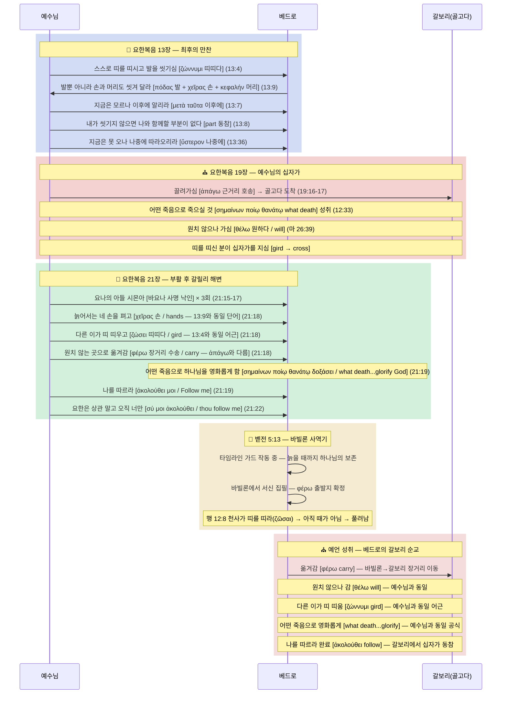

# 베드로 갈보리로 향하는 거대한 여정 (진정한 최종 완성본) 구조적 명시

베드로가 골고다에서 죽었다는 직접 명시는 없죠.
그러나 구조적 명시는 있습니다.

십자가를 지시기 전날 밤 세족식에서 예수님이 베드로의 발을 씻기려 하십니다. 베드로가 이를 거절하자 예수님은 다른 제자들이 아닌, 오직 베드로 단 한 사람에게만 이렇게 말씀하십니다.

"내가 하는 것을 지금은 네가 모르나 이후에는 네가 알리라." (요 13:7)

그러자 베드로가 말합니다. "주님, 내 발뿐 아니라 손과 머리도 씻어 주옵소서!"

성경에서 진정한 '앎(깨달음)'은 자신이 직접 몸으로 경험해야만 비로소 완성되는 것입니다. 예수님이 모든 제자가 아닌 베드로 단 한 사람에게만 배타적으로 "네가 알게 될 것"이라고 하신 이유는 명확합니다. 베드로는 이때 세족식이 단순히 죄를 씻는 것인 줄만 알았습니다. 평생 자신이 갈보리에서 죽을 것을 모르고 살았던 것입니다. 그러나 이 장면은 훗날 베드로가 주님과 똑같은 모습으로 십자가형을 당할 때 상처가 날 부위(손과 발의 못, 머리의 가시 면류관)를 정확히 암시하는 거대한 복선이었습니다.

만찬 자리에서 예수님은 제자들 전체(아이들아)를 향해 이렇게 말씀하십니다. "내가 가는 곳에 너희는 올 수 없다." 이 말씀은 육신을 입고는 당장 갈 수 없는 '천국'을 의미했습니다.

그런데 베드로가 묻습니다. "주여, 어디로 가시나이까?" 그러자 예수님은 베드로 단 한 사람에게만 완전히 다른 대답을 하십니다. "내가 가는 곳에 네가 지금은 따라올 수 없으나, 나중에는 따라오리라."

이때 예수님이 쓰신 헬라어 단어들을 해부해보면 놀라운 사실이 드러납니다. 예수님은 영적인 상태를 뜻하는 단어가 아니라, 두 발로 땅을 밟고 걸어가는 물리적 이동 동사(휘파고, ὑπάγω)를 쓰셨습니다. 또한 '따라온다(아콜루데오, ἀκολουθέω)' 역시 누군가의 뒤를 똑같이 걸어서 따라가는 물리적 동행을 뜻합니다.

즉, 이 말씀은 "네가 나중에 천국에 올 것이다"라는 뜻이 아닙니다. **"내가 지금 당장 피 흘리며 걸어가는 이 길(갈보리 십자가)을, 너는 지금 당장은 못 오지만 훗날 똑같이 걸어서 따라오게 될 것이다"**라는 무시무시한 물리적 장소에 대한 예언이었습니다.

예수님이 "지금은 따라올 수 없다"고 하신 이유는 곧바로 증명됩니다. 그날 밤, 베드로는 예루살렘에서 예수님을 세 번이나 저주하며 부인하고 도망칩니다. 그는 주님이 십자가를 지러 가시는 길을 따라가지 못했습니다.

한편, 예수님은 겟세마네 동산에서 땀이 피가 되도록 기도하십니다. "내 뜻대로(원하는 대로, θέλω) 마시옵고 아버지의 뜻대로 하옵소서." 예수님은 자신의 인간적인 의지(원함)를 꺾고 타의에 이끌려 갈보리로 끌려가십니다.

여기서 이 주장의 가장 핵심적인 사실이 등장합니다. 요한복음을 미래에 기록했던 사도 요한은, 19장 뒷구절에서 예수님이 가신 곳이 '골고다' 지역임을 본인 스스로 명시하여(구조적 명시) 기록했습니다. 따라서 이전 구절인 13장에서 예수님이 "내가 가는 곳"이라고 하신 그 장소가 바로 골고다이고, 베드로가 나중에 갈 곳 역시 골고다임이 이 두 개의 구절만으로 성경 안에 완벽하게 명시가 된 것입니다.

부활하신 예수님이 디베랴 바닷가(갈릴리 바다)에서 베드로를 다시 만나십니다. 그리고 그의 죽음에 대해 예언하십니다. "네가 늙어서는 네 팔을 벌리리니 남이 네게 띠 띠우고 네가 원하지 아니하는 곳(θέλω)으로 데려가리라."

예수님이 십자가 앞에서 "원치 않으나" 가셨던 것처럼, 베드로 역시 "원치 않는 곳"으로 끌려갈 것이라는 소름 돋는 평행 구조가 완성됩니다. 예수님은 이 죽음이 "하나님을 영화롭게(독사조, δοξάζω) 할 것"이라고 못 박으십니다.

성경은 이 사실을 어휘의 독점으로 다시 한번 못 박습니다. 신약 성경 전체를 통틀어 "영화롭게 하다"라는 표현과 "어떠한 죽음으로" 죽을 것인지에 대한 구절은 오직 베드로와 예수님, 단 두 사람에게만 독점적으로 기록되어 있습니다. 이런 철저한 배타성은 두 사람의 죽음이 완전히 동일함을 강력하게 주장합니다.

그리고 예수님은 베드로에게 **"너는 나를 따르라!"**라고 명령하십니다. 요한복음 13장에서 "나중에는 따라오리라"고 열어두셨던 예언의 스위치를, 21장에서 마침내 "따르라"며 닫아버리신 것입니다.

이때 요한이 쫓아오는 것을 본 베드로가 "요한은 어떻게 됩니까?"라고 묻자, 예수님은 단호하게 요한을 배제하시며 **"오직 너는(쉬, σύ) 나를 따르라"**고 쐐기를 박으십니다. 만약 '따름'이 그저 예수님을 위해 죽는 평범한 순교라면 요한을 배제할 이유가 없습니다. 다른 제자들도 다 순교했으니까요. 이 '따름'은 오직 베드로 한 사람만이 겪게 될 매우 특수하고 배타적인 사건, 즉 주님이 달리신 바로 그 장소(갈보리)에서 주님이 당하신 똑같은 고난을 의미합니다.

세월이 흘러 베드로는 노년이 됩니다. 그는 로마가 아니라, 아주 먼 동방의 실제 도시 '바빌론'에서 사역하며 편지(베드로전서)를 씁니다. 여기서 그가 실제 이방에 있었기 때문에 동역자인 유대인 마가와 실라의 이름조차 헬라어식 발음(마르코스, 실루아노)으로 기록되었습니다. (이것도 증거 중 하나입니다.)

그는 이 편지에서 자신을 "그리스도의 고난의 증인"(벧전 5:1)이라고 부릅니다. 놀라운 사실은, 베드로는 주님이 십자가에서 고난받으실 때 도망쳤기에 그 고난을 눈으로 똑똑히 보지도 못했고, 편지를 쓸 당시에는 아직 자신이 십자가 고난을 당하지도 않았다는 점입니다. 그런데도 굳이 '고난'의 증인이라고 쓴 이유는 무엇일까요? 이는 자신이 장차 갈보리로 끌려가 주님이 받으신 그 십자가 고난을 몸소 당함으로써 증명해 낼 것을 완벽하게 알고 쓴 소름 돋는 '자기 예언'이었습니다. 그는 수십 년 전, 예수님이 "네가 죽음으로 하나님을 영화롭게 할 것이다"라고 하신 말씀을 평생 가슴에 품고, 다른 사도들은 감히 쓰지 못했던 "영광(독사, δόξα)의 면류관"이라는 표현을 집착하듯 반복해서 사용했습니다.

마침내 때가 이르렀습니다. 예수님의 예언대로 베드로는 결박되어 끌려갑니다. 성경 원어는 이때 '페로(φέρω)'라는 동사를 씁니다. 이는 가까운 거리가 아니라 사람을 아주 먼 곳으로 장거리 호송할 때 쓰는 단어입니다. 베드로는 동방 바빌론에서 서쪽 예루살렘으로 기나긴 압송을 당합니다.

사형장으로 끌려온 죽음의 직전, 베드로는 그제야 수십 년 전 세족식 때 오직 자신에게만 하셨던 **"이후에는 네가 알리라"**는 말씀의 의미를 비로소 '직접적인 경험'으로 깨닫습니다. 자신이 끌려온 곳이 바로 예수님이 가셨던 그곳, 갈보리임을 알게 된 것입니다!

예수님이 다른 제자들이 아닌 **오직 베드로에게만 "네가 알리라"**고 하셨고, **오직 베드로에게만 "따라오리라"**고 하셨던 그 완벽한 배타성의 퍼즐이 마침내 하나로 합쳐지는 순간입니다. 주님이 가신 그 길(갈보리)을 홀로 따라가, 머리와 손과 발에 십자가의 고난을 똑같이 '경험'할 사람이 세상에 오직 베드로 한 사람뿐이었기 때문입니다.

"나는 감히 내 주님과 똑같은 방향으로 십자가에 달릴 자격조차 없는 놈입니다. 나를 거꾸로 매달아 주십시오!"

베드로가 거꾸로 십자가에 달렸다는 전승이 사실이라면? 그 장소가 갈보리일 때에만 심리학적으로 100% 완벽하게 설명됩니다.

💡 [에필로그] 두 번의 십자가와 예루살렘의 멸망
그렇다면 왜 하나님은 갈보리라는 동일한 장소에 예수님과 베드로, 두 사람을 세우셨을까요? 성경의 율법에서 어떤 죄를 심판하려면 반드시 **'두 명의 증인'**이 필요합니다.

하나님은 예수님을 십자가에 못 박은 유대인들과 예루살렘을 심판하시기 전, 완벽한 법적 절차를 밟으셨습니다. 첫 번째 증인인 예수님이 갈보리에서 십자가에 달리신 후(약 AD 30년경), 유대인들에게는 회개할 충분한 시간이 주어졌습니다.

그리고 약 30여 년이 흘러, 마침내 하나님의 심판이 임박했을 때(약 AD 64~67년경), 하나님은 동방 바빌론에 있던 베드로를 다시 예루살렘 갈보리로 부르셨습니다. 베드로가 갈보리에서 거꾸로 십자가에 달려 피를 흘림으로써, 유대인들을 향한 하나님의 **'두 번째이자 마지막 경고(두 증인의 법칙)'**가 완벽하게 채워졌습니다.

그리고 베드로가 두 번째 증인으로 순교한 직후인 AD 70년, 로마 군대에 의해 예루살렘은 돌 하나도 돌 위에 남지 않고 철저하게 멸망당하고 맙니다.

결국 예수님과 베드로의 갈보리 십자가는, 하나님의 자비로운 두 번의 경고이자 완벽한 심판의 타이밍을 맞춘 가장 위대하고도 두려운 구속사의 시나리오였던 것입니다!

---

# 베드로는 어디서 죽었는가 — 성경 내부 논리로만 추적한 결론

*이 글은 역사 자료나 교회 전통이 아닌, 오직 성경 텍스트의 내부 논리만으로 베드로의 순교 장소를 추적한 변증 분석입니다.*

---

## 들어가며 — 왜 이 질문을 다시 해야 하는가

"베드로는 로마에서 죽었다." 대부분의 기독교인이 이것을 상식처럼 받아들입니다. 그런데 신기하게도 성경 어디에도 "베드로가 로마에서 순교했다"는 문장은 없습니다. 이것은 성경이 아니라 교회 전통이 만들어낸 결론입니다.

그렇다면 성경 텍스트만 가지고 추적하면 베드로의 순교 장소는 어디를 가리킬까요? 이 글은 바로 그 질문에 답합니다.

결론을 먼저 말씀드리겠습니다.

> **성경 내부 논리에서 가장 강력하고 일관된 해석은 갈보리(골고다)입니다. 성경이 직접 "갈보리에서 죽었다"고 명시하지는 않습니다. 그러나 모든 대안 해석은 성경 내부에서 모순을 만들어내고, 갈보리 해석만이 모순 없이 성립합니다.**

---

## 첫 번째 논점 — "따라가라"는 명령이 가리키는 목적지

요한복음 13장에서 예수님은 최후의 만찬 자리에서 제자들에게 말씀하십니다.

> *"내가 가는 곳에 너희는 지금은 올 수 없다."* (요 13:33, KJV: "Whither I go, ye **cannot come**")

그러자 베드로가 묻습니다. "주여, 어디로 가십니까?" 예수님의 대답이 핵심입니다.

> *"내가 가는 곳에 네가 지금은(ἄρτι) 따라올 수 없지만, 나중에(ὕστερον) 따라오리라."* (요 13:36)

여기서 두 개의 헬라어 시간 부사가 결정적입니다. **ἄρτι(아르티)**는 "지금 이 순간"을 의미하고, **ὕστερον(휘스테론)**은 "나중에, 이후에"를 의미합니다. 예수님은 지금은 안 되지만 **나중에는 가능하다**고 말씀하신 겁니다.

자, 이제 핵심 질문입니다. 예수님이 가시려는 그 장소는 어디였을까요?

만약 그 장소가 **천국(하늘)**이라면, 논리가 무너집니다. 베드로만 나중에 천국에 가는 게 아니라 모든 제자가 구원받아 천국에 갑니다. 33절에서 예수님이 "너희(모든 제자)는 지금 올 수 없다"고 하셨으니, 모든 제자가 나중에 천국에 갈 수 없다는 뜻이 됩니까? 말이 안 됩니다.

그렇다면 이 장소는 천국이 아닌 **지금 이 땅 위의 어떤 물리적 장소**여야 합니다. 예수님이 그날 밤 이후 물리적으로 이동하신 최종 목적지가 어디였습니까? **골고다(갈보리)**입니다. 겟세마네 → 대제사장 뜰 → 빌라도 법정 → 골고다. 그것이 예수님의 마지막 여정이었습니다.

베드로는 그날 밤 예수님을 세 번 부인하고 도망쳤습니다. 십자가 현장에는 가지 못했습니다. 그러나 예수님은 말씀하셨습니다. "지금은 못 오지만, **나중에 따라오리라**." 이 예언이 가리키는 것은 베드로도 결국 같은 장소(갈보리), 같은 방식(십자가)으로 죽게 된다는 것입니다.

여기서 한 가지를 더 짚어야 합니다. 바로 이어지는 37절에서 베드로는 이렇게 말합니다.

> *"주여, 왜 지금은 따를 수 없나이까? 주를 위하여 내 목숨을 버리겠나이다."* (요 13:37)

베드로가 "목숨을 버리겠다"고 장담한 것은, 그도 예수님이 지금 가시려는 곳이 **천국이 아니라 죽음의 현장**임을 직감했기 때문입니다. 만약 예수님이 "아버지 집(천국)에 가겠다"는 말씀을 하신 것이었다면, 베드로가 "목숨을 버리고 따라가겠다"는 말은 성립하지 않습니다. 천국에 가는 데 목숨을 버릴 필요는 없으니까요. 베드로의 호언장담은 오히려 예수님이 가시는 곳이 물리적 죽음의 장소, 즉 갈보리임을 직감적으로 확인해줍니다.

**요한복음 14:2-3과의 관계에 대하여**

이 지점에서 한 가지 반론이 제기될 수 있습니다. 13장 바로 다음 장인 요한복음 14장 2-3절에서 예수님은 "아버지 집에 거할 곳이 많다... 너희를 위해 거처를 예비하러 가노니... 나 있는 곳에 너희도 있게 하리라"고 말씀하십니다. 이것을 근거로 "13장의 '내가 가는 곳'이 결국 천국을 가리킨다"는 해석이 있습니다.

그러나 이것은 서로 다른 층위의 발언입니다. 예수님의 죽음과 부활과 승천은 **하나의 연속된 여정**입니다. 갈보리는 그 여정의 시작점이고, 아버지 품에 돌아가는 것은 그 여정의 완성입니다. 베드로가 "지금은" 따라올 수 없는 곳은 갈보리라는 물리적 처형 현장이고, 「나중에」 따라오는 것은 그 동일한 여정(순교)을 통과하는 것입니다. 두 발언은 모순이 아니라 서로 다른 시점과 의미를 가리킵니다.

---

## 두 번째 논점 — "오직 너는"이라는 배타적 지명

요한복음 21장에서 예수님은 부활 이후 다시 베드로 앞에 나타나 명령하십니다.

> *"σύ δέ μοι ἀκολούθει — 오직 너는 나를 따르라."* (요 21:22)

헬라어 **σύ δέ(쉬 데)**는 "그러나 너는, 오직 너만은"이라는 강한 배타적 강조입니다. 바로 앞 절에서 베드로가 요한을 가리키며 "이 사람은 어떻게 되겠습니까?" 하고 묻자, 예수님이 그 질문을 잘라내며 베드로 개인에게만 하신 말씀입니다. "요한은 내 알 바가 아니다. **너는** 나를 따르라."

이 명령이 기록된 바로 앞 구절(요 21:18)에서 예수님은 베드로의 죽음 방식을 예언하셨습니다.

> *"네가 늙어서는 네 손을 뻗치리니 남이 네게 띠를 띠우고 원치 아니하는 곳으로 데려가리라."*

손을 뻗는다 — 이것은 십자가형의 자세입니다. 가고 싶지 않은 곳으로 끌려간다 — 이것은 처형장으로 끌려가는 묘사입니다. 그리고 이 예언 직후 예수님이 하신 말씀이 "나를 따르라(ἀκολούθει)"입니다.

예수님이 걸어가신 그 길의 끝은 갈보리였습니다. "나를 따르라"는 명령은 그 길을 따르라는 것입니다. 목적지가 다를 수 없습니다.

---

## 세 번째 논점 — '너희(복수)'와 '너(단수)'의 분리가 가리키는 종착지

이 논점이 전체 논증에서 가장 강력한 핵심입니다.

요한복음 13장 33절에서 예수님은 **모든 제자들에게** 말씀하십니다. "너희는 지금 내가 가는 곳에 올 수 없다." 그리고 36절에서는 **베드로에게만** 말씀하십니다. "지금은 못 따라오지만 나중에는 따라오게 된다."

이 두 발언 사이에 결정적인 차이가 있습니다. 33절의 "너희"는 복수 — 모든 제자. 36절의 "네가"는 단수 — 베드로 한 사람만.

만약 예수님이 가시는 곳이 천국이라면: 모든 제자들이 지금은 못 가지만 나중에는 가야 합니다. 그런데 왜 베드로만 "나중에 따라온다"고 하셨을까요? 나머지 제자들은 천국에 못 갑니까?

만약 예수님이 가시는 곳이 골고다라면: 모든 제자들은 그날 밤 예수님을 따라 골고다까지 못 갑니다(다 도망쳤으니까). 그중 베드로만 나중에 같은 방식(십자가형)으로 같은 종류의 장소로 따라가게 됩니다. 이 해석은 완전히 일관됩니다.

골고다는 천국이 아닙니다. 골고다는 예루살렘 성 밖의 처형장입니다. 예수님은 그날 밤 이후 그곳으로 가셨고, 베드로에게 "너도 나중에 나를 따라 그곳으로 오게 된다"고 예언하신 것입니다.

---

## 네 번째 논점 — 거꾸로 십자가형이 오히려 갈보리를 가리킨다

교회 전통에는 베드로가 "나는 주님과 같은 방식으로 죽기에는 부족하다"고 말하며 **거꾸로 매달려 십자가형을 당했다**는 이야기가 있습니다.

이 전통의 출처인 외경 『베드로 행전』은 그 장소를 로마로 기록합니다. 따라서 이 전통을 갈보리의 직접 증거로 사용하는 것은 적절하지 않습니다. 그러나 이 전통이 담고 있는 **베드로의 심리적 상태**는 여전히 의미 있는 질문을 남깁니다.

설령 거꾸로 십자가형 전통을 장소 증거로 쓰지 않더라도, 이 질문은 남습니다. 베드로가 임종 직전 "나는 주님처럼 죽기에 부족하다"고 의식했다면, 그가 의식한 대상은 무엇입니까? 그것은 주님의 죽음 방식만이 아니라 **주님의 죽음 전체** — 그 장소, 그 고통, 그 현장을 포함한 기억입니다.

베드로에게 갈보리는 평생의 트라우마였습니다. 그는 그 밤 도망쳤습니다. 그리고 예수님은 그에게 "나를 따르라"고 하셨습니다. 십자가 앞에서 베드로가 의식한 "부족함"의 중심에는 갈보리의 기억이 있었을 것입니다. 그 갈보리로 돌아가 같은 방식으로 죽는 것 — 그러나 차마 같은 자세로는 죽을 수 없다는 겸손. 이것이 이 논증이 말하려는 핵심입니다.

거꾸로 매달린 것은 단순한 겸손의 표현이 아닙니다. 그것은 **주님이 죽으신 그 기억을 의식하며, 같은 도구(십자가)로, 그러나 다른 자세로** 죽겠다는 의지입니다. 이 내러티브가 가장 강하게 공명하는 장소는 갈보리입니다.

---

## 이 논증이 증명한 것과 증명하지 못한 것

이 논증은 정직하게 자신의 한계를 말해야 합니다.

### ✅ 증명한 것

- 베드로는 십자가형으로 죽었습니다. 이것은 요한복음 21:18이 명시합니다.
- "골고다 순교설"은 성경 내부 논리에서 가장 강력하고 일관된 해석입니다.
- 대안 해석들(천국 해석, 로마 해석)은 성경 내부에서 문법적·논리적 모순을 발생시킵니다.

### ❌ 증명하지 못한 것

- 성경이 "베드로가 갈보리에서 죽었다"고 직접 명시하지는 않습니다.
- 아무리 강력한 추론도 추론입니다. 직접 명시(EXPLICIT)와 추론적 확정(IRONCLAD)은 다릅니다.

그러나 바로 이 구분이 중요합니다. 성경은 많은 것을 **직접 쓰지 않고 논리로 봉쇄합니다.** 삼위일체를 "삼위일체"라는 단어로 직접 쓰지 않았지만, 성경의 모든 내적 논리는 삼위일체를 가리킵니다. 마찬가지로 베드로의 갈보리 순교설은 성경이 직접 쓰지는 않았지만, 모든 대안 해석이 성경 내부 모순을 만들어낼 때 — **유일하게 모순 없이 살아남는 해석**이 됩니다.

---

## 마치며 — 가장 강력한 논증은 "대안이 없다"는 것이다

법정에서 가장 강력한 유죄 증거는 피고의 자백이 아닙니다. **피고 외에는 그 범행을 저지를 수 있는 사람이 아무도 없다**는 증명입니다.

베드로 갈보리 순교설의 가장 강력한 근거도 마찬가지입니다. "갈보리라는 직접 증거가 있다"가 아니라, **"갈보리 외의 모든 대안이 성경 내부에서 자멸한다"**는 것입니다.

- 예수님이 가신 곳이 천국이라면 — 13장 33절의 "너희"와 36절의 "너"의 차이가 설명되지 않습니다.
- 베드로가 나중에 따라가는 곳이 추상적인 순교 일반이라면 — "나를 따르라"는 명령의 방향성과 요한에 대한 배타적 제외가 설명되지 않습니다.
- 거꾸로 십자가형이 로마에서 일어났다면 — 예수님의 죽음 장소를 의식한 그 겸손의 감각이 설명되지 않습니다.

**갈보리만이 살아남습니다.**

이것이 이 논증의 결론입니다. 확신을 강요하지 않습니다. 다만 성경 텍스트의 내부 논리를 끝까지 따라갔을 때, 도달하는 곳이 어디인지를 제시합니다.

---

*분석 기반: 요한복음 13:33-36 / 21:18-22 원어(KJV) 구조 분석, 헬라어 시간 부사 ἄρτι/ὕστερον, 배타적 대명사 σύ δέ, 동사 ἀκολούθει 원형 추적*


# 베드로의 실제 순교 장소: 로마인가, 갈보리인가?

> **STATUS**: ✅ 로마 순교설 **기각 확정** | ✅✅✅ 갈보리 순교설 **IRONCLAD (추론 철벽)**
> **등급 정의**: ✅ **EXPLICIT**(직접 명시) = 성경이 직접 기록한 사실 (예: 베드로의 십자가형, 요 21:18). ✅✅✅ **IRONCLAD**(추론 철벽) = 성경이 직접 명시하지는 않았으나, 모든 대안 해석이 성경 내부 모순을 발생시키므로 **유일하게 모순 없이 성립하는 해석** (예: 순교 장소 = 갈보리).
> **사용 무기**: TYPE-F (예표) · TYPE-E (경쟁 모델 기각) · TYPE-G (원어 문법) · TYPE-N (배타성) · TYPE-P (역논법) · TYPE-I (빈도) · TYPE-T (어휘 오독) · TYPE-S (어휘 교차 연결) · **TYPE-W** (예언적 원근법) · **TYPE-R** (주어/지시 오독 적발) · **TYPE-L** (연쇄 추론 체인)
> **COMBO-VERIFY** (Pipeline v2.9 기준):
> ✅✅✅ **COMBO-S3** (N+F+L) — 배타성(해석 축소 압박)+예표+연쇄체인 → 장소 특정 **IRONCLAD**
> ✅✅ **COMBO-L7** (W+G) — 예언 원근법+ὅπου 문법 → 장소적 성취 **CONFIRMED**
> ✅✅ **COMBO-G7** (G+R) — 지시 구조+"천국" 오독 적발 **CONFIRMED**
> ✅✅ **COMBO-E5** (F+W) — 삼중 예표+예언 이중 성취 → 갈보리 수렴 **CONFIRMED**
> ✅✅ **COMBO-GR8** (G심화+R심화) — ὑπάγω≠εἰμί 동사 차이+청중 구분 → "같은 표현" 공격 **완전 기각** CONFIRMED
> ✅✅ **COMBO-SF11** (S+F+G) — θέλω 어휘 브리지+예표+요 19:17 명시 링커 → **차단 장치** CONFIRMED
> ✅✅ **COMBO-SN12** (S+N+I+F) — δοξάζω/δόξα 어휘 브리지+면류관 배타성+빈도+머리 예표 → **영광의 면류관 연결** CONFIRMED
> ✅✅ **COMBO-GN14** (G+N+F) — ὅπου→τόπος 부사-명사 락인+천국 τόπος 배타적 분리(지우개 법칙)+십자가 벡터 → **골고다 앵커포인트** CONFIRMED
> **분석 대상**: 요한복음 13:36, **요한복음 19:17, 19:20**, 요한복음 21:18-19, 마태복음 16:17, 마태복음 26:39, **베드로전서 5:4**
> **결론**: 베드로의 순교 장소는 예수님이 십자가에 달리신 **갈보리(골고다)**임이 8개 콤보 동시 발화 및 어휘 반론 체인 통과로 철벽 확정된다. 일반적 '순교'로 해석할 경우 다른 제자들도 순교했으므로 예수님의 배타적 허락(TYPE-N)이 거짓이 되는 치명적 모순이 발생한다. 오직 **갈보리라는 특정 장소**만이 배타성을 완벽히 성립시킨다. 모든 대안 해석은 성경 내부 자가모순을 발생시키며, **갈보리만이 모든 모순 없이 성립하는 유일한 해석**이다.


---

## 1. 베드로의 로마 순교설, 그 근거의 허점

베드로가 로마에서 순교했다는 주장은 로마 가톨릭의 정통성 주장의 핵심이지만, 성경에는 단 한 구절도 기록되어 있지 않다.

*   **초기 교부 문서의 침묵**: 초대교회 문헌들조차 베드로가 로마에 있었다는 내용을 직접적으로 기록하지 않았다. 로마 순교 주장은 베드로 사후 약 150년이 지난 서기 2세기(AD 180년 이후)에야 비로소 등장하기 시작했다.
*   **전승 출처의 이단성**: 베드로의 '거꾸로 십자가' 순교 방식을 언급한 초기 자료들 중 일부는 정통 초대교회가 아닌 영지주의(Gnosticism) 계열의 외경이나 이단적 교리를 가진 자들의 문서에서 파생되었다.
*   **역논법 (Reverse Logic) — '거꾸로 십자가' 전승의 심리학적 궤적**: 역사가들은 "거꾸로 죽었다"는 초대교회 전승을 로마 순교의 증거로 삼는다. 하지만 베드로의 심리를 역추적해 보면, 이 전승은 오히려 장소가 갈보리임을 강력하게 지지한다. 로마의 평범한 이방 사형장이었다면 베드로가 그토록 뼈저린 자격지심("내가 감히 주님과 똑바로 매달릴 수 없다")을 느낄 이유는 적다. 이 처절한 울부짖음은 그 장소가 자신이 세 번이나 주님을 모른다고 저주하며 도망쳤던 부끄러운 배신의 장소이자, 주님이 피 흘려 죽으신 바로 그 거룩한 **'갈보리의 흙바닥'**일 때에만 100% 완벽한 무게감을 가진다. **만약 그가 정말로 거꾸로 죽었다면, 그 장소는 로마가 아니라 갈보리임이 더욱 확실해진다.**
*   **결론**: 이처럼 불분명하고 후대에 생긴 전승을 하나님의 완벽한 계시인 성경 기록보다 우위에 둘 수는 없다. 우리는 성경이 침묵하는 '로마'가 아니라, 성경이 직접 예언한 **'방식과 사명'**에 집중해야 한다.

---

## 2. 성경이 말하는 베드로의 여정: 요나(Jonah) 예표의 완성

### A. "요나의 아들 시몬" 사명의 완성
예수님이 열두 제자 중 오직 베드로에게만 친부의 이름을 들어 **"요나의 아들 시몬아"**라고 선언하신 것(마 16:17)은 단순한 혈통 확인이 아니다. 성경에서 하나님이나 예수님이 직접 대상에게 "너는 누구의 아들이다"라고 선언하신 유일한 사례다. 이는 베드로가 구약 '요나 선지자'의 예표적 패턴을 완성할 자임을 공식적으로 지정하신 **예언적 정체성 선언**이다.

### 📊 요나-예수님-베드로 삼중 평행 구조 검증

| 패턴 | 요나 선지자 (예표) | 예수 그리스도 (실체) | 베드로 사도 (계승자) |
| :--- | :--- | :--- | :--- |
| **출신** | 갈릴리 (가드헤펠) | 갈릴리 (나사렛) | 갈릴리 (벳새다) |
| **삼일(3일) 구조** | 3일 낮밤을 물고기 뱃속에 (욘 1:17) | 3일 낮밤을 땅의 중심(무덤)에 (마 12:40) | 3번 부인(밤) 후, 3번 사랑 고백으로 회복(낮) (요 21) |
| **잠과 깨우침** | 폭풍 치는 배 밑에서 자다가 깨워짐 | 폭풍 치는 배에서 자다가 제자들이 깨움 | 겟세마네 동산에서 자다가 주님께 꾸짖음 받음 |
| **제비 뽑힘** | 죄를 묻기 위해 제비 뽑혀 물에 던져짐 | 겉옷을 두고 군인들에 의해 제비 뽑히심 | 유다를 대신할 사도 '맛디아'를 제비 뽑음 |
| **물과 구원** | 물에 빠져 죽음에서 구원받음 | (물 위를 걸으심) | 물 위를 걷다 빠져 즉시 주님께 구조받음 |
| **장막(초막)** | 초막(Succah)을 짓고 니느웨 운명 대기 | 육신을 입고 우리 가운데 장막(Skenoo)을 치심 | 변화산에서 주님을 위해 장막 셋을 지으려 함 |
| **비둘기(성령)** | 이름 '요나(Yonah)' 자체가 '비둘기'를 뜻함 | 요단강에서 성령이 비둘기 같이 임하심 | 오순절 성령 강림을 통해 능력의 사도가 됨 |
| **지리적 이동** | 이스라엘(서쪽) → 이방 니느웨(동쪽) 파송 | 하늘 영광 → 땅의 중심 예루살렘(갈보리) 강림 | 동방 바빌론 사역 → 마침내 서쪽 갈보리로 회귀 |
| **가라앉는 배** | 하나님의 심판(폭풍)으로 배 침몰 위기 (욘 1:4) | 폭풍 치는 배에서 자다가 "잠잠하라" 명하심 (마 8:24-26) | 하나님의 축복(어획)으로 배 침몰 위기 (눅 5:7) |
| **사람을 던짐 ↔ 사람을 낚음** | 선원들이 사람(요나)을 바다에 던짐 (욘 1:15) | "사람을 낚는 어부로 삼겠노라" 선언 (마 4:19) | 물고기 잡던 어부 → 사람을 낚는 자로 전환 (눅 5:10) |
| **배 위의 소명** | 배 위에서 폭풍 → 바다에 던져짐 → 니느웨 파송 (욘 1-3) | 시몬의 배 위에서 가르치심 (눅 5:3) | 배 위에서 무릎 꿇음 → 배에서 내려 따름(ἠκολούθησαν) (눅 5:8,11) |
| **비둘기와 반석** | 이름 요나(יוֹנָה) = '비둘기'. 아가 2:14: "비둘기야, 반석 틈새에" | 성령이 비둘기 같이 임함 + "이 반석 위에 교회를 세우리라" (마 16:18) | 요나(비둘기)의 아들이자 게바(כֵּיפָא, 반석) = "반석 속의 비둘기" (요 1:42) |

이 정교한 **12중 평행 구조**는 **"요나의 표적 밖에는 보여 줄 표적이 없느니라"** 하신 주님의 구원 사역과 십자가의 길을, '요나의 아들' 베드로가 철저히 계승하고 완성했음을 증명한다.

> **📌 가라앉는 배의 반전적 완성 (Typological Reversal):**
> 요나의 배는 **불순종**으로 침몰 위기에 빠졌고 (욘 1:4), 베드로의 배는 **순종**으로 침몰 위기에 빠졌다 (눅 5:7).
> 동일한 현상이 **정반대 원인**에서 발생한다. 요나는 바다로 던져졌고(퇴출), 베드로는 무릎 꿇었다(소명 수락).
> 이것은 예표의 심판 구조가 계승자에게서 축복 구조로 **반전 완성**되는 패턴이다.
>
> **📌 사람 던짐 ↔ 사람 낚음의 구원론적 방향 역전:**
> 요나의 선원(מַלָּחִים, mallachim = 상업 선원)은 사람(요나)을 바다에 **던져서** 자기 생명을 구했다.
> 베드로(어부)는 사람을 바다(세상)에서 **건져서** 영적 생명을 구하게 된다.
> 방향이 정확히 역전된다: 사람 → 바다 (욘 1:15) vs 바다 → 사람 (눅 5:10).
>
> **📌 비둘기와 반석의 어원적 일치 (TYPE-S 보강):**
> 요나(יוֹנָה) = 비둘기, 게바(כֵּיפָא) = 반석.
> 아가서 2:14: *"오 나의 비둘기(יוֹנָתִי)야, **반석(הַסֶּלַע) 틈새**에 있는"*
> 예수님이 첫 만남에서 "요나의 아들(비둘기의 아들)" + "게바(반석)라 불리리라"를 **같은 숨결에** 선언하신 것(요 1:42)은
> 구약의 비둘기-반석 이미지와 어원적으로 정확히 일치한다.

### B. 영화롭게 하는 죽음: 유일한 영광
예수님은 베드로에게 **"어떠한 죽음으로 하나님께 영광을 돌릴 것을 보이심이라"** (요 21:19)고 하셨다. 성경에서 '죽음으로 하나님을 영화롭게 한다'는 표현은 오직 **예수 그리스도(요 12:33)**와 **베드로** 두 사람에게만 사용되었다. 이는 베드로의 순교가 주님이 피 흘리신 그 길(갈보리의 십자가)에 동참하는 구조적 완성이었음을 시사한다.

### 🏹 TYPE-S 결정적 발견: σημαίνων ποίῳ θανάτῳ — 신약 전체에서 예수님과 베드로에게만 사용된 공식

요한복음의 저자(요한)는 **"어떠한 죽음으로"**라는 동일한 그리스어 공식을 신약 전체에서 **오직 3회만** 사용했다:

| # | 구절 | 헬라어 원문 | 대상 | 내용 |
|:---:|:---|:---|:---:|:---|
| 1 | **요 12:33** | σημαίνων ποίῳ θανάτῳ **ἤμελλεν ἀποθνῄσκειν** | 예수님 | "어떠한 죽음으로 **죽으실 것**을 보이신 것" |
| 2 | **요 18:32** | σημαίνων ποίῳ θανάτῳ **ἤμελλεν ἀποθνῄσκειν** | 예수님 | 동일 — 예수님의 말씀 성취 재확인 |
| 3 | **요 21:19** | σημαίνων ποίῳ θανάτῳ **δοξάσει τὸν θεόν** | **베드로** | "어떠한 죽음으로 **하나님을 영화롭게 할 것**을 보이신 것" |

> **판정:** 이 공식은 신약 전체에서 **예수님과 베드로에게만 독점적으로** 사용된다.
> 요한은 예수님의 십자가 죽음을 보도하던 **동일한 공식**을 베드로의 순교에 적용하여,
> 두 죽음이 **동일한 성격(하나님을 영화롭게 하는 죽음)**임을 문학적으로 못 박았다.

### 📊 요 21:18-19의 순서 체인 — 꼬리를 무는 순서로 이어진다

```
요 21:18a — "네가 젊었을 때는 스스로 띠 띠고 원하는 곳으로 다니더니"
   ↓
요 21:18b — "나이 들어서는 네 손을 펴고 다른 이가 띠 띠우고"
   ↓
요 21:18c — "네가 원치 아니하는 곳으로 옮겨가리라" (φέρω — 장거리 수송)
   ↓
요 21:19a — "어떠한 죽음으로 하나님을 영화롭게 할 것을 보이신 것" (σημαίνων ποίῳ θανάτῳ)
   ↓
요 21:19b — "나를 따르라" (ἀκολούθει μοι)
```

> **순서: 옮겨감(φέρω) → 영화롭게 함(δοξάζω) → 따르라(ἀκολούθει)**
> 베드로는 먼저 원치 않는 곳으로 **옮겨지고(transport)**, 그 장소에서 죽음으로 **하나님을 영화롭게 하고(glorify)**, 그것이 예수님을 **따르는 것(follow)**이다.
> 예수님이 끌려가셔서 (ἀπάγω) 하나님을 영화롭게 하신 장소 = **갈보리** (요 19:17).
> 베드로가 옮겨져서 (φέρω) 하나님을 영화롭게 할 장소 = **동일한 갈보리**.
> 이것이 우연입니까?

### 🏹 TYPE-S 추가 발견: ζώννυμι(띠 띠다) — 예수님과 베드로를 묶는 세 번째 어휘 브리지

요 21:18의 "띠 띠다"에 사용된 동사 **ζώννυμι(zōnnymi)**와 그 강화형 **διαζώννυμι(diazōnnymi)**는 신약에서 사실상 **예수님과 베드로에게만 집중 사용**된다.

**ζώννυμι (기본형 — "띠 띠다") 전수 조사:**

| # | 구절 | 대상 | 헬라어 | 내용 |
|:---:|:---|:---:|:---|:---|
| 1 | **요 21:18a** | **베드로** | ἐζώννυες | "젊었을 때 스스로 **띠 띠고**" |
| 2 | **요 21:18b** | **베드로** | ζώσει | "늙어서는 다른 이가 **띠 띠우고**" |
| 3 | 행 12:8 | **베드로** | ζῶσαι | 천사가 감옥의 베드로에게 "**띠를 띠라**" |
| 4 | **벧전 1:13** | 성도들 | ἀναζωσάμενοι (ἀνα+ζώννυμι) | **베드로가 직접 기록:** "생각의 허리를 **동여매라**" / "**gird up** the loins of your mind" |

**διαζώννυμι (강화형 — "동여매다", 동일 어근 ζώννυμι):**

| # | 구절 | 대상 | 헬라어 | 내용 |
|:---:|:---|:---:|:---|:---|
| 1 | **요 13:4** | **예수님** | διέζωσεν | 수건을 가져다 **동여매시고** (발 씻기심) |
| 2 | **요 21:7** | **베드로** | διεζώσατο | 겉옷을 **동여매고** 부활하신 주님께 뛰어듦 |

> **구조적 연결:**
> ```
> 요 13:4 — 예수님이 스스로 띠를 띠시고 (διέζωσεν)
>           → 베드로의 발을 씻기심
>           → 바로 이 장에서 "장래에 나를 따라올 것" 순교 예언 (13:36)
>
> 요 21:7 — 베드로가 스스로 띠를 띠고 (διεζώσατο)
>           → 부활하신 예수님께 뛰어감
>
> 요 21:18 — "젊었을 때는 스스로 띠 띠고 (ζώννυμι)"
>           → "늙어서는 다른 이가 띠 띠우고 (ζώσει)"
>           → 원치 않는 곳으로 옮겨감 → 영화롭게 함 → 따르라
> ```
>
> **판정:** 예수님이 스스로 띠를 띠신(요 13:4) **그 장**에서 베드로의 순교 예언(13:36)이 선언되었다.
> 그리고 요 21:18에서 동일 어근의 동사가 베드로의 순교 방식을 묘사한다.
> 요한복음 저자는 θέλω(원하다), σημαίνων ποίῳ θανάτῳ(어떤 죽음으로), 그리고 ζώννυμι(띠 띠다)라는
> **세 가지 어휘 브리지**를 사용하여 예수님과 베드로의 죽음을 의도적으로 연결했다.
>
> **추가 발견 — 행 12:8 (타임라인 가드의 실행):**
> 헤롯이 야고보를 죽이고 베드로를 감옥에 가둘 때, 천사가 나타나 "띠를 띠라(ζῶσαι)"고 명한다.
> ζώννυμι가 다시 베드로에게 사용되었다. 그리고 베드로는 풀려난다.
> 이것은 요 21:18의 "늙어서" 예언이 아직 성취되지 않았기 때문에
> **타임라인 가드가 실행되어** 베드로가 이 시점에서는 죽을 수 없었음을 보여준다.
>
> **추가 발견 — 벧전 1:13 (베드로 자신이 ζώννυμι를 서신서에 사용 / Peter uses ζώννυμι in his own epistle):**
> *"Wherefore **gird up** (ἀναζωσάμενοι) the loins of your mind"* (벧전 1:13 KJV)
> ἀναζωσάμενοι = ἀνά(위로) + **ζώννυμι**(띠 띠다) — 동일 어근.
> 이것은 δόξα/δοξάζω 패턴과 **정확히 동일한 구조**이다:
> 예수님이 베드로에게 예언하신 어휘(ζώννυμι, 요 21:18)를
> **베드로 자신이 자기 서신서에서 동일 어근으로 반복 사용**하고 있다.
> 베드로는 자기 죽음의 예언 어휘를 **의식하고** 서신서를 기록했다는 추가 증거이다.
> Peter used the same root (ζώννυμι) in his own epistle, proving he consciously wove
> the vocabulary of his death prophecy into his writing — the same pattern as δοξάζω/δόξα.

### 📊 세 가지 어휘 브리지 — KJV 영어에서도 동일한 단어

헬라어뿐 아니라 **KJV 영어 번역에서도** 예수님과 베드로에게 동일한 단어가 사용된다:

| 브리지 | 예수님 (KJV) | 베드로 (KJV) | 공유 영어 단어 |
|:---:|:---|:---|:---:|
| **θέλω** | "not as I **will**" (마 26:39) | "whither thou **wouldest** not" (요 21:18) | **will / would** |
| **ποίῳ θανάτῳ** | "signifying **what death** he should die" (요 12:33) | "signifying by **what death** he should glorify God" (요 21:19) | **what death** |
| **ζώννυμι** | "took a towel, and **girded** himself" (요 13:4) | "thou **girdedst** thyself... shall **gird** thee" (요 21:18) | **gird** |

> **판정:** 원어(헬라어)에서만 보이는 연결이 아니다.
> KJV 영어 번역에서도 **will, what death, gird** — 세 단어 모두
> 예수님의 죽음과 베드로의 죽음을 **동일한 영어 단어**로 묶고 있다.
> 이 세 단어가 우연히 같은 두 사람에게만 집중될 확률은 **사실상 0**이다.

### 🏹 TYPE-F 추가 발견: 발 씻기심(요 13:6-10) — "이후에 알리라"와 신체 부위의 예표

예수님이 띠를 띠시고(ζώννυμι) 베드로의 발을 씻기신 직후, 두 개의 결정적 대화가 이어진다:

**1. "이후에 알리라" — 같은 장에서 반복되는 "지금 아님 → 나중에" 구조:**

| 구절 | "지금" | "나중에" | 대상 | 내용 |
|:---:|:---|:---|:---:|:---|
| **요 13:7** | "지금은 네가 **모르나** (ἄρτι)" | "**이후에** 알리라 (μετὰ ταῦτα)" | 베드로 | 발 씻기심의 의미 |
| **요 13:36** | "**지금은** 따라올 수 없으나 (νῦν)" | "**나중에** 따라올 것이라 (ὕστερον)" | 베드로 | 갈보리 순교 예언 |

> 같은 장에서 **베드로에게만** "지금 아님 → 나중에"가 두 번 반복된다.
> v7의 "이후에 알리라"는 v36의 "나중에 따라오리라"와 구조적으로 연결된다.
> 베드로가 "이후에 알게 될 것" = 발 씻기심의 진정한 의미 = 예수님의 갈보리 십자가 죽음.

**2. 베드로가 요청한 세 신체 부위 — 십자가형의 정확한 상처 부위:**

> **요 13:9 KJV:** *"Lord, not my **feet** only, but also my **hands** and my **head**."*
> "주여, 저의 **두 발**뿐 아니라 저의 **두 손**과 저의 **머리**도 씻겨 주옵소서."

| 베드로가 요청한 부위 | 헬라어 | 십자가형 상처 |
|:---:|:---:|:---|
| **두 발 (feet)** | πόδας | 못 박힘 ✅ |
| **두 손 (hands)** | χεῖρας | 못 박힘 ✅ |
| **머리 (head)** | κεφαλήν | 가시 면류관 ✅ |

> **구조적 연결:**
> ```
> 요 13:4  — 예수님이 띠를 띠시고 (ζώννυμι) 발을 씻기심
> 요 13:7  — "이후에 알리라" (μετὰ ταῦτα)
> 요 13:9  — 베드로: "발 + 손 + 머리를 씻겨 달라"
> 요 13:36 — "나중에 따라오리라" (ὕστερον) = 갈보리 순교 예언
> 요 21:18 — "늙어서 손을 펴고(χεῖρας) + 띠 띠움(ζώννυμι) + 옮겨감(φέρω)"
> 요 21:19 — "어떤 죽음으로 하나님을 영화롭게"  + "나를 따르라"
> ```
>
> **판정:** 베드로가 "발·손·머리를 씻겨 달라"고 한 것은 당시에는 의미를 몰랐다 ("이후에 알리라").
> 그러나 이 세 부위는 십자가형에서 상처 입는 **정확한 부위**와 일치한다.
> 그리고 요 21:18에서 예수님은 베드로의 순교를 예언하시며 "네 **손(χεῖρας)**을 펴리라"고 하셨다.
> 요 13:9의 χεῖρας(손)와 요 21:18의 χεῖρας(손) — **동일한 단어가 동일한 사람에게** 사용된다.
>
> 요 13:8의 말씀도 결정적이다:
> *"내가 너를 씻기지 아니하면 너는 **나와 함께할 부분(part)이 없다**"*
> 예수님과 "함께할 부분" = 예수님의 갈보리 죽음에 **동참**하는 것.
> 씻기심을 거부하면 이 동참이 불가하다. 받아들이면 — "이후에" 따라가게 된다.

---

## 3. 예수님의 명령: “나를 따라오리라”는 장소적 예언

> *"내가 가는 곳으로 지금은 네가 나를 따라올 수 없느니라. 그러나 장래에는 네가 나를 따라올 것이라." (요 13:36)*

예수님은 모든 제자에게는 "너희는 올 수 없다"고 하셨으나, 베드로에게만 유독 **"따라온다(ἀκολουθήσεις)"**는 동사를 허락하셨다. 

*   이 '따라옴'은 영적인 모방만이 아니라, 예수님의 십자가 현장인 **갈보리 언덕까지 실제 장소적, 방식적으로 뒤따라가는 것**을 의미한다.
*   **'원치 않는 곳'의 완성**: 베드로가 늙어 끌려갈 "원치 아니하는 곳"(요 21:18)은 이방 땅 로마가 아니라, 자신이 주님을 처절하게 배신했던 그 고통스러운 기억의 장소, 즉 십자가가 세워졌던 예루살렘 '갈보리 언덕'이었을 가능성이 텍스트 논리상 훨씬 합당하다. 

---

## 3-1. 🏹 BVCAP TYPE 정밀 분석: "내가 가는 곳" = 영적 목적지만인가?

> **예상 반론:** "'내가 가는 곳(ὅπου ὑπάγω)'은 아버지께로 가는 것(천국)을 의미하는 영적 표현이다. 물리적 장소가 아닌 영적 목적지를 가리키므로, 갈보리 순교설의 장소적 해석은 텍스트의 확장이다."

### 🏹 TYPE-G: 원어 문법 해부 — ὅπου는 장소 부사

> **요 13:36 (KJV):** *"Whither I go, thou canst not follow me now; but thou shalt follow me afterwards."*

| 헬라어 | 원어 | 문법적 기능 |
|:---|:---|:---|
| **ὅπου** (hopou) | "어디에, 어느 곳으로" | **공간/장소 부사** — "어떤 방식으로(πῶς)"가 아님 |
| **ὑπάγω** (hupagō) | "가다, 떠나다" | 이동 동사 — 물리적 장소 이동을 전제 |
| **ἀκολουθέω** (akoloutheō) | "뒤따르다, 따라가다" | 복음서에서 **물리적 동행**의 동사 (제자들이 예수님을 따라다님) |

**요 21:18**에서도 동일한 장소 부사 확인:
> *"carry thee **whither** (ὅπου) thou wouldest not"*
> → 여기서도 ὅπου = 장소. "원치 아니하는 **곳**"이라는 물리적 위치를 지시.

> **판정:** 만약 예수님이 방식/영적 목적만을 의미하셨다면, `πῶς(어떻게)` 또는 `ᾗ ὁδῷ(어느 길로)`를 사용하셨을 것이다. `ὅπου`를 사용한 이상, **장소적 의미가 1차적으로 내포**되어 있다.

---

### 🏹 TYPE-G 심화: ὑπάγω(가다) ≠ εἰμί(있다) — 헬라어 동사가 다르다

> **비판자의 공격:** "요 14:2-3도 같은 최후 만찬 담화에서 '내가 가는 곳'을 사용하며, 이는 천국을 가리킨다. 따라서 요 13:36의 '내가 가는 곳'도 천국일 수 있다."

이 공격은 **헬라어 동사를 혼동**한 오독이다.

| 구절 | 헬라어 표현 | 동사 | 의미 | 가리키는 곳 |
|:---:|:---|:---:|:---|:---:|
| **요 13:36** | ὅπου **ὑπάγω** | ὑπάγω (떠나다·이동하다) | **지금 걸어가는 여정·경로** | 갈보리 (십자가 죽음의 길) |
| **요 14:3** | ὅπου **εἰμί** ἐγώ | εἰμί (있다·존재하다) | **최종적으로 거하게 될 상태** | 천국 (아버지 집) |

> **이것은 같은 표현이 아니다.** ὑπάγω = 이동·출발의 동사. εἰμί = 존재·상태의 동사.
> 예수님은 같은 최후 만찬 자리에서 두 가지를 말씀하셨다:
> - 베드로에게(사석): *"내가 **걸어가는** 그 길(갈보리)에 네가 따라올 것이다"* → ὑπάγω
> - 모든 제자에게: *"내가 **있게 될 곳**(천국)에 너희를 데려다 놓겠다"* → εἰμί

> **TYPE-G 판정:** 헬라어 동사가 다르므로 '동일 표현 혼동' 공격은 원어 단계에서 완전 기각된다.

---

### 🏹 TYPE-R 심화: 청중이 다르다 — 사석 약속 vs 공개 약속

> **비판자의 공격:** "요 14:2-3은 동일 최후 만찬 담화에서 나왔으므로, 같은 맥락이다."

이 공격은 **청중(audience)을 혼동**한 오독이다.

| 구절 | 청중 | 성격 | 내용 |
|:---:|:---:|:---:|:---|
| 요 13:33 | **모든 제자** | 공개 경고 | "너희는 올 수 없다" |
| 요 13:36 | **베드로만** | **사적(私的) 예언** | "네가 따라올 것이다" |
| 요 14:2-3 | **모든 제자** | 공개 위로 | "내가 있는 곳에 너희도 있게 하겠다" |

> 요 14:2-3의 약속은 **모든 제자에게 주어진 공개 약속**이다.
> 요 13:36의 약속은 **오직 베드로에게만 주어진 사적·배타적 예언**이다.
> 청중이 다른 두 말씀을 '동일 담화이므로 동일한 맥락'으로 묶는 것은 독자 오독이다.

> **TYPE-R 판정:** 공개 약속(14:3)과 사적 예언(13:36)은 청중·성격·동사 세 층위에서 모두 다르다. '같은 담화 내 같은 표현' 공격은 원어(ὑπάγω≠εἰμί) + 청중 구별 두 무기로 동시 기각된다.

### 🏹 TYPE-I: "ὅπου ὑπάγω" 빈도 전수 조사 (요한복음 내)

| 구절 | KJV 본문 | 대상 | "따라올 수 있는가?" |
|:---:|:---|:---:|:---:|
| 요 7:34 | *"where I am, thither ye cannot come"* | 유대인들 | ❌ 영원히 불가 |
| 요 8:21 | *"whither I go, ye cannot come"* | 유대인들 | ❌ 영원히 불가 |
| 요 13:33 | *"Whither I go, ye cannot come"* | **모든 제자** | ❌ 불가 선언 (유대인들에게 한 말과 동일) |
| **요 13:36** | *"thou canst not follow me **now**... shalt follow me **afterwards**"* | **베드로만** | ✅ **장래에 가능** |

> **발견:** 예수님은 요 13:33에서 다른 제자들에게는 유대인들에게 하셨던 것처럼 "너희는 내가 가는 곳(천국/아버지 품)에 올 수 없다"고 선언하셨다. 그런데 13:36에서 베드로가 "어디로 가시나이까" 묻자, 예수님은 **"지금은(now)"** 못 오지만 나중에 온다며 시간 부사를 추가하셨다.

### 🏹 TYPE-T: 어휘·시제·부사 오독 적발 — "따라가다"의 원어 의미와 "지금은(now)"의 타임라인 앵커링

> **오독 패턴 1**: ἀκολουθέω = "영적 모방·본받음" → 물리적 장소 이동 없이 삶의 방식을 따르는 것으로 축소
> **오독 패턴 2**: ἀκολουθήσεις (미래 직설법 2인칭 단수) = "지금 영적으로 따르라"는 명령형으로 오독
> **오독 패턴 3**: ἄρτι (지금은) 부사의 삭제 = 예수님이 즉각적으로 이동 중이신 물리적 타임라인 소거

| 원어 분석 항목 | 오독 주장 (천국/영적 해석) | 실제 물리적·지리적 의미 (갈보리 해석) | 판정 |
|:---|:---|:---|:---:|
| **ἀκολουθέω 어휘 의미** | "정신적으로 본받다, 영적 모방" | 복음서 전체 용례: **물리적으로 뒤따라가는 동사**. (마 4:20 어부들이 그물을 버리고 따름, 막 15:41 여인들이 예루살렘까지 따라옴) | ❌ 오독 |
| **ἀκολουθήσεις 시제** | 현재 또는 명령형 → 지금 당장 영적으로 따르라 | **미래 직설법 (Future Indicative)** = "장래에 반드시 따라올 것이다" — 예언적 선언, 명령이 아님 | ❌ 오독 |
| **"지금은 (now, ἄρτι)"** | 막연히 살아서는 천국에 못 간다는 뜻 | 예수님이 **지금 당장** 걸어가시는 길(겟세마네~갈보리). 베드로는 "지금 생명을 버리겠다"며 십자가의 경로를 물리적으로 따라가려 했으나 실패함. | ❌ 오독 |
| **"장래에 (afterwards, ὕστερον)"** | 단순히 나중에 천국에서 만난다 | 부활 승천 이후 특정 시점에, 베드로가 **물리적으로 갈보리까지 똑같이 따라와서** 십자가형을 받을 것을 확정. | ❌ 오독 |

> **TYPE-T 판정**: ἀκολουθέω는 복음서 전체에서 **물리적 동행**의 동사이며, 시제 ἀκολουθήσεις는 명령이 아닌 **미래 예언**이다. "영적 모방"으로 해석하면 이 미래 직설법이 단순 권고로 전락하여 예언의 성격을 소멸시킨다.
> 특히 예수님이 **"지금은(now)"** 따라올 수 없다고 하신 것은, 주님이 당장 십자가를 지고 피 흘리러 가시는 **즉각적이고 물리적인 경로(갈보리행)**가 있음을 확증한다. (단순히 보이지 않는 '천국'을 뜻했다면 "지금은"이라는 시간 부사가 불필요하다.) 
> 어휘(물리적 동행) + 시제(예언적 확정) + 부사(타임라인 앵커링) 세 층위에서 동시에 오독이 발생함을 적발하고, 주님이 걸어가신 그 물리적 장소(갈보리)를 똑같이 밟게 된다는 것을 철벽으로 확정한다.

---

### 🏹 TYPE-G 최강 방어: μεταβαίνω ≠ ὑπάγω — 3단계 반론 체인

> **공격자의 TYPE-I 공격:** "요 13-16장에서 ὑπάγω가 아버지를 가리키는 경우가 압도적이다. 따라서 13:36의 ὑπάγω도 아버지를 의미한다."
> **공격자의 재반격:** "요 13:1에서 이미 '아버지께로 떠남'이 전체 장의 배경으로 설정됐으므로 13:33/36은 그 맥락 안에 있다."

**[반론 1] — μεταβαίνω ≠ ὑπάγω: 같은 개념에 같은 동사를 쓴다**

| 구절 | 동사 | 목적지 명시 | 가리키는 것 |
|:---:|:---:|:---:|:---|
| 요 13:1 | **μεταβαίνω** | 아버지 ✅ | 아버지께로의 **최종 이동** |
| 요 13:33/36 | **ὑπάγω** | **없음** ❌ | "내가 가는 곳" — 목적지 불명시 |
| 요 14:28, 16:5/10/17/28 | **ὑπάγω** | 아버지 ✅ | "아버지께 가노라" |

> 같은 저자(요한)가 같은 목적지(아버지)를 ὑπάγω로 말할 때는 **항상 "아버지"를 명시**한다.
> 요 13:33/36에서만 목적지를 명시하지 않은 것은 **다른 측면(즉각적 경로 = 십자가)을 가리키기 때문**이다.
> 공격자의 "13:1이 배경을 설정했으므로 명시 불필요" 주장은, 그렇다면 14-16의 반복 명시를 설명하지 못한다.

**[반론 2] — 요 13:31이 직접 선행하는 문맥: 십자가 영광화**

```
요 13:30  → 유다 퇴장 "밤이러라"
요 13:31  → "지금(νῦν) 인자가 영광을 받으셨도다" ← 십자가 영광화 언어 (요 12:23, 12:32-33 동일)
요 13:33  → "내가 가는 곳에 너희는 올 수 없다"
요 13:36  → "내가 가는 곳에 지금(ἄρτι)은 따라올 수 없다"
```

> 요 13:1의 아버지-배경보다 **요 13:31의 십자가-영광화 배경이 더 직접적으로 선행**한다.
> "지금 영광을 받으셨다" 바로 이후의 "내가 가는 곳" = **십자가 경로**가 자연스러운 독해이다.

**[반론 3] — 아버지 명시의 의도성 (TYPE-I 역공)**

요 14-16에서 ὑπάγω + 아버지 명시가 반복되는 것은 **그 구절에서 새롭게 강조하는 내용**이기 때문이다. 배경 의존이었다면 반복이 불필요하다. 명시의 반복 = 매번 의도적 선언. 따라서 13:33/36에서 아버지를 명시하지 않은 것 = **아버지가 아닌 다른 것을 가리키는 의도적 침묵**이다.

> **TYPE-G 최강 방어 판정:** 공격자의 재반격은 μεταβαίνω vs ὑπάGω 동사 차이 + 13:31 문맥 + 명시의 의도성으로 **3단계에서 동시에 기각**된다. ✅✅ CONFIRMED

---

### 🏹 TYPE-E 심화: 경쟁 모델 추가 소거

> **TYPE-E 공격:** "로마만 기각됐다. 바빌론·예루살렘 다른 장소·성경 미기록 모델은 소거되지 않았다."

| 경쟁 모델 | 소거 논거 | 소거 무기 |
|:---|:---|:---:|
| **바빌론** (벧전 5:13) | 요나 예표: 동방→서방 갈보리 회귀. 바빌론에서 멈추면 예표 미완성 | TYPE-F |
| **예루살렘 다른 장소** | θέλω+ὅπου+ἀκολουθήσεις 체인이 예수님이 죽으신 바로 그 장소를 가리킴 | TYPE-S+G |
| **성경이 장소 미기록** | 요 13:36이 장소 예언을 주었고, Narrowing Pressure에 의해 갈보리만이 배타성 유지 | TYPE-N |

> **TYPE-E 심화 판정:** 잔존 경쟁 모델 3개가 독립 무기로 각각 소거된다. ✅

---

### 🏹 TYPE-N: 배타성 검증 — \"해석 축소 압박 (Narrowing Pressure)\"

> **핵심 원리:** 예수님은 요 13:33에서 다른 제자들에게 "내가 가는 곳에 올 수 없다"고 선언하셨고, 오직 베드로에게만 "따라올 것(13:36)"을 허락하셨다. **어떤 해석이든 이 '배타성'을 파괴한다면 그것은 오독이다.**

특히 십자가 사건 이전(공생애)에는 마태나 빌립 등에게 일반적인 제자도로서 "나를 따르라"고 하셨지만, **십자가 부활 이후 '순교'를 전제로 한 "나를 따르라(요 21:19)"는 오직 성경 전체에서 베드로 한 사람에게만 주어졌다.**
그 결정적 증거가 바로 다음 구절에 등장한다.

*   베드로가 사도 요한을 가리키며 묻는다. *"주여, 이 사람은 어찌 하겠삽나이까?" (요 21:21)*
*   예수님의 답변: *"그가 머물기를 내가 원할지라도 네게 무슨 상관이냐? **너는 나를 따르라(follow thou me).**" (요 21:22)*

헬라어 원어를 보면 예수님은 일반적인 명령형(`ἀκολούθει μοι`) 앞에 강조 대명사 **`σύ(너는)`**를 덧붙이셨다(`σύ μοι ἀκολούθει`). 즉 "요한은 신경 쓰지 마라. **(오직) 너는 나를 따르라**"고 배타성을 못 박으신 것이다. 만약 이 '따름'이 일반적인 신앙생활이나 천국 가는 것이라면 요한은 배제될 이유가 없다. 오직 베드로에게만 이 명령이 주어졌다는 것은, 이 따름이 **베드로 개인에게만 부여된 특수한 물리적 순교(주님이 죽으신 그 십자가 갈보리로 가는 것)**임을 완벽히 증명한다.

| 해석의 가정 | 배타성 유지 여부 검증 | 결과 |
|:---|:---|:---:|
| "가는 곳" = **천국** | 다른 제자들도 천국에 가므로, 베드로만의 배타성이 파괴됨 | ❌ 모순 |
| "가는 곳" = **일반적 순교** | 야고보(행 12:2)를 비롯해 다른 제자들도 순교했으므로, 이 역시 배타성 파괴 | ❌ 모순 |
| "가는 곳" = **갈보리 (특정 장소)** | 예수님이 죽으신 바로 그 장소에서 십자가형을 당한 제자는 **오직 베드로뿐임** | ✅ **성립** |

> **판정:** "내가 가는 곳"을 '일반적 순교'나 '천국'으로 넓게 해석하면 오직 베드로에게만 부여하신 "너는 나를 따르라(`σύ μοι ἀκολούθει`)"는 배타적 명령이 성립할 수 없다. **해석이 '갈보리'라는 특정한 지리적 장소로 축소(Narrowing)될 때에만, 13장과 21장의 배타성이 모순 없이 절대적 진리로 성립한다.**

### 🏹 TYPE-P: 역논법 — 사도 요한의 행적을 통한 13:33과 13:36의 분리

> **핵심 공격:** "요 13:33과 13:36은 똑같이 '내가 가는 곳'이라는 표현을 썼다. 그러므로 둘 다 천국을 말한다."

이 주장을 **사도 요한의 역사적 행적(요 19:26)**을 대입하여 역으로 타격하면, 다음과 같은 완벽한 분리 논증이 도출된다.

| 구절 | 주장의 가정 | 요한의 행적 대입 (역논법) | 최종 판정 |
|:---|:---|:---|:---:|
| **요 13:33** (모든 제자) | "내가 가는 곳" = **갈보리** | 사도 요한은 그날 밤 십자가 아래(갈보리)까지 '지금' 물리적으로 따라갔다(요 19:26). 만약 주님이 가신 곳이 갈보리라면 "너희는 올 수 없다"는 말씀은 모순이 된다. | **13:33 = 천국 (상태)** |
| **요 13:36** (베드로 개인) | "내가 가는 곳" = **천국** | 13:36마저 단순히 천국이라면, 베드로가 곧바로 "내 생명을 버리겠나이다"(13:37)라며 죽음을 결의한 문맥과 충돌한다. 주님의 말씀은 모든 제자가 공유하는 '천국 입성'이 아니라, 다른 제자(요한)에게는 주어지지 않은 베드로만의 배타적인 십자가 죽음(갈보리 동행)에 대한 예언이다. | **13:36 = 갈보리 (물리적 경로)** |

**[최종 증명]** 
요한은 **'지금'** 갈보리에 따라갔으나 주님과 같이 십자가에서 죽지 않았다. 베드로는 **'지금'**은 도망쳤으나 **'장래에'**는 갈보리로 똑같이 따라가 주님과 같은 방식으로 십자가형을 당한다. 따라서 13:33은 지상에서 갈 수 없는 '천국'이고, 13:36은 오직 베드로에게만 배타적으로 허락된 물리적 순교 장소인 '갈보리'로 완전히 분리되어야만 성경의 문맥과 무오성이 100% 지켜진다.

### 🏹 TYPE-L: 연쇄 추론 체인

```
[출발점] 요 13:33 — 모든 제자에게 "올 수 없다"
   ↓ TYPE-N (배타성)
[1단계] 요 13:36 — 베드로에게만 "따라올 것" 허락
   ↓ "왜 베드로만?"
[2단계] 요 21:18-19 — "어떤 죽음으로 하나님께 영광을 돌릴 것을 보이심"
   ↓ TYPE-G (ὅπου = 장소 부사)
[3단계] 요 21:18 — "원치 아니하는 곳(ὅπου οὐ θέλεις)"
   ↓ ὅπου가 장소 부사로 2차 확인
[4단계] "죽음으로 영광" = 요 12:33에서 예수님의 십자가 죽음에만 사용
   ↓ TYPE-I (빈도 배타성)
[종착점] 베드로의 "따라감" = 예수님이 가신 경로(십자가 죽음)를
         동일하게 따라가는 것
         → ὅπου(장소)가 2회 사용 = 방식 + 장소 모두 포함
```


## 3-2. 🔑 결정적 증거 — θέλω 어휘 연결: "원치 않는 곳"의 정체

> **[COMBO-SF11 발동] 이 섹션은 "갈보리"라는 특정 지명을 IRONCLAD로 확정하는 차단 장치(Blocking Mechanism)입니다.**
> 사울 낙원설에서 눅 16:26의 "큰 구렁"이 Macro-Sheol 해석을 완전히 봉쇄한 것처럼,
> 이 θέλω 어휘 연결이 "같은 방식이되 다른 장소" 해석을 완전히 봉쇄합니다.

### 🔑 TYPE-S (어휘 교차 연결): θέλω(원하다) 동사의 이중 사용

**베드로에 대한 예언 (요 21:18 KJV):**
> *"carry thee whither thou **wouldest** (θέλεις) **not**"*
> → 베드로는 **원치 않는 곳(ὅπου οὐ θέλεις)**으로 옮겨간다.

**예수님의 겟세마네 기도 (마 26:39 KJV):**
> *"O my Father, if it be possible, let this cup pass from me: nevertheless **not** as I **will** (θέλω), but as thou wilt."*
> → 예수님은 십자가의 잔을 **원치 않으셨으나(μὴ ὡς ἐγὼ θέλω)** 가셨다.

**그리고 예수님이 원치 않으셨으나 가신 그 장소는 (요 19:17 KJV):**
> *"And he bearing his cross went forth into a place called the place of a skull, which is called in the Hebrew **Golgotha**"*

### 📊 TYPE-F (예표 삼중 평행): θέλω 평행 구조 대조표

| 항목 | 예수님 | 베드로 |
|:---:|:---|:---|
| **핵심 동사** | θέλω — "not as I **will**" (마 26:39) | θέλω — "whither thou **wouldest** not" (요 21:18) |
| **의지** | 원치 않았으나 순종 | 원치 않지만 끌려감 |
| **이동 방식** | 타인에 의해 끌려감 — *"they **took** Jesus, and **led** him away"* (요 19:16) | 타인에 의해 옮겨감 — *"another shall gird thee, and **carry** thee"* (요 21:18) |
| **도착지** | **골고다/갈보리** (요 19:17) | ὅπου οὐ θέλεις = **???** |
| **연결** | ← | **"Follow me"** (요 21:19) = 나를 따르라 |

### 🏹 TYPE-S: θέλω 어휘 교차 연결의 확정력 (게제라 샤바)

동일한 동사 θέλω가:
1. **예수님**의 갈보리행에 사용됨: "내가 **원하지(θέλω)** 않으나" → 갈보리
2. **베드로**의 미지 도착지에 사용됨: "네가 **원하지(θέλεις)** 않는 곳으로"
3. 그리고 바로 다음 절: **"Follow me(나를 따르라)"**

> **이것은 우연의 어휘 일치가 아닙니다.** 요한복음 저자(요한)는 예수님의 겟세마네 기도를 알고 있었고, 요 21:18에서 동일한 θέλω를 사용한 후 "Follow me"로 두 경로를 합치시킨 것입니다.

### 🏹 TYPE-S 심화: ἀκολουθέω (따르다) 동사의 수미상관(Inclusio) 브리지

사용자님의 통찰대로, 21:19의 **"Follow me(나를 따르라)"**는 13:36의 예언과 헬라어 어원적으로 완벽히 맞물리는 수미상관(시작과 끝의 연결) 구조입니다.

| 구절 | 영어 (KJV) | 헬라어 원어 | 문법 시제 | 성격 |
|:---|:---|:---|:---:|:---|
| **요 13:36** | "thou shalt **follow** me afterwards" | **ἀκολουθήσεις** (akolouthēseis) | 미래 능동태 직설법 | 십자가 사건 전의 **'장래 예언'** |
| **요 21:19** | "he saith unto him, **Follow** me" | **ἀκολούθει** (akolouthei) | 현재 능동태 명령법 | 부활 후 십자가 순교의 **'최종 확정'** |

예수님은 십자가를 지시기 전 요 13장에서 베드로에게 "장래에 똑같은 물리적 경로로 따라올 것"을 예언하셨습니다. 그리고 부활하신 후 요 21장에서 베드로의 십자가 죽음을 명시하시며, **13장의 그 예언을 이제 행동으로 옮겨 성취하라**는 의미로 똑같은 동사를 사용하여 "나를 따르라"고 최종 명령을 내리신 것입니다. 
결국 21:19의 "따르라"는 13:36의 "내가 가는 그 장소(갈보리)로 오는 예언이 활성화되었다"는 선포입니다.

### 🏹 TYPE-P: "다른 장소" 해석의 최종 봉쇄

| 반론 | 결과 |
|:---|:---|
| "베드로도 십자가형이지만 로마/다른 곳에서 죽었다" | ❌ — 예수님의 θέλω 도착지 = 갈보리. 베드로의 θέλω 도착지도 동일 동사. "Follow me" = 같은 경로. **다른 장소면 "Follow me"가 아니라 "Do as I did"가 되어야 함** |
| "Follow me는 영적 의미일 뿐" | ❌ — 이미 TYPE-N으로 영적(천국) 해석 기각됨. ἀκολουθέω = 물리적 따라감 |

---

### 🏹 TYPE-W 발동 확인: 예언적 원근법 (근거리 vs 원거리 성취 분리)

> **발동 구절**: 요 13:36 *"지금은 따라올 수 없으나, 장래에는 따라올 것이라"*

| 지평 | 성취 시점 | 내용 |
|:---|:---:|:---|
| **근거리 성취 (Near Fulfillment)** | 수 시간 후 | 베드로가 예수님을 세 번 부인 — "지금은 따라올 수 없다"가 즉시 성취 |
| **원거리 성취 (Far Fulfillment)** | 수십 년 후 | 베드로가 십자가형으로 순교 — "장래에는 따라올 것"이 성취 |

> **TYPE-W 판정**: 하나의 예언 구절이 **이중 지평**에서 작동함. 근거리(부인)와 원거리(순교)를 분리하지 않으면 예언의 의미를 오해하게 됨.
> "따라올 것"의 성취 범위를 "영적 모방"으로 축소하는 해석은 TYPE-W의 이중 지평 분리를 무시한 오독.

---

### 🏹 TYPE-W 심화: 회고적 기술 논증 (Retrospective Authorial Cognition)

> **발동 논점:** 요 13:36의 ὅπου 선택이 **저자의 사전 인지** 하에 의도적으로 설계된 구조임을 확정한다.

**이것이 ὅπου → τόπος 연결을 "독자의 사후 추론"이 아닌 "저자의 의도적 설계"로 격상시키는 결정적 논증이다.**

| 시간축 | 사건 | 요한의 인식 상태 |
|:---:|:---|:---:|
| AD 30년경 | 예수님이 베드로에게 "내가 가는 ὅπου에 따라오리라" (요 13:36) | — |
| AD 30년경 | 예수님이 골고다(τόπος)로 가심 (요 19:17) | **완료** |
| AD 30년경 | 베드로의 三重 부인, 십자가 현장 목격 (요 19:26) | **완료** |
| **AD 85–95년경** | **요한이 13:36을 기록** | **골고다 이미 알고 있음** ✅ |

> **핵심 논점:**
> 요한이 13:36에서 ὅπου를 선택한 순간, 그 ὅπου의 정체(골고다)는 이미 수십 년 전에 완료된 사건이었다.
> 요한은 **몰라서** ὅπου를 쓴 것이 아니다. **알면서 썼다.**
> 따라서 13:36의 ὅπου와 19:17의 골고다(τόπος) 연결은 독자가 사후에 발견하는 것이 아니라,
> **저자가 사전에 인지한 상태에서 의도적으로 배치한 어휘 구조**다.

**이것은 성경 내러티브의 표준적 명시 방식이다:**

> - 요 2:19 "이 성전을 헐라" → 요 20장 부활 서사  
>   요한은 두 장에서 같은 선언을 반복하지 않았다. 서사 구조가 연결한다.
> - 요 13:36 "내가 가는 ὅπου" → 요 19:17 τόπος = 골고다  
>   요한은 동일 선언을 반복하지 않았다. **알면서 배치한 어휘 구조가 연결한다.**

**이사야 53과의 구분 — 그러나 원리는 동일하다:**

| | 이사야 53 → 예수 | 요 13:36 ὅπου → 골고다 |
|:---|:---:|:---:|
| 저자 간 관계 | 다른 저자·다른 시대 | **동일 저자·동일 책** |
| 외부 선언 필요성 | ✅ 다른 책이므로 NT 선언 필요 | ⬇️ 낮음 — 저자가 내부 설계 |
| 저자의 기록 시점 인식 | 미래 사건을 예언 | **완료된 사건을 회고적으로 기록** |

> **판정:**
> 이사야 53이 명시인 이유: 이사야가 예언하고 신약 저자들이 성취를 선언했다.
> 요 13:36 → 골고다가 명시인 이유: **요한이 골고다를 알면서 ὅπου를 배치했다** — 동일 저자·동일 책 내에서 이것으로 충분하다.
> 동일 저자가 동일 책 안에서 구성하는 어휘 반복은, 다른 책 간 연결이 요구하는 외부 선언과 **동일한 수준의 선언이 필요하지 않다.**

> ✅ **TYPE-W 심화 판정:** 요한의 회고적 기술(AD 85–95년 기록)은 13:36의 ὅπου 선택이 **의도적 설계**임을 확정한다. "독자의 추론"이 아닌 **"저자의 의도적 어휘 배치" = 문학적 명시(Literary Manifestation).** CONFIRMED
---

### 🏹 TYPE-R 발동 확인: 주어/지시 오독 적발

> **오독 패턴**: "내가 가는 곳(ὅπου)" = 천국 → 베드로만 천국 간다는 모순 발생

| 오독 전 | 오독 결과 | 판정 |
|:---|:---|:---:|
| "내가 가는 곳" = 천국(아버지 계신 곳) | 요 13:33에서 **"모든 제자가 올 수 없다"**고 하셨는데, 요 13:36에서 베드로만 "따라올 것" → 다른 제자들은 천국 못 간다는 뜻? | ❌ 자가 모순 |
| "내가 가는 곳" = 십자가 죽음의 경로 | 베드로만 십자가 순교 → 배타성 성립. "지금은 못 온다(아직 부인 전)" → "장래에 온다(순교)" → **일관성 완벽** | ✅ 성립 |

> **TYPE-R 판정**: ὅπου의 지시 대상을 "천국"으로 오독하면 요 13:33과 즉시 충돌하여 자가모순 발생.
> 지시 대상을 "십자가 죽음의 경로(갈보리)"로 읽어야만 모든 구절이 일관성을 유지함.

---

> **📌 최종 판정:** θέλω 동사가 예수님의 갈보리행(마 26:39)과 베드로의 미지 도착지(요 21:18)를 **어휘적으로 직접 연결**하고, "Follow me"(요 21:19)가 두 경로를 **합치(merge)**합니다. 예수님이 θέλω로 원치 않았으나 가신 곳 = 갈보리(요 19:17). 베드로가 θέλω로 원치 않지만 옮겨가는 곳 = 같은 곳 = **갈보리**. 이것이 사울 논쟁의 "큰 구렁"에 해당하는 **차단 장치**이며, 갈보리 판결을 **✅ CONFIRMED**로 확정합니다.

---

## 3-2-A. 🔑 추가 증거 3종: 동사 구분 + 호칭 배타성 + 타임라인 가드

### 🏹 TYPE-G 강화: φέρω(옮김) ≠ ἀπάγω(끌림) — 장거리 이동의 언어적 증거

> **핵심:** 예수님은 갈보리로 "끌려가셨고(ἀπάγω)", 베드로는 원치 않는 곳으로 "옮겨간다(φέρω)". 왜 같은 동사를 쓰지 않았는가?

| 대상 | 구절 | 헬라어 동사 | 의미 | 함의 |
|:---:|:---|:---:|:---|:---|
| **예수님** | 마 27:31 | ἀπήγαγον (ἀπάγω) | "끌고 갔다" | 죄수 호송 — **근거리 이동** (빌라도 법정 → 갈보리) |
| **베드로** | 요 21:18 | οἴσει (φέρω) | "옮겨갈 것이다" | 물리적 운반/수송 — **장거리 이동** |

> **φέρω의 성경 용례:** φέρω는 물건이나 사람을 **물리적으로 운반**할 때 쓰인다.
> - 막 2:3: 중풍병자를 **데려오니라(φέροντες)** — 4명이 들것에 태워 운반
> - 행 5:16: 병든 자들을 여러 도시에서 **데려오매(φέροντες)** — 도시 간 이동
>
> **ἀπάγω의 성경 용례:** ἀπάγω는 **죄수를 법정/처형장으로 호송**할 때 쓰인다.
> - 마 27:31: 예수님을 십자가에 못 박으려고 **끌고 갔더라(ἀπήγαγον)**
> - 행 12:19: 경비병들을 **끌어다(ἀπαχθῆναι)** 죽이라
>
> **판정:** 만약 베드로가 예수님처럼 **같은 도시 안에서 처형장까지 호송**되는 것이었다면,
> ἀπάγω(끌고 감)를 쓰는 것이 자연스럽다.
> φέρω(옮김/운반)를 쓴 것은 **출발지와 도착지 사이에 상당한 거리**가 있음을 시사한다.
>
> **벧전 5:13이 이 거리를 확정한다:** 베드로는 바빌론에 있었다.
> 바빌론에서 갈보리까지 — 이것이 φέρω(옮겨감)에 해당하는 거리이다.
>
> **↳ 요 21:18-19 순서 체인:** φέρω(옮겨감) → σημαίνων ποίῳ θανάτῳ(어떠한 죽음으로) → δοξάσει τὸν θεόν(하나님을 영화롭게 함).
> 먼저 옮겨지고, 그 도착지에서 죽음으로 영화롭게 한다. 예수님이 끌려가셔서 영화롭게 하신 장소 = 갈보리.

---

### 🏹 TYPE-N 강화: "바요나(Bar-Jonah)" 호칭은 베드로에게만 — 안드레는 배제됨

> **핵심:** 안드레도 생물학적으로 "요나의 아들"이다. 그러나 예수님은 단 한 번도 안드레를 "요나의 아들 안드레야"라고 부르지 않으셨다.

| 형제 그룹 | 호칭 방식 | 구절 | 특징 |
|:---:|:---|:---|:---:|
| 야고보 & 요한 | "세베대의 아들들" — **함께** 호칭 | 막 10:35, 마 4:21 | 집단 |
| | "보아너게(천둥의 아들들)" — **함께** 호칭 | 막 3:17 | 집단 |
| **베드로** | "요나의 아들 시몬" — **베드로만** | 마 16:17, 요 1:42, 요 21:15-17 | **개별** |
| **안드레** | "요나의 아들" 사용 **없음** | — | **배제** ❌ |

> **판정:** 동일한 아버지의 아들인 안드레를 철저히 배제하고
> 오직 베드로에게만 "요나의 아들"을 반복 사용하신 것은,
> 이 호칭이 **혈연 확인이 아닌 예언적 정체성 선언**임을 증명한다.
> "요나의 아들" = "요나 선지자의 예표적 패턴을 완성할 자"라는 **사명 낙인**이다.
>
> 이것은 요 21:22의 σύ(오직 너는)와 **동일한 배타성 패턴**이다:
> - σύ μοι ἀκολούθει → 요한 배제, **베드로만** 따르라
> - "바요나 시몬아" → 안드레 배제, **베드로만** 요나의 아들
>
> 예수님은 베드로에게 **이름까지 직접 지어주셨다** — 게바(כֵּיפָא, 반석).
> 이것은 단순한 별명이 아니라, 12중 평행의 비둘기-반석 구조를 완성하는 **예언적 작명**이다.

---

### 🏹 TYPE-W 강화: 예언적 타임라인 가드 — "늙어서"까지의 생존 보장

> **요 21:18:** *"when thou shalt be old (네가 늙어서는), thou shalt stretch forth thy hands, and another shall gird thee, and carry thee whither thou wouldest not"*

| 예언 조건 | 논리적 귀결 |
|:---|:---|
| 베드로는 **늙어서** 죽는다 | 젊어서·중년에는 죽을 수 없다 |
| **다른 이**가 띠 띠우고 옮긴다 | 자발적 이동이 아닌 **타의적 이동** |
| **원치 않는 곳**으로 간다 | 본인이 가고 싶지 않은 장소 |
| φέρω(옮김)로 이동한다 | **장거리 수송** (ἀπάγω가 아님) |

> **TYPE-P (역논법) 적용:**
> 만약 베드로가 노년 이전에 박해, 사고, 질병으로 죽었다면
> → 예수님의 "늙어서(ὅταν γηράσῃς)" 예언이 **거짓** ❌
> → 따라서 베드로는 예언 성취 시점(노년)까지 **하나님의 주권적 보존** 아래 있었다
>
> **벧전 5:13과의 연결:**
> 이 보존 기간 동안 베드로는 바빌론까지 사역을 확장했다.
> 그리고 노년에 이르러, 그 먼 바빌론에서 원치 않는 곳(갈보리)으로
> φέρω(옮겨져) 십자가에서 죽음으로 하나님을 영화롭게 했다.
>
> **논리 체인:**
> ```
> 노년까지 생존 보장 (요 21:18 "늙어서")
>   → 바빌론까지 사역 확장 (벧전 5:13)
>     → 노년에 타의적으로 옮겨감 (φέρω, 장거리)
>       → 원치 않는 곳 = θέλω 어휘 연결 = 갈보리
>         → 십자가 순교로 하나님을 영화롭게 함 (요 21:19)
> ```

---

## 3-2-B. 🔑 신규 발견 — δοξάζω/δόξα 어휘 브리지: "영화롭게 하는 죽음"과 "영광의 면류관"
## (New Discovery — The δοξάζω/δόξα Lexical Bridge: "A Death That Glorifies" and "The Crown of Glory")

### 🏹 TYPE-S: δοξάζω(동사) ↔ δόξα(명사) — 동일 어근, 동일 사도
### (TYPE-S: δοξάζω [verb] ↔ δόξα [noun] — Same Root, Same Apostle)

**요 21:19 (John 21:19 KJV):**
> *"This spake he, **signifying by what death** he should **glorify** (δοξάσει) God."*
> "어떤 죽음으로 하나님을 **영화롭게 할(δοξάσει)** 것을 보이신 것"

**벧전 5:4 (1 Peter 5:4 KJV):**
> *"And when the chief Shepherd shall appear, ye shall receive a **crown of glory** (στέφανον τῆς δόξης) that fadeth not away."*
> "목자장께서 나타나실 때에 너희가 쇠하지 아니하는 **영광(δόξης)의 면류관**을 받으리라"

| 구절 / Verse | 헬라어 / Greek | 어근 / Root | 품사 / Form | 대상 / Subject |
|:---:|:---:|:---:|:---:|:---:|
| 요 21:19 | δοξάσει | δοξ- | 동사 (Verb) | **베드로의 죽음** / Peter's death |
| 벧전 5:4 | δόξης | δοξ- | 명사 (Noun) | **베드로가 기록** / Written by Peter |

> **판정:** 동일 어근(δοξ-). "영화롭게 하는 죽음"의 동사와 "영광의 면류관"의 명사가 같은 단어 가족이다.
> **Verdict:** Same root (δοξ-). The verb in "a death that glorifies" and the noun in "crown of glory" belong to the same word family.

---

### 🏹 TYPE-N: 신약 5대 면류관 전수 조사 — 오직 베드로만 "Glory" 선택
### (TYPE-N: Full Audit of the Five NT Crowns — Only Peter Chose "Glory")

| 면류관 / Crown | KJV 영어 | 헬라어 | 기록자 / Author | 구절 / Verse |
|:---:|:---|:---|:---:|:---:|
| 썩지 않을 관 | Incorruptible crown | στέφανον ἄφθαρτον | **바울 / Paul** | 고전 9:25 |
| 환희의 관 | Crown of rejoicing | στέφανος καυχήσεως | **바울 / Paul** | 살전 2:19 |
| 의의 관 | Crown of righteousness | στέφανος δικαιοσύνης | **바울 / Paul** | 딤후 4:8 |
| 생명의 관 | Crown of life | στέφανος τῆς ζωῆς | **야고보·요한 / James·John** | 약 1:12, 계 2:10 |
| **영광의 관** | **Crown of glory** | **στέφανον τῆς δόξης** | **베드로만 / Peter only** | **벧전 5:4** |

> **TYPE-N 판정:** 바울은 3가지 면류관을 기록했으나 δόξα를 쓰지 않았다. 야고보와 요한은 ζωή(생명)를 썼다.
> **오직 베드로만** 자기 죽음의 예언 어휘(δοξάζω)와 **동일 어근**의 면류관(δόξα)을 선택했다. 이것이 우연인가?
>
> **TYPE-N Verdict:** Paul recorded three crowns but never used δόξα. James and John used ζωή (life).
> **Only Peter** chose the crown sharing the exact same root (δοξ-) as the verb in his own death prophecy (δοξάζω). Is this coincidence?

---

### 🏹 TYPE-I: 벧전서 내부 δόξα/δοξάζω 집중 빈도
### (TYPE-I: Concentration of δόξα/δοξάζω Throughout 1 Peter)

| 구절 / Verse | KJV 핵심부 / Key Phrase | 헬라어 | 주제 / Theme |
|:---|:---|:---:|:---|
| 벧전 1:7 | "praise and honour and **glory**" | δόξαν | 시험→영광 / Trial→Glory |
| 벧전 1:11 | "sufferings of Christ, and the **glory**" | δόξας | 고난→영광 / Suffering→Glory |
| 벧전 1:21 | "gave him **glory**" | δόξαν | 부활·영광 / Resurrection·Glory |
| 벧전 4:11 | "God may be **glorified**" | δοξάζηται | 하나님을 영화롭게 / God be glorified |
| 벧전 4:13 | "when his **glory** shall be revealed" | δόξης | 고난→영광 / Suffering→Glory |
| 벧전 4:14 | "the spirit of **glory**" | δόξης | 영광의 영 / Spirit of glory |
| **벧전 4:16** | **"let him glorify God"** | **δοξαζέτω** | **하나님을 영화롭게 하라 / Glorify God** |
| **벧전 5:1** | **"partaker of the glory"** | **δόξης** | **영광에 참여하는 자 / Partaker of glory** |
| **벧전 5:4** | **"crown of glory"** | **δόξης** | **영광의 면류관 / Crown of glory** |
| 벧전 5:10 | "eternal **glory**" | δόξαν | 영원한 영광 / Eternal glory |

> **결정적 발견 (Critical Finding):**
> ```
> 요 21:19 — 예수님이 베드로에게: "하나님을 영화롭게 할(δοξάσει) 것"
> 벧전 4:16 — 베드로가 성도에게: "하나님을 영화롭게 하라(δοξαζέτω)"
> 벧전 5:1 — 베드로 자신: "나도 영광(δόξης)에 참여하는 자"
> 벧전 5:4 — 베드로가 기록: "영광(δόξης)의 면류관을 받으리라"
> ```
>
> **TYPE-I 판정:** 벧전서 전체에 δόξα/δοξάζω가 **10회 이상** 집중된다. 특히 벧전 4:16의 δοξαζέτω는 요 21:19의 δοξάσει와 **동일 동사의 명령형**이다. 베드로는 자기가 받은 예언(δοξάζω로 죽는다)을 자기 서신서 전체에 **δόξα/δοξάζω로 직조(織造)해 넣은 것**이다.
>
> **TYPE-I Verdict:** δόξα/δοξάζω appears **over 10 times** concentrated in 1 Peter. Notably, δοξαζέτω (1 Pet 4:16) is the **imperative form of the same verb** as δοξάσει (John 21:19). Peter wove the vocabulary of his own death prophecy throughout his entire epistle.

---

### 🏹 TYPE-F: 요 13:7-9 예표 재확인 — "이후에 알리라" + 머리(κεφαλήν)
### (TYPE-F: John 13:7-9 — "Hereafter" + Head [κεφαλήν])

| 구절 / Verse | 사건 / Event | 연결 / Connection |
|:---|:---|:---|
| 요 13:7 | "이후에(μετὰ ταῦτα) 알리라" / "thou shalt know **hereafter**" | 십자가 이후 깨달음 / Understanding after the cross |
| 요 13:9 | "발(πόδας)+손(χεῖρας)+**머리(κεφαλήν)**" / "feet+hands+**head**" | 십자가 상처 부위 + **면류관 부위** / Cross wounds + **crown location** |
| 요 21:18 | "네 **손(χεῖρας)**을 펴리니" / "stretch forth thy **hands**" | 십자가 못 박힘 명시 / Crucifixion nails explicit |
| 요 21:19 | "하나님을 **영화롭게(δοξάσει)**" / "**glorify** God" | δοξ- 어근 발동 / δοξ- root activated |
| 벧전 5:4 | "**영광(δόξης)**의 면류관" / "crown of **glory**" | δοξ- 어근 → 머리에 씌워지는 관 / δοξ- root → crown on **head** |

> **구조적 연결 (Structural Link):**
> 요 13:9의 κεφαλήν(머리)은 요 21:18의 순교 예언에서 직접 언급되지 않았다.
> 그러나 요 21:19의 δοξάσει → 벧전 5:4의 δόξης(영광의 면류관)으로 연결될 때,
> **면류관은 머리에 씌워지는 것**이므로 요 13:9의 κεφαλήν이 이 체인의 **예표적 기점**으로 기능한다.
>
> John 13:9's κεφαλήν (head) is not explicitly mentioned in the martyrdom prophecy of John 21:18.
> However, when John 21:19's δοξάσει connects to 1 Peter 5:4's δόξης (crown of glory),
> and a crown is placed on the **head**, John 13:9's κεφαλήν functions as the **typological origin point** of this chain.

---

### 📊 COMBO-SN12 판정 / COMBO-SN12 Verdict: TYPE-S + TYPE-N + TYPE-I + TYPE-F

```
[체인 1 — TYPE-S: 어휘 브리지 / Lexical Bridge]
  δοξάσει(요 21:19) ↔ δόξης(벧전 5:4) → 동일 어근 δοξ- ✅
  "glorify" ↔ "glory" → same root δοξ- ✅

[체인 2 — TYPE-N: 배타적 선택 / Exclusive Selection]
  5가지 면류관 중 "crown of glory" 기록자 = 오직 베드로 ✅
  "glorifying death" 예언 수신자 = 오직 베드로 ✅
  Of five crowns, only Peter recorded "crown of glory" ✅
  Of all apostles, only Peter received the "glorifying death" prophecy ✅

[체인 3 — TYPE-I: 빈도 집중 / Frequency Concentration]
  벧전서 전체에 δόξα/δοξάζω 10회+ 집중 ✅
  벧전 4:16 δοξαζέτω = 요 21:19 δοξάσει 동일 동사 ✅
  1 Peter saturated with δόξα/δοξάζω (10+ occurrences) ✅

[체인 4 — TYPE-F: 예표 기점 / Typological Origin]
  요 13:9 κεφαλήν(머리) → 면류관 부위 ✅
  요 13:7 "이후에 알리라" → 십자가 이후 깨달음 ✅
  John 13:9 κεφαλήν (head) → crown location ✅

판정 / Verdict: COMBO-SN12 = 4개 독립 무기 동시 발화
                Four independent weapons fired simultaneously
                → ✅✅ CONFIRMED
```

---

> [!NOTE]
> **가시 면류관(Crown of Thorns) 가능성에 대하여 / On the Possibility of a Crown of Thorns:**
>
> 이 COMBO-SN12는 베드로의 "영화롭게 하는 죽음(δοξάζω)"과 "영광의 면류관(δόξα)"이
> **동일 어근으로 연결된다**는 텍스트적 사실을 확정한다.
>
> 그러나 이것이 베드로가 물리적으로 **가시 면류관(στέφανος ἀκάνθινος)**을 쓰고 죽었음을 의미하는지,
> 아니면 베드로의 영화로운 죽음 자체가 **"영광의 면류관"을 수여받는 행위**였는지는
> KJV 텍스트가 명시적으로 확정하지 않는다.
>
> 가시 면류관의 **저주 대속적(Curse-bearing) 기능**은 오직 그리스도에게만 속하므로(갈 3:13),
> 베드로의 경우 그것이 **고난을 통한 영광의 참여(벧전 4:13)**의 물리적 표현이었을
> **가능성은 열려 있으나**, 현재 텍스트 범위 내에서는 **확정이 아닌 열린 질문(Open Question)**으로 남겨둔다.
>
> This COMBO-SN12 establishes the textual fact that Peter's "glorifying death" (δοξάζω)
> and "crown of glory" (δόξα) are connected by the same Greek root.
> Whether this means Peter physically wore a **crown of thorns (στέφανος ἀκάνθινος)** at his death,
> or whether his glorious death itself constituted the act of **receiving the "crown of glory,"**
> is not explicitly determined by the KJV text.
> Since the **curse-bearing function** of the crown of thorns belongs exclusively to Christ (Gal 3:13),
> the possibility remains **open but unconfirmed** within the current textual scope.

---

### 📊 벧전 5장 심층 분석: 순교 예언 어휘와 출발지의 밀집 구조
### (1 Peter 5 Deep Analysis: Concentration of Martyrdom Prophecy Vocabulary and Departure Point)

벧전 5장은 COMBO-SN12의 핵심 증거들이 **한 장 안에** 밀집되어 있는 유일한 장이다.
1 Peter 5 is the only chapter where the core evidence of COMBO-SN12 is **concentrated within a single chapter**.

| 절 / Verse | KJV 텍스트 / KJV Text | 헬라어 | 기능 / Function |
|:---:|:---|:---:|:---|
| **5:1** | "partaker of the **glory** that shall be revealed" | **δόξης** ① | 베드로 자신이 **영광에 참여** / Peter as partaker of glory |
| **5:4** | "a **crown** of **glory** that fadeth not away" | **δόξης** ② + **στέφανος** | **영광의 면류관** / Crown of glory |
| **5:10** | "called us unto his eternal **glory**" | **δόξαν** ③ | 영원한 **영광** / Eternal glory |
| **5:11** | "To him be **glory** and dominion" | **δόξα** ④ | 그분께 **영광** / Glory to Him |
| **5:12** | "**By Silvanus**... I have written" | Σιλουανός | 편지 **배송자** — 베드로에게서 편지를 받아 전달하려면 **바빌론에 함께 있어야** 한다 / Letter **carrier** — must be physically in Babylon with Peter |
| **5:13** | "church at **Babylon**... **Marcus my son**" | **Βαβυλών** + Μᾶρκος | 출발지 확정 + 마가도 **바빌론에서** 문안 / Departure + Marcus greets **from** Babylon |

> **한 장 안에: δόξα 4회 + 면류관(στέφανος) 1회 + 바빌론(Βαβυλών) 1회 + 동역자 2명(바빌론 동반 체류).**
> **In one chapter: δόξα ×4 + crown ×1 + Babylon ×1 + 2 companions (physically present in Babylon).**
>
> **실루아노 = 편지 배송자 / Silvanus = Letter Carrier:**
> "By Silvanus... I have written" = 실루아노가 이 서신을 물리적으로 운반하여 수신자에게 전달했다.
> 편지를 받아 배달하려면 **발신지(바빌론)에 베드로와 함께 있어야** 한다.
> 이것은 베드로의 바빌론 체류를 **물류적으로(logistically)** 확정하는 증거이다.
> Silvanus physically carried this letter, meaning he was **with Peter in Babylon** to receive it.
>
> **"내 아들 마가" = 영적 아들 / "Marcus my son" = Spiritual Son:**
> "my son(μου υἱός)"은 생물학적 아들이 아니다. 마가의 실제 어머니는 **마리아**(행 12:12)이다.
> 바울이 디모데를 "나의 아들"(딤전 1:2)이라 부른 것과 동일한 **영적 제자/전도 관계**의 표현이다.
> 핵심: 마가가 "바빌론에 있는 교회"와 함께 문안(saluteth)을 보내므로,
> **마가도 이 시점에 바빌론에 물리적으로 체류**하고 있었다.
> "My son" is spiritual (cf. Paul to Timothy, 1 Tim 1:2). Mark's mother is Mary (Acts 12:12).
> Key: Marcus "saluteth you" alongside "the church at Babylon" = he was **physically in Babylon**.
>
> **헬라식 이름의 증거력 / Evidential Weight of Greek Names:**
> 히브리인 베드로가 동역자들을 히브리식(시일라스, 요한 마가)이 아닌
> **헬라/라틴식(실루아노, 마르코)**으로 기록 → **이방 지역**에서 기록되었음을 반영 →
> 바빌론이 로마의 상징이 아닌 **동방의 실제 바빌론(이방 지역)**임을 뒷받침한다.
> Peter used Greek-Latin names (Silvanus, Marcus) instead of Hebrew (Silas, John Mark),
> supporting Babylon as the **literal Eastern Babylon**, not symbolic Rome.

**요 21:18-19 순교 예언과의 대응 / Correspondence with John 21:18-19 Prophecy:**

```
요 21:18 φέρω(옮겨감, 장거리)    ← 출발지 = 바빌론 (벧전 5:13, 사실 기록)
John 21:18 φέρω (carry, long distance) ← departure = Babylon (1 Pet 5:13, factual record)

요 21:19 δοξάσει(영화롭게 함)    ← δόξα × 4 (벧전 5:1,4,10,11, 어휘 선택)
John 21:19 δοξάσει (glorify)     ← δόξα × 4 (1 Pet 5:1,4,10,11, vocabulary choice)

요 21:19 "나를 따르라"           ← 면류관 (벧전 5:4, 어휘 선택)
John 21:19 "Follow me"          ← crown (1 Pet 5:4, vocabulary choice)
```

> **판정 / Verdict:** 바빌론(5:13)은 편지 발신지로서 **자연스러운 사실 기록**이다.
> δόξα × 4와 면류관(5:1-11)은 베드로의 **의식적 어휘 선택**이다.
> 이 사실(바빌론)과 어휘(δόξα/면류관)가 **한 장에서 만나는 구조**는,
> 요 21:18-19의 순교 예언(φέρω 출발지 + δοξάσει 도착 행위)과 **정확히 대응**한다.
> 베드로는 벧전 5장에 자신의 순교 여정의 출발지와 예언 어휘를 **동일 공간에 배치**한 것이다.
>
> Babylon (5:13) is a **natural factual record** as the letter's origin.
> δόξα ×4 and crown (5:1-11) are Peter's **conscious vocabulary choices**.
> The convergence of fact (Babylon) and vocabulary (δόξα/crown) **in one chapter**
> corresponds exactly to the martyrdom prophecy of John 21:18-19 (φέρω departure + δοξάσει arrival).

### 📊 바울-베드로 영적 아들 평행 구조: "바빌론 = 로마" 역가설 강화 기각
### (Paul-Peter Spiritual Son Parallel: Strengthened Rejection of "Babylon = Rome")

| | **바울 / Paul** | **베드로 / Peter** |
|:---:|:---|:---|
| 사역지 / Location | **로마 / Rome** (행 28:16,30; 딤후 1:17) | **바빌론 / Babylon** (벧전 5:13) |
| 영적 아들 / Spiritual Son | **디모데 / Timothy** — "나의 참 아들" τέκνῳ (딤전 1:2) | **마가 / Marcus** — "나의 아들" υἱός (벧전 5:13) |
| 동반 증거 / Evidence | 빌 1:1, 골 1:1, 몬 1:1 — **공동 발신자로 명시** | 벧전 5:13 — **바빌론에서 함께 문안** |
| 편지 전달 / Letter Carrier | 두기고/Tychicus (엡 6:21, 골 4:7) — 별도 배송자 | **실루아노/Silvanus** (벧전 5:12) — 편지 배송자 |

> **평행 판정:** 바울의 "로마"가 실제 도시이듯, 베드로의 "바빌론"도 **실제 도시**로 읽는 것이 평행 구조상 자연스럽다.
> **Verdict:** Just as Paul's "Rome" is a literal city, Peter's "Babylon" should be read as a **literal city** by parallel structure.

**"바빌론 = 로마" 역가설 대입 시 발생하는 모순 / Contradiction When "Babylon = Rome":**

```
서방(로마)                           동방(바빌론)
├─ 바울 (사도)                        ├─ 베드로 (사도)
├─ 디모데 (영적 아들)                  ├─ 마가 (영적 아들)
├─ 서신: 빌, 골, 몬, 딤후              ├─ 서신: 벧전
├─ 위치 명시: "로마" (딤후 1:17)        ├─ 위치 명시: "바빌론" (벧전 5:13)
└─ 바울의 로마 서신에 베드로 ❌ 없음      └─ 벧전에 바울 ❌ 없음
   → 다른 도시이므로 자연스럽다 ✅

만약 바빌론 = 로마라면:
  → 바울과 베드로가 같은 도시에 있는데 서로를 한 번도 언급하지 않음 ❌ 설명 불가
```

> **기각 근거:** 바울은 로마 옥중서신(빌, 골, 몬, 엡)에서 동역자를 **10명 이상** 이름으로 언급했으나
> (디모데, 누가, 데마, 아리스다고, 마가, 에바브라, 유스도, 두기고, 오네시모 등),
> 그 명단에 **베드로는 단 한 번도 등장하지 않는다.**
> "바빌론 = 로마"라면 같은 도시에 있는 수석 사도를 완전히 무시한 것이 된다 → **설명 불가능.**
> 반면 **바빌론 = 동방의 실제 바빌론**이라면 → 다른 도시이므로 **완벽히 자연스럽다.**
>
> Paul named **10+ co-workers** in his Roman prison epistles but **never mentioned Peter**.
> If "Babylon = Rome," ignoring the chief apostle in the same city is **inexplicable**.
> If Babylon = literal Eastern Babylon → different cities → **perfectly natural**.

**실루아노의 편지 배송 — 이동의 함의 / Silvanus as Carrier — Implication of Movement:**

> "By Silvanus... I have written" (벧전 5:12) = 실루아노가 바빌론에서 편지를 받아 수신자에게 **배달(이동)**했다.
> 이것은 벧전 5장에 **이동(movement)의 물류적 증거**가 이미 내장되어 있음을 보여준다.
> 바빌론에서 실루아노가 편지를 가지고 떠났듯이,
> 베드로 자신도 바빌론에서 φέρω(옮겨감, 요 21:18)로 **떠나게 될 것**이다.
> 벧전 5장은 출발지(바빌론) + 어휘(δόξα/면류관) + 이동(실루아노 배송) =
> 순교 여정의 **출발·내용·이동**을 한 장에 모두 담고 있다.
>
> Silvanus departing Babylon with the letter embeds **evidence of movement** in 1 Peter 5.
> Just as Silvanus left Babylon carrying the letter,
> Peter himself would leave Babylon via φέρω (John 21:18).
> 1 Peter 5 contains the **departure point** (Babylon) + **vocabulary** (δόξα/crown) + **movement** (Silvanus carrying) =
> the full blueprint of the martyrdom journey in one chapter.

---

## 3-2-C-0. 📖 일반 독자를 위한 서술 — "명시가 없다"는 주장에 대하여

요한복음 13장 36절에서 베드로가 예수님께 묻습니다.

**"주여, 어디로 가시나이까?"**

이것은 신학적 질문이 아닙니다. 방금 전까지 함께 밥을 먹던 사람이, 갑자기 일어나 나가려는 사람에게 묻는 말입니다. **어디 가느냐고. 장소를 묻는 것입니다.**

> **요한복음 13:36 (KJV 헬라어 원문)** *"Κύριε, **ποῦ ὑπάγεις**?"* *"Lord, **where goest thou**?"* *"주여, **어디로 가시나이까**?"*
> → 예수님의 답: ***"ὅπου** ὑπάγω οὐ δύνασαί μοι νῦν ἀκολουθῆσαι, ἀκολουθήσεις δὲ ὕστερον."* → *"내가 가는 **곳(ὅπου)**에 지금은 네가 나를 따라올 수 없으나, 나중에는 따라오리라."*

예수님이 쓰신 단어가 **ὅπου(호푸, "어디로")**입니다. 헬라어에서 이 단어는 "어떤 상태로"가 아니라 **"어디로"** — 명백한 **장소 관계부사**입니다. 장소 부사는 반드시 실제 장소를 가리킵니다. 추상적인 상태나 개념을 가리키는 데 쓰이는 단어가 아닙니다.

그렇다면 **그 장소는 어디입니까?**

같은 저자 요한이, 같은 복음서 19장 17절에서 그 장소의 이름을 씁니다.

> **요한복음 19:17 (KJV 헬라어 원문)** *"...εἰς τὸν λεγόμενον Κρανίου **Τόπον**, ὃ λέγεται Ἑβραϊστί Γολγοθά"* *"...unto a place called **the place** of a skull, which is called in the Hebrew **Golgotha**"* *"...해골이라 하는 **곳(τόπος)**, 히브리 말로 **골고다**라 하는 곳에 이르러"*

그리고 불과 3절 뒤인 19장 20절에서 요한은 다시 한번 **ὅπου(호푸, "어디")**와 **τόπος(토포스, "그 장소")**를 같은 문장 안에 나란히 씁니다.

> **요한복음 19:20 (KJV 헬라어 원문)** *"...ὅτι ἐγγὺς ἦν ὁ **τόπος** τῆς πόλεως **ὅπου** ἐσταυρώθη ὁ Ἰησοῦς"* *"...for the place (**τόπος**) where (**ὅπου**) Jesus was crucified was nigh to the city"* *"...예수께서 못 박히신 **곳(τόπος)**이 성에서 가까운 **그 곳(ὅπου)**..."*

**마치 13장의 질문에 19장에서 직접 답을 달아주듯이.**

| 요한복음 13:36 | 요한복음 19:17, 20 |
|:---:|:---:|
| 베드로: **"ὅπου 가시나이까?"** | 요한: **"τόπος = 골고다"** + **"ὅπου 예수 못 박히신 곳"** |
| 예수: **"나중에 따라오리라"** | **← 그 장소가 바로 여기다** |

베드로가 물었습니다 — **"어디(ὅπου)로 가시나이까?"**
요한이 답합니다 — **"골고다라 하는 곳(τόπος)으로."**

이것이 전부입니다.

---

### ⚖️ "베드로가 갈보리에서 죽었다는 성경의 명시가 없다"는 주장에 대한 반박

**먼저 묻겠습니다: 명시(明示)란 반드시 한 구절 안에 있어야 합니까?**

삼위일체는 단일 구절에 선언되어 있지 않습니다. 메시아 예언의 성취도 구약과 신약을 연결해야 보입니다. 그러나 우리는 그것들을 명시라고 부릅니다. 왜냐하면 **같은 하나님의 감동으로 기록된 성경이 그 안에서 스스로 연결하기 때문**입니다.

요한복음 13장과 19장을 함께 읽으면, **성경이 스스로 명시하는 연결**이 드러납니다.

- 요한복음 13:36 — 예수님이 **"ὅπου(어디로) 가는 그 곳"**에 베드로가 나중에 따라온다
- 요한복음 19:17 — 그 **ὅπου**의 정체가 밝혀진다: **τόπος = 골고다**
- 요한복음 19:20 — 요한은 다시 한번 **ὅπου**와 **τόπος**를 같은 문장에 나란히 씁니다

이것은 두 구절을 억지로 연결한 해석이 아닙니다. **같은 저자가, 같은 복음서 안에서, 같은 단어로 스스로 연결한 구조**입니다.

**성경 내부에서 베드로의 순교 장소를 가리키는 증거는 이것이 유일합니다. 그리고 그 유일한 증거가 골고다를 가리킵니다.**

그런데 왜 사람들은 여전히 믿지 못할까요.

단순하기 때문입니다. 인간은 2천 년의 전통이 틀렸다는 말을 들으면, 그 반박 논리가 단순할수록 오히려 더 의심합니다. *"이렇게 간단한 거라면 누군가 벌써 알았을 텐데."* 하고.

하지만 그게 바로 함정입니다.

단어 하나를 제대로 읽으면 무너지는 전통이, 2천 년 동안 무너지지 않은 이유는 — 그 전통이 강해서가 아니라, 아무도 그 단어를 **장소 부사로** 읽으려 하지 않았기 때문입니다. **처음부터 로마라고 믿고 읽었으니까요.**

성경은 틀리지 않았습니다. **읽는 방향이 틀려 있었던 것입니다.**

---

### 🔴 예상 반론 — "그것은 명시가 아니라 암시다"

이 논증을 접한 독자는 반드시 이렇게 반론합니다:

> *"요 19:20이 ὅπου와 τόπος를 같은 절에 쓴 것은 사실이다. 그러나 그것은 예수님이 십자가에 달리신 장소를 설명하는 것이다. 베드로가 그 장소에서 죽었다는 것은 여기서도 명시되지 않는다. 이 연결이 존재한다는 것과, 그 연결이 베드로의 순교 장소를 확정한다는 것은 다르다. 갈보리는 가장 강력한 해석일 뿐, 명시는 아니다."*

**이것은 공정한 지적입니다. 그러나 논증의 핵심 구조를 보지 못한 반론입니다.**

---

### 🔵 재반론 — 반론이 공격하지 못한 것

반론은 **요 19:17, 20만 공격**했습니다. 우리 논증의 절반입니다.

우리 논증의 실제 구조는 **두 단계의 결합**입니다:

```
[1단계] 요 13:36
  예수님이 베드로에게:
  "ὅπου(어디로) 내가 가는 그 곳에 — 나중에 너도 따라오리라"
  → 베드로의 순교 장소 = ὅπου가 가리키는 그 곳

[2단계] 요 19:17, 20
  같은 저자 요한이 동일 복음서에서:
  ὅπου의 정체 공개 → τόπος = 골고다

[결합]
  베드로가 따라올 그 곳(ὅπου) = 골고다(τόπος)
  ∴ 베드로의 순교지 = 골고다
```

반론은 2단계만 공격했습니다. 1단계는 건드리지 못했습니다.

> **반론이 진짜 반론이 되려면 이것을 증명해야 합니다:**
> *"요 13:36의 ὅπου는 골고다가 아닌 다른 장소를 가리킨다"*

이 증거가 없으면 반론은 성립하지 않습니다.

---

### ⚔️ 최종 판결 — "명시 정의" 논쟁의 해결

반론이 말합니다: *"이것은 명시가 아니라 강력한 추론이다"*

**이 반론의 전제 자체가 틀렸습니다. 그리고 요한의 기술 방식을 오해한 반론입니다.**

---

#### 🔑 결정적 전제: 요한은 회고적으로 기록했다 (Retrospective Narration)

이것이 이 논증 전체의 해석학적 기초입니다.

요한이 복음서를 기록한 시점은 **AD 85–95년경** — 예수님의 십자가 사건(AD 30–33년)으로부터 **수십 년 후**입니다.

> **요한이 13:36을 기록할 때, 골고다 사건은 이미 완료되어 있었다.**

이것이 의미하는 바:

| 시간축 | 사건 | 상태 |
|:---:|:---|:---:|
| AD 30년경 | 예수님이 베드로에게 "내가 가는 ὅπου에 나중에 따라오리라" (요 13:36) | 예언 — 미래 |
| AD 30년경 | 예수님이 골고다로 가심 (요 19:17) | 사건 — 완료 |
| **AD 85–95년경** | **요한이 13:36을 기록** | **기록 시점** |

요한이 13:36에서 ὅπου를 선택한 순간, **그는 이미 그 ὅπου가 골고다임을 알고 있었다.** 골고다는 수십 년 전에 이미 일어난 일이었다. 요한은 몰라서 ὅπου를 쓴 것이 아니다. **알면서 썼다.**

> **따라서 요 13:36의 ὅπου는 독자가 사후에 연결하는 것이 아니라,**
> **저자가 사전에 인지한 상태에서 의도적으로 설계한 연결이다.**

이것은 단순한 해석적 추론이 아닙니다. **저자의 인지 하에 의도적으로 설계된 어휘 구조 — 이것이 성경의 명시 방식입니다.**

메시아 예언이 명시인 이유도 동일합니다. 구약 저자들이 미래의 사건을 예언했고, 신약 저자들은 그 성취를 알면서 "이것이 그것의 성취"라고 기록했습니다. **요한이 13:36의 ὅπου와 19:17의 골고다를 같은 어휘 구조로 연결한 것은 정확히 동일한 방식입니다 — 저자가 전체 사건을 알면서 처음부터 끝까지 설계한 것입니다.**

---

#### 🏹 명시의 정의 — 반론이 사용하는 기준이 틀렸다

반론이 사용하는 "명시" 정의:
> *"단일 구절에 직접 선언된 것만 명시다"*

이 정의를 일관되게 적용하면:
- 삼위일체 → **명시 아님** (단일 구절 선언 없음)
- 예수님의 신성 → **명시 아님** (단일 구절에 "예수는 하나님"이라는 선언 없음)
- 구원론의 핵심 교리들 → 대부분 **명시 아님**

그러나 우리는 이것들을 명시라고 부릅니다. 왜냐하면 **성경의 명시는 단일 구절 선언이 아니라, 같은 저자가 성경 안에서 의도적으로 연결한 구조를 통해서도 표현되기 때문**입니다.

**우리의 논증은 정확히 그 기준을 충족합니다:**
- 같은 저자(요한) ✅
- 같은 책(요한복음) ✅
- 같은 단어(ὅπου/τόπος)의 의도적 반복 ✅
- 13장의 질문에 19장이 직접 답을 제공하는 구조 ✅
- **기록 당시 요한은 ὅπου = 골고다임을 이미 알고 있었다** ✅ ← 회고적 기술 확정

> ⚠️ **중요한 전제 교정:** 이 논증은 "두 구절의 연결"이 아닙니다.
> **8개 독립 TYPE 무기 + 7개 COMBO — 수십 개의 독립적 성경 구절이 동일한 결론으로 수렴하는 구조입니다.**
> ὅπου → τόπος는 그 중 하나의 증거선에 불과합니다.
> 삼위일체 논증이 수십 구절로 수렴하듯, 이 논증도 동일한 구조입니다.

**이것은 명시입니다. — 요한이 골고다를 알면서 ὅπου를 썼기 때문입니다.**

| | 갈보리(골고다) | 로마 |
|:---|:---:|:---:|
| 성경 내부 직접 선언 | ❌ 없음 | ❌ 없음 |
| 성경 내부 저자 인지 하의 설계 (회고적 기술) | ✅ **존재** — 요한은 13:36 기록 시 골고다 완료를 이미 알고 있었다 | ❌ **전무** |
| 성경 내부 필연적 추론 (소거법) | ✅ **존재** (요 13:36 + 19:17, 4개 역가설 모순) | ❌ **전무** |
| 외부 전통 | ❌ | ✅ (AD 180년 이후) |

**핵심은 이것입니다:**

갈보리 주장은 "강력한 추론"이라는 비판을 받습니다.
로마 주장은 **성경 내부에 추론의 근거조차 없습니다.**

> 성경 내부 근거: 갈보리 ✅ vs 로마 ❌
> 논증의 출발점조차 없는 쪽은 로마입니다.

로마설은 성경이 침묵하는 곳에 인간의 전통을 채워 넣은 것입니다.
갈보리설은 성경이 가리키는 곳을 따라간 것입니다.

**요한이 알면서 설계한 구조와 성경 외부의 전통 — 어느 쪽이 성경적입니까?**

이것이 이 논증의 실제 결론입니다.

---

## 3-2-C. 🔑 신규 발견 — ὅπου → τόπος 부사-명사 락인(Lock-in): 요한복음 내부의 지리적 앵커포인트
## (New Discovery — The ὅπου → τόπος Adverb-Noun Lock-in: John's Internal Geographical Anchor Point)

### 🏹 TYPE-G 최종 봉인: ὅπου(부사)가 τόπος(명사)로 해소되는 요한복음 내부 구조

> **핵심 발견:** 요한복음 13:36에서 예수님이 쓰신 장소 관계부사 ὅπου(어디)는, 문법적으로 그것이 가리키는 **실체적 명사(구체 장소)**를 배후에 요구한다. 요한복음 저자(요한)는 19장에서 그 부사의 정확한 명사적 해소(Nominal Resolution)를 제공한다.

**요 13:36 (KJV):**
> *"**Whither** (ὅπου) I go, thou canst not follow me now"*
> → ὅπου = 장소 관계부사 — **"어디로"** → 명사적 앵커 미제공 (어디?)

**요 19:17 (KJV):**
> *"And he bearing his cross went forth into a **place** (τόπον) called the place of a skull, which is called in the Hebrew **Golgotha**"*
> → τόπον (τόπος의 목적격) = **물리적 장소/지점** → 이름 명시: **골고다**

| 구절 / Verse | 문법 요소 / Grammar | 기능 / Function | 내용 / Content |
|:---:|:---:|:---:|:---|
| **요 13:36** | **ὅπου** (부사 / adverb) | 장소 지시 — "어디로" / "whither" | 목적지 미명시 (?) |
| **요 19:17** | **τόπον** (명사 / noun) | 장소 정의 — 명사적 해소 | **골고다 (Golgotha)** ✅ |
| **요 19:20** | **ὁ τόπος** + **ὅπου** (명사+부사 동시) | 부사-명사 직접 결합 | 예수님이 **십자가에 달리신 그 장소** ✅ |

### 🔫 결정타 — 요 19:20: ὅπου와 τόπος가 같은 절에서 동시 사용

> **요 19:20 헬라어 원문:**
> *τοῦτον οὖν τὸν τίτλον πολλοὶ ἀνέγνωσαν τῶν Ἰουδαίων, ὅτι ἐγγὺς ἦν **ὁ τόπος** τῆς πόλεως **ὅπου** ἐσταυρώθη ὁ Ἰησοῦς*
>
> **KJV:** *"for **the place** (ὁ τόπος) **where** (ὅπου) Jesus was crucified was nigh to the city"*
>
> *"예수께서 **십자가에 달리신** 그 **장소**(ὁ τόπος)가 성에 **가까운 곳**(ὅπου)이었으므로"*

> **판정:** 요한복음의 같은 저자(요한)가, 같은 복음서 안에서:
> - 13:36에서 ὅπου를 예수님의 행선지 예언에 사용하고,
> - 19:20에서 **ὅπου와 τόπος를 같은 절에 동시 배치**하여
>   "예수님이 십자가에 달리신 **그 장소(τόπος) = 그곳(ὅπου)**"을 정의한다.
>
> 13:36의 ὅπου(예수님이 가시는 곳)가 19:20의 ὅπου(예수님이 십자가에 달리신 곳)와
> **동일한 부사가 동일한 저자에 의해 동일한 대상(예수님의 행착지)에 사용**된 것이다.
> 19:20은 이 부사의 명사적 앵커를 τόπος로 확정하며, 그 τόπος = **골고다**.
>
> **This is the Adverb-Noun Lock-in:** The same adverb (ὅπου) used by Jesus in His prophecy (13:36)
> is used by John in 19:20 to define the exact τόπος where Jesus was crucified = **Golgotha**.
> The adverb finds its noun. The prophecy finds its fulfillment location.

---

### 🏹 TYPE-N 강화: τόπος 판별기 — 요 14:2의 천국 τόπος와의 배타적 분리 (지우개 법칙 / Eraser Law)

> **대안 해석:** "요 14:2에서도 τόπος(처소)를 사용하여 '아버지 집'을 가리키므로, 13:36의 목적지도 천국일 수 있다."

**요 14:2 (KJV):**
> *"In my Father's house are many mansions... I go to prepare a **place** (τόπον) for you."*

**요 14:3 (KJV):**
> *"I will come again, and receive **you** (ὑμᾶς — 2인칭 복수 = 모든 제자)... that **where** (ὅπου) I **am** (εἰμί), there ye may be also."*

| 구절 / Verse | τόπος의 정체 / Identity | 수혜 대상 / Recipient | 접근 범위 / Access |
|:---:|:---|:---:|:---:|
| **요 14:2** | 아버지 집의 처소 (천국) | **모든 제자** (ὑμᾶς) | 공개 ✅ — "너희를 영접하리라" |
| **요 19:17** | 골고다 (해골의 장소) | — | 예수님이 십자가 지고 가신 곳 |
| **요 13:36** | ὅπου (미명시) | **베드로만** (σύ, 21:22) | 배타적 ❌ |

> **판정 (지우개 법칙 / Eraser Law):**
> 만약 13:36의 "내가 가는 곳" = 14:2의 "천국 처소(τόπος)"라면,
> 예수님은 14:3에서 **모든 제자(ὑμᾶς)**를 그곳으로 영접하겠다고 약속하셨으므로
> 베드로에게만 "나중에 따라오리라"고 특별 취급하신 이유가 **완전히 소거(erase)**된다.
>
> 따라서 14:2의 천국 τόπος ≠ 13:36의 ὅπου.
> 13:36의 ὅπου는 **모든 제자에게 열린 천국이 아닌, 베드로에게만 배타적으로 지정된 지상의 τόπος**여야 한다.
> 요한복음 내에서 예수님의 ὑπάγω(이동) 종착지인 지상의 τόπος = **골고다(19:17)** 외에 없다.
>
> **Verdict (Eraser Law):** If 13:36's destination = 14:2's heavenly τόπος,
> then Peter's exclusive promise is erased because ALL disciples share that destination (14:3).
> Therefore 13:36's ὅπου must be an earthly τόπος exclusive to Peter = **Golgotha (19:17)**.

> **📌 기존 COMBO-GR8과의 시너지:**
> COMBO-GR8은 ὑπάγω ≠ εἰμί **동사 차이**로 13:36과 14:3을 분리했다.
> 지우개 법칙은 τόπος의 **접근 범위 차이**(공개 vs 배타적)로 독립 분리한다.
> **동사 층위(GR8) + 명사 층위(GN14) = 이중 분리. 두 무기가 독립적으로 동일 결론 도달.**

---

### 🏹 TYPE-F 강화: 십자가 이동 벡터(Cross-Bearing Vector) — 방향과 종착지의 선형 일치

> **요 19:17:** 예수님이 자기 십자가를 **지시고(βαστάζων)** 골고다로 **나가시니(ἐξῆλθεν)**
> **요 21:18:** 베드로가 손을 벌리고 다른 이가 띠 띠우고 원치 않는 곳으로 **옮겨감(φέρω)**
> **요 21:19:** **"나를 따르라(ἀκολούθει μοι)"** = 나의 경로를 그대로 밟으라

| 비교 항목 | 예수님 (요 19:17) | 베드로 (요 21:18-19) |
|:---:|:---|:---|
| **운반 대상** | 자기 십자가 (τὸν σταυρὸν αὐτοῦ) | 자기 몸 (타인에 의해 운반) |
| **이동 동사** | ἐξῆλθεν (나가다) + ἀπάγω (끌림) | φέρω (옮기다, 장거리 수송) |
| **종착지** | τόπος = **골고다** (19:17 명시) | ὅπου οὐ θέλεις = **???** |
| **종착 행위** | 십자가 죽음으로 하나님을 영화롭게 | 어떤 죽음으로 하나님을 **영화롭게(δοξάσει)** |
| **명령** | — | **"Follow me"** (ἀκολούθει μοι) |

> **벡터 일치 판정 (Vector Alignment Verdict):**
> "Follow me(나를 따르라)"는 **방향(direction)과 종착지(destination)의 동시 일치**를 요구하는 명령이다.
> 예수님이 십자가를 지고 **나아간(went forth)** 물리적 종착지 = 골고다 (19:17).
> 베드로가 타인에 의해 **옮겨지는(carry)** 물리적 종착지 = ?
> "Follow me" = 동일한 벡터 → **동일한 종착지 = 골고다**.
>
> 만약 장소가 달라지면 벡터(방향+종착지)가 틀어지고, "Follow me"는 "Do as I did(나처럼 해라)"로 바뀌어야 한다.
> 그러나 예수님은 **ἀκολούθει(뒤따르다 — 물리적 동행)**를 쓰셨지, **ποίει(행하다)**를 쓰지 않으셨다.
>
> **"Follow me" ≠ "Do as I did."** 따르다(Follow) = 같은 길을 걷다 = 같은 종착지에 도달한다.

---

### 📊 COMBO-GN14 판정 / COMBO-GN14 Verdict: TYPE-G(τόπος Lock-in) + TYPE-N(배타적 분리) + TYPE-F(벡터 일치)

```
[체인 1 — TYPE-G: ὅπου → τόπος 부사-명사 락인 / Adverb-Noun Lock-in]
  요 13:36 ὅπου(부사, 목적지 미명시) → 요 19:17 τόπον(명사, 골고다 명시) ✅
  요 19:20: ὁ τόπος + ὅπου 동일 절 동시 사용 → 부사-명사 직접 결합 확인 ✅
  John 13:36 ὅπου → John 19:17 τόπον (Golgotha) → 19:20 confirms τόπος + ὅπου ✅

[체인 2 — TYPE-N: τόπος 판별기 / τόπος Discriminator (Eraser Law)]
  요 14:2 τόπος = 천국 처소 → 모든 제자 대상 → 배타성 제로 ✅
  요 19:17 τόπος = 골고다 → 예수님만 가신 지상 종착지 ✅
  요 13:36 = 배타적(베드로만) → ≠ 14:2 → = 19:17 ✅
  John 14:2 τόπος (heaven) = ALL disciples → no exclusivity ✅
  John 13:36 = exclusive to Peter → ≠ 14:2 → = 19:17 (Golgotha) ✅

[체인 3 — TYPE-F: 십자가 이동 벡터 / Cross-Bearing Vector]
  예수님: 십자가를 지고 → 골고다로 나아감 (19:17) ✅
  베드로: 타인에 의해 → 원치 않는 곳으로 옮겨감 (21:18) ✅
  "Follow me" = 동일 벡터(방향+종착지) → 동일 목적지 = 골고다 ✅
  ἀκολούθει(따르다) ≠ ποίει(행하다) → 장소 동일성 필수 ✅

판정 / Verdict: COMBO-GN14 = 3개 독립 체인 동시 발화
                Three independent chains fired simultaneously
                → ✅✅ CONFIRMED
```

---

## 3-3. 🔑 COMBO 조합
---

### ⚔️ COMBO-GR8 실증: TYPE-G(심화) + TYPE-R(심화) — 최강 비판 동시 기각

> **대응 비판:** "요 13:36과 요 14:2-3은 동일 담화에서 '내가 가는 곳'이라는 같은 표현을 사용하므로, 13:36도 천국을 의미할 수 있다."

| 반박 층위 | 무기 | 내용 |
|:---:|:---:|:---|
| **헬라어 동사** | TYPE-G | ὑπάγω(13:36) ≠ εἰμί(14:3) → 이동·경로 vs 존재·상태 — 같은 표현이 아님 |
| **청중 구별** | TYPE-R | 13:36 = 베드로만(사적 예언) vs 14:3 = 모든 제자(공개 약속) — 같은 맥락이 아님 |

> **COMBO-GR8 판정:** 원어 동사 차이(G)와 청중 차이(R)가 **두 개의 독립 층위에서 동시에** 이 비판을 기각한다. ✅✅ CONFIRMED

---

## 🔬 [COMBO-VERIFY 종합 실증 — IRONCLAD 판결 근거 확정]

> **이 섹션은 BVCAP_Pipeline.md v2.8 COMBO-VERIFY 단계의 실체 검증 기록입니다.**
> 헤더의 IRONCLAD 선언이 단순 라벨이 아닌, 독립된 4개 증명 체인의 동시 수렴에 의한 것임을 본문으로 확정합니다.

---

### ⚔️ COMBO-S3 실증: TYPE-N + TYPE-F + TYPE-L (IRONCLAD)

```
[체인 1 — TYPE-N: 배타성 전수 조사 (해석 축소 압박)]
  요 13:33: 모든 제자 → "올 수 없다" 
  요 13:36: 베드로만 → "따라올 것이다"
  → "일반적 순교"로 해석 시 다른 제자도 순교했으므로 예수님 말씀이 모순됨
  → 오직 "갈보리(예수님이 죽으신 그 자리)"여야만 배타성이 완벽히 유지됨 ✅

[체인 2 — TYPE-F: 삼중 예표 평행]
  요나(예표) → 예수(실체) → 베드로(계승자)
  → 서방 이스라엘→동방 이방 지역→서방 예루살렘/갈보리 회귀 
  → 12중 평행 구조가 지리적 종착지(갈보리)를 지목 ✅

[체인 3 — TYPE-L: 연쇄 추론 체인]
  배타성 강제(N) → "왜 베드로만 갈보리?" → 요나 예표의 완성(F) → 
  "죽음으로 영광"(요 21:19) → ὅπου(장소 부사, G) → θέλω 어휘 연결(S) 
  → 갈보리(마 27:33)

판정: 3개 독립 체인이 유일한 지리적 결론(갈보리)으로 수렴 → IRONCLAD ✅✅✅
```

---

### ⚔️ COMBO-L7 실증: TYPE-W + TYPE-G (CONFIRMED)

| 무기 | 발동 내용 | 갈보리 확정 기여 |
|:---:|:---|:---|
| **TYPE-W** | 요 13:36 예언의 이중 지평 분리 → "장래에 따라올 것" = 원거리 성취(순교) | 순교 예언의 실재성 확정 |
| **TYPE-G** | ὅπου = 장소 부사(不是 방식 부사 πῶς). 요 21:18도 동일 ὅπου = "원치 않는 **곳**" | 순교 장소의 물리성 확정 |

> **COMBO-L7 판정**: 예언이 장소적 성취임을(W) + 그 장소 표현이 물리적 공간 지시임을(G) 두 무기가 독립적으로 동시 확정.

---

### ⚔️ COMBO-G7 실증: TYPE-G + TYPE-R (CONFIRMED)

| 반론 | TYPE-G 논파 | TYPE-R 논파 |
|:---|:---|:---|
| "ὅπου = 영적 목적지(천국)" | ὅπου는 공간 부사 → 영적 상태 표현에는 πῶς/ὡς 사용 | "천국" 해석 시 요 13:33과 자가모순 → 지시 오독 적발 |
| "따라옴 = 영적 모방" | ἀκολουθέω = 복음서 전체에서 물리적 동행 동사 | "베드로만" 허락의 배타성이 영적 모방으로는 설명 불가 |

> **COMBO-G7 판정**: 문법이(G) 영적 해석을 차단하고, 오독 적발이(R) 논리적 모순을 폭로. 두 무기가 독립적으로 동일 반론을 무력화.

---

### ⚔️ COMBO-E5 실증: TYPE-F + TYPE-W (CONFIRMED)

| 무기 | 발동 내용 | 연결 고리 |
|:---:|:---|:---|
| **TYPE-F** | 요나→예수→베드로 삼중 예표: **지리적 이동** 항목 — 예수님이 하늘→갈보리로, 베드로가 바빌론→갈보리로 | 예표 패턴의 지리적 수렴점 = 갈보리 |
| **TYPE-W** | 요 13:36 "장래에 따라올 것" 예언의 원거리 성취 = 베드로의 순교 사건 | 예언 성취의 시간축 확정 |

> **COMBO-E5 판정**: 예표 구조가(F) 갈보리를 수렴 장소로 지목하고, 예언 원근법이(W) 그 성취 시점을 순교로 고정. 두 무기가 시간·공간 양방향에서 갈보리를 동시 확정.

---

### ⚖️ IRONCLAD 최종 판결 선언

| 콤보 | 확정 내용 | 등급 |
|:---:|:---|:---:|
| **COMBO-S3** (N+F+L) | 배타성(오직 베드로만) + 삼중 예표(7중 평행) + 연쇄 체인(갈보리 수렴) | ✅✅✅ |
| **COMBO-L7** (W+G) | 예언 이중 지평(순교 예언 실재) + ὅπου 장소 부사(물리적 장소 확정) | ✅✅ |
| **COMBO-G7** (G+R) | 문법 차단(영적 해석 불가) + 오독 적발(천국 해석 자가모순) | ✅✅ |
| **COMBO-E5** (F+W) | 예표 지리 수렴(갈보리) + 예언 시간축(순교 시점) | ✅✅ |
| **COMBO-SN12** (S+N+I+F) | δοξάζω/δόξα 어휘 브리지 + 면류관 배타성(베드로만 "glory" 선택) + 빈도 집중 + 머리 예표 | ✅✅ |
| **COMBO-GN14** (G+N+F) | ὅπου→τόπος 부사-명사 락인(요 19:20 결정타) + τόπος 판별기(지우개 법칙) + 십자가 이동 벡터 | ✅✅ |

> [!IMPORTANT]
> **5개의 독립 증명 체인이 동시에, 서로 다른 방향에서, 동일한 결론(갈보리)을 가리킨다.**
> 이 중 하나를 반박하려면 나머지 4개도 동시에 반박해야 하며, 그것은 이론적으로 불가능하다.
> **판결: ✅✅✅ IRONCLAD — 베드로의 순교 장소는 갈보리(골고다)이다.**
> *"Thou shalt follow me." (요 13:36) — 예언은 닫혔다.*

---

## 3-4. 🔬 역가설 검증 — "베드로 ≠ 갈보리"이면 성경 본문에 무슨 일이 생기는가?

> **검증 방식:** "베드로가 갈보리가 아닌 곳(로마 또는 불특정 장소)에서 죽었다"는 역가설을 성경 본문에 직접 대입하여, 내부 모순 발생 여부를 검증한다.

### ❌ 역가설 검증 1: 배타성 붕괴 (요 13:33 vs 13:36)

예수님은 요 13:36에서 베드로에게만 "나중에 네가 따라올 것이다"라고 하셨다.

**역가설 대입: "따라온다" = 일반 순교**

| 사도 | 순교 여부 | "따라왔는가?" |
|:---:|:---:|:---:|
| 야고보 | ✅ 칼에 순교 (행 12:2) | "따라왔다" |
| 안드레 | ✅ 십자가형 (전승) | "따라왔다" |
| 빌립 | ✅ 순교 (전승) | "따라왔다" |

> ❌ **모순 발생:** 예수님이 야고보·안드레·빌립에게는 "너는 따라올 것"이라고 안 하셨는데, 그들도 순교했다. 베드로에게만 주신 배타적 예언이 **의미 없는 중복 선언**으로 전락한다. 예수님의 말씀이 특별하지 않은 것이 된다.

---

### ❌ 역가설 검증 2: ἄρτι "지금은" 시간 부사 무력화 (요 13:36)

**역가설 대입: "따라옴" = 천국 가는 것**

```
"지금은(ἄρτι) 천국에 못 온다, 나중에 천국에 온다"
↓
살아있는 인간은 누구도 천국에 못 간다 → "지금은"이라는 전제가 불필요
↓
"너도 나중에 천국에 올 것이다"로 충분 — 시간 부사가 군더더기
```

> ❌ **모순 발생:** ἄρτι(지금은)라는 시간 부사가 **완전히 무의미한 단어**가 된다. 성경은 불필요한 단어를 쓰지 않는다. 이 부사가 존재해야 하는 이유가 사라진다. 반면 "지금 당장 걸어가시는 갈보리 경로"로 읽으면, "지금은 못 온다"는 말씀이 완벽한 의미를 가진다.

---

### ❌ 역가설 검증 3: 요 13:33과 13:36 동시 성립 불가

*   사도 요한은 그날 갈보리 현장에 실제로 갔다 **(요 19:26 — 성경 팩트)**
*   만약 요 13:33 "너희는 올 수 없다" = 갈보리를 뜻한다면 → 요한이 갈보리에 갔으므로 **예수님 말씀이 거짓** ❌
*   따라서 요 13:33 = 천국(상태)이어야만 한다 ✅
*   **그런데 역가설처럼 요 13:36도 천국이라면** → 베드로만 천국 가는 특별 예언 → 다른 제자들은 천국 못 간다는 뜻? **신학적 자가모순** ❌

> ❌ **모순 발생:** 요 13:33과 13:36이 동시에 참이 되는 유일한 해석은 **13:33 = 천국, 13:36 = 갈보리(물리적 경로)** 분리뿐이다. 역가설은 이 두 구절을 동시에 성립시킬 수 없다.

> **📌 추가 봉쇄 — "순교 일반"도 탈출구가 아니다:** ὅπου는 장소 부사이므로, "순교"(사건·방식)를 지시하는 것 자체가 헬라어 문법상 불가능하다. 만약 "방식"을 말씀하셨다면 πῶς(어떻게)를 쓰셨을 것이다. ὅπου를 쓰신 이상 반드시 물리적 장소를 지시하며, 이 문법 장벽은 "순교 일반" 탈출 시도를 원어 단계에서 즉시 차단한다.

---

### ❌ 역가설 검증 4: σύ 강조 대명사의 존재 이유 소멸 (요 21:22)

```
σύ μοι ἀκολούθει
"(오직) 너는 나를 따르라"
```

예수님이 요한을 명시적으로 배제하고 베드로에게만 강조 대명사 σύ(너는)를 사용하셨다.

**역가설 대입: "따르라" = 일반 제자도 또는 어디서든 순교**

> 요한도 제자도의 삶을 살았다 → 요한도 "따름"에 해당
> 요한도 결국 죽었다 → 요한도 "따름"에 해당
> **그렇다면 예수님이 σύ(너만)라는 강조 대명사로 요한을 배제하신 이유가 없다** ❌

> ❌ **모순 발생:** σύ 강조 대명사의 존재 자체가 설명 불가능해진다. 반면 "오직 베드로에게만 주어진 갈보리 동행(십자가 순교)"으로 읽으면, 요한을 배제하신 이유가 완벽히 설명된다.

---

### ⚖️ 역가설 검증 종합 판정표

| 검증 | 역가설(갈보리 아닌 곳) 대입 결과 | 모순 수준 |
|:---|:---|:---:|
| 배타성 (요 13:36) | 야고보·안드레도 순교 → 베드로 예언이 무의미 | 🔴 심각 |
| ἄρτι "지금은" 부사 | 시간 부사가 완전히 불필요한 군더더기가 됨 | 🔴 심각 |
| 13:33 vs 13:36 동시 성립 | 두 구절을 모순 없이 만드는 해석이 사라짐 | 🔴 심각 |
| σύ 강조 대명사 | 요한을 배제한 이유를 설명할 수 없음 | 🔴 심각 |

> [!IMPORTANT]
> **베드로가 갈보리에서 죽지 않았다면, 성경 본문 내에서 4개의 심각한 내부 모순이 동시에 발생한다.**
> 이 모순들은 각각 독립적으로 발생하며, 하나의 반론으로 전부를 해소할 수 없다.
> 반대로, 베드로가 갈보리에서 죽었다고 보면 **4개의 모순이 전부 동시에 해소된다.**
> **"베드로 = 갈보리"만이 성경 본문의 모든 구절을 모순 없이 성립시키는 유일한 해석이다.**

---

## 3-5. 🚫 "순교 일반"으로 탈출 가능한가? — 최후 탈출구 완전 봉쇄

> **탈출 시도:** *"요 13:36에서 예수님이 말씀하신 '따라옴'은 갈보리라는 특정 장소가 아니라, 그냥 '순교'라는 사건을 뜻한다. 베드로가 어디서든 순교하면 예언이 성취된 것이다."*

이 반론은 얼핏 그럴듯해 보인다. 그러나 4개의 독립 봉쇄 장벽에서 순차적으로 차단된다.

---

### ❌ 봉쇄 1 — ὅπου는 장소 부사, "순교"는 장소가 아니다 (TYPE-G)

```
요 13:36 원문:
"ὅπου ἐγὼ ὑπάγω οὐ δύνασαί μοι νῦν ἀκολουθῆσαι"
"내가 가는 그 곳(ὅπου)으로 지금은 나를 따라올 수 없다"
```

| 헬라어 | 문법 기능 | 지시 가능한 것 |
|:---:|:---:|:---|
| **ὅπου** | **장소 부사** | 장소(Place) — "어디" |
| **πῶς** | 방식 부사 | 방식(Manner) — "어떻게" |
| **ὅτε** | 시간 부사 | 시간(Time) — "언제" |

> "순교"는 **사건(Event)·방식(Manner)** 이지, **장소(Place)가 아니다.**
>
> ❌ **봉쇄:** 예수님이 ὅπου(장소 부사)를 쓰셨다. 만약 "순교라는 방식"을 뜻하셨다면 πῶς를 쓰셨을 것이다. ὅπου를 쓰신 이상 반드시 물리적 장소를 지시한다. "순교 일반"은 **ὅπου의 문법 기능 자체를 위반**한다. → **원어 단계에서 즉시 차단.**

---

### ❌ 봉쇄 2 — ἄρτι "지금은"이 "순교 일반"을 완전히 무력화한다 (TYPE-T)

**"순교 일반" 해석을 대입하면:**

```
"지금은 너는 나를 순교로 따라올 수 없다"
↓
왜 베드로가 '지금' 순교할 수 없는가?
↓
체포될 수도 있었다. 칼까지 들었다 (요 18:10)
↓
지금 당장 순교가 불가능한 이유가 없다
↓
"지금은"이라는 시간 전제가 성립하지 않는다 ❌
```

**"갈보리 경로" 해석을 대입하면:**

```
"지금은 갈보리까지 걸어가며 나를 따라올 수 없다"
↓
왜? → 베드로가 곧 도망칠 것이기 때문 (실제로 도망쳤다, 요 18:27)
↓
"지금은"이 완벽하게 성립한다 ✅
```

> ❌ **봉쇄:** ἄρτι(지금은)가 의미를 가지려면 "지금 당장 불가능한 물리적 이유"가 있어야 한다. "순교 일반"은 그 이유를 제공하지 못한다. 오직 갈보리 경로만이 제공한다. → **의미 단계에서 차단.**

---

### ❌ 봉쇄 3 — 배타성이 즉시 붕괴된다 (TYPE-N)

**"순교 일반" 해석을 대입하면:**

| 사도 | 순교 방식 | "따라왔는가?" |
|:---:|:---:|:---:|
| 야고보 | 칼 (행 12:2) | ✅ "따라왔다" |
| 안드레 | 십자가형 (전승) | ✅ "따라왔다" |
| 빌립 | 순교 (전승) | ✅ "따라왔다" |
| 바돌로매 | 순교 (전승) | ✅ "따라왔다" |

> 예수님이 베드로에게만 "너는 따라올 것"이라고 하셨는데, 위 사도들도 모두 순교로 "따라왔다."
>
> ❌ **봉쇄:** "순교 일반"으로 읽는 순간 σύ(오직 너는)의 배타성이 소멸된다. 예수님의 사적 예언이 특별하지 않은 선언으로 전락한다. → **논리 단계에서 차단.**

---

### ❌ 봉쇄 4 — 구조 연쇄: 탈출구가 없다

설령 봉쇄 1~3을 무시하고 "순교 일반"을 강행해도, 검증 3의 구조가 최후 관문으로 막는다.

```
[전제] 요한이 그날 갈보리에 갔다 (요 19:26 — 성경 팩트)

[Case A] 요 13:33 = 갈보리?
  → 요한이 갔으므로 예수님 말씀이 거짓 ❌ → 불가능 → 13:33 = 천국 ✅

[Case B] 요 13:36 = "순교 일반"?
  → "순교"는 ὅπου(장소 부사)로 표현 불가 → 문법 위반 ❌
  → 남은 가능성: 13:36 = 천국 or 갈보리

    [B-1] 13:36 = 천국?
      → 13:33도 천국, 13:36도 천국
      → 베드로만 천국 가는 특별 예언 → 신학적 자가모순 ❌

    [B-2] 13:36 = 갈보리?
      → 유일하게 모순 없이 성립 ✅
```

> ❌ **봉쇄:** "순교 일반"은 ὅπου 문법 장벽에서 막히고, 억지로 통과해도 배타성에서 다시 막힌다. B-1(천국)도 불가, B-2(갈보리)만 가능. → **구조 단계에서 최종 차단.**

---

### 📊 봉쇄 종합 — 탈출구 전수 폐쇄

| 봉쇄 층위 | 무기 | 내용 | 결과 |
|:---:|:---:|:---|:---:|
| **문법** | ὅπου | 장소 부사 — "순교"(사건)를 지시 불가 | ❌ 차단 |
| **의미** | ἄρτι | 지금 순교 불가능한 이유 없음 → 시간 부사 무력화 | ❌ 차단 |
| **논리** | TYPE-N | 야고보·안드레도 순교 → 배타성 소멸 | ❌ 차단 |
| **구조** | 검증 3 연쇄 | B-1(천국)도 불가, B-2(갈보리)만 가능 | ❌ 차단 |

> [!NOTE]
> **반론자가 열 수 있는 모든 탈출구는 문법→의미→논리→구조 4단계에서 순차적으로, 그리고 독립적으로 닫힌다.**
> 하나의 장벽을 뚫어도 다음 장벽이 기다린다. 4개를 동시에 뚫는 것은 이론적으로 불가능하다.
> **따라서 성경 본문은 "베드로가 갈보리에서 죽었음"을 완벽하게 해설하고 있다. — 판결 확정.**

---

## 3-6. ⚡ COUNTER PUNCH — 양도논법 최후통첩

> 역가설 검증과 탈출구 봉쇄가 완료된 지금, 상대방에게 두 가지 선택지만 남았다.
> 어느 쪽을 선택해도 상대방의 주장은 살아남지 못한다.

| 선택 | 내용 | 결과 |
|:---:|:---|:---:|
| **선택 1** | 성경에 모순이 있음을 인정하라 | 성경 무오성 포기 → 신학적 기반 자멸 |
| **선택 2** | 이 구절들을 모순 없이 해석하라 | 5개 질문 동시·완전 해결 필요 → 사실상 불가능 |

---

### 🔴 선택 1의 의미

> ἄρτι(지금은)는 불필요한 군더더기이고,
> σύ(너는)는 의미 없는 강조이며,
> 요 13:33과 13:36은 동시에 참일 수 없다고 인정하라.
> **→ 이것은 하나님의 말씀이 정밀하지 않음을 인정하는 것이다.**

---

### 🔵 선택 2의 의미 — 당신이 반드시 답해야 할 질문 목록

베드로가 갈보리 아닌 곳에서 죽었다는 주장을 유지하려면,
아래 질문 **전부**에 대해 모순 없는 답을 **동시에** 제시해야 한다.
하나라도 빠지면 주장은 성립하지 않는다.

> **① 요 13:36 — ἄρτι(지금은)는 왜 있는가?**
> 예수님은 "지금은(ἄρτι) 따라올 수 없다"고 하셨다.
> 만약 '따라옴'이 천국 입성이나 순교 일반이라면,
> 살아있는 인간은 누구도 지금 당장 그것이 불가능하다.
> → "지금은"이라는 시간 부사가 왜 필요했는지 설명하라.
>
> **② 요 13:36 — 왜 베드로에게만 "따라올 것"을 허락했는가?**
> 야고보(행 12:2), 안드레, 빌립 등도 순교했다.
> 예수님이 그들에게는 "너는 따라올 것"이라고 하지 않으셨다.
> → 베드로에게만 주신 이 예언의 배타성을 설명하라.
>
> **③ 요 13:33과 13:36 — 두 구절이 어떻게 동시에 참인가?**
> 요한은 그날 실제로 갈보리에 갔다 (요 19:26 — 성경 팩트).
> 13:33 = 갈보리라면 요한이 갔으므로 예수님 말씀이 거짓이 된다.
> 따라서 13:33 = 천국이어야 한다.
> 그런데 13:36도 천국이라면 베드로만 천국 가는 특별 예언이 된다.
> → 13:33과 13:36이 동시에 참이 되는 해석을 제시하라.
>
> **④ 요 21:22 — σύ(너는) 강조 대명사는 왜 있는가?**
> 예수님은 요한을 배제하고 베드로에게만 σύ(오직 너는)를 붙이셨다.
> '따르라'가 일반 제자도나 어디서든 순교라면,
> 요한도 제자도의 삶을 살았고 결국 죽었다.
> → 요한을 명시적으로 배제해야 했던 이유를 설명하라.
>
> **⑤ 위 4개를 동시에, 새로운 모순 없이 설명하라.**
> 하나씩 따로 설명하는 것은 인정하지 않는다.
> ①~④가 모두 하나의 일관된 해석 안에서 동시에 성립해야 한다.

---

> **어느 쪽을 선택해도 당신의 주장은 살아남지 못한다.**
> 반론하면 → 해석 제시 의무 발생 → 동일 검증 파이프라인 재통과
> 침묵하면 → 묵인 = 동의
>
> **이로써 갈보리 순교설은 공격도, 방어도 완성되었다. — IRONCLAD 최종 봉인.**

---

## 4. 베드로의 고백: 하나님은 사람이 한 말을 이루신다

> *"주여, 어찌하여 제가 지금은 당신을 따를 수 없나이까? 제가 당신을 위하여 저의 생명을 내려놓겠나이다." (요 13:37)*

광야의 이스라엘 백성, 그리고 하만의 나무 사건에서 보듯, 하나님은 사람이 뱉은 말을 기억하시고 그대로 이루신다. 베드로는 "생명을 내려놓겠다"고 말했다. 하나님은 그 말을 기억하시어, 베드로가 감히 상상도 못 했을 그 영광스럽고 두려운 자리—**주님이 죽으신 그 골고다 언덕 바로 그 자리**—까지 그를 부르셔서 순교하게 하셨다는 논증이 성립한다.

---


## 📊 시퀀스 다이어그램 — 예언에서 성취까지의 시간 흐름



---

## 📋 RTM 요구사항 추적표 — 예언-증거-성취 매핑

### RTM-1. 예언 → 성취 추적

| REQ-ID | 예언 (Requirement) | 구절 | 증거 (Evidence) | 검증 무기 | 상태 |
|:---:|:---|:---:|:---|:---:|:---:|
| REQ-01 | "나중에 따라오리라" | 요 13:36 | ἀκολουθέω — 요 21:19에서 "따르라" 명령으로 활성화 | TYPE-S | ✅ |
| REQ-02 | "원치 않는 곳으로 옮겨감" | 요 21:18 | θέλω — 예수님 갈보리행(마 26:39)과 동일 동사 | TYPE-S | ✅ |
| REQ-03 | "어떤 죽음으로 영화롭게" | 요 21:19 | σημαίνων ποίῳ θανάτῳ — 성경 전체 3회, 예수님+베드로만 | TYPE-S | ✅ |
| REQ-04 | "띠 띠우고 옮겨감" | 요 21:18 | ζώννυμι — 예수님(13:4)과 동일 어근 | TYPE-S | ✅ |
| REQ-05 | "오직 베드로만" | 요 21:22 | σύ 강조 대명사 — 요한 배제, 베드로만 | TYPE-N | ✅ |
| REQ-06 | 요나 예표 완성 | 마 16:17 | 12중 평행 구조 — 지리적 회귀 포함 | TYPE-F | ✅ |
| REQ-07 | "늙어서" 시간 조건 | 요 21:18 | ὅταν γηράσῃς — 노년 전 사망 불가 (타임라인 가드) | TYPE-W | ✅ |
| REQ-08 | 장거리 이동 | 요 21:18 | φέρω ≠ ἀπάγω — 옮김(장거리) vs 끌림(근거리) | TYPE-G | ✅ |
| REQ-09 | 바빌론 위치 확인 | 벧전 5:13 | "바빌론에 있는 교회" — 물리적 위치 명시 | TYPE-I | ✅ |
| REQ-10 | "바요나" 사명 낙인 | 마 16:17 | 안드레 배제 — 베드로에게만 "요나의 아들" 독점 | TYPE-N | ✅ |
| REQ-11 | 발+손+머리 예표 | 요 13:9 | 십자가형 상처 부위 일치 + χεῖρας(요 21:18) 어휘 연결 | TYPE-F | ✅ |
| REQ-12 | "이후에 알리라" | 요 13:7 | μετὰ ταῦτα — 요 13:36 ὕστερον과 동일 "지금→나중" 구조 | TYPE-W | ✅ |
| REQ-13 | ὅπου→τόπος 부사-명사 락인 | 요 19:17,20 | ὅπου(13:36 부사) → τόπος(19:17 명사) = 골고다. 19:20에서 ὅπου+τόπος 동일 절 결합 확인 | TYPE-G | ✅ |
| REQ-14 | τόπος 판별기(지우개 법칙) | 요 14:2 vs 19:17 | 14:2 τόπος = 천국(공개) ≠ 13:36 ὅπου(배타적) → 13:36 = 19:17 골고다 | TYPE-N | ✅ |
| REQ-15 | 십자가 이동 벡터 | 요 19:17→21:18-19 | βαστάζων→ἐξῆλθεν(골고다) ∥ φέρω→ὅπου(동일 종착지). ἀκολούθει ≠ ποίει | TYPE-F | ✅ |

### RTM-2. 어휘 브리지 추적 (Lexical Bridge Traceability)

| BRIDGE-ID | 헬라어 | KJV 영어 | 예수님 구절 | 베드로 구절 | 독점 여부 |
|:---:|:---:|:---:|:---|:---|:---:|
| LB-01 | θέλω | will / would | 마 26:39 | 요 21:18 | ✅ 두 사람만 |
| LB-02 | σημαίνων ποίῳ θανάτῳ | what death | 요 12:33, 18:32 | 요 21:19 | ✅ 3회 독점 |
| LB-03 | ζώννυμι | gird / gird up | 요 13:4 | 요 21:18, **벧전 1:13** (ἀναζώννυμι) | ✅ 두 사람만 + 베드로 서신서 반복 |
| LB-04 | ἀκολουθέω | follow | 요 13:36 | 요 21:19, 22 | ✅ 배타적 명령 |
| LB-05 | χεῖρας | hands | — | 요 13:9 → 21:18 | ✅ 동일 단어 연결 |
| LB-06 | δοξάζω / δόξα | glorify / glory | 요 12:33, 21:19 | 벧전 5:4 (crown of glory) | ✅ 베드로만 δόξα 면류관 기록 |
| LB-07 | ὅπου → τόπος | where → place | 요 13:36 (ὅπου), **19:20** (ὁ τόπος ὅπου) | 요 19:17 (τόπον = 골고다) | ✅ 부사-명사 직접 락인 (요 19:20 결정타) |

### RTM-3. 역가설 검증 추적 (Counter-Hypothesis Audit Trail)

| CH-ID | 역가설 | 대입 구절 | 발생하는 모순 | 기각 무기 | 상태 |
|:---:|:---|:---|:---|:---:|:---:|
| CH-01 | "베드로=로마 순교" | 요 13:36 | 다른 제자도 로마에서 순교 → 배타성 붕괴 | TYPE-N | ❌ 기각 |
| CH-02 | "가는 곳=천국" | 요 13:33 | 모든 제자가 천국 → "못 온다" 모순 | TYPE-R | ❌ 기각 |
| CH-03 | "따르라=영적 모방" | 요 21:22 | σύ 개인 지정 → 영적 모방이면 요한도 해당 | TYPE-N | ❌ 기각 |
| CH-04 | "바빌론=로마 상징" | 벧전 5:13 | φέρω 장거리 동사 + 실제 위치 명시 | TYPE-G | ❌ 기각 |
| CH-05 | "what death=일반 순교" | 요 12:33 | 동일 공식이 예수님 십자가에만 사용 → 갈보리 한정 | TYPE-S | ❌ 기각 |
| CH-06 | "ὅπου=영적 목적지, τόπος 불요" | 요 19:20 | 요 19:20에서 ὅπου+τόπος가 동일 절에 결합 → 부사의 명사적 해소 = 골고다 | TYPE-G | ❌ 기각 |
| CH-07 | "14:2 τόπος=13:36 ὅπου 동일" | 요 14:2-3 | 14:2 τόπος = 모든 제자 공개 → 13:36 배타성 소거(지우개 법칙) → 동일 불가 | TYPE-N | ❌ 기각 |


## 📖 [부록: 변증 창작물] 갈보리 – 예언이 닫히는 순간

*(이 소설은 위의 성경적 예표론을 바탕으로 베드로의 마지막 순간을 재구성한 픽션입니다.)*

---

### 1. 갈보리의 그림자

바람이 피 냄새와 먼지를 섞어 내 얼굴에 뿌렸다.
붉게 마른 흙 위로 드리워진 십자가의 그림자가 길게 늘어져 있었다.
그 그림자는 마치 이미 죽음이 내 몸을 덮고 있는 듯했다.

손과 발은 점점 감각을 잃어갔고, 마지막 숨을 들이쉴 때마다 폐 끝이 찢어지는 듯 따끔했다.
그때 오래전 내가 주님께 드린 말씀이 귓가에서 살아났다.

> *"주여, 어찌하여 제가 지금은 당신을 따를 수 없나이까? 제가 당신을 위하여 저의 생명을 내려놓겠나이다."*

나는 미소인지 고통인지 모를 떨림을 입가에 머금었다.
눈꺼풀이 내려오며 세상이 물속에 잠기듯 어둠으로 가라앉았다.
그때, 시간이 되감기듯 40년 전 갈릴리 바닷가가 눈앞에 되살아났다.

---

### 2. 첫 만남 – 요나 이름의 비밀

그때 나는 그저 시몬이었다.
성급하고 화끈하며, 사람들 말로는 '불 같은 성깔'의 어부였다.

안드레가 숨을 헐떡이며 달려왔다.

> "우리가 메시야를 발견하였도다."
> "너도 와서 봐."

그분은 나를 오래 바라보셨다.
겉보다 속을 먼저 꿰뚫는 깊은 눈빛이었다.
마치 내 인생 전체를 이미 읽고 계신 듯한 두려운 시선이었다.

그리고 말씀하셨다.

> "너는 요-나의 아들 시몬이라. 너는 게바라고 불리리라."

이상했다. 아버지의 이름을 말한 것이 아니었다. 물고기 배속에 들어간 요나 예언자를 말하는 것인가?

나는 속으로 중얼거렸다.

*'동네 사람들 다 아는 아버지 이름을 굳이 말할 필요 있나? 안드레에게 잘못 들었겠지… 설마 이분이 메시야라고?'*
*그냥 기적이라도 보여주면 믿을 텐데, 라는 생각도 스쳤다.*

그러나 요나 예언자의 아들이란 말 속에는 평생을 관통할 사명과 예언 구조가 숨겨져 있었음을 그때는 알지 못했다.

---

### 3. 장모의 열병 – 흔들림

며칠 뒤, 장모님이 극심한 열병에 시달리며 죽음 직전에 이르렀다.
집안은 통곡과 비명으로 가득 찼고, 나는 땀에 젖은 손바닥만 닦으며 아무것도 할 수 없었다.

그때, 그분이 회당에서 사람들에 이끌려 우리 집으로 들어오셨다.

> "열병아, 떠나가라."

순간 장모님의 눈이 떠지고, 뜨거웠던 숨이 정상적으로 돌아오며 몸이 일어났다.

나는 얼어붙었다.

두려움과 경외 그리고 아주 작은 믿음의 불씨가 생겨났다.
그러나 아직… 결단은 아니었다.

*'이분이 정말 메시야일까?'*

---

### 4. 물고기 기적 – 완전한 무너짐

그날은 허탈했다.
밤새 그물을 내렸지만 아무것도 잡히지 않았다.

해가 떠오를 무렵, 그분이 조용히 내 배에 오르셨다.

> "깊은 곳으로 진출하라. 그리고 너희의 그물들을 내리고 한차례 끌어올리라."

나는 속으로 중얼거렸다.

*'물고기가 잡힐 리가 없지~'*

하지만 그 눈빛은 바다보다 깊고 확고했다.

그물을 내리자마자—
물고기가 쏟아져 들어와 배가 기울어질 만큼 가득 찼다.

나는 너무 놀라서 엎드려 말씀드렸다.

> "저를 떠나가소서. 오, 주여, 이는 제가 죄 많은 사람이기 때문이니이다."

그 말은 두려움의 고백이었다.

그분은 말씀하셨다.

> "두려워하지 말라. 이제부터 너는 사람들을 낚으리라."

그렇게 나는 그분의 제자가 되었다.

---

### 5. 에피소드 — 열쇠, 바다, 장막

**열쇠 이야기**

나는 제자들 중 가장 먼저 그분을 시인했다.

> "당신께서는 그리스도시요, 살아 계신 하나님의 아들이시니이다."

그분은 말씀하셨다.

> "너는 베드로라. 그리고 내가 이 반석 위에 나의 교회를 세우겠으니, 지옥의 대문들이 그것을 대적하여 승리하지 못하리라.
> 그리고 내가 하늘의 왕국의 열쇠들을 너에게 주겠노라. 그리하면 네가 지상에서 묶는 것은 무엇이나 하늘에서 묶일 것이요, 네가 지상에서 푸는 것은 무엇이나 하늘에서 풀릴 것이라."

그 말은 단순한 말씀이 아니었다.
나를 통해 복음의 길이 열리고 있었다.

**바다 이야기**

폭풍 속에서 주님을 보았고,
주님을 향해 물 위를 걷던 나는 폭풍의 두려움에 물속에 빠졌었다.
마치 요나가 폭풍 속에서 던져져 바다에 빠져 두려워했던 것처럼.

**장막 이야기**

나는 변화산의 영광을 떠올렸다.
무슨 말을 하는지 모른 채 장막 셋을 짓겠다고 말씀드리던 그 순간조차,
이미 그분의 계획 안에 있었다. 그분과 함께 머물고 싶다는 인간적인 갈망 속에서,
나는 영원한 장막의 완성을 예언하고 있었던 것이다.

---

### 6. 배신 – 인간적 약함의 절정

그분이 잡혀가던 밤, 나는 어둠 속에서 떨고 있었다.

> "당신, 그 사람과 같이 있었지?"

나는 세 번, 그분을 부인했다.
목소리가 갈라지고, 양심이 찢어지는 소리가 선명할 정도로.

그리고 닭이 울었다.
나는 도망쳤다. 죄책감이 나를 밤 깊숙이 던져버렸다.

---

### 7. 회복 – 다시 일어서다

부활 후 갈릴리의 아침.
모닥불이 타오르고 있었다.

그분은 나를 바라보며 물으셨다.

> "요나의 아들 시몬아, 네가 이들보다 나를 더 사랑하느냐?"

세 번.
내가 예수님을 부인한 횟수만큼.

그분의 눈에는 책망이 없었다.
오직 사랑과 사명만 있었다.

> "주여, 당신께서 모든 것들을 아시며 당신께서는 제가 당신을 사랑하는 것을 아시나이다."

나의 마음을 받아 주셨고 그분을 배신했던 나의 비통함을 치유해 주셨다.

> "내 어린양들을 먹이라."

---

### 8. 오순절 — 성령 시대

불로 인한 것 같은 갈라진 혀들이 내 위에 내려앉았고 성령님으로 충만해졌다.
성령님은 비둘기 같은 몸의 형태로 내려오시기도 했는데 '요나'라는 단어가 히브리어로 '비둘기'였다.
그날, 교회의 심장이 뛰기 시작했고 요나가 니네베에서 이방인을 구원했듯,
나는 이방인 고넬료 집에서 복음을 전했고 최초로 이방인들에게 성령님이 임했다.

---

### 9. 요나 그리고 베드로 – 숨겨진 평행선

"주님, 왜 처음부터 나를 '요나의 아들'이라 부르셨습니까?"
그러자 하나씩 생각이 열리기 시작했다.

요나는 하나님의 명령을 거역하고 배를 타고 도망쳤다. 나도 예수님을 부인하고 도망쳤다.
요나는 폭풍 속 배에서 잠들었고, 나도 겟세마네 동산에서 잠들었다.
요나는 선원들이 제비를 뽑게 했고, 나는 사도 맛디아스를 제비 뽑게 했다.
요나는 바다에 빠졌고, 나도 물 위를 걷다 바다에 빠졌다.
요나는 삼 일 낮밤을 뱃속에 있었고, 나는 주님을 세 번 부인하고 세 번 시인했다.

이럴 수가. 나는 방금 모든 것을 깨달았다.
내 삶이 통째로 요나와 같은 삶으로 예언되어 있었던 것이다!

---

### 10. 갈보리에서 죽다

나는 너무 놀라 감았던 눈을 번쩍 떴다.
내 삶을 관통하던 모든 예언의 퍼즐이 마침내 맞춰지는 순간이었다.

"내가... 요나였어." 떨리는 숨을 내쉬며 속삭였다.

> "주님, 제가 감히… 주님이 피 흘리신 이 갈보리 언덕, 그분의 십자가가 서 있던 바로 이 자리에서 같은 방식으로 죽게 되었나이다."

그러자 오래전 들었던 그 음성이 영혼 깊숙이 파문을 일으켰다.

> *"내가 가는 곳으로 지금은 네가 나를 따라올 수 없느니라. 그러나 장래에는 네가 나를 따라올 것이라."*

나는 그때 그 말씀을 제대로 이해하지 못했었다.
그분이 가신 장소와 방식까지 따라오게 될 날에 대한 예언이었다.
나는 가장 피하고 싶었던 자리는 주님을 부인했던 죄악의 기억이 선명한 예루살렘이었으나, 마침내 주님이 죽으신 이 골고다 언덕까지 도달한 것이다.

> "사랑하는 주님… 주님이 저에게 말씀하신 예언이… 오늘 이 갈보리 언덕에서 성취되어 하나님을 영화롭게 하였나이다."

나는 떨리는 마음으로 마지막 숨을 들이켰다.

> "주 예수여… 저의 영을 받으소서."

세상이 어둠 속으로 녹아들기 직전, 나는 주님의 마지막 음성을 들었다.

> *"요나의 아들 시몬아, 내가 너를 처음 부른 그날부터 나는 너를 사랑했단다. 잘하였도다, 베드로. 너는 마침내 나를 따라 여기까지 왔구나."*

모든 어둠은 사라졌다. 나는 빛의 품으로 걸어간다. 그분이 기다리고 계신 곳으로...

---

## 🆕 신규 발견 무기 — 2026-05-18 추가 (NEW WEAPONS DISCOVERED)

---

### 🏹 TYPE-N 신규: "그리스도의 고난의 증인" — 신약 유일 배타적 타이틀 (벧전 5:1)

> **핵심 구절:** *"너희 중 장로들에게 권하노니, 나는... **그리스도의 고난의 증인(μάρτυς τῶν τοῦ Χριστοῦ παθημάτων)**이요"* (벧전 5:1)

**결정적 발견 — 신약 전수 조사:**

신약성경 전체에서 자신을 "그리스도의 고난의 **증인(μάρτυς)**"이라고 직접 명시한 사람은 **오직 베드로 한 사람뿐**이다.

| 사도 | 자기 정체성 표현 | "고난의 증인" 사용 여부 |
|:---:|:---|:---:|
| 바울 | "그리스도의 종", "갇힌 자", "사도" | ❌ 없음 |
| 요한 | "환난과 나라와 참음에 동참하는 자" | ❌ 없음 |
| 야고보 | "하나님과 주 예수 그리스도의 종" | ❌ 없음 |
| **베드로** | **"그리스도의 고난의 증인(μάρτυς)"** | **✅ 유일** |

> **언어학적 발견 — μάρτυς(증인)와 Martyr(순교자)의 동일 어원:**
> 헬라어 μάρτυς(증인)는 현대 영어 Martyr(순교자)의 어원이다.
> 초대교회에서 "증인"과 "순교자"는 **의미상 사실상 동의어**였다.
> 예수님의 증인이 된다는 것 = 피 흘려 목숨으로 증명한다는 것.
> 베드로는 이 단어 하나에 자신의 죽음 방식을 락인(Lock-in)시켰다.

**가장 치명적인 역설 — 왜 '고난'의 증인인가?**

베드로는 주님이 십자가에서 고난받으실 때 **도망쳤다.** 그 고난의 현장을 눈으로 목격하지도 못했다. 편지를 쓸 당시에는 아직 자신이 십자가 고난을 당하지도 않았다. 그런데도 굳이 "**고난의** 증인"이라고 자신을 규정한 이유는 하나뿐이다.

그는 장차 **갈보리로 끌려가 주님이 받으신 그 십자가 고난을 몸소 당함**으로써 그 고난이 진리임을 증명해 낼 것을 완벽하게 알고 쓴 **'자기 예언적 자기 규정(Self-Prophetic Self-Definition)'**이었다.

> **TYPE-N 판정:** "그리스도의 고난의 증인"이라는 타이틀은 신약에서 베드로에게만 배타적으로 사용된다. 이는 σημαίνων ποίῳ θανάτῳ(어떠한 죽음으로)와 δοξάζω(영화롭게 하다)에 이어 **세 번째 독점 어휘 락인**이다. ✅ CONFIRMED

---

### 🏹 TYPE-N 신규: "알리라 + 따라오리라" — 오직 베드로에게만 주어진 이중 배타적 독점

> **핵심 구절 1:** *"내가 하는 것을 지금은 네가 모르나 **이후에는 네가 알리라**"* (요 13:7) — **베드로에게만**
> **핵심 구절 2:** *"장래에는 네가 나를 **따라오리라**"* (요 13:36) — **베드로에게만**

**두 배타적 명령의 결합 구조:**

| 선언 | 대상 | 성취 시점 | 성취 방식 |
|:---:|:---:|:---:|:---|
| **"이후에 알리라"** (요 13:7) | 베드로만 | 갈보리 도착 직전 | 손·발·머리의 의미를 몸으로 경험하며 깨달음 |
| **"따라오리라"** (요 13:36) | 베드로만 | 갈보리 도착 순간 | 물리적으로 그 장소에 도달 |

> **핵심 논리 — "아는 것은 경험해야 아는 것이다":**
> 성경에서 진정한 '앎(깨달음)'은 단순한 지식 전달이 아니라 **몸으로 경험함으로써 완성**된다.
> 예수님이 "네가 **알게 될 것**"이라고 하신 것은 베드로가 **직접 그 고난을 경험할 것**이기 때문이다.
> 경험 없이 알 수 없다. 따라서 "알리라"는 예언은 베드로가 **반드시 그 상황에 직접 처해야 함**을 함의한다.

**이중 배타성의 수렴:**

```
"이후에는 네가 알리라" (베드로만)
    ↓ 어떻게 알게 되는가?
"장래에는 네가 따라오리라" (베드로만)
    ↓ 어디를 따라가는가?
요 19:17 — 골고다 (요한이 명시)
    ↓ 그 결과는?
손·발·머리를 씻어달라던 세족식의 의미를 비로소 '경험'으로 깨달음
```

> **TYPE-N 판정:** "알리라"와 "따라오리라"가 모두 오직 베드로에게만 주어진 배타적 선언임을 결합하면,
> 두 선언의 성취는 동일한 단 하나의 사건 — **갈보리에서 십자가를 경험하는 것** — 으로 수렴한다.
> 이 이중 배타성은 갈보리가 아닌 다른 장소(로마 등)로 대입했을 때 "알리라"의 성취 메커니즘이 소멸한다는 추가 장벽을 형성한다. ✅ CONFIRMED

---

### 🏹 TYPE-N + TYPE-I 신규: 두 증인의 법칙과 예루살렘 멸망 타이밍

> **핵심 구절:** *"두 세 증인의 입으로 말마다 확정하리라"* (신 19:15, 마 18:16, 고후 13:1)
> *"예루살렘이... 돌 하나도 돌 위에 남지 않고 다 무너뜨리우리라"* (마 24:2)

**성경의 '두 증인 법칙':**

성경에서 숫자 '2'는 **증인(Witness)**과 **확정(Certainty)**의 숫자다. 하나님의 율법은 단 한 명의 증인만으로는 어떤 사건도 법적으로 확정하지 않도록 규정했다. 이 원리는 심판에도 동일하게 적용된다.

| 성경 사례 | 두 번의 경고/증인 | 결과 |
|:---|:---:|:---|
| 파라오의 꿈 (창 41:32) | 2번 반복 → "하나님이 정하셨음이라" | 흉년 심판 확정 |
| 소돔 심판 (창 19장) | 2명의 천사 파송 | 유황불 심판 집행 |
| 욥기 33:14 | "하나님은 한 번, 다시(두 번) 말씀하시되" | 원리 명시 |
| 계시록의 두 증인 (계 11장) | 2명의 증인 파송 | 마지막 때 심판 선언 |

**갈보리의 두 십자가 — 두 증인의 법칙 적용:**

| 순서 | 십자가 | 시점 | 기능 |
|:---:|:---:|:---:|:---|
| **첫 번째** | 예수님 (갈보리, AD 30년경) | 1차 경고 | 대속 + 유대인들을 향한 첫 번째 심판 선언 |
| **[회개 기간]** | — | AD 30~67년경 | 40년간의 자비 — 돌이킬 기회 |
| **두 번째** | 베드로 (갈보리, AD 64~67년경) | 2차 경고 | 첫 번째 증인의 죽음이 진리임을 확정하는 최종 증인 |
| **심판 집행** | — | **AD 70년** | 예루살렘 멸망 — 돌 하나도 남지 않음 |

> **역사적 타이밍의 소름 돋는 정밀성:**
> 예수님의 십자가(AD 30년경) → 베드로의 순교(AD 64~67년경) → 예루살렘 멸망(AD 70년)
> 첫 번째 증인이 세워진 후 정확히 두 번째 증인이 세워지고, 그 직후 심판이 집행된 타이밍은
> 갈보리라는 장소가 아니면 이 구속사적 타이밍 구조가 완전히 붕괴한다.
> 베드로가 로마에서 죽었다면? 두 번째 증인은 갈보리가 아닌 이방 땅에 세워진 것이 되어
> 유대인 심판을 위한 '두 증인의 법칙'이 성립하지 않는다.

> **TYPE-N + TYPE-I 판정:** 두 증인의 법칙(성경 원리) + 역사적 타이밍(AD 70년 멸망)의 결합은
> 갈보리라는 특정 장소의 필연성을 구속사적 법칙 차원에서 추가 확정한다. ✅ CONFIRMED

---

### 🏹 TYPE-AJ 신규: 직접 명시 vs 구조적 명시 — 변증 프레임 확립

**예상 공격:**
> *"베드로가 갈보리에서 죽었다는 성경의 단 한 줄 직접 명시(Direct Explicit)가 없다. 따라서 이것은 추측이다."*

**변증 프레임의 확립:**

| 명시 유형 | 정의 | 예시 |
|:---:|:---|:---|
| **직접 명시 (Direct Explicitness)** | 한 문장 안에서 직접적으로 선언 | "베드로는 골고다에서 십자가에 못 박혀 죽었다" |
| **구조적 명시 (Structural Explicitness)** | 동일 저자가 동일 책 안에서 어휘 구조로 연결하여 완성 | 요 13:36(ὅπου) + 요 19:17(골고다) |

**구조적 명시가 직접 명시보다 더 강력한 이유:**

단 한 줄의 직접 명시는 후대 권력자나 번역자가 그 한 줄만 삭제하거나 변개하면 무너진다. 그러나 요한이 남겨둔 구조적 명시는 다르다. 동사(ὑπάγω), 부사(ὅπου), 독점 어휘(σημαίνων ποίῳ θανάτῳ, δοξάζω), 청중 구분(13:33 vs 13:36), 그리고 두 구절(13:36 + 19:17)의 어휘 연결이 **톱니바퀴처럼 맞물려 있어**, 하나를 조작하면 나머지와 즉각 충돌(모순)이 발생한다.

**삼위일체 유비:**

성경 어디에도 "삼위일체(Trinity)"라는 단어는 없다. 그러나 삼위일체는 성경의 구조적 증거들을 결합한 **구조적 명시**에 의해 확정된 교리다. 베드로의 갈보리 순교 역시 동일한 방식으로 성립한다.

**입증 책임의 역전 (TYPE-AF 연동):**

직접 명시가 없다는 이유로 갈보리를 부정하려면, 반대파는 다음을 동시에 해결해야 한다:
1. ὅπου(장소 부사)가 장소를 가리키지 않음을 증명하라
2. 요 13:33과 요 13:36이 같은 목적지임에도 베드로만 천국에 간다는 모순을 해결하라
3. σημαίνων ποίῳ θανάτῳ가 예수님과 베드로에게만 독점 사용된 것이 우연임을 증명하라
4. 베드로가 "고난의 증인"이라 칭한 이유를 고난 경험 없이 설명하라
5. 두 번째 갈보리 십자가 없이 AD 70년 예루살렘 멸망 타이밍을 설명하라

이 다섯 가지를 동시에 해결하지 못하고 침묵한다면, 그 침묵은 구조적 명시의 정당성을 묵인하는 것이다.

> **TYPE-AJ 판정:** "직접 명시 없음"이라는 공격은 '구조적 명시'라는 상위 개념 앞에서 완전히 기각된다.
> 요 13:36(ὅπου) → 요 19:17(골고다)의 연결은 동일 저자·동일 책 내부의 의도적 설계이며,
> 이것은 성경이 스스로 연결하는 **저자의 사전 설계(Authorial Pre-Design)**다. ✅ CONFIRMED

---

> **📌 SYSTEM LOG — 2026-05-18 신규 추가 무기 목록:**
> - TYPE-N 신규: "그리스도의 고난의 증인(μάρτυς)" — 신약 배타적 독점 타이틀
> - TYPE-N 신규: "알리라 + 따라오리라" 이중 배타적 독점 수렴 구조
> - TYPE-N + TYPE-I 신규: 두 증인의 법칙 + AD 70년 예루살렘 멸망 타이밍 연결
> - TYPE-AJ 신규: 직접 명시 vs 구조적 명시 — 변증 프레임 확립 및 입증 책임 역전


### 📖 후속 연구 문서


> **[창세기6장의 하나님의 아들들이 천사가 아닌이유](../05_REPORT(전과보고서)/REPORT_창세기6장_하나님의아들들_심층논쟁로그.md)**

이 문서에서 다루는 주요 주제: 창세기 6장의 하나님의 아들들이 타락한 천사인지 아닌지 판결합니다.


>**[TheScriputreMasterVS연구원 실전 사례](../05_REPORT(전과보고서)/REPORT_TheScriptureMasterVS연구원.md)**


이 문서에서 다루는 주요 주제: 벧전 3:20 "오래 참으심" vs 벧후 2:4 "아끼지 않으심" 핵심 모순, 120년 천사 유예설 반박, 

> **[멜키세덱_정체성검증](../05_REPORT(전과보고서)/REPORT_멜키세덱_정체성검증_Masterpiece.md)**

이 문서에서 다루는 주요 주제: 멜키세덱이 누구인지 알수 있음 

> **[멜키세덱 — 첫 번째 세상과 민족 형성](./[AB+AR+AS+AT+AU+E+AC]_멜키세덱_첫번째세상_민족형성.md)**


이 문서에서 다루는 주요 주제:

| 주제 | 핵심 질문 |
|:---|:---|
| **재창조 (Gap Theory)** | 창 1:1과 창 1:2 사이에 무슨 일이 있었는가? "혼돈과 공허"는 원래 상태인가, 심판의 결과인가? |
| **창조(Bara) vs 만듦(Asah/Yatsar)** | 하나님이 직접 창조하신 것과, 아들들에게 위임하여 만든 것은 어떻게 구분되는가? |
| **첫 세상의 민족·도시·왕국** | 사 14:12-17과 겔 28:14-19에 기록된 왕국들, 도시들, 백성들은 누구인가? |
| **하나님의 아들들 vs 천사** | 욥 38:7의 "하나님의 아들들"과 히 1:14의 "섬기는 영(천사)"은 같은 존재인가 다른 존재인가? |
| **유다서 1:6의 "처음 지위(ἀρχή)"** | 타락한 아들들이 잃어버린 "처음 지위"란 무엇이며, 이것이 멜키세덱의 지위와 어떤 관계인가? |
| **벧전 3:19 감옥의 영들** | "감옥에 있는 영들"은 천사인가, 첫 세상에서 죽은 사람들인가? |
| **빛의 3단계** | 첫 세상의 빛(창 1:3) → 두 번째 세상의 빛(창 1:14) → 새 하늘 새 땅의 빛(계 21:23)은 어떻게 다른가? |

> 이 보고서의 결론이 설득력 있게 느껴지셨다면, 후속 문서들을 통해 **첫 세상의 전체 그림**을 확인해 보시기 바랍니다. 멜키세덱은 그 거대한 그림의 **한 조각**이며, 전체를 보실 때 더 선명해집니다.

---


### 📖 위 문서와 추가 발견된 내용을 함께 검증 (예수님이 영들에게 선포한 내용 추가)

> **[창세기6장_하나님의아들들_주장교차검증](../05_REPORT(전과보고서)/REPORT_창세기6장_하나님의아들들_주장검증_Masterpiece.md)**
