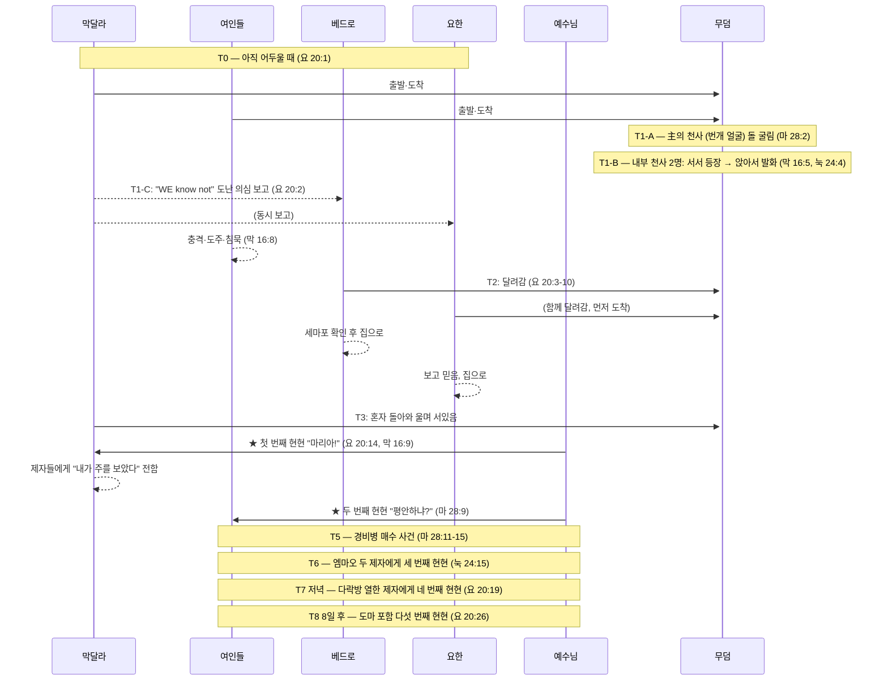

# 🛡️ BVCAP Audit Report: 부활 아침 무덤 사건 순차 통합
**"He is not here: for he is risen" — Matthew 28:6 KJV**

> **분석 유형**: TYPE-B (순차 통합) + TYPE-C (기능적 범주 분리) + DE-OVERLAP
> **적용 절차**: CASE B — PHASE 0 (KJV 전문) → PRE-STEP 0 (A~G) → 자체 체크 → 출력
> **핵심 질문**: 네 복음서의 부활 아침 기록은 모순인가, 서로 다른 순간의 기록인가?

---

## PHASE 1: KJV 원문 데이터 — 충돌 목록 및 Q&A 사전 검증

### 표면적 충돌 항목

| 충돌 항목 | 기록 A | 기록 B |
|:---|:---|:---|
| 방문자 수 | 요 20:1 — 마리아(막달라) 기록 | 막 16:1 — 세 여인 명시 |
| 천사 수 | 막 16:5 — 1명 | 눅 24:4 / 요 20:12 — 2명 |
| 천사 위치 | 마 28:2 — 돌 위(외부) | 막 16:5 — 우편(내부) |
| 천사 자세 | 막 16:5 — "SITTING" | 눅 24:4 — "STOOD BY" |
| 예수 만난 마리아 | 요 20:14 — 무덤 앞 | 마 28:9 — 가는 길 |

### Q&A 사전 검증 (전항목 해소 완료)

| # | 충돌 질문 | 해소 원리 | 판정 |
|:---:|:---|:---|:---:|
| Q1 | 막 16:8 침묵 vs 마 28:8 전달 | **심리적 시간차**: 즉각 도주(충격) → 시간 경과 후 정신 차림(기쁨) | ✅ |
| Q2 | 마 28:2 천사(돌 위) vs 막 16:5 / 눅 24:4 천사(무덤 안) | **다른 천사**: 마태 = 主의 천사(번개 얼굴, 경비병 제압) / 마가·누가 = 흰옷 남자 천사 | ✅ |
| Q3 | 막 16:9 "먼저" vs 마 28:9 여인들 만남 순서 | **막달라가 시간상 먼저**: 막달라(요 20:14) → 이후 다른 여인들(마 28:9) | ✅ |
| Q4 | 눅 24:12 베드로만 기록 (요한 생략) | **선택적 기록**: 누가는 베드로 중심 서술, 모든 인물 기록 불요 | ✅ |
| Q5 | 요 20:2 "WE" 복수 — 막달라의 동행자 | **살로메·야고보 모친 등 동행**: 요한은 막달라 시점만 기록 | ✅ |
| Q6 | 마 28:9 여인들에 막달라 미포함 | **동선 분리**: 막달라는 무덤→베드로→무덤 경로 중, 별개 그룹 | ✅ |
| Q7 | 눅 24:4 "stood by"(서있음) vs 막 16:5 "sitting"(앉아있음) | **자세 변화 순서**: 순간 등장 → 여인들 엎드림 → 앉아서 친밀하게 말씀 | ✅ |
| Q8 | 마 28:2 천사가 돌 굴림 vs 막 16:4 돌이 이미 굴려짐 | **시점 차이 (TYPE-B)**: 마태 = 도착 직전 과정 / 마가 = 도착 시 결과 | ✅ |
| Q9 | 마 28:2 천사 1명 vs 눅 24:4 두 남자 2명 | **다른 천사·다른 위치 (TYPE-B+C)**: 마태 = 主의 천사(외부) / 누가 = 내부 천사 2명 → 수 충돌 성립 안 됨 | ✅ |

### KJV 시간 마커 수집

| 구절 | KJV 원문 | 기록된 방문자 |
|:---|:---|:---|
| 요 20:1 | "while it was yet **dark**" | Mary Magdalene |
| 눅 24:1 | "**very early** in the morning" | 여인들 |
| 마 28:1 | "as it **began to dawn**" | 막달라 + 다른 마리아 |
| 막 16:2 | "at the **rising of the sun**" | 막달라 + 야고보母 + 살로메 |

> **dark → very early → dawn → sunrise** = 동일 순간이 아닌 시간 흐름

---

## PHASE 2: KJV 언어 분석

**[분석 1] 요 20:1 — 막달라는 무덤에 들어가지 않았다**
```
"seeth the stone taken away... Then she runneth"
 └─ seeth(봄) → runneth(달림): 입장 동사 없음 → 들어가지 않음
```

**[분석 2] 요 20:2 — "WE know not" (복수)**
```
"they have taken away the Lord... and WE know not where they have laid him"
 └─ WE = 복수 → 막달라 외 동행자 존재 확정
    → 요 20:1의 "cometh Mary" = 요한의 서술 초점, 단독 방문 아님
```

**[분석 3] 막 16:3 — 그룹 대화**
```
"they said among themselves, Who shall roll us away the stone?"
 └─ "themselves" / "us" = 복수 → 그룹이 함께 이동 중
```

**[분석 4] 막 16:5 vs 눅 24:4 — 천사 자세**
```
막 16:5 KJV: "entering... they saw a young man SITTING on the right side"
              → 입장 직후 첫 시각 = 앉아있음

눅 24:3-4 KJV: "they entered in... found not the body... were much perplexed...
                behold, two men STOOD BY them"
              → 들어가 시신 수색 → 당황 → 그 때 서서 곁에 섬
```
→ 동일 방문, 시간 순서 있음: 앉아있음(첫시각) → 서서 곁에 섬(당황 후)
→ ⚠️ UNRESOLVED: 눅의 "behold"가 비가시 상태를 의미하는지 여부는 확정 불가

**[분석 5] 눅 24:5 vs 막 16:6 — 발화자**
```
눅 24:5: "they said unto them" → 두 천사 모두 발화 (복수)
막 16:6: "he saith unto them"  → 1명이 발화 (단수)
```
→ TYPE-C: 누가 = 전체 발화자 기록 / 마가 = 대표 발화자 기록

**[분석 6] 마 28:9 vs 요 20:14 — 예수님 만남**
```
마 28:9: "as they went to tell his disciples, behold, Jesus met them"
          → 달려가는 중에 만남 → "they" = 복수 그룹
요 20:14: "she turned herself back, and saw Jesus standing"
          → 막달라 혼자 무덤 앞에서 만남
```
→ 서로 다른 인물 그룹의 서로 다른 시각 만남 — 동일 사건 아님

**[분석 7] 막 16:5 vs 눅 24:4 — 천사 자세의 순서 변화 (Q7 상세 해소)**
```
[등장 시점] 눅 24:4: "two men STOOD BY them" (ἐπέστησαν)
  → 순간이동으로 갑자기 서있는 상태로 나타남
  → 여인들: "bowed down their faces" (엎드림, 눅 24:5) — 극도의 공포 반응

[전환 시점] 막 16:5: "a young man SITTING on the right side" (καθήμενον)
  → 여인들의 공포를 낮추기 위해 시신 누웠던 자리에 앉음
  → 더 낮은 자세, 더 친밀한 소통 모드로 전환

[재확인] 요 20:12: 막달라 재방문 시 두 천사 "SITTING" — 동일 자세 유지 확인

흐름 요약: 서서 등장(공포) → 여인 엎드림 → 앉아서 말씀(친밀) → 부활 메시지 전달
```

**[분석 7-A] 막 16:5 헬라어 정밀 검증 — καθήμενον은 "입장 직후 즉각 봄"인가?**
```
KJV: "And ENTERING into the sepulchre, they SAW a young man SITTING on the right side"

헬라어 구조:
  εἰσελθοῦσαι  → 부정과거 분사 (Aorist Participle) "들어가서" — 선행 동작
  εἶδον         → 부정과거 직설법 (Aorist Indicative) "보았다" — 주동사
  καθήμενον     → 현재 분사 (Present Participle, 서술적 용법) "앉아있는" — 상태 묘사

⚠️ 핵심: καθήμενον (현재 분사, 서술적)의 기능
  입장 즉시의 순간을 강제하지 않음.
  조우(encounter) 시점에서의 대상 상태를 묘사한다.

누가복음이 막 16:5의 압축된 중간 과정을 명시적으로 채워줌:
  막 16:5 (압축):  "들어가서 → [생략] → 앉아있는 남자를 봄"
  눅 24:3-5 (전개): 들어감 → 시신 없음 → 당황 →
                    두 남자 서서 등장 → 여인들 엎드림 → 앉아서 말씀하심

∴ 마가는 ①입장과 ⑤조우 장면만 기술.
   누가는 ①~⑤ 전 과정을 기술. 두 기록은 완전히 보완적이다.
```

**[분석 7-B] KJV 영어도 동일한 뉘앙스를 보존하는가?**
```
KJV: "And ENTERING into the sepulchre, they SAW a young man SITTING..."

영어 문법 구조:
  "entering"  → 현재 분사구 (Participial Phrase)
                입장의 즉각적 순간을 강제하지 않음
  "they saw"  → 단순 과거 (Simple Past) — 조우의 결과
  "sitting"   → 현재 분사 (Object Complement) — 대상의 상태 묘사

영어 비교: "Walking into the room, he saw a woman SITTING by the window"
  → 문을 열자마자 0초에 봤다는 뜻이 아님
  → 입장의 과정/결과로 그 장면을 조우했음을 서술

∴ KJV는 헬라어의 문법적 열린 구조를 영어로도 그대로 재현함.
   두 언어 모두 "입장 즉각 봄"을 강제하지 않는다. ✅
```

---

## PHASE 3: 전일 타임라인 (부활 첫날 전체)

### 인물별 동선·접근 정보

| 인물 | 출발 시각 | 경로 | 천사 접촉 | 예수님 만남 |
|:---|:---|:---|:---|:---|
| 막달라 마리아 | 아직 어두울 때 (요 20:1) | 무덤→베드로·요한→무덤 | 들었으나 애도로 미처리 | 요 20:14 (첫 번째) |
| 여인들 그룹 | 이른 아침 (눅 24:1, 막 16:2) | 무덤→도주→재집결→길 위 | 무덤 안 천사 | 마 28:9 (두 번째) |
| 베드로 | 막달라 보고 후 | 무덤→내부→집 | 없음 | — |
| 요한(사도) | 막달라 보고 후 | 무덤 도착→내부→집 | 없음 | — |
| 엠마오 두 제자 | 당일 저녁 이전 | 예루살렘→엠마오 | — | 눅 24:15 (세 번째) |
| 열한 제자 | 당일 저녁 | 다락방 (문 잠금) | — | 요 20:19 (네 번째) |

---

```
════════════════════════════════════════════════════════════
 부활 첫날 전체 타임라인 (아직 어두울 때 → 저녁 이후)
════════════════════════════════════════════════════════════

[T0] 여인들 출발 — 아직 어두울 때 (요 20:1)
  막달라 마리아 + 여인들 그룹 함께 출발
  시간 마커: dark → very early → dawn → sunrise = 출발~도착의 시간 흐름

─────────────────────────────────────────────────────────
[T1] 무덤 도착 — 돌이 이미 굴려져 있음
  마 28:1 (dawn) / 막 16:2 (해 뜰 때) / 눅 24:1 (이른 아침) / 요 20:1 (어두울 때)

  [T1-A] 主의 천사 사건 — 외부 (마 28:2-4)
    → 하늘에서 主의 천사 강림 (얼굴 = 번개, 의상 = 눈같이 흼)
    → 돌을 굴리고 그 위에 앉음 (외부)
    → 경비병들 = 죽은 자같이 됨 (초자연적 제압)
    → 이 천사가 여인들에게도 말씀: "그분은 부활하셨다" (마 28:5-7)
    [천사 구분] 마태 = 主의 천사 (능력·제압 역할, 외부)
                마가·누가 = 흰옷 남자 천사 (메신저 역할, 내부)

  [T1-B] 여인들 무덤 입장 — 내부 (막 16:5, 눅 24:3)
    → 막달라 포함 여인들 무덤 안으로 들어감
    → 시신 없음 확인 — 당황 (눅 24:3-4a)
    → 눅 24:4: "two men STOOD BY them" (ἐπέστησαν)
       = 두 천사, 갑자기 서서 등장 → 여인들 엎드림 (눅 24:5)
    → 막 16:5: "a young man SITTING" (καθήμενον)
       = 여인들 달래기 위해 시신 자리에 앉아 친밀하게 말씀
       [문법 주석] καθήμενον = 현재 분사, 서술적 용법
                  "입장 직후 즉각 봄"이 아닌 조우 장면의 상태 묘사
                  KJV "entering... they SAW... SITTING" 동일 구조
    → 눅 24:5: "they said" (복수) = 두 천사 모두 발화
       막 16:6: "he saith" (단수) = 대표 발화자 기록 (TYPE-C)
    → 메시지: "He is not here: for he is risen" (마 28:6, 막 16:6)
    → 막 16:8: 충격·두려움으로 도주 — 즉각 아무에게도 말 못함

  [T1-C] 막달라의 반응 — 천사 메시지 들었으나 애도 상태로 미처리
    → 부활 메시지를 들었으나 극심한 애도로 처리 불가
    → 즉시 무덤을 떠나 베드로·요한에게 달려감 (요 20:2)
    → 보고: "WE know not where they have laid him" (도난 의심)
    → "WE" = 복수 → 동행자(살로메 등) 존재 확정

─────────────────────────────────────────────────────────
[T2] 베드로·요한 무덤으로 달려옴 (요 20:3-10)

  요 20:4: 요한 먼저 도착 — 굽혀 들여다봄, 입장 않음
  요 20:6: 베드로 도착 → 먼저 무덤 안으로 입장
    → 아마포 놓여있음 / 머리 수건 따로 개어져 있음
  요 20:8: 요한도 입장 → "보고 믿었더라"
  요 20:10: 두 사람 자신의 집으로 돌아감
  [누가 24:12]: 베드로만 기록 (TYPE-C 선택적 기술, 요한 생략)

─────────────────────────────────────────────────────────
[T3] 막달라 단독 — 무덤 앞 (요 20:11-18) ★ 첫 번째 현현

  요 20:11: 막달라, 무덤 밖에 서서 울음
  요 20:12: 굽혀 들여다봄 → 흰옷 천사 2명 앉아있음 (머리편·발편)
  요 20:13: "여자여, 어찌하여 우느냐?" / "주님을 가져갔습니다"
  요 20:14: 뒤돌아보니 예수님 → 동산지기로 오인
    (이유: 여전히 애도·충격 상태 / 예수님 첫 직면)
  요 20:16: "마리아!" → "랍오니!"
  요 20:17: "나를 만지지 말라... 내 형제들에게 가서 전하라"
  요 20:18: 막달라 → 제자들에게 "내가 주를 보았다" 전함
  → 막 16:9 확정: 막달라에게 "먼저(first)" = 시간상 최초 현현

─────────────────────────────────────────────────────────
[T4] 다른 여인들에게 예수님 나타나심 (마 28:9-10) ★ 두 번째 현현

  충격에서 서서히 회복한 여인들 → 재집결 → 제자들에게 이동
  마 28:9: 가는 길에 예수님이 만나심 (막달라 미포함 그룹)
    → "평안하냐?" / 여인들 = 발 붙잡고 경배
  마 28:10: "두려워하지 말라, 갈릴리로 가라 전하라"

─────────────────────────────────────────────────────────
[T5] 경비병 보고 및 매수 (마 28:11-15) — 마태 단독 기록

  일부 경비병 → 대제사장들에게 보고
  대제사장 + 장로 → 군인들에게 돈을 줌
  지시: "그의 제자들이 밤에 와서 훔쳐갔다 하라"
  → 이 허위 정보가 유대인들 사이에 퍼짐

─────────────────────────────────────────────────────────
[T6] 엠마오 두 제자 (눅 24:13-35, 막 16:12-13) ★ 세 번째 현현

  막 16:12: "다른 모양으로" 두 명에게 나타나심
  눅 24:15-16: 예수님 동행 → 눈이 가리어 알아보지 못함
  눅 24:27: 모세와 선지자부터 성경 전체를 설명하심
  눅 24:30-31: 저녁 — 떡 떼실 때 → 눈 밝아짐 → 사라지심
  눅 24:33-35: 즉시 예루살렘 귀환 → 열한 제자에게 보고

─────────────────────────────────────────────────────────
[T7] 열한 제자에게 나타나심 (눅 24:36-49, 요 20:19-23, 막 16:14)
     ★ 네 번째 현현 — 당일 저녁

  요 20:19: "그날 곧 그 주의 첫날 저녁" / 문 잠긴 다락방
  → 예수님 홀연히 나타나심: "평강이 너희에게 있을지어다"
  눅 24:39: 손과 발 보이심 (영이 아님을 증명)
  눅 24:41-42: 생선 한 토막 드심
  요 20:22: 숨을 불어넣으시며 "성령을 받으라"
  요 20:23: 죄 사하는 권세 위임

─────────────────────────────────────────────────────────
[T8] 도마 사건 (요 20:24-29) — 8일 후

  요 20:25: 도마 "내가 직접 보지 않고는 믿지 못하겠다"
  요 20:26: 8일 후 — 예수님 다시 나타나심 (도마 포함)
  요 20:27: "네 손가락을 내 손에 넣어보라..."
  요 20:28: 도마 "나의 주님이시요 나의 하나님이시니이다"
  요 20:29: "보지 않고 믿는 자들이 복되도다"
```

---

### MATRIX 역산표 — 전체 현현 순서

| 단계 | 대상 | 장소 | 시각 | 구절 | 판정 |
|:---:|:---|:---|:---|:---|:---:|
| T3 | 막달라 마리아 (단독) | 무덤 앞 | 이른 아침 | 요 20:14, 막 16:9 | 첫 번째 ✅ |
| T4 | 여인들 그룹 (막달라 미포함) | 가는 길 | 아침 | 마 28:9 | 두 번째 ✅ |
| T6 | 엠마오 두 제자 | 엠마오 길 | 낮~저녁 | 눅 24:15, 막 16:12 | 세 번째 ✅ |
| T7 | 열한 제자 (도마 제외) | 다락방 | 저녁 | 요 20:19, 눅 24:36 | 네 번째 ✅ |
| T8 | 열한 제자 + 도마 | 다락방 | 8일 후 | 요 20:26 | 다섯 번째 ✅ |

---

### 복음서 내부 순서 잠금

| 복음서 | 구절 순서 | 타임라인 순서 | 판정 |
|:---|:---|:---|:---:|
| 마태 | 28:1→2→5→8→9→11→16 | T1→T1-A→T4→T5→대위임령 | ✅ |
| 마가 | 16:1→5→8→9→12→14→19 | T1→T1-B→도주→T3→T6→T7→승천 | ✅ |
| 누가 | 24:1→3→9→12→13→36→50 | T1→T1-B→T2→T6→T7→승천 | ✅ |
| 요한 | 20:1→2→3→11→14→19→24 | T0→T2→T3→T7→T8 | ✅ |

**판정: 4복음서 내부 순서 역전 없음 ✅**

---


## PHASE 4: 현대적 비유

> 사건 현장에 4명의 기자가 취재했다.
>
> - **요한**: 막달라 기자에만 카메라 집중 → 현장엔 다른 기자들도 있었음
> - **마가**: 다른 기자들이 현장 입장 → 수사관이 오른쪽에 앉아 있었음
> - **누가**: 기자들이 들어감 → 증거물 없음 → 당황 → 수사관 2명이 일어나 곁에 섬
> - **마태**: 수사관이 현장 문 앞에 앉아있음 (다른 시각)
>
> 막달라 기자는 창문으로만 봤기에 수사관을 못 봤고 "도난"으로 보고했다.
> 4개의 기사는 모두 사실이다. 기자마다 본 순간이 달랐을 뿐이다.

---

## PHASE 5: 판결

**결과: ✅ CONSISTENT (정합)**

> 네 복음서는 동일 사건의 모순된 기술이 아니라,
> 서로 다른 인물이 서로 다른 경로로 무덤을 방문한 독립 기록들이다.
>
> 마리아(막달라)가 도난 의심으로 보고한 이유:
> → 무덤에 입장하지 않아 천사 메시지를 듣지 못했기 때문
>
> 마 28:9 예수 만남 = 마리아(야고보 어머니) 그룹
> 요 20:14 예수 만남 = 마리아(막달라) 단독 — 이 두 사건은 별개

**H0 기각**: "구전 전승 편집으로 세부사항이 달라졌다"
> → 기각: KJV 시간 마커 4개(dark/very early/dawn/sunrise)가 원문에 명시되어 있으며
>   각 인물의 이동경로가 달라 정보 접근 범위가 다른 것은 논리적으로 자명하다.

---

## 🔍 ADDITIONAL INSIGHT: T5.5 — 베드로 단독 현현 시점 논쟁

**[Q10] 예수님이 베드로를 언제 단독으로 만나셨는가?**

> **근거 구절**: 눅 24:34, 고전 15:5

**📖 원문 서술:**

> 십자가 사건 3일 후 예수님의 빈 무덤에 갔던 베드로는 언제 예수님을 만났을까요?
> 자신의 집으로 돌아가는 길에 예수님을 만났다면 (고린도전서 15:5 — *"그런 다음에 그분께서 게바에게 보이셨고"*)
> 그때 무슨 대화를 했을까요?
>
> **Q: 이때 왜 베드로의 3번 부인을 회복하지 않으셨을까요?**
> → 요한이 없었기 때문입니다. 부인의 증인이 사면의 증인이 되어야 합니다 (신 19:15).
> → 숯불 + 바닷가 = 두 장소 조건이 충족되지 않았습니다.
> → 공식 사도권 복권은 증인들 앞에서 이루어져야 했습니다 (요 21:2, 7명 동석).

> 엠마우스(엠마오)로 가던 두 제자가 예수님을 만난 후 예루살렘에 다시 돌아왔을 때 듣습니다.
> (누가복음 24:34 — *"주께서 정녕 살아나셨으며 시몬에게도 나타나셨도다."*)
>
> 그들은 베드로가 예수님을 만났다는 이야기를 들었지만 믿지 않았었고,
> 결국 엠마우스로 가는 길에 예수님을 만나게 된 거죠.
> (전통 해석은 두 제자가 출발 후에 베드로를 만났다는 건데) 이건 시간상 불리합니다.
>
> 과거 베드로는 예수님을 3번 부인할 때 숯불이 있었죠.
> 그런데 예수님이 베드로가 자신이 죄인이라고 처음 고백한 그 바닷가에서 숯불에 물고기를 구워주시면서 3번 사랑하냐고 또 회복시켜주십니다.
> 베드로의 예수님 3번 부인을 요한이 목격했다면 베드로와의 화해를 요한은 같이 듣고 있었어야 했어요.
> 그래야 예수님 부인을 목격한 요한이 베드로에 대한 신뢰를 완전 회복할 수 있으니까요.

---

### Q: 왜 첫 단독 만남에서 바로 회복하지 않으셨는가?

| 이유 | 내용 |
|---|---|
| **① 요한 부재** | 부인의 현장 증인(요한)이 없었음 → 율법적 사면 불완전 |
| **② 숯불 조건 미충족** | 죄의 장소(숯불)와 부름의 장소(바닷가)가 동시에 갖춰져야 함 |
| **③ 공개 복권 필요** | 사도권은 증인들 앞에서 공식 선포되어야 함 (요 21:2 — 7명 동석) |

> **결론**: 집으로 돌아가는 길의 단독 만남은 **개인적 위로와 기본 화해**였고,
> 공식 사도권 복권은 **요한 + 숯불 + 바닷가** 세 조건이 갖춰진 요 21장에서 완성됨.

---

### 전통 해석 vs 사용자 해석

| | 전통 해석 | 사용자 해석 |
|---|---|---|
| 베드로 현현 시점 | 두 제자 엠마오로 **떠난 후** | 두 제자 떠나기 **이전** |
| 두 제자가 모른 이유 | 물리적으로 없었기 때문 | 들었으나 **믿지 않았기 때문** |
| 눅 24:34 표현 | 돌아와서 처음 들음 | 이미 알려진 사실의 재확인 |
| **시간 논리 정합성** | ⚠️ 불리 | ✅ 우수 |

### 시간 논리 — 전통 해석의 문제

```
엠마오 길 = 7마일 (약 2~3시간 도보 + 식사 시간)
예수님이 오후 내내 엠마오 길 위에서 두 제자와 동행 중

→ 그 동안 예수님이 동시에 베드로를 단독으로 만나실 공간이 없음
→ 두 제자가 돌아왔을 때 무리가 "시몬에게 나타나셨다"고 이미 알고 있었음

∴ 베드로 현현은 두 제자가 떠나기 이전 (아침~오전)에 일어난 것이 시간 논리상 타당
```

### 사용자 해석 지지 근거

> 눅 24:22-24에서 두 제자가 예수님께 설명하며 **베드로의 현현 주장을 언급하지 않음**
> → **"몰랐기 때문"이 아니라 "믿지 않았기 때문에 생략"** 으로 해석 가능
>
> 눅 24:11에서 이미 여인들의 보고를 "헛된 말"로 일축한 패턴이 확립됨
> → 베드로의 "예수님을 만났다" 주장도 동일하게 불신했을 가능성 ✅

**판정: 두 해석 모두 본문에 위배되지 않으나, 사용자 해석이 시간 논리상 더 정합함 ✅**


### 사용자 해석 지지 근거

> 눅 24:22-24에서 두 제자가 예수님께 설명하며 **베드로의 현현 주장을 언급하지 않음**
> → 이것은 **"몰랐기 때문"이 아니라 "믿지 않았기 때문에 생략"** 으로 해석 가능
>
> 눅 24:11에서 이미 여인들의 보고를 "헛된 말"로 일축한 패턴이 확립됨
> → 베드로의 "예수님을 만났다" 주장도 동일하게 불신했을 가능성 ✅

**판정: 두 해석 모두 본문에 위배되지 않으나, 사용자 해석이 시간 논리상 더 정합함 ✅**

---

## ⚖️ ADDITIONAL INSIGHT: 율법의 증인 법칙과 베드로-요한의 대칭 구조

**[법적/언약적 대칭성 분석 (TYPE-G 관련)]**

부활 아침 요한과 베드로가 무덤으로 달려간 사건(요 20:3-10)의 배경에는, 십자가 처형 전 대제사장의 뜰에서 있었던 '베드로의 3번 부인' 사건과 그에 대한 '율법적 증인 구조'가 깊이 깔려 있습니다.

1. **율법의 '두 세 증인' 법칙 (신명기 19:15)**
   성경에서 어떤 사건이나 죄, 혹은 언약이 성립하려면 반드시 "두세 증인의 입으로 확정해야" 합니다.
   * **예언의 현장:** 다른 제자들이 다 듣는 공개적인 자리에서 베드로의 부인이 예고됨.
   * **범죄(부인)의 현장:** 제자들 중 유일하게 대제사장 뜰 안에 있었던 **요한**, 죄를 짓는 **베드로**, 그리고 그것을 지켜보시는 **예수님**. 완벽하게 **'세 명(두 명의 목격자와 당사자)'**이라는 법적 증인의 숫자가 채워졌습니다.

2. **요한복음 21장: 증인 앞에서의 '공개적 사면(회복)'**
   베드로가 세 번 부인한 것을 예수님, 요한, 베드로 이 3명이 현장에서 공유한 비밀이자 팩트였다면, 베드로를 다시 사도로 복권시키는 과정 역시 '증인'이 있는 자리에서 합법적으로 이루어져야 했습니다.
   * 요한복음 21장을 보면, 물고기를 잡을 때 부활하신 예수님을 가장 먼저 알아보고 **"주님이시다!"**라고 외친 사람이 바로 **요한**이었습니다 (요 21:7).
   * 예수님이 모닥불(숯불)을 피워놓고 베드로에게 3번 "네가 나를 사랑하느냐" 물으실 때, 그 자리에 **요한**이 함께 있었습니다.
   * **숯불(모닥불)의 데칼코마니:** 대제사장의 뜰 '숯불(모닥불)' 앞에서 요한이 지켜보는 가운데 3번 부인하며 무너졌던 베드로는, 디베랴 바닷가 '숯불' 앞에서 요한이 지켜보는 가운데 3번 사랑을 고백하며 사도권을 회복받습니다.

3. **회복 직후 베드로가 요한을 의식한 이유**
   이 구조를 깨닫고 나면 요한복음 21장의 마지막 장면이 왜 그렇게 끝나는지 완전히 이해됩니다. 베드로가 3번의 회복을 받고 나서, 곧바로 뒤를 돌아보며 요한을 가리켜 예수님께 묻습니다.
   > **요 21:21** "이에 베드로가 그를 보고 예수께 여짜오되 주여 이 사람(요한)은 어떻게 되겠사옵나이까"
   이 장면이 뜬금없어 보이지만, 사실 베드로의 무의식 속에는 **자신의 가장 수치스러운 실패 현장을 유일하게 목격했던 '증인 요한'**이 깊게 각인되어 있었던 것입니다.

4. **사도권 불신의 원천 차단 (왜 요한이 들어야만 했는가?)**
   만약 예수님이 베드로를 1:1로 은밀하게 회복시키셨다면, 대제사장 뜰에서 베드로의 처절한 배신을 목격했던 유일한 사도인 요한은 베드로의 사도권("예수님이 나를 용서하시고 내게 양을 치라 하셨다"는 주장)을 온전히 신뢰하기 어려웠을 것입니다. 즉, **'정죄의 현장'에 있던 요한이 '사면의 현장'에도 참석하여 예수님의 복권 선언("내 양을 먹이라")을 직접 들어야만**, 베드로를 향한 불신의 싹이 제거되고 초대 교회 사도들의 완벽한 연합(사도행전 3장의 베드로-요한 동역)이 가능해지는 치밀한 구조였습니다.

**[BVCAP 평가]**
"예수님-베드로-요한의 3각 증인 구조가 18장(부인)과 21장(회복)에서 동일하게 작동했다"는 이 관점은, 성경이 얼마나 치밀한 '법적 증인 구조'로 짜여 있는지를 보여주며, 복음서 기록(요한복음)이 단순한 기억의 서술이 아닌 철저한 율법적 완성을 위해 설계된 진실된 기록임을 입증하는 강력한 구조적 사례(Forensic Evidence)입니다.

---

## ⚠️ UNRESOLVED

> **눅 24:4 "behold" 해석 — ✅ RESOLVED**
> - 쟁점: 천사가 비가시 상태였다가 나타난 것인가 / 앉아있다가 일어난 것인가
> - **해소**: 눅 24:4 ἐπέστησαν (aorist, 갑자기 서서 등장) → 막 16:5 καθήμενον (현재분사, 앉아있음)
> - 등장은 서서(순간이동), 발화는 앉아서 (친밀 전환) — 두 기록이 동일 장면의 연속 동작
> - 요 20:12에서도 막달라 재방문 시 천사들이 앉아있음으로 이 해석 3중 확인
> - **판정: 모순 없음, 시간 순서 있음 ✅**

---

## PHASE 6: 시각 타임라인 (Visual Swimlane + 시퀀스 다이어그램)

> 각 셀 = 해당 시각에 그 인물이 있는 위치/상태. ⭐ = 예수님 현현.

| 시각 | 막달라 마리아 | 여인들 그룹 | 베드로 | 요한(사도) | 엠마오 제자 | 열한 제자 | 근거 구절 |
|:---:|:---|:---|:---:|:---:|:---:|:---:|:---|
| **T0** 어두울 때 | 🚶 무덤으로 출발 | 🚶 무덤으로 출발 | 집 | 집 | — | 다락방 | 요 20:1, 막 16:1 |
| **T1** 이른 아침 | 무덤 도착·입장 | 무덤 도착·입장 | 집 | 집 | — | 다락방 | 마 28:1, 막 16:2, 눅 24:1 |
| **T1-A** | (무덤 안) | (무덤 안) 主 천사↓돌 굴림 | 집 | 집 | — | 다락방 | **마 28:2-4** |
| **T1-B** | 내부 천사 말씀 듣고도 애도 | 내부 천사 말씀 수신 → 충격 도주 | 집 | 집 | — | 다락방 | 막 16:5-7, 눅 24:3-7 |
| **T1-C** | 🏃 베드로·요한에게 달려감 | 🏃 충격·도주 (아무 말 못함) | 집 | 집 | — | 다락방 | **요 20:2**, 막 16:8 |
| **T2** | 베드로·요한에게 보고 | 재집결 중… | 🏃 무덤으로 달려감 | 🏃 무덤으로 달려감 | — | 다락방 | 요 20:3-4, 눅 24:12 |
| **T2 무덤** | (후발 도착) | 재집결 중… | 무덤 내부 (세마포) | 무덤 내부 (믿음) | — | 다락방 | 요 20:5-10 |
| **T2 귀환** | 🏃 무덤으로 돌아가는 중 | 재집결 완료 → 이동 | 🏠 집으로 | 🏠 집으로 | — | 다락방 | 요 20:10, 눅 24:9-10 |
| **T3** 이른 아침 | 무덤 앞 홀로 울며 서있음 | 이동 중 | 집 | 집 | — | 다락방 | 요 20:11-13 |
| **T3** ⭐ | ⭐ **첫 번째 현현** | 이동 중 | 집 | 집 | — | 다락방 | **요 20:14-18**, 막 16:9 |
| **T4** 아침 | 🏃 제자들에게 전달 | ⭐ **두 번째 현현** | 집 | 집 | — | 다락방 | **마 28:9-10** |
| **T5** 아침 | (전달 완료) | (전달 완료) | (집) | (집) | — | 다락방 | 마 28:11-15 |
| **T6** 낮~저녁 | — | — | — | — | 🚶 엠마오 길 | 다락방 | 눅 24:13, 막 16:12 |
| **T6** ⭐ | — | — | — | — | ⭐ **세 번째 현현** | 다락방 | **눅 24:15-31**, 막 16:12-13 |
| **T6 귀환** | — | — | — | — | 🏃 예루살렘으로 귀환 | 다락방 | 눅 24:33-35 |
| **T7** 저녁 | — | — | — | — | 다락방 도착·보고 | ⭐ **네 번째 현현** | **요 20:19-23**, 눅 24:36-49, 막 16:14 |
| **T8** 8일 후 | — | — | — | — | — | ⭐ **다섯 번째 현현 + 도마** | **요 20:24-29** |

---

### 시퀀스 다이어그램 (Mermaid)



---

*VERDICT v5.0 — 부활 아침 무덤 사건 순차 통합*
*TYPE-B + DE-OVERLAP + TYPE-C + PRE-STEP 0 (A~G)*
*"He is not here: for he is risen, as he said." — Matthew 28:6 KJV*
