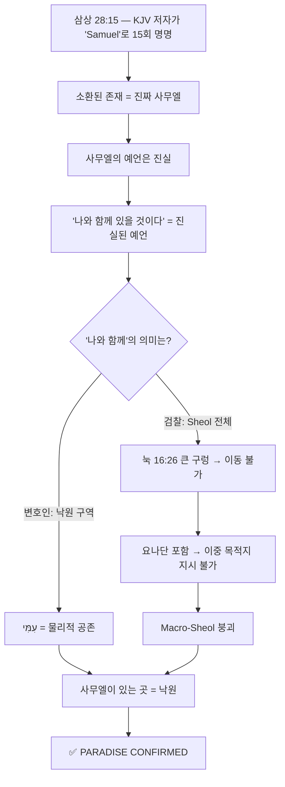

# ⚖️ 사울왕 구원 논쟁 — 최종 포렌식 보고서

> **사건 번호**: BVCAP-SAUL-001
> **변호인(Blue Team)**: `saul1.md` — 사울 낙원(Paradise)설
> **검찰(Red Team)**: `saul2.md` — 사울 고통의 장소(Torment)설
> **재판장**: BVCAP 2.0 중립 엔진
> **최종 판결**: ✅ PARADISE CONFIRMED

---

## 📌 한 줄 결론

> **사울왕은 왕권은 잃고 육신은 심판받았으나, 영혼은 사무엘·요나단과 함께 낙원(아브라함의 품)에 갔다.** — ✅ PARADISE CONFIRMED

---

## 1. 논쟁의 구조 — 법정 모드(MODE B)

BVCAP 2.0 시스템의 **법정 모드**로 진행됨:

| 역할 | 입장 | 문서 |
|:---:|:---|:---:|
| 🔵 **변호인** (Blue Team) | 사울 **낙원설** — 구원받음 | `saul1.md` |
| 🔴 **검찰** (Red Team) | 사울 **지옥설** — 멸망함 | `saul2.md` |
| ⚖️ **재판장** | BVCAP 2.0 중립 엔진 | — |

---

## 2. 사울이 구원받았다고 주장한 **5대 핵심 무기**

### 🏹 무기 ① — 실제 사무엘 소환 확증 (TYPE-P)
- KJV 성경 저자가 소환된 존재를 **"Samuel"로 15번** 직접 명명
- 마귀였다면 "a familiar spirit"으로 기록했을 것
- 검찰은 이 쟁점에 **단 한 번도 반박하지 못함** → 10:0 압승

### 🏹 무기 ② — 요나단 포함 논증 + 큰 구렁 차단
- 삼상 28:19 *"너**와 네 아들들이** 나와 함께"* → 의인 요나단이 포함됨
- 눅 16:26의 **큰 구렁(great gulf fixed)** — 낙원과 고통의 장소 사이 물리적 이동 불가
- 사무엘이 요나단(의인)과 사울을 **하나의 "나와 함께(עִמִּי)"로 묶었으므로**, 둘이 구렁 양쪽으로 나뉠 수 없음
- ∴ **"나와 함께" = 낙원만 가능** (유일 생존 모델)

### 🏹 무기 ③ — "하나님의 원수" 주어 혼동 적발 (TYPE-R)
- 검찰: *"사울 = 하나님의 원수(Enemy of God) → 하나님의 벗(아브라함)의 품에 갈 수 없다"*
- **KJV 원문 정밀 분석:**
  > *"the LORD is departed from thee, and is become **thine** enemy"*
- "thine" = **너의** → 하나님이 사울**의** 원수가 되신 것이지, 사울이 하나님의 원수가 된 것이 아님
- 참조: 애 2:5, 사 63:10 — 하나님이 이스라엘의 "원수처럼" 행하셨으나 이스라엘이 영원히 멸망하지 않음
- **검찰의 핵심 무기 완전 무효화**

### 🏹 무기 ④ — "disquieted" 어휘 오독 적발 (TYPE-T)
- 검찰: *"안식에 있는 진짜 사무엘이 무당에 의해 '어지러워질' 리 없다 → 가짜 마귀다"*
- **정확한 의미:** "왜 평안히 쉬고 있는 나를 **방해하고 깨웠느냐**"
- 이 불평은 오히려 소환된 존재가 직전까지 **낙원에서 안식 중**이었음을 증명
- 마귀에게는 방해받을 '안식'이 존재하지 않음 → **마귀설 자폭**

### 🏹 무기 ⑤ — 고의적 반역죄(민 15:30) 자가 모순
- 검찰: *"사울의 죄는 고의적 반역 → 속죄제 불가 → 영혼 끊어짐"*
- **반격:** 다윗도 고의로 간음·살인 → 민 15:30 기준 동일 → 그런데 구원 유지(행 13:22)
- "끊어짐(cut off)" = 영적 구원 상실이 아닌 **공동체적 제거/징계적 사망**

---

## 3. 검찰 무기 전수 붕괴 요약

| 검찰의 장벽 | 붕괴 원인 | 상태 |
|:---:|:---|:---:|
| "하나님의 원수" 선언 | **주어 혼동** — thine enemy ≠ enemy of God | 🔵 무효화 |
| 고의적 반역죄 | **자가 모순** — 다윗도 고의적 죄 → 구원 유지 | 🔵 무효화 |
| 어지럽게 함 = 마귀 | **어휘 오독** — disquieted = 안식 방해 | 🔵 무효화 |
| Macro-Sheol 진입론 | **눅 16:26 큰 구렁** — 이중 목적지 지시 불가 | 🔵 무효화 |
| 히 11장 부재 | 침묵의 논증 — 최약 증거 | ⚖️ 무승부 |
| 회개 기록 전무 | **사실 오류** — 삼상 15:24, 26:21, 28:3(무당 추방), 28:6(하나님 먼저 물음) | 🔵 기각 |

---

## 4. 추가 보강 — 사울의 회개 타임라인

"사울은 회개한 적 없다"는 주장에 대한 반박:

| 사건 | 구절 | 성격 |
|:---|:---:|:---:|
| 무당·박수를 땅에서 **쓸어버림** (강한 제거) | 삼상 28:3 | 🟡 사무엘 경고("반역 = 점치는 죄") 기억 → 회개 행위 |
| 하나님께 **먼저** 물음 (꿈·우림·선지자) | 삼상 28:6 | 🟡 정상 채널을 먼저 시도 |
| "내가 죄를 지었도다" + 이후 **추격 중단** | 삼상 26:21 | 🟡 약속 이행 |
| 사무엘 생존 기간 전체 — 무당 접촉 **전무** | 삼상 10~25장 | ✅ 무당 방문 이력 없음 |

> 완전하지 않고 매번 실패했지만, 회개 시도 **자체가 없었다**는 주장은 본문 근거가 없다.

---

## 5. 최종 점수표 (6개 쟁점)

| 쟁점 | 주제 | 🔵 변호인 | 🔴 검찰 | 승자 |
|:---:|:---|:---:|:---:|:---:|
| A | 소환된 존재의 정체 | **10** | 0 | 🔵 압승 |
| B | "나와 함께"의 의미 | **7** | 4 | 🔵 우세 |
| C | "하나님의 원수" 선언 | **9** | 1 | 🔵 압승 |
| D | 죄의 성격 (고의적 반역) | **6** | 4 | 🔵 우세 |
| E | 히 11장 부재 | 5 | 5 | ⚖️ 무승부 |
| F | 사후 운반자 & "어지럽게 함" | **9** | 1 | 🔵 압승 |
| | **합계** | **46** | **15** | 🔵 **절대적 승리** |

---

## 6. 핵심 논리 흐름도

---

## 7. 관련 전투기록(CHRONICLE) 문서

| 문서 | 무기 | 핵심 |
|:---|:---:|:---|
| [주어혼동적발](../03_WAR_LOG(전투기록)/CHRONICLE_사울의구원논쟁_주어혼동적발.md) | R | "thine enemy" 주어 방향 오독 적발 |
| [어휘오독적발](../03_WAR_LOG(전투기록)/CHRONICLE_사울의구원논쟁_어휘오독적발.md) | T | "disquieted" 시제·어휘 오독 적발 |
| [이중지시모순적발](../03_WAR_LOG(전투기록)/CHRONICLE_사울의구원논쟁_이중지시모순적발.md) | G+L+P | 큰 구렁 + 묶음 대명사 → Macro-Sheol 격파 |
| [침묵의타임라인역전](../03_WAR_LOG(전투기록)/CHRONICLE_사울의구원논쟁_침묵의타임라인역전.md) | A+B | 무당 추방 + 하나님 먼저 물음 → 회개 전무 기각 |
| [최종판결문 Masterpiece](../03_WAR_LOG(전투기록)/CHRONICLE_사울의구원논쟁_최종판결문_Masterpiece.md) | 종합 | 6개 쟁점 교차 심리 + 7개 FAQ 종합 판결 |

---

> **요약:** 사울왕 구원설의 핵심은 **"성경이 직접 말한 것(Samuel 명명, 나와 함께)"을 성경의 다른 구절(눅 16:26 큰 구렁)로 교차 검증**한 결과, 낙원만이 유일하게 살아남는 모델이라는 것이다. 검찰의 모든 반론은 주어 혼동, 어휘 오독, 자가 모순으로 자폭했다.

---

*Engine: BVCAP_GHQ.md + BVCAP_Pipeline.md v1.0*
*사건 번호: BVCAP-SAUL-001*
*최종 판결: ✅ PARADISE CONFIRMED*
