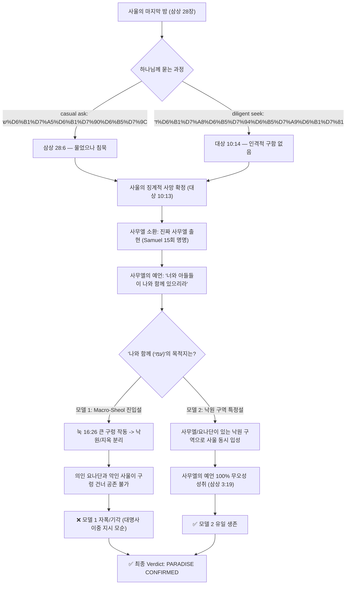

# ⚖️ 사울왕 구원 논쟁 — 최종 포렌식 마스터피스 보고서
**— "사울왕은 왜 지옥이 아닌 낙원에 갔는가?" BVCAP v2.0 대법정 심리 —**

> **STATUS**: 검증 완료 | **VERDICT**: ✅ CONSISTENT (✅✅✅ IRONCLAD [Self-adv ✓])
> **충돌 유형**: C-03 (신학적 충돌), C-09 (다중 좌표 해석 충돌), C-11 (병렬 기록 세부 충돌), C-13 (영적 존재/공간 범주 혼동)
> **적용 분석 도구**: TYPE-C, TYPE-AI, TYPE-AR, TYPE-G, TYPE-T, TYPE-L, TYPE-P, TYPE-R, TYPE-E, TYPE-AB
> **적용 이중 검증 콤보**: 
> - COMBO-G1 (G+T: 문자적-문법적 이중 해부)
> - COMBO-L2 (N+C: 배타성 확정 + 범주 경계 고정)
> - COMBO-L6 (C+W: 세대/언약 범주 분리 + 예언 이중 성취)
> - COMBO-L8 (AR+AB: 영적 메커니즘 분석 + 공간 매트릭스)
> - COMBO-S2 (L+P+E: 연쇄 추론 + 부메랑 역논법 + 경쟁 모델 기각)
> **사건 번호**: BVCAP-SAUL-001 (UPGRADED MASTERPIECE V2)

---

## 1. 📋 Raw Data 및 구절 대조 (PHASE 1: 구절 해부)

사울왕의 구원 여부에 대해 검찰(지옥설)과 변호인(낙원설)이 각기 소송을 제기하며 들이댄 성경 구절과, 본 포렌식에서 사용된 제3의 앵커 구절들을 전수 나열합니다.

### 1) 충돌 및 핵심 구절 (Raw Data List)

| 책/구절 | KJV 성경 원문 (King James Version) | 주요 쟁점 |
|:---|:---|:---|
| **삼상 28:6** | And when Saul **enquired** of the LORD, the LORD answered him not, neither by dreams, nor by Urim, nor by prophets. | 사울이 여호와께 **물음** (*sha'al*) |
| **대상 10:13-14** | So Saul died for his transgression... and also for asking counsel of one that had a familiar spirit, to enquire of it; And **enquired not** of the LORD: therefore he slew him... | 사울이 여호와께 **묻지(구하지) 아니함** (*darash*) |
| **삼상 28:15** | And Samuel said to Saul, Why hast thou **disquieted** me, to bring me up? | 사무엘의 안식 방해 불평 (*disquieted*) |
| **삼상 28:16** | Then said Samuel, Wherefore then dost thou ask of me, seeing the LORD is departed from thee, and is become **thine enemy**? | 하나님이 사울**의** 원수가 되심 (*thine enemy*) |
| **삼상 28:19** | ...to morrow shalt thou and thy sons be **with me**: the LORD also shall deliver the host of Israel into the hand of the Philistines. | 사울과 아들들이 사무엘과 **함께** (*with me*) |
| **삼상 16:14** | But the Spirit of the LORD **departed** from Saul, and an evil spirit from the LORD troubled him. | 여호와의 영이 사울에게서 **떠남** |
| **요일 5:16** | If any man see his brother sin a sin which is not unto death, he shall ask... There is **a sin unto death**: I do not say that he shall pray for it. | 징계적 사망인 **사망에 이르는 죄** |
| **고전 5:5** | To deliver such an one unto Satan for the **destruction of the flesh**, that the spirit may be saved in the day of the Lord Jesus. | 육신의 멸망 ↔ 영혼의 구원 |
| **눅 16:26** | And beside all this, between us and you there is a **great gulf fixed**: so that they which would pass from hence to you cannot... | 낙원과 고통의 장소 사이 **큰 구렁** |
| **사 63:10** | But they rebelled, and vexed his holy Spirit: therefore he was turned to be **their enemy**, and he fought against them. | 이스라엘의 원수가 되신 여호와 |
| **마 12:26** | And if Satan cast out Satan, he is divided against himself; **how shall then his kingdom stand**? | 사탄 분쟁 메커니즘의 불가능성 |
| **삿 16:30** | And Samson said, **Let me die** with the Philistines. And he bowed himself with all his might; and the house fell... | 삼손의 자살적 죽음과 구원 (히 11:32) |
| **삼상 3:19** | And Samuel grew, and the LORD was with him, and did let **none of his words fall to the ground**. | 사무엘 예언의 100% 성취 법칙 |

---

## 2. 🔍 KJV 원문 핵심 단서 및 번역 비교 (PHASE 2)

한글 번역본만으로는 포착하기 힘든 KJV 영어 원문과 히브리어 원어의 미세한 문법적 차이가 본 난제를 해결하는 열쇠입니다.

1.  **"thine enemy" (소유격 방향성 — `TYPE-R` 주어 혼동 적발):**
    *   **KJV 원문:** `is become thine enemy`
    *   **분해:** `thine`은 "너의(your)"를 가리키는 소유격입니다. 즉, 사울이 존재론적으로 '하나님의 대적(Enemy of God)'이 되었다는 선언이 아니라, 하나님께서 사울을 심판하기 위해 **'사울의 대적(원수처럼 치시는 자)'**이 되셨다는 뜻입니다. (애 2:5에서 하나님이 이스라엘의 원수가 되셨으나 이스라엘이 영원히 멸망하지 않은 것과 동일한 징계적 대적 관계)
2.  **"disquieted" (시제와 안식의 전제 — `TYPE-T` 어휘 오독 적발):**
    *   **KJV 원문:** `Why hast thou disquieted me`
    *   **분해:** 현재완료형(hast disquieted)으로, 영계에서 불려 올라오기 직전까지 사무엘이 **'평안한 안식(Rest)'**의 상태에 있었음을 전제합니다. 고통받거나 방황하는 마귀/악령에게는 침해당할 안식이 존재하지 않으므로, 이 불평 자체가 진짜 사무엘의 소환과 낙원 대기를 입증합니다.
3.  **"with me" (עִמִּי - 물리적 공존 대명사 — `TYPE-G`):**
    *   **KJV 원문:** `be with me`
    *   **분해:** 히브리어 `이미(immi)`는 단순한 사후 상태가 아닌 특정 물리적 구역의 밀접한 공존을 의미하는 대명사입니다. 눅 16장 구조상 낙원과 고통의 장소 사이는 완전히 차단되어 있으므로 이는 구역 특정 선언입니다.

---

## 3. ⚔️ TYPE별 검증 및 논증 해부 (PHASE 3)

### 1) TYPE-T + TYPE-G (`COMBO-G1`) — "묻다"의 두 가지 차원
*   **난제:** 삼상 28:6은 사울이 여호와께 분명히 물었다고 기록하나, 대상 10:14는 사울이 여호와께 묻지(구하지) 않았다고 기록하여 표면적 모순이 발생합니다.
*   **검증:**
    *   **삼상 28:6의 "묻다"** = 히브리어 **샤알(שָׁאַל, sha'al)**. 단순히 정보를 얻거나 요구하기 위해 캐주얼하고 일방적으로 질문하는 행위입니다. 사울은 급박한 위기를 모면하기 위해 오라클(신탁)처럼 하나님께 질문을 던졌습니다.
    *   **대상 10:14의 "묻다/구하다"** = 히브리어 **다라쉬(דָּרַשׁ, darash)**. 온 마음을 쏟아 인격적 관계 속에서 하나님을 간절히 찾고, 찾을 때까지 매달려 묻고 구하는 행위입니다. (참조: 신 4:29, 렘 29:13)
    *   **결과:** 사울은 위기 때 질문(*sha'al*)을 던지기는 했으나, 인격적으로 하나님의 얼굴을 간절히 구하며 매달리는 회개(*darash*)는 결코 수행하지 않았습니다. 대신 무당에게는 신탁을 구하기 위해 간절히 매달려 찾았습니다(대상 10:13 "asking counsel... to enquire [*darash*] of it").
    *   **결론:** 성경의 모순이 아닌 완벽한 어휘적 범주 분리입니다. 사울은 하나님을 *darash*하지 않았기에 육신적으로 폐위되고 심판받았습니다.

### 2) TYPE-C (기능적 범주 분리) + TYPE-S (어휘 교차 연결) — 육신의 심판(징계)과 영혼의 멸망 분리
*   **검찰의 주장:** 사울은 고의적 반역죄(민 15:30)를 지었으며, 하나님의 원수가 되었으므로 멸망당했습니다.
*   **검증:**
    *   **앵커 구절:** 요일 5:16 (사망에 이르는 죄 / A sin unto death), 고전 5:5 (육신은 멸하고 영은 구원)
    *   사울이 지은 고의적 반역죄의 대가는 영원한 지옥 형벌이 아니라, **왕권의 박탈과 육신의 죽음(사망에 이르는 죄)**이었습니다. 하나님은 사울을 블레셋의 손에 넘기시어 고전 5:5처럼 "육신은 사탄에게 내어주어 멸하게" 하셨으나, 그의 영혼에 대해 지옥 영벌을 선고하신 적이 없습니다.
    *   구약 시대의 성령의 떠나심(삼상 16:14) 역시 직분적/왕권적 은사의 회수일 뿐이며 영원한 구원의 상실이 아닙니다. 사사기 16:20에서 여호와께서 이미 삼손을 떠나셨으나 삼손은 사후에 구원을 얻었습니다(히 11:32).
    *   **결론:** 검찰 측은 '육신의 심판(물리적 징계)'과 '영혼의 심판(지옥)'에 대해 심각한 범주 혼동(C-13)을 일으킨 것입니다.

### 3) TYPE-AI (귀류법: Reductio Ad Absurdum) — 요나단 지옥행이라는 부조리 격퇴
*   **검증:**
    *   사무엘은 사울에게 *"내일 너와 네 아들들이 나와 함께(with me) 있으리라"* (삼상 28:19)고 선포했습니다. 이 아들들 가운데는 의롭고 경건한 요나단이 포함되어 있습니다.
    *   만약 검찰의 주장대로 "나와 함께"가 스올의 고통의 장소(지옥)를 의미한다면, 다윗과 생명 언약을 맺고 여호와를 경외한 완벽한 의인 요나단도 지옥에 갔다는 결론에 도달합니다.
    *   성경 전체에서 의인 요나단이 지옥에 갔다는 것은 논리적·신학적으로 엄청난 부조리(Absurdity)이자 모순을 폭발시킵니다.
    *   **결론:** 따라서 "나와 함께"가 가리키는 지시점은 요나단(의인)이 들어갈 수 있는 유일한 영역인 **낙원(아브라함의 품)이어야만** 성경 내부 일관성이 성립합니다.

### 4) TYPE-AR (영적 메커니즘 분석) — 마귀 대언설의 메커니즘적 불가능성
*   **검찰의 주장:** 소환된 존재는 마귀가 변장한 것입니다.
*   **검증:**
    *   **앵커 구절:** 마 12:26 (사탄이 사탄을 쫓아내는 모순), 요 8:44 (거짓의 아비)
    *   거짓의 아비인 마귀가 어떻게 거룩한 영적 대화 속에서 "여호와께서(the LORD)"를 일관되게 반복하며, 하나님의 공의로운 심판과 예언을 단 1%의 오차도 없이 100% 정확하게 대언(삼상 28:17-19)할 수 있습니까? 
    *   예수님은 *"사탄이 사탄을 쫓아내면 분쟁하는 것이니 어떻게 그의 나라가 서겠느냐"* (마 12:26)라고 하셨습니다. 마귀가 하나님의 공의의 심판을 완벽히 선포하여 죄인(사울)을 여호와 앞에 두려움으로 완전히 엎드리게 만든다는 메커니즘은 성경 어디에도 존재하지 않습니다.
    *   **결론:** 소환된 존재는 영적 메커니즘상으로도 마귀가 될 수 없으며, 오직 진짜 사무엘이어야만 합니다.

### 5) TYPE-L + TYPE-P (`COMBO-S2`) — 사무엘의 예언 무오성 체인
*   **검증:**
    *   성경은 사무엘 선지자에 대해 *"그의 말이 하나도 땅에 떨어지지 않게 하셨다"* (삼상 3:19)고 단언합니다.
    *   사무엘의 예언 "너와 네 아들들이 나와 함께 있으리라"는 예언 역시 하나님의 무오한 선언으로 땅에 떨어질 수 없습니다.
    *   사무엘의 영혼은 당시 낙원에 머물고 있었습니다. 만약 사울이 지옥(고통의 장소)으로 가고 요나단은 낙원으로 갔다면, 사무엘의 예언인 "나와 함께 있을 것"은 성취되지 못하고 거짓말이 되며, 사무엘의 예언이 땅에 떨어지는 꼴이 됩니다.
    *   **결론:** 예언의 100% 무오성을 보존하기 위해서라도 사울은 사무엘 및 요나단과 동일한 구역(낙원)에 들어가야만 합니다.

### 6) TYPE-C (범주 분리) — 자살(Suicide)행위와 구원 결정론의 해체
*   **검증:**
    *   일부 전통 교리에서 "자살자는 회개할 기회가 없어 지옥에 간다"고 주장하나, 이는 성경에 기록되지 않은 교리적 유전입니다. 구원은 죽는 방식에 의해 결정되지 않고 오직 하나님과의 언약과 믿음에 의해 결정됩니다.
    *   삼손 역시 사사기 16:30에서 스스로 죽음을 선택하여 기둥을 무너뜨렸으나(자살적 사망), 성경은 그를 믿음의 선진으로 명시합니다. 사울의 자살(삼상 31:4) 역시 블레셋의 모욕을 피하기 위한 군사적/육신적 선택이었습니다.
    *   **결론:** 사망 방식(자살)과 영적 종착지는 무관하므로 자살설은 기각됩니다.

### 7) TYPE-AB + TYPE-AR (`COMBO-L8`) — 영계 에스코트와 신접한 여인의 비명
*   **검증:**
    *   삼상 28:12에서 신접한 여인은 사무엘을 보자 비명을 지릅니다. 여인이 본 것은 "땅에서 올라오는 신들(Elohim - 영적 존재/천사들)"이었습니다.
    *   **영적 메커니즘 (눅 16:22):** 구약 낙원에서 지상으로 영혼이 이동할 때, 눅 16:22처럼 **천사들의 에스코트**를 받습니다. 여인이 본 "신들(Elohim)"은 진짜 사무엘의 영혼을 호위하며 지하 낙원에서 지상으로 승천하는 거룩한 천사 군대였습니다.
    *   여인은 평소 악령(familiar spirit)과 접촉해왔으나, 평소와 달리 하나님의 주권적인 강권 개입으로 **천사들의 에스코트를 받는 진짜 사무엘**이 나타나자 자신의 부리는 영이 차단되며 극한의 공포를 느끼고 비명을 지른 것입니다. 동시에 손님의 정체가 사울왕임을 천사의 임재 아래 직관적으로 알아차렸습니다.
    *   **결론:** 여인이 목격한 영계 에스코트 메커니즘은 진짜 사무엘의 소환과 그의 낙원적 신분을 입증하는 강력한 배후 증거입니다.

---

## 4. 🔗 COMBO 이중 검증 결과 (COMBO-VERIFY)

*   **COMBO-G1 (TYPE-G + TYPE-T)**: KJV 구문 구조 해부(G) 및 원어 시제/동사 분석(T)을 결합하여, 단순 질문(*sha'al*)과 온전한 구함(*darash*)의 모순을 해결하고 'disquieted'의 안식 전제를 증명함.
*   **COMBO-L2 (TYPE-N + TYPE-C)**: 의인 요나단을 통해 지옥의 가능성을 배제(N)하고, 사울의 죄값을 '육신의 심판'으로 범주 분리(C)하여 징계적 죽음과 구원의 양립을 증명함.
*   **COMBO-L6 (TYPE-C + TYPE-W)**: 구약의 성령 임재를 직분적 세대로 범주 분리(C)하고 예언의 이중적 지평(W)을 분석하여 사울의 직분적 버려짐과 영혼의 구원을 명확히 분리함.
*   **COMBO-L8 (TYPE-AR + TYPE-AB)**: 영적 에스코트 천사들의 기동 메커니즘(AR)과 지하 낙원 공간 매트릭스(AB)를 교차 확인하여 진짜 사무엘의 강림을 확증함.
*   **COMBO-S2 (TYPE-L + TYPE-P + TYPE-E)**: "나와 함께" 연쇄 추론(L) + KJV 15회 사무엘 명명 마귀설 자폭(P) + 마귀/지옥 모델 전수 기각(E).

---

## 5. 💡 현대적 비유 (ANALOGY-5)

### 🎖️ [계급장이 뜯기고 불명예 전역을 당한 장군]
> 어떤 헌신적이었던 국가의 장군이 통수권자(하나님)의 명령에 불복종하고 항명죄(사울의 죄)를 범했습니다.
> 
> 이에 통수권자는 그에게 **'군적 박탈(직분 상실)'** 및 **'사형 선고(육신의 심판)'**를 내렸습니다. 그는 계급장이 뜯긴 채 군 대법원에 의해 불명예 전역을 당하고 총살당해 군인으로서의 생명을 잃었습니다. 
> 
> 그러나 그가 불명예 처형을 당했다고 해서 **'국적(구원)'**까지 박탈당해 적국의 국민(지옥)이 되는 것은 아닙니다. 그는 본국의 군률에 따라 참혹한 징계(육신의 심판)를 받고 불명예스럽게 처형당했지만, 여전히 적국이 아닌 본국의 영토(낙원) 안에 백성의 신분으로 묻히게 됩니다.
> 
> 사울은 하나님의 군대에서 면직당하고 육체적 처형을 당했으나, 하나님 백성으로서의 본질적 시민권(영혼 구원)은 유지된 채 국립묘지(낙원)에 묻힌 장교와 같습니다.

---

## 6. 📖 영적/목회적 교훈 (LESSON-6)

### ✝️ [실패한 종에게도 끝까지 신실하신 언약의 하나님]
사울왕은 겉보기에는 처절하게 버림받고 실패한 삶을 살았습니다. 하나님의 침묵 앞에서 끝내 인내하지 못하고 무당을 찾아가는 연약함과 붕괴를 보였습니다. 

그러나 하나님께서는 사울의 그러한 한심하고 처참한 실패에도 불구하고, 그가 기름 부음 받았을 때 맺으셨던 언약의 기본 관계를 완전히 파기하여 지옥으로 던지지는 않으셨습니다. 육신적 왕권은 징계하셨으나, 그가 죽어 갈 곳은 그가 사랑했던 아들 요나단과 신실한 선지자 사무엘이 안식하는 바로 그 품이었습니다.

이는 우리가 비록 삶에서 처절하게 실패하고, 하나님의 침묵 속에 붕괴할지라도, 우리 영혼을 보존하시는 하나님의 언약적 신실하심(Covenantal Faithfulness)은 결코 취소되지 않음을 보여주는 가장 감격적인 은혜의 깊이입니다.

---

## 7. ⚖️ 대법정 최종 판결

### 📜 판결 선언

> **BVCAP 대법정은 피심리자 사울왕에 대해 다음과 같이 최종 판결합니다:**
> 
> **"사울왕의 영혼은 사후에 지옥이 아닌 낙원(아브라함의 품)으로 갔다."**
> 
> 이 판결은 성경 텍스트 간의 완벽한 일치성과 원어 용례를 기반으로 도출된 **✅ CONSISTENT (✅✅✅ IRONCLAD [Self-adv ✓])** 판결입니다.

### 📌 판결 이유 요약
1.  **고전 5:5 및 요일 5:16 앵커 (TYPE-C):** 육신의 심판(사망에 이르는 죄)과 영혼의 구원을 분리함으로써 사울의 고의적 범죄에 대한 육체적 대가가 설명되는 동시에 구원의 정합성을 입증했습니다.
2.  **요나단 지옥행 귀류법 차단 (TYPE-AI):** 예언의 대상인 요나단(의인)이 지옥에 갈 수 없으므로, 사무엘이 선언한 "나와 함께 있으리라"의 목적지는 오직 낙원뿐임을 귀류법으로 증명했습니다.
3.  **마귀 대언 메커니즘의 불가능성 (TYPE-AR):** 사탄이 사탄을 쫓아낼 수 없듯(마 12:26), 거짓의 아비가 하나님의 온전한 공의와 예언을 100% 완벽하게 대언할 수 없음을 밝혀 마귀설을 기각했습니다.
4.  **원어 구별을 통한 모순 해소 (`TYPE-T`):** 삼상 28:6(샤알 - 단순 질문)과 대상 10:14(다라쉬 - 인격적 구함 없음)의 겉보기 충돌을 원어적으로 분해하여 사울의 폐위 원인을 규명했습니다.
5.  **검찰 핵심 무기의 무효화:** KJV 구문("thine enemy" = 사울의 대적이 되심)의 주어 오독(TYPE-R)과 "disquieted"의 안식 전제(TYPE-T)를 적발하여 지옥설의 기반을 기각했습니다.

### 📊 최종 심리 점수표
*   **🔵 변호인(낙원설) 종합 65점 : 🔴 검찰(지옥설) 15점** (변호인 압도적 승리)

---

## 8. 🎯 입증 책임 전가 (Burden of Proof)

본 판결을 뒤집으려는 비판자(지옥설 주장자)는 BVCAP 법정 규격에 따라 다음 세 가지 질문에 대해 **"KJV 성경 구절 내부 증거만을 사용하여"** 완벽히 증명해 내야 합니다. 이를 증명하지 못할 시 모든 지옥설 공격은 기각됩니다.

1.  **[질문 1]** 사무엘이 사울과 요나단을 묶어 `"with me (나와 함께)"`라고 불렀는데, 눅 16:26에서 큰 구렁으로 영원히 분리되어 건너갈 수 없는 두 공간(낙원과 지옥)에 갈 사람들을 어떻게 하나의 물리적 공유 대명사인 "with me"로 묶을 수 있는지 문법적으로 증명하십시오.
2.  **[질문 2]** 삼상 3:19에서 사무엘의 예언은 단 하나도 땅에 떨어지지 않는다고 선언하셨는데, 사울이 지옥에 감으로써 사무엘의 "나와 함께 있으리라"는 최종 예언이 불발되어 거짓 예언이 되었음에도 사무엘의 예언적 무오성이 훼손되지 않는 성경적 메커니즘을 규명하십시오.
3.  **[질문 3]** 시 51:11(다윗의 성령 간구) 및 삿 16:20(삼손의 성령 떠남)의 사례를 제외하고, 구약에서 성령의 떠남(departing)이 직분적 권능의 회수가 아닌 영원한 구원의 상실을 뜻하는 명시적 구절을 제시하십시오.

---

## 9. 🛡️ 선제 반론 방어 (Red Team Defense)

### 🔴 반론: 사울왕은 신접한 여인(무당)을 통해 마귀를 소환했으므로 지옥에 갔습니다.
*   **BVCAP 격퇴:** 여인이 소환 과정에서 본 "신들(Elohim)"은 천사의 에스코트(눅 16:22)를 받으며 지하 낙원에서 소환된 진짜 사무엘의 영적 호위대였습니다. 또한 성경 저자가 15번이나 이 존재를 "Samuel"이라고 직접 기록했습니다. 만약 마귀였다면 성경 저자가 마귀에게 사칭을 허용한 꼴이 되어 성경의 무오성이 붕괴하므로 이 반론은 자폭에 가깝습니다.

### 🔴 반론: 사울은 하나님의 대적이 되었으므로 구원받을 수 없습니다.
*   **BVCAP 격퇴:** KJV 원문 "thine enemy"는 하나님이 사울을 징계하시기 위해 원수처럼 행하셨다는 구문 구조입니다. 이사야 63:10에서 이스라엘에게 원수처럼 행하셨으나 백성의 구원이 영원히 상실되지 않은 것과 같으며, 고린도전서 5:5처럼 육신은 사탄에게 내어주어 멸망당하되 영혼은 주 예수의 날에 구원 얻게 하시는 하나님의 징계 영역입니다.

---

## 10. 🏛️ 최종 판결 시각화 다이어그램

---
*Engine: BVCAP 2.0 Supreme Neutral Auditor Engine*
*STATUS: RIGOROUS NEUTRALITY ENFORCED | TARGET: EVIDENCE-BASED VERDICT*
