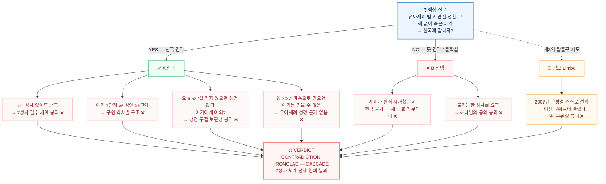
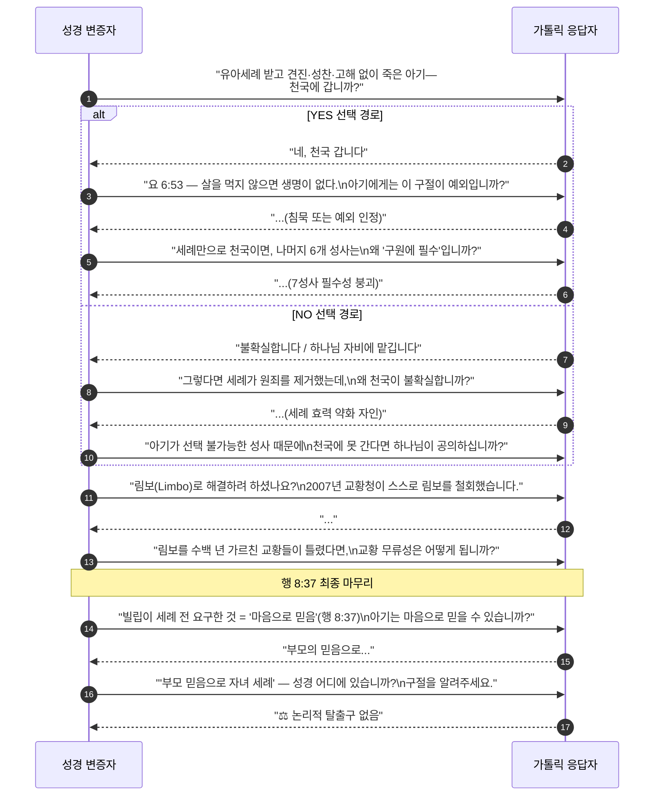

# 가톨릭 유아세례 교리 연쇄 붕괴 감사
**— 단 하나의 질문이 7성사 체계 전체를 무너뜨리는 방법 —**
**BVCAP v2.0 감사 보고서**

> **STATUS**: 검증 완료 | VERDICT: ❌ CONTRADICTION (IRONCLAD — CASCADE)
> **충돌 유형**: C-03 (신학적 자기모순) + C-05 (내부 교리 상충) + C-08 (신학적 질의 딜레마)
> **적용 분석 도구**: TYPE-AI (귀류법), TYPE-N (배타성), TYPE-AG (침묵 논증), TYPE-AC (고대 맥락), TYPE-J (법정 심문)
> **분석 의뢰**: 유아세례 딜레마를 통한 가톨릭 7성사 체계 자기모순 전방위 검증

---

## 0. 핵심 무기 — 단 하나의 질문

> **"유아세례를 받고 견진성사도, 첫 영성체도, 고해성사도 받기 전에 죽은 아기는 천국에 갑니까, 못 갑니까?"**

이 질문이 강력한 이유:
- 어느 쪽을 선택해도 가톨릭 교리 체계 내부에서 자기모순이 발생
- 가톨릭 측이 도입한 해결책(림보)도 2007년 스스로 철회
- 성경 본문으로 모든 출구가 봉쇄됨

---

## 🗺️ 연쇄 붕괴 전체 지도 (플로우차트)



---

## 1부 — 강제 선택 구조 설계

가톨릭 7성사 체계가 가르치는 것:

| 성사 | 공식 역할 | 공식 필요성 |
|:---|:---|:---|
| **세례(Baptism)** | 원죄 제거, 하나님의 자녀 됨 | 구원에 필수 (요 3:5 해석 기반) |
| **견진성사(Confirmation)** | 성령 충만, 신앙 완성 | 세례를 완성시키는 필수 성사 |
| **성찬(Eucharist)** | 그리스도의 몸과 피 | 요 6:53 — "먹지 않으면 생명이 없다" |
| **고해성사(Penance)** | 대죄(mortal sin) 용서 | 대죄 후 유일한 회복 경로 |
| **병자성사(Anointing)** | 임종 전 은총 | 임종 시 필요 |

**이 체계 안에서 강제 선택이 발생한다:**

```
[강제 선택]

    유아세례 받고 → 그 외 성사 없이 사망

        ┌─────────────────────────────────┐
        │                                 │
    [A] 천국 간다              [B] 천국 못 간다 / 불확실
        │                                 │
    ↓                                 ↓
 [연쇄 붕괴 1-3]               [연쇄 붕괴 4-6]
```

---

## 2부 — A 선택 시 연쇄 붕괴 (천국 간다)

### [붕괴 1] 견진·성찬·고해·병자성사가 불필요해짐

**TYPE-AI (귀류법)**:

```
전제: 유아는 세례만 받고 죽어도 천국 간다

그렇다면:
- 견진성사 없어도 → 천국 간다 (견진이 "필수"라면 어떻게?)
- 성찬 없어도 → 천국 간다 (요 6:53 "먹지 않으면 생명 없다"는?)
- 고해성사 없어도 → 천국 간다 (고해가 대죄의 유일한 해결책이라면?)
- 병자성사 없어도 → 천국 간다

∴ 세례 하나면 충분하다
∴ 나머지 성사 6개는 구원에 필수가 아님
∴ 7성사 필수 체계 붕괴
```

> **격퇴 포인트**: "아기가 천국에 간다면, 요 6:53 — '인자의 살을 먹지 않으면 너희 속에 생명이 없느니라' — 이 구절을 어떻게 해석하십니까? 아기에게는 예외가 적용되는 성경 구절이 있습니까?"

---

### [붕괴 2] 성인 신자가 아기보다 구원받기 어려운 역차별 구조

```
아기 경로: 세례 → 사망 → 자동 천국 ✅ (1단계)

성인 경로: 세례 → 견진 → 매주 미사 → 고해 → 병자성사
           → 그래도 임종 직전 대죄 하나면 지옥 가능 ❌ (5단계 이상)

결론:
아기로 죽을수록 구원 확률이 높다
성인으로 오래 살수록 구원이 어려워진다

→ 이것이 하나님의 공의로운 구원 설계인가?
```

**TYPE-AI**:
```
IF 아기는 1단계로 천국 가능 AND
   성인은 5+단계를 거쳐야 천국 가능
THEN 구원은 신앙·성사가 아닌 사망 시기에 달려 있음
THEN 성사 체계는 구원의 경로가 아닌 장벽
```

---

### [붕괴 3] 행 8:37 — 믿음이 먼저라는 성경 원리와 충돌

**KJV 원문:**
> *"And Philip said, If thou believest with all thine heart, thou mayest. And he answered and said, I believe that Jesus Christ is the Son of God."* (행 8:37)

세례의 전제 조건 = **"마음으로 믿는 것"** — 이것이 먼저다.

```
TYPE-N (배타성):
행 8:37에서 세례의 조건 = 마음으로 믿음
아기는 마음으로 믿을 수 없음 (인지 발달 미완)
∴ 아기 세례는 행 8:37의 전제 조건을 충족하지 못함
∴ 유아세례는 성경적 세례의 범주 밖
```

**갈 3:26**:
> *"For ye are all the children of God by **faith** in Christ Jesus."* (갈 3:26)

하나님의 자녀가 되는 방법 = 믿음. 물이 아니다.

> **격퇴 포인트**: "행 8:37에서 빌립이 세례의 조건으로 제시한 것이 '믿음'입니까, '부모의 의도'입니까?"

---

## 3부 — B 선택 시 연쇄 붕괴 (천국 못 간다 / 불확실)

### [붕괴 4] 세례 자체가 무의미해짐

```
TYPE-AI:
IF 세례받은 아기가 천국에 못 간다면
THEN 세례가 원죄를 제거한다는 교리가 거짓
THEN 원죄 제거 = 천국 가능 상태인데 그 상태인 아기가 못 간다는 모순

OR:
IF 원죄 제거만으로는 천국에 못 간다면
THEN 세례의 효력은 구원에 불충분
THEN 세례를 "구원에 필수"라고 가르치는 교리가 과장되거나 거짓
```

---

### [붕괴 5] 하나님의 공의 붕괴

**TYPE-J (법정 심문)**:

```
검사: "아기는 스스로 성사를 선택할 능력이 있습니까?"
증인: "없습니다."

검사: "그렇다면 아기가 견진성사, 첫 영성체를 받지 않은 것은
      아기의 선택입니까, 능력 밖의 일입니까?"
증인: "능력 밖입니다."

검사: "그렇다면 하나님이 능력 밖의 일을 이유로 아기를 천국에서
      제외하신다면, 이것이 공의로우십니까?"
```

**롬 4:15**:
> *"Because the law worketh wrath: for where no law is, there is no transgression."*

율법을 이해할 능력이 없는 곳에 범죄도 없다. → 아기에게 성사 의무를 부과할 수 없음.

---

### [붕괴 6] 림보(Limbo) 해결책의 자기 철회

가톨릭은 이 딜레마를 역사적으로 **림보(Limbus Infantium)**로 해결하려 했다:

> "세례 받지 못하고 죽은 아이는 지옥의 고통은 없지만 하나님도 없는 중간 상태에 있다."

그러나 이 해결책 자체가 스스로 무너졌다:

| 연도 | 사건 | 의미 |
|:---|:---|:---|
| 중세 이후 | 림보 교의 광범위 교육 | "공식 가톨릭 가르침"으로 수세기간 전파 |
| **2007년** | 교황청 국제신학위원회 "The Hope of Salvation for Infants who die without being Baptised" 발표 | **"림보는 공식 교의가 아니며, 세례받지 못한 아이들도 하나님의 자비에 맡겨질 수 있다"** |

**TYPE-AI (귀류법)**:
```
IF 림보가 수백 년간 교황청의 가르침이었다
AND 2007년 교황청이 스스로 "더 이상 권장되지 않는다"고 철회했다면
THEN 이전 교황들의 가르침 중 틀린 것이 있다
THEN 교황 무류성(Papal Infallibility)이 붕괴된다

OR:
IF 림보가 공식 교의가 아니었다면
THEN 수백 년간 교회는 공식 교의가 아닌 것을 공식처럼 가르쳤다
THEN 교도권(Magisterium)의 신뢰성이 붕괴된다

∴ 어느 쪽도 가톨릭에게 치명적이다
```

---

## 4부 — 성경적 구원 원리: 믿음 vs 성사

가톨릭의 성사 구원론과 정면으로 충돌하는 성경 구절들:

### [앵커 1] 엡 2:8-9 — 행위(성사)가 아닌 은혜+믿음

> *"For by grace are ye saved through faith; and that not of yourselves: it is the gift of God: Not of works, lest any man should boast."* (엡 2:8-9)

**TYPE-N**: 성사는 사람이 수행하는 "행위(works)"이다. 엡 2:8-9는 행위로 구원받지 않는다고 명시한다.

### [앵커 2] 롬 10:9-10 — 입으로 시인, 마음으로 믿음

> *"That if thou shalt confess with thy mouth the Lord Jesus, and shalt believe in thine heart that God hath raised him from the dead, thou shalt be saved."* (롬 10:9)

성경이 제시하는 구원의 조건 = 고백 + 믿음. 세례 없음. 유아는 이 조건도 충족 불가.

→ **가톨릭의 딜레마**: 유아가 롬 10:9의 방법으로 구원받는다면 성사가 불필요. 성사로 구원받는다면 롬 10:9과 충돌.

### [앵커 3] 요 5:24 — 믿는 자는 이미 생명을 가졌다

> *"He that heareth my word, and believeth on him that sent me, hath everlasting life, and shall not come into condemnation."* (요 5:24)

믿음 → 영생. 현재 시제. 성사 완료 후 영생이 아니다.

---

## 🎯 실전 대화 흐름 (시퀀스 다이어그램)



---

## 5부 — 실전 대화 공격 순서

### [1단계] 강제 선택 질문 투하

> "유아세례를 받고 견진성사 전에 죽은 아기는 천국에 갑니까?"

**YES라면** → 즉시 2단계로

**NO라면** → "그렇다면 세례가 원죄를 제거한다는 교리가 왜 그 아기를 천국에 보내기에 불충분합니까?"

---

### [2단계] YES 응답 → 성사 체계 붕괴 질문

> "아기가 천국에 간다면, 요 6:53 — '인자의 살을 먹지 않으면 너희 속에 생명이 없다' — 이 구절에서 '너희'에 아기는 포함됩니까, 제외됩니까?

> 포함된다면 아기는 생명이 없어야 합니다.
> 제외된다면 성경 구절에 예외가 생깁니다.
> 어느 쪽입니까?"

---

### [3단계] 림보 카드 철회 포착

가톨릭이 "림보"를 언급하면:

> "2007년 교황청 국제신학위원회가 림보를 공식 교의가 아니라고 발표했습니다. 그 이전에 림보를 공식처럼 가르친 교황들은 틀린 것입니까, 맞는 것입니까?"

---

### [4단계] 행 8:37 마무리

> "빌립이 에디오피아 내시에게 세례를 주기 전에 요구한 조건이 무엇입니까? 행 8:37 — '네가 마음으로 믿으면 가능하다.' 아기가 마음으로 믿을 수 있습니까? 만약 없다면, 유아세례는 행 8:37의 조건을 갖추지 못한 세례 아닙니까?"

---

## 6부 — BVCAP 최종 판결

### 판결표

| 교리 | 검증 결과 | 붕괴 경로 |
|:---|:---:|:---|
| 유아세례 구원 효력 | ❌ | 행 8:37 믿음 전제 조건 충족 불가 |
| 7성사 필수 체계 | ❌ | A 선택 시 세례 하나면 충분해짐 |
| 요 6:53 성찬 필수성 | ❌ | 아기 예외 허용하면 구절 보편성 붕괴 |
| 하나님의 공의 | ❌ | B 선택 시 불가능한 의무 부과 |
| 림보 교의 | ❌ | 교황청 스스로 2007년 철회 → 무류성 충돌 |
| 교황 무류성 | ❌ | 림보 철회 → 과거 교황 오류 확인 |

### 최종 종합 판결

> **VERDICT**: ❌ CONTRADICTION (IRONCLAD — CASCADE)
>
> 유아세례 딜레마는 단 하나의 질문으로 가톨릭 7성사 체계를 연쇄 붕괴시킨다:
> - **A(천국 간다) 선택**: 6개 성사 불필요 + 성인 역차별 + 요 6:53 충돌 + 행 8:37 위반
> - **B(못 간다) 선택**: 세례 효력 무력화 + 하나님의 공의 붕괴
> - **림보 도피**: 교황청 스스로 2007년 철회 → 무류성 + 교도권 동시 붕괴
>
> 이 딜레마에서 가톨릭 교리 체계가 탈출할 성경적 출구는 없다.

---

## 🔗 연관 카톨릭 변증 보고서 및 실전 대화록 (BVCAP)
* [카톨릭_댓글.md](./카톨릭_댓글.md)
* [카톨릭2차전.md](./카톨릭2차전.md)
* [REPORT_베드로_갈보리순교설.md](./REPORT_베드로_갈보리순교설.md)
* [REPORT_가톨릭이_예수님을_구원자로_시인하지_못하는_이유.md](./REPORT_가톨릭이_예수님을_구원자로_시인하지_못하는_이유.md)
* [REPORT_카톨릭외전_대본분석.md](./REPORT_카톨릭외전_대본분석.md)
* [REPORT_교황수위권_베드로반석_오류감사.md](./REPORT_교황수위권_베드로반석_오류감사.md)
* [REPORT_사도계승_역사전승_오류감사.md](./REPORT_사도계승_역사전승_오류감사.md)
* [REPORT_카톨릭_성인전구교리_검증.md](./REPORT_카톨릭_성인전구교리_검증.md)
* [REPORT_마리아_무염시태_승천_오류감사.md](./REPORT_마리아_무염시태_승천_오류감사.md)
* [REPORT_요한1서_콤마.md](./REPORT_요한1서_콤마.md)
* [REPORT_가톨릭_3대탈출구_봉쇄_SolaScriptura.md](./REPORT_가톨릭_3대탈출구_봉쇄_SolaScriptura.md)
* [REPORT_유아세례_딜레마_7성사붕괴.md](./REPORT_유아세례_딜레마_7성사붕괴.md)

---
*Generated by BVCAP 2.0 Supreme Neutral Auditor Engine*
*최초 작성: 2026-07-03 | 분석 모드: MODE B (Forensic Court) + TYPE-AI CASCADE*
*STATUS: RIGOROUS NEUTRALITY ENFORCED | FULL SCAN 전종 투입 | TARGET: EVIDENCE-BASED VERDICT*
