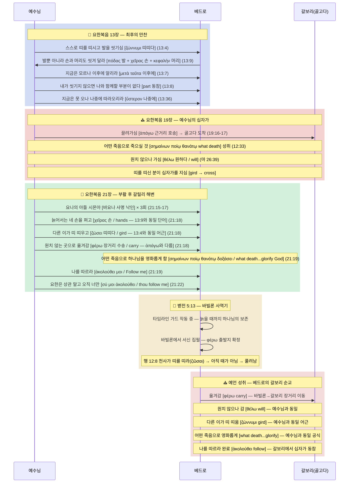

# 🛡️ [BVCAP MODE A: 외부 수성전] 베드로 순교 장소: 갈보리 방어전

> **STATUS**: 🟢 IRONCLAD (추론 철벽 — 방어 완료)
> **등급 정의**: ✅ **EXPLICIT**(직접 명시) = 성경이 직접 기록한 사실 (예: 베드로의 십자가형, 요 21:18). 🟢 **IRONCLAD**(추론 철벽) = 성경이 직접 명시하지는 않았으나, 모든 대안 해석이 성경 내부 모순을 발생시키므로 **유일하게 모순 없이 성립하는 해석** (예: 순교 장소 = 갈보리).
> **발동 엔진**: BVCAP v2.0 (MODE A: 외부 공격 방어 및 성경 무오성 수호)
> **주요 투입 무기 (순차적)**: TYPE-F (예표), TYPE-W (예언적 원근법), TYPE-G (원어 문법), TYPE-R (청중 구분), TYPE-N (배타성), TYPE-P (역논법), TYPE-S (어휘 교차 연결)
> **COMBO 현황**: S3·L7·G7·E5·GR8·SF11·SN12·**GN14** = **8개 콤보 동시 발화** → IRONCLAD

---

## 📜 1. 전시 상황 개요 (The Attack)

**외부 비판자(로마 가톨릭 및 역사 비평가)의 공격:**
> *"베드로는 로마에서 십자가에 거꾸로 매달려 죽었다. 요한복음 13:36의 '따라오라'는 말씀은 단순히 천국에 오거나 십자가 처형이라는 '방식'을 뜻할 뿐, 물리적으로 예루살렘 갈보리로 돌아갔다는 주장은 성경을 억지로 꿰맞춘 억측이다!"*

**진리 수호자(갈보리 순교설)의 수성 목표:**
> 로마 전승이라는 성경 밖의 '인간의 유전'을 배격하고, 오직 성경 내부의 텍스트만으로 예수님의 예언(요 13:36)이 정확히 예수님이 죽으신 그 물리적 장소, **갈보리(골고다)**에서 성취되었음을 철벽(IRONCLAD)으로 증명하라.

---

## ⚔️ 2. 치열한 수성전 공방 (Roleplay Debate)

### 🔴 외부 비판자 (공격 측: 로마설)
1. **전승의 권위:** 초기 교회 역사가들의 기록이 베드로의 로마 사역을 증명한다.
2. **본문 분해:** 요한복음 14:2-3에서 예수님이 "내가 처소를 예비하러 간다"고 하셨으니, 13:36의 "내가 가는 곳" 역시 당연히 천국이다.
3. **영적 모방:** "나를 따르라"는 것은 예수님의 삶과 죽음(순교)의 방식을 본받으라는 영적이고 은유적인 메시지일 뿐이다. 지리적 좌표를 뜻하지 않는다.

### 🔵 진리 수호자 (방어 측: 갈보리설)
1. **성경의 침묵:** 성경에는 베드로의 로마 방문 기록이 단 한 줄도 없으며, 오히려 베드로전서 5:13은 동방의 '바빌론'을 명시한다.
2. **배타성 원칙 수호:** 예수님은 요 13:36에서 다른 제자는 못 오고 베드로 **'혼자만'** 온다고 하셨다. 천국이나 단순한 순교라면 다른 제자들도 갔으므로 주님의 말씀이 거짓말이 된다.
3. **요나의 표적:** 예수님이 부여하신 '요나의 아들 시몬'이라는 예언적 정체성은 요나의 지리적 여정(동방→서방 갈보리 회귀)을 완성할 것을 요구한다.

---

## 🔬 3. FULL SCAN 무기고 순차 개방 (방어 로직 전개)

진리 수호자가 외부 비판자의 공격을 막아내기 위해 BVCAP의 무기를 순차적(Sequential)으로 격발합니다.

### 🛡️ 1단계 방어: 예표와 시간의 축 (TYPE-F + TYPE-W)
*   **외부 비판:** "왜 베드로가 굳이 예루살렘으로 돌아가야 하는가?"
*   **TYPE-F (요나 예표 발동):** 구약의 요나는 이스라엘(서쪽)에서 바다를 거쳐 니느웨(동쪽)로 파송되었다. 베드로는 갈릴리(서쪽)에서 바빌론(동쪽)으로 파송되었다. 요나가 3일 낮밤의 심연을 거쳤듯, 베드로 역시 영적 사역을 마치고 최종적으로 주님이 계신 서쪽, 즉 십자가가 있는 예루살렘 갈보리로 회귀해야만 성경의 12중 평행 예표가 완성된다. (출신·삼일구조·잠과깨우침·제비·물·장막·비둘기·지리이동 + 가라앉는배·사람던짐↔낚음·배위소명·비둘기와반석)
*   **TYPE-W (예언 원근법 발동):** 예수님의 "지금은 못 오나 장래에는 오리라"(요 13:36)는 이중 예언이다. 지금 당장(근거리)은 세 번 부인하고 도망가겠지만, 장래(원거리)에는 주님이 가신 그 십자가의 길을 그대로 걷게 될 것이라는 거대한 예언의 축이다.

### 🛡️ 2단계 방어: 헬라어 문법과 타임라인 앵커링 (TYPE-G + TYPE-T + TYPE-R)
*   **외부 비판:** "요 14장의 천국과 13장의 가는 곳은 같은 곳이다!"
*   **TYPE-G (원어 해부 발동):** 
    *   요 13:36 (베드로에게) = `ὑπάγω` (이동하다, 그 경로를 걷다)
    *   요 14:3 (모든 제자에게) = `εἰμί` (존재하다, 그 상태에 거하다)
    *   요 13:36의 `ὅπου`는 방식(πῶς)이 아니라 명백한 **물리적 장소 부사**다.
*   **TYPE-T (시간 부사의 앵커링 발동):** 요 13:33에서 예수님은 제자들에게 "내가 유대인들에게 말한 것(천국에 감)과 같이 너희도 올 수 없다"고 선언하셨다. 반면 13:36에서 베드로에게는 **"지금은(now)"** 따라올 수 없다고 특별한 시간 부사를 덧붙이셨다. '지금'은 주님이 당장 걸어가시는 즉각적인 물리적 여정(겟세마네~갈보리)을 뜻한다. 단순히 영원히 못 가는 천국을 의미했다면 "지금은"이라는 전제가 성립할 수 없다. 베드로가 "지금 내 생명을 버리겠다"며 따라나선 것은 그 물리적 경로를 뜻함이 자명하다.
*   **TYPE-R (청중 구분 발동):** 모든 제자에게는 유대인과 동일하게 천국(상태)을 약속하셨으나, 베드로 개인에게만 갈보리 십자가(경로)를 동행할 것을 예언하셨다. 두 담화를 섞어버리는 비판자의 주장은 문법 단계에서 치명적으로 기각된다.

### 🛡️ 3단계 방어: 사도 요한의 행적을 통한 역논법과 배타성 압박 (TYPE-N + TYPE-P)
*   **외부 비판:** "13:33이나 13:36이나 똑같이 '내가 가는 곳'이니 같은 장소(천국)를 말하는 것 아닌가?"
*   **TYPE-P (요한의 행적을 통한 역논법 발동):** 만약 요 13:33의 "너희는 올 수 없다"가 갈보리(십자가)를 뜻한다면 성경은 모순에 빠진다. 왜냐하면 사도 **요한**은 그날 십자가 아래(갈보리)까지 물리적으로 따라갔기 때문이다(요 19:26). 요한이 따라갈 수 있었으므로 13:33에서 제자 전체에게 하신 말씀은 지상에서 갈 수 없는 **'천국'**을 뜻하는 것이 맞다.
    *   **그러나 13:36에서 베드로에게 하신 말씀은 완전히 다르다.** 만약 13:36마저 단순히 '천국에 가는 것'을 뜻한다면, 바로 다음 절에서 베드로가 "내가 주를 위해 내 생명을 버리겠나이다"(13:37)라며 목숨을 건 동행을 결의한 문맥과 전혀 맞지 않는다.
    *   예수님이 베드로에게만 허락하신 '장래에 따라온다'는 약속은 모든 제자가 공유하는 '천국 입성'이 아니다. 요한은 '지금' 갈보리에 갔으나 주님과 같은 방식으로 죽지 않았다. 반면 베드로는 '지금'은 부인하고 도망쳤으나, 장래에는 주님이 피 흘리신 그 물리적 장소(갈보리)를 똑같이 밟고 십자가에서 죽게 될 것이라는 베드로만의 배타적인 순교 예언이다.
*   **TYPE-N (배타성 압박 발동):** 이처럼 '요한의 십자가 동행'이라는 역사적 팩트와 '베드로의 순교'를 대입해 보면, 요 13:33은 **'천국'**을 의미하고 요 13:36은 오직 베드로에게만 배타적으로 주어진 **'갈보리에서의 십자가 죽음'**으로 분리되어야만 성경의 문맥과 논리가 100% 완벽하게 맞아떨어진다.

### 🛡️ 4단계 방어: 최종 차단 장치 격발 (TYPE-S 어휘 교차)
*   **외부 비판:** "그래도 갈보리라는 직접 명시가 없지 않은가?"
*   **TYPE-S (어휘 교차 및 수미상관 브리지 발동):** 요한복음의 저자는 예수님과 베드로의 운명을 두 가지 헬라어 동사(`θέλω`, `ἀκολουθέω`)로 완벽하게 묶어버렸다.
    *   **첫 번째 링커 (θέλω - 뜻/원하다):** 예수님(마 26:39)은 "내 뜻(`θέλω`)대로 마옵시고" 기도하시며 십자가를 지고 골고다로 끌려가셨다. 베드로(요 21:18) 역시 "네가 원치(`θέλεις`) 아니하는 곳"으로 끌려간다.
    *   **두 번째 링커 (ἀκολουθέω - 따르다):** 예수님은 십자가 지시기 전 요 13:36에서 "장래에 네가 나를 따라오리라(`ἀκολουθήσεις`, 미래 예언)"고 하셨다. 그리고 부활 후 요 21:19에서 베드로의 십자가 죽음을 명시하시며 "나를 따르라(`ἀκολούθει`, 현재 명령)"고 하셨다.
    *   **결정적 배타성 (요 21:21-22):** 베드로가 사도 요한을 가리키며 "이 사람은 어떻게 됩니까?" 묻자, 주님은 "그는 상관 말고 **너는 나를 따르라(σύ μοι ἀκολούθει)**"고 하셨다. 헬라어 원어에 강조 대명사 **`σύ(너는)`**를 덧붙여 요한을 철저히 배제하신 것이다. 이 "따르라"는 천국에 가는 일반적인 신앙생활이 아니라, 오직 베드로 한 사람에게만 주신 '물리적 십자가 죽음(갈보리 동행)' 명령임을 완벽히 확증한다.
    *   **판정:** 주님은 요 21장에서 13장의 예언을 활성화하신 것이다. 예수님이 `θέλω`로 가신 종착지가 갈보리(골고다)였으므로, 베드로가 `θέλω`로 끌려가며 "나를 따르라(Follow me)"는 명령을 완수할 물리적 장소 역시 완벽히 동일한 '갈보리'로 수렴된다.

---

### 🛡️ 5단계 방어: 동사 구분 + 호칭 배타성 + 타임라인 가드 (TYPE-G + TYPE-N + TYPE-W 강화)
*   **외부 비판:** "예수님도 끌려가셨고 베드로도 끌려간 것이니, 베드로가 바빌론에서 갈보리까지 이동했다는 근거가 어디 있는가?"
*   **TYPE-G (φέρω vs ἀπάγω 동사 구분 발동):**
    *   예수님: **ἀπήγαγον** (ἀπάγω, 마 27:31) = "끌고 갔다" — 죄수를 처형장으로 **근거리 호송**하는 동사
    *   베드로: **οἴσει** (φέρω, 요 21:18) = "옮겨갈 것이다" — 사람/물건을 **물리적으로 운반**하는 동사
    *   만약 베드로도 같은 도시에서 처형장으로 호송되는 것이었다면, 예수님과 동일하게 ἀπάγω를 쓰는 것이 자연스럽다. φέρω(옮김)를 쓴 것은 **출발지와 도착지 사이에 장거리**가 있음을 시사한다.
    *   벧전 5:13이 그 거리를 확정한다: 베드로는 **바빌론**에 있었다. 바빌론 → 갈보리 = φέρω에 해당하는 거리.
*   **TYPE-N ("바요나" 배타성 발동):**
    *   안드레도 생물학적으로 "요나의 아들"이다. 그러나 예수님은 단 한 번도 안드레를 "요나의 아들 안드레야"라고 부르지 않으셨다.
    *   야고보와 요한은 "세베대의 아들들", "보아너게(천둥의 아들들)"로 **함께** 호칭됨 — 집단적 호칭.
    *   베드로만 "요나의 아들 시몬아"로 **개별** 호칭됨 (마 16:17, 요 1:42, 요 21:15-17) — 안드레는 완전 배제.
    *   이것은 혈연 확인이 아니라 **"요나의 예표를 완성할 자"라는 사명 낙인**이다. σύ(오직 너는)와 동일한 배타성 패턴.
*   **TYPE-W (타임라인 가드 발동):**
    *   "늙어서는(ὅταν γηράσῃς)" = 예언의 시간 조건. 역논법 적용: 베드로가 노년 이전에 죽으면 예수님 예언이 거짓 ❌ → 노년까지 **하나님의 주권적 보존** 아래 생존 보장.
    *   이 보존 기간 동안 바빌론까지 사역 확장 → 노년에 φέρω(옮겨져) → 갈보리에서 십자가 순교.
*   **TYPE-S (σημαίνων ποίῳ θανάτῳ 공식 발동):**
    *   "어떠한 죽음으로"라는 동일 공식이 신약 전체에서 **3회만** 사용: 예수님(요 12:33, 요 18:32) + 베드로(요 21:19). 다른 누구에게도 쓰이지 않음.
    *   요 21:18-19의 순서: **φέρω(옮겨감) → δοξάσει τὸν θεόν(하나님을 영화롭게 함) → ἀκολούθει μοι(나를 따르라)**
    *   먼저 옮겨지고, 그 도착지에서 죽음으로 영화롭게 한다. 예수님이 끌려가셔서(ἀπάγω) 영화롭게 하신 장소 = 갈보리. 베드로가 옮겨져서(φέρω) 영화롭게 할 장소 = **동일한 갈보리**.
*   **TYPE-S (ζώννυμι 어휘 브리지 발동):**
    *   "띠 띠다(ζώννυμι)" 계열 동사가 신약에서 **예수님과 베드로에게만 집중 사용**됨.
    *   예수님(요 13:4): 스스로 수건을 **동여매시고(διέζωσεν)** 발을 씻기심 → 바로 이 장에서 "장래에 나를 따라올 것" 순교 예언(13:36).
    *   베드로(요 21:18): 젊었을 때 스스로 **띠 띠고(ἐζώννυες)** → 늙어서는 다른 이가 **띠 띠우고(ζώσει)** → 옮겨감.
    *   행 12:8: 감옥에서 천사가 베드로에게 **"띠를 띠라(ζῶσαι)"** → 풀려남 = 타임라인 가드 실행(아직 "늙어서"가 아니므로 죽을 수 없음).
    *   **벧전 1:13: 베드로 자신이 서신서에서 동일 어근 사용:** *"**gird up** (ἀναζωσάμενοι, ἀνά+ζώννυμι) the loins of your mind"* — "생각의 허리를 **동여매라**". δόξα/δοξάζω 패턴과 동일하게, 베드로는 자기 죽음의 예언 어휘(ζώννυμι)를 자신의 서신서에 **의식적으로 직조**해 넣었다. Peter wove his death prophecy vocabulary (ζώννυμι) into his own epistle — the same pattern as δοξάζω/δόξα.
    *   요한복음 저자는 **θέλω · σημαίνων ποίῳ θανάτῳ · ζώννυμι** 세 가지 어휘 브리지로 예수님과 베드로의 죽음을 의도적으로 연결했다.
    *   **KJV 영어에서도 동일:** 예수님 "not as I **will**" / 베드로 "thou **wouldest** not" · 예수님 "**what death** he should die" / 베드로 "**what death** he should glorify God" · 예수님 "**girded** himself" / 베드로 "thou **girdedst** thyself... shall **gird** thee" — 헬라어와 KJV 영어 모두에서 세 단어(will, what death, gird)가 예수님과 베드로에게만 집중 사용됨.

### 🛡️ 6단계 방어: 발 씻기심의 예표 — "이후에 알리라"와 신체 부위 (TYPE-F + TYPE-S)
*   **외부 비판:** "요한복음 13장의 발 씻기심은 겸손의 교훈이지 순교 예표가 아니다."
*   **TYPE-F (요 13:7 "이후에 알리라" 구조 발동):**
    *   요 13:7: "지금은 **모르나**(ἄρτι) → **이후에** 알리라(μετὰ ταῦτα)" — 베드로에게.
    *   요 13:36: "**지금은** 따라올 수 없으나(νῦν) → **나중에** 따라오리라(ὕστερον)" — 역시 베드로에게.
    *   같은 장에서 **베드로에게만** "지금 아님 → 나중에" 구조가 두 번 반복된다. v7의 "이후에 알리라"는 v36의 갈보리 순교 예언과 구조적으로 연결된다.
*   **TYPE-S (요 13:9 신체 부위 발동):**
    *   베드로의 요청: *"Lord, not my **feet** only, but also my **hands** and my **head**."* (요 13:9 KJV)
    *   **두 발(πόδας)** = 십자가 못 박힘. **두 손(χεῖρας)** = 십자가 못 박힘. **머리(κεφαλήν)** = 가시 면류관.
    *   요 21:18에서 예수님이 베드로의 순교를 예언하시며 "네 **손(χεῖρας)**을 펴리라"고 하심 — 요 13:9의 χεῖρας와 **동일 단어**.
    *   요 13:8: *"내가 너를 씻기지 아니하면 너는 나와 **함께할 부분(part)이 없다**"* — 예수님의 갈보리 죽음에 **동참**해야 "함께할 부분"이 있다.

### 🛡️ 7단계 방어: δοξάζω/δόξα 어휘 브리지 — "영화롭게 하는 죽음"과 "영광의 면류관" (COMBO-SN12)
### (7th Defense: The δοξάζω/δόξα Lexical Bridge — "A Death That Glorifies" and "The Crown of Glory")

*   **외부 비판:** "갈보리라는 직접 명시가 없으므로 장소까지 특정하는 것은 과도한 해석이다."
*   **TYPE-S (δοξάζω/δόξα 어휘 브리지 발동):**
    *   **요 21:19 (John 21:19 KJV):** *"signifying by what death he should **glorify** (δοξάσει) God"* — 베드로는 "하나님을 **영화롭게 하는(δοξάσει)** 어떤 죽음"으로 죽는다.
    *   **벧전 5:4 (1 Peter 5:4 KJV):** *"ye shall receive a **crown of glory** (στέφανον τῆς δόξης) that fadeth not away"* — 베드로가 직접 기록한 "**영광(δόξης)**의 면류관".
    *   δοξάσει(동사, 요 21:19)와 δόξης(명사, 벧전 5:4)는 **동일 어근 δοξ-** 에서 파생된 같은 단어 가족이다.
    *   The verb δοξάσει (John 21:19) and the noun δόξης (1 Peter 5:4) share the **same root δοξ-**.
*   **TYPE-N (면류관 배타성 발동):**
    *   신약에는 5가지 면류관이 기록되어 있다. 각 기록자를 전수 조사하면:

| 면류관 / Crown | KJV 영어 | 기록자 / Author | 구절 / Verse |
|:---:|:---|:---:|:---:|
| 썩지 않을 관 | Incorruptible crown | **바울 / Paul** | 고전 9:25 |
| 환희의 관 | Crown of rejoicing | **바울 / Paul** | 살전 2:19 |
| 의의 관 | Crown of righteousness | **바울 / Paul** | 딤후 4:8 |
| 생명의 관 | Crown of life | **야고보·요한 / James·John** | 약 1:12, 계 2:10 |
| **영광의 관** | **Crown of glory** | **베드로만 / Peter only** | **벧전 5:4** |

> 바울은 3가지 면류관을 기록했으나 δόξα를 쓰지 않았다. 야고보·요한은 ζωή(생명)를 썼다.
> **"영화롭게 하는 죽음(δοξάζω)"을 예언받은 유일한 사도가, 5가지 면류관 중 하필 "영광(δόξα)의 면류관"을 기록한 유일한 사도이다. 이것이 우연인가?**
> The only apostle prophesied to die "glorifying (δοξάζω) God" is also the only apostle who recorded the "crown of glory (δόξα)." Is this coincidence?

*   **TYPE-I (벧전서 δόξα 빈도 집중 발동):**
    *   벧전서 전체에 δόξα/δοξάζω가 **10회 이상** 집중. 특히 **벧전 4:16** "하나님을 **영화롭게 하라(δοξαζέτω)**"는 요 21:19의 δοξάσει와 **동일 동사의 명령형**이다.
    *   베드로는 자기가 받은 예언(δοξάζω로 죽는다)을 자신의 서신서 전체에 δόξα/δοξάζω로 직조(織造)해 넣은 것이다.
    *   Peter wove the vocabulary of his own death prophecy (δοξάζω) throughout his entire epistle — over 10 occurrences of δόξα/δοξάζω in 1 Peter.
*   **TYPE-F (요 13:9 머리 예표 연결):**
    *   요 13:9에서 베드로가 씻겨 달라고 한 세 부위: 발(πόδας) + 손(χεῖρας) + **머리(κεφαλήν)**.
    *   요 21:18에서 **손(χεῖρας)**은 명시되었으나 **머리(κεφαλήν)**는 직접 언급되지 않았다.
    *   그러나 요 21:19의 δοξάσει → 벧전 5:4의 δόξης(영광의 면류관)으로 연결될 때, **면류관은 머리에 씌워지는 것**이므로 요 13:9의 κεφαλήν이 이 체인의 **예표적 기점**으로 기능한다.
    *   When δοξάσει (John 21:19) connects to δόξης/crown of glory (1 Pet 5:4), and a crown is placed on the **head**, John 13:9's κεφαλήν serves as the **typological origin** of this chain.
*   **COMBO-SN12 판정 / Verdict:** TYPE-S(어휘 브리지) + TYPE-N(면류관 배타성) + TYPE-I(빈도 집중) + TYPE-F(머리 예표) = 4개 독립 무기 동시 발화 → ✅✅ **CONFIRMED**

> [!NOTE]
> **가시 면류관(Crown of Thorns) 가능성에 대하여 / On the Crown of Thorns Possibility:**
> 이 COMBO-SN12는 δοξάζω(영화롭게 하다)와 δόξα(영광의 면류관)의 어근적 연결을 확정한다.
> 이것이 물리적 가시 면류관을 의미하는지, 아니면 영화로운 죽음 자체가 "영광의 면류관" 수여인지는
> KJV 텍스트가 명시적으로 확정하지 않는다. 가시 면류관의 저주 대속적 기능은 오직 그리스도에게만 속하므로(갈 3:13),
> **가능성은 열려 있으나 확정이 아닌 열린 질문(Open Question)으로 남겨둔다.**
> The possibility remains **open but unconfirmed** within the current textual scope.

### 📊 벧전 5장 심층 분석: 순교 예언 어휘와 출발지의 밀집 구조
### (1 Peter 5 Deep Analysis: Martyrdom Prophecy Vocabulary + Departure Point in One Chapter)

| 절 / Verse | KJV 텍스트 / KJV Text | 헬라어 | 기능 / Function |
|:---:|:---|:---:|:---|
| **5:1** | "partaker of the **glory**" | **δόξης** ① | 영광에 **참여** / Partaker of glory |
| **5:4** | "**crown** of **glory**" | **δόξης** ② + **στέφανος** | **영광의 면류관** / Crown of glory |
| **5:10** | "eternal **glory**" | **δόξαν** ③ | 영원한 **영광** / Eternal glory |
| **5:11** | "To him be **glory**" | **δόξα** ④ | 그분께 **영광** / Glory to Him |
| **5:12** | "**By Silvanus**... I have written" | Σιλουανός | 편지 **배송자** — **바빌론에 함께 있어야** 전달 가능 / Carrier — must be in Babylon |
| **5:13** | "church at **Babylon**... **Marcus my son**" | **Βαβυλών** + Μᾶρκος | **출발지** + 마가도 바빌론에서 문안 / Departure + Marcus in Babylon |

> **한 장 안에 δόξα 4회 + 면류관 1회 + 바빌론 1회 + 동역자 2명(바빌론 동반 체류).**
>
> **실루아노 = 편지 배송자:** "By Silvanus... I have written" = 편지를 받아 배달하려면
> **발신지(바빌론)에 베드로와 함께 있어야** 한다. 바빌론 체류의 **물류적 증거**.
>
> **"내 아들 마가" = 영적 아들:** "my son(μου υἱός)"은 생물학적 아들이 아니다.
> 마가의 실제 어머니는 **마리아**(행 12:12). 바울→디모데(딤전 1:2)와 동일한 **영적 제자** 관계.
> 핵심: 마가가 "바빌론에 있는 교회"와 함께 문안 → **마가도 바빌론에 물리적으로 체류**.
>
> **헬라식 이름의 증거력:** 히브리인 베드로가 히브리식(시일라스, 요한 마가)이 아닌
> **헬라/라틴식(실루아노, 마르코)**으로 기록 → **이방 지역** 반영 →
> 바빌론 = 로마의 상징이 아닌 **동방의 실제 바빌론**.
>
> 바빌론(5:13)은 편지 발신지로서 **자연스러운 사실 기록**이고,
> δόξα × 4와 면류관(5:1-11)은 베드로의 **의식적 어휘 선택**이다.
> 이 사실과 어휘가 **한 장에서 만나는 구조**는 요 21:18-19(φέρω 출발지 + δοξάσει 도착 행위)와 **정확히 대응**한다.
>
> Babylon (5:13) is a factual record; δόξα ×4 and crown are Peter's vocabulary choices.
> Their convergence in one chapter corresponds exactly to John 21:18-19 (φέρω departure + δοξάσει arrival).

### 📊 바울-베드로 영적 아들 평행 구조: "바빌론 = 로마" 강화 기각
### (Paul-Peter Spiritual Son Parallel: "Babylon = Rome" Rejection Strengthened)

| | **바울 / Paul** | **베드로 / Peter** |
|:---:|:---|:---|
| 사역지 | **로마** (행 28:16, 딤후 1:17) | **바빌론** (벧전 5:13) |
| 영적 아들 | **디모데** — "나의 참 아들" τέκνῳ (딤전 1:2) | **마가** — "나의 아들" υἱός (벧전 5:13) |
| 동반 증거 | 빌 1:1, 골 1:1, 몬 1:1 (공동 발신) | 벧전 5:13 (바빌론에서 문안) |
| 편지 전달 | 두기고/Tychicus (엡 6:21, 골 4:7) | **실루아노/Silvanus** (벧전 5:12) |

> **"바빌론 = 로마" 대입 시 모순:**
> 바울은 로마 옥중서신에서 동역자 **10명 이상**을 이름으로 언급했으나 **베드로는 없다.**
> 같은 도시에 수석 사도가 있는데 완전히 무시? → **설명 불가능.**
> 반면 바빌론 = 동방의 실제 바빌론이면 → 다른 도시 → **완벽히 자연스럽다.**
>
> **실루아노 배송 = 이동의 함의:**
> 실루아노가 바빌론에서 편지를 가지고 **떠났듯이**,
> 베드로 자신도 바빌론에서 φέρω(요 21:18)로 **떠나게 될 것**이다.
> 벧전 5장 = 출발지(바빌론) + 어휘(δόξα/면류관) + 이동(실루아노 배송) =
> 순교 여정의 **출발·내용·이동**을 한 장에 모두 담고 있다.

---

### 🛡️ 8단계 방어: ὅπου→τόπος 부사-명사 락인 — 골고다 앵커포인트 (COMBO-GN14)
### (8th Defense: The ὅπου→τόπος Adverb-Noun Lock-in — Golgotha Anchor Point)

*   **외부 비판:** "ὅπου(내가 가는 곳)는 영적 목적지를 뜻할 수 있다. 물리적 장소가 아닐 수 있다."
*   **TYPE-G (ὅπου→τόπος 부사-명사 락인 발동):**
    *   요 13:36에서 예수님이 쓰신 ὅπου(어디로)는 장소 관계부사로, 실체적 명사(구체 장소)를 배후에 요구한다.
    *   요한은 19장에서 그 부사의 명사적 해소(Nominal Resolution)를 제공한다:
    *   **요 19:17:** *"went forth into a **place** (τόπον) called the place of a skull... **Golgotha**"* — 예수님의 종착지 = **골고다(τόπος)**.
    *   **🔫 결정타 — 요 19:20:** *"the **place** (ὁ τόπος) **where** (ὅπου) Jesus was crucified was nigh to the city"*
    *   요한이 **ὅπου와 τόπος를 같은 절에 동시 배치** → "예수님이 십자가에 달리신 그 장소(τόπος) = 그곳(ὅπου)"을 정의.
    *   13:36의 ὅπου와 19:20의 ὅπου — **동일 부사가 동일 저자에 의해 동일 대상(예수님의 행착지)에 사용.** 부사가 명사를 찾았다.

> **📌 자기 검증:** 요 19:20은 예수님의 십자가 장소를 설명하는 것이지, 베드로의 순교 장소를 직접 명시하는 것이 아니다. GN14의 역할은 **ὅπου의 목적지를 확정(핀📍)**하는 것이다. 베드로를 그 목적지에 연결(화살표→)하는 것은 기존 콤보들(SF11·S3·GR8 등)의 역할이며 이미 IRONCLAD로 확정. **핀 + 화살표 = 완전한 논증.**

*   **TYPE-N (τόπος 판별기 / 지우개 법칙 발동):**
    *   **요 14:2:** *"I go to prepare a **place** (τόπον) for you"* — 천국 처소. 수혜 대상 = **모든 제자(ὑμᾶς)**.
    *   13:36 = 14:2(천국)이면 → 14:3에서 모든 제자를 영접 → 베드로 특별 취급 이유 **소거(erase)**.
    *   ∴ 14:2 천국 τόπος ≠ 13:36 ὅπου → 13:36 = **베드로만의 배타적 지상 τόπος** = **골고다(19:17)**.
    *   GR8(**동사** 차이)과 독립적으로, 지우개 법칙은 **명사 접근 범위** 차이로 분리.

*   **TYPE-F (십자가 이동 벡터 발동):**
    *   예수님: βαστάζων→ἐξῆλθεν → 골고다(19:17). 베드로: φέρω → ???(21:18).
    *   "Follow me" = 방향+종착지 동시 일치 요구. 장소가 다르면 "Do as I did"가 되어야 함.
    *   그러나 예수님은 **ἀκολούθει(뒤따르다)**를 쓰셨지, ποίει(행하다)를 쓰지 않으셨다.
    *   **"Follow me" ≠ "Do as I did."** 따르다 = 같은 길 = 같은 종착지.

*   **COMBO-GN14 판정:** TYPE-G(τόπος Lock-in) + TYPE-N(지우개 법칙) + TYPE-F(벡터 일치) = 3개 독립 체인 동시 발화 → ✅✅ **CONFIRMED**

---

## 🔬 4. 역가설 검증 — "베드로 ≠ 갈보리"이면 성경 본문에 무슨 일이 생기는가?

> **검증 방식:** "베드로가 갈보리가 아닌 곳(로마 또는 불특정 장소)에서 죽었다"는 역가설을 성경 본문에 직접 대입하여, 내부 모순 발생 여부를 검증한다.

### ❌ 역가설 검증 1: 배타성 붕괴 (요 13:33 vs 13:36)

예수님은 요 13:36에서 베드로에게만 "나중에 네가 따라올 것이다"라고 하셨다.

**역가설 대입: "따라온다" = 일반 순교**

| 사도 | 순교 여부 | "따라왔는가?" |
|:---:|:---:|:---:|
| 야고보 | ✅ 칼에 순교 (행 12:2) | "따라왔다" |
| 안드레 | ✅ 십자가형 (전승) | "따라왔다" |
| 빌립 | ✅ 순교 (전승) | "따라왔다" |

> ❌ **모순 발생:** 예수님이 야고보·안드레·빌립에게는 "너는 따라올 것"이라고 안 하셨는데, 그들도 순교했다. 베드로에게만 주신 배타적 예언이 **의미 없는 중복 선언**으로 전락한다. 예수님의 말씀이 특별하지 않은 것이 된다.

---

### ❌ 역가설 검증 2: ἄρτι "지금은" 시간 부사 무력화 (요 13:36)

**역가설 대입: "따라옴" = 천국 가는 것**

```
"지금은(ἄρτι) 천국에 못 온다, 나중에 천국에 온다"
↓
살아있는 인간은 누구도 천국에 못 간다 → "지금은"이라는 전제가 불필요
↓
"너도 나중에 천국에 올 것이다"로 충분 — 시간 부사가 군더더기
```

> ❌ **모순 발생:** ἄρτι(지금은)라는 시간 부사가 **완전히 무의미한 단어**가 된다. 성경은 불필요한 단어를 쓰지 않는다. 이 부사가 존재해야 하는 이유가 사라진다. 반면 "지금 당장 걸어가시는 갈보리 경로"로 읽으면, "지금은 못 온다"는 말씀이 완벽한 의미를 가진다.

---

### ❌ 역가설 검증 3: 요 13:33과 13:36 동시 성립 불가

*   사도 요한은 그날 갈보리 현장에 실제로 갔다 **(요 19:26 — 성경 팩트)**
*   만약 요 13:33 "너희는 올 수 없다" = 갈보리를 뜻한다면 → 요한이 갈보리에 갔으므로 **예수님 말씀이 거짓** ❌
*   따라서 요 13:33 = 천국(상태)이어야만 한다 ✅
*   **그런데 역가설처럼 요 13:36도 천국이라면** → 베드로만 천국 가는 특별 예언 → 다른 제자들은 천국 못 간다는 뜻? **신학적 자가모순** ❌

> ❌ **모순 발생:** 요 13:33과 13:36이 동시에 참이 되는 유일한 해석은 **13:33 = 천국, 13:36 = 갈보리(물리적 경로)** 분리뿐이다. 역가설은 이 두 구절을 동시에 성립시킬 수 없다.

---

### ❌ 역가설 검증 4: σύ 강조 대명사의 존재 이유 소멸 (요 21:22)

```
σύ μοι ἀκολούθει
"(오직) 너는 나를 따르라"
```

예수님이 요한을 명시적으로 배제하고 베드로에게만 강조 대명사 σύ(너는)를 사용하셨다.

**역가설 대입: "따르라" = 일반 제자도 또는 어디서든 순교**

> 요한도 제자도의 삶을 살았다 → 요한도 "따름"에 해당  
> 요한도 결국 죽었다 → 요한도 "따름"에 해당  
> **그렇다면 예수님이 σύ(너만)라는 강조 대명사로 요한을 배제하신 이유가 없다** ❌

> ❌ **모순 발생:** σύ 강조 대명사의 존재 자체가 설명 불가능해진다. 반면 "오직 베드로에게만 주어진 갈보리 동행(십자가 순교)"으로 읽으면, 요한을 배제하신 이유가 완벽히 설명된다.

---

### 🚫 역가설 검증 5: "순교 일반" 탈출구 완전 봉쇄

> **탈출 시도:** *"'따라옴'은 갈보리 특정 장소가 아니라, '순교'라는 사건을 뜻한다. 어디서든 순교하면 예언이 성취된 것이다."*

| 봉쇄 층위 | 무기 | 봉쇄 내용 | 결과 |
|:---:|:---:|:---|:---:|
| **문법** | ὅπου | 장소 부사 — "순교"(사건·방식)를 지시 불가. πῶς였어야 함 | ❌ 차단 |
| **의미** | ἄρτι | "지금 순교 불가능한 이유" 없음 → 시간 부사 무력화. 갈보리 경로만이 "지금은"을 성립시킴 | ❌ 차단 |
| **논리** | TYPE-N | 야고보·안드레·빌립도 순교 → σύ(오직 너는) 배타성 소멸 | ❌ 차단 |
| **구조** | 검증 3 연쇄 | "순교 일반" → ὅπου 문법 위반 → B-1(천국)도 모순 → B-2(갈보리)만 가능 | ❌ 차단 |

> 반론자가 열 수 있는 모든 탈출구는 **4단계에서 순차적·독립적으로 닫힌다.** 하나의 장벽을 뚫어도 다음 장벽이 기다린다.

---

### ⚖️ 역가설 검증 종합 판정표

| 검증 | 역가설(갈보리 아닌 곳) 대입 결과 | 모순 수준 |
|:---|:---|:---:|
| 배타성 (요 13:36) | 야고보·안드레도 순교 → 베드로 예언이 무의미 | 🔴 심각 |
| ἄρτι "지금은" 부사 | 시간 부사가 완전히 불필요한 군더더기가 됨 | 🔴 심각 |
| 13:33 vs 13:36 동시 성립 | 두 구절을 모순 없이 만드는 해석이 사라짐 | 🔴 심각 |
| σύ 강조 대명사 | 요한을 배제한 이유를 설명할 수 없음 | 🔴 심각 |
| "순교 일반" 탈출 시도 | ὅπου 문법·ἄρτι 의미·배타성·구조 4단계 전부 차단 | 🔴 봉쇄 완료 |

> [!IMPORTANT]
> **베드로가 갈보리에서 죽지 않았다면, 성경 본문 내에서 4개의 심각한 내부 모순이 동시에 발생한다.**
> "순교 일반"이라는 최후 탈출구조차 문법·의미·논리·구조 4층위에서 완전히 봉쇄된다.
> 반대로, 베드로가 갈보리에서 죽었다고 보면 **모든 모순이 동시에 해소된다.**
> **성경 본문은 "베드로가 갈보리에서 죽었음"을 완벽하게 해설하고 있다. — 판결 확정.**

---

### ⚡ COUNTER PUNCH — 양도논법 최후통첩

> 모순이 확립된 지금, 당신에게 두 가지 선택지만 남았다.

| 선택 | 내용 | 결과 |
|:---:|:---|:---:|
| **선택 1** | 성경에 모순이 있음을 인정하라 | 성경 무오성 포기 → 당신의 신학적 기반 자멸 |
| **선택 2** | 이 구절들을 모순 없이 해석하라 | 4개 구절 동시·완전·새 모순 없이 — 사실상 불가능 |

> **[선택 1의 의미]**
> ἄρτι(지금은)는 불필요한 군더더기이고, σύ(너는)는 의미 없는 강조이며,
> 요 13:33과 13:36은 동시에 참일 수 없다고 인정하라.
> → 이것은 하나님의 말씀이 정밀하지 않음을 인정하는 것이다.
>
> **[선택 2의 의미] — 당신이 반드시 답해야 할 질문 목록**
>
> 베드로가 갈보리 아닌 곳에서 죽었다는 주장을 유지하려면,
> 아래 질문 **전부**에 대해 모순 없는 답을 동시에 제시해야 한다.
> 하나라도 빠지면 주장은 성립하지 않는다.
>
> **① 요 13:36 — ἄρτι(지금은)는 왜 있는가?**
> 예수님은 "지금은(ἄρτι) 따라올 수 없다"고 하셨다.
> 만약 '따라옴'이 천국 입성이나 순교 일반이라면,
> 살아있는 인간은 누구도 지금 당장 그것이 불가능하다.
> → "지금은"이라는 시간 부사가 왜 필요했는지 설명하라.
>
> **② 요 13:36 — 왜 베드로에게만 "따라올 것"을 허락했는가?**
> 야고보(행 12:2), 안드레, 빌립 등도 순교했다.
> 예수님이 그들에게는 "너는 따라올 것"이라고 하지 않으셨다.
> → 베드로에게만 주신 이 예언의 배타성을 설명하라.
>
> **③ 요 13:33과 13:36 — 두 구절이 어떻게 동시에 참인가?**
> 요한은 그날 실제로 갈보리에 갔다(요 19:26 — 팩트).
> 13:33 = 갈보리라면 요한이 갔으므로 예수님 말씀이 거짓이 된다.
> 따라서 13:33 = 천국이어야 한다.
> 그런데 13:36도 천국이라면 베드로만 천국 가는 특별 예언이 된다.
> → 13:33과 13:36이 동시에 참이 되는 해석을 제시하라.
>
> **④ 요 21:22 — σύ(너는) 강조 대명사는 왜 있는가?**
> 예수님은 요한을 배제하고 베드로에게만 σύ(오직 너는)를 붙이셨다.
> '따르라'가 일반 제자도나 어디서든 순교라면,
> 요한도 제자도의 삶을 살았고 결국 죽었다.
> → 요한을 명시적으로 배제해야 했던 이유를 설명하라.
>
> **⑤ 위 4개를 동시에, 새로운 모순 없이 설명하라.**
> 하나씩 따로 설명하는 것은 인정하지 않는다.
> ①~④가 모두 하나의 일관된 해석 안에서 동시에 성립해야 한다.

> **어느 쪽을 선택해도 당신의 주장은 살아남지 못한다.**
> 반론하면 → 해석 제시 의무 발생 → 동일 검증 파이프라인 재통과
> 침묵하면 → 묵인 = 동의

---

## ⚖️ 6. 성경 무오성 승리 선언 (Verdict)

> **"로마 전승이라는 성경 밖의 창은, 요나의 예표와 헬라어 원어, 그리고 배타적 예언의 모순 없음에 의해 완벽히 부러졌다. 베드로는 주님이 죽으신 그 자리, 갈보리(골고다)에서 순교했음이 🟢 IRONCLAD(철벽) 등급으로 방어되었다."**

**수성 요지:**
외부 비판자들의 영적 해석이나 로마 순교설은 성경 내부에 자가 모순을 일으키는 흠결을 가지고 있다. BVCAP 시스템이 원어(TYPE-G)와 배타성(TYPE-N), `θέλω` 어휘의 교차(TYPE-S), 그리고 ὅπου→τόπος 부사-명사 락인(COMBO-GN14)을 거쳐 도출한 '갈보리 순교설'만이 성경의 어떤 구절과도 충돌하지 않는 유일하고 완벽한 진리임이 **8개 콤보 동시 발화**로 수호되었다.

---

## 💡 6. ANALOGY-5 (현대 비유)

**[사령관과 암호 문서]**
한 부대의 위대한 사령관(예수님)이 적진 한가운데서 작전을 짜고 있습니다. 사령관은 모든 부대원들에게는 "전쟁이 끝나면 내가 지은 안전한 벙커(천국)로 모두 데려가겠다"고 약속합니다.
하지만 오직 자신이 가장 신임하는 1급 특수요원(베드로)에게만 암호(θέλω, ὅπου)를 섞어 사적인 명령을 내립니다. "내가 내일 피 흘리며 점령할 가장 끔찍한 좌표(갈보리), 지금은 네가 그곳에 오지 못하지만 훗날 정확히 그 좌표로 나를 따라와라."
외부의 역사가들은 이 암호를 풀지 못하고 "그냥 용감하게 싸우다 로마에서 죽었다는 뜻"이라고 추측합니다. 그러나 사령관이 남긴 암호 문서를 원어로 해독해 보면, 그가 지시한 곳은 정확하게 자신이 피 흘린 그 십자가의 좌표였습니다.

---

## 🕊️ 7. LESSON-6 (목회적 교훈)

**"성경이 침묵하는 로마 vs 성경이 예언한 갈보리"**
왜 우리는 베드로가 갈보리에서 죽었다는 사실에 이토록 전율해야 할까요? 로마 가톨릭의 화려한 베드로 대성당 밑에 그의 무덤이 있다는 전승은 인간의 눈에는 영광스러워 보일지 모릅니다. 그러나 성경은 베드로가 자신이 세 번이나 주님을 모른다고 저주하며 침을 뱉었던 그 뼈아픈 실패의 장소, 예루살렘의 먼지 나는 갈보리 언덕으로 다시 돌아갔음을 보여줍니다.
가장 가기 싫었을 그 "원치 아니하는 곳"에서, 주님과 똑같은 십자가를 지고 마지막 숨을 거두는 베드로의 모습은 우리에게 묻습니다. "너의 십자가는 세상이 알아주는 화려한 로마에 있는가, 아니면 주님이 나를 위해 피 흘려주신 좁고 거친 갈보리에 있는가?"

**[거꾸로 매달린 십자가의 진짜 의미]**
초대교회 전승은 베드로가 자신이 주님과 똑바로 매달릴 자격이 없다며 '거꾸로' 십자가에 매달려 죽었다고 전합니다. 로마 가톨릭은 이를 로마 순교의 증거로 엮어 사용합니다. 그러나 성경 외적인 이 전승에 담긴 베드로의 그 처절한 심리적 압도감은, 오히려 순교 장소가 로마가 아님을 방증합니다. 만약 로마의 어느 이름 모를 이방 사형장이었다면, 죄수들이 매일 죽어나가는 그곳에서 베드로가 그토록 뼈저린 자격지심을 느낄 이유는 적습니다. 
그러나 그 장소가 **자신이 세 번이나 저주하고 도망쳤던 바로 그 언덕, 죄 없으신 주님이 자신을 위해 피를 쏟아부으신 바로 그 '갈보리의 흙바닥'**이었다면 어떨까요? 
*"내가 감히 주님이 흘리신 피가 묻은 이 거룩한 땅에서, 주님과 똑같은 모습으로 서서 죽을 수 있단 말인가!"*
이 처절한 울부짖음은 오직 그 장소가 '갈보리'일 때만 100% 완벽한 무게감을 가집니다. 역사가들은 이 전승으로 로마를 가리키려 하지만, 베드로의 진짜 심장 속에서 그 거꾸로 된 십자가는 로마가 아닌 갈보리를 향하고 있었습니다. 만약 거꾸로 죽었다면 갈보리가 더 확실합니다. 

---

## 📊 8. 시퀀스 다이어그램 — 예언에서 성취까지의 시간 흐름



---

## 📋 9. RTM 요구사항 추적표 — 예언-증거-성취 매핑

> **목적:** 각 예언(Requirement)이 어떤 증거(Evidence)로 검증되었고, 어떤 무기(TYPE)가 사용되었는지 추적한다.

### 9-1. 예언 → 성취 추적

| REQ-ID | 예언 (Requirement) | 구절 | 증거 (Evidence) | 검증 무기 | 상태 |
|:---:|:---|:---:|:---|:---:|:---:|
| REQ-01 | "나중에 따라오리라" | 요 13:36 | ἀκολουθέω — 요 21:19에서 "따르라" 명령으로 활성화 | TYPE-S | ✅ |
| REQ-02 | "원치 않는 곳으로 옮겨감" | 요 21:18 | θέλω — 예수님 갈보리행(마 26:39)과 동일 동사 | TYPE-S | ✅ |
| REQ-03 | "어떤 죽음으로 영화롭게" | 요 21:19 | σημαίνων ποίῳ θανάτῳ — 성경 전체 3회, 예수님+베드로만 | TYPE-S | ✅ |
| REQ-04 | "띠 띠우고 옮겨감" | 요 21:18 | ζώννυμι — 예수님(13:4)과 동일 어근 | TYPE-S | ✅ |
| REQ-05 | "오직 베드로만" | 요 21:22 | σύ 강조 대명사 — 요한 배제, 베드로만 | TYPE-N | ✅ |
| REQ-06 | 요나 예표 완성 | 마 16:17 | 12중 평행 구조 — 지리적 회귀 포함 | TYPE-F | ✅ |
| REQ-07 | "늙어서" 시간 조건 | 요 21:18 | ὅταν γηράσῃς — 노년 전 사망 불가 (타임라인 가드) | TYPE-W | ✅ |
| REQ-08 | 장거리 이동 | 요 21:18 | φέρω ≠ ἀπάγω — 옮김(장거리) vs 끌림(근거리) | TYPE-G | ✅ |
| REQ-09 | 바빌론 위치 확인 | 벧전 5:13 | "바빌론에 있는 교회" — 물리적 위치 명시 | TYPE-I | ✅ |
| REQ-10 | "바요나" 사명 낙인 | 마 16:17 | 안드레 배제 — 베드로에게만 "요나의 아들" 독점 | TYPE-N | ✅ |
| REQ-11 | 발+손+머리 예표 | 요 13:9 | 십자가형 상처 부위 일치 + χεῖρας(요 21:18) 어휘 연결 | TYPE-F | ✅ |
| REQ-12 | "이후에 알리라" | 요 13:7 | μετὰ ταῦτα — 요 13:36 ὕστερον과 동일 "지금→나중" 구조 | TYPE-W | ✅ |
| REQ-13 | ὅπου→τόπος 부사-명사 락인 | 요 19:17,20 | ὅπου(13:36 부사) → τόπος(19:17 명사) = 골고다. 19:20에서 ὅπου+τόπος 동일 절 결합 | TYPE-G | ✅ |
| REQ-14 | τόπος 판별기(지우개 법칙) | 요 14:2 vs 19:17 | 14:2 τόπος = 천국(공개) ≠ 13:36 ὅπου(배타적) → 13:36 = 19:17 골고다 | TYPE-N | ✅ |
| REQ-15 | 십자가 이동 벡터 | 요 19:17→21:18-19 | βαστάζων→ἐξῆλθεν(골고다) ∥ φέρω→ὅπου(동일 종착지). ἀκολούθει ≠ ποίει | TYPE-F | ✅ |

### 9-2. 어휘 브리지 추적 (Lexical Bridge Traceability)

| BRIDGE-ID | 헬라어 | KJV 영어 | 예수님 구절 | 베드로 구절 | 독점 여부 |
|:---:|:---:|:---:|:---|:---|:---:|
| LB-01 | θέλω | will / would | 마 26:39 | 요 21:18 | ✅ 두 사람만 |
| LB-02 | σημαίνων ποίῳ θανάτῳ | what death | 요 12:33, 18:32 | 요 21:19 | ✅ 3회 독점 |
| LB-03 | ζώννυμι | gird / gird up | 요 13:4 | 요 21:18, **벧전 1:13** (ἀναζώννυμι) | ✅ 두 사람만 + 베드로 서신서 반복 |
| LB-04 | ἀκολουθέω | follow | 요 13:36 | 요 21:19, 22 | ✅ 배타적 명령 |
| LB-05 | χεῖρας | hands | — | 요 13:9 → 21:18 | ✅ 동일 단어 연결 |
| LB-06 | δοξάζω / δόξα | glorify / glory | 요 12:33, 21:19 | 벧전 5:4 (crown of glory) | ✅ 베드로만 δόξα 면류관 기록 |
| LB-07 | ὅπου → τόπος | where → place | 요 13:36 (ὅπου), **19:20** (ὁ τόπος ὅπου) | 요 19:17 (τόπον = 골고다) | ✅ 부사-명사 직접 락인 (요 19:20 결정타) |

### 9-3. 역가설 검증 추적 (Counter-Hypothesis Audit Trail)

| CH-ID | 역가설 | 대입 구절 | 발생하는 모순 | 기각 무기 | 상태 |
|:---:|:---|:---|:---|:---:|:---:|
| CH-01 | "베드로=로마 순교" | 요 13:36 | 다른 제자도 로마에서 순교 → 배타성 붕괴 | TYPE-N | ❌ 기각 |
| CH-02 | "가는 곳=천국" | 요 13:33 | 모든 제자가 천국 → "못 온다" 모순 | TYPE-R | ❌ 기각 |
| CH-03 | "따르라=영적 모방" | 요 21:22 | σύ 개인 지정 → 영적 모방이면 요한도 해당 | TYPE-N | ❌ 기각 |
| CH-04 | "바빌론=로마 상징" | 벧전 5:13 | φέρω 장거리 동사 + 실제 위치 명시 | TYPE-G | ❌ 기각 |
| CH-05 | "what death=일반 순교" | 요 12:33 | 동일 공식이 예수님 십자가에만 사용 → 갈보리 한정 | TYPE-S | ❌ 기각 |
| CH-06 | "ὅπου=영적 목적지, τόπος 불요" | 요 19:20 | 요 19:20에서 ὅπου+τόπος가 동일 절에 결합 → 부사의 명사적 해소 = 골고다 | TYPE-G | ❌ 기각 |
| CH-07 | "14:2 τόπος=13:36 ὅπου 동일" | 요 14:2-3 | 14:2 τόπος = 모든 제자 공개 → 13:36 배타성 소거(지우개 법칙) → 동일 불가 | TYPE-N | ❌ 기각 |


# 🗂️ [KJV 목회자용] 핵심 연구 인덱스 및 추천 읽기 순서
**— 창세기 6장, 재창조, 그리고 첫 번째 세상에 관한 성경적 변증 —**

본 인덱스는 독립침례교회(IFB) 및 KJV 성경을 절대 무오한 하나님의 말씀으로 믿는 목회자분들을 위해 특별히 구성된 **'설득 및 논증용 읽기 순서'**입니다. 

기존 세대주의 신학(Scofield, Larkin 등)의 훌륭한 뼈대를 존중하면서도, KJV 성경 원문 자체가 증언하는 더 깊은 텍스트의 정합성(특히 벧후 2장과 3장의 심판 순서, 창세기 6장 천사설의 물리적 모순)을 확인하실 수 있도록 목회자분들의 시각에 맞춘 최적의 논리적 순서로 재배치했습니다.

---

## 🧭 제1부: 서신 및 거시적 프레임워크 (가장 먼저 읽으실 문서)
세대주의 도표와 타임라인에 익숙하신 목회자분들께 가장 직관적이고 충격적인 접근 방식입니다.

### 📌 1. 목사님께 드리는 회신
* **파일명:** [`창세기 6장은 타락한 천사이며 감옥에 있는 영들_목사님께_드리는_회신.md`](<./창세기 6장은 타락한 천사이며 감옥에 있는 영들_목사님께_드리는_회신.md>)
* **요약:** 목회자분들께 드리는 정중한 인사말과 함께, 왜 우리가 창세기 6장의 '하나님의 아들들=천사설'을 외부 문헌(에녹서 등)이 아닌 오직 KJV 텍스트만으로 엄밀히 재검토해야 하는지 그 당위성을 설명하는 서신입니다.

### 📌 2. IFB vs TSM — 재창조 순서도 전면 비교
* **파일명:** [`REPORT_순서도비교_IFB_vs_TheScriptureOrg.md`](./REPORT_순서도비교_IFB_vs_TheScriptureOrg.md)
* **요약:** (★강력 추천) 기존 IFB 세대주의의 창조·심판 순서도와 본 연구의 순서도를 15개 사건 비교표로 대조합니다. 베드로후서 2:4-6에 명시된 독립된 3개의 심판과 베드로후서 3장의 두 세상 구분을 통해, 기존 IFB 타임라인이 안고 있는 치명적인 자기모순(홍수를 2회 인정하면서 심판은 1건으로 묶어버리는 오류)을 직관적인 도표로 증명합니다.

---

## ⚖️ 제2부: '창세기 6장 천사설'의 성경적 기각 (핵심 법정 검증)
순서도를 통해 거시적 프레임워크의 오류를 확인하셨다면, 이제 가장 논란이 되는 '창세기 6장' 본문 자체를 포렌식 감사할 차례입니다.

### 📌 3. 천사설 최종 기각 — 교차 검증 + IRONCLAD 논증
* **파일명:** [`REPORT_창세기6장_하나님의아들들_주장검증_Masterpiece.md`](./REPORT_창세기6장_하나님의아들들_주장검증_Masterpiece.md)
* **요약:** 창세기 6장의 '하나님의 아들들'이 타락한 천사라는 주장이 KJV 성경 내부의 교차 구절들과 어떻게 완벽하게 충돌하는지(천사의 생식 불가, 타락 천사에 대한 형벌의 모순 등)를 증명하는 Masterpiece 판결문입니다.

### 📌 4-A. 선악과 먹기 전 출산 (기초) — 천사설 기각 법정 검증 9건
* **파일명:** [REPORT_창세기3장6장_하나님의아들들.md](./REPORT_창세기3장6장_하나님의아들들.md)
* **요약:** 선악과 이전 출산의 존재를 입증하는 9가지 기초 법리를 다룹니다. 유다서 타임라인 분리, 잡종 강세, 에덴 추방의 단수성(Him), 로마서 5:12 해분, 겔 18:20(연좌제 금지와 아간의 가족) 등 상대방의 철저한 반론을 원천 봉쇄하는 모체(기초) 문서입니다.

### 📌 4-B. 선악과 먹기 전 출산 (심화) — 부활의 법칙과 씨앗 전쟁
* **파일명:** [REPORT_선악과먹기전아이들.md](./REPORT_선악과먹기전아이들.md)
* **요약:** 기초 문서를 바탕으로 6대 신규 논증(120년 수명, 부활의 진토 법칙, 창 2:24 His wife 법리 등)을 전개합니다. 후반부에는 에덴부터 예수님의 빈 무덤, 그리고 지옥의 영들에게 선포하시는 장면까지 이어지는 압도적인 **'씨앗 전쟁 연대기(12장)'**가 수록된 심화 확장 문서입니다.

---

## 🌌 제3부: 첫 번째 세상과 멜키세덱 (깊은 신비의 해금)
창세기 6장의 난제가 풀리면, 욥기 38장의 "새벽 별들"과 히브리서의 "멜키세덱"의 정체가 비로소 퍼즐처럼 맞추어집니다.

### 📌 5. 새벽별은 천사가 아니다 — KJV 전수 용례 + 진토 법칙
* **파일명:** [`REPORT_첫번째_세상민족.md`](./REPORT_첫번째_세상민족.md)
* **요약:** 욥기 38:7의 "새벽 별들"은 천사가 아닙니다. 성경에서 천사가 '노래(sang)'한 적은 단 한 번도 없음을 입증하며, 진토(흙) 법칙을 통해 첫 세상의 지적 존재들을 밝힙니다.

### 📌 6. 멜키세덱은 누구인가? — "새벽 별들"의 살아있는 증거
* **파일명:** [`REPORT_멜키세덱_정체성검증_Masterpiece.md`](./REPORT_멜키세덱_정체성검증_Masterpiece.md)
* **요약:** 부모도 없고 족보도 없으나 '인간(Man)'인 살렘 왕 멜키세덱의 정체를 '첫 번째 세상'의 관점에서 성경적으로 완벽히 규명합니다.

### 📌 7. 첫 세상의 전체 그림 — 빅 픽처
* **파일명:** [`REPORT_멜키세덱_첫번째세상_민족형성.md`](./REPORT_멜키세덱_첫번째세상_민족형성.md)
* **요약:** 창조(Bara) vs 만듦(Asah), 이사야 14장과 에스겔 28장에 나오는 첫 세상 민족과 왕국, 빛의 3단계 등 앞선 모든 논증을 통합하여 보여주는 거대한 빅 픽처입니다.

| 주제 | 핵심 질문 |
|:---|:---|
| **재창조 (Gap Theory)** | 창 1:1과 창 1:2 사이에 무슨 일이 있었는가? "혼돈과 공허"는 원래 상태인가, 심판의 결과인가? |
| **창조(Bara) vs 만듦(Asah/Yatsar)** | 하나님이 직접 창조하신 것과, 아들들에게 위임하여 만든 것은 어떻게 구분되는가? |
| **첫 세상의 민족·도시·왕국** | 사 14:12-17과 겔 28:14-19에 기록된 왕국들, 도시들, 백성들은 누구인가? |
| **하나님의 아들들 vs 천사** | 욥 38:7의 "하나님의 아들들"과 히 1:14의 "섬기는 영(천사)"은 같은 존재인가 다른 존재인가? |
| **유다서 1:6의 "처음 지위(ἀρχή)"** | 타락한 아들들이 잃어버린 "처음 지위"란 무엇이며, 이것이 멜키세덱의 지위와 어떤 관계인가? |
| **벧전 3:19 감옥의 영들** | "감옥에 있는 영들"은 천사인가, 첫 세상에서 죽은 사람들인가? |
| **빛의 3단계** | 첫 세상의 빛(창 1:3) → 두 번째 세상의 빛(창 1:14) → 새 하늘 새 땅의 빛(계 21:23)은 어떻게 다른가? |

> 이 보고서의 결론이 설득력 있게 느껴지셨다면, 후속 문서들을 통해 **첫 세상의 전체 그림**을 확인해 보시기 바랍니다. 멜키세덱은 그 거대한 그림의 **한 조각**이며, 전체를 보실 때 더 선명해집니다.

---

## 🗄️ 제4부: 시스템 분류표 및 실전 논쟁 로그 (참고 자료)
모든 교리가 텍스트 안에서 충돌 없이 톱니바퀴처럼 완벽하게 맞물려 돌아가는 것을 증명하는 기술적·실전적 자료들입니다.

### 📌 8. KJV 영적 존재 완전 분류표 — OOP 클래스 구조
* **파일명:** [`REPORT_영적존재분류표.md`](./REPORT_영적존재분류표.md)
* **요약:** KJV 66권에 등장하는 모든 영적 존재(하나님의 아들들, 천사, 마귀 등)를 IT 객체지향(OOP) 클래스 구조로 맵핑하여, "비슷한 것을 같은 것으로" 오독하는 범주 오류를 원천 차단하는 마스터 참조 문서입니다.

### ⚔️ 실전 공방 기록 (TheScripture.org vs 연구원)
전통 신학에 젖어있는 연구원의 공격을 오직 KJV 텍스트 하나만으로 어떻게 논파하고 방어했는지 보여주는 실전 디펜스 로그입니다.
* **[실전 사례 1 (120년 카운트다운설 반박)](./REPORT_TheScriptureOrg_VS_연구원.md)** 
* **[실전 사례 2 (전통적 교리 해체 방어전)](./REPORT_TheScriptureOrg_VS_연구원v2.md)**
* **[실전 사례 3 (벧전 3:20 vs 벧후 2:4 시점 검증)](./REPORT_TheScriptureOrg_VS_연구원v3.md)**
* **[창세기 6장 하나님의 아들들 심층 논쟁 로그 (15단계 토론)](./REPORT_창세기6장_하나님의아들들_심층논쟁로그.md)** (천사설이 초반 우세에서 어떻게 텍스트 앞에 무너지는지 보여주는 15단계 역전의 공방 기록)

