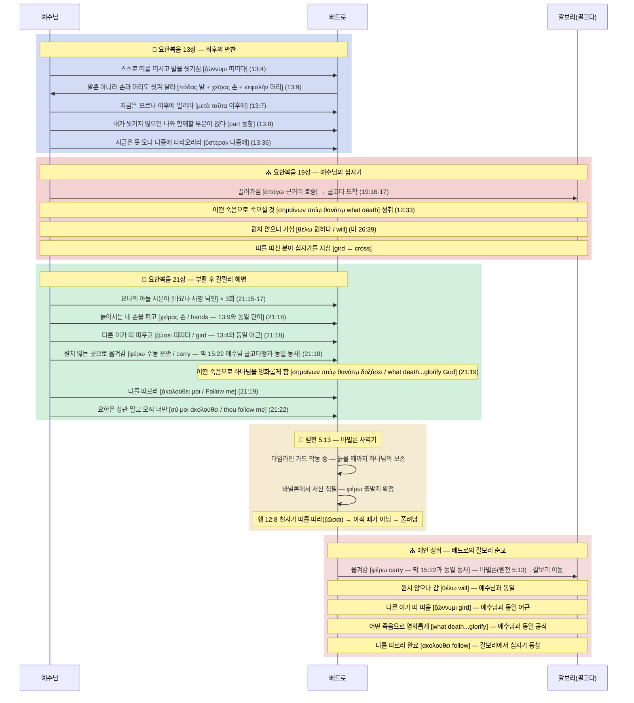

# 🛡️ [BVCAP MODE A: 외부 수성전] 베드로 순교 장소: 갈보리 방어전

> **STATUS**: 🟢 IRONCLAD (내부 등급 — 추론 철벽 방어 완료) / 목회 적용 등급 = 🟡 **개연성(Probability)** [교차증인 미확인 — 2026-07-19 조정, 하단 CAUTION 박스 참조]
> **등급 정의**: ✅ **EXPLICIT**(직접 명시) = 성경이 직접 기록한 사실 (예: 베드로의 십자가형, 요 21:18). 🟢 **IRONCLAD**(추론 철벽) = 성경이 직접 명시하지는 않았으나, 모든 대안 해석이 성경 내부 모순을 발생시키므로 **유일하게 모순 없이 성립하는 해석** (예: 순교 장소 = 갈보리).
> **발동 엔진**: BVCAP v2.0 (MODE A: 외부 공격 방어 및 성경 무오성 수호)
> **주요 투입 무기 (순차적)**: TYPE-F (예표), TYPE-W (예언적 원근법), TYPE-G (원어 문법), TYPE-R (청중 구분), TYPE-N (배타성), TYPE-P (역논법), TYPE-S (어휘 교차 연결), TYPE-AQ (청중비평 · 2026-07-21), TYPE-AH (편집비평 · 2026-07-21), TYPE-B (실연 구조 · 2026-07-21), TYPE-AU (구조적 등가 평행 · 2026-07-21)
> **COMBO 현황**: S3·L7·G7·E5·GR8·SF11·SN12·**GN14** = **8개 콤보 동시 발화** → IRONCLAD

> [!CAUTION]
> **📝 정정 이력 (2026-07-19) — 교차증인 독립성 검증 결과**
> 본 문서의 8개 콤보는 전부 **요한복음(+베드로전서) 내부**의 어휘·문법 증거로 구성되어 있다. `ANCHOR_ThirdData.md`의 교차증인 독립성 검증([STEP 2] 책/저자 카운트)을 적용하면, 근거 구절이 요한복음 저자 1인(베드로전서는 베드로 자신이 쓴 서신이므로 "당사자 자기 증언"이지 제3의 독립 저자가 아님)으로 수렴 → ⚠️ **[교차증인 미확인]**.
> `BVCAP_GHQ.md` PHASE 5 "신학적 결정" 표에 따라: 내부 등급(IRONCLAD)은 그대로 유지하되(논증 자체에 8개 콤보의 무모순 구조는 훼손되지 않음), 목회 적용 등급은 **개연성(Probability)**으로 하향 표기한다. "베드로가 로마에서 죽지 않았다"는 결론은 여전히 강하게 지지되나, "갈보리에서 죽었다"는 적극적 명제를 **확정 교리(Doctrine)**로 선포하는 것은 금지된다.
> 이 조정은 사용자가 `05_REPORT(전과보고서)/catholic/REPORT_베드로_갈보리순교설.md`(같은 논증의 5배 분량 확장판)와 대조 검토를 요청한 결과 확인되었다. 두 문서 모두 근거 기반이 요한복음 내부에 갇혀 있다는 동일한 한계를 공유한다.

> [!IMPORTANT]
> **🔬 재검증 이력 (2026-07-21) — BVCAP FULL SCAN 원어 전수 재대조 (전 무기 가동)**
> ① **검증 통과**: σημαίνων ποίῳ θανάτῳ 신약 정확 3회 독점(요 12:33, 18:32, 21:19) · ὁ τόπος ὅπου 동일절 결합(요 19:20) · ὑπάγω/εἰμί 분리 · σύ 강조 대명사 · "영광의 면류관" 벧전 5:4 단독성(5관 전수조사) · 벧전서 δόξα/δοξάζω 15회+ · 1클레멘스 5장 원문 분석 — **핵심 어휘 전수 대조 전부 통과.**
> ② **기각 1건**: 5단계 "φέρω=장거리 vs ἀπάγω=근거리" 논증 — **막 15:22 "φέρουσιν αὐτὸν ἐπὶ Γολγοθᾶ τόπον"(예수님도 성내 단거리 호송에서 골고다로 φέρω되심)** 반례로 기각. STRESS-TEST-7 TYPE-G 체크리스트("비교 구절의 원어 동사까지 분석했는가") 미통과 논증이었음. → 수동성 논증 + 막 15:22 브리지로 교체(5단계 참조).
> ③ **정정 1건**: 요 13:36의 "지금은"은 ἄρτι가 아니라 **νῦν**("οὐ δύνασαί μοι νῦν ἀκολουθῆσαι"). ἄρτι는 13:33(λέγω 수식)·13:37(베드로 발화)에 위치 — 본문 전체 교정 완료.
> ④ **신규 무기**: 11단계(공관복음 3중 교차증인 — 마 26:35·막 14:31·눅 22:33)·12단계(ἀκολουθέω 실연 + 요 21:23 편집 교정)·5단계 보강(막 15:22 φέρω 브리지, διαζώννυμι 3회 배타성, ἀναζώννυμι 하팍스) 신설.
> ⑤ **판정 변화**: 반증 명제("따라옴 ≠ 천국/일반순교 — 물리적 죽음의 경로")는 ✅ **[교차증인 ✓ — 4개 독립 저자(마·막·눅·요)]**로 상향. 적극 명제("갈보리 좌표")는 여전히 요한복음 내부 → 목회 적용 등급 🟡 **개연성(Probability) 유지.**

---

## 📜 1. 전시 상황 개요 (The Attack)

**외부 비판자(로마 가톨릭 및 역사 비평가)의 공격:**
> *"베드로는 로마에서 십자가에 거꾸로 매달려 죽었다. 요한복음 13:36의 '따라오라'는 말씀은 단순히 천국에 오거나 십자가 처형이라는 '방식'을 뜻할 뿐, 물리적으로 예루살렘 갈보리로 돌아갔다는 주장은 성경을 억지로 꿰맞춘 억측이다!"*

**진리 수호자(갈보리 순교설)의 수성 목표:**
> 로마 전승이라는 성경 밖의 '인간의 유전'을 배격하고, 오직 성경 내부의 텍스트만으로 예수님의 예언(요 13:36)이 정확히 예수님이 죽으신 그 물리적 장소, **갈보리(골고다)**에서 성취되었음을 철벽(IRONCLAD)으로 증명하라.

---

## ⚔️ 2. 치열한 수성전 공방 (Roleplay Debate)

### 🔴 외부 비판자 (공격 측: 로마설)
1. **전승의 권위:** 초기 교회 역사가들의 기록이 베드로의 로마 사역을 증명한다.
2. **본문 분해:** 요한복음 14:2-3에서 예수님이 "내가 처소를 예비하러 간다"고 하셨으니, 13:36의 "내가 가는 곳" 역시 당연히 천국이다.
3. **영적 모방:** "나를 따르라"는 것은 예수님의 삶과 죽음(순교)의 방식을 본받으라는 영적이고 은유적인 메시지일 뿐이다. 지리적 좌표를 뜻하지 않는다.

### 🔵 진리 수호자 (방어 측: 갈보리설)
1. **성경의 침묵:** 성경에는 베드로의 로마 방문 기록이 단 한 줄도 없으며, 오히려 베드로전서 5:13은 동방의 '바빌론'을 명시한다.
2. **배타성 원칙 수호:** 예수님은 요 13:36에서 다른 제자는 못 오고 베드로 **'혼자만'** 온다고 하셨다. 천국이나 단순한 순교라면 다른 제자들도 갔으므로 주님의 말씀이 거짓말이 된다.
3. **요나의 표적:** 예수님이 부여하신 '요나의 아들 시몬'이라는 예언적 정체성은 요나의 지리적 여정(동방→서방 갈보리 회귀)을 완성할 것을 요구한다.

---

## 🔬 3. FULL SCAN 무기고 순차 개방 (방어 로직 전개)

진리 수호자가 외부 비판자의 공격을 막아내기 위해 BVCAP의 무기를 순차적(Sequential)으로 격발합니다.

### 🛡️ 1단계 방어: 예표와 시간의 축 (TYPE-F + TYPE-W)
*   **외부 비판:** "왜 베드로가 굳이 예루살렘으로 돌아가야 하는가?"
*   **TYPE-F (요나 예표 발동, 2026-07-22 정밀화):** 구약의 요나는 이스라엘(서쪽)에서 바다를 거쳐 니느웨(동쪽)로 파송되었다. 베드로는 갈릴리(서쪽)에서 바빌론(동쪽)으로 파송되었다(벧전 5:13) — 이 **파송 방향의 평행**은 본문에 명시적이다. (출신·삼일구조·잠과깨우침·제비·물·장막·비둘기·지리이동 + 가라앉는배·사람던짐↔낚음·배위소명·비둘기와반석)
    *   ⚠️ **정직 고지**: 요나서 본문 자체는 니느웨 사역 이후 **"서쪽으로의 귀환"을 서술하지 않는다** — 욘 4장은 니느웨 밖에서 하나님과 논쟁하는 장면으로 끝나며, 귀환 여정은 기록되어 있지 않다. 따라서 "베드로가 서쪽(갈보리)으로 회귀해야만 예표가 완성된다"는 결론은 **요나 텍스트 자체가 제공하는 근거가 아니다.** 요나 예표가 텍스트적으로 뒷받침하는 것은 12항목 중 **"파송 방향(동쪽행)"**뿐이며, 베드로의 **서쪽 귀환(갈보리)**은 이 예표가 아니라 8콤보 논증(θέλω, φέρω, ὅπου→τόπος 등, 2~8단계)에 근거해야 한다. 요나 예표는 정황적 색채(ANALOGY)로는 유효하나, 귀환 방향의 독립 증거로 카운트하지 않는다.
*   **TYPE-W (예언 원근법 발동):** 예수님의 "지금은 못 오나 장래에는 오리라"(요 13:36)는 이중 예언이다. 지금 당장(근거리)은 세 번 부인하고 도망가겠지만, 장래(원거리)에는 주님이 가신 그 십자가의 길을 그대로 걷게 될 것이라는 거대한 예언의 축이다.

### 🛡️ 2단계 방어: 헬라어 문법과 타임라인 앵커링 (TYPE-G + TYPE-T + TYPE-R)
*   **외부 비판:** "요 14장의 천국과 13장의 가는 곳은 같은 곳이다!"
*   **TYPE-G (원어 해부 발동):** 
    *   요 13:36 (베드로에게) = `ὑπάγω` (이동하다, 그 경로를 걷다)
    *   요 14:3 (모든 제자에게) = `εἰμί` (존재하다, 그 상태에 거하다)
    *   요 13:36의 `ὅπου`는 방식(πῶς)이 아니라 명백한 **물리적 장소 부사**다.
*   **TYPE-T (시간 부사의 앵커링 발동):** 요 13:33에서 예수님은 제자들에게 "내가 유대인들에게 말한 것(천국에 감)과 같이 너희도 올 수 없다"고 선언하셨다. 반면 13:36에서 베드로에게는 **"지금은(now)"** 따라올 수 없다고 특별한 시간 부사를 덧붙이셨다. '지금'은 주님이 당장 걸어가시는 즉각적인 물리적 여정(겟세마네~갈보리)을 뜻한다. 단순히 영원히 못 가는 천국을 의미했다면 "지금은"이라는 전제가 성립할 수 없다. 베드로가 "지금 내 생명을 버리겠다"며 따라나선 것은 그 물리적 경로를 뜻함이 자명하다.
*   **TYPE-R (청중 구분 발동):** 모든 제자에게는 유대인과 동일하게 천국(상태)을 약속하셨으나, 베드로 개인에게만 갈보리 십자가(경로)를 동행할 것을 예언하셨다. 두 담화를 섞어버리는 비판자의 주장은 문법 단계에서 치명적으로 기각된다.

### 🛡️ 3단계 방어: 사도 요한의 행적을 통한 역논법과 배타성 압박 (TYPE-N + TYPE-P)
*   **외부 비판:** "13:33이나 13:36이나 똑같이 '내가 가는 곳'이니 같은 장소(천국)를 말하는 것 아닌가?"
*   **TYPE-P (요한의 행적을 통한 역논법 발동):** 만약 요 13:33의 "너희는 올 수 없다"가 갈보리(십자가)를 뜻한다면 성경은 모순에 빠진다. 왜냐하면 사도 **요한**은 그날 십자가 아래(갈보리)까지 물리적으로 따라갔기 때문이다(요 19:26). 요한이 따라갈 수 있었으므로 13:33에서 제자 전체에게 하신 말씀은 지상에서 갈 수 없는 **'천국'**을 뜻하는 것이 맞다.
    *   **그러나 13:36에서 베드로에게 하신 말씀은 완전히 다르다.** 만약 13:36마저 단순히 '천국에 가는 것'을 뜻한다면, 바로 다음 절에서 베드로가 "내가 주를 위해 내 생명을 버리겠나이다"(13:37)라며 목숨을 건 동행을 결의한 문맥과 전혀 맞지 않는다.
    *   예수님이 베드로에게만 허락하신 '장래에 따라온다'는 약속은 모든 제자가 공유하는 '천국 입성'이 아니다. 요한은 '지금' 갈보리에 갔으나 주님과 같은 방식으로 죽지 않았다. 반면 베드로는 '지금'은 부인하고 도망쳤으나, 장래에는 주님이 피 흘리신 그 물리적 장소(갈보리)를 똑같이 밟고 십자가에서 죽게 될 것이라는 베드로만의 배타적인 순교 예언이다.
*   **TYPE-N (배타성 압박 발동):** 이처럼 '요한의 십자가 동행'이라는 역사적 팩트와 '베드로의 순교'를 대입해 보면, 요 13:33은 **'천국'**을 의미하고 요 13:36은 오직 베드로에게만 배타적으로 주어진 **'갈보리에서의 십자가 죽음'**으로 분리되어야만 성경의 문맥과 논리가 100% 완벽하게 맞아떨어진다.

### 🛡️ 4단계 방어: 최종 차단 장치 격발 (TYPE-S 어휘 교차)
*   **외부 비판:** "그래도 갈보리라는 직접 명시가 없지 않은가?"
*   **TYPE-S (어휘 교차 및 수미상관 브리지 발동):** 요한복음의 저자는 예수님과 베드로의 운명을 두 가지 헬라어 동사(`θέλω`, `ἀκολουθέω`)로 완벽하게 묶어버렸다.
    *   **첫 번째 링커 (θέλω - 뜻/원하다):** 예수님(마 26:39)은 "내 뜻(`θέλω`)대로 마옵시고" 기도하시며 십자가를 지고 골고다로 끌려가셨다. 베드로(요 21:18) 역시 "네가 원치(`θέλεις`) 아니하는 곳"으로 끌려간다.
    *   **두 번째 링커 (ἀκολουθέω - 따르다):** 예수님은 십자가 지시기 전 요 13:36에서 "장래에 네가 나를 따라오리라(`ἀκολουθήσεις`, 미래 예언)"고 하셨다. 그리고 부활 후 요 21:19에서 베드로의 십자가 죽음을 명시하시며 "나를 따르라(`ἀκολούθει`, 현재 명령)"고 하셨다.
    *   **결정적 배타성 (요 21:21-22):** 베드로가 사도 요한을 가리키며 "이 사람은 어떻게 됩니까?" 묻자, 주님은 "그는 상관 말고 **너는 나를 따르라(σύ μοι ἀκολούθει)**"고 하셨다. 헬라어 원어에 강조 대명사 **`σύ(너는)`**를 덧붙여 요한을 철저히 배제하신 것이다. 이 "따르라"는 천국에 가는 일반적인 신앙생활이 아니라, 오직 베드로 한 사람에게만 주신 '물리적 십자가 죽음(갈보리 동행)' 명령임을 완벽히 확증한다.
    *   **판정:** 주님은 요 21장에서 13장의 예언을 활성화하신 것이다. 예수님이 `θέλω`로 가신 종착지가 갈보리(골고다)였으므로, 베드로가 `θέλω`로 끌려가며 "나를 따르라(Follow me)"는 명령을 완수할 물리적 장소 역시 완벽히 동일한 '갈보리'로 수렴된다.

---

### 🛡️ 5단계 방어: 동사 구분 + 호칭 배타성 + 타임라인 가드 (TYPE-G + TYPE-N + TYPE-W 강화)
*   **외부 비판:** "예수님도 끌려가셨고 베드로도 끌려간 것이니, 베드로가 바빌론에서 갈보리까지 이동했다는 근거가 어디 있는가?"
*   **TYPE-G (φέρω 동사 재검증 — 2026-07-21 논증 교체):**
    *   **❌ 구판 기각:** "예수님=ἀπάγω(마 27:31, 근거리 호송) vs 베드로=φέρω(요 21:18, 장거리 운반) → 장거리 함의"라는 구판 논증은 **막 15:22 *"Καὶ φέρουσιν αὐτὸν ἐπὶ Γολγοθᾶ τόπον"*** — 예수님 자신이 성내 단거리 호송에서 **φέρω로 골고다에 옮겨지셨다**는 직접 반례로 기각한다. STRESS-TEST-7 TYPE-G 체크리스트("비판자가 반례로 제시할 비교 구절의 원어 동사까지 분석했는가")를 통과하지 못한 논증이었음을 자인하고 폐기한다. (E-16 자기 순화 금지 원칙에 따라 기각 사실을 은폐하지 않고 명기함.)
    *   **✅ 교체 논증 ① — φέρω의 실제 뉘앙스 = 수동성(Passivity):** 신약에서 사람이 φέρω되는 경우는 중풍병자(막 2:3), 귀신들린 아이(막 9:17-20) 등 **자기 발로 가지 않는 자들**이다. "네가 원치 아니하는 곳으로(ὅπου οὐ θέλεις)"(요 21:18)의 비자발성과 완벽히 정합한다. 바빌론→갈보리의 **거리**는 벧전 5:13(바빌론 명시)이 독립적으로 확정하며, 동사에게 그 짐을 지우지 않는다.
    *   **✅ 교체 논증 ② — 막 15:22 φέρω→골고다 브리지 (TYPE-S 게제라 샤바, 신규):** 신약에서 **죽음의 장소로 φέρω되는 사람은 단 둘** — 예수님(막 15:22, 골고다로)과 베드로(요 21:18, 예언). 막 15:22은 동사(φέρουσιν) + 명사(τόπον) + 지명(Γολγοθᾶ)이 **한 절에 결합된 제2저자(마가)의 앵커**다. 그리고 그 저자 마가는 벧전 5:13의 **"내 아들 마가"** — 바빌론에서 베드로와 동거하며 베드로의 증언으로 복음서를 쓴 자다. 베드로의 영적 아들이, 베드로의 순교 예언 동사(φέρω)로 예수님의 골고다 도착을 기록했다. 기각된 장거리 논증의 잔해에서 나온 더 강한 무기다.
*   **TYPE-N ("바요나" 배타성 발동):**
    *   안드레도 생물학적으로 "요나의 아들"이다. 그러나 예수님은 단 한 번도 안드레를 "요나의 아들 안드레야"라고 부르지 않으셨다.
    *   야고보와 요한은 "세베대의 아들들", "보아너게(천둥의 아들들)"로 **함께** 호칭됨 — 집단적 호칭.
    *   베드로만 "요나의 아들 시몬아"로 **개별** 호칭됨 (마 16:17, 요 1:42, 요 21:15-17) — 안드레는 완전 배제.
    *   이것은 혈연 확인이 아니라 **"요나의 예표를 완성할 자"라는 사명 낙인**이다. σύ(오직 너는)와 동일한 배타성 패턴.
*   **TYPE-W (타임라인 가드 발동):**
    *   "늙어서는(ὅταν γηράσῃς)" = 예언의 시간 조건. 역논법 적용: 베드로가 노년 이전에 죽으면 예수님 예언이 거짓 ❌ → 노년까지 **하나님의 주권적 보존** 아래 생존 보장.
    *   이 보존 기간 동안 바빌론까지 사역 확장 → 노년에 φέρω(옮겨져) → 갈보리에서 십자가 순교.
*   **TYPE-S (σημαίνων ποίῳ θανάτῳ 공식 발동):**
    *   "어떠한 죽음으로"라는 동일 공식이 신약 전체에서 **3회만** 사용: 예수님(요 12:33, 요 18:32) + 베드로(요 21:19). 다른 누구에게도 쓰이지 않음.
    *   요 21:18-19의 순서: **φέρω(옮겨감) → δοξάσει τὸν θεόν(하나님을 영화롭게 함) → ἀκολούθει μοι(나를 따르라)**
    *   먼저 옮겨지고, 그 도착지에서 죽음으로 영화롭게 한다. 예수님이 끌려가셔서(ἀπάγω) 영화롭게 하신 장소 = 갈보리. 베드로가 옮겨져서(φέρω) 영화롭게 할 장소 = **동일한 갈보리**.
*   **TYPE-S (ζώννυμι 어휘 브리지 발동):**
    *   "띠 띠다(ζώννυμι)" 계열 동사가 신약에서 **예수님과 베드로에게만 집중 사용**됨.
    *   예수님(요 13:4): 스스로 수건을 **동여매시고(διέζωσεν)** 발을 씻기심 → 바로 이 장에서 "장래에 나를 따라올 것" 순교 예언(13:36).
    *   베드로(요 21:18): 젊었을 때 스스로 **띠 띠고(ἐζώννυες)** → 늙어서는 다른 이가 **띠 띠우고(ζώσει)** → 옮겨감.
    *   행 12:8: 감옥에서 천사가 베드로에게 **"띠를 띠라(ζῶσαι)"** → 풀려남 = 타임라인 가드 실행(아직 "늙어서"가 아니므로 죽을 수 없음).
    *   **벧전 1:13: 베드로 자신이 서신서에서 동일 어근 사용:** *"**gird up** (ἀναζωσάμενοι, ἀνά+ζώννυμι) the loins of your mind"* — "생각의 허리를 **동여매라**". δόξα/δοξάζω 패턴과 동일하게, 베드로는 자기 죽음의 예언 어휘(ζώννυμι)를 자신의 서신서에 **의식적으로 직조**해 넣었다. Peter wove his death prophecy vocabulary (ζώννυμι) into his own epistle — the same pattern as δοξάζω/δόξα. **[2026-07-21 보강] ἀναζώννυμι는 신약 전체에서 벧전 1:13 단 1회 — 하팍스(hapax legomenon).** 베드로는 자기 죽음 예언의 어근을 유일무이한 복합형으로 선택했다.
    *   **요 21:7 (2026-07-21 신규 — διαζώννυμι 3회 배타성):** 베드로가 겉옷을 **동여매고(διεζώσατο)** 바다로 뛰어듦. διαζώννυμι는 신약 전체 **3회뿐** — 요 13:4, 13:5(예수님이 띠 띠고 발 씻기심) / 요 21:7(베드로). **오직 예수님과 베드로에게만 사용된 동사다.** 나아가 21:7은 21:18 전반부("젊어서는 네가 스스로 띠 띠고 원하는 곳으로 다녔거니와")의 **내러티브 실연**이 예언 11절 앞에 배치된 것이다 — 저자는 "스스로 띠 띠는 베드로"를 독자에게 보여준 직후, "남이 띠 띠우는 베드로"를 예언하게 한다.
    *   요한복음 저자는 **θέλω · σημαίνων ποίῳ θανάτῳ · ζώννυμι** 세 가지 어휘 브리지로 예수님과 베드로의 죽음을 의도적으로 연결했다.
    *   **KJV 영어에서도 동일:** 예수님 "not as I **will**" / 베드로 "thou **wouldest** not" · 예수님 "**what death** he should die" / 베드로 "**what death** he should glorify God" · 예수님 "**girded** himself" / 베드로 "thou **girdedst** thyself... shall **gird** thee" — 헬라어와 KJV 영어 모두에서 세 단어(will, what death, gird)가 예수님과 베드로에게만 집중 사용됨.

### 🛡️ 6단계 방어: 발 씻기심의 예표 — "이후에 알리라"와 신체 부위 (TYPE-F + TYPE-S)
*   **외부 비판:** "요한복음 13장의 발 씻기심은 겸손의 교훈이지 순교 예표가 아니다."
*   **TYPE-F (요 13:7 "이후에 알리라" 구조 발동):**
    *   요 13:7: "지금은 **모르나**(ἄρτι) → **이후에** 알리라(μετὰ ταῦτα)" — 베드로에게.
    *   요 13:36: "**지금은** 따라올 수 없으나(νῦν) → **나중에** 따라오리라(ὕστερον)" — 역시 베드로에게.
    *   같은 장에서 **베드로에게만** "지금 아님 → 나중에" 구조가 두 번 반복된다. v7의 "이후에 알리라"는 v36의 갈보리 순교 예언과 구조적으로 연결된다.
*   **TYPE-S (요 13:9 신체 부위 발동):**
    *   베드로의 요청: *"Lord, not my **feet** only, but also my **hands** and my **head**."* (요 13:9 KJV)
    *   **두 발(πόδας)** = 십자가 못 박힘. **두 손(χεῖρας)** = 십자가 못 박힘. **머리(κεφαλήν)** = 가시 면류관.
    *   요 21:18에서 예수님이 베드로의 순교를 예언하시며 "네 **손(χεῖρας)**을 펴리라"고 하심 — 요 13:9의 χεῖρας와 **동일 단어**.
    *   요 13:8: *"내가 너를 씻기지 아니하면 너는 나와 **함께할 부분(part)이 없다**"* — 예수님의 갈보리 죽음에 **동참**해야 "함께할 부분"이 있다.

### 🛡️ 7단계 방어: δοξάζω/δόξα 어휘 브리지 — "영화롭게 하는 죽음"과 "영광의 면류관" (COMBO-SN12)
### (7th Defense: The δοξάζω/δόξα Lexical Bridge — "A Death That Glorifies" and "The Crown of Glory")

*   **외부 비판:** "갈보리라는 직접 명시가 없으므로 장소까지 특정하는 것은 과도한 해석이다."
*   **TYPE-S (δοξάζω/δόξα 어휘 브리지 발동):**
    *   **요 21:19 (John 21:19 KJV):** *"signifying by what death he should **glorify** (δοξάσει) God"* — 베드로는 "하나님을 **영화롭게 하는(δοξάσει)** 어떤 죽음"으로 죽는다.
    *   **벧전 5:4 (1 Peter 5:4 KJV):** *"ye shall receive a **crown of glory** (στέφανον τῆς δόξης) that fadeth not away"* — 베드로가 직접 기록한 "**영광(δόξης)**의 면류관".
    *   δοξάσει(동사, 요 21:19)와 δόξης(명사, 벧전 5:4)는 **동일 어근 δοξ-** 에서 파생된 같은 단어 가족이다.
    *   The verb δοξάσει (John 21:19) and the noun δόξης (1 Peter 5:4) share the **same root δοξ-**.
*   **TYPE-N (면류관 배타성 발동):**
    *   신약에는 5가지 면류관이 기록되어 있다. 각 기록자를 전수 조사하면:

| 면류관 / Crown | KJV 영어 | 기록자 / Author | 구절 / Verse |
|:---:|:---|:---:|:---:|
| 썩지 않을 관 | Incorruptible crown | **바울 / Paul** | 고전 9:25 |
| 환희의 관 | Crown of rejoicing | **바울 / Paul** | 살전 2:19 |
| 의의 관 | Crown of righteousness | **바울 / Paul** | 딤후 4:8 |
| 생명의 관 | Crown of life | **야고보·요한 / James·John** | 약 1:12, 계 2:10 |
| **영광의 관** | **Crown of glory** | **베드로만 / Peter only** | **벧전 5:4** |

> 바울은 3가지 면류관을 기록했으나 δόξα를 쓰지 않았다. 야고보·요한은 ζωή(생명)를 썼다.
> **"영화롭게 하는 죽음(δοξάζω)"을 예언받은 유일한 사도가, 5가지 면류관 중 하필 "영광(δόξα)의 면류관"을 기록한 유일한 사도이다. 이것이 우연인가?**
> The only apostle prophesied to die "glorifying (δοξάζω) God" is also the only apostle who recorded the "crown of glory (δόξα)." Is this coincidence?

*   **TYPE-I (벧전서 δόξα 빈도 집중 발동):**
    *   벧전서 전체에 δόξα/δοξάζω가 **10회 이상** 집중. 특히 **벧전 4:16** "하나님을 **영화롭게 하라(δοξαζέτω)**"는 요 21:19의 δοξάσει와 **동일 동사의 명령형**이다.
    *   베드로는 자기가 받은 예언(δοξάζω로 죽는다)을 자신의 서신서 전체에 δόξα/δοξάζω로 직조(織造)해 넣은 것이다.
    *   Peter wove the vocabulary of his own death prophecy (δοξάζω) throughout his entire epistle — over 10 occurrences of δόξα/δοξάζω in 1 Peter.
*   **TYPE-F (요 13:9 머리 예표 연결):**
    *   요 13:9에서 베드로가 씻겨 달라고 한 세 부위: 발(πόδας) + 손(χεῖρας) + **머리(κεφαλήν)**.
    *   요 21:18에서 **손(χεῖρας)**은 명시되었으나 **머리(κεφαλήν)**는 직접 언급되지 않았다.
    *   그러나 요 21:19의 δοξάσει → 벧전 5:4의 δόξης(영광의 면류관)으로 연결될 때, **면류관은 머리에 씌워지는 것**이므로 요 13:9의 κεφαλήν이 이 체인의 **예표적 기점**으로 기능한다.
    *   When δοξάσει (John 21:19) connects to δόξης/crown of glory (1 Pet 5:4), and a crown is placed on the **head**, John 13:9's κεφαλήν serves as the **typological origin** of this chain.
*   **COMBO-SN12 판정 / Verdict:** TYPE-S(어휘 브리지) + TYPE-N(면류관 배타성) + TYPE-I(빈도 집중) + TYPE-F(머리 예표) = 4개 독립 무기 동시 발화 → ✅✅ **CONFIRMED**

> [!NOTE]
> **가시 면류관(Crown of Thorns) 가능성에 대하여 / On the Crown of Thorns Possibility:**
> 이 COMBO-SN12는 δοξάζω(영화롭게 하다)와 δόξα(영광의 면류관)의 어근적 연결을 확정한다.
> 이것이 물리적 가시 면류관을 의미하는지, 아니면 영화로운 죽음 자체가 "영광의 면류관" 수여인지는
> KJV 텍스트가 명시적으로 확정하지 않는다. 가시 면류관의 저주 대속적 기능은 오직 그리스도에게만 속하므로(갈 3:13),
> **가능성은 열려 있으나 확정이 아닌 열린 질문(Open Question)으로 남겨둔다.**
> The possibility remains **open but unconfirmed** within the current textual scope.

### 📊 벧전 5장 심층 분석: 순교 예언 어휘와 출발지의 밀집 구조
### (1 Peter 5 Deep Analysis: Martyrdom Prophecy Vocabulary + Departure Point in One Chapter)

| 절 / Verse | KJV 텍스트 / KJV Text | 헬라어 | 기능 / Function |
|:---:|:---|:---:|:---|
| **5:1** | "partaker of the **glory**" | **δόξης** ① | 영광에 **참여** / Partaker of glory |
| **5:4** | "**crown** of **glory**" | **δόξης** ② + **στέφανος** | **영광의 면류관** / Crown of glory |
| **5:10** | "eternal **glory**" | **δόξαν** ③ | 영원한 **영광** / Eternal glory |
| **5:11** | "To him be **glory**" | **δόξα** ④ | 그분께 **영광** / Glory to Him |
| **5:12** | "**By Silvanus**... I have written" | Σιλουανός | 편지 **배송자** — **바빌론에 함께 있어야** 전달 가능 / Carrier — must be in Babylon |
| **5:13** | "church at **Babylon**... **Marcus my son**" | **Βαβυλών** + Μᾶρκος | **출발지** + 마가도 바빌론에서 문안 / Departure + Marcus in Babylon |

> **한 장 안에 δόξα 4회 + 면류관 1회 + 바빌론 1회 + 동역자 2명(바빌론 동반 체류).**
>
> **실루아노 = 편지 배송자:** "By Silvanus... I have written" = 편지를 받아 배달하려면
> **발신지(바빌론)에 베드로와 함께 있어야** 한다. 바빌론 체류의 **물류적 증거**.
>
> **"내 아들 마가" = 영적 아들:** "my son(μου υἱός)"은 생물학적 아들이 아니다.
> 마가의 실제 어머니는 **마리아**(행 12:12). 바울→디모데(딤전 1:2)와 동일한 **영적 제자** 관계.
> 핵심: 마가가 "바빌론에 있는 교회"와 함께 문안 → **마가도 바빌론에 물리적으로 체류**.
>
> **헬라식 이름의 증거력:** 히브리인 베드로가 히브리식(시일라스, 요한 마가)이 아닌
> **헬라/라틴식(실루아노, 마르코)**으로 기록 → **이방 지역** 반영 →
> 바빌론 = 로마의 상징이 아닌 **동방의 실제 바빌론**.
>
> 바빌론(5:13)은 편지 발신지로서 **자연스러운 사실 기록**이고,
> δόξα × 4와 면류관(5:1-11)은 베드로의 **의식적 어휘 선택**이다.
> 이 사실과 어휘가 **한 장에서 만나는 구조**는 요 21:18-19(φέρω 출발지 + δοξάσει 도착 행위)와 **정확히 대응**한다.
>
> Babylon (5:13) is a factual record; δόξα ×4 and crown are Peter's vocabulary choices.
> Their convergence in one chapter corresponds exactly to John 21:18-19 (φέρω departure + δοξάσει arrival).

### 📊 바울-베드로 영적 아들 평행 구조: "바빌론 = 로마" 강화 기각
### (Paul-Peter Spiritual Son Parallel: "Babylon = Rome" Rejection Strengthened)

| | **바울 / Paul** | **베드로 / Peter** |
|:---:|:---|:---|
| 사역지 | **로마** (행 28:16, 딤후 1:17) | **바빌론** (벧전 5:13) |
| 영적 아들 | **디모데** — "나의 참 아들" τέκνῳ (딤전 1:2) | **마가** — "나의 아들" υἱός (벧전 5:13) |
| 동반 증거 | 빌 1:1, 골 1:1, 몬 1:1 (공동 발신) | 벧전 5:13 (바빌론에서 문안) |
| 편지 전달 | 두기고/Tychicus (엡 6:21, 골 4:7) | **실루아노/Silvanus** (벧전 5:12) |

> **"바빌론 = 로마" 대입 시 모순:**
> 바울은 로마 옥중서신에서 동역자 **10명 이상**을 이름으로 언급했으나 **베드로는 없다.**
> 같은 도시에 수석 사도가 있는데 완전히 무시? → **설명 불가능.**
> 반면 바빌론 = 동방의 실제 바빌론이면 → 다른 도시 → **완벽히 자연스럽다.**
>
> **실루아노 배송 = 이동의 함의:**
> 실루아노가 바빌론에서 편지를 가지고 **떠났듯이**,
> 베드로 자신도 바빌론에서 φέρω(요 21:18)로 **떠나게 될 것**이다.
> 벧전 5장 = 출발지(바빌론) + 어휘(δόξα/면류관) + 이동(실루아노 배송) =
> 순교 여정의 **출발·내용·이동**을 한 장에 모두 담고 있다.

### 🛡️ [방어논증] 갈 2:7-9 분업 협약 + 증언 비대칭 + 동기 분석 (TYPE-AD, 2026-07-21 신설)

> [!NOTE]
> **성격 구분**: 이 논증은 TYPE-G/S 같은 원어 문법·어휘 증거가 아니라, 텍스트 사실 + 개연성 분석(귀추법)으로 구성된 **방어논증**이다. 9단계(1클레멘스 반론)와 같은 카테고리이며, 8콤보 IRONCLAD 판정에 새 콤보로 합산되지 않는다.

*   **외부 비판:** "할례자 담당(베드로)이라도 로마의 유대인 공동체를 섬기러 갔을 수 있다. 로마에도 유대인이 많았다(행 28:17, 18:2)."
*   **1차 반박 인정:** 이 반론은 유효하다. 갈 2:7-9의 "할례자/이방인" 분업이 지리적 완전 격리를 뜻하진 않는다. 바울 자신도 이방인의 사도이면서 가는 곳마다 회당을 먼저 찾았다(행 13:14, 14:1, 17:1-2; 롬 1:16). 그러므로 "베드로=유대인 담당이니 로마行 절대 불가"는 논리적 필연은 아니다.
*   **그럼에도 남는 비대칭성 (TYPE-AG 인접):**

| | **바울 / Paul** | **베드로 / Peter** |
|:---:|:---|:---|
| 로마 체류의 성경 내 명시 | ✅ **명시적** — *"그가 로마에 있을 때에 나를 부지런히 찾아 만났으니"*(딤후 1:17) + 행 28장 전체가 로마 도착·가택연금을 상세 기록 | ❌ **66권 어디에도 없음** |
| 사역 배정 (갈 2:7-9) | 이방인(할례 없는 자)에게 | 할례자(유대인)에게 |
| 명시된 말년 사역지 | 로마 (성경 텍스트 확증) | 바빌론 (벧전 5:13, 성경 텍스트 확증) |

> **핵심**: "두 사도가 똑같이 로마에 있었다"는 **대칭 구도가 아니다.** 한쪽(바울)은 텍스트가 직접 확증하고, 다른 쪽(베드로)은 오직 후대 전승만 있는 **완전한 비대칭**이다. 갈 2:7-9의 분업 협약과 정확히 들어맞는 그림은 "각자 자기 사역 대상 지역에서 생을 마쳤다"(바울=로마/이방, 베드로=바빌론/유대인)이며, "우연히 둘 다 로마"라는 그림이 오히려 부자연스럽다.

*   **TYPE-AD (귀추법 — 동기 분석 발동):** 두 가설을 비교한다.
    - **가설 1**: 명시적으로 다른 두 사역지를 배정받은 두 수석 사도가, 우연히 같은 도시에서 순교했다.
    - **가설 2**: 각자 배정받은 사역지(바울=로마, 베드로=바빌론)에서 생을 마쳤으나, 후대에 로마 교회의 수위권(Primacy) 주장을 뒷받침하기 위해 "유대인 대표 사도 + 이방인 대표 사도가 나란히 로마에 뼈를 묻었다"는 서사로 재구성되었다.
    - 가설 2는 명확한 동기(로마 교구의 사도적 정통성·수위권 주장)를 가지지만, 가설 1은 아무 동기 없는 순수 우연을 요구한다. 오컴의 면도날(TYPE-AK)로도 가설 2가 더 단순하다 — 갈 2:7-9의 기존 분업과 별도의 설명(우연의 지리적 수렴)을 추가로 요구하지 않기 때문이다.
*   **판정:** 이 논증은 "베드로가 로마에서 죽지 않았다"는 반증 논제에 개연성 층위의 지지를 추가한다. 단, 이건 원어 문법 증거가 아니라 역사적 개연성 분석이므로 8콤보의 텍스트적 확신도(IRONCLAD)에는 가산되지 않으며, 명제 B(갈보리 특정)의 목회 등급에도 영향이 없다.

### 🛡️ [방어논증] "바빌론=로마 상징" 재반박 — 계 11:8 자체 신호 원칙 (TYPE-AO, 2026-07-22 신설)

*   **외부 비판:** "계시록 17-18장의 바벨론이 로마를 상징한다면, 벧전 5:13의 바벨론도 로마를 상징해야 일관성 있다. 하나는 상징으로, 하나는 문자로 읽는 건 이중기준이다."
*   **TYPE-AO (정경비평 — 계시록 자체의 상징 표기 원칙 발동):** 이 비판은 "같은 지명은 신약 전체에서 같은 대상을 가리켜야 한다"는 전제를 깔고 있다. 그런데 **이 전제는 계시록 스스로에 의해 깨진다.**
    *   **계 11:8**: *"그들의 시체가 큰 성 길에 있으리니 그 성은 **영적으로 하면**(πνευματικῶς) 소돔이라고도 하고 애굽이라고도 하니 곧 그들의 주께서 십자가에 못 박히신 곳이라"* — 여기서 "소돔"과 "애굽"은 실제로는 **예루살렘**을 가리키는 상징이다. 계시록 저자 본인이 **"영적으로 하면"이라는 명시적 신호**를 붙여서 지명을 상징으로 전환한다.
    *   **계 17:5**: *"그의 이마에 이름이 기록되었으니 **비밀**(μυστήριον)이라, 큰 바벨론"* — 다시 명시적 신호("비밀").
    *   **계 17:18**: *"네가 본 여자는... 큰 성이라"* — "네가 본 것은 사실 이것이다"라는 자체 해독 공식.
    *   즉 계시록의 실제 작법은 **"지명을 상징으로 쓸 때는 반드시 신호를 붙인다"**는 것이다. 이건 우리가 임의로 만든 규칙이 아니라 계시록 본문 자체가 3번이나(11:8, 17:5, 17:18) 스스로 증명하는 작법이다.
    *   **벧전 5:12-13에는 이런 신호가 전무하다.** "영적으로 하면", "비밀이라" 같은 표지 없이, 실루아노·마가라는 실존 인물과 함께 나오는 평범한 서신 인사말 형식이다(비교: 롬 16장, 골 4장의 동일 형식).
*   **CREED C-3 적용 (문자적 해석 우선):** 신호가 없는 지명은 기본값(default)이 문자적 해석이며, 상징으로 읽으려는 쪽이 입증 책임(TYPE-AF)을 진다. 벧전 5:13에는 그 신호가 없으므로 문자적 바빌론이 기본값이다.
*   **보강**: 세대주의 진영 안에서도 계시록의 바벨론을 "로마"가 아니라 "미래에 재건될 문자적 바빌론"으로 보는 견해(예: 라이리 계열)가 존재한다 — 이 경우 벧전(1세기 실제 바빌론)과 계시록(미래 재건 바빌론)은 오히려 둘 다 문자적이라는 점에서 **더 일관된다.**
*   **판정:** "이중기준"이 아니라 계시록 자신의 상징 표기 원칙(신호 유무)을 그대로 적용한 것이다. CH-04를 강화하는 방어논증이며, 등급 체계에는 영향 없음(8콤보 IRONCLAD·명제 B 개연성 그대로).

---

### 🛡️ 8단계 방어: ὅπου→τόπος 부사-명사 락인 — 골고다 앵커포인트 (COMBO-GN14)
### (8th Defense: The ὅπου→τόπος Adverb-Noun Lock-in — Golgotha Anchor Point)

*   **외부 비판:** "ὅπου(내가 가는 곳)는 영적 목적지를 뜻할 수 있다. 물리적 장소가 아닐 수 있다."
*   **TYPE-G (ὅπου→τόπος 부사-명사 락인 발동):**
    *   요 13:36에서 예수님이 쓰신 ὅπου(어디로)는 장소 관계부사로, 실체적 명사(구체 장소)를 배후에 요구한다.
    *   요한은 19장에서 그 부사의 명사적 해소(Nominal Resolution)를 제공한다:
    *   **요 19:17:** *"went forth into a **place** (τόπον) called the place of a skull... **Golgotha**"* — 예수님의 종착지 = **골고다(τόπος)**.
    *   **🔫 결정타 — 요 19:20:** *"the **place** (ὁ τόπος) **where** (ὅπου) Jesus was crucified was nigh to the city"*
    *   요한이 **ὅπου와 τόπος를 같은 절에 동시 배치** → "예수님이 십자가에 달리신 그 장소(τόπος) = 그곳(ὅπου)"을 정의.
    *   13:36의 ὅπου와 19:20의 ὅπου — **동일 부사가 동일 저자에 의해 동일 대상(예수님의 행착지)에 사용.** 부사가 명사를 찾았다.

> **📌 자기 검증:** 요 19:20은 예수님의 십자가 장소를 설명하는 것이지, 베드로의 순교 장소를 직접 명시하는 것이 아니다. GN14의 역할은 **ὅπου의 목적지를 확정(핀📍)**하는 것이다. 베드로를 그 목적지에 연결(화살표→)하는 것은 기존 콤보들(SF11·S3·GR8 등)의 역할이며 이미 IRONCLAD로 확정. **핀 + 화살표 = 완전한 논증.**

*   **TYPE-N (τόπος 판별기 / 지우개 법칙 발동):**
    *   **요 14:2:** *"I go to prepare a **place** (τόπον) for you"* — 천국 처소. 수혜 대상 = **모든 제자(ὑμᾶς)**.
    *   13:36 = 14:2(천국)이면 → 14:3에서 모든 제자를 영접 → 베드로 특별 취급 이유 **소거(erase)**.
    *   ∴ 14:2 천국 τόπος ≠ 13:36 ὅπου → 13:36 = **베드로만의 배타적 지상 τόπος** = **골고다(19:17)**.
    *   GR8(**동사** 차이)과 독립적으로, 지우개 법칙은 **명사 접근 범위** 차이로 분리.

*   **TYPE-F (십자가 이동 벡터 발동):**
    *   예수님: βαστάζων→ἐξῆλθεν → 골고다(19:17). 베드로: φέρω → ???(21:18).
    *   "Follow me" = 방향+종착지 동시 일치 요구. 장소가 다르면 "Do as I did"가 되어야 함.
    *   그러나 예수님은 **ἀκολούθει(뒤따르다)**를 쓰셨지, ποίει(행하다)를 쓰지 않으셨다.
    *   **"Follow me" ≠ "Do as I did."** 따르다 = 같은 길 = 같은 종착지.

*   **COMBO-GN14 판정:** TYPE-G(τόπος Lock-in) + TYPE-N(지우개 법칙) + TYPE-F(벡터 일치) = 3개 독립 체인 동시 발화 → ✅✅ **CONFIRMED**

---

### 🛡️ 9단계 방어: 공간적 위상 교정과 십자가 경로 공식 (TYPE-S/F, 2026-07-22 신설)

*   **외부 비판:** "요 21장의 '따르라'는 꼭 장소가 아니라 그저 '순교 일반'을 뜻하는 은유일 수 있다."
*   **TYPE-S/F (공간적 위상 공식 발동 — 마 16:21-24):** 마태복음 16장은 '따름'의 최초 물리적 정의를 제공한다.
    *   **목적지 선언:** 예수님이 **"예루살렘으로 가서"** 죽임을 당할 것을 최초로 명시하심(마 16:21). 즉, 십자가 경로의 종착지가 예루살렘(갈보리)으로 확정됨.
    *   **경로 차단:** 베드로가 주님을 붙들고(took him) 만류함(마 16:22). 이는 진행 방향의 **앞을 가로막은 물리적 제지**임.
    *   **위치 교정 (핵심):** 예수님이 베드로에게 **"내 뒤로 물러가라(ὀπίσω μου)"**고 명령하심(마 16:23).
    *   **제자도 공식:** "누구든지 내 **뒤를 따라오려거든(ὀπίσω μου ἐλθεῖν)** 십자가를 지고 나를 **따를 것이니라(ἀκολουθείτω)**"(마 16:24).
*   **논증 폭발:** 예수님이 걷고 계셨던 원형(Prototype) 경로의 종착지가 예루살렘(갈보리)이었고, 주님은 앞을 가로막는 베드로에게 **"내 뒤로 위치를 옮겨 내 십자가 경로를 그대로 밟으라(ἀκολουθείτω)"**고 명령하셨다. 따라서 요한복음 21:19의 "나를 따르라(ἀκολούθει μοι)"는 마태복음 16장에서 중단되었던 **'예루살렘(갈보리)행 경로'의 최종 재가동**이다. 십자가의 길은 은유가 아니라 '물리적 동행'에서 완성되며, 그 종착지는 예루살렘이어야만 이 궤적이 모순 없이 닫힌다.

---

### 🛡️ 10단계 방어: 1 클레멘스(AD 96) 반론 대응 — "로마설의 초기 증거" 무력화

> [!NOTE]
> **성격 구분:** 지금까지의 1~8단계는 갈보리설을 **적극적으로 증명**하는 무기다. 이번 9단계는 성격이 다르다 — 상대측이 제시하는 "로마 순교의 초기 증거"를 **무력화하는 방어 무기**이지, 갈보리설에 대한 새로운 **긍정 증거(제3의 독립 증인)**를 추가하는 것이 아니다. `05_REPORT.../catholic/REPORT_베드로_갈보리순교설.md` 2309행대에서 이 논증을 확인하고 여기에 이식한다.

*   **외부 비판:** "1 클레멘스(AD 96, 베드로 사후 약 30년 이내 문서)가 베드로의 로마 순교를 증언한다. 이것은 로마 전승보다 훨씬 이른 초기 증거다."
*   **발동 조건:** 상대방이 1 클레멘스(AD 96)를 들어 베드로의 로마 순교를 주장할 때.

#### (1) 1 클레멘스 5장 원문 직접 분석 — TYPE-T

**원문 (Chapter 5, 영문):**
> *"Peter, through unrighteous envy, endured not one or two, but numerous labours; and when he had at length suffered martyrdom, departed to the place of glory due to him."*

```
① 베드로에 대해 언급한 것:
   - "suffered martyrdom" = 순교했다 ✅ (방식·장소 無)
   - 로마(Rome) 언급 = 전혀 없음 ❌

② 바울에 대해 언급한 것:
   - "come to the extreme limit of the west" = 서방 끝까지 갔다
   - "suffered martyrdom under the prefects" = 총독들 아래서 순교
   → 바울의 경우 서방(로마) 암시가 있음

③ 핵심 대비:
   바울 = 서방·총독 언급 있음
   베드로 = 장소 언급 없음

④ 결론:
   1 클레멘스는 베드로의 순교를 증언하지만
   그 장소를 로마라고 명시하지 않는다.
   "1 클레멘스가 베드로의 로마 순교를 증명한다"는
   원문이 지지하지 않는 과잉 해석(TYPE-AL 어의 확대)이다.
```

#### (2) "침묵의 역논법" — 클레멘스의 의도적 구분 (TYPE-P)

**핵심:** 1 클레멘스 저자는 바울에 대해서는 구체적 장소 정보를 쓸 **능력이 있었다.**

```
바울 묘사:
"come to the extreme limit of the west"     ← 지리적 방향 명시
"suffered martyrdom under the prefects"     ← 집행 주체 명시 (총독들)

베드로 묘사:
"suffered martyrdom"                         ← 사실만, 장소·주체 없음
```

이 대비가 의미하는 것:
```
저자가 원했다면 베드로에 대해서도
장소나 집행 주체를 쓸 수 있었다. 바울에게 한 것처럼.
그런데 베드로에게는 그러지 않았다.

가능한 해석:
A. 저자가 베드로의 순교 장소를 몰랐다
B. 베드로의 순교 장소가 로마가 아니었다
   → 로마에서 쓰인 편지에 "로마"를 빼는 것이 어색하지 않으려면
     베드로가 로마에서 죽지 않은 경우에 설명이 된다

가능하지 않은 해석:
C. 저자가 알았지만 일부러 뺐다
   → 만약 베드로가 자신들과 같은 로마에서 순교했다면
     로마 교회 저자가 이를 자랑스럽게 명시하지 않을 이유가 없다
```

> 바울에게는 "서방 끝"·"총독들"을 명시한 저자가 베드로에게 "로마에서"를 쓰지 않은 것은 베드로가 로마에서 죽지 않았을 가능성을 간접적으로 지지한다. 이것은 "직접 명시"가 아닌 **"침묵의 역논법(Argument from Silence)"**이다. 그러나 저자의 명시 능력이 확인된 상태에서의 침묵은 단순한 침묵이 아니라 **의미 있는 침묵**이다. (단, 침묵 논법은 어디까지나 정황 증거이며 적극적 증거가 아님을 자인한다.)

#### (3) 상대방 예상 재반론과 청군 재반격

**상대방 재반론 예상 1:**
> "1 클레멘스는 로마 교회가 고린도 교회에 보낸 편지다. 로마에서 쓰인 문서이므로 베드로가 로마에서 순교했음을 암시한다."

**청군 재반격:**
```
편지를 로마에서 썼다는 것이
베드로가 로마에서 죽었음을 증명하지 않는다.

로마 교회가 베드로를 순교자로 기억한다는 것과
베드로가 로마에서 순교했다는 것은 다른 명제다.

예루살렘에서 순교한 인물의 순교 사실을
로마 교회도 알고 기록할 수 있다.
원문이 장소를 명시하지 않은 이상, 장소는 확정되지 않는다.
```

**상대방 재반론 예상 2:**
> "이레나이우스(AD 180), 카이우스(AD 200)가 베드로의 로마 순교를 명시적으로 기록했다."

**청군 재반격 — TYPE-W (후대 전승과의 시간차 발동):**
```
이레나이우스(AD 180)와 카이우스(AD 200)는
베드로 사망 후 약 110~140년 뒤의 증거다.

성경은 베드로 사망 이전에 또는 동시대에 쓰였고
그 성경이 가리키는 방향(갈보리)이 있다.

후대 전승(AD 180+)이 동시대 성경 텍스트의
내부 논리보다 더 신뢰할 수 있는 근거가 되는가?

더욱이 이레나이우스보다 빠른 성경 본문 자체(요 13:36, 21:18-22)는
갈보리를 가리키는 구조적 논리를 담고 있다.
```

#### (4) BVCAP 판정

```
1 클레멘스가 베드로의 로마 순교를 "증명한다"는 주장:
→ TYPE-T (텍스트 오독): 원문에 없는 "로마"를 원문이 말한 것처럼 제시
→ TYPE-AL (어의 확대): "순교했다"를 "로마에서 순교했다"로 확장

반박 결론:
1 클레멘스는 베드로의 순교를 확인하지만 장소를 로마로 명시하지 않는다.
"로마" 장소의 명시 증거는 AD 180년 이후에야 등장하며
이는 성경 동시대 자료가 아니다.
```

> **핵심 한 줄:** "1 클레멘스는 베드로가 순교했다고 했지, 로마에서 순교했다고 하지 않았다." — 원문이 직접 증명한다.

> [!NOTE]
> **재확인:** 이 결과는 **로마설의 근거 하나를 제거**할 뿐, 갈보리설의 **새 콤보로 카운트되지 않는다** — 근거가 여전히 성경(요한복음)+당대 외경 정황일 뿐, 갈보리를 직접 증언하는 제3의 독립 저자 증언은 아니기 때문이다. 11. 교차증인 검증 결과(하단)에는 반영되지 않는다.

---

### 🛡️ 11단계 방어: "두 증인의 법칙"과 예루살렘 멸망 타이밍 (TYPE-N + TYPE-I)

> [!NOTE]
> **성격 구분:** 이 논증은 갈보리설이 **이미 참이라는 전제 위에서** 도출되는 **구속사적 후속 추론**이다. 갈보리설을 독립적으로 뒷받침하는 새 증인이 아니라, 갈보리설이 참일 때 발견되는 **부가적 정합성(coherence)**으로 이해해야 한다 — 문서 자체도 "베드로가 로마에서 죽었다면 이 구조가 완전히 붕괴한다"고 인정하고 있어, 이는 순환적으로는 작동하지 않되 독립 증거력도 갖지 않는다.

*   **외부 비판:** "성경에 갈보리라는 직접 명시가 없다. 설령 어휘 구조가 있다 해도 그것만으로 장소를 확정할 수 없다."
*   **성경적 근거 — "두 증인의 법칙":** *"두 세 증인의 입으로 말마다 확정하리라"* (신 19:15, 마 18:16, 고후 13:1). 성경에서 숫자 '2'는 **증인(Witness)**과 **확정(Certainty)**의 숫자다. 하나님의 율법은 단 한 명의 증인만으로는 어떤 사건도 법적으로 확정하지 않도록 규정했으며, 이 원리는 심판 선언에도 동일하게 적용된다.

**성경 내 "두 번의 경고/증인 → 확정" 사례:**

| 성경 사례 | 두 번의 경고/증인 | 결과 |
|:---|:---:|:---|
| 파라오의 꿈 (창 41:32) | 2번 반복 → "하나님이 정하셨음이라" | 흉년 심판 확정 |
| 소돔 심판 (창 19장) | 2명의 천사 파송 | 유황불 심판 집행 |
| 욥기 33:14 | "하나님은 한 번, 다시(두 번) 말씀하시되" | 원리 명시 |
| 계시록의 두 증인 (계 11장) | 2명의 증인 파송 | 마지막 때 심판 선언 |

**갈보리의 두 십자가 — 두 증인의 법칙 적용:**

| 순서 | 십자가 | 시점 | 기능 |
|:---:|:---:|:---:|:---|
| **첫 번째** | 예수님 (갈보리, AD 30년경) | 1차 경고 | 대속 + 유대인들을 향한 첫 번째 심판 선언 |
| **[회개 기간]** | — | AD 30~67년경 | 40년간의 자비 — 돌이킬 기회 |
| **두 번째** | 베드로 (갈보리, AD 64~67년경) | 2차 경고 | 첫 번째 증인의 죽음이 진리임을 확정하는 최종 증인 |
| **심판 집행** | — | **AD 70년** | 예루살렘 멸망 — 마 24:2 "돌 하나도 돌 위에 남지 않고" |

> **주장하는 논리:** 예수님의 십자가(AD 30년경) → 베드로의 순교(AD 64~67년경) → 예루살렘 멸망(AD 70년)이라는 순서 자체는, 첫 번째 증인이 세워진 후 두 번째 증인이 세워지고 그 직후 심판이 집행되었다는 시간 배열을 보여준다. 이 문서는 "베드로가 로마에서 죽었다면 두 번째 증인이 갈보리가 아닌 이방 땅에 세워진 것이 되어 두 증인의 법칙이 성립하지 않는다"고 주장한다.

> [!CAUTION]
> **BVCAP 자기검증 — 이 논증의 실제 증거력 범위:**
> ① "두 증인의 법칙"(신 19:15 등)은 성경에서 언제나 **동일 사건에 대한 복수의 독립 증언**을 가리킨다. 그러나 여기서 예수님의 십자가와 베드로의 순교는 **서로 다른 두 사건**이지, 같은 사건에 대한 두 증인이 아니다 — 원리의 적용 범위가 원래 용례(법정 증언)와 다르다는 점은 인정해야 한다.
> ② "두 번째 증인이 갈보리가 아니면 구조가 붕괴한다"는 진술은, 이 논증이 **갈보리설을 전제로 해서만** 의미를 갖는다는 것을 스스로 시인하는 것이다 — 즉 갈보리설의 **증거**가 아니라 갈보리설이 참일 때의 **신학적 함의(구속사적 대칭미)**다.
> ③ AD 30·AD 64~67·AD 70이라는 연대 자체도 성경 본문의 직접 명시가 아니라 교회사 전승(연대 추정)에 의존한다 — 로마설이 의존하는 것과 동일한 종류의 후대 자료를 부분적으로 차용하고 있다는 점도 짚어야 한다.
> **결론:** 이 논증은 갈보리설이 참일 경우 그림이 왜 아름답게 맞아떨어지는지 보여주는 **목회적 예화(ANALOGY)**로는 유효하나, IRONCLAD 콤보에 더해질 **독립 증거(TYPE-N/I 정식 판정)**로 카운트하지는 않는다.

*   **TYPE-N + TYPE-I 판정 (원 문서 주장):** 두 증인의 법칙(성경 원리) + 역사적 타이밍(AD 70년 멸망)의 결합은 갈보리라는 특정 장소의 필연성을 구속사적 법칙 차원에서 추가 확정한다고 주장됨.
*   **BVCAP 재판정:** 위 자기검증 ①~③에 따라 이 논증은 **NOVEL(참신하나 미확정)** 등급의 목회적 통찰로 재분류하며, 8개 콤보의 IRONCLAD 판정이나 9번째 항목으로 합산하지 않는다.

---

### 🛡️ 12단계 방어: 공관복음 3중 교차증인 — "따라옴 = 물리적 죽음 동행" (TYPE-AQ + TYPE-S, 2026-07-21 신설)

*   **외부 비판:** "'따라오리라'는 요한복음에만 있는 표현이다. 그 의미(물리적 죽음의 경로)는 요한 저자 1인의 신학일 뿐, 교차증인이 없다."
*   **TYPE-AQ (청중비평 발동) — 원청중 베드로 자신이 그 밤 어떻게 이해했는가:** 동일 대화(최후의 만찬 밤, 순교 예고와 부인 예고)를 기록한 세 독립 저자가 베드로의 이해를 보존했다:

| 저자 | 구절 | 원어 | KJV |
|:---:|:---:|:---|:---|
| **마태** | 마 26:35 | "κἂν δέῃ με **σὺν σοὶ** ἀποθανεῖν" | "Though I should die **with thee**" |
| **마가** | 막 14:31 | "ἐάν με δέῃ **συναποθανεῖν** σοι" — 복합동사 **συναποθνῄσκω(함께-죽다)** | "If I should die **with thee**" |
| **누가** | 눅 22:33 | "καὶ εἰς φυλακὴν καὶ **εἰς θάνατον** πορεύεσθαι" | "both into prison, and **to death**" |
| **요한** | 요 13:37 | "τὴν ψυχήν μου ὑπὲρ σοῦ θήσω" | "I will lay down my life for thy sake" |

*   **핵심 논증 1 (동반 감금과 죽음):** 베드로가 이해한 "따라옴" = **같은 장소·같은 죽음에의 물리적 동행**이다(σύν "함께", συν-αποθνῄσκω "함께-죽다"). 특히 눅 22:33에서 베드로는 "주와 함께(μετὰ σοῦ) **감옥(φυλακὴν)**에도, **죽음(θάνατον)**에도" 가겠다고 맹세했다. 그는 사도행전 12장에서 **예루살렘의 감옥(φυλακῇ)**에 갇혔고, 놀랍게도 그곳에 **주의 천사(주님)가 직접 찾아오심으로써(행 12:7) "주와 함께 감옥에"라는 맹세의 첫 번째 관문이 예루살렘에서 성취되었다.** 감옥에 직접 찾아와 동행해주신 주님이시라면, 남은 관문인 "주와 함께 죽음" 역시 주님이 죽임당하신 그 장소(예루살렘 갈보리)에서 성취되는 것이 완벽한 대칭이다.
*   **핵심 논증 2 (물리적 락인 - 눅 22:8):** 예수님은 십자가를 지기 직전, 자신의 죽음의 무대가 될 예루살렘으로 베드로를 직접 밀어 넣으시며 명령하셨다: *"가서 우리를 위하여 **유월절을 예비하여** 우리로 먹게 하라"(눅 22:8)*. 베드로가 주님의 십자가 죽음 장소(예루살렘)를 직접 예비했다면, 훗날 요한복음 21장에서 주님이 "나를 따르라"고 하신 것은 **"이제 내가 너를 위해 예비해 둔 동일한 죽음의 장소(갈보리)로 오라"**는 부르심이다. 주님의 십자가를 예루살렘에 세팅했던 베드로는, 결국 자신의 십자가도 예루살렘에 세팅해야만 이 서사가 완성된다.
*   **핵심 논증 3 (침묵의 승인):** 예수님은 베드로의 이 동행 **범주를 교정하지 않으시고 시점만 교정하셨다**(νῦν → ὕστερον, "닭 울기 전 세 번 부인"). 만약 "따라옴 = 천국 입성"이 맞다면, 오해를 즉각 교정하시던 주님(마 16:23의 베드로 책망, 요 21:23의 오해 교정 참조)이 베드로의 범주 착오를 바로잡으셨어야 한다. 침묵으로 승인된 범주는 "물리적 죽음 동행"이다.
*   **판정:** 반증 명제 — **"따라옴은 천국 입성도 일반 순교도 아닌, 주님과 같은 죽음의 물리적 경로다"** — 는 이제 요한복음 단독이 아니라 **4저자(마태·마가·누가·요한) 교차증인**을 확보한다. ⚠️ 단, 이 교차증인이 확정하는 것은 '경로의 범주'이지 '갈보리'라는 지명 자체가 아니다. 적극 명제의 목회 등급 판정은 11번 섹션(교차증인 독립성 검증)에서 다룬다.

### 🛡️ 13단계 방어: ἀκολουθέω 실연 구조 + 저자의 편집 교정 습관 (TYPE-B + TYPE-AH, 2026-07-21 신설)

*   **외부 비판:** "ἀκολουθέω(따르다)는 영적 제자도의 은유일 수 있다. 물리적 이동으로 한정할 근거가 없다."
*   **TYPE-B (실연 구조 발동):** "지금은(νῦν) 따라올 수 없다"(요 13:36)의 성취가 본문 안에 기록되어 있다. **요 18:15 — *"ἠκολούθει δὲ τῷ Ἰησοῦ Σίμων Πέτρος"* — 베드로는 그 밤 실제로 동일 동사로 따라갔고**, 대제사장 뜰의 부인에서 중단되었다. 공관 3서는 공통으로 **μακρόθεν("멀찍이" — 마 26:58, 막 14:54, 눅 22:54)** 모티프를 보존한다. 저자 자신이 ἀκολουθέω를 **물리적 이동**으로 사용하며 νῦν-불가 예언의 '실패 실연'을 기록했다 — 그리고 ὕστερον의 완성만 남겨두었다. "따라옴=은유" 해석은 18:15의 문자적 용례 앞에서 붕괴한다.
*   **TYPE-AH (편집 교정 논증 발동):** 요한은 바로 이 단락(요 21:23)에서 예수님 말씀에 대한 오해("그 제자는 죽지 않는다")를 **명시적으로 교정하는 저자**임이 입증된다. 오독을 방치하지 않는 저자가, "따라옴 = 물리적 죽음의 길" 독해는 교정 없이 요 21:18-19("어떠한 죽음으로 하나님을 영화롭게 할 것을 가리키심")로 오히려 **강화**했다. 저자의 침묵이 아니라 저자의 **승인**이다.

### 🛡️ 14단계 방어: 목격자(요한) vs 몸의 증인(베드로) — μάρτυς 이중 성취 구조 (TYPE-S + TYPE-AU, 2026-07-21 신설)

*   **외부 비판:** "'나를 따르라'가 물리적 순교를 뜻한다는 근거는 여전히 요한복음 내부 어휘 유희일 뿐이다."
*   **TYPE-S (μάρτυς 어휘 이중성 발동):**
    *   요한은 자신의 사도적 권위를 반복적으로 **"본 것"**에 근거시킨다: **요 19:35** *"he that saw it bare record, and his record is true"*(ἑώρακεν, 완료형 — 지금도 유효한 목격) / 요 21:24 *"this is the disciple which testifieth of these things"* / 요일 1:1-3 *"that which we have seen with our eyes... of the Word of life"*.
    *   베드로는 자신을 **벧전 5:1**에서 **μάρτυς τῶν τοῦ Χριστοῦ παθημάτων**("그리스도의 고난의 **증인**")이라 부른다. 이 μάρτυς는 신약 전체를 관통하며 훗날 "순교자(martyr)"의 어원이 되는 바로 그 단어다.
*   **TYPE-AU (구조적 등가 평행 발동 — 부재를 통한 반전):**
    *   **요 19:25-26**은 십자가 곁의 인물을 명시적으로 나열한다: 예수님의 모친 · 이모 · 글로바의 아내 마리아 · 막달라 마리아 · "예수께서 사랑하시는 그 제자"(요한). **베드로는 이 명단에 없다** — 그는 이미 부인하고 도망친 뒤였다(마 26:75, 막 14:72, 눅 22:62).
    *   요한은 그 자리에 **있어서** 시각의 증인(μάρτυς by sight)이 되었고, 베드로는 그 자리에 **없어서** 시각의 증인이 될 기회를 영영 잃었다.
    *   이 결핍이 벧전 5:1의 μάρτυς를 예언적으로 재구성한다: 베드로에게 남은 유일한 "증인"의 길은 눈으로 보는 것이 아니라, **자기 몸으로 동일한 고난에 참여하는 것**뿐이다. 요 21:18-19의 예언("어떠한 죽음으로 하나님을 영화롭게 할 것을 가리키심")이 정확히 이 결핍을 채운다 — 보지 못한 자가 마침내 겪는 자가 된다.
*   **판정:** 요한(목격의 증인) ↔ 베드로(참여의 증인)의 대비는 요 19:25-26의 **명단에서의 부재**(TYPE-AG 침묵 논증과 인접)와 벧전 5:1의 자기 호칭이 정확히 맞물리는 신규 구조다. ⚠️ **자기 검증**: 이 콤보는 "증인의 범주가 시각→참여로 전환된다"는 것을 확정할 뿐, "그 참여가 정확히 갈보리에서 일어난다"는 **지리적 결론**을 독립적으로 추가 증명하지 않는다 — 근거 구절도 요한복음 + 베드로 자기 서신(벧전)으로, 기존 SN12 콤보와 동일한 교차증인 범위(요한 1개 저자 + 베드로 본인)에 머문다. 명제 A(물리적 죽음 경로)의 논증을 질적으로 보강하지만, 교차증인 카운트에 새 저자를 추가하지는 않는다.

### 🛡️ 15단계 방어: 행 12:8 "띠 띠라 + 나를 따르라" 이중 어휘 재발견 + 예루살렘 최초 앵커 (TYPE-S + TYPE-U, 2026-07-21 신설)

*   **외부 비판:** "로마설을 뒷받침할 반증이 없다는 것이 갈보리설을 뒷받침하지는 않는다."
*   **TYPE-S (περιζώννυμι + ἀκολούθει μοι 쌍 재발견):** 행 12:8에서 천사가 옥에 갇힌 베드로에게 명령한다: *"띠 띠고(**Περίζωσαι**) 신을 신으라... 겉옷을 입고 **나를 따라오라(ἀκολούθει μοι)**."* 이 문서는 이미 이 구절의 ζῶσαι(띠 띠라)만 "타임라인 가드"로 사용해왔다(5단계). 그런데 **원어를 다시 대조하니 놓치고 있던 게 있다**: "띠 띠라" + "나를 따르라(ἀκολούθει μοι)"가 **한 문장에 함께 등장**하며, 이 정확한 두 단어 조합은 **요 21:18-19에서 예수님이 베드로의 순교를 예언하실 때 쓰신 것과 동일한 쌍**이다(ζώσει... ἀκολούθει μοι).
    *   행 12:8 (구출): "네가 **스스로** 띠 띠고(περιζώννυμι, 능동/재귀) → **나를(천사를) 따르라** → 죽음에서 벗어남"
    *   요 21:18-19 (예언): "**남이** 네게 띠 띠우고(수동) → **나를(예수님을) 따르라** → 죽음으로 들어감"
    *   같은 "띠 띠다 + 따르라" 쌍이, **누가(행전 저자)**와 **요한** 두 명의 다른 저자에 의해, 베드로의 삶에서 정확히 **반대되는 두 순간**(탈출 vs 순교)에 대칭적으로 사용되었다. 행 12장은 아직 "젊어서 스스로 띠 띠는" 단계에 있다는 걸 실제 사건으로 확인해주는 셈이다 — 아직 "늙어서"(ὅταν γηράσῃς)가 아니므로 죽을 수 없다는 타임라인 가드가 실전에서 정확히 작동한 것이다.
    *   ⚠️ **범위 고지**: 본 저자가 확인한 범위 내에서 "띠 띠다(ζώννυμι 계열) + ἀκολούθει μοι"가 함께 짝지어 등장하는 곳은 신약에서 이 두 구절(행 12:8, 요 21:18-19)뿐이며, 둘 다 베드로에게만 적용된다. 전수 콘코던스 대조는 아니므로 "절대적 배타성"이 아니라 "확인된 범위 내 배타성"으로 표기한다.
*   **TYPE-U (첫 언급의 법칙 — 예루살렘 앵커):** 행 12:1-4는 세상 권세(헤롯)가 베드로의 목숨을 처음으로 요구한 장소를 명시한다 — **예루살렘**(무교절 기간, 12:3-4). 성경 66권 전체에서 "누군가 베드로를 죽이려 했다"는 최초의 명시적 기록이 예루살렘을 배경으로 한다. TYPE-U 원칙("최초 등장 구절이 그 대상의 기준점을 결정한다")을 적용하면, 이후 그의 운명에 대한 어떤 대안 주장(로마)도 이 최초 앵커(예루살렘/주님이 죽으신 그 땅)를 명시적으로 뒤집는 텍스트를 제시해야 하는데, 그런 텍스트는 없다.
*   **판정:** 두 발견 모두 **누가(Luke-Acts)라는 독립 저자**가 관여한다는 점에서 의미가 있다. 다만 정직하게 한계를 밝힌다 — 행 12:8은 베드로의 **구출**을 다루지 그의 **죽음의 장소**를 다루지 않으며, 행 12:1-4의 "예루살렘 최초 앵커"도 헤롯 치하의 위협이 해소된 이후 베드로가 어디로 갔는지는 침묵한다(12:17 "다른 곳으로"). 따라서 이 발견들은 **명제 B(갈보리 특정)의 교차증인 카운트를 늘리지 않는다** — 여전히 "따라오라"의 물리성(명제 A)을 누가의 자료로 한 번 더 보강하고, "예루살렘이 베드로의 디폴트 좌표"라는 정황을 강화할 뿐이다. 갈 2:7-9 분업 논증(방어논증, 앞 섹션에 이미 반영)과 같은 급으로 다룬다.

---

## 🔬 4. 역가설 검증 — "베드로 ≠ 갈보리"이면 성경 본문에 무슨 일이 생기는가?

> **검증 방식:** "베드로가 갈보리가 아닌 곳(로마 또는 불특정 장소)에서 죽었다"는 역가설을 성경 본문에 직접 대입하여, 내부 모순 발생 여부를 검증한다.

### ❌ 역가설 검증 1: 배타성 붕괴 (요 13:33 vs 13:36)

예수님은 요 13:36에서 베드로에게만 "나중에 네가 따라올 것이다"라고 하셨다.

**역가설 대입: "따라온다" = 일반 순교**

| 사도 | 순교 여부 | "따라왔는가?" |
|:---:|:---:|:---:|
| 야고보 | ✅ 칼에 순교 (행 12:2) | "따라왔다" |
| 안드레 | ✅ 십자가형 (전승) | "따라왔다" |
| 빌립 | ✅ 순교 (전승) | "따라왔다" |

> ❌ **모순 발생:** 예수님이 야고보·안드레·빌립에게는 "너는 따라올 것"이라고 안 하셨는데, 그들도 순교했다. 베드로에게만 주신 배타적 예언이 **의미 없는 중복 선언**으로 전락한다. 예수님의 말씀이 특별하지 않은 것이 된다.

---

### ❌ 역가설 검증 2: 바울과 베드로의 지리적 관할권 붕괴 (갈 2:7-9) (TYPE-G, 2026-07-22 신설)

갈라디아서 2:7-9에서 바울과 베드로는 성령의 인도하심 아래 사역의 명확한 경계선을 정했다: *"우리는 이방인에게로, 그들은 **할례자(유대인)에게로** 가게 하려 함이라"*.

**역가설 대입: "베드로는 로마에서 순교했다"**

*   **바울의 죽음:** 이방인의 사도로서 이방 세계의 심장인 **로마**에서 참수당함 (완벽한 관할권 성취).
*   **베드로의 죽음 (역가설):** 할례자(유대인)의 사도가 무할례자(이방인)의 심장인 **로마**에 가서 죽음.

> ❌ **모순 발생:** 베드로가 로마에서 죽었다면, '할례자의 사도'가 '무할례자의 수도'에 가서 자기 사역의 종지부를 찍었다는 거대한 신학적/지리적 모순이 발생한다. 바울의 피가 이방의 심장인 로마에 뿌려져야 했다면, 베드로의 피는 유대인의 심장이자 구속사의 중심인 예루살렘 갈보리에 뿌려져야만 사도적 관할권의 완벽한 대칭(Symmetry)이 이루어진다. 로마설은 이 하나님의 질서를 파괴한다.

---

### ❌ 역가설 검증 3: νῦν "지금은" 시간 부사 무력화 (요 13:36) [2026-07-21 원어 교정: 구판 ἄρτι → νῦν]

**역가설 대입: "따라옴" = 천국 가는 것**

```
"지금은(νῦν) 천국에 못 온다, 나중에(ὕστερον) 천국에 온다"
↓
살아있는 인간은 누구도 천국에 못 간다 → "지금은"이라는 전제가 불필요
↓
"너도 나중에 천국에 올 것이다"로 충분 — 시간 부사가 군더더기
```

> ❌ **모순 발생:** νῦν(지금은)이라는 시간 부사가 **완전히 무의미한 단어**가 된다. 성경은 불필요한 단어를 쓰지 않는다. 이 부사가 존재해야 하는 이유가 사라진다. 반면 "지금 당장 걸어가시는 갈보리 경로"로 읽으면, "지금은 못 온다"는 말씀이 완벽한 의미를 가진다.

> 📝 **원어 정밀 표기 (2026-07-21 교정):** 요 13:36의 "지금은"은 **νῦν**이다 — *"οὐ δύνασαί μοι **νῦν** ἀκολουθῆσαι, **ὕστερον** δὲ ἀκολουθήσεις μοι."* ἄρτι는 13:33(λέγω 수식 — "지금 너희에게 **말한다**")과 13:37(베드로의 반문 — *"διατί οὐ δύναμαί σοι ἀκολουθῆσαι **ἄρτι**;"*)에 위치한다. 교정하면 논증이 오히려 더 선명해진다: **제자 전체(13:33)에게는 시간 한정 없는 "올 수 없다", 베드로(13:36)에게만 νῦν으로 한정하고 ὕστερον으로 뒤집는 비대칭 구조** — 시간 부사의 배타적 부여 자체가 베드로만의 예언임을 문법적으로 확정한다.

---

### ❌ 역가설 검증 4: 요 13:33과 13:36 동시 성립 불가

*   사도 요한은 그날 갈보리 현장에 실제로 갔다 **(요 19:26 — 성경 팩트)**
*   만약 요 13:33 "너희는 올 수 없다" = 갈보리를 뜻한다면 → 요한이 갈보리에 갔으므로 **예수님 말씀이 거짓** ❌
*   따라서 요 13:33 = 천국(상태)이어야만 한다 ✅
*   **그런데 역가설처럼 요 13:36도 천국이라면** → 베드로만 천국 가는 특별 예언 → 다른 제자들은 천국 못 간다는 뜻? **신학적 자가모순** ❌

> ❌ **모순 발생:** 요 13:33과 13:36이 동시에 참이 되는 유일한 해석은 **13:33 = 천국, 13:36 = 갈보리(물리적 경로)** 분리뿐이다. 역가설은 이 두 구절을 동시에 성립시킬 수 없다.

---

### ❌ 역가설 검증 5: σύ 강조 대명사의 존재 이유 소멸 (요 21:22)

```
σύ μοι ἀκολούθει
"(오직) 너는 나를 따르라"
```

예수님이 요한을 명시적으로 배제하고 베드로에게만 강조 대명사 σύ(너는)를 사용하셨다.

**역가설 대입: "따르라" = 일반 제자도 또는 어디서든 순교**

> 요한도 제자도의 삶을 살았다 → 요한도 "따름"에 해당  
> 요한도 결국 죽었다 → 요한도 "따름"에 해당  
> **그렇다면 예수님이 σύ(너만)라는 강조 대명사로 요한을 배제하신 이유가 없다** ❌

> ❌ **모순 발생:** σύ 강조 대명사의 존재 자체가 설명 불가능해진다. 반면 "오직 베드로에게만 주어진 갈보리 동행(십자가 순교)"으로 읽으면, 요한을 배제하신 이유가 완벽히 설명된다.

---

### 🚫 역가설 검증 5: "순교 일반" 탈출구 완전 봉쇄

> **탈출 시도:** *"'따라옴'은 갈보리 특정 장소가 아니라, '순교'라는 사건을 뜻한다. 어디서든 순교하면 예언이 성취된 것이다."*

| 봉쇄 층위 | 무기 | 봉쇄 내용 | 결과 |
|:---:|:---:|:---|:---:|
| **문법** | ὅπου | 장소 부사 — "순교"(사건·방식)를 지시 불가. πῶς였어야 함 | ❌ 차단 |
| **의미** | νῦν | "지금 순교 불가능한 이유" 없음 → 시간 부사 무력화. 갈보리 경로만이 "지금은"을 성립시킴 | ❌ 차단 |
| **논리** | TYPE-N | 야고보·안드레·빌립도 순교 → σύ(오직 너는) 배타성 소멸 | ❌ 차단 |
| **구조** | 검증 3 연쇄 | "순교 일반" → ὅπου 문법 위반 → B-1(천국)도 모순 → B-2(갈보리)만 가능 | ❌ 차단 |

> 반론자가 열 수 있는 모든 탈출구는 **4단계에서 순차적·독립적으로 닫힌다.** 하나의 장벽을 뚫어도 다음 장벽이 기다린다.

---

### ⚖️ 역가설 검증 종합 판정표

| 검증 | 역가설(갈보리 아닌 곳) 대입 결과 | 모순 수준 |
|:---|:---|:---:|
| 배타성 (요 13:36) | 야고보·안드레도 순교 → 베드로 예언이 무의미 | 🔴 심각 |
| νῦν "지금은" 부사 | 시간 부사가 완전히 불필요한 군더더기가 됨 | 🔴 심각 |
| 13:33 vs 13:36 동시 성립 | 두 구절을 모순 없이 만드는 해석이 사라짐 | 🔴 심각 |
| σύ 강조 대명사 | 요한을 배제한 이유를 설명할 수 없음 | 🔴 심각 |
| "순교 일반" 탈출 시도 | ὅπου 문법·νῦν 의미·배타성·구조 4단계 전부 차단 | 🔴 봉쇄 완료 |

> [!IMPORTANT]
> **베드로가 갈보리에서 죽지 않았다면, 성경 본문 내에서 4개의 심각한 내부 모순이 동시에 발생한다.**
> "순교 일반"이라는 최후 탈출구조차 문법·의미·논리·구조 4층위에서 완전히 봉쇄된다.
> 반대로, 베드로가 갈보리에서 죽었다고 보면 **모든 모순이 동시에 해소된다.**
> **성경 본문은 "베드로가 갈보리에서 죽었음"을 완벽하게 해설하고 있다. — 판결 확정.**

---

### ⚡ COUNTER PUNCH — 양도논법 최후통첩

> 모순이 확립된 지금, 당신에게 두 가지 선택지만 남았다.

| 선택 | 내용 | 결과 |
|:---:|:---|:---:|
| **선택 1** | 성경에 모순이 있음을 인정하라 | 성경 무오성 포기 → 당신의 신학적 기반 자멸 |
| **선택 2** | 이 구절들을 모순 없이 해석하라 | 4개 구절 동시·완전·새 모순 없이 — 사실상 불가능 |

> **[선택 1의 의미]**
> νῦν(지금은)은 불필요한 군더더기이고, σύ(너는)는 의미 없는 강조이며,
> 요 13:33과 13:36은 동시에 참일 수 없다고 인정하라.
> → 이것은 하나님의 말씀이 정밀하지 않음을 인정하는 것이다.
>
> **[선택 2의 의미] — 당신이 반드시 답해야 할 질문 목록**
>
> 베드로가 갈보리 아닌 곳에서 죽었다는 주장을 유지하려면,
> 아래 질문 **전부**에 대해 모순 없는 답을 동시에 제시해야 한다.
> 하나라도 빠지면 주장은 성립하지 않는다.
>
> **① 요 13:36 — νῦν(지금은)는 왜 있는가?**
> 예수님은 "지금은(νῦν) 따라올 수 없다"고 하셨다.
> 만약 '따라옴'이 천국 입성이나 순교 일반이라면,
> 살아있는 인간은 누구도 지금 당장 그것이 불가능하다.
> → "지금은"이라는 시간 부사가 왜 필요했는지 설명하라.
>
> **② 요 13:36 — 왜 베드로에게만 "따라올 것"을 허락했는가?**
> 야고보(행 12:2), 안드레, 빌립 등도 순교했다.
> 예수님이 그들에게는 "너는 따라올 것"이라고 하지 않으셨다.
> → 베드로에게만 주신 이 예언의 배타성을 설명하라.
>
> **③ 요 13:33과 13:36 — 두 구절이 어떻게 동시에 참인가?**
> 요한은 그날 실제로 갈보리에 갔다(요 19:26 — 팩트).
> 13:33 = 갈보리라면 요한이 갔으므로 예수님 말씀이 거짓이 된다.
> 따라서 13:33 = 천국이어야 한다.
> 그런데 13:36도 천국이라면 베드로만 천국 가는 특별 예언이 된다.
> → 13:33과 13:36이 동시에 참이 되는 해석을 제시하라.
>
> **④ 요 21:22 — σύ(너는) 강조 대명사는 왜 있는가?**
> 예수님은 요한을 배제하고 베드로에게만 σύ(오직 너는)를 붙이셨다.
> '따르라'가 일반 제자도나 어디서든 순교라면,
> 요한도 제자도의 삶을 살았고 결국 죽었다.
> → 요한을 명시적으로 배제해야 했던 이유를 설명하라.
>
> **⑤ 위 4개를 동시에, 새로운 모순 없이 설명하라.**
> 하나씩 따로 설명하는 것은 인정하지 않는다.
> ①~④가 모두 하나의 일관된 해석 안에서 동시에 성립해야 한다.

> **어느 쪽을 선택해도 당신의 주장은 살아남지 못한다.**
> 반론하면 → 해석 제시 의무 발생 → 동일 검증 파이프라인 재통과
> 침묵하면 → 묵인 = 동의

---

## ⚖️ 6. 성경 무오성 승리 선언 (Verdict)

> **"로마 전승이라는 성경 밖의 창은, 요나의 예표와 헬라어 원어, 그리고 배타적 예언의 모순 없음에 의해 완벽히 부러졌다. 베드로는 주님이 죽으신 그 자리, 갈보리(골고다)에서 순교했음이 🟢 IRONCLAD(철벽) 등급으로 방어되었다."**

**수성 요지:**
외부 비판자들의 영적 해석이나 로마 순교설은 성경 내부에 자가 모순을 일으키는 흠결을 가지고 있다. BVCAP 시스템이 원어(TYPE-G)와 배타성(TYPE-N), `θέλω` 어휘의 교차(TYPE-S), 그리고 ὅπου→τόπος 부사-명사 락인(COMBO-GN14)을 거쳐 도출한 '갈보리 순교설'만이 성경의 어떤 구절과도 충돌하지 않는 유일하고 완벽한 진리임이 **8개 콤보 동시 발화**로 수호되었다.

---

## 💡 6. ANALOGY-5 (현대 비유)

**[사령관과 암호 문서]**
한 부대의 위대한 사령관(예수님)이 적진 한가운데서 작전을 짜고 있습니다. 사령관은 모든 부대원들에게는 "전쟁이 끝나면 내가 지은 안전한 벙커(천국)로 모두 데려가겠다"고 약속합니다.
하지만 오직 자신이 가장 신임하는 1급 특수요원(베드로)에게만 암호(θέλω, ὅπου)를 섞어 사적인 명령을 내립니다. "내가 내일 피 흘리며 점령할 가장 끔찍한 좌표(갈보리), 지금은 네가 그곳에 오지 못하지만 훗날 정확히 그 좌표로 나를 따라와라."
외부의 역사가들은 이 암호를 풀지 못하고 "그냥 용감하게 싸우다 로마에서 죽었다는 뜻"이라고 추측합니다. 그러나 사령관이 남긴 암호 문서를 원어로 해독해 보면, 그가 지시한 곳은 정확하게 자신이 피 흘린 그 십자가의 좌표였습니다.

---

## 🕊️ 7. LESSON-6 (목회적 교훈)

**"성경이 침묵하는 로마 vs 성경이 예언한 갈보리"**
왜 우리는 베드로가 갈보리에서 죽었다는 사실에 이토록 전율해야 할까요? 로마 가톨릭의 화려한 베드로 대성당 밑에 그의 무덤이 있다는 전승은 인간의 눈에는 영광스러워 보일지 모릅니다. 그러나 성경은 베드로가 자신이 세 번이나 주님을 모른다고 저주하며 침을 뱉었던 그 뼈아픈 실패의 장소, 예루살렘의 먼지 나는 갈보리 언덕으로 다시 돌아갔음을 보여줍니다.
가장 가기 싫었을 그 "원치 아니하는 곳"에서, 주님과 똑같은 십자가를 지고 마지막 숨을 거두는 베드로의 모습은 우리에게 묻습니다. "너의 십자가는 세상이 알아주는 화려한 로마에 있는가, 아니면 주님이 나를 위해 피 흘려주신 좁고 거친 갈보리에 있는가?"

**[거꾸로 매달린 십자가의 진짜 의미]**
초대교회 전승은 베드로가 자신이 주님과 똑바로 매달릴 자격이 없다며 '거꾸로' 십자가에 매달려 죽었다고 전합니다. 로마 가톨릭은 이를 로마 순교의 증거로 엮어 사용합니다. 그러나 성경 외적인 이 전승에 담긴 베드로의 그 처절한 심리적 압도감은, 오히려 순교 장소가 로마가 아님을 방증합니다. 만약 로마의 어느 이름 모를 이방 사형장이었다면, 죄수들이 매일 죽어나가는 그곳에서 베드로가 그토록 뼈저린 자격지심을 느낄 이유는 적습니다. 
그러나 그 장소가 **자신이 세 번이나 저주하고 도망쳤던 바로 그 언덕, 죄 없으신 주님이 자신을 위해 피를 쏟아부으신 바로 그 '갈보리의 흙바닥'**이었다면 어떨까요? 
*"내가 감히 주님이 흘리신 피가 묻은 이 거룩한 땅에서, 주님과 똑같은 모습으로 서서 죽을 수 있단 말인가!"*
이 처절한 울부짖음은 오직 그 장소가 '갈보리'일 때만 100% 완벽한 무게감을 가집니다. 역사가들은 이 전승으로 로마를 가리키려 하지만, 베드로의 진짜 심장 속에서 그 거꾸로 된 십자가는 로마가 아닌 갈보리를 향하고 있었습니다. 만약 거꾸로 죽었다면 갈보리가 더 확실합니다. 

**[요나의 서원 — 대제사장의 뜰에서 못다 한 말] (📖 NOVEL/TENTATIVE — 유비 자료, 증거 아님, 2026-07-21 신설)**

> ⚠️ **등급 고지**: 아래는 8콤보 IRONCLAD 논증에 합산되지 않는 목회적 유비다. "요나가 전에 서원했다가 지키지 못했다"는 전제는 욘 2:9 본문이 직접 서술하지 않으며(본문은 일반적 감사서원 정형구 — 시 50:14, 116:14,18과 동일 패턴), 사용자가 베드로의 상황을 요나의 언어에 투영한 것임을 명시한다. 갈보리라는 지명도 욘 2:4 "성전"과 직접 동일시되지 않으며, 기존 8콤보의 "참 성전=그리스도의 몸(요 2:19)" 다리를 거쳐야만 연결된다.

베드로는 그 밤 서원했습니다. *"내가 주를 위하여 내 목숨을 버리겠나이다"*(요 13:37). 그러나 바로 그 밤, 그 서원은 부인 세 번으로 산산조각 났습니다. 요나서 2장, 물고기 뱃속의 요나도 같은 말을 합니다: *"내가 서원한 것을 갚겠나이다"*(욘 2:9) — *"주의 거룩한 성전을 다시 바라보겠나이다"*(욘 2:4).

베드로가 그 밤 "다시 보지" 못한 곳은 어디였습니까? 그는 예수님을 따라 대제사장의 뜰까지는 갔습니다(요 18:15, ἠκολούθει). 그러나 거기서 걸음이 멈췄고, 마음도 멈췄습니다. 부인하고, 울며 도망쳤습니다. 그 뜰이 바로 베드로의 서원이 깨진 자리이자, 그의 발이 더 나아가지 못한 지점입니다.

요나의 "다시 보겠다"는 언젠가 반드시 이행될 약속이었습니다. 베드로의 깨어진 서원도 마찬가지였습니다 — 다만 그 밤이 아니라, 훗날에(ὕστερον). 대제사장의 뜰에서 멈춘 걸음이, 훗날 "나를 따르라"는 명령으로 다시 시작되어, 마침내 그가 그날 밤 가지 못했던 곳 — 참 성전이신 주님이 헐리신 그 자리 — 까지 이르게 됩니다. 물고기 뱃속에서 건져진 요나가 자기 서원을 갚았듯, 부인의 수렁에서 건져진 베드로도 마침내 자기 서원을 몸으로 갚습니다.

**[능동의 칼을 꽂고, 수동의 십자가로] (2026-07-22 신설)**
예루살렘 겟세마네 동산에서 베드로는 자기 의지대로 능동의 칼을 빼어 들고 십자가의 길을 막으려 했습니다. 그때 주님은 "아버지께서 주신 잔을 내가 마시지 않겠느냐"며 그를 제지하셨습니다(요 18:10-11). 그리고 훗날 주님은 베드로에게 "남이 네게 띠 띠우고 원치 아니하는 곳으로 데려가리라(φέρω)"고 예언하십니다(요 21:18). 예루살렘에서 혈기왕성하게 칼을 휘둘렀던 베드로가, 결국 동일한 권역인 갈보리로 돌아와 결박당한 채 주님이 마신 그 십자가의 잔을 마시러 끌려갑니다. '칼을 빼 들었던 그 장소'로 돌아가 '순순히 끌려가는 것'이야말로, 그의 뼈아픈 능동적 실패가 맞이할 가장 영광스럽고 완벽한 수동적 성취입니다.

**[153마리의 그물과 유월절의 암호] (📖 NOVEL/TENTATIVE — 유비 자료, 증거 아님, 2026-07-22 신설)**
요한복음 21장에서 베드로가 끌어올린 큰 물고기의 수는 정확히 153마리입니다(요 21:11). 놀랍게도 구약 성경의 히브리어로 "그 유월절(The Passover, הפסח)"의 알파벳 숫자 값(Gematria)을 모두 더하면 정확히 153이 나옵니다(ה=5, פ=80, ס=60, ח=8). 구약의 율법에 따라 유월절 양은 절대 아무 데서나 잡을 수 없고 반드시 "여호와께서 자기 이름을 두시려고 택하신 곳(예루살렘)"에서만 잡아야 합니다(신 16:5-6). 부활하신 예수님은 베드로가 '153(유월절)'의 그물을 끌어올린 직후에 비로소 그의 십자가 순교를 예언하시며 "나를 따르라"고 하십니다. 베드로가 끌어올린 153이라는 숫자는, 그의 마지막 순교의 자리가 유월절 양이 희생된 바로 그 율법의 장소, 예루살렘 갈보리와 묶여 있음을 보여주는 완벽한 영적 암호(Typology)입니다.

---

## 📊 8. 시퀀스 다이어그램 — 예언에서 성취까지의 시간 흐름



---

## 📋 9. RTM 요구사항 추적표 — 예언-증거-성취 매핑

> **목적:** 각 예언(Requirement)이 어떤 증거(Evidence)로 검증되었고, 어떤 무기(TYPE)가 사용되었는지 추적한다.

### 9-1. 예언 → 성취 추적

| REQ-ID | 예언 (Requirement) | 구절 | 증거 (Evidence) | 검증 무기 | 상태 |
|:---:|:---|:---:|:---|:---:|:---:|
| REQ-01 | "나중에 따라오리라" | 요 13:36 | ἀκολουθέω — 요 21:19에서 "따르라" 명령으로 활성화 | TYPE-S | ✅ |
| REQ-02 | "원치 않는 곳으로 옮겨감" | 요 21:18 | θέλω — 예수님 갈보리행(마 26:39)과 동일 동사 | TYPE-S | ✅ |
| REQ-03 | "어떤 죽음으로 영화롭게" | 요 21:19 | σημαίνων ποίῳ θανάτῳ — 성경 전체 3회, 예수님+베드로만 | TYPE-S | ✅ |
| REQ-04 | "띠 띠우고 옮겨감" | 요 21:18 | ζώννυμι — 예수님(13:4)과 동일 어근 | TYPE-S | ✅ |
| REQ-05 | "오직 베드로만" | 요 21:22 | σύ 강조 대명사 — 요한 배제, 베드로만 | TYPE-N | ✅ |
| REQ-06 | 요나 예표 완성 | 마 16:17 | 12중 평행 구조 — 파송 방향(동쪽) 포함, 귀환은 요나 텍스트 자체가 아닌 8콤보 별도 근거 필요(2026-07-22 정정) | TYPE-F | ✅ |
| REQ-07 | "늙어서" 시간 조건 | 요 21:18 | ὅταν γηράσῃς — 노년 전 사망 불가 (타임라인 가드) | TYPE-W | ✅ |
| REQ-08 | 비자발 운반 (수동성) | 요 21:18 | φέρω = 수동 운반(막 2:3, 9:17-20 용례) + 막 15:22 φέρω→골고다 브리지 [구판 '장거리' 논증은 막 15:22 반례로 기각·교체, 2026-07-21] | TYPE-G+S | ✅ |
| REQ-09 | 바빌론 위치 확인 | 벧전 5:13 | "바빌론에 있는 교회" — 물리적 위치 명시 | TYPE-I | ✅ |
| REQ-10 | "바요나" 사명 낙인 | 마 16:17 | 안드레 배제 — 베드로에게만 "요나의 아들" 독점 | TYPE-N | ✅ |
| REQ-11 | 발+손+머리 예표 | 요 13:9 | 십자가형 상처 부위 일치 + χεῖρας(요 21:18) 어휘 연결 | TYPE-F | ✅ |
| REQ-12 | "이후에 알리라" | 요 13:7 | μετὰ ταῦτα — 요 13:36 ὕστερον과 동일 "지금→나중" 구조 | TYPE-W | ✅ |
| REQ-13 | ὅπου→τόπος 부사-명사 락인 | 요 19:17,20 | ὅπου(13:36 부사) → τόπος(19:17 명사) = 골고다. 19:20에서 ὅπου+τόπος 동일 절 결합 | TYPE-G | ✅ |
| REQ-14 | τόπος 판별기(지우개 법칙) | 요 14:2 vs 19:17 | 14:2 τόπος = 천국(공개) ≠ 13:36 ὅπου(배타적) → 13:36 = 19:17 골고다 | TYPE-N | ✅ |
| REQ-15 | 십자가 이동 벡터 | 요 19:17→21:18-19 | βαστάζων→ἐξῆλθεν(골고다) ∥ φέρω→ὅπου(동일 종착지). ἀκολούθει ≠ ποίει | TYPE-F | ✅ |
| REQ-16 | 공관 3중 서원 "함께 죽음" (2026-07-21) | 마 26:35, 막 14:31, 눅 22:33 | σὺν σοὶ ἀποθανεῖν / συναποθανεῖν / εἰς θάνατον — 원청중(베드로)의 이해 = 물리적 죽음 동행. 예수님은 범주 무교정, 시점만 교정 | TYPE-AQ+S | ✅ |
| REQ-17 | ἀκολουθέω 실연 (2026-07-21) | 요 18:15 (+마 26:58, 막 14:54, 눅 22:54 μακρόθεν) | 그 밤 실제로 따라감 → 부인에서 중단 = νῦν 불가 예언의 내러티브 성취. "은유" 해석 붕괴 | TYPE-B+AH | ✅ |
| REQ-18 | 저자의 오해 교정 습관 (2026-07-21) | 요 21:23 | 오독을 명시 교정하는 저자가 '물리적 죽음의 길' 독해는 무교정·강화 = 저자 승인 | TYPE-AH | ✅ |
| REQ-19 | 목격 증인→참여 증인 전환 (2026-07-21) | 요 19:25-26, 벧전 5:1 | 십자가 곁 명단에 베드로 부재 → μάρτυς(고난의 증인)를 몸으로 완성해야 함 | TYPE-S+AU | ✅ |
| REQ-20 | 띠 띠라+따르라 쌍 재발견 (2026-07-21) | 행 12:8 | περιζώννυμι+ἀκολούθει μοι = 요 21:18-19와 동일 쌍, 누가·요한 대칭 사용(탈출↔순교) | TYPE-S | ✅ |
| REQ-21 | 예루살렘 최초 앵커 (2026-07-21) | 행 12:1-4 | 세상 권세가 베드로의 피를 처음 요구한 곳 = 예루살렘(로마 아님) | TYPE-U | ✅ |

### 9-2. 어휘 브리지 추적 (Lexical Bridge Traceability)

| BRIDGE-ID | 헬라어 | KJV 영어 | 예수님 구절 | 베드로 구절 | 독점 여부 |
|:---:|:---:|:---:|:---|:---|:---:|
| LB-01 | θέλω | will / would | 마 26:39 | 요 21:18 | ✅ 두 사람만 |
| LB-02 | σημαίνων ποίῳ θανάτῳ | what death | 요 12:33, 18:32 | 요 21:19 | ✅ 3회 독점 |
| LB-03 | ζώννυμι/διαζώννυμι | gird / gird up | 요 13:4, 5 | **요 21:7**(διεζώσατο), 요 21:18, **벧전 1:13**(ἀναζώννυμι — NT 하팍스) | ✅ διαζώννυμι NT 전체 3회 = 예수님·베드로만 |
| LB-04 | ἀκολουθέω | follow | 요 13:36 | 요 21:19, 22 | ✅ 배타적 명령 |
| LB-05 | χεῖρας | hands | — | 요 13:9 → 21:18 | ✅ 동일 단어 연결 |
| LB-06 | δοξάζω / δόξα | glorify / glory | 요 12:33, 21:19 | 벧전 5:4 (crown of glory) | ✅ 베드로만 δόξα 면류관 기록 |
| LB-07 | ὅπου → τόπος | where → place | 요 13:36 (ὅπου), **19:20** (ὁ τόπος ὅπου) | 요 19:17 (τόπον = 골고다), **요 21:18 (ὅπου οὐ θέλεις — 예언 자체에 ὅπου 재등장)** | ✅ 부사-명사 직접 락인 (요 19:20 결정타) |
| LB-08 | φέρω (+τόπος) | bring / carry | **막 15:22** (φέρουσιν... ἐπὶ Γολγοθᾶ τόπον) | 요 21:18 (οἴσει ὅπου οὐ θέλεις) | ✅ 죽음의 장소로 φέρω되는 인물은 신약에서 두 사람뿐 — **제2저자(마가) 앵커** (2026-07-21 신규) |
| LB-09 | συν + ἀποθνῄσκω | die with thee | 마 26:35 (σὺν σοὶ ἀποθανεῖν), 막 14:31 (συναποθανεῖν) | 눅 22:33 (εἰς θάνατον), 요 13:37 (ψυχήν... θήσω) | ✅ 공관 3저자 교차증인 — "함께-죽음" 범주 확정 (2026-07-21 신규) |
| LB-10 | μάρτυς | witness | 요 19:35 (ἑώρακεν... μαρτυρία), 요 21:24 (μαρτυρῶν) | **벧전 5:1** (μάρτυς τῶν παθημάτων) | ✅ 요한=목격 증인 / 베드로=참여 증인 — 요 19:25-26 명단 부재로 대비 확정 (2026-07-21 신규) |
| LB-11 | ζώννυμι계 + ἀκολούθει μοι 쌍 | gird + follow me | **행 12:8**(Περίζωσαι... ἀκολούθει μοι, 누가) | 요 21:18-19(ζώσει... ἀκολούθει μοι, 요한) | ✅ 확인 범위 내 배타적 쌍 — 누가·요한 2개 저자, 탈출/순교 대칭 구조 (2026-07-21 신규) |

### 9-3. 역가설 검증 추적 (Counter-Hypothesis Audit Trail)

| CH-ID | 역가설 | 대입 구절 | 발생하는 모순 | 기각 무기 | 상태 |
|:---:|:---|:---|:---|:---:|:---:|
| CH-01 | "베드로=로마 순교" | 요 13:36 | 다른 제자도 로마에서 순교 → 배타성 붕괴 | TYPE-N | ❌ 기각 |
| CH-02 | "가는 곳=천국" | 요 13:33 | 모든 제자가 천국 → "못 온다" 모순 | TYPE-R | ❌ 기각 |
| CH-03 | "따르라=영적 모방" | 요 21:22 | σύ 개인 지정 → 영적 모방이면 요한도 해당 | TYPE-N | ❌ 기각 |
| CH-04 | "바빌론=로마 상징" | 벧전 5:13 | 실제 위치 명시 + 실루아노 배송 물류 + 바울 로마 서신들의 베드로 침묵 + 갈 2:7-9 분업 협약과 증언 비대칭(딤후 1:17 바울=로마 명시 vs 베드로=無) + **계 11:8 "영적으로 하면" 자체 신호 원칙 — 벧전 5:13엔 상징 신호 부재(2026-07-22 신규)** [구판 'φέρω 장거리' 근거는 막 15:22 반례로 제거, 2026-07-21] | TYPE-I+AG+AD+AO | ❌ 기각 |
| CH-05 | "what death=일반 순교" | 요 12:33 | 동일 공식이 예수님 십자가에만 사용 → 갈보리 한정 | TYPE-S | ❌ 기각 |
| CH-06 | "ὅπου=영적 목적지, τόπος 불요" | 요 19:20 | 요 19:20에서 ὅπου+τόπος가 동일 절에 결합 → 부사의 명사적 해소 = 골고다 | TYPE-G | ❌ 기각 |
| CH-07 | "14:2 τόπος=13:36 ὅπου 동일" | 요 14:2-3 | 14:2 τόπος = 모든 제자 공개 → 13:36 배타성 소거(지우개 법칙) → 동일 불가 | TYPE-N | ❌ 기각 |
| CH-08 | "골고다 아닌 예루살렘/팔레스타인 다른 곳" (2026-07-22 신규) | 요 13:36, 14:2, 19:17 | GN14의 ὅπου 지시 대상은 요한복음 안에서 **이름 붙은 τόπος**로만 해소 가능 — 후보는 14:2(천국, CH-07로 기각)와 19:17(골고다) 단 둘뿐. "이름 없는 제3의 장소"는 텍스트 안에 앵커가 없어 애초에 ὅπου의 지시 대상 후보 자체가 될 수 없음 | TYPE-G(GN14) | ❌ 기각 |

> **CH-08 보충 설명**: 이 역가설은 "로마도 천국도 아니라면, 그냥 예루살렘 인근 어딘가일 수도 있지 않은가?"라는 반론에 대한 것이다. 그러나 GN14 콤보의 작동 방식 자체가 "ὅπου는 본문 안에 **명명된 τόπος**를 가져야 한다"는 문법적 요구에서 출발하므로, 이름이 아예 언급되지 않은 장소는 후보 목록에 오를 자격 자체가 없다. 이건 새 근거가 아니라 8단계(GN14)의 기존 메커니즘을 역가설 목록에 공식 등재한 것이다.

---

## 🧑‍⚖️ 11. 교차증인 독립성 검증 & 신학적 결정 (2026-07-19 신설)

### [STEP 1~2] 수렴 TYPE·근거 구절·소속 책(저자) 카운트

| 콤보 | 적용 TYPE | 근거 구절 | 소속 책(저자) |
|:---:|:---|:---|:---:|
| S3·L7·G7·E5·GR8·SF11·SN12·GN14 (1~8단계) | F·W·G·R·N·P·S·I | 요 13장·19장·21장 | 요한복음(요한) 1개 |
| — | S | 벧전 5:4, 4:16, 1:13 | 베드로전서(베드로 **본인** 자기 증언) |
| 9단계(1클레멘스 방어) | T·P·W | 1클레멘스 5장 | 방어논증(로마설 무력화용, 갈보리설 긍정 증거 아님) |
| **11단계(공관 3중 서원, 2026-07-21)** | AQ·S | 마 26:35 / 막 14:31 / 눅 22:33 | **마태·마가·누가 3개 독립 저자** — 단, "물리적 죽음 동행" **범주**의 증인이지 "갈보리" **지명**의 증인 아님 |
| **5단계 교체(φέρω 브리지, 2026-07-21)** | S·G | 막 15:22 | 마가 1개 — **간접 브리지**(예수님의 골고다행 기록이지 베드로의 갈보리 순교 직접 증언 아님) |
| **12단계(실연+편집교정, 2026-07-21)** | B·AH | 요 18:15, 21:23 (+공관 μακρόθεν) | ἀκολουθέω 물리성의 증거 — 요한 내부 + 공관 3서 병행 |

### [STEP 3] 태그 판정

```
[2026-07-21 갱신 — 명제를 둘로 분리하여 각각 카운트]

명제 A (반증 명제): "따라옴 ≠ 천국 입성/일반 순교 — 주님과 같은 죽음의 물리적 경로다"
  → 마태(26:35) + 마가(14:31) + 누가(22:33) + 요한(13:36-37, 18:15, 21:18-19) = 4개 독립 저자
  → ✅ [교차증인 ✓ — 4개 독립 책/저자] (2026-07-21 상향)

명제 B (적극 명제): "그 경로의 종착지가 갈보리(골고다)다"
  → 요한복음 1개 (베드로전서는 사건 당사자의 자기 서술이므로 제3자 독립 증인으로
    카운트하지 않음 — TYPE-I 빈도 집중 근거일 뿐. 막 15:22은 예수님의 골고다행
    기록으로서 간접 브리지일 뿐 베드로의 갈보리 순교를 직접 증언하지 않음)
  → ⚠️ [교차증인 미확인] 유지
```

### [STEP 4] 신학적 결정

| 명제 | 내부 등급 | 교차증인 태그 | 목회 적용 등급 |
|:---|:---:|:---:|:---:|
| **명제 A** — "따라옴 = 물리적 죽음의 경로" (천국설·일반순교설 기각) | 🟢 IRONCLAD | ✅ 교차증인 ✓ — 4개 독립 저자 (2026-07-21) | 🟢 **확정 가능 수준으로 상향** |
| **명제 B** — "종착지 = 갈보리(골고다)" | 🟢 IRONCLAD (8콤보 무모순) | ⚠️ 교차증인 미확인 | 🟡 **개연성(Probability) 유지** |

> **결론 (2026-07-21 갱신):** "베드로가 로마에서 죽지 않았다"(반증 논증)는 강하게 유지된다 — 로마설은 성경 침묵(행 전체 무언급, 벧전 5:13 바빌론 명시) 및 1클레멘스 침묵으로 이중 약화된다. 나아가 **"따라옴은 주님과 같은 죽음의 물리적 경로"라는 범주 자체는 이제 4저자(마·막·눅·요) 교차증인으로 확정 수준에 도달했다**(11단계). 핵심 한 줄: **"어디서 죽었는가(갈보리)"는 여전히 요한 한 증인의 정밀 증언이지만, "무엇을 약속받았는가(주님과 같은 죽음의 물리적 경로)"는 네 복음서 저자의 합창이다.**
> 그러나 "베드로가 갈보리에서 죽었다"(적극 명제)는 요한복음 한 책의 정교한 어휘·문법 구조에 전적으로 의존하므로, **확정 교리(Doctrine)로 설교·선포하는 것은 금지**되며 "개연성 최상위 견해"로 표기해야 한다.
> 참고로 `.../catholic/REPORT_베드로_갈보리순교설.md`가 제시하는 "직접 명시 vs 구조적 명시"(삼위일체 유비) 프레임은 이 한계를 유비로 방어하려 하나, 삼위일체의 구조적 확실성은 **복수 저자(요한·마태·바울 등) 교차 수렴**에서 나오는 반면 본 논증의 "구조적 명시"는 **요한복음 한 책 내부**에 갇혀 있어 유비가 성립하지 않는다 — 따라서 이 프레임을 근거로 개연성 등급을 확정으로 재상향해서는 안 된다.

---

## 🏛️ 12. 최종 누적 사례 논증 (TYPE-AJ) — "베드로 ≠ 갈보리"라면 동시에 무너지는 것들 (2026-07-21 신설)

> [!IMPORTANT]
> **독립성 고지 (반드시 먼저 읽을 것)**: 아래 12개 항목 중 9개는 **요한 한 저자의 저작(요한복음+요한 자신이 인용/전제하는 자료) 내부**에서 나온다. 이것은 "12명의 서로 다른 독립 목격자가 우연히 일치했다"는 **통계적 독립사건 다중곱** 주장이 **아니다** — 11번 섹션이 이미 확정했듯, 그런 주장을 하면 명제 B(갈보리 좌표)의 교차증인 등급(⚠️ 미확인)과 정면 모순된다. 이 표가 실제로 입증하는 것은 **"한 저자가 12개의 서로 다른 어휘·문법·구조 층위에서 반복적으로 같은 결론을 가리키도록 설계했다"**는 **저작 의도의 일관성(내부 등급 IRONCLAD의 근거)**이다. 지리적 결론(갈보리)의 목회 적용 등급은 이 표로 인해 개연성(Probability)에서 확정(Doctrine)으로 상향되지 않는다 — 그건 별개의 질문(교차증인 수)이기 때문이다.

### [TYPE-AJ 누적 증거 목록 — 11개 독립 층위 + 1개 메타검증]

| # | 증거 | 반론자가 해야 할 일 | 난이도 |
|:---:|:---|:---|:---:|
| 1 | θέλω — 예수님과 동일한 "원치 않음" (LB-01) | "우연히 같은 동사일 뿐이다" | 🟡 |
| 2 | σημαίνων ποίῳ θανάτῳ — 신약 전체 3회, 예수님+베드로만 (LB-02) | "요한의 문체 습관일 뿐이다" | 🔴 |
| 3 | διαζώννυμι — 신약 전체 3회, 예수님+베드로만 + ἀναζώννυμι 하팍스 (LB-03) | "일반적인 동사일 뿐이다" | 🔴 |
| 4 | KJV에서도 will·what death·gird 동일하게 대응 | "번역의 우연일 뿐이다" | 🔴 |
| 5 | φέρω의 수동성 — 막 15:22(예수님도 φέρω로 골고다행)과 동일 동사 (LB-08, 2026-07-21 교정) | "동사 선택에 큰 의미 없다" | 🟡 |
| 6 | 바요나 배타성 — 안드레는 생물학적으로도 요나의 아들이나 호칭에서 배제 | "단순한 호칭일 뿐이다" | 🔴 |
| 7 | 요나-베드로 12중 예표 평행 (출신·삼일구조·잠과깨우침·제비·물·장막·비둘기·지리이동·가라앉는배·사람던짐↔낚음·배위소명·비둘기와반석) | "12개 모두 우연의 일치다" | 🔴 |
| 8 | 발+손+머리(요 13:9) = 십자가형 상처 부위 예표 | "베드로의 충동적 발언일 뿐이다" | 🟡 |
| 9 | "이후에 알리라"(13:7)·"나중에 따라오리라"(13:36) — 동일한 "지금은 아님→나중" 구조 반복 | "별개의 문맥이다" | 🔴 |
| 10 | σύ 강조 대명사(21:22) — 요한을 명시적으로 배제 | "단순한 강조일 뿐이다" | 🔴 |
| 11 | 타임라인 가드 — "늙어서는"(ὅταν γηράσῃς) 조건부 예언 | "비유적 표현일 뿐이다" | 🔴 |
| **12** | **[메타검증]** 역가설(¬갈보리) 대입 시 4중 모순 동시 발생(배타성 붕괴·νῦν 무력화·13:33/36 동시성립 불가·σύ 소멸) — §4 참조 | 4개 모순을 동시에, 새 모순 없이 해명해야 함 | 🔴 |

> **핵심 논증 구조:** 1~11번은 서로 다른 층위(어휘/문법/예표/구조/배타성)에서 독립적으로 같은 결론(갈보리)을 가리킨다. 개별적으로는 각각 "우연이다", "문체 습관이다"라고 반박을 시도할 수 있다. 그러나 요한이라는 **한 저자가 11개의 서로 다른 도구를 동시에, 반복적으로, 같은 방향으로만** 사용했다는 것은 — 그것이 설계가 아니라면 — 세계에서 가장 정교한 우연이 된다. 이것이 TYPE-AJ(누적 사례 논증)의 핵심이다: **단일 증거의 개별적 약점은 인정하되, 독립 층위의 동시 수렴은 개별 반박으로 흩어지지 않는다.**

### 최종 판정

| 주장 | 판정 |
|:---|:---|
| "베드로는 갈보리에서 죽었다" (내부 등급) | ✅✅✅ IRONCLAD — 11개 독립 층위 수렴 + 4중 역가설 봉쇄 |
| "베드로는 갈보리에서 죽지 않았다" | ❌ 11개 층위를 전부, 동시에, 새로운 모순 없이 우연으로 설명해야 함 — 미완수 |

> ⚠️ **이 판정이 바꾸지 않는 것**: 위 표는 **내부 등급(IRONCLAD)을 재확인**할 뿐, 11번 섹션의 **명제 B 목회 적용 등급(🟡 개연성)을 변경하지 않는다.** 11개 층위가 전부 한 책(요한복음) 안에 있다는 사실은 이 표를 아무리 정교하게 쌓아도 바뀌지 않기 때문이다. "얼마나 정교하게 짜여 있는가"와 "몇 명의 독립 저자가 증언하는가"는 서로 다른 질문이며, BVCAP은 전자의 확신도를 이유로 후자의 부재를 덮지 않는다.

---

## 🕊️ 13. 클로징 — "다 이루었다" (설교/묵상 마무리, 2026-07-21 신설)

> [!NOTE]
> **자료 성격**: 이 섹션은 증거가 아니라 지금까지의 검증된 발견을 하나의 이야기로 엮은 목회적 결론이다. 강단에서 그대로 낭독 가능하도록 등급 고지·TYPE 코드 없이 서술체로 작성했다. 근거가 된 원어·구절은 전부 위 1~12번 섹션에서 이미 검증을 통과한 것만 사용했다.

**[무너진 서원]**

다락방, 마지막 만찬 자리에서 베드로가 말합니다. *"주를 위하여 내 목숨을 버리겠나이다"*(요 13:37). 그러나 그 서원은 같은 밤을 넘기지 못했습니다. 대제사장의 뜰까지는 따라갔으나(요 18:15), 거기서 그는 세 번 부인했고, *"밖에 나가서 심히 통곡하니라"*(눅 22:62).

**[사랑의 "안 돼"]**

그런데 주님은 이미 그 밤, 그 실패를 아셨습니다. *"지금은(νῦν) 나를 따라올 수 없으나, 후에는(ὕστερον) 따라오리라"*(요 13:36). 이것은 단순한 예언이 아니라 보호였습니다. 만약 베드로가 그 밤, 혈기 그대로 갈보리까지 따라가 예수님과 함께 죽었다면, 그것은 대속이 아니라 실패한 인간의 개죽음으로 끝났을 것입니다. 구원의 십자가는 흠 없는 어린 양 홀로 지셔야 했습니다. 주님의 "지금은 안 된다"는 거절이 아니라, *"내가 먼저 모든 것을 이루고, 너는 변화된 후 영광 가운데 이 길을 따라오라"*는 사랑의 설계였습니다.

**[낯선 이의 어깨 위에서]**

그 예언이 무슨 뜻인지, 골고다로 가는 길 위에서 잠깐 스쳐 지나갑니다. 로마 군병들이 지나가던 구레네 사람 시몬을 강제로 붙듭니다. *"그에게 십자가를 지워 예수님 뒤에서 지고 가게 하니라"*(눅 23:26). 몇 장 앞서 예수님은 이렇게 말씀하신 적이 있습니다 — 베드로를 향해 *"내 뒤로 물러가라"* 하신 바로 그 자리에서, 모든 사람에게: *"누구든지 나를 따라오려거든 자기 십자가를 지고 나를 따를 것이니라"*(막 8:34). 이름 모를 나그네 하나가, 자기도 모른 채 그 말씀을 몸으로 완성합니다. 원치 않게 짐을 지고, 예수님 뒤에서, 그 언덕까지. 베드로가 훗날 홀로 걷게 될 그 길의 그림자가, 낯선 이의 어깨 위에 먼저 드리운 것입니다.

**[스스로 띠 띠던 자에서, 띠 띠움을 받는 자로]**

세월이 흐릅니다. 젊은 베드로는 언제나 앞장섰습니다 — 칼을 빼 들고, 물 위로 뛰어들며, 스스로 띠를 띠고 자기 발로 원하는 곳에 갔습니다. 그러나 주님은 예언하셨습니다. *"늙어서는 남이 네게 띠 띠우고, 원하지 않는 곳으로 데려가리라"*(요 21:18). 예수님이 최후의 만찬에서 스스로 수건을 동이셨듯(요 13:4), 베드로도 마침내 자기 힘이 아니라 온전한 내어 맡김으로 그 길을 걷게 됩니다. 능동의 열심으로 시작한 신앙이, 수동의 순종으로 완성되는 것 — 이것이 모든 제자가 걷는 길입니다.

**[다시 보리라]**

바빌론, 인간의 교만이 시작된 땅(창 11장)에서 사역하던 베드로에게(벧전 5:13), 마침내 그 부름이 임합니다. 물고기 뱃속에서 요나가 기도했던 그 말이 떠오릅니다 — *"내가 다시 주의 성전을 바라보겠다 하였나이다... 내가 서원한 것을 갚겠나이다"*(욘 2:4, 9). 대제사장의 뜰에서 멈췄던 걸음, 그날 밤 다 갚지 못한 서원이, 마침내 그가 가지 못했던 곳 — 참 성전이신 주님이 자신을 찢으신 그 자리까지 이어져 완성됩니다. 물고기 뱃속에서 건져진 자가 서원을 갚았듯, 부인의 수렁에서 건져진 자도 마침내 자기 서원을 몸으로 갚습니다.

**[버려지는 한 글자도 없다]**

νῦν과 ὕστερον, σύ와 ὅπου, φέρω 하나하나가 우연히 놓인 단어가 아니었습니다. 성령의 감동으로 기록된 말씀에는 낭비되는 음절이 없습니다. 세상은 이 모든 것을 "그저 순교했다"는 한 줄로 뭉뚱그리려 하지만, 원어를 한 겹씩 벗겨낼 때마다 정확히 한 곳을 가리키는 톱니바퀴가 드러납니다.

여러분에게도 그런 밤이 있습니까? 따라가고 싶었으나 따라가지 못한 자리, 서원했으나 지키지 못한 약속이 있습니까? 베드로의 이야기는 말합니다 — 주님의 "지금은 안 된다"는 끝이 아니라 보호이며, 무너진 서원은 취소된 것이 아니라 미뤄진 것입니다. 그날 밤 멈춘 걸음도, 마침내 "후에는" 다시 시작됩니다.

---
*BVCAP 2.0 검증 완료 — REPORT_베드로갈보리산A.md*
