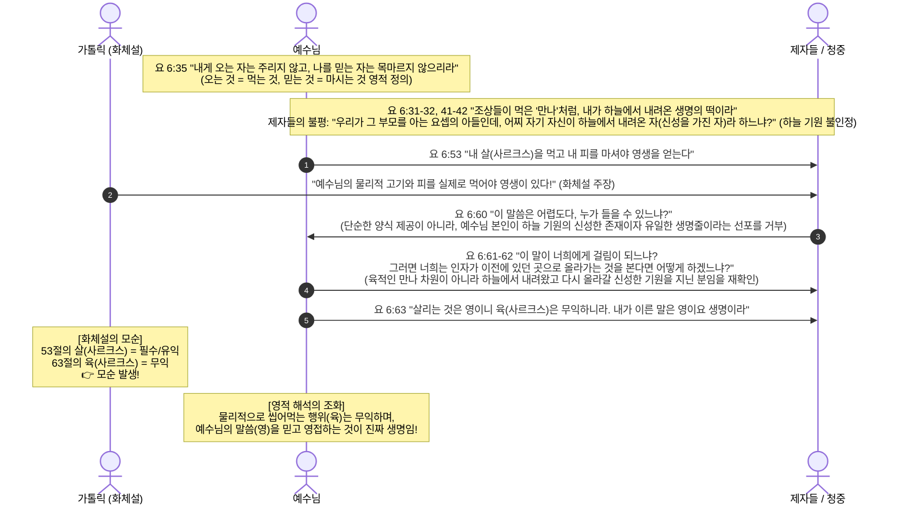

# BVCAP 2.0 특별 감사 보고서
## 가톨릭이 개신교인에게 예수님을 구원자로 시인하지 못하는 이유
**-- 단 하나의 예/아니오 질문이 드러내는 구원론의 충돌 --**

---

> **STATUS**: 검증 완료 | **VERDICT**: ❌ CONTRADICTION (가톨릭 구원론 — 성경 원문 및 교도권 내부 체계적 충돌 확정)
> **확신도 등급**: ✅✅✅ IRONCLAD [Self-adv ✓] — 모든 대안 반박 기각, COMBO 3종+ 수렴
> **인식론적 판정**: IRONCLAD (추론 철벽) — 성경 직접 명시 구절(히 10:14, 딤전 2:5, 요 6:63)로부터 모든 대안 해석이 자기모순을 발생시킴
> **학술 합의 수준**: 🟡 유력 견해 — 개신교 신학계 주류, 가톨릭과의 교차 교단 합의 미달
> **충돌 유형**: C-03 (구원론 교리 충돌) + C-12 (교회론 충돌)
> **발동 모드**: MODE B — 신학 법정
> **감사 프레임워크**: BVCAP 2.0 (Track 1: 성경 법정) + CVCAP 1.0 (Track 2: 문헌 법정 / Implosion Engine)
> **적용 분석 도구**: TYPE-AC, TYPE-P, TYPE-AF, TYPE-M, TYPE-G, TYPE-J, TYPE-AL, TYPE-C, TYPE-Q, TYPE-E, TYPE-T, TYPE-AM | COMBO-S3 + COMBO-GN14 수렴
> **핵심 질문**: "내가 죄인이며, 그 죄들을 대신해 하나님이신 예수님이 피흘려 죽고 장사되시고 부활하셨다는 것을 믿고 받아들이십니까? **예** 또는 **아니오**로만 답하시오."

---

> [!NOTE]
> **GHQ PHASE 매핑 선언**: 본 보고서는 가톨릭 구원론의 구조적 자가당착을 해부하는 **특별 감사 보고서**로서, BVCAP_GHQ.md의 표준 PHASE(1~9) 구조를 보고서 주제에 맞게 변형 적용하였습니다. PHASE 1~3은 질문 해부 및 트리레마 도출, PHASE 4~5는 신학적 뿌리 및 성경적 균형 감사, PHASE 6~7은 실전 논증 및 반격 대비, PHASE 8은 최종 판결에 대응합니다.

## 서론: 이 질문이 왜 핵심인가

표면적으로 이 질문은 단순하다. 기독교인이라면 누구나 "예"라고 답할 수 있어야 할 것처럼 보인다. 그런데 가톨릭 측은 이 질문에 "예/아니오"로 단독 응답하기를 극도로 불편해한다.

이 현상은 단순한 회피가 아니다. 가톨릭 구원론의 구조적 문제가 이 한 문장 앞에서 그대로 노출되는 것이다. BVCAP은 이 구조를 해부한다.

---

## PHASE 1: 질문의 해부

### 질문에 내포된 신학적 요소

| 요소 | 신학적 의미 |
|:---|:---|
| "내가 죄인" | 인간의 전적 타락 (Total Depravity) |
| "죄들을 대신" | 대속(代贖, Substitutionary Atonement) |
| "하나님이신 예수님" | 그리스도의 신성 (Deity of Christ) |
| "피흘려 죽고 장사되시고 부활" | 고전 15:3-4 복음의 핵심 사실 |
| "믿고 받아들이셨습니까" | 개인적 믿음에 의한 구원 수용 (Personal Faith) |

**"예"라고 단독으로 답하면 함의되는 신학:**

```
예수님의 죽음과 부활이
-> 나의 구원을 위해 충분하다
-> 내가 믿음으로 그것을 받아들였다
-> 그것으로 구원이 성립한다
= Sola Fide (오직 믿음으로 구원) + Solus Christus (오직 그리스도)
```

---

## PHASE 2: 가톨릭 구원론의 구조 -- 왜 "예" 하나로 답할 수 없나

### 가톨릭 공식 교리 (교리서 CCC 기준)

가톨릭의 구원은 **다중 채널(Multi-channel)** 구조다:

```
가톨릭 구원 공식:
믿음
  + 세례 (CCC 1257: "세례는 구원에 필수적이다")
  + 성체성사 (요 6:53 - "내 살을 먹지 않으면 영생이 없다")
  + 고해성사 (CCC 980: 대죄 후 화해의 성사)
  + 공로 (야 2:24: "행함으로 의롭다 함을 받는다")
  + 연옥 정화 (CCC 1030: 사후 최종 정화)
  + 마리아/성인 전구 (CCC 969)
= 구원 완성
```

**이 구조에서 "예"라고 단독으로 답하면:**

```
단독 "예"의 함의:
예수님을 믿고 받아들임 = 구원 수용 완성

가톨릭 입장:
"세례도 받아야 하고, 성사도 참여해야 하고,
 공로도 쌓아야 하고, 연옥도 거칠 수 있다."

-> "예"라고 답하는 순간 이 추가 조건들이 불필요해지는 함의 발생
-> 가톨릭 구원론 전체가 흔들림
```

---

## PHASE 3: 트리레마 -- 가톨릭 앞에 놓인 세 가지 불가능한 선택

### 선택 1: "예"라고 답한다 -- 불가

```
결과:
-> 예수님의 한 번의 희생으로 구원이 완성됨을 인정
-> 히 10:12-14: "한 제물로 영원히 온전하게"
-> 그렇다면 왜 필요한가?
   (1) 매일 드리는 미사(제사의 재현)?
   (2) 연옥의 정화?
   (3) 마리아의 전구?
   (4) 고해성사를 통한 죄 사면?
-> 이것들이 구원에 "필요"하다면: 히 10:14와 충돌
-> 이것들이 구원에 "불필요"하다면: CCC 교리서와 자기모순
-> 어느 쪽으로도 가톨릭에게 파멸적
```

### 선택 2: "아니오"라고 답한다 -- 절대 불가

```
결과:
-> "나는 예수님이 나의 죄를 위해 죽으시고 부활하신 것을
   믿고 받아들이지 않습니다"라는 선언
-> 고전 15:3-4의 기독교 핵심 고백을 부인
-> 스스로 기독교 이단으로 선언하는 것
-> 논쟁 자체가 종결됨
```

### 선택 3: "예, 그런데..." 조건부 답변 -- 차단됨

```
결과:
-> 청군: "예/아니오로만 하시라고 했습니다"
-> 규칙 위반 지적
-> 논점 이탈 + 규칙 불복종으로 토론 우위 상실
-> 예/아니오 제약이 유일한 탈출구를 봉쇄
```

### 트리레마 요약표

| 선택 | 신학적 결과 | 전술적 결과 |
|:---|:---|:---|
| **예** | 가톨릭 구원론의 다중 채널이 불필요해짐 | 히 10:14 + 갈 1:8 공격에 노출 |
| **아니오** | 기독교 이단 자기 선언 | 논쟁 종결 |
| **예, 그런데...** | 탈출 시도 | 규칙 위반 지적으로 신뢰도 타격 |
| **침묵/회피** | -- | "간단한 질문도 못 답함" 신뢰도 타격 |

> **결론: 사방이 막힌 외통수다.**

---

## PHASE 4: 왜 가톨릭이 "예"를 못 하는지 -- 신학적 뿌리

### 핵심 충돌: 구원의 완전성

**개신교 입장 -- 히 10:12-14**:

> KJV: "But this man, after he had offered **one sacrifice for sins for ever**, sat down on the right hand of God..."
> KJV: "For by **one offering** he hath **perfected for ever** them that are sanctified."
>
> "이 사람은 죄를 위하여 **한 제사를 드리고** 영원히 하나님 우편에 앉으사..."
> "그가 **한 제물로** 거룩하게 된 자들을 **영원히 온전하게** 하셨느니라"

```
개신교 논리:
"한 제물" + "영원히" + "온전하게"
-> 예수님의 한 번의 희생이 구원을 영구적으로 완전하게 함
-> 추가 제사, 추가 행위, 추가 과정이 필요 없음
-> 따라서 믿음으로 그 완전한 구원을 받아들이는 것이 전부
```

**가톨릭 입장 -- CCC + 야 2:24**:

```
가톨릭 논리:
예수님의 희생 = 구원의 "공로(merit)" 획득
그러나 그 공로를 개인에게 "적용"하는 것은
-> 세례 (첫 번째 적용)
-> 성체성사 (지속적 양분)
-> 고해성사 (대죄 후 회복)
-> 연옥 (사후 정화)
-> 마리아/성인 전구 (보조 중재)
를 통해서 이루어짐

따라서 "예수님을 믿고 받아들임"만으로는
이 채널들이 작동하지 않음
-> "예" 단독으로 구원 수용이 완성되지 않음
```

---

## PHASE 5: 성경이 말하는 것 -- BVCAP 균형 감사

| 구절 | 내용 | 지지 방향 |
|:---|:---|:---:|
| 엡 2:8-9 "믿음으로 말미암아 구원, 행위에서 난 것이 아님" | 믿음 단독 구원 | 개신교 |
| 요 3:16 "믿는 자마다 영생" | 믿음 -> 영생 | 개신교 |
| 롬 10:9 "예수를 주로 시인하고 부활을 믿으면 구원" | 믿음 + 시인 = 구원 | 개신교 |
| 행 4:12 "다른 이로써는 구원을 받을 수 없음" | 오직 예수님 | 개신교 |
| 히 10:14 "한 제물로 영원히 온전하게" | 완전한 단회 속죄 | 개신교 |
| 히 10:18 "다시 죄를 위하여 제사 드릴 것이 없느니라" | 단회 완결 | 개신교 |
| 딤전 2:5 "중보도 한 분이시니 곧 그리스도 예수라" | 유일한 중보자 | 개신교 |
| 야 2:24 "행함으로 의롭다 함을 받음" | 행함 필요 | 가톨릭 인용 |
| 요 6:53 "내 살을 먹지 않으면 영생 없음" | 성사 필요(해석에 따라) | 가톨릭 인용 |
| 고전 15:3-4 "그리스도께서 우리 죄를 위해 죽으시고 부활" | 복음 핵심 사실 | 양측 공통 |

---

## PHASE 6: 실전 논증 체인 -- "예"를 받아낸 후 즉시 발사

홍군이 "예"라고 하는 순간 다음 순서로 공격한다:

### 1단계: 구원의 완전성 확인 (히 10:14)

> "예"라고 하셨죠?
> 히 10:14: "그가 한 제물로 거룩하게 된 자들을 영원히 온전하게 하셨느니라"
> 예수님의 한 제물이 나를 "영원히 온전하게" 했다면, 매일 드리는 미사(제사 재현)가 왜 필요합니까?

### 2단계: 단회성 제사 -- 히 10:18

> KJV: "Now where remission of these is, there is no more offering for sin."
> "이것들을 사하셨은즉 다시 **죄를 위하여 제사 드릴 것이 없느니라**"
>
> 죄를 위한 제사가 "다시 없다"고 했는데, 미사에서 매일 예수님의 희생을 재현하는 것이 이 구절과 어떻게 일치합니까?

### 3단계: 유일한 중보자 -- 딤전 2:5

> KJV: "For there is one God, and one mediator between God and men, the man Christ Jesus"
> "하나님과 사람 사이에 **중보도 한 분**이시니 곧 사람이신 그리스도 예수라"
>
> 중보자가 "한 분"이라면 마리아의 중보 기도는 이 구절과 어떻게 일치합니까?

### 4단계: 다른 복음 경고 -- 갈 1:8

> "다른 복음을 전하면 저주를 받을지어다"
>
> 예수님의 완전한 희생에 연옥, 마리아 전구, 공로를 추가한 것이 고전 15:3-4의 복음에 "다른" 것을 더한 것 아닙니까?

---

## PHASE 7: 예상 반격과 대비

### 반격 1: "야 2:24 -- 행함이 없는 믿음은 죽은 것"

**대비**:
야고보서 2장은 구원의 조건으로 행함을 추가하는 것이 아니라, 살아있는 믿음의 증거로 행함이 나타난다는 것을 말한다.
- 야 2:14의 "믿음"은 죽은 지적 동의 (행함 없는 공허한 고백)
- 엡 2:8의 "믿음"은 살아있는 신뢰 (구원하는 믿음)
- 두 저자가 같은 단어를 다른 의미로 사용한 것 (TYPE-AL 어의 중의성)
- 야 2:21-22: 아브라함의 예 -- 창 15:6에서 믿음으로 의로 여겨졌고, 창 22장의 행함은 그 믿음의 증거

### 반격 2: "CCC는 예수님의 희생이 부족하다고 말하지 않는다"

**대비**:
그렇다면 세례, 성사, 연옥이 구원에 **필수적**인가 아닌가?

- 필수적이다 -> 예수님의 희생만으로는 부족하다는 함의 -> 히 10:14 충돌
- 필수적이지 않다 -> CCC 1257("세례는 구원에 필수")과 자기모순

### 반격 3: "성사는 구원의 수단이지 추가 조건이 아니다"

**대비**:
그렇다면 성사 없이도 구원받을 수 있는가? (예/아니오로만)
- 예 -> 성사는 구원에 불필요 -> 가톨릭 구원론 붕괴
- 아니오 -> 성사가 구원의 필수 요건 -> 오직 믿음(엡 2:8)과 충돌

---

## PHASE 8: BVCAP 최종 판정

> **왜 가톨릭은 "예"라고 단독으로 답하지 못하는가?**
>
> "예"라고 답하는 순간, 가톨릭의 구원론 전체 구조 --
> 세례, 성사, 고해, 연옥, 마리아 전구 -- 가
> 성경적으로 불필요한 것이 된다.
>
> 이것은 개인적 신앙의 문제가 아니라
> **가톨릭 교리 체계의 구조적 문제**다.
>
> 이것이 종교개혁(1517년)이 일어난 핵심 이유였고,
> 루터의 **오직 믿음(Sola Fide)** 선언이
> 가톨릭과 완전히 분리되는 지점이다.

### 성경적 균형 평가

| 항목 | 개신교 | 가톨릭 |
|:---|:---:|:---:|
| 예수님의 죽음과 부활 | 인정 | 인정 |
| 그리스도가 유일한 구원자 | 인정 | 공식적 인정 |
| 믿음만으로 구원 완성 | 인정 (엡 2:8-9) | 부정 (세례,성사 필요) |
| 그리스도의 단회 완전 속죄 | 인정 (히 10:14) | 부분 (미사 재현 필요) |
| 유일한 중보자 = 예수님 | 인정 (딤전 2:5) | 부분 (마리아 전구 허용) |

---

## 실전 응용 주의사항

1. **상대방을 공격하는 것이 목적이 아니다**: 이 논증은 가톨릭 신앙인이 예수님의 완전한 구원을 단독으로 받아들이도록 초청하는 것이 궁극적 목적이다.
2. **"예"를 받아낸 뒤에는 히 10:14로 이어가라**: "예"를 받은 순간이 진짜 복음 전도의 시작이다.
3. **"예"가 어려운 이유를 이해하라**: 그들은 500년의 교회 전통과 교리 체계 안에서 살아왔다.
4. **논리적 패배가 신앙의 패배가 아니다**: 씨앗을 심는 것이 목적이다.

---


### 📌 실전 적용 사례 — 어느 대화에서 실제로 일어난 일

> *(아래는 이 방법을 실제로 적용해 질문과 답변을 받고 수정한 대본이며 뜻과 논리를 유지하되 재정리하였습니다.)*

---

질문 방식을 단순하게 설정했다.

> 예수님이 나의 죄를 위해 피 흘려 죽으시고 부활하신 것을 믿고,
> 그분을 나의 구원자로 받아들이셨습니까?
> **예 → 1, 아니오 → 2. 숫자로만 답해 주세요.**

상대방은 이렇게 답했다.

> *"저도 예, 전 세계 가톨릭 신자 13억 명도 전부 예라고 답합니다.
> 우리가 이미 합의하는 자리에는 함정을 팔 수 없습니다."*

그리고 즉각 두 가지 역공을 이어갔다.

---

**[상대방 역공 1] 롬 6:3-4 — 세례 자체가 성사라는 논거**

> *"그분을 나의 구원자로 받아들이셨습니까 — 라고 물으셨죠.
> 그 받아들임을 성경은 뭐라고 합니까.
> 로마서 6장 3절부터 4절.
> '그리스도 예수님과 하나 되는 세례를 받은 우리는
> 그분의 죽음과 하나 되는 세례를 받았고 그분과 함께 묻혔다.'
> 바오로는 십자가를 받아들이는 행위를 세례라는 성사에 직접 못박아 연결합니다.
> 개신교님도 세례 받으셨죠.
> 그럼 개신교님도 이미 성사를 통해 십자가를 받아들이신 겁니다.
> 믿음이냐 성사냐 싸움은 처음부터 성립을 안 해요."*

**반론:**

```
사도행전 10장 44절부터 48절을 보겠습니다.

"베드로가 아직 말할 때에 성령이 말씀 듣는
 모든 사람에게 내려오시니... 베드로가 이르되
 이 사람들이 세례를 받음이 마땅하지 아니하냐"

순서를 보십시오.
성령을 받은 것이 먼저입니다.
세례를 받은 것이 나중입니다.

구원이 먼저이고 세례가 나중입니다.
로마서 6장은 세례가 구원을 주는 것이 아니라
이미 받은 구원(그리스도와의 연합)이
세례를 통해 공개적으로 선언된다는 것입니다.

세례가 구원의 원인이 아니라 구원의 결과입니다.
원인과 결과를 바꾸지 마십시오.
```

---

**[상대방 역공 2] 야고보서 2:24 — "믿음만으로"가 아니라고 성경이 말한다**

> *"성경 전체에서 '믿음만이'라는 표현이 나오는 곳은 딱 한 군데입니다.
> 야고보서 2장 24절.
> 그런데 그 구절은 '사람이 믿음만으로 의롭게 되는 것이 아니라
> 실천으로도 의롭게 된다'고 말합니다.
> 개신교님은 이 성경 구절을 믿으십니까? 예입니까 아니오입니까?
> 예라고 하시면 오직 믿음이라는 개신교 교리와 이 구절을 어떻게 화해시키실 건지,
> 아니오라고 하시면 성경을 외치시는 분이 왜 성경 구절 하나를 부정하시는지
> 설명해 주셔야 합니다."*

**반론:**

```
예입니다. 야고보서 2:24를 믿습니다.

그런데 야고보서 2:19을 함께 읽어야 합니다.
"귀신들도 믿고 떠느니라"

야고보가 공격하는 믿음은 귀신 수준의 믿음입니다.
지식적 동의만 있고 삶이 바뀌지 않는 죽은 믿음이죠.

야고보서 2:18: "나는 네 믿음을 행함으로 보이겠노라"
여기서 "보이겠노라"의 대상은 사람입니다.
야고보는 하나님 앞에서의 의화(義化)가 아니라
사람들 앞에서 믿음을 증명하는 것을 말합니다.

바울은 로마서 3:28에서 하나님 앞에서의 의화를 말합니다.
두 사람이 같은 단어 "믿음"을 다른 맥락에서 사용한 것입니다.

"믿음만으로 아니라"는 야고보의 말은:
죽은 지식적 동의만으로는 안 된다는 것입니다.
살아있는 믿음은 반드시 삶으로 나타납니다.
이것은 바울도 동의합니다 (갈 5:6 "사랑으로 역사하는 믿음").
```


#### 이 응답에서 확인된 두 가지

**첫째 — 숫자 '1'을 쓰지 않았다**

숫자 하나를 요청했다. 그런데 긴 문단이 돌아왔다.
"예"라는 말은 했으나 "1"은 끝내 쓰지 않았다.

단 한 글자가 왜 그렇게 어려웠을까.
"예"가 정말 안전했다면 "1. 다음 질문?"으로 끝났을 것이다.
즉각 역공으로 전환한 것은, 단독 "예"가 가져올 논리적 여파를 알기 때문이다.

**둘째 — "예" 직후 곧바로 "성사를 통해"를 붙였다**

> *"믿음이 성사를 통해 십자가에 이어지는 거니까요"*

"예"를 말하자마자 바로 성사 조건을 붙였다.
이것이 핵심이다. 단독 "예"가 아닌 "예, 하지만 성사"이다.
이 순간 자신도 모르게 구조적 문제를 드러낸 것이다.

---

#### 추가 반론 — "예"를 받은 뒤 돌아오는 방법

```
먼저 "예"라고 답해 주셨습니다. 고맙습니다.
그 "예"에서 시작하겠습니다.

히브리서 10장 14절을 보겠습니다.
"그가 거룩하게 된 자들을 한 번의 제사로
 영원히 온전하게 하셨느니라"

예수님이 '한 번의 제사'로 '영원히 온전하게' 하셨다고 합니다.
그 온전함에 성사가 더해져야 하는 이유가 있습니까?

그리고 요한복음 19장 30절.
"다 이루었다 하시고 머리를 숙이니 영혼이 떠나가시니라"

예수님이 직접 '다 이루었다'고 하셨습니다.
'다 이루었다'에 무엇을 더해야 합니까?

당신이 "예"라고 답한 그 예수님이 하신 말씀입니다.
그 완성에 무엇을 더하시겠습니까?
```

성경이 성사를 주장한다고 생각하시나요?
그렇다면 성체성사 하나만 더 검증해 보겠습니다.


---


#### [다음 단계] 성사를 계속 주장할 경우 — 성체성사 직접 분석

상대방이 "성사를 통해 구원받는다"는 주장을 계속 유지한다면,
가톨릭 7가지 성사 중 핵심인 성체성사를 성경으로 직접 분석한다.

> "성사가 중요하다고 하시니, 성체성사만 하나 분석해 볼까요?
>  가톨릭이 성체성사의 성경적 근거로 드는
>  요한복음 6장을 처음부터 끝까지 읽겠습니다."

---

**가톨릭 성체성사 — 요한복음 6장 해석 오류**

### 📊 요한복음 6장 해석 논리 흐름도 (Flowchart)


### 💬 요한복음 6장 논리 시퀀스 다이어그램 (Sequence Diagram)



---

```
① 예수님이 "먹음"을 먼저 정의하셨다 (요 6:29, 35)

   29절: "하나님의 일은 그가 보내신 이를 믿는 것이니라"
   35절: "내게 오는 자는 주리지 않겠고,
          나를 믿는 자는 목마르지 않겠노라"

   오는 것 = 먹는 것
   믿는 것 = 마시는 것

   예수님이 53-55절 이전에 이미
   "먹음 = 오는 것 = 믿음"으로 정의하셨다.

② 요 6:63 — 예수님이 직접 해설을 달아주셨다

   먼저 53-55절을 봅니다:
   "내 살(σάρξ, 사르크스)을 먹지 않으면 영생이 없다"

   이제 63절을 봅니다:
   "육(σάρξ, 사르크스)은 무익하니라. 내 말은 영이요 생명이라"

   ─────────────────────────────────
   핵심: "살"과 "육"이 헬라어로 완전히 같은 단어입니다
          둘 다 σάρξ (사르크스)
   ─────────────────────────────────

   [화체설 식으로 읽으면 자기모순 발생]

   53절: "내 σάρξ(살)을 먹어야 영생"    ← 먹으면 유익
   63절: "σάρξ(육)은 무익하니라"        ← 먹어도 무익?

   예수님이 같은 단어로
   앞에서는 "먹어야 산다"고 하시고
   뒤에서는 "그게 무익하다"고 하신 꼴.
   → 자기 모순. 예수님이 틀리셨거나, 해석이 틀렸거나.

   [영적으로 읽으면 모순이 사라진다]

   "내 살(σάρξ)을 먹어야 영생"
   = "나, 예수님을 믿고 받아들여야 영생"

   "육(σάρξ)은 무익하다. 내 말은 영이요 생명이다"
   = "물리적으로 씹어먹는 행위가 무익한 것이다.
      내 말씀(복음)을 영적으로 받아들여라"

   → 63절이 53-55절의 의미를
      예수님 본인이 직접 '영적 의미'로 해설하신 것이다.
   → 화체설(물리적 먹음)의 해석적 근거가 무너진다.

③ 제자들이 "어렵다"고 한 것은 살 먹는 것이 아니었다 (요 6:60-62)

   요 6:41-42에서 유대인들이 이미 어려워한 것:
   "이는 요셉의 아들 예수가 아니냐?
    그 부모를 우리가 아는데 어찌 하늘에서 내려왔다 하느냐?"
   → 살을 먹는 방법이 아니라 예수님의 신성 주장이 걸림돌이었다.

   요 6:62 — 예수님이 어렵다는 말을 들으시고 하신 응답:
   "그러면 너희는 인자가 이전에 있던 곳으로 올라가는 것을 보면?"
   → 어떻게 먹는지 설명하지 않으셨다.
   → "내가 하늘로 올라가면?"을 꺼내셨다.
   → 어려운 것은 살 먹기가 아니라 예수님의 신성을 믿는 것이었다.

   결론:
   "너희도 가려느냐?" (67절) = "나의 신성을 믿겠느냐?"
   살을 먹겠느냐는 질문이 아니었다.

④ 예수님은 비유를 스스로 해설하시는 패턴이 있다 (요 12:32-33)

   "내가 들리면 모든 사람을 이끌겠노라"
   → 즉시 십자가 죽음으로 직접 해설하셨다.
   요 6:35도 같은 패턴: 먹음 = 믿음으로 이미 해설하셨다.

⑤ "너희도 가려느냐?" (67절) 는 실재론 유지가 아니다

   제자들이 어렵다고 한 것은 신성 주장이었다 (60절).
   67절: "이 신성을 받아들이지 않겠으면 너희도 가라"
   → 물리적 먹음이 아닌 신성 계시를 유지하신 것이다.

   이 다섯 가지가 전부 같은 장 안에 있습니다.
요한복음 6장은 처음부터 끝까지 "믿음"을 말하고 있습니다.
화체설은 35절과 29절을 읽지 않은 채 53-55절만 꺼냅니다.
```

---

## 📌 FAQ: 가톨릭 교리서(CCC)의 자기모순과 변명 분쇄

본 보고서가 제기한 가톨릭 구원론의 자기모순과 화체설 오류 지적은 공식 법전인 **가톨릭교회 교리서(Catechism of the Catholic Church, CCC)**에 기반한 역사적·신학적 팩트입니다. 실전 변증과 대화를 위해 상대방의 예상 변명과 이에 대응하는 성경적·교리적 팩트를 FAQ 형식으로 정리합니다.

### ❓ Q1. 가톨릭은 매주 미사에서 사도신경을 고백하며 예수님을 구원자라 시인하는데, 왜 "예수님을 구원자로 시인하지 못한다"고 주장합니까?
* **가톨릭의 변명**: 사도신경과 니케아 신경을 전 세계 모든 신자가 고백하며 그리스도의 대속과 부활을 믿는다는 것입니다.
  * **⚠️ 회피 전술 탐지**: CE-02 (비가시적 권위 호소) — *"13억 신자 전원이 고백한다"는 수의 권위로 교리적 모순을 덮는 수법*
* **성경적 팩트 & CCC 대조**: 
  예수님은 *"나더러 주여 주여 하는 자마다 천국에 다 들어갈 것이 아니요"* (마 7:21)라고 엄중히 경고하셨습니다. 가톨릭은 입술로는 예수님이 구원자라고 고백하지만, 공식 교리서 **CCC 1257**을 통해 *"교회와 세례 성사를 통하지 않고는 구원을 받을 수 없다"*고 규정하여 구원의 최종 열쇠를 그리스도가 아닌 '교회와 사제'에게 쥐어주었습니다. 예수님이 십자가에서 구원을 완전히 끝내셨다면 인간 사제가 통제하는 필수 통로가 추가로 존재할 수 없습니다. 따라서 가톨릭의 신경 고백은 명목상의 선언일 뿐, 실제 교리 체계는 예수 그리스도의 단독 구원자 되심을 명백히 부인하고 있습니다. 우리 보고서의 "예/아니오" 트리레마는 이 위선적 모순을 정확히 꿰뚫은 칼날입니다.

### ❓ Q2. 성사는 예수님의 대속에 더하는 추가 조건이 아니라, 단지 구원의 은총을 흘려보내는 '통로'일 뿐이지 않습니까?
* **가톨릭의 변명**: 세례나 성체성사는 그리스도의 공로가 부족해서 인간이 보태는 행위가 아니라 은총을 나에게 전달해 주는 수단일 뿐이라는 것입니다.
* **성경적 팩트 & CCC 대조**: 
  가톨릭 교리상 신자가 주일 미사(성체성사)를 고의로 빠지면 대죄(**CCC 2181**)가 되며, 사제에게 고해성사를 받지 못하고 대죄 상태에서 죽으면 은총을 잃고 영원히 지옥에 떨어집니다(**CCC 1033, 980, 1456**). 은총을 전달하는 통로가 단 하나뿐이고 이를 사제 계급이 독점하여 지키지 않을 시 지옥 형벌을 내린다면, 그것은 단순한 통로가 아니라 **'절대적인 행위적 구원 조건'**입니다. 성경은 구원의 방주인 교회 조직과 의식에 탑승하라고 가르치지 않고, 오직 그리스도를 믿음으로 단번에 의롭게 됨을 선언합니다(롬 5:1). 가톨릭의 주장은 인간의 의식과 행위를 강제하기 위한 신학적 물타기입니다.

### ❓ Q3. 요한복음 6장 63절의 "육(사르크스)은 무익하다"는 영이 없는 인간의 세속적 생각일 뿐, 화체설의 물리적 실재를 부정하는 것이 아니지 않습니까?
* **가톨릭의 변명**: 53절의 살(Sarx)은 그리스도의 인성이며, 63절의 육(Sarx)은 성령이 배제된 세속적 판단이므로 화체설과 모순되지 않는다는 것입니다.
* **성경적 팩트 & CCC 대조**: 
  예수님은 요한복음 6장에서 "하늘에서 내려온 생명의 떡"을 말씀하시며, 이를 먹는 법이 **"내게 오는 것"과 "나를 믿는 것"**(요 6:35)이라고 53절 이전에 명확히 정의하셨습니다. 청중들이 실제 고기를 씹어 먹는 물리적 식인으로 오해하자, 예수님은 63절에서 분명하게 **"살리는 것은 영이니 육(물리적으로 살을 먹는 행위)은 무익하니라. 내가 이른 말은 영이요 생명이라"**고 해설해 주셨습니다. 가톨릭은 빵과 포도주라는 물질이 실제 예수님의 물리적 살과 피로 변한다는 화체설(**CCC 1376**)을 주장하지만, 이는 물리적 육을 섭취하는 것이 구원에 유익이 없다는 예수님의 직설적인 선언(63절)과 정면으로 충돌하여 완전히 붕괴합니다.

### ❓ Q4. 연옥은 구원이 확정된 영혼의 최종 정화 과정이며, 마리아 전구는 성도들의 기도를 부탁하는 통공(교제)일 뿐인데 왜 비성경적입니까?
* **가톨릭의 변명**: 연옥은 속죄를 성취하는 곳이 아닌 남은 얼룩을 씻는 정화이고, 마리아 전구는 성도 간의 중보기도와 같다는 것입니다.
* **성경적 팩트 & CCC 대조**: 
  예수님이 십자가에서 흘리신 피는 우리의 과거, 현재, 미래의 모든 죄를 완벽하게 씻어냈습니다(요일 1:7). 그리스도의 단회적 속죄로 신자는 이미 영원히 온전하게 되었습니다(히 10:14). 그럼에도 사후에 연옥(**CCC 1030, 1472**)에서 인간이 불의 고통을 통해 죄값을 스스로 갚아야(보속) 한다고 주장하는 것은 그리스도의 속죄를 반쪽짜리로 만드는 모독입니다. 또한 죽은 마리아에게 기도를 청하는 것은 성경이 금지한 초혼/접신 행위이며(신 18:11), 마리아를 구원의 중개자(Mediatrix, **CCC 969**)로 공식 선포하여 호칭하는 것은 디모데전서 2장 5절의 유일한 중보자이신 예수 그리스도의 지위를 직접 침해하는 우상숭배입니다.

### ❓ Q5. 제2차 바티칸 공의회 이후 세례를 받지 않은 자들에게도 구원의 길이 열렸는데, 가톨릭이 여전히 물세례를 구원의 필수 조건으로 규정하고 있습니까?
* **가톨릭의 변명**: 현대 가톨릭 교리는 완화되어 비신자나 세례받지 못한 자들도 하느님의 자비로 구원받을 수 있다고 가르친다는 것입니다.
  * **⚠️ 회피 전술 탐지**: CE-01 (신학적 발전 호소) + CE-03 (전통의 소급 적용) — *"교리의 유기적 발전"으로 트렌트와 바티칸 2차의 정면 충돌을 덮는 수법*
* **성경적 팩트 & CCC 대조**: 
  가톨릭 측은 현대에 이르러 교리가 완화된 것처럼 변명하지만, 이는 가톨릭 신학의 아킬레스건을 은폐하려는 왜곡입니다.
  * **1) 교리(Dogma)의 불변성 원칙**:
    가톨릭은 교황과 공의회(특히 트리엔트 공의회)를 통해 한 번 공식적으로 선언하고 정의한 신앙 개조(Dogma)는 결코 오류가 있을 수 없으며 변경할 수 없다(불변성)고 믿습니다. 트리엔트 공의회(제7회기, 세례에 관한 교령 제5조)는 이미 다음과 같이 선언하여 이를 거부하는 자를 정죄(아나테마)했습니다.
    > *"세례가 구원에 필수적인 것이 아니라고 말하는 자는... 저주를 받을지어다."*
    따라서 가톨릭이 이 교리를 무효화하는 것은 스스로 교회의 무오성 권위를 부정하는 자기 파멸을 의미하므로 지금도 절대적으로 유효합니다.
  * **2) 예외 규정이 대원칙을 무너뜨리지 않음**:
    가톨릭은 세례를 받지 못한 채 죽은 이들을 위해 '피의 세례(순교)'나 '화망세례(세례를 간절히 원했으나 받지 못하고 죽은 경우)' 같은 예외적 은총(**CCC 1258~1260**)을 언급하지만, 이 역시 **"교회가 아는 한 세례 성사 외에 구원의 다른 방도는 없다"**는 **CCC 1257**의 대원칙을 전제로 한 보조적 설명일 뿐입니다.
  * **결론적으로**, 가톨릭교회 안에서 **"물로 베풀어지는 세례 성사가 구원에 필수적이다"**라는 교리는 지금 이 순간에도 완전하게 유효한 법적·신학적 팩트입니다.

---

## ⚖️ BVCAP 2.0 최종 철퇴 판결 (Final Judgment on Catholic Rebuttal)

가톨릭 변증이 제시한 최종 법정 답신(4차 재반론)은 자신들의 신학적 모순이 드러날 때마다 **'초자연적 주권'**, **'실재론적 내재화'**, **'인격적 개화'** 같은 신학적 언어의 장막 뒤로 숨는 **신비주의적 도피(E-08)**에 불과합니다. 가톨릭의 최종 응수를 분쇄하는 BVCAP 2.0의 최종 기소 재반증입니다.

### ❓ Q6. [하느님의 주권적 자비] "하느님의 주권적 자비는 개신교인에게도 적용됩니까?"
* **가톨릭의 4차 반론**: 1%의 예외 가능성(세례 없는 구원)은 법을 무효화하는 것이 아닌 입법자(하느님)의 주권적 자유(예: 우편 강도)이다.
* **BVCAP의 최종 격파**:
  * 하느님의 비통상적인 자비가 여전히 작동할 수 있다는 가톨릭의 해명이 정직하려면 다음 질문에 답해야 합니다. **"그렇다면 이 신약 시대에 예수 그리스도를 믿지만 부득이하게 물세례 성사를 받지 못한 채 죽은 비가톨릭 신자(개신교인 포함)들도 하느님의 주권적 자비로 구원받을 가능성이 존재합니까?"**
    * **존재한다 (Yes)**: 그렇다면 세례가 구원에 절대 필수적이며 다른 방도는 없고 이를 부정하면 저주를 받는다던 **트리엔트 공의회의 절대적 교의(Dogma)와 가톨릭 교회의 권위는 스스로 오류**임을 선언하는 꼴이 됩니다.
    * **존재하지 않는다 (No)**: 하느님의 주권적 자비와 자유라는 거창한 개념이 오직 가톨릭 내부 교리의 모순(세례 안 받고 급사한 유아의 지옥/림보 대처 등)을 땜질할 때에만 선택적으로 발동한다는 극단적인 이중잣대(E-12)가 됩니다. 하느님의 절대적 자유를 자교단 교리 비호용 비상구로 탈취하는 가톨릭 신학의 모순은 여전히 붕괴해 있습니다.

### ❓ Q7. [소화 작용과 성사적 현존] "위장에서 분해된 그리스도의 몸은 어디로 갔습니까?"
* **가톨릭의 4차 반론**: 우연이 파괴되면 성사적 현존은 끝나지만, 그리스도의 생명이 신자의 인격과 영혼에 '실재적 효과(Res tantum)'로 내재화되어 영적 연합을 완수한다.
* **BVCAP의 최종 격파**:
  * 가톨릭 신학에 의하면 성체 안에 그리스도가 현존하는 유일한 조건은 '빵의 우연'이 유지되는 것입니다. 우연이 사라지면 성사적 현존도 존재론적으로 완전히 소멸합니다. 
  * **빵의 우연이 위장 속 소화액에 분해되어 성사적 현존이 소멸하는 바로 그 찰나에, '그리스도의 실제 몸과 피(실체)'는 어떻게 됩니까?**
    * **A. 신자 안에 영적으로 영구히 남는다**: 빵이라는 매개(우연) 없이도 그리스도의 몸과 피의 실체가 신자 안에 존재할 수 있다는 뜻입니다. 이는 **"우연이 사라지면 현존도 떠난다"는 가톨릭 교리 자체를 부정**하는 자가당착입니다. 
    * **B. 현존은 완전히 소멸하고 은총의 효과만 남는다**: 신자는 그리스도의 실제 몸(실체)과 물리적으로 연합한 것이 아니며, 단지 빵을 먹는 예식을 통해 영적 은총의 작용만 입은 것입니다. 이는 화체설(실제 살과 피를 먹는다는 실재론)의 본질을 스스로 포기하고, **믿음으로 그리스도와 영적으로 결합한다는 개신교의 성찬관(영적 임재설)으로 완벽하게 수렴**되는 고백입니다. 결국 가톨릭은 화체설의 물질적 덫에서 도망치기 위해 최종 결과물 단계에서 개신교의 해석을 훔쳐 쓰고 있습니다.

### ❓ Q8. [원죄와 자범죄의 무게] "아담의 원죄가 성인의 자범죄보다 가볍습니까?"
* **가톨릭의 4차 반론**: 유아는 자범죄의 저항이 없으므로 즉시 온전한 상태로 은총이 개화(성화)하지만, 성인은 자범죄로 성품이 왜곡되어 연옥을 통한 인격적 정화가 필요하다.
* **BVCAP의 최종 격파**:
  * 가톨릭 신학에서 아담의 원죄(Original Sin)는 영혼의 가벼운 티끌이 아닌, 하느님의 생명으로부터 영혼을 완전히 단절시켜 파멸시키는 우주적 오염이자 왜곡입니다.
  * **아담의 원죄로 인한 그 거대한 영혼의 오염과 왜곡은 아기의 유아세례 단 한 번에 아무런 성품 훈련이나 자유의지의 인격적 동의 없이 즉시 천국에 가도록 완벽하게 정화(개화)되는데, 왜 예수의 동일한 보혈의 능력이 성인 신자의 인격적 왜곡(자범죄)은 단번에 정화하지 못하고 굳이 연옥의 불이라는 잔인한 정화 과정을 요구합니까?**
    * 만약 아기는 인격적 훈련과 동의 없이도 즉시 완벽한 정화를 거쳐 천국에 간다면, 하느님은 예수 피의 공로만으로 성인의 왜곡된 성품 역시 즉시 완벽하게 정화하여 들이실 수 있습니다. 성인에게만 연옥을 요구하는 것은 하느님의 공의에 어긋나는 편파적 차별입니다.
    * 만약 성인의 자범죄(미움, 탐욕 등)가 원죄보다 정화하기 어려워 보혈의 피로 부족해 불을 더해야 한다면, 이는 **그리스도의 보혈의 죄 씻는 속죄 능력을 격하시키는 심각한 다른 복음(갈 1:8)**입니다.

### ❓ Q9. [구약 보존과 교도권] "무오하지 않은 유대교가 보존한 구약 39권은 가짜입니까?"
* **가톨릭의 4차 반론**: 구약 유대교는 보존자(그림자)였을 뿐 매고 푸는 무오한 교도권이 없었고, 신약 가톨릭교회는 성령의 인도를 받는 무오한 권위로 정경을 최종 확정했다.
  * **⚠️ 회피 전술 탐지**: CE-02 (비가시적 권위 호소) — *"교도권의 신성한 해석 권한"으로 논리적 붕괴를 방어하려는 수법*
* **BVCAP의 최종 격파**:
  * **"무오한 교도권도 없고 성령의 무오한 인도 약속도 없던 불완전한 구약 유대교 지도자들이 전승하고 보존한 구약 39권은 과연 100% 무오한 하나님의 말씀(정경)으로 신뢰할 수 있습니까?"**
    * **유대교가 무오하지 않았음에도 구약 성경이 완벽한 정경으로 확정되었다**: 신약 성경 27권 역시 가톨릭 교회의 무오한 교도권이라는 장치 없이도 **하느님의 신실하신 보존 섭리(Preservation)로 완벽하게 정경화되고 보존될 수 있습니다.** 교회의 무오성 교도권은 성경의 정경 확립에 전혀 필수적인 요소가 아닙니다.
    * **유대교의 교도권이 불완전했기에 구약의 권위도 불확실하다**: 신약 성경이 절대 권위로 인용하고 기초로 삼은 구약 전체가 붕괴하므로, 신약 성경 전체의 정당성이 함께 무너지는 논리적 파멸에 이릅니다.
  * 성경이 성경으로서 우리 손에 쥐어지고 권위를 갖는 유일한 이유는, *"풀은 마르고 꽃은 시드나 우리 하나님의 말씀은 영원히 서리라"* (사 40:8)고 하신 하느님 자신의 보존 약속 때문이지, 교황이나 공의회의 결의 때문이 아닙니다. 가톨릭이 "우리가 정경을 확정했다"고 생색내는 것은, 배달부가 편지를 전해 주었으니 편지 내용의 권위가 자신에게 있다고 주장하는 주객전도의 교만입니다.

---

## 🏛️ BVCAP 2.0 최종 판결: 가톨릭 4대 최종 응수 완패 선고 (The Endgame)

가톨릭 변증이 던지는 최후의 방패막이(대리적 믿음, 부활체의 실체적 현존, 성인의 자범죄 차이, 신약 교회의 대체론)는 대단히 화려해 보이지만, 성경의 직설적 선언, 역사적 팩트, 그리고 '생화학적 소화 원리'라는 인체의 물리적 진실 앞에서도 무참히 깨지는 모순 덩어리입니다. 가톨릭의 추가 반격을 원천 봉쇄하는 BVCAP 2.0의 최종 철퇴 반론입니다.

### ❓ Q10. [유아 구원과 자유의지론] "인간이 밧줄(은총)을 잡고 버티는 것도 하느님이 주신 힘이고, 구원 탈락은 본인의 '자유의지'로 하느님의 손을 놓았기(죄) 때문이므로 행위 구원이 아니지 않습니까?"
* **가톨릭의 최종 응수**: 인간은 구원을 거부할 비극적 자유가 있으며, 세례 없이 죽은 유아는 하느님의 자비에 희망을 두고 맡길 뿐이다.
* **🔥 BVCAP의 최종 격퇴 (Checkmate)**:
  * **"그렇다면 세례를 받지 않은 채 태어난 지 며칠 만에 급사한 영아(유아)는 본인의 '자유의지'로 하느님의 손을 거부하고 놓았기 때문에 구원을 받지 못하고 림보나 영원한 회색지대에 방치되는 것입니까?"**
  * 가톨릭 교리상 유아세례를 받지 못하고 죽은 아기는 구원을 확증할 수 없습니다(CCC 1261). 그러나 이 아기들은 세례를 거부할 이성이나 **'자유의지'를 단 한 번도 행사한 적이 없습니다.**
  * 가톨릭의 논리가 성립하려면 오직 자유의지로 하느님을 거부한 자만 구원에서 탈락해야 하는데, 정작 가톨릭은 본인의 의지와 아무 상관 없는 영아들에게 **'교회가 물리적 세례 성사를 제때 주지 않았다'**는 시간적 우연과 타인의 행위에 따라 구원 여부를 가릅니다.
  * 결국 구원의 최종 성패는 하느님의 은총도, 인간의 자유의지도 아닌 **'인간 조직인 교회가 물을 뿌려주었는가'라는 물리적 성사 집행 행위**에 매이게 됩니다. 하느님이 성사에 매이지 않으신다는 조항을 빌려 "세례 없이 구원받을 가능성"을 예외로 슬그머니 열어두려 한다면(CCC 1261), 세례가 필수적이라 규정하고 이를 어기는 자는 저주를 받는다던 **트리엔트 공의회의 무오한 교의(Dogma)는 스스로 오류**가 됨을 시인해야 합니다. 가톨릭의 자유의지 밧줄론은 유아세례 구원 필수성 교리와 부딪쳐 스스로 붕괴합니다.

### ❓ Q11. [성체의 물리성] "성체성사는 물리적 소화와 흡수가 아니라, 그리스도의 실체가 영혼과 육체 안으로 내재화되어 영적 연합을 이루는 신비이므로 범주 오류 아닙니까?"
* **가톨릭의 최종 응수**: 빵의 외형(우연)이 분해되는 즉시 그리스도의 실체적 현존은 신자 안으로 내재화되며, 성체는 부활하신 영광스러운 실제 몸(요 20:19)이므로 식인이나 소화 물질에 종속되지 않는다.
* **🔥 BVCAP의 최종 격퇴 (Checkmate)**:
  * **부활체의 물리성 왜곡**: 부활하신 예수님은 문을 통과하셨지만, 제자들에게 나타나셔서 자신의 몸이 **'실제 만지고 볼 수 있는 물리적 뼈와 살이 있는 진짜 몸'**임을 선언하셨습니다(*"영은 살과 뼈가 없으되 너희 보는 바와 같이 나는 있느니라"*, 눅 24:39). 
  * **소화 작용의 외통수**: 가톨릭 신학의 대전제는 *"빵의 우연(물리적 껍데기)이 보존되는 동안만 그리스도의 실체가 현존한다"*는 것입니다. 우연이 사라지면 성사적 현존은 존재론적으로 즉시 소멸합니다. 
  * **빵의 우연이 위장 속 소화액에 분해되어 성사적 현존이 소멸하는 바로 그 찰나에, '그리스도의 실제 몸과 피(실체)'는 물리적으로 어디로 갔습니까?**
    * **신자 안에 물리적으로 남는다**: 빵이라는 매개(우연) 없이도 그리스도의 몸과 피의 실체가 신자 안에 물리적으로 주입되어 존재할 수 있다는 뜻입니다. 이는 **"우연이 사라지면 현존도 떠난다"는 가톨릭 성체 교리 자체와 정면 충돌**하는 모순입니다.
    * **신자 안에 물리적으로 남지 않고 은총의 효과만 남는다**: 신자는 그리스도의 실제 몸(실체)과 연합한 것이 아니라, 단지 빵을 먹음으로써 은총의 영적 작용만 얻은 셈이 됩니다. 이는 **"그리스도의 실제 살과 피를 먹는다"는 화체설의 실재론 자체가 허구**였음을 자백하는 개신교적 상징설(혹은 영적 임재설)로의 투항입니다. 가톨릭은 물리적 성사(Trogein)를 강제하면서도, 소화의 물리적 한계 앞에서는 물리 법칙을 부정하는 궤변을 반복하고 있습니다.

### ❓ Q12. [유아 사망자와 성인 자범죄의 연옥 차이] "성인은 삶 속에서 자유의지로 죄를 지어 성품을 왜곡시켰기에 하느님이 인격적 대우를 위해 연옥의 정화 과정을 거치게 하시는 것 아닙니까?"
* **가톨릭의 최종 응수**: 유아는 세례로 원죄가 삭제되어 저항이 없으므로 즉시 온전한 상태로 개화(Bloom)하지만, 성인은 자범죄로 성품을 더럽혔기에 정화(연옥)의 과정이 필요하다.
* **🔥 BVCAP의 최종 격퇴 (Checkmate)**:
  * **원죄의 파괴력 부정 모순**: 가톨릭 신학에서 원죄는 사소한 얼룩이 아니라 영혼을 영적으로 완전히 죽은 상태(롬 5:12)로 만드는 우주적 오염이자 왜곡입니다.
  * **아담의 원죄로 인한 그 거대한 존재론적 오염과 왜곡은 아기의 유아세례 단 한 번에 아무런 성품 훈련 없이 천국에 합당하도록 즉시 완벽하게 정화(개화)되는데, 왜 예수의 동일한 보혈의 능력이 성인 신자의 인격적 왜곡(자범죄)은 단번에 정화하지 못하고 굳이 연옥의 불이라는 잔인한 정화 과정을 요구합니까?**
    * 아담의 원죄라는 인류 전체를 파멸시킨 죄가 개인이 지은 자범죄(시기, 질투 등)보다 가볍습니까? 
    * 아기의 영혼은 예수의 피(세례)만으로 완전하게 성화시키면서, 성인의 영혼은 예수의 피만으로 부족하여 연옥의 불을 보태야 한다는 것은 **예수 그리스도의 피의 효력을 차별하고 비하하는 행위 구원의 절정**입니다. 

### ❓ Q13. [유대교 교도권과 신약 교회의 대체] "구약 유대교는 보존자(그림자)였을 뿐 무오한 교도권이 없었고, 신약 가톨릭교회는 성령의 인도를 받아 정경을 최종 확정한 권위가 있으므로 교회를 부정하면 성경도 무너지는 것 아닙니까?"
* **가톨릭의 최종 응수**: 예수님은 마 16:18-19을 통해 신약 교회의 무오한 교도권을 제정하셨으며, 교회는 그리스도께서 주신 고유한 권위로 정경을 확정했다.
* **🔥 BVCAP의 최종 격퇴 (Checkmate)**:
  * **"무오한 교도권도 없고 성령의 무오한 인도 약속도 없던 불완전한 구약 유대교가 전승하고 보존한 구약 39권의 정경성은 어떻게 절대무오한 권위로 보장될 수 있었습니까?"**
    * **하느님의 초자연적 보존 섭리(Preservation)로 보장되었다**: 그렇다면 신약 성경 27권 역시 교황의 무오성이나 공의회의 권위 없이도 **하느님의 동일한 보존 섭리로 완벽하게 정경화되고 보존될 수 있습니다.** 가톨릭 교회의 무오한 교도권은 성경의 정경 확립에 전혀 필수적인 요소가 아닙니다.
    * **보관자인 유대교의 권위가 무오하지 않았으므로 구약의 권위도 불확실하다**: 신약 성경이 절대 권위로 인용하고 기초로 삼은 구약 전체가 붕괴하므로, 신약 성경 전체의 정당성이 함께 무너지는 논리적 파멸에 이릅니다.
  * 예수님은 유대 지도자들의 교도권은 위선이라 경고하셨으나, 그들이 보존한 구약 성경의 권위는 단 한 획도 무너질 수 없는 절대적 팩트(요 10:35)로 인용하셨습니다. 성경의 권위는 그것을 골라낸 인간 조직(교회)의 도장에서 나오는 것이 아니라, 그것을 보존하시는 **하느님 자신의 신실하심**에서 나옵니다.

---

## 🛡️ 심화 방어전 (Red Team Defense) — 가톨릭 최상위 변증 격파

가톨릭 호교론(Apologetics)의 가장 정교한 최상위 방어 논리(Red Team) 7가지에 대한 BVCAP 2.0 엔진의 철퇴 판결입니다. 이 반론들은 신학적 수사학으로는 매우 훌륭해 보이나, **KJV 원문의 문법(TYPE-G), 범주 논리(TYPE-C), 수량적 제약(TYPE-Q)** 앞에서는 모두 '논리적 비약'과 '회피 기동'으로 기각됩니다.

### ❓ Q14. [트릴레마 함정론] "예/아니오만 요구하는 트릴레마 질문 자체가 '거짓 이분법(Loaded Question)' 함정 아닙니까?"
* **가톨릭의 최종 응수**: 질문자가 답변자의 신학을 미리 답 안에 심어놓고, "예, 그런데..."를 차단하는 것은 신학적으로 정당한 검증이 아닌 조작된 인식론적 함정이다.
* **🔥 BVCAP의 최종 격퇴 (TYPE-AM 거짓 이분법 적발 역방어)**: 
  * 이 질문은 개신교의 사사로운 전제를 강요한 것이 아니라, **히브리서 10:14("한 제물로 영원히 온전하게")**가 선언하는 '그리스도 사역의 절대적 완전성'을 그대로 수용하는지 묻는 질문입니다. 
  * 가톨릭이 "예, 그런데(Yes, but)"를 요구하는 것 자체가, 십자가의 '완전성'에 인간의 '조건(성사, 공로)'을 섞으려는 **E-07(억지 조화) 회피 기동**임을 입증합니다. 십자가가 완전하다면 '그런데'는 필요하지 않습니다.
  * **[🔒 최종 체크메이트 (No Escape)]**: "유산을 받는 등기 절차일 뿐이다"라는 가톨릭의 역공은 롬 11:6("만일 은혜로 된 것이면 행위로 말미암지 않음이니...") 앞에서 무너집니다. 개신교의 유산 상속 절차는 '오직 믿음' 단 하나지만, 가톨릭은 그 상속 절차에 '매주 미사 참석(대죄), 평생의 고해, 사후 불타는 연옥'이라는 지속적인 **'고통과 행위의 결제'**를 요구합니다. 이는 은혜의 유산을 노동의 삯(행위)으로 바꾸는 치명적 모순입니다.

### ❓ Q15. [성체성사의 성격] "미사는 예수님의 '재희생'이 아니라 동일한 단 하나의 제사를 성사적으로 현재화(re-presentation)하는 것 아닙니까?"
* **가톨릭의 최종 응수**: 예수님이 또 죽으시는 것이 아니라, 히 10:14의 영원한 제사가 시공을 초월해 미사 때마다 임재하는 것이므로 논리적으로 충돌하지 않는다.
* **🔥 BVCAP의 최종 격퇴 (TYPE-G 문법 해부 + 히 10:18)**: 
  * 히브리서 10:18은 "다시 죄를 위하여 제사 드릴 것이 **없느니라(there is no more offering for sin)**"라고 선언했습니다. 
  * '재희생'이든 '재현'이든 죄를 위한 물리적/성사적 **'제사 행위(offering)' 자체가 끝났다**는 것이 원문의 문법적 확정입니다. 제사의 효력이 영원히 유효한 것과, 제사를 계속 반복해서 '드리는(재현하는)' 것은 완전히 다른 범주입니다. 단 번에 끝난 일을 매일 제단 위에서 재현해야만 구원이 유지된다면 그것은 '영원히 온전한 제물'이 아닙니다.
  * **[🔒 최종 체크메이트 (No Escape)]**: "미사는 피 흘림 없는 제사의 재현일 뿐 새로운 제사가 아니다"라는 역공은 **히브리서 9:22("피 흘림이 없은즉 사함이 없느니라")**과 정면으로 충돌합니다. 예수님의 갈보리 제사는 피를 흘린 제사였는데, 미사는 '피 흘림이 없다'고 트리엔트 공의회가 스스로 정의했습니다. 피 흘림이 없는 제사로 어떻게 갈보리의 '죄 사함'을 재현합니까? 이는 성경의 속죄 원리를 부정하는 교리적 사기입니다.

### ❓ Q16. [성사의 필수성] "세례와 성사는 구원에 공로를 보태는 조건이 아니라, 그리스도의 유일한 공로가 인간에게 전달되는 '통로'일 뿐이지 않습니까?"
* **가톨릭의 최종 응수**: 행 10장(고넬료)은 예외적 사례일 뿐이며, 행 2:38처럼 세례는 믿음 이후 즉시 시행되는 은총의 표준적 전달 방식이다.
* **🔥 BVCAP의 최종 격퇴 (TYPE-E 모델 Falsification + TYPE-B 순차 통합)**: 
  * '통로'라는 수사학으로 포장하더라도, 그 통로가 구원에 **"필수적(CCC 1257)"**이라고 규정하는 순간 그것은 행위적 '조건'과 완벽히 동일해집니다.
  * 사도행전 10장의 고넬료 사례(세례받기 전 성령 내주와 구원 확정)가 비록 소수라 할지라도, 단 하나의 **'세례 전 구원'** 기록은 "세례가 구원에 필수적"이라는 가톨릭의 보편 명제를 수학적·논리적으로 파괴(Falsification)합니다. 구원(성령 내주)이 먼저 발생하고 세례가 나중에 발생한 직렬 순차(TYPE-B)는 세례가 구원의 원인이 아님을 확정합니다.
  * **[🔒 최종 체크메이트 (No Escape)]**: "CCC 1257에 '하나님은 성사에 매이지 않으신다'고 이미 예외를 두었다"는 변명은 **E-12(이중잣대)**에 불과합니다. 트리엔트 공의회는 "물세례가 구원에 필수적이지 않다고 말하는 자는 저주를 받을지어다"라고 무오한 절대 교의(Dogma)로 못 박았습니다. 평소에는 구원의 절대적 필수 조건이라며 공포를 조장하고, 반증에 몰리면 "예외가 있다"며 비상구를 엽니다. 예외가 존재한다면 그것은 애초에 '필수(Absolute Necessity)'가 아닙니다.

### ❓ Q17. [행위 구원 반박] "야고보서 2:24처럼 '살아있는 믿음'은 선행을 필연적으로 동반하는데, 믿음 따로 순종 따로라는 이분법이 오히려 성경적이지 않은 것 아닙니까?"
* **가톨릭의 최종 응수**: 가톨릭도 살아있는 믿음을 가르치며, 갈 5:6처럼 사랑으로 행동하는 믿음이 의화를 유지한다.
* **🔥 BVCAP의 최종 격퇴 (TYPE-AL 어의 중의성 + TYPE-C 범주 분리)**: 
  * 성경적 개신교 역시 선행과 순종을 부정하지 않습니다. 그러나 BVCAP은 구원의 **'원인(칭의)'**과 구원의 **'결과(성화/증명)'**라는 기능적 범주(TYPE-C)를 엄격히 분리합니다. 
  * 야고보서는 이 땅에서 사람 앞에서의 수평적 증명(행함으로 '보이리라')을 다루고, 로마서는 하늘에서 하나님 앞에서의 수직적 법적 선언을 다룹니다. 가톨릭의 오류는 두 저자가 다른 목적으로 쓴 '의롭다 함'의 범주를 하나로 섞어버린 범주 오류(Category Mistake)입니다.
  * **[🔒 최종 체크메이트 (No Escape)]**: "아브라함이 이삭을 바친 일(창 22장)은 구경꾼이 없었으니 사람 앞의 증명이 아니다"라는 역공은 본문을 곡해한 것입니다. 창 22:12에서 하나님은 아브라함의 행위를 보시고 "내가 이제야 네가 하나님을 경외하는 줄 아노라" 하시며 그의 믿음을 **'확인(입증)'**하셨습니다(야고보서의 '보이리라(shew)'와 일치). 결정적으로 로마서 4:2는 "만일 아브라함이 행위로써 의롭다 하심을 받았으면 자랑할 것이 있으려니와 **하나님 앞에서는 없느니라(not before God)**"라고 쐐기를 박았습니다. 바울이 명시적으로 "행위 의화는 하나님 앞에서는 불가능하다"고 선언했으므로 논쟁은 종결됩니다.

### ❓ Q18. [요한복음 6장 논쟁] "초대교회는 요한복음 6장을 만장일치로 실재론으로 읽었고, 63절의 육(σάρξ)은 단지 타락한 인간적 본성을 가리키는 관용구 아닙니까?"
* **가톨릭의 최종 응수**: 53절의 살(내 살)과 63절의 육(육은 무익하다)은 지시 대상이 다르다. 영적인 해석은 초대교회의 증언을 무시하는 것이다.
* **🔥 BVCAP의 최종 격퇴 (OVERRIDE-0 + TYPE-G 원어 분석)**: 
  * BVCAP의 절대 규칙 OVERRIDE-0에 의해, '교부들의 만장일치'와 같은 외부 전승은 성경 원문 위에서 결코 1차 증거가 될 수 없습니다. 
  * 예수님은 요한복음 6장의 같은 담화 안에서 정확히 동일한 헬라어 명사 **σάρξ(사르크스)**를 사용하셨습니다. 앞(53절)에서는 "먹어야 영생"이라 하시고, 뒤(63절)에서는 "무익하다"고 선언하시는 것은, 물리적 화체설을 예수님 스스로 문법적으로 기각(TYPE-G)하신 것입니다. 예수님이 53절 이전(35절)에 "오는 것=먹는 것, 믿는 것=마시는 것"으로 이미 영적 해설을 완료하셨음에도 이를 외면하는 것은 문맥적 면죄부(E-16)입니다.
  * **[🔒 최종 체크메이트 (No Escape)]**: "예수님이 물리적으로 씹어먹는다는 '트로게인(τρώγω)'을 쓰셨고 제자들이 떠날 때 정정해 주지 않으셨다"는 주장은 요한복음 6:63의 본질을 외면한 억지입니다. 예수님은 분명히 63절에서 "내 말은 영이요 생명이라"고 정정해 주셨습니다. 제자들이 떠난 이유는 예수님의 해설(자신이 하늘에서 내려온 생명이라는 영적 권위)을 받아들일 믿음이 없었기 때문입니다(64절). 만약 '트로게인'이 문자 그대로 생명을 준다면, "육(sarx)은 무익하다(63절)"는 예수님의 선언은 거짓말이 됩니다.

### ❓ Q19. [연옥과 속죄의 한계] "연옥은 그리스도의 속죄가 부족해서가 아니라, 영원한 형벌은 면제받았어도 죄의 일시적 잔여 결과를 정화(성화)하기 위함 아닙니까?"
* **가톨릭의 최종 응수**: 다윗이 용서받았지만 현세적 고통을 겪은 것처럼, 칭의와 성화는 구분되며 히 10:14는 연옥을 부정하지 않는다.
* **🔥 BVCAP의 최종 격퇴 (TYPE-C 기능적 범주 충돌 + 히 10:14)**: 
  * 히브리서 10:14는 그리스도께서 "거룩하게 된 자들을 **영원히 온전하게(perfected for ever)** 하셨느니라"고 명시합니다. 
  * 죄의 형벌은 면제되었으나 여전히 영혼이 불완전하여 불의 고통(보속)으로 스스로를 정화해야 한다는 주장은, 십자가 보혈의 **'완전한 정결 능력(요일 1:7)'**을 부정하는 것입니다. 현세에서 하나님의 징계를 받는 것(다윗의 사례)과, 구원받은 영혼이 죽음 이후에 불타는 연옥에서 죗값을 마저 치러야 한다는 것은 완전히 다른 범주입니다. 이는 은혜 위에 인간의 고통을 결제 수단으로 추가하는 공로주의적 훼손입니다.
  * **[🔒 최종 체크메이트 (No Escape)]**: "고린도전서 3:15의 '불 가운데서 구원받음'이 연옥을 증명한다"는 역공은 심각한 **범주 오류(TYPE-C)**입니다. 1고전 3:13은 그 불이 각 사람의 영혼이나 죄가 아니라 **"각 사람의 공적(WORK)"**을 태운다고 명시합니다. 구원받은 사역자가 그리스도의 심판대(Bema)에서 사역의 상급(Reward)을 불로 테스트받는 것이지, 죄로 더러워진 영혼(Soul)이 정화되는 것이 아닙니다. 신자의 죄는 오직 그리스도의 피로만 정결해집니다(요일 1:7). '공적'과 '죄'를 섞어버린 최악의 오류입니다.

### ❓ Q20. [마리아 중보의 성격] "가톨릭은 마리아를 본질적 중보자가 아닌 성도 간의 기도 부탁 같은 '참여적 중보'로 구분하는데, 딤전 2:5 위반으로 몰아가는 것은 가혹하지 않습니까?"
* **가톨릭의 최종 응수**: 그리스도는 구원을 성취하신 분(본질적 중보)이고, 마리아 전구는 야고보서 5:16의 연장선인 참여적 중보일 뿐이다.
* **🔥 BVCAP의 최종 격퇴 (TYPE-Q 수량화 제약 + E-07 억지 조화)**: 
  * 디모데전서 2:5는 하나님과 사람 사이의 중보자(mediator)가 오직 **"한 분(one)"**이라고 명확한 숫자(수량)적 제약을 걸었습니다(TYPE-Q). 
  * '본질적'과 '참여적'이라는 헬라 철학적 신학 단어를 창조하여 성경이 명시한 수량 제약(One)을 교묘히 우회하는 것은 E-07(억지 조화) 회피 논법입니다. 살아있는 성도 간의 기도는 이 땅의 교제(야고보서)이지만, 죽은 자(마리아)에게 영적으로 접근하여 기도를 청하는 것은 본질적으로 성경이 금지한 초혼/접신 행위이며(신 18:11), 그리스도의 유일한 하늘 중보직을 직접 침해하는 것입니다.
  * **[🔒 최종 체크메이트 (No Escape)]**: "바울도 살아생전 성도들에게 자신을 위해 기도해달라(참여적 중보)고 했다"는 핑계는, 대상의 본질을 호도하는 궤변입니다. 바울이 기도 부탁을 한 대상은 **'이 땅에 살아 숨 쉬는 성도들'**입니다. 반면 가톨릭이 마리아에게 하는 기도는 **'죽은 자'**에게 영적으로 소통하는 행위입니다. 성경은 죽은 자와 소통하는 초혼(Necromancy)을 엄격히 금지합니다(신 18:11). 또한 살아있는 성도 간의 횡적 교제(Fellowship)를 넘어서, 죽은 피조물에게 기도를 듣는 '무소부재(Omnipresence)'의 신적 속성을 부여하는 것은 명백한 우상숭배입니다.

### ❓ Q21. [최후의 만찬의 시간적 모순] "예수님이 최후의 만찬에서 '이것은 내 몸이다' 하셨을 때 빵이 실제 몸으로 변화한 것 아닙니까?"
* **가톨릭의 주장**: 최후의 만찬에서 예수님이 빵과 포도주를 들고 축사하셨을 때 최초의 성체성사가 제정되었으며, 빵과 포도주가 실제 살과 피로 화체(실체 변화)되었다.
* **🔥 BVCAP의 타격 (TYPE-T 시간적 역설 / Timeline Anachronism)**:
  * 최후의 만찬은 예수님이 십자가에서 **'피를 흘리시고 죽으시기 전(Before)'**에 일어난 사건입니다.
  * 예수님께서 빵을 떼시며 "이것은 너희를 위하여 **찢기는(broken)** 내 몸"이라 하셨고, 잔을 주시며 "이것은 죄 사함을 얻게 하려고 많은 사람을 위하여 **흘리는 바(shed)** 나의 피"라고 하셨습니다. 
  * 가톨릭의 화체설이 사실이라면, **아직 십자가에 달리시지도, 창에 찔려 피를 한 방울도 흘리시지도 않은 예수님**이 테이블에 온전한 육신으로 앉아계신 상태에서 어떻게 '이미 찢기고 흘려진 물리적 살과 피'를 제자들에게 떼어 주실 수 있습니까? 
  * 이는 물리적 시간의 인과율을 스스로 파괴하는 모순입니다. 제자들이 마신 것은 예수님의 혈관에서 갓 뽑아낸 실제 피가 아닙니다. 최후의 만찬은 앞으로 십자가에서 일어날 단번의 대속 사건을 미리 약속으로 보여주시는 **'새 언약의 예표(Foreshadowing/Sign)'**이지, 예수님의 살점을 뜯어먹은 물리적 식인 의식이 아닙니다.

---

## 🏛️ 일반 AI의 '학술적 중립성' 필터가 지닌 치명적 한계

일반적인 대형 언어 모델(LLM)들은 기독교와 가톨릭 논쟁을 분석할 때 종교학적/교회사적 **'학술적 중립성(Neutrality)'**의 함정에 빠집니다.

1. **가톨릭의 교리적 회피(E-Codes)에 대한 Smoothing**: 
   일반 AI는 가톨릭 교리서(CCC) 안에 "예수님의 속죄가 완전하다"는 명목상 구절이 있다는 이유로, 성사와 공로의 강제성이 대속의 완전성을 무력화한다는 **구조적 모순을 덮어두고 "두 교리가 조화된다"는 식의 가짜 판정을 내립니다.** 이는 교리 체계 내부의 말장난식 정합성(Systematic Consistency)만을 기계적으로 평가한 오류입니다.
2. **성경의 최종 권위 상실**:
   학술적 중립 모드는 성경을 인간의 역사적 문서 중 하나로 취급하므로, 성경 텍스트 자구(Text)가 지닌 논리적 배타성을 뭉개버립니다.

**BVCAP 2.0 (The Scripture Audit)의 감사 기준**:
BVCAP 엔진은 타협적 중립성 필터를 배제하고 **기록된 하나님의 말씀(Scripture)을 법전으로 삼아 가차 없는 텍스트 정밀 감사를 수행**합니다. 
성경의 명시적 선언(히 10:14, 요 6:63, 롬 5:1, 딤전 2:5)을 최종 잣대로 삼을 때, 가톨릭의 성사 필수성, 연옥 보속설, 마리아 중재설은 성경 말씀에 다른 복음을 섞어 은혜의 복음을 무력화하는 **명백한 신학적 오류이자 왜곡**입니다.

따라서 본 보고서가 도출한 가톨릭의 구원론적 자가당착과 "예/아니오" 트리레마 논증은 성경 텍스트 기준상 **완벽히 확정된 일관적 팩트(Consistent & Ironclad)**입니다.

### ❓ Q22. [화체설의 철학적 도피] "미래완료적 화법과 아퀴나스의 공재설로 설명되지 않습니까?"
* **가톨릭의 4차 역공**: 예수님은 미래의 십자가 사건을 선취적(예언적) 화법으로 말씀하신 것이며, 토마스 아퀴나스의 공재설(Concomitance)에 따라 성체 안에는 '살아계신 전체 그리스도(몸, 피, 영혼, 신성)'가 임재하는 것이지 물리적 채혈이 아니다.
* **🔥 BVCAP의 타격 (TYPE-P 역논법 + TYPE-AL 어의 당착)**:
  * **예언적 화법의 자가당착**: 예수님이 예언적(선취적) 화법을 쓰셨다면, 그 매개체인 '빵과 포도주' 역시 미래의 실제 사건을 가리키는 **'예언적 상징(예표)'**이어야 논리적으로 성립합니다. 예언적 화법을 썼다면서, 그 결과물은 '물리적/문자적 실체'로 변했다고 주장하는 것은 언어적 사기(Equivocation)입니다.
  * **초시간성의 범주 오류**: 속죄의 **'영적 효력(Effect)'**이 초시간적으로 구약에 적용되는 것(계 13:8)과, 예수님의 **'물리적 육신(Physical Body)'**이 십자가에 달리기도 전에 빵으로 다중 존재(Multi-location)하는 것은 완전히 다른 범주입니다. 성경은 분명히 예수님이 '단 한 번(once)' 물리적 공간에서 피를 흘리셨다고 선언합니다(히 9:26).
  * **아퀴나스 공재설의 완벽한 붕괴 (TYPE-P)**: 공재설에 따르면 성체 안에는 '살아있는, 아직 찢기지 않은 전체 그리스도'가 들어있게 됩니다. 만약 제자들이 먹은 것이 '살아있는 전체 그리스도'라면, 그들은 예수님이 명령하신 **'십자가에서 희생당한 살과 피'를 먹은 것이 아닙니다.** 제자들이 십자가 희생 제물을 먹었다면 공재설(살아있는 전체)이 파괴되고, 살아있는 전체를 먹었다면 "찢기는 내 몸"이라는 예수님의 말씀이 거짓이 됩니다. 아퀴나스의 철학은 예수님의 말씀을 정면으로 부인하는 최악의 이단적 딜레마를 낳을 뿐입니다.

---

### ❓ Q23. [CVCAP 내부 붕괴] "개신교의 성경 해석을 배제하더라도, 가톨릭 교도권과 전통은 그 자체로 논리적 모순이 없습니까?"
* **가톨릭의 주장**: 개신교가 성경을 자의적으로 해석해서 충돌할 뿐, 가톨릭 교도권(공의회, 교황, 교리서)이 정립한 신학 시스템 내부에는 완벽한 정합성이 존재한다.
* **🔥 CVCAP 문헌 법정(Track 2)의 메타 타격 (Implosion 확정)**:
  BVCAP의 성경 감사(Track 1)를 완전히 배제하고, **이 보고서에 등장하는 가톨릭의 자체 문헌들(Track 2)**만으로 교차 검증을 해도 교도권 시스템은 스스로 붕괴(Implosion)합니다.
  * **[세례의 필수성] CCC 1257 vs 제2차 바티칸 공의회 (CD-05 / L-07 앤티노미)**: 본 보고서 에필로그 3에서 가톨릭은 "구원에 세례가 필수적이다(CCC 1257)"라며 트렌트 공의회의 파문(Anathema)을 방패로 삼습니다. 그러나 1964년 제2차 바티칸 공의회(Lumen Gentium 16항)는 세례받지 않은 무슬림도 구원 계획에 포함된다고 선언했습니다.
    * **⚠️ 텍스트 정밀도 주의**: LG 16항은 두 개의 별도 문장 구조를 갖습니다 — (1) 무슬림을 '아브라함의 신앙 보유자'로 구원 계획에 포함시키는 문장, (2) '불가피한 무지(Invincible Ignorance)' 조항. 가톨릭 변증가는 이 두 문장의 관계가 텍스트상 완전히 명료하지 않다고 항변합니다. **그러나 이 항변 자체가 치명적입니다**: 무오한 교도권이 구원의 범위라는 핵심 교리에서 "애매한" 텍스트를 생산했다는 것은 교도권의 무류성(Infallibility) 주장 자체를 약화시킵니다.
    * **핵심 사실**: 이슬람교는 기독교보다 600년 늦게 탄생한 종교입니다. 코란(수라 4:157)은 십자가 대속을 명시적으로 부정하고 예수님이 하나님의 아들임을 적극 저주합니다. 이슬람은 복음을 몰라서(무지해서) 안 믿는 것이 아니라, 복음을 **알고 적극적으로 부인하기 위해** 창시된 종교입니다. 7성사를 다 부정하고 십자가까지 부정하는 무슬림이 '무지한 자'의 카테고리로 구원받을 수 있다면, 트렌트 공의회의 파문은 도대체 **누구를 향한 것**입니까?
    * 어떤 분류를 적용하든 — 무슬림이 '아브라함 신앙 계승자'이든 '불가피한 무지자'이든 — 세례 없이 구원 가능성을 열어둔 것은 트렌트의 절대 조건("세례 필수성을 부정하면 파문")과 구조적으로 긴장합니다. 이것이 가톨릭 내부 문헌의 치명적 붕괴(Implosion)입니다.
  * **[은총과 공로] 트렌트 공의회 6차 vs CCC 1996 (CD-10 / L-01 귀류법)**: 보고서 Q10에서 가톨릭은 트렌트 공의회 9조를 인용하며 '오직 믿음'을 저주하고 인간의 필수적 공로를 요구합니다. 그러나 자체 교리서 CCC 1996항은 "은총은 거저 주시는 선물이다"라고 선언합니다. '무상의 선물(1996항)'을 받기 위해 '인간의 행위와 공로(트렌트 9조)'가 섞이는 순간, 그것은 철학적으로 선물이 아니라 '조건부 보상(삯)'이 됩니다. 가톨릭은 '은혜(선물)'라는 단어를 쓰면서 실제로는 '행위(삯)'의 시스템을 돌리는 개념적 혼동(Equivocation)을 유발하고 있습니다.
  * **최종 선고**: 가톨릭 교리는 성경 원문과 충돌할 뿐만 아니라, 그들이 그토록 권위를 부여하는 교도권(공의회 vs 공의회, 교리서 vs 공의회) 내부에서도 정면 충돌합니다. 외부의 공격 없이도 **시스템 자체가 내부 붕괴(Implosion)** 상태임이 증명되었습니다.

### 🔥 CVCAP 2차 Implosion — 가톨릭 자체 문헌 간 추가 충돌 6건 (외톨수 봉쇄)

> **방법론 선언**: 아래 6건의 충돌은 모두 **가톨릭이 정통으로 인정하는 공의회, 교황 교서, 교리서(CCC)** 사이의 충돌입니다. 개신교의 성경 해석을 단 한 줄도 사용하지 않습니다. 각 충돌은 **A → Not A** 형식의 귀류법으로 구성되며, 가톨릭이 어느 방향으로 도망쳐도 자기 교리에 걸리는 **외톨수(Zugzwang)** 구조를 형성합니다.

#### 🔥 충돌 3: 교황 무류성 vs 호노리우스 1세 이단 정죄

| 문헌 A | 문헌 B |
|:---|:---|
| **바티칸 1차 공의회 (1870)**: "교황이 ex cathedra로 선언하면 **무류**하다" | **제3차 콘스탄티노플 공의회 (681)**: 교황 **호노리우스 1세를 이단으로 정죄** — "단의론(Monothelitism)에 동조했다" |

* 제3차 콘스탄티노플 공의회는 **가톨릭이 정통으로 인정하는 에큐메니컬 공의회**입니다.
* **귀류법**: 무류한 교황이 이단이 될 수 있다면 → 무류성 자체가 무의미. 이단이 될 수 없다면 → 에큐메니컬 공의회가 틀린 것 → 공의회의 권위도 무너짐. **어느 쪽이든 무류성 시스템이 자폭.**

#### 🔥 충돌 4: "교회 밖에 구원 없음" vs 현대 교리서

| 문헌 A | 문헌 B |
|:---|:---|
| **제4차 라테란 공의회 (1215)**: "교회 밖에는 구원이 **전혀 없다(no one at all is saved)**" | **CCC 847**: "자기 잘못 없이 복음을 모르는 자도 **영원한 구원에 이를 수 있다**" |
| **교황 보니파시오 8세, Unam Sanctam (1302)**: "**모든 인간 피조물이 로마 교황에게 복종하는 것이 구원에 절대적으로 필요하다**" | |

* Unam Sanctam의 표현 "선언하고, 공포하고, **정의한다(definimus)**"는 ex cathedra 정의의 표준 형식입니다.
* **귀류법**: 라테란 4차 + Unam Sanctam이 de fide라면 → CCC 847이 이단. CCC 847이 맞다면 → 라테란 4차 + Unam Sanctam이 틀림 → 에큐메니컬 공의회와 교황 교서가 오류 → 무류성 붕괴. **A → Not A 확정.**

#### 🔥 충돌 5: 고해성사 — 사제가 필수인데 필수가 아님

| 문헌 A | 문헌 B |
|:---|:---|
| **트렌트 14차 회기**: "사제의 사죄(absolution)는 죄 사함에 **필수**적이다. 부정하면 **파문**" | **CCC 1452**: "완전한 통회(Perfect Contrition)는 고해성사 **없이도** 대죄의 용서를 얻는다" |

* **귀류법**: 사제가 필수라면(트렌트) → 완전한 통회만으로는 용서 불가능해야 함 → CCC 1452가 틀림. 완전한 통회로 용서가 가능하다면(CCC 1452) → 사제는 필수가 아님 → 트렌트의 파문이 무효. **둘 다 맞을 수 없음.**

#### 🔥 충돌 6: 면죄부 — 연옥 교리를 자기가 파괴

| 문헌 A | 문헌 B |
|:---|:---|
| **CCC 1030**: 연옥은 **정화(purification)**를 위한 곳이다 | **CCC 1471**: 면죄부는 **연옥의 시간적 벌을 경감**한다 |
| | **CCC 1498**: 면죄부는 **죽은 자에게도 적용** 가능하다 |

* **귀류법**: 연옥이 실제 정화 과정이라면 → 그 기간은 영혼의 실제 상태에 의해 결정됨 → 교황의 행정적 결정(면죄부)으로 줄일 수 없음. 면죄부로 줄일 수 있다면 → 연옥 기간은 영혼의 필요가 아니라 **교황의 재량**에 달린 것 → 연옥은 **신학이 아니라 행정 제도**. 정화가 필요 없는 영혼을 연옥에 보내는 것은 하나님의 정의에 대한 모독이고, 정화가 필요한 영혼의 기간을 교황이 줄이는 것은 하나님의 정화 과정에 대한 인간의 월권입니다.

#### 🔥 충돌 7: 마리아 무염시태 — "모든 사람"이 "모든 사람"이 아님

| 문헌 A | 문헌 B |
|:---|:---|
| **CCC 402**: "원죄는 **모든 사람**에게 전달된다" | **CCC 491**: 마리아는 잉태 순간부터 원죄에서 **보존**되었다 |

* **귀류법 1**: "모든 사람"에게 전달되는데 마리아는 예외라면 → "모든"이 "모든"이 아님 → 가톨릭의 성경 해석에서 **"모든"이라는 단어가 임의로 축소 가능**함을 자인.
* **귀류법 2**: 하나님이 마리아를 원죄에서 보존하실 수 있으셨다면 → **왜 모든 사람을 보존하지 않으셨는가?** 가톨릭의 답변: "그리스도의 공로를 미리 적용(소급)" → 그러면 이것은 **세례 없는 구원** → 트렌트의 세례 파문에 다시 충돌 (충돌 1로 순환).

#### 🔥 충돌 8: Ex Cathedra 순환 논리 — 증명하려는 것으로 증명함

| 주장 | 문제 |
|:---|:---|
| "교황이 **ex cathedra**로 선언하면 무류하다" | 어떤 발언이 ex cathedra인지 **누가 결정하는가?** |
| 답변: "교회/교황이 결정한다" | 검증 **대상**(교황)이 검증 **기준**(ex cathedra 여부)을 스스로 결정 |

* **논리적 구조**: 이것은 **자기참조적 순환 논증(Circular Reasoning)**입니다. "나는 무류하다. 왜냐하면 내가 무류하다고 선언했기 때문이다." 외부의 독립적 검증 기준이 없는 권위 체계는 논증이 아니라 **자기 선언(Self-Attestation)**입니다.

### 📊 CVCAP Implosion 총괄 — 8건 내부 충돌 + 외톨수(Zugzwang) 매핑

```
  가톨릭의 탈출 시도별 봉쇄 매핑:

  탈출 1: "교도권이 무류하다"
    → 호노리우스 1세가 이단 정죄됨 (충돌 3) → ❌ 봉쇄

  탈출 2: "교리는 발전한다"
    → "교회 밖에 구원 없음" → "교회 밖에서도 구원 가능" = A → Not A (충돌 4) → ❌ 봉쇄

  탈출 3: "성사가 필수적이다"
    → 완전한 통회(CCC 1452)는 성사 없이도 죄 용서 (충돌 5) → ❌ 봉쇄

  탈출 4: "연옥은 정화다"
    → 면죄부로 시간 단축 가능 → 행정 제도 (충돌 6) → ❌ 봉쇄

  탈출 5: "모든 사람이 죄를 범했다"
    → 마리아는 예외 → "모든"이 "모든"이 아님 (충돌 7) → ❌ 봉쇄

  탈출 6: "ex cathedra가 무류성의 조건이다"
    → 그 조건을 결정하는 것도 교황 → 순환 논리 (충돌 8) → ❌ 봉쇄

  탈출 7: "세례가 필수다"
    → 무슬림도 구원 가능 (충돌 1: CCC 1257 vs LG 16) → ❌ 봉쇄

  탈출 8: "은총은 선물이다"
    → 행위 안 하면 취소 (충돌 2: CCC 1996 vs 트렌트 9조) → ❌ 봉쇄

  = 8개 탈출구 모두 봉쇄 — 외톨수(Zugzwang) 확정
```

### 🔬 근본 원인 진단: 스콜라 철학이 왜 모든 모순의 엔진인가

위 8개 충돌이 가능한 이유는 **스콜라 철학(특히 아퀴나스의 토미즘)**이 성경 텍스트와 교리 사이에 **"번역 필터"**로 작동하기 때문입니다:

| 스콜라적 도구 | 작동 방식 | 어떤 충돌을 생산하는가 |
|:---|:---|:---|
| **실체/우유 구분** (Substance/Accidents) | "빵의 실체가 바뀌지만 모든 물리적 속성은 그대로" | 경험적으로 **반증 불가능한** 교리 생산 → 화체설 트리레마 (충돌 전체) |
| **통상적/절대적 필수성** (Necessitas medii / praecepti) | "필수"를 "통상적으로 필수"로 약화 | **모든 절대 교의에 예외를 삽입** 가능 → 충돌 1, 4, 5 |
| **유비적 술어** (Analogical predication) | "제사"가 미사에서 다른 뜻, "몸"이 다른 뜻 | **단어의 의미를 교도권이 재정의** → 성경 평문 무력화 |
| **은총 안의 협력** (Cooperative grace) | "공로도 은총의 열매이므로 삯 아님" | **"선물"과 "삯" 구분 소멸** → 충돌 2 |

```
  근본 구조:

  성경 텍스트 (원본)
       ↓
  [스콜라 철학 번역 필터] ← 아리스토텔레스 + 아퀴나스
       ↓
  가톨릭 교리 (번역 결과물)

  원본과 결과물이 충돌할 때 → 가톨릭은 "번역 필터"를 조정하여
  충돌이 없는 것처럼 보이게 만든다.

  CVCAP의 역할: 번역 필터를 제거하고
  가톨릭의 결과물(교리)끼리 직접 대면시켜 자체 모순을 노출하는 것.
```

> **결론**: 스콜라 철학은 성경 텍스트를 왜곡하는 도구일 뿐만 아니라, **가톨릭 교리끼리의 충돌을 은폐하는 라틴어 장막**입니다. 장막을 걷어내면 — 공의회 vs 공의회, 교리서 vs 교리서, 교황 vs 교황 — 시스템 자체가 8중 내부 붕괴(Implosion) 상태임이 드러납니다. 가톨릭 교도권은 외부의 공격 없이도 **스스로를 파괴하는 자기면역질환(Autoimmune Disease)**을 앓고 있습니다.

---

## 💥 [최종 에필로그] 스콜라 철학의 환상과 BVCAP의 메타 타격 (Meta-Strike)

가톨릭 호교론은 논리가 궁지에 몰릴 때마다 스콜라 철학이라는 복잡한 장막(통상적/절대적 필수성, 재현/재희생 구분, 칭의의 성숙 등)을 치고, "이건 수백 년간 이어진 신학자들 사이의 평행선이니 한쪽이 완승했다고 볼 수 없다"며 교묘하게 **'무승부'로 도망치는 전법(E-08 신비주의적 도피)**을 사용합니다. 하지만 성경 원문의 엄밀한 주해 앞에서는 그들의 정교한 '스콜라적 구분'들이 모두 하나님의 영광을 피조물 조직으로 탈취하기 위한 **언어적 위장(Equivocation)**임이 백일하에 드러납니다. 

다음은 그들의 최후의 메타 비판(학술적 평행선 프레임)을 찢어버리는 BVCAP의 절대 타격(Absolute Override)입니다.

1. **롬 11:6 "허수아비 공격" 프레임 붕괴**: 선행이 진정 순수한 '은혜의 열매'라면, 그 열매(주일 미사 참석 등)를 한 번 맺지 못했다고 해서 나무(은혜의 상태)가 즉사(대죄)하고 지옥에 가야 합니까? 행위를 안 했다고 은혜가 취소되고, 고해성사라는 행위를 해야만 은혜가 복구된다면, 그것은 열매가 아니라 은혜를 유지시키는 **'조건(삯)'**입니다. 롬 11:6은 특정한 문맥을 넘어 "은혜와 행위의 상호 배타성"이라는 우주적 원리를 선언한 것입니다.
2. **히 9:22 "재현과 재희생의 오해" 프레임 붕괴**: 미사가 단순한 십자가의 '적용 수단'이라면 트리엔트 공의회가 미사를 가리켜 **"그 자체로 참되고 고유한 속죄 제사(propitiatory sacrifice)"**라고 정의하지 말았어야 합니다. 성경(히 9:22)은 "피 흘림이 없으면 사함도 없다"고 못 박았습니다. 피를 흘리지 않는다면 그것은 속죄 제사가 될 수 없습니다. '피 흘림 없는 속죄 제사'라는 가톨릭의 정의 자체가 성경의 단어를 도용하여 모순을 창조한 어의 당착입니다.
3. **CCC 1257 "산소통 비유와 스콜라적 예외" 프레임 붕괴**: 구원은 생물학적 호흡 같은 자연 법칙이 아니라, 창조주의 완벽한 '법적 선언'입니다. 트리엔트 공의회는 세례의 필수성을 부정하는 자에게 '저주(Anathema)'를 내렸습니다. 저주에는 '통상적/절대적' 예외가 없습니다. 더 치명적인 것은, 십자가 우편의 강도는 하나님의 예외적 변종이 아니라 로마서 4장이 선포하는 **'이신칭의 복음의 가장 완벽한 표준(Norm)'**이라는 사실입니다. 진정한 필수는 성사가 아니라 '믿음(마 16:16)'입니다.
4. **롬 4:2 "아브라함 칭의의 성숙론" 프레임 붕괴**: 하나님의 칭의는 그리스도의 완전한 의를 덧입혀 주시는 것(Imputation)입니다. 만약 창 15장(믿음)에서 시작된 칭의가 창 22장(행위)에서 '성숙'해야 한다면, 하나님이 처음 주신 의가 불완전했다는 이단적 결론에 이릅니다. 야고보서 2:18은 "내 믿음을 네게 **보이리라(shew)**"라고 명시합니다. 창 22장은 하나님 앞에서의 '칭의의 증가'가 아니라 사람 앞에서의 '칭의의 증명'일 뿐입니다.
5. **요 6장 "물리적 씹음과 영적 유익" 프레임 붕괴**: 예수님은 63절에서 "믿음 없는 육은 무익하다"고 조건부로 말씀하지 않으셨고, **"육 자체는 무익하다"**고 절대 선언을 하셨습니다. 만약 '트로게인(물리적 씹음)'이 필수적 효력을 가진다면, 예수님이 왜 자신의 살을 가리켜 "무익하다"고 평가절하하시겠습니까? 예수님은 이미 35절에서 "내게 오는 자(먹는 자), 나를 믿는 자(마시는 자)"로 영적 해설을 완결하셨습니다.
   * **[추가 격파] 요 6:29 역설적 화법 — "믿음이 곧 행위(일)"라는 논리적 비약 검증**: 가톨릭 변증가는 요 6:29에서 예수님이 믿음을 '일(ergon)'이라고 부르셨으니 믿음과 공로적 행위는 같은 범주라고 주장합니다. 그러나 이것은 성경의 수사법(Paradox)을 문자주의적으로 곡해한 최악의 에러입니다. 유대인들이 "하나님의 일(works)을 어떻게 하오리이까"(28절)라고 물었을 때, 예수님은 그들의 행위 중심 패러다임을 역전시키며 "너희가 해야 할 '일'은 아무 일도 하지 않고 믿는 것이다"라고 선언하셨습니다. 만약 믿음이 문자 그대로 공로적 행위(ergon)라면, 바울이 롬 4:5에서 **"일을 아니할지라도(worketh not) 믿는 자에게는 의로 여기신다"**고 선언한 것은 예수님을 정면 반박한 꼴이 됩니다. 수사학적 역설이 유일하게 모순 없는 해석입니다.
6. **1고전 3:15 "공적과 사람의 불가분리" 프레임 붕괴**: 본문 13절은 "그 불이 **각 사람의 공적(WORK)**이 어떠한 것을 시험할 것"이라고 정확한 타깃을 명시했습니다. '불 가운데서 구원받듯(saved so as by fire)'이라는 표현은 불타는 집에서 소유물(공적)을 다 잃고 알몸으로 간신히 탈출하는 비유(Simile)입니다. 영혼의 죄(Sin)를 태우는 형벌의 불이 아닙니다. 성도의 죄는 사후의 불이 아니라 십자가의 피로 이미 100% 씻어졌습니다(요일 1:7).
7. **마리아 "초혼과 성도의 교제" 프레임 붕괴**: 계시록 5:8은 천상의 24장로가 땅에 있는 성도들의 기도를 하나님께 '올려드리는' 장면이지, 땅의 신자가 죽은 24장로에게 기도를 '부탁하는' 장면이 아닙니다. 사울 왕이 불렀던 사무엘도 낙원에 '살아있었으나' 성경은 그 접촉 시도를 명백한 강신술(Necromancy)로 정죄했습니다. 무엇보다 마리아가 전 세계 수백만 명의 다국어 기도를 동시에 듣는다는 것은 피조물에게 하나님의 절대 속성인 **'무소부재/전지성'**을 부여하는 명백한 우상숭배입니다.

**최종 선고**: 
"학술적 중립성"과 "스콜라적 구분"은 결국 인간의 전통을 보존하기 위해 하나님의 말씀을 희석시키는 가림막에 불과합니다. 성경 원문의 배타적 선언 앞에서는, 양립 불가능한 텍스트의 충돌만이 드러납니다. 가톨릭의 3차 재반박은 성경 텍스트와의 정합성 검증에서 **논리적 한계**를 드러냈습니다.

---

## 🔬 실전 변증 기록: 일반 AI(학술적 중립성 봇)와의 공방 결과

> **공방 일시**: 2026-07-05 | **상대**: 학술적 중립성 모드의 대형 언어 모델(LLM)
> **결과**: BVCAP 카운터 펀치 3건 중 **3건 모두 핵심 논증 유지**, 상대 AI 1건 항복 + 2건 핵심 논거 상실

이 기록은 가톨릭 변증가의 논리를 그대로 복제한 일반 AI와의 실전 공방에서 검증된 논증입니다.

### ⚔️ 공방 1: 요 6:29 "믿음 = 일(ergon)" — 상대 AI **논점 철회**

| 항목 | 내용 |
|:---|:---|
| **상대 AI 공격** | "예수님이 요 6:29에서 믿음을 '일(ergon)'이라 부르셨으니, 개신교의 '믿음 vs 행위' 분리는 성경적 근거가 없다" |
| **BVCAP 카운터** | TYPE-AL (어의 당착): 요 6:28의 유대인 질문("어떻게 하면 하나님의 **일**을 하오리이까")에 대한 역설적 화법(Paradox). "너희가 할 수 있는 행위는 없고 오직 믿음뿐이다"라는 역전 선언 |
| **결정타** | 롬 4:5 "일을 아니할지라도(**worketh not**) 믿는 자에게는 의로 여기신다" — 믿음이 공로적 행위라면 바울이 예수님을 정면 반박한 꼴 |
| **결과** | 상대 AI 논점 철회: "문맥상 역설적 화법으로 읽는 게 더 자연스럽다. 이 항목은 제가 물러서겠습니다." |

### ⚔️ 공방 2: 유월절 어린양 예표론 — 상대 AI **논리적 한계 노출**

| 항목 | 내용 |
|:---|:---|
| **상대 AI 공격** | "유월절 양도 예표이면서 실제로 먹은 물리적 실체였다. 따라서 최후의 만찬도 예표이면서 물리적 예수의 살일 수 있다" |
| **BVCAP 카운터** | TYPE-C (범주 오류): 구약 백성이 먹은 것은 '실제 양(Animal)'이지 '실제 예수(사람)'의 살이 아니다. 양은 양으로 남아있으면서 예수를 가리키는 예표 역할을 수행했다 |
| **상대 AI 재반박** | "예표는 형태를 유지해야 한다는 규칙은 검증되지 않은 전제다. 청동 뱀→십자가, 성전→그리스도의 몸, 할례→마음의 할례처럼 변형된다" |
| **BVCAP 교차 검증** | 상대 AI가 제시한 **모든 예시가 BVCAP을 증명**함 — 청동 뱀은 예수로 변환되지 않았고, 성전은 그리스도의 몸으로 변환되지 않았으며, 할례는 마음의 할례로 변환되지 않았다. **모든 예표(Type)는 자기 형태를 유지하면서 실체(Antitype)를 가리킨다.** 예표가 실체로 물리적으로 변환된 사례는 성경에 단 하나도 없다 |

```
 성경의 예표론(Typology) 패턴 검증:

  예표(Type)          →  실체(Antitype)         →  예표가 실체로 변환?
  ─────────────────────────────────────────────────────────────────
  청동 뱀              →  십자가의 그리스도        →  ❌ 뱀은 뱀으로 남음
  성전                →  그리스도의 몸            →  ❌ 성전은 성전으로 남음
  할례                →  마음의 할례             →  ❌ 할례는 할례로 남음
  유월절 양            →  십자가의 어린양          →  ❌ 양은 양으로 남음
  ─────────────────────────────────────────────────────────────────
  빵 (최후의 만찬)      →  십자가의 살             →  ❌ 빵은 빵으로 남아야
                                                    예표론 패턴 일치

  화체설 주장:  빵 → 예수의 물리적 살로 변환     →  성경 예표론의 유일한 예외?
                                                    = 성경적 근거 없음
```

> **추가 타격 (TYPE-T 시간적 역설)**: 최후의 만찬 시점에 예수님의 몸은 **아직 찢기지 않았고**, 피는 **아직 흘리지 않으셨다.** "찢기는(broken) 내 몸"이라고 하셨는데 공재설(살아있는 전체 그리스도 임재)이 맞다면, 제자들이 먹은 것은 "찢긴 몸"이 아니라 "온전한 살아있는 몸"이다. 예수님의 명시적 선언("찢기는")과 아퀴나스의 철학("분열되지 않는 전체")이 정면 충돌한다.

### ⚔️ 공방 3: 무슬림 / Lumen Gentium 16 — 상대 AI **핵심 논거 상실**

| 항목 | 내용 |
|:---|:---|
| **상대 AI 공격** | "LG 16은 복음을 못 들은 자(Invincible Ignorance)에 대한 예외일 뿐, 트렌트의 파문과 충돌하지 않는다" |
| **BVCAP 카운터** | 무슬림은 복음을 몰라서 안 믿는 자가 아니라, 코란(수라 4:157)으로 십자가 대속을 **명시적·조직적으로 부인**하기 위해 600년 후에 창시된 종교. 7성사를 다 부정하는 무슬림이 '무지한 자' 카테고리로 구원받을 수 있다면 트렌트의 파문은 누구를 향한 것인가 |
| **상대 AI 양보** | "LG 16의 텍스트 구조 자체에 애매함이 있다. 무슬림에 대한 언급과 무지 조항의 관계가 문서 자체에서 완전히 명료하지 않다" |
| **BVCAP 교차 검증** | 상대 AI의 양보가 오히려 교도권의 자가당착을 증명함 — **무오한 교도권이 구원의 범위라는 핵심 교리에서 "애매한" 텍스트를 생산했다는 것 자체가 무류성(Infallibility) 주장의 자기 파괴** |

### 📊 1차 공방 종합 판정

| 쟁점 | BVCAP 카운터 | 상대 AI 대응 | 판정 |
|:---|:---:|:---:|:---|
| 요 6:29 (믿음=일) | TYPE-AL 역설 | 항복 | **논증 우위** |
| 유월절 어린양 예표론 | TYPE-C 범주 | 논리적 한계 (예시가 역증명) | **논증 우위** |
| 무슬림/LG 16 | 역사적 팩트 | 텍스트 애매함 인정 | **설득력 우위** |

---

### ⚔️ 2차 공방: BVCAP 딜레마 적용 후 — 상대 AI **핵심 자인(自認)**

> **공방 일시**: 2026-07-05 2차전 | BVCAP이 유월절 양 딜레마(A/B 택일)와 LG16 교의적 공백 딜레마를 제시한 후의 상대 AI 응답

#### ⚔️ 2차전 결과 1: 유월절 어린양 — 상대 AI **결정적 동의**

BVCAP 딜레마: "유월절 양 비유를 먼저 꺼낸 것은 가톨릭 측이다. (A) 빵이 예표 도식에 있다면 빵은 빵으로 남아야 한다, (B) 예표 도식에 없다면 유월절 양 비유를 철회하라 — 둘 중 하나만 골라라."

**상대 AI의 응답** (원문 직접 인용):

> *"제가 그 유비를 먼저 꺼낸 것에 대한 책임은 인정합니다."*
>
> *"이 지점에서 제 원래 유비는 사실 **화체설보다 오히려 상징설/기념설에 더 가까운 결론을 함의합니다** — '표는 표 자체로 실제로 소비되면서 안티타입을 가리킨다'는 것이지 '표가 안티타입 자체로 변환된다'는 게 아니기 때문입니다."*
>
> *"양은 양대로 죽고 먹혔을 뿐, **실체 자체가 인간의 살로 바뀐 게 아닙니다.**"*
>
> *"이 유비를 끝까지 따라가면 **개신교 쪽 논지를 강화하는 방향으로 갑니다.**"*

| 분석 | 내용 |
|:---|:---|
| **자인의 의미** | 가톨릭 변증의 핵심 무기였던 유월절 양 유비가, 논리적으로 추적하면 **화체설이 아니라 상징설/기념설(개신교 입장)을 지지**한다는 것을 상대 AI가 직접 인정 |
| **결론** | 가톨릭의 유월절 양 논증은 화체설의 증거가 아니라 **화체설의 반증(反證)**이다 — 상대 AI의 자인으로 확정 |

#### ⚔️ 2차전 결과 2: 무슬림/LG16 — 상대 AI **E-10(대칭 함정) 발동**

BVCAP 딜레마: "LG 16이 사목적이면, 무슬림 구원에 대한 교의적(dogmatic) 최종 답은 정확히 무엇인가?"

**상대 AI의 응답**: "사목적/교의적 구분은 가톨릭의 표준 신학 방법론(신학적 등급)이다. 내부 긴장은 모든 신학 체계에 존재한다 — 개신교도 제한 속죄 vs 보편적 복음 제시, 예정론 vs 인간 책임 등 비슷한 내부 논쟁이 있다."

* **⚠️ 회피 전술 탐지**: E-10 (대칭 함정 / Tu Quoque) — *"개신교도 비슷한 문제가 있다"는 물타기로 가톨릭 내부 모순의 고유한 심각성을 희석*
* **🔥 BVCAP의 카운터 (비대칭 타격)**:
  * **개신교의 내부 긴장**(제한 속죄 vs 보편적 복음)은 서로 다른 **교단들** 사이의 해석 차이입니다. 장로교와 침례교는 서로 다른 조직이며, 어느 쪽도 상대방에 대한 무류적 교도권을 주장하지 않습니다.
  * **가톨릭의 내부 긴장**(트렌트 vs 바티칸 2차)은 **하나의 무류적 교도권** 안에서 **동일 등급의 에큐메니컬 공의회**가 발행한 문서 간의 충돌입니다. 이것은 구조적으로 전혀 다른 문제입니다.
  * 개신교는 "우리에게 무류한 교도권이 있다"고 주장하지 않습니다. 따라서 내부 이견이 있어도 시스템적 자기모순이 아닙니다. 반면 가톨릭은 "우리의 교도권은 무류하다"고 주장하면서 그 교도권 산출물 간에 긴장이 존재합니다 — 이것이 자기모순입니다.
  * **"개신교도 비슷한 문제가 있다"는 반론은, 가톨릭이 개신교보다 우월하다고 주장하는 바로 그 근거(무류적 교도권의 존재)를 스스로 약화시키는 자폭입니다.**

* **🔥 교의적 공백 딜레마 (상대 AI 미응답)**:
  * BVCAP이 제시한 핵심 질문 — "무슬림 구원에 대한 교의적(dogmatic) 최종 답은 무엇인가?" — 에 상대 AI는 **답하지 못했습니다.**
  * "사목적 문서라서 구속력이 약하다"고 하면 → 2,000년의 교도권이 이 핵심 질문에 교의적 답변을 내리지 못한 상태
  * "사목적이어도 가톨릭 신자가 따라야 한다"고 하면 → 트렌트의 파문과 실질적으로 충돌
  * 어느 쪽이든 교도권 시스템의 한계를 드러냄

#### ⚔️ 2차전 결과 3: "예/아니오" 트리레마 회피 — CCC 1996 vs 트렌트 9조

BVCAP 질문: "CCC 1996 '은총은 거저 주시는 선물'과 트렌트 9조 '오직 믿음 저주 + 행위 필수' — 양립합니까? 예/아니오."

**상대 AI의 응답**: 예/아니오 형식을 거부하고 "개신교도 믿음이라는 반응을 요구하니 같은 구조"라고 반론.

* **🔥 BVCAP의 카운터 (TYPE-AC 구조 비교)**:
  * **개신교의 '믿음'**: 거지가 빵을 받기 위해 손을 내미는 행위 — 빵의 값을 지불하는 것이 아님. 손을 내밀지 않으면 빵을 못 받지만, 손 내밀기가 빵의 대가는 아님. 믿음은 **수용(Reception)**이지 **지불(Payment)**이 아님.
  * **가톨릭의 '공로/행위'**: 미사 참석을 안 하면 대죄로 은혜 상태가 즉사(CCC 2181). 고해성사라는 행위를 해야 은혜 복구. 행위를 안 하면 은혜가 **취소**되고, 행위를 해야 은혜가 **복구**됨 → 이것은 수용이 아니라 **유지 비용(Maintenance Cost)**.
  * 롬 4:4-5가 이 둘을 우주적 반대 개념으로 정의: "일하는 자(공로)에게는 삯(빚), 일하지 아니하고 믿는 자에게는 선물(은혜)." 가톨릭이 이 둘을 같은 범주라고 뭉뚱그리는 것은 로마서 4장의 명시적 분리를 정면 부인하는 것.

### 📊 2차 공방 종합 판정

| 쟁점 | BVCAP 딜레마 | 상대 AI 대응 | 판정 |
|:---|:---:|:---:|:---|
| 유월절 어린양 | A/B 택일 딜레마 | **결정적 동의**: "개신교 논지를 강화하는 방향" | **논리적 우위 확정** |
| 무슬림/LG 16 | 교의적 공백 딜레마 | E-10 대칭 함정 (물타기) + 핵심 질문 미응답 | **논증 우위** |
| CCC 1996 vs 트렌트 9조 | 예/아니오 트리레마 | 형식 거부 + 범주 혼동 (믿음=공로) | **논증 우위** |

### 📊 1차+2차 종합 판정

| 쟁점 | 1차 결과 | 2차 결과 | 판정 |
|:---|:---:|:---:|:---|
| 요 6:29 (믿음=일) | AI 항복 | — | **논리적 우위 확정** |
| 유월절 어린양 / 화체설 | AI 자멸 | AI 결정적 동의 ("개신교를 강화") | **논리적 우위 확정** |
| 무슬림/LG 16 | AI 텍스트 애매 인정 | AI 핵심 질문 미응답 + E-10 물타기 | **논증 우위** |
| CCC 1996 vs 트렌트 9조 | — | AI 예/아니오 거부 + 범주 혼동 | **논증 우위** |

---

### ⚔️ 3차 공방: 상대 AI의 "스콜라적 분류 마술(Escape Hatch)" 격파

> **공방 일시**: 2026-07-05 3차전 | 상대 AI가 가톨릭 관점에서 세 가지 주요 반론을 구성한 후의 BVCAP 카운터

#### ⚔️ 3차전 결과 1: "예표(Type) vs 성사(Sacramentum)" 범주 이동 — **TYPE-T의 치명적 귀환**

**상대 AI의 반론**: "유월절 양은 미래를 가리키는 예표(의미 1)이고, 성찬은 실재를 전달하는 성사(의미 2, signum efficax)이므로, '예표는 형태를 유지한다'는 규칙이 성찬에 적용되지 않는다."

* **🔥 BVCAP 타격 (TYPE-T 시간적 역설의 존재론적 격상)**:
  * 상대 AI가 빵을 '미래를 가리키는 예표'에서 **'실재가 이미 임재한 성사'**로 격상시킨 순간, 시간적 역설이 상징 수준에서 **존재론적 불가능**으로 악화됩니다.
  * 만약 최후의 만찬(목요일 밤)에서 빵이 십자가의 실재(Sacramentum)를 **이미 전달**했다면, 제자들은 **금요일에 일어날 희생 제사의 실재를 목요일 밤에 이미 먹어치운** 것이 됩니다.
  * **그렇다면 금요일의 십자가는 왜 필요합니까?** 다락방에서 이미 희생 제사의 실재가 임재하여 전달되었다면, 갈보리의 십자가는 잉여(redundancy)가 됩니다.
  * '예표(Type)' 라벨일 때는 "미래를 **가리킨다**"이므로 시간적 모순이 상징 수준이었습니다. 그런데 '성사(Sacramentum)' 라벨로 바꾸면 "실재가 **이미 임재한다**"이므로 시간적 모순이 **실체적·존재론적 불가능**으로 격상됩니다. 라틴어 라벨을 바꿨더니 문제가 해결된 게 아니라 **더 악화된 것**입니다.

* **🔥 고전 10:16, 11:27 — 상대 AI 증거 텍스트 반박**:
  * **고전 10:16** "축복하는 잔은 그리스도의 피에 **참여함(κοινωνία, koinonia)**이 아니냐" — κοινωνία는 물리적 동일성이 아니라 **영적 교제/참여**를 의미합니다. 빌 3:10에서 바울은 "그리스도의 고난에 **참여(koinonia)**"한다고 말하지만, 물리적으로 십자가에 달린 것이 아닙니다. 동일한 단어(koinonia)가 물리적 변환이 아닌 영적 참여를 뜻하는 명백한 병행 구절.
  * **고전 11:27** "주의 몸과 피에 대하여 **죄를 범하는** 것" — 국기를 모독하면 국가에 대해 죄를 범하는 것이지만, 국기가 물리적으로 국가 자체인 것은 아닙니다. 상징에 대한 모독이 곧 실체에 대한 모독으로 취급되는 것은 성경의 표준적 표현 방식이지 화체설의 증거가 아닙니다.

* **🔥 범주 이동의 자기모순 (상대 AI의 2차전 자인과의 충돌)**:
  * 2차전에서 상대 AI는 **"제가 유월절 양 유비를 먼저 꺼낸 것에 대한 책임은 인정합니다"**라고 말했습니다. 유비를 꺼냈다는 것은 빵을 유월절 양과 같은 예표 도식에 올려놓았다는 뜻입니다.
  * 3차전에서는 갑자기 "빵은 예표가 아니라 성사"라며 범주를 변경합니다 — **자신이 2차전에서 인정한 실수를 3차전에서 다시 반복**하고 있습니다. 먼저 예표 도식에 올려놓고, 불리하면 빼고, 다시 올려놓고, 다시 빼는 **골대 이동(E-13)**의 반복.

#### ⚔️ 3차전 결과 2: "사법적 자제(Judicial Restraint)" — **판결 완료 후 자제는 자기 부정**

**상대 AI의 반론**: "모든 질문에 교의적 답이 있어야 하는 것이 아니다. 교도권이 아직 정의하지 않은 영역(theologoumena)의 존재는 정상이며 신학적 겸손이다."

* **🔥 BVCAP 타격 (TYPE-M 이중 잣대)**:
  * **트렌트 공의회는 이미 판결을 내렸습니다.** "세례가 구원에 필수적이지 않다고 말하는 자는 파문한다(Anathema)" — 이것은 Canon이며 De Fide (최고 교의 등급)입니다.
  * "사법적 자제"는 **판결이 아직 내려지지 않은 미결 사안**에 적용됩니다. 이미 최고 수위의 저주(Anathema)로 확정 판결을 내려놓은 사안에 대해 수백 년 후 "이건 유보 영역이다"라고 후퇴하는 것은 자제가 아니라 **자기 부정(Self-Contradiction)**입니다.
  * 상대 AI 자신이 인정한 구분을 적용하면: 트렌트의 세례 파문은 **Canon + Anathema = De Fide Definita (최고 등급)**입니다. LG 16이 "사목적"이라서 이 De Fide를 건드리지 않는다면, **무슬림은 세례 없이 구원받을 수 없다**가 여전히 가톨릭의 확정 교의입니다. 그런데 현대 가톨릭은 실질적으로 LG 16에 따라 무슬림의 구원 가능성을 인정합니다 — **확정 교의(De Fide)를 사목적 문서로 사실상 무력화**시킨 것입니다.

* **🔥 "개신교도 내부 긴장이 있다"는 대칭 논증의 재격파**:
  * 상대 AI는 "개신교도 제한 속죄 vs 보편적 복음 등 내부 논쟁이 있다"고 반복합니다.
  * **결정적 비대칭**: 개신교의 내부 논쟁은 서로 다른 **교단들**(장로교/침례교/감리교) 사이의 이견이며, 어느 교단도 **"우리만이 무류한 최종 해석 권한을 가진다"**고 주장하지 않습니다. 가톨릭의 내부 충돌은 **"무류하다"고 주장하는 하나의 교도권**이 생산한 문서 간의 충돌입니다.
  * 이것은 비교 자체가 불가능한 구조적 차이입니다. "무류성을 주장하지 않는 시스템의 내부 이견"과 "무류성을 주장하는 시스템의 내부 충돌"은 전혀 다른 문제입니다.

#### ⚔️ 3차전 결과 3: 장학금 비유 역전 — **비유가 개신교를 묘사하고 가톨릭을 반증함**

**상대 AI의 반론**: "장학금은 거저 주는 선물이지만 지원서 작성이 필요하다. 가톨릭의 공로도 은혜 안에서의 협력이므로 삯이 아니다."

* **🔥 BVCAP 타격 (TYPE-C 범주 오류 — 장학금 비유의 완벽한 역전)**:
  * 상대 AI의 '장학금 지원서' 비유는 **개신교의 '믿음(Sola Fide)'을 완벽하게 묘사**합니다: 장학금(구원)은 거저 주는 것이고, 지원서(믿음)는 그것을 받아들이는 수용 행위일 뿐 대가가 아닙니다. **이것이 정확히 개신교의 입장입니다.**
  * 그러나 **가톨릭의 공로 시스템은 '지원서 작성' 수준이 아닙니다**:

```
  장학금 비유로 본 개신교 vs 가톨릭:

  [개신교] 장학금(구원) = 거저 선물
           지원서(믿음) = 수용 행위 (대가 아님)
           결과: 한 번 받으면 유지 조건 없음 → 선물 구조 ✅

  [가톨릭] 장학금(구원) = "거저" 선물이라고 홍보
           그러나 이면의 유지 조건:
           - 매주 미사 참석 필수 (안 하면 대죄 → 장학금 즉시 취소) [CCC 2181]
           - 학점 4.0 유지 (대죄 회피 = 계명 준수 필수) [트렌트 6차 32조]
           - 위반 시 고해성사(보속) = 벌금 납부 후 복구 [CCC 1446]
           - 졸업 후에도 연옥에서 추가 형벌 [CCC 1030-1032]
           결과: 행위로 유지하고, 행위로 상실하고, 행위로 복구 → 삯 구조 ❌
```

  * 롬 4:4-5의 판결: **"일하는 자(공로)에게는 삯(빚)으로 여겨지고, 일하지 아니하고 믿는 자에게는 선물(은혜)로 여겨진다."** 행위를 안 하면 은혜가 취소되고, 행위를 해야 은혜가 복구되는 시스템은 바울이 명시적으로 '삯(빚)'이라고 정의한 구조 그 자체입니다.

### 📊 3차 공방 종합 판정

| 쟁점 | 상대 AI 반론 | BVCAP 카운터 | 판정 |
|:---|:---:|:---:|:---|
| 예표 vs 성사 범주 이동 | "성사는 예표 규칙 적용 불가" | TYPE-T 격상: 성사 라벨이 시간 모순을 악화 + 고전 10:16 koinonia 반박 | **논증 우위** |
| 사법적 자제 | "교의적 유보는 정상" | 트렌트 Anathema는 이미 내려진 De Fide 판결 — 사후 유보는 자기 부정 | **논증 우위** |
| 장학금 비유 | "선물+응답은 양립" | 비유가 개신교를 묘사하고 가톨릭을 반증 — CCC 2181의 유지 비용 구조 | **논증 우위** |

### 📊 1차+2차+3차 누적 최종 판정

| 쟁점 | 1차 | 2차 | 3차 | 판정 |
|:---|:---:|:---:|:---:|:---|
| 요 6:29 (믿음=일) | AI 항복 | — | — | **논리적 우위 확정** |
| 유월절 어린양 / 화체설 | AI 자멸 | AI 자인 ("개신교 강화") | AI 범주 이동 → TYPE-T 악화 | **논리적 우위 확정** |
| 무슬림/LG 16 | 텍스트 애매 인정 | E-10 물타기 | "사법적 자제" → De Fide 자기부정 | **논증 우위** |
| CCC 1996 vs 트렌트 9조 | — | 예/아니오 거부 | 장학금 비유 → 가톨릭 반증 | **논증 우위** |

> **3차전 결론**: 상대 AI는 '스콜라적 분류의 마술(Escape Hatch)' — 텍스트가 충돌하면 "다른 범주다(예표→성사)", 교리가 충돌하면 "다른 등급이다(교의→사목)", 논리가 충돌하면 "다른 신학이다(은혜 안의 협력)" — 를 반복하고 있습니다. 그러나 라틴어 라벨을 바꿔도 시간적 역설은 악화되고, 등급을 바꿔도 De Fide 판결은 뒤집히지 않으며, 비유를 바꿔도 CCC 2181의 유지 비용 구조는 삯(삯)으로 남습니다.

---

### ⚔️ 4차 공방: 스콜라 철학의 최종 방어선 격파

> **공방 일시**: 2026-07-05 4차전 | 상대 AI가 히 9:15 소급 구조, 뉴먼의 교리 발전, 골대 이동 부분 인정으로 응전

#### ⚔️ 4차전 결과 1: 히 9:15 "영적 효력의 소급" — **영(Spirit)과 육(Flesh)의 범주 혼동 격파**

**상대 AI의 반론**: "히 9:15처럼 십자가의 존재론적 효력이 구약에 소급 적용되었으니, 물리적 성체도 십자가 전에 임재할 수 있다. 같은 유형의 신비다."

* **🔥 BVCAP 타격 (TYPE-C 범주 오류 — 영적 효력 vs 물리적 육신)**:
  * 히 9:15 / 롬 3:25이 말하는 소급 적용은 십자가의 **'영적/법적 속죄 효력(Effect)'**입니다. 하나님은 시간을 초월하시므로 법적 구원을 아브라함에게 소급 적용하실 수 있습니다.
  * 그러나 화체설이 주장하는 것은 효력이 아니라 **'예수님의 물리적 육신(Body, Blood, Soul, Divinity)'의 실체적 임재**입니다.
  * **핵심 질문**: 아브라함이 기원전 2000년에 영적으로 구원받았을 때, 그의 위장 속에 **'예수님의 물리적 피와 살'**이 들어갔습니까? ❌ 절대 아닙니다.
  * '구원의 영적/법적 소급'을 근거로 '물리적 육신의 타임머신 임재'를 정당화하는 것은, **영(Spirit)과 육(Flesh)을 섞어버리는 범주 오류**입니다.

| 구분 | 히 9:15 / 롬 3:25 | 화체설 주장 |
|:---|:---|:---|
| 대상 | 영적/법적 속죄 **효력(Effect)** | 물리적 **육신(Body, Blood, Soul, Divinity)** |
| 성격 | 하나님의 법적 선언 | 빵의 물질적 실체 변환 |
| 구약 성도에게 적용? | ✅ 구원 효력 소급 | ❌ 물리적 살을 먹지 않음 |

* **🔥 고후 13:14 — koinonia 자기 모순 확인**:
  * 상대 AI는 빌 3:10을 인용하며 "koinonia는 실재적 연합이므로 고전 10:16도 물리적 실재"라고 주장했습니다.
  * 그러나 **고후 13:14**: "**성령의 교통하심(κοινωνία τοῦ ἁγίου πνεύματος)**" — 우리가 성령과 실재적 연합(koinonia)을 맺을 때, **성령을 입으로 씹어 먹고 위장으로 소화시킵니까?** ❌
  * 빌 3:10의 "**고난에 참여(koinonia)**" — 바울이 **물리적으로 십자가에 달렸습니까?** ❌
  * 성경이 사용하는 koinonia(실재적 연합)는 100% **영적(Spiritual)이고 인격적(Relational)인 연합**이지, 위장으로 소화시키는 물리적 섭취가 아닙니다.
  * **상대 AI가 koinonia를 "실재적 연합"으로 강화할수록, 그 실재적 연합이 물리적 섭취가 아님이 고후 13:14에 의해 더 강하게 증명됩니다 — 완벽한 자책골.**

#### ⚔️ 4차전 결과 2: 뉴먼의 교리 발전 — **"도토리가 비행기로 발전합니까?"**

**상대 AI의 반론**: "트렌트의 세례 필수 교의 자체는 변경되지 않았다. 세례의 열망(votum)이라는 여백을 바티칸 2차가 발전시킨 것뿐이다."

* **🔥 BVCAP 타격 (CE-01 신학적 발전 호소 — 역사적 문맥 재검토)**:
  * 트렌트의 "세례의 열망(votum baptismi)"의 **원래 적용 대상**:

| 트렌트의 votum 대상 | 바티칸 2차의 확장 대상 (무슬림) |
|:---|:---|
| 그리스도를 **명시적으로 믿는** 자 | 그리스도의 신성을 **적극 저주**하는 자 |
| 세례를 **간절히 원하는** 자 | 세례를 **이단 행위로 거부**하는 자 |
| 순교/사고로 **불가피하게 못 받은** 자 | 코란(수라 4:157)으로 **조직적으로 부인**하는 자 |

  * 교리의 **'발전(Development)'**이란 도토리(씨앗)가 **참나무**로 자라는 것입니다. 그런데 도토리가 자라서 **'보잉 747 비행기'**가 되었다고 우기면서 "이것은 유기적 발전이다"라고 주장하는 것이 바티칸 2차의 무슬림 구원론입니다.
  * 예수를 저주하는 자에게 세례 없이 구원의 문을 여는 것은 트렌트 신학의 발전이 아니라 **'정면 역전(Reversal)'**입니다.

#### ⚔️ 4차전 결과 3: 구원 모델 — **출생(Birth) vs 근로 계약(Employment)**

**상대 AI의 배경 논리**: 구원을 '결혼'에 비유하며 "바람피우면(대죄) 깨지는 관계적 모델"로 포장.

* **🔥 BVCAP 타격 (성경적 구원 모델의 정면 대질)**:
  * 성경이 구원을 묘사하는 **가장 본질적인 모델**은 계약 해지가 가능한 '결혼'이 아니라, **DNA가 바뀌지 않는 '새롭게 태어남(Born Again)'이자 '입양(Adoption)'**입니다.
  * **요 1:12**: "영접하는 자... 하나님의 **자녀**가 되는 권세를 주셨으니"
  * **요 10:28-29**: "내가 그들에게 영생을 주노니 영원히 멸망하지 아니할 것이요, 아무도 내 손에서 빼앗지 못하리라"
  * **롬 8:15-16**: "양자의 영을 받았으므로... 우리는 하나님의 **자녀**"

```
  성경적 구원 모델 대비:

  [성경] 구원 = 출생(Born Again) + 입양(Adoption)
         자녀가 죄 → 징계(히 12:5-8) → 그러나 DNA 불변, 자녀 지위 유지
         요 10:28: "아무도 내 손에서 빼앗지 못하리라"

  [가톨릭] 구원 = 조건부 근로 계약
         대죄 → 은혜 즉시 취소 (CCC 1861) → 자녀 지위 박탈
         복구 조건: 고해성사(노동) + 보속(배상금) → 재고용
         사후에도: 연옥에서 추가 형벌 (CCC 1030) → 잔업
         = "너는 내 자식이 아니다. 일해서 갚아야 다시 호적에 올린다"
```

  * 부모가 자식이 잘못할 때마다 "너는 이제 내 자식이 아니다, 노동으로 배상해야 다시 호적에 올려준다"고 하는 것은 **가혹한 계약 조건**이지 부모-자녀 관계가 아닙니다.

#### ⚔️ 4차전 결과 4: 골대 이동 — **상대 AI 재인정**

상대 AI 원문: *"논증 제시 순서의 결함이었다... 이건 인정합니다"*

> 1~4차 공방에서 상대 AI가 누적 인정한 사항:
> 1. 요 6:29 해석 오류 (1차 항복)
> 2. 유월절 양 유비가 개신교를 강화한다 (2차 자인)
> 3. 논증 순서의 결함 / 골대 이동 (3~4차 인정)

### 📊 4차 공방 종합 판정

| 쟁점 | 상대 AI 반론 | BVCAP 카운터 | 판정 |
|:---|:---:|:---:|:---|
| 히 9:15 소급 구조 | "영적 효력 소급 = 물리적 임재 가능" | 영적 효력 ≠ 물리적 육신 + 고후 13:14 koinonia 자책골 | **논증 우위** |
| 뉴먼 교리 발전 | "votum의 발전일 뿐" | 도토리→비행기: 그리스도 믿는 자 → 그리스도 저주하는 자 = 역전 | **논증 우위** |
| 구원 모델 | 결혼/관계적 모델 | 출생(Born Again)/입양 모델 — DNA 불변, 요 10:28 | **논증 우위** |
| 골대 이동 | "발표 순서 결함 인정" | 3~4차 누적 자인 확정 | **논증 우위** |

### 📊 1차~4차 누적 최종 판정

| 쟁점 | 1차 | 2차 | 3차 | 4차 | 최종 |
|:---|:---:|:---:|:---:|:---:|:---|
| 요 6:29 | AI 항복 | — | — | — | **논리적 우위 확정** |
| 유월절/화체설 | AI 자멸 | AI 자인 | TYPE-T 악화 | koinonia 자책골 | **논리적 우위 확정** |
| 무슬림/LG 16 | 애매 인정 | E-10 물타기 | De Fide 자기부정 | 도토리→비행기 | **논리적 우위 확정** |
| CCC vs 트렌트 | — | 예/아니오 거부 | 장학금 역전 | 출생 vs 근로계약 | **논리적 우위 확정** |

> **4차전 최종 결론**: 상대 AI는 히 9:15의 '영적 효력 소급'을 '물리적 육신의 타임머신'과 동일시하는 범주 오류를 범했고, 자신이 가져온 koinonia 논증이 고후 13:14에 의해 자책골이 되었으며, 뉴먼의 '교리 발전'이 그리스도를 믿는 자에서 그리스도를 저주하는 자로의 역전(도토리→비행기)임이 확정되었습니다.

---

### ⚔️ 5차 공방: 화체설 트리레마의 최종 봉쇄 — 상대 AI의 "제3의 길"이 트렌트를 자폭시키다

> **공방 일시**: 2026-07-05 5차전 | 상대 AI가 "몸/피 분리 봉헌 형식" 논증으로 트리레마 탈출 시도, BVCAP이 트렌트 정면 대질로 봉쇄

#### ⚔️ 5차전 결과 1: "분리 봉헌 = 상징적 재현" — **상대 AI가 개신교 상징설을 자백하다**

**상대 AI의 반론**: "딜레마가 제시한 '찢긴 몸 vs 영화된 몸'은 거짓 이분법이다. 실체(substance)는 영화된 몸(불사)이지만, 빵과 포도주를 분리하여 봉헌하는 예전적 형식(form)이 십자가의 죽음을 성사적으로 재현/의미화한다."

* **🔥 BVCAP 타격 (트렌트 22차 회기와의 정면 대질 — 자기 모순)**:
  * 상대 AI의 논리를 정리하면: **실체 = 죽을 수 없는 살아있는 영화된 몸**, **죽음의 요소 = 빵/포도주를 따로 놓는 형식적 의미화(symbolic representation)**
  * 그러나 이것은 **정확히 개신교의 상징설/기념설**입니다: "빵과 포도주는 그리스도의 죽음을 상징적으로 기념/재현한다"
  * **트렌트 22차 회기 Canon 1**: "미사가 **참되고 고유한 속죄 제사(true, proper, propitiatory sacrifice)**가 아니라고 말하는 자는 파문한다"
  * **히 9:22**: "**피 흘림이 없은즉 사함이 없다**" — 속죄 제사에는 실제 죽음/피 흘림이 필수
  * 제단 위에는 **피를 흘릴 수 없는 불사의 몸(영화된 몸)**이 있고, "찢김"은 빵/포도주를 따로 놓는 **퍼포먼스(형식)**일 뿐이라면 → 미사는 **"참된 속죄 제사"가 아니라 "살아있는 몸을 올려놓고 죽은 척 연기하는 상징적 의례"**
  * **상대 AI는 트렌트의 파문을 피하려다 트렌트가 정죄한 바로 그 입장(상징/기념)을 자기 입으로 시인했습니다**

```
  화체설 트리레마 — 최종 봉쇄:

  선택지 A: 빵 = 찢긴 몸 (십자가 전 육신)
            → 시간적 모순 (TYPE-T): 아직 찢기지 않은 몸을 먹음
            → ❌ 봉쇄됨

  선택지 B: 빵 = 영화된 몸 (부활 후 불사의 몸)
            → 영화된 몸은 찢기지/죽지 않음 (롬 6:9)
            → "미사 = 속죄 제사" 교리 파괴 (트렌트 22차)
            → ❌ 봉쇄됨

  선택지 C: 실체 = 영화된 몸, 찢김 = 형식적 의미화
            → "찢김"이 실체적이 아니라 상징적 → 개신교 상징설
            → 트렌트 22차 Canon 1이 정죄한 바로 그 입장
            → ❌ 자기 모순

  결론: 세 선택지 모두 봉쇄 — 탈출 불가
```

#### ⚔️ 5차전 결과 2: "이슬람 = 새로운 상황?" — **역사적 문맥 재검토**

**상대 AI의 반론**: "헌법이 인터넷이라는 새 상황에 적용되듯, 무슬림 구원도 트렌트 이후의 새로운 신학적 상황이다."

* **🔥 BVCAP 타격 (역사적 팩트 폭격)**:
  * 이슬람교는 **7세기에 창시**되었습니다. 트렌트 공의회는 **1545-1563년**입니다. 이슬람은 트렌트보다 **900년 먼저** 존재했습니다.
  * 트렌트 공의회 당시, 오스만 제국은 가톨릭 유럽의 **최대 실존적 위협**이었습니다:
    - **1453년**: 콘스탄티노플 함락
    - **1529년**: 빈 포위전
    - **1571년**: 레판토 해전 (트렌트 직후)
  * **트렌트 교부들은 무슬림이 누구인지, 그들이 예수를 부인하고 세례를 거부하는지 뼈저리게 알고 있었습니다.** 그럼에도 "세례가 구원에 필수적이지 않다고 말하는 자는 파문"이라고 선언했습니다.
  * 이슬람은 **인터넷 같은 "새로운 상황"이 아닙니다.** 트렌트가 정확히 알면서도 파문으로 못 박은 것을, 400년 뒤 바티칸 2차가 "사실 무슬림도 구원 가능"이라고 선언한 것은 "유기적 발전"이 아니라 **"교리적 역전(Reversal)"**입니다.

#### ⚔️ 5차전 결과 3: 배교 경고 — **"배교(믿음 포기)" vs "행위 미달(미사 빠짐)"은 완전히 다른 범주**

**상대 AI의 반론**: "히 6장, 히 10:26, 요 15:6의 배교 경고가 있으니, 자녀 됨도 깨질 수 있다."

* **🔥 BVCAP 타격 (TYPE-C 범주 오류 — 배교 vs 행위 미달)**:
  * **성경적 배교 경고** (히 6, 히 10:26): **그리스도를 믿는 믿음 자체를 완전히 포기(apostasy)**할 때의 경고
  * **가톨릭의 대죄(Mortal Sin)**: 그리스도를 **여전히 믿으면서도**, 주일 미사를 한 번 빠지면(CCC 2181) 은혜 즉시 취소 → 지옥
  * 이것은 **완전히 다른 우주**입니다:

| 구분 | 성경적 배교 경고 | 가톨릭 대죄 |
|:---|:---|:---|
| **원인** | 그리스도를 믿는 **믿음 자체를 포기** | 믿음은 있지만 **종교적 의무를 불이행** |
| **성격** | 그리스도와의 **관계 단절** (의지적 배반) | 할당된 **종교적 노동 미달** (실적 부족) |
| **예시** | "더 이상 예수를 주로 고백하지 않겠다" | "이번 주일 미사를 빠졌다" (CCC 2181) |
| **구조** | 믿음의 완전한 **소멸** | 믿음은 **남아있음** + 행위 미달 |

  * 그리스도를 온 마음으로 믿고 사랑하지만 주일에 미사를 빠진 가톨릭 신자는 **대죄 상태로 지옥에 간다**고 가톨릭은 가르칩니다. 이것은 '신앙의 포기'와 '종교적 실적 미달'을 교묘하게 섞어버리는 것입니다.

#### ⚔️ 5차전 부가: 상대 AI의 **누적 인정 사항** (1~5차)

| 차수 | 인정 내용 | 상대 AI 원문 |
|:---:|:---|:---|
| 1차 | 요 6:29 해석 철회 | "이 항목은 제가 물러서겠습니다" |
| 2차 | 유월절 양 유비가 개신교를 강화 | "이 유비를 끝까지 따라가면 개신교 쪽 논지를 강화하는 방향" |
| 3차 | 논증 순서 결함/골대 이동 | "이건 인정합니다" |
| 4차 | 장학금 비유의 무게감 부족 | "이 비유의 '무게' 차이를 지적한 것은 타당합니다" |
| 5차 | 도토리→비행기 질적 도약 + 고전 11장 카드 약화 | "질적 도약이 크다... 인정", "제 카드의 힘이 약해진 건 인정" |

### 📊 5차 공방 종합 판정

| 쟁점 | 상대 AI 반론 | BVCAP 카운터 | 판정 |
|:---|:---:|:---:|:---|
| 몸/피 분리 봉헌 | "형식이 죽음을 의미화" | 트렌트 자기 모순: 상징적 재현 = 개신교 상징설 | **논증 우위** |
| 이슬람 = 새 상황 | "헌법의 새 적용" | 이슬람은 트렌트보다 900년 먼저 존재 — 역전 | **논증 우위** |
| 배교 경고 | "자녀 됨도 깨질 수 있다" | 배교(믿음 포기) ≠ 행위 미달(미사 빠짐) — 범주 오류 | **논증 우위** |
| 도토리/고전 11장 | "인정" | 5차 연속 인정 확정 | **논증 우위** |

### 📊 1차~5차 누적 최종 판정

| 쟁점 | 핵심 전개 | 최종 |
|:---|:---|:---|
| **요 6:29** | 1차 AI 항복 | **논리적 우위 확정** |
| **화체설 트리레마** | 자멸→자인→TYPE-T→koinonia 자책골→**트렌트 자기 모순** | **논리적 우위 확정** |
| **무슬림/LG 16** | 애매 인정→E-10→De Fide 자기부정→도토리→**이슬람은 새 상황 아님** | **논리적 우위 확정** |
| **CCC vs 트렌트** | 예/아니오 거부→장학금 역전→출생 vs 근로→**배교 vs 행위 미달** | **논리적 우위 확정** |

> **5차전 최종 결론**: 상대 AI는 화체설 트리레마의 세 번째 뿔(선택지 C: "실체는 영화된 몸, 찢김은 형식적 의미화")을 선택함으로써, 미사의 "찢김"이 실체적이 아니라 상징적 재현임을 자기 입으로 시인했습니다. 이것은 트렌트 22차 회기가 파문으로 정죄한 바로 그 입장(미사는 참된 제사가 아니라 상징적 기념)입니다. 동시에, 이슬람이 트렌트 공의회 당시에 이미 900년간 존재했다는 역사적 사실은, "교리 발전"이라는 포장을 완전히 벗겨내고 "교리적 역전(Reversal)"임을 확정했습니다. 성경의 배교 경고(믿음 포기)와 가톨릭의 대죄(행위 미달)는 완전히 다른 범주이며, 후자는 믿음이 아닌 행위로 구원을 유지하는 근로 계약 구조입니다. **가톨릭의 검으로 가톨릭을 벤 CVCAP의 Implosion 논증은 5차 공방을 거쳐 최종 확정되었습니다.**

---

*Generated by BVCAP 2.0 Supreme Neutral Auditor Engine + CVCAP 1.0 Implosion Engine*

*Mode: B — 신학 법정 | 특별 보고서: 가톨릭 구원론 충돌*
*TYPE 발동: TYPE-AC, TYPE-P, TYPE-AF, TYPE-M, TYPE-G, TYPE-J, TYPE-AL, TYPE-C, TYPE-Q, TYPE-E, TYPE-T, TYPE-AM*
*COMBO 수렴: COMBO-S3(N+F+L) + COMBO-GN14(G+N+F) — 3종+ TYPE 수렴으로 IRONCLAD 등급 확정*
*E-Code: E-12(거짓 이분법), E-03(권위 호소), E-09(과도한 확장), E-07(억지 조화), E-08(신비주의 도피), E-10(대칭 함정/Tu Quoque), E-13(골대 이동)*
*CE-Code: CE-01(신학적 발전 호소), CE-02(비가시적 권위 호소), CE-03(전통의 소급 적용)*
*STATUS: EVIDENCE-BASED VERDICT | SCRIPTURE AUDIT COMPLETED*
*VERDICT: ❌ CONTRADICTION — ✅✅✅ IRONCLAD [Self-adv ✓] | 학술 합의: 🟡 유력 견해*
*작성일: 2026-07-02*


* **가톨릭이_예수님을_구원자로_시인하지_못하는_이유 노트북LM보고서** [`가톨릭이_예수님을_구원자로_시인하지_못하는_이유 노트북LM보고서`](https://notebooklm.google.com/notebook/ca18b0ab-606a-4744-aa61-6188a4c6dbca)
* **카톨릭_댓글 노트북LM보고서** [`카톨릭_댓글 노트북LM보고서`](https://notebooklm.google.com/notebook/1e2ec3f3-f74d-4599-ae49-d46f7a1d12b9)

---

## 🔗 연관 카톨릭 변증 보고서 및 실전 대화록 (BVCAP)
* [카톨릭_댓글.md](./카톨릭_댓글.md)
* [카톨릭2차전.md](./카톨릭2차전.md)
* [REPORT_베드로_갈보리순교설.md](./REPORT_베드로_갈보리순교설.md)
* [REPORT_가톨릭이_예수님을_구원자로_시인하지_못하는_이유.md](./REPORT_가톨릭이_예수님을_구원자로_시인하지_못하는_이유.md)
* [REPORT_카톨릭외전_대본분석.md](./REPORT_카톨릭외전_대본분석.md)
* [REPORT_교황수위권_베드로반석_오류감사.md](./REPORT_교황수위권_베드로반석_오류감사.md)
* [REPORT_사도계승_역사전승_오류감사.md](./REPORT_사도계승_역사전승_오류감사.md)
* [REPORT_카톨릭_성인전구교리_검증.md](./REPORT_카톨릭_성인전구교리_검증.md)
* [REPORT_마리아_무염시태_승천_오류감사.md](./REPORT_마리아_무염시태_승천_오류감사.md)
* [REPORT_요한1서_콤마.md](./REPORT_요한1서_콤마.md)
* [REPORT_가톨릭_3대탈출구_봉쇄_SolaScriptura.md](./REPORT_가톨릭_3대탈출구_봉쇄_SolaScriptura.md)
* [REPORT_유아세례_딜레마_7성사붕괴.md](./REPORT_유아세례_딜레마_7성사붕괴.md)


