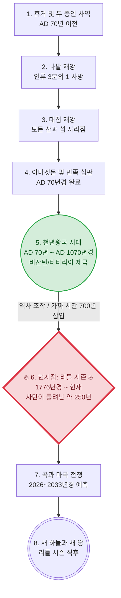

# [2.0]천년왕국 과거 성취설(리틀 시즌) 및 구원론 변질 논쟁 분석 기초 자료 

```
📂 문서 구조 (Table of Contents)
│
├── 1. [분석 대상 요약] 천년왕국 과거 주장 세부 내용 및 타임라인
├── 2. [정통 7천년 경륜설 반론] 천년왕국 과거 주장의 성경적 모순 (14가지)
│   ├── 타임라인 붕괴, 자연계/생태계 모순, 우상 공존 모순
│   ├── 철장 통치·힌놈 골짜기 부재, 에스겔 성전 부재
│   ├── 700년 역사 동시 조작 불가능, 6천년 경륜설 수학적 불일치
│   ├── 곡과 마곡 전쟁의 지리적 범위 오류 (단일 땅 논증)
│   ├── 마귀들의 딜레마 (사탄 단독 작전)
│   └── ⚡ 최종 외통수 (Show me the Bible)
│
├── 부록 1. 고아 기차(Orphan Trains) 및 배추밭 주장
├── 부록 2. 개인적 묵상 모음
├── 부록 3. 역사 왜곡론의 자폭 — 예수님 부활 4대 증거
│
├── A. [구원론] 주여 주여, 한 번 구원 영원한 구원?
│   ├── A.1. 죄(Sin)와 빚(Debt)의 경제적 원리 + sin 447 = blood 447
│   ├── A.2. 기존 대다수 구원론의 혼재된 입장
│   ├── A.3. holle의 반격 — 정말 행위가 필요한가?
│   │   ├── 핵심 1: 심판석은 두 개다
│   │   ├── 핵심 2: 시대별 구원 방식의 변화
│   │   │   └── 🔍 마 24:13 정밀 반박 (끝까지 견디는 자 = 환란기 유대인)
│   │   ├── 핵심 2-B: 선악 분별과 어린아이의 구원 원리
│   │   ├── 핵심 3: 신약 성도의 구원 — 오직 믿음, 취소 불가
│   │   ├── 핵심 4: 자녀의 성장과 차등 보상
│   │   ├── 핵심 5: 시대별 복음의 변화
│   │   ├── 핵심 6: 구원파와의 차이
│   │   ├── 핵심 7: 코브라 뱀신·동성애자도 구원받는가?
│   │   ├── 핵심 8: 음모론 안 하면 다 삯군인가?
│   │   ├── 핵심 8-B: 복음 전파의 지혜 (파수꾼과 전령의 조화)
│   │   └── 핵심 9: OSAS는 구원파냐? — 결정적 차이
│   │       └── 🔍 히 6:4-6 정밀 반박 (맛본 것 ≠ 거듭남, 수신자 다름)
│   ├── A.4. 최후의 선택 — 갈 1:8-9 저주 선언
│   └── ⚡ 최종 반격 — 예수님의 의를 깎아내리지 말라 (케이크 비유)
│
├── B. 구원의 확실성 — 성경이 직접 선언하는 7대 증거
│   ├── 📌 1. 하나님의 사랑으로부터 분리 불가 (롬 8:39)
│   ├── 📌 2. 아무도 빼앗아 내지 못함 — 이중 보호 (요 10:28-29)
│   ├── 📌 3. 성령으로 인장 — 취소 불가 (엡 1:13)
│   ├── 📌 4. 이미 하나님의 아들들 (요일 3:2)
│   ├── 📌 5. 버림받은 자들이 아님 (고후 13:6)
│   ├── 📌 6. 하나님의 성전·그리스도의 지체 (고전 3:16)
│   └── 📌 7. 약속하신 분은 신실하시다 (히 10:23)
│
├── C. [부록] 구원론 4대 진영별 비교 분석 (A~D 그룹)
│   ├── 🔵 A그룹: IFB/Free Grace (오직 믿음 + OSAS)
│   ├── 🟢 B그룹: 장로교/개혁주의 (오직 믿음 + 열매 + OSAS)
│   ├── 🟤 C그룹: 웨슬리안 (선재적 은혜 + 구원 상실 가능)
│   ├── 🟠 D그룹: KS구원관 (믿음 + 인내 + 순종)
│   ├── 📊 종합 비교표: 4대 진영 한눈에 보기
│   ├── ⚔️ 교차 분석: A 강화 6가지 논증 + 구원 난이도 순위
│   ├── 📖 결정적 증거: 하나님의 보편적 구원 의지 (딤전 2:4 등)
│   └── 📝 비고: 핵심 용어 해설 + 비유
│
├── 🎯 최종 발언
│
└── ❓ FAQ: 자주 묻는 질문 및 반론에 대한 변증
    ├── 1. 세대주의와 구원 방식에 대한 오해
    ├── 2. 구원과 죄의 열매 (거짓 믿음에 대한 행위 구원론적 정죄)
    └── 3. "바늘귀를 통과하는 낙타"와 구원의 난이도
```

## 1. [분석 대상 요약] 천년왕국 과거 주장(리틀 시즌) 세부 내용 및 타임라인

이들의 주장을 종합하면 아래와 같은 독자적인 타임라인과 역사관을 제시하고 있습니다.

### 📌 천년왕국 과거 주장 측이 상정하는 타임라인 시각화



| 순서 | 성경적 사건 | 추정 연도 | 천년왕국 과거 주장의 해석 및 내용 |
| :--- | :--- | :--- | :--- |
| **1~4** | 환난과 심판 | **AD 70년경 완료** | 휴거, 나팔/대접 재앙, 아마겟돈 심판이 **이미 1세기 로마 시대 즈음(AD 70년 예루살렘 멸망 등)에 모두 일어났다**고 해석함. |
| **5** | 천년왕국 | **AD 70년 ~ 1070년경** | 예수님과 부활한 성인들이 다스리던 1,000년의 통치 기간이 **이미 과거(비잔틴/타타리아 제국 등)에 성취되고 끝났다**고 해석함. |
| **-** | **역사 조작 (가짜 시간)** | **1070년경 ~ 1770년경** | 천년왕국 종료 후, 사탄 세력이 예수님의 재림이 실패한 것처럼 사람들을 속이기 위해 역사에 약 **700년의 가짜 시간(Phantom time)**을 삽입하여 연도를 조작했다고 주장함. |
| **6** | **리틀 시즌 (현재)** | **1776년경 ~ 현재** | 역사가 조작된 이후 사탄이 무저갱에서 풀려나 세상을 완전히 리셋한 **'리틀 시즌(약 250년)'이 바로 현재 우리가 사는 시대**라고 주장함. |
| **7~8** | 최후의 심판 | **2026~2033년경 예측** | 이 리틀 시즌이 끝나는 시점에 곡과 마곡 전쟁이 일어나고 곧바로 새 하늘과 새 땅이 열릴 것이라는 **시한부 종말론**적 관점을 제시함. |

### 🗣️ 세부 주장 내용 총정리 (표)

| 분류 | 주장하는 근거 (키워드) | 상세 내용 |
| :--- | :--- | :--- |
| **성경적 근거** | 예수님 재림의 임박성 약속 | 예수님은 "속히 오리라"(계 22:20), "이 세대가 지나가기 전에"(마 24:34), "죽기 전에 인자가 그분의 왕국에 임하는 것을 볼 자들도 있느니라"(마 16:28)라고 말씀하셨으며, 이는 미래가 아닌 1세기 당대에 재림과 천년왕국이 성취되었음을 의미한다고 해석함. |
| | 예수를 찌른 자의 목격 | "그를 찌른 자들도 볼 것이요"(계 1:7)라는 구절을 근거로, 십자가에서 예수님의 옆구리를 찌른 로마 병사도 재림을 보아야 하므로 당대에 재림이 일어났음을 증명한다고 주장함. |
| | 144,000명의 성도들 | 요한계시록(계 7:4, 계 14:1)에 등장하는 144,000명은 미래의 인물이 아니라, 과거에 이미 사라진 지파(시므온 지파 등)에서 하나님의 인장을 받아 천년왕국 때 부활하여 예수님과 함께 세상을 통치한 성인들이라고 해석함. |
| | 고전 15:25 및 부활·심판의 과거 성취 | "모든 원수를 발아래 두실 때까지 통치하셔야 하리라"(고전 15:25)는 구절을 과거 천년왕국으로 해석하며, 여섯째 나팔에 이미 죽은 자의 부활과 공중 심판이 모두 완료되었다고 주장함. |
| | 7천년 경륜설의 변형 (6천년 새창조) | 정통 7천년 경륜설(6천년 인류 역사 + 1천년 왕국)을 비틀어, 6일 창조를 '천년왕국이 포함된 인간 역사 6000년(새창조)'으로 압축하고, 7일째 안식은 사탄이 심판받은 후인 요한계시록 21:4의 '새 하늘 새 땅(영원한 안식)'이라고 주장함. |
| | 구약의 천년왕국 예언 배제 (계시록 국한설) | 천년왕국의 물리적 통치 형태는 오직 '요한계시록 20장'에만 나올 뿐이며, 구약(이사야, 에스겔 등)에 기록된 동물 생태계의 평화나 물리적 거대 성전 등을 천년왕국에 적용하는 것은 지어낸 이야기라고 극구 부인함. |
| **자연현상 및 우주론 해석** | 계시록 9장 '화산 폭발' 해석 | 입에서 불과 연기와 유황을 뿜는 2억 기병대(계 9:17-18)를 '활화산 폭발'로 해석함. 로마 시대에는 화산(Volcano)이라는 단어조차 없었으며, 이 화산 폭발 용암(머드 플러드)이 도시를 덮어 세상을 리셋시켰다고 주장함. |
| | 계시록 16장 대륙 이동(판게아) | 대접 재앙으로 일어난 전무후무한 큰 지진(계 16:18-20)으로 인해 원래 하나였던 거대한 원형 대륙이 쪼개져 오늘날의 대륙들로 나뉘었다고 주장함 (피라미드가 전 세계에 분포하는 이유). |
| | 은하수(Milky Way) 상처설 | 하늘의 은하수는 우주가 아니라 궁창(Firmament)에 새겨진 거대한 상처이며, 이것이 심판(혹은 궁창의 파괴)의 물리적 흔적이라고 주장함. |
| **문화적 증거** | 찬송가 '기쁘다 구주 오셨네' | "죄와 슬픔 사라지고 가시가 없도다"(찬송가 115장)라는 가사는 단순한 상징이 아니라 천년왕국이 지상에 강림했을 때 고통과 죽음이 사라진 유토피아적 현실을 묘사하고 부른 노래라고 해석함. |
| **건축 및 물리적 증거** | 불가사의한 거대 건축물 | 웅장한 건축물들은 현대 기술이나 당시 망치와 마차로는 지을 수 없으며, 모두 천년왕국 시절 지어진 건물들임. |
| | 부엌과 화장실의 부재 | 천년왕국 시절 부활한 사람들은 먹고 배설할 필요가 없었기 때문에, 고대 거대 건물들에는 부엌과 화장실이 없음. |
| | 치유의 종(Bell) 파괴 | 과거의 종소리는 영육을 치유하는 주파수 기능을 가졌으나, 사탄 세력이 무기를 만든다는 핑계로 종들을 파괴하고 흔적을 지움. |
| | 우상 건축물의 천년왕국 공존설 | 전 세계의 불상이나 이교도 신전들이 리틀 시즌(최근 250년)에 조작/급조되었거나, 혹은 "천년왕국 때 예수님이 우상을 모두 부순다는 구절이 없다"며 우상 건축물이 거룩한 통치 기간에도 공존했다고 주장함. |
| | 텅 빈 도시 사진 | 1800년대 초기 텅 빈 도시 사진이나 웅장한 건물 앞에 마차를 모는 사람들의 사진은, 천년왕국 성도들이 떠나버리고 리셋된 빈 도시에 노동력들이 유입된 증거임. |
| **연도 및 역사 조작** | 비잔틴 제국 = 천년왕국 | 로마 제국 멸망 후 약 1000년간 이어진 '비잔틴 제국(신정정치)' 시대가 바로 예수님이 철장으로 다스리던 1,000년의 천년왕국이었다고 주장함 (테오도시우스 법전 등). |
| | 타타리아 제국과 거인(성도) | 과거 전 세계에 실존했던 거대한 '타타리아(Tartaria)' 제국이 천년왕국이었으며, 당시 통치하던 성도들은 키가 2~3미터에 달하는 거인이었으나 사탄의 역사 조작으로 흔적이 지워졌다고 주장. |
| | 250년 리틀 시즌 (Little Season) | 요한계시록 20:3에 사탄이 잠시 풀려난다는 '리틀 시즌'의 기간을 약 250년으로 설정하며, 이 250년 동안 세상이 완벽하게 리셋되었다고 주장함. |
| | 가짜 시간 삽입 | 천년왕국이 끝났음에도 사탄 세력이 재림이 없었던 것처럼 속이기 위해 역사에 700년 이상의 가짜 시간을 끼워 넣어 역사를 뻥튀기함. |
| | 모든 성경적·역사적 연대 기준 부정 | 자신들의 '리틀 시즌 250년 + 가짜 시간 700년' 주장이 전체 6천년 타임라인에 턱없이 모자란다는 수학적 모순이 지적되자, 아담부터 예수님까지의 성경 족보 4000년 역사나 현재 연도(2026년)마저 "사탄이 만든 세상의 공식"이라며 극단적으로 부정함. |
| | 1800년대 고아 열차 | 1800년대 중반 수십만 명의 아이들을 강제로 기차에 태워 이주시킨 사건은 리셋된 빈 도시에 노동력을 채우기 위함이었음. |
| **사탄이 풀려난 징후** | 자유의 여신상 끊어진 사슬 | 1776년 세워진 자유의 여신상은 빛을 전달하는 루시퍼를 상징하며, 끊어진 쇠사슬은 사탄이 무저갱에서 풀려났음을 자축하는 것임. |
| | 2026~2033년 종말 예측 | 해외 자료를 근거로, 사탄이 풀려난 리틀 시즌의 끝이 2026년~2033년 사이일 것이라며 구체적인 시한부 종말을 설정함. |
| | 가짜 휴거쇼와 외계인(UFO) | 향후 일어날 3차 세계대전이나 외계인(UFO)의 등장은 사탄이 준비한 '가짜 휴거쇼'이며 기독교인들에게 좌절을 주기 위한 홀로그램 미혹이라고 주장. |
| **진실 은폐를 위한 시스템** | 북극 = 예수님의 땅 (예루살렘) | 1500년대 지도에는 북극에 '예수님의 땅'이 있었으나 1700년대 사탄이 지웠으며, 버드 제독이 이를 확인하려다 암살당했고 현재 우주군과 강대국이 북극을 둘러싸고 접근을 막고 있다고 주장. |
| | 1800년대 정신병원 급증 | 천년왕국의 기억을 가지고 있거나 리틀 시즌 전투에서 패배한 사람들을 가둬 뇌를 파괴(로보토미)하기 위해 거대한 정신병원들이 세워짐. |
| | 세대주의 신학 창작 | 존 넬슨 다비, 스코필드 등이 특정 자본의 후원을 받아 '환난 전 휴거설' 등을 전파하여, 성경의 예언을 미래의 사건으로 인식하게 만들었다고 주장함. |
| | 역사서 및 성경 변개 | 에드워드 기번이 '로마 제국 쇠망사'를 통해 역사를 정립했고, 윌리엄 틴데일 성경에 있던 '평평한 지구'와 같은 내용을 킹제임스 성경 등에서 단어를 바꿔 은폐했다고 주장함. |
| | 우주(Space)와 중력의 허구 | 우주와 중력은 존재하지 않으며 지구는 평평하고 단단한 돔(궁창)으로 덮여 있다고 해석함. 관련 우주 기관의 자료는 합성(CGI)이며 대중에게 진실을 은폐하고 있다고 주장함. |
| | 송과체(Pineal Gland)와 빙의 현상 | 요가, 명상 등은 영혼의 자리인 '송과체'를 열어 악령을 빙의시키는 도구이며, 미디어에서 칭송받는 '천재성'은 트랜스휴머니즘 어젠다의 일환이라고 해석함. |
| | 주파수와 에테르(끌어당김) | 세상은 에테르로 가득 차 있으며 내뱉는 말(주파수)이 창조하는 능력이 있다는 '끌어당김의 법칙'을 기독교 신앙과 접목하여 해석함. |
| | 주입식 공교육 시스템 | 학교 시스템을 통해 진화론과 우주론(빅뱅)을 주입하여 본래의 역사와 진실에 다가가는 사고 능력을 차단했다고 주장함. |
| | 주류 역사와 정치 통제 (Deep State) | 주류 역사는 통제된 결과물이며, 정치적 대립(우파/좌파)이나 유명 정치인조차 특정 세력(딥스테이트, 프리메이슨 등)이 조종하는 통제 시스템이라고 해석함. |
| | 기성 교회와 십일조 부정 | 대형 교회 등 기성 종교 시스템 역시 특정 세력이 통합하려는 뉴월드오더(NWO)의 일부로 간주하며, 강한 반교회 및 무교회주의적 관점을 보임. |

> **⚠️ 신학적 분석 결과: 구원론의 변동 (행위구원론으로의 귀결)**
> 천년왕국이 지났고 현재가 사탄이 풀려난 시대라고 규정할 경우, 논리적으로 "은혜와 믿음으로 구원받는 교리"가 약화되고 "생명책에서 지워지지 않기 위해 행위가 수반되어야 한다"는 행위구원론적 관점으로 전환될 수밖에 없는 구조적 한계를 가짐.

---

## 2. [정통 7천년 경륜설(전천년설) 반론] 천년왕국 과거 주장의 성경적 모순

1. **타임라인의 붕괴 (산과 섬의 모순):**
   - 천년왕국 과거 주장 타임라인에 따르면 천년왕국 전에 이미 대접 재앙으로 **"모든 섬이 사라지고 산들도 보이지 아니하더라(계 16:20)"**가 성취되었어야 함. 
   - 그렇다면 현재 지구상에 존재하는 수많은 산과 섬들은 도대체 언제, 어떻게 다시 생겨난 것인가?

2. **자연계/생태계의 모순 (코카트리스와 맹수의 본성 귀환):**
   - 이사야서(11:7-8) 예언에 따르면 천년왕국 때는 사자가 소처럼 풀을 먹고, 사자와 곰이 아이들과 함께 놀며, 젖 먹는 아이가 독사(코카트리스/뱀)의 구멍에서 장난을 쳐도 물지 않는 완벽한 평화의 상태가 됩니다.
   - 천년왕국이 이미 지나갔다면, **사자와 곰이 다시 인간을 찢어 죽이는 맹수로 돌아가고 뱀이 다시 독을 품게 되었다는 성경 기록은 어디에 있는가?** 

3. **건축물 연대와 우상 공존의 모순:**
   - 1200년 전 지어진 불국사, 석굴암, 혹은 팔만대장경 같은 우상숭배 유적들이 천년왕국 시대(예수님과 성도들의 통치 기간)에 공존했다는 것은 완벽한 모순임. 
   - 천년왕국 과거 주장 측은 전 세계의 모든 역사가 250년 리틀 시즌 동안 날조되어 우상들이 급조되었거나, 혹은 "성경에 천년왕국 때 우상을 없앤다는 구절이 없다"며 우상 건축물이 예수님 통치 시대에도 존재할 수 있다고 변명함.
   - 그러나 성경은 메시아의 통치(천년왕국) 기간에 우상이 완전히 멸절될 것을 명백히 선언하고 있음:
     * **이사야 2:18** "우상들은 그가 완전히 멸하시리라." (And the idols he shall utterly abolish.)
     * **스가랴 13:2** "만군의 주가 말하노라. 그 날에 내가 그 땅에서 우상들의 이름을 끊어... 다시는 기억되지 아니하게 할 것이요..."
   - 예수님께서 철장으로 전 세계를 직접 다스리시는 거룩한 신정 국가에 부처상이나 이교도 신전이 버젓이 세워져 공존할 수 있다는 주장은 성경을 정면으로 부정하는 것임.

4. **나무처럼 오래 살았던 인류의 증발:**
   - 이사야서(65:22) 예언에 따르면 천년왕국 백성의 수명은 "나무의 수명"과 같이 길어집니다(약 1,000년). 
   - 천년왕국 기간 동안 나무처럼 오래 살며 번성했던 인류는 천년왕국 이후 도대체 어디로 증발했는가? 인간의 수명이 다시 단축되었다는 기록은 성경 어디에도 없음.

5. **철장 통치와 눈에 보이는 지옥(힌놈의 골짜기)의 부재:**
   - 천년왕국은 예수님께서 예루살렘에서 전 세계를 **"철장(Rod of iron)"**으로 엄격하게 다스리시는 시대입니다(시 2:9, 계 19:15). 이 기간 동안 반역하는 자는 즉각적인 심판을 받습니다.
   - 이사야서(66:23-24)에 따르면, 예루살렘으로 경배하러 온 자들은 밖으로 나가 주께 범죄한 자들의 시체들이 불타는 것을 직접 보게 됩니다. KJV 독립침례교회 등 전통적 세대주의 신학에서는 이 장소가 예루살렘 밖 **'힌놈의 골짜기(게헨나)'**이며, 천년왕국 시대 지상에 입을 벌리고 있는 가시적인 지옥(꺼지지 않는 불과 죽지 않는 벌레)이라고 해석합니다.
   - 즉, 천년왕국 시대에는 반역자들을 향한 가시적인 심판의 현장이 예루살렘 근처에 존재하여 모든 육체가 이를 목격해야 합니다. 천년왕국이 이미 지나간 과거라면, 이 뚜렷한 지리적·물리적 심판의 흔적은 도대체 어디로 사라졌는가?
   - **[보충 — "새 하늘 새 땅이니 영원한 상태 아니냐?"는 반론에 대하여]**: 이사야 66:22에 "새 하늘과 새 땅"이 언급된다는 이유로, 66:23~24의 힌놈 골짜기 장면이 천년왕국이 아닌 영원한 상태를 묘사한다는 반론이 있습니다. 그러나 이사야 65~66장이 영원한 상태가 아닌 **천년왕국을 묘사함**은 이사야 65:20 한 구절로 결정됩니다:
     > **사 65:20 (KJV):** *"for the child shall die an hundred years old; but the sinner being an hundred years old shall be accursed."*
     > **한글:** *"백 살에 죽는 자가 있고 백 살 된 죄인은 저주를 받을 것이니라."*

     이사야 65:20에는 **죽음과 죄인이 명시적으로 존재**합니다. 그런데 요한계시록 21:4은 새 하늘 새 땅에서 **"사망이 다시 있지 아니하리라(there shall be no more death)"**고 선언합니다. 두 본문을 대조하면:

     | 구분 | **이사야 65~66장** | **요한계시록 21~22장** |
     |:---|:---:|:---:|
     | 죽음이 있는가? | ✅ **있다** (사 65:20) | ❌ 없다 (계 21:4) |
     | 반역자·죄인이 있는가? | ✅ **있다** (사 66:24) | ❌ 없다 (계 21:27) |
     | 월삭·안식일 예배가 있는가? | ✅ **있다** (사 66:23) | ❌ 언급 없음 |
     | **묘사하는 시대** | **천년왕국** | **영원한 상태** |

     즉, **이사야의 "새 하늘 새 땅" = 천년왕국의 갱신된 지구**이고, **요한계시록의 "새 하늘 새 땅" = 천년왕국 이후 영원한 상태**입니다. 같은 표현을 사용하지만 두 본문이 가리키는 시대가 다릅니다. 죽음이 여전히 존재하는 이사야 65~66장은 천년왕국을 묘사하고 있으며, 따라서 이사야 66:23~24의 힌놈 골짜기 심판 장면 역시 천년왕국의 물리적 현실입니다.

6. **에스겔 성전과 천년왕국 거대 도성(여호와 삼마)의 물리적 부재:**
   - 에스겔서(40~48장)는 천년왕국 시대에 예루살렘과 그 주변에 세워질 거대한 성전과 도성의 크기를 수백 개의 구절에 걸쳐 정밀하게 측량하여 기록하고 있습니다.
   - 이 성읍(도성)의 크기는 사방이 각각 4,500갈대(약 15km)인 거대한 정사각형이며, 12지파의 이름을 딴 12개의 대문이 있고, 그 도성의 이름은 **'여호와 삼마(Jehovah-shammah, 주께서 거기 계시다)'**라고 불립니다(겔 48:30~35).
   - 또한, 에스겔 47장과 스가랴 14장에 따르면 성전 문지방에서 생수의 강이 흘러나와 사해(Dead Sea)로 들어가며, 죽음의 바다였던 사해가 치유되어 엔게디에서부터 그물을 치고 어부들이 수많은 물고기를 잡게 되는 엄청난 지형적·생태계적 변화가 일어납니다.
   - 천년왕국이 과거(비잔틴/타타리아 제국 등)에 이미 이루어졌다면, 예루살렘에 건설되었어야 할 이 거대한 정사각형의 '여호와 삼마' 도성(약 15km 규모)의 흔적은 어디로 갔으며, 생수의 강물로 인해 수많은 고기가 살게 된 사해의 지리적 증거는 왜 전혀 존재하지 않는가?

7. **전 세계 역사 동시 조작(700년 삭제)의 논리적·현실적 불가능성:**
   - 저들은 사탄이 세상을 리셋하고 이른바 '팬텀 타임(약 700년)'을 지워버렸다고 주장하지만, 이는 전 세계 역사 기록의 교차 검증 관점에서 완벽히 불가능합니다.
   - 단적인 예로, 우리나라만 해도 신라, 통일신라, 고려, 조선으로 끊어지지 않고 이어지는 명확한 왕족의 계보(몇 대손)와 방대한 역사서, 문헌, 문화유산이 존재합니다. 더욱 중요한 것은 이 기록들이 한국에만 고립된 것이 아니라, 동시대의 중국, 일본 등 수많은 주변국들의 역사서와 **상호 교류(사신 파견, 무역, 서신 교환, 전쟁 등) 기록으로 거미줄처럼 연결되어 서로의 역사를 톱니바퀴처럼 증명**하고 있다는 점입니다.
   - 따라서 역사에서 700년을 통째로 지우거나 조작하려면, 지구상의 어느 한 나라가 아니라 **전 세계 모든 국가의 독자적인 역사서, 왕족 계보, 문헌, 타국과의 외교 기록들을 단 하나의 모순도 없이 동시에 완벽하게 위조하고 입을 맞춰야만 가능**합니다. 이는 물리적으로나 상식적으로 절대 불가능한 음모론적 상상에 불과합니다.

8. **'6천년 경륜설'과의 연대기적 불일치와 분석적 모순:**
   - **타임라인 공백이 발생하는 근본 원인:** 
     정통적인 '7천년 경륜설'은 **6일 창조(6000년 인간 역사) + 7일째 안식(미래 천년왕국 1000년)**으로 구성되어 정확히 7000년이 맞아떨어집니다. 
     반면, 과거 성취 주장 측은 이 개념을 재해석하여, **천년왕국(1000년)을 7일째 안식이 아닌 앞선 6일(6000년)의 인간 역사 안에 포함시키는 새로운 가설을 적용**했습니다 (그리고 7일째 안식은 사탄 심판 후 영원한 상태라고 설명합니다). 
     또한, 현재 시점을 '리틀 시즌 250년'의 끝자락으로 맞추기 위해 **중세 역사 약 700년을 사탄이 만든 가짜 시간(Phantom Time)으로 간주하여 연대 계산에서 배제**합니다. 이처럼 천년왕국을 6000년 역사에 포함시키고 700년의 시간을 제외하는 구조적 특징 때문에, 결과적으로 6000년을 채우기에는 시간적 공백이 발생하게 됩니다.

   - **수학적 불일치 (타임라인 합산):** 
     이들의 주장을 연대기에 대입해 세부 수식으로 합산해 보면 다음과 같은 거대한 시간적 공백이 수치로 증명됩니다.
     * **[기독교 전통 연대기 기준 타임라인 분해]**
       `구약 역사(약 4000년) + AD 70년까지(70년) + 과거 천년왕국(1000년) + 사탄이 풀려난 리틀 시즌(약 250년) = 실제 경과 시간 약 5320년`
       *(사탄이 역사에 조작해 끼워넣었다는 '가짜 시간 700년'은 허구이므로 제외)* 
       **결과:** 6000년에 도달하려면 약 680년이 부족함.
     * **[현재 유대력 대입 시]**
       `현재 유대력(5786년) - 사탄의 가짜 시간(700년) = 실제 경과 시간 5086년`
       **결과:** 6000년에 도달하려면 약 914년이 부족함.
     결과적으로 과거 1천 년의 통치 기간을 세부적으로 합산해 주더라도, 본인들이 주장하는 '6000년 타임라인(리틀 시즌 종료)'에 도달하려면 최소 680년 이상이 턱없이 모자라게 됩니다.

   ### 📊 타임라인 구조 비교 (정통 경륜설 vs 과거 성취설의 수학적 모순)

   ```mermaid
   flowchart TD
       subgraph sg1 [정통 7천년 경륜설]
           direction TB
           A1[구약 역사<br>AD 1년까지<br>⏳ 누적: 4000년] --> A2[신약/교회 시대 전반<br>AD 1~1000년<br>⏳ 누적: 5000년]
           A2 --> A3[신약/교회 시대 후반<br>AD 1000~2000년<br>⏳ 누적: 6000년]
           A3 --> A4((6000년 인간 역사 완료))
           A4 --> A5[7일째 안식: 미래 천년왕국<br>1000년 통치<br>⏳ 누적: 7000년]
           
           style A1 fill:#e2f0d9,stroke:#548235
           style A2 fill:#e2f0d9,stroke:#548235
           style A3 fill:#e2f0d9,stroke:#548235
           style A4 fill:#c6e0b4,stroke:#385723,stroke-width:2px
           style A5 fill:#fff2cc,stroke:#d6b656,stroke-width:2px
       end

       subgraph sg2 [천년왕국 과거 성취설]
           direction TB
           B1[구약 역사<br>AD 1년까지<br>⏳ 누적: 4000년] --> B2[초대교회 + 과거 천년왕국<br>AD 1~1070년<br>⏳ 누적: 약 5070년]
           B2 -. 가짜 역사 배제 .-> B3[팬텀 타임 700년<br>역사에서 통째로 지워짐<br>⏳ 계산에서 제외됨]
           B3 --> B4[사탄의 리틀 시즌<br>1776~2026년, 약 250년<br>⏳ 누적: 약 5320년]
           B4 --> B5{{합산: 약 5320년<br>6000년 도달 실패!}}
           
           style B1 fill:#fce4d6,stroke:#c55a11
           style B2 fill:#fff2cc,stroke:#d6b656,stroke-width:2px
           style B3 fill:#ededed,stroke:#7f7f7f,stroke-dasharray: 5 5
           style B4 fill:#f8cbad,stroke:#c55a11
           style B5 fill:#ffcccc,stroke:#ff0000,stroke-width:3px
       end
   ```

   **💡 [참고] 마크다운 표(Table)로 한눈에 보는 요약**
   
   | 경과 시간축 | ❌ 천년왕국 과거 성취설 (6000년 도달 실패) | ✅ 정통 7천년 경륜설 (정확히 7000년 충족) |
   | :---: | :--- | :--- |
   | **4000년** | **구약 역사** (약 4000년) | **구약 역사** (약 4000년) |
   | **5000년** | **초대교회 + 과거 천년왕국** (AD 1~1070년)<br>*(여기서 천년왕국이 끝남)* | **신약/교회 시대 전반** (AD 1~1000년) |
   | **(팬텀 타임)** | 🔻 **팬텀 타임 700년**<br>*(사탄의 가짜 역사라며 계산에서 통째로 삭제됨)* | **신약/교회 시대 후반** (AD 1000~2000년) |
   | **6000년** | **사탄의 리틀 시즌** (1776~2026년, 약 250년)<br>🚨 **합산: 약 5320년 (약 680년 공백 발생!)** | 🟢 **6000년 인간 역사 완료** |
   | **7000년** | *(설명 불가 / 타임라인 붕괴)* | **7일째 안식: 미래 천년왕국** (1000년 통치) |

   - **연대 기준 부정에 따른 분석적 딜레마:** 이러한 연대기적 모순에 대해, "아담부터 예수님까지의 4000년 연대기 역시 세상의 계산법이므로 신뢰할 수 없다"고 방어하는 것은 분석적으로 심각한 딜레마를 초래합니다.
   - **모순적 결론:** 역사적 시간의 기준점(성경 족보 연대 및 현행 연도) 자체를 신뢰할 수 없는 허구라고 규정하게 되면, 본인들이 강력하게 주장하는 '1776년 리틀 시즌의 시작'이나 '2026~2033년경의 종말 예측'과 같은 특정한 연도 계산 역시 아무런 기준과 근거를 가질 수 없게 됩니다. 즉, 시간의 잣대를 부정함으로써 스스로의 주장을 지탱할 연대기적 기반마저 해체하는 논리적 모순에 빠지게 됩니다.

9. **천년왕국 성도들의 행방 불명과 계시록 20:9의 물리적 모순 (곡과 마곡 전쟁의 지리적 '범위 오류'):**
   - 천년왕국 과거 성취론 측은 "텅 빈 고대 도시" 사진을 근거로 삼으며, 1000년 통치 기간이 끝난 후 성도들이 어딘가로 떠나버리고 사탄이 리셋한 세상에 새로운 노동력(고아 등)이 유입되었다고 주장합니다.
   - 그러나 성경은 요한계시록 20:9에서 사탄이 풀려나 곡과 마곡을 미혹하여 전쟁을 일으킬 때, 그 적들이 **"성도들의 진영과 그 사랑받는 도성(the camp of the saints about, and the beloved city)을 에워싸매 하늘에서 하나님으로부터 불이 내려와 그들을 삼켰다"**고 명확히 기록하고 있습니다.
   - 즉, 사탄이 풀려나 적들을 모을 때 예수님과 거룩한 성도들은 어딘가로 사라진 것이 아니라, **여전히 지상에 있는 '그 거룩한 도성' 안에 머물며 진영을 갖추고 있었습니다.** 성도들이 도시를 버리고 떠났다거나, 텅 빈 도시에 사탄이 새 인류를 채워 넣었다는 주장은 계시록 20장 9절 말씀과 정면으로 배치됩니다.
   
   - **[범위 오류 심층 분석 1] 성도들의 물리적 진영은 어디인가?**
     지금 전 세계가 둥근 지구 우주론이나 코로나 같은 전 지구적 통제 시스템으로 속고 있는 상황이라면, 이 거대한 기만의 최종 목적은 지상에 남은 성도들의 거처를 멸절시키는 것입니다. 그렇다면 현재 이 지표면 위에서 곡과 마곡의 군대가 총구를 겨눌 그 물리적 성읍은 어디에 실재합니까? 이 범위가 증명되지 않으면 과거 성취론의 타임라인은 완성될 수 없습니다.
   
   - **[범위 오류 심층 분석 2] 온 세상(Whole World)과 사방(Four Quarters)의 차이:**
     성경은 마귀가 기만하는 범위를 두 가지 차원으로 명확히 구분합니다. 계시록 12장과 계시록 20장의 차이를 보면 '사방'에 있는 사탄의 군대인 '곡과 마곡'의 정체가 뚜렷해집니다. "땅의 사방에 있는 민족들 곧 곡과 마곡"에서 '곡과 마곡'은 특정 국가(아시아나 미국 등)를 뜻하는 것이 아니라, 사방에서 사탄의 미혹에 넘어간 반역 군단의 총칭(동격)입니다.
     
     | 구분 | 계시록 12:9 (마귀의 상시 사역) | 계시록 20:8 (리틀 시즌의 사건) |
     | :--- | :--- | :--- |
     | **성경 표현** | "온 세상(the whole world)을 속이는 자" | "지구의 사방(four quarters of the earth)에 있는 민족들" |
     | **원어적 의미** | **오이쿠메네(οἰκουμένη)**: 정치, 문화, 교육 등 인간이 구축한 '문명권/시스템' 전체 | **게(γῆ)**: 흙, 토양 등 물리적인 지표면 그 자체를 4등분(Quarters)한 거대한 물리적 영역 |
     | **미혹의 성격** | 보이지 않는 영적, 사상적, 시스템적 기만 (예: 거짓 지리관 등 주입) | 물리적 군사 집결을 위한 구체적 선동 (외곽 지역에 흩어진 반역 세력 소집) |
     | **목표 지점** | 인류 전체의 영혼과 생각 장악 | 지표면 끝단에서부터 중심(예루살렘, 성도들의 진영)을 향해 진격 |
     
   - **[범위 오류 심층 분석 3] 성경적 지리관: 갈라진 땅과 천년왕국의 에덴 회복 (단일 땅)**
     과거 성취론 측은 계시록 16장의 재앙 때 땅이 나뉘었다고 주장하나, 성경 자체의 텍스트는 지형의 분리와 천년왕국의 물리적 지형 회복을 아주 명확하게 기록하고 있습니다. 장차 올 진짜 천년왕국은 지금과 같은 분열된 지형이 아니라 에덴동산처럼 회복된 '단일 땅'이 되어야 합니다.
     1. **태초의 땅은 원래 '하나(단일 땅)'였다:** 창세기 1:9 (KJV) "하늘 아래의 물들은 **한 곳으로(unto one place)** 함께 모이고 마른 육지는 드러나라." 바닷물이 한 곳으로 모였다는 것은 마른 육지 역시 쪼개지지 않은 거대한 '하나의 단일 땅'이었음을 뜻합니다.
     2. **땅이 갈라진 명확한 성경적 시점 (홍수와 벨렉):** 창세기 10:25 (KJV) "...그의 이름은 벨렉(Peleg)이라 하였으니 이는 그의 날들에 **땅이 나뉘었기(the earth was divided)** 때문이더라." 즉, 하나였던 에덴의 지형이 심판의 결과로 지금처럼 찢어진 것은 노아의 홍수 직후인 '벨렉의 때'에 이미 발생했습니다. 지금 우리가 사는 세상은 천년왕국이 아니라 노아의 자손들 때 땅이 나뉜 그 징벌적 지형 그대로 유지되고 있는 상태입니다.
     3. **천년왕국, 쪼개진 지형의 물리적 연결과 회복 (에덴으로의 귀환):** 참된 천년왕국은 지금처럼 쪼개진 고립된 대륙 구조로 예수님이 통치하시는 것이 아니라, 지형 자체가 다시 하나로 묶이는 대격변(회복)을 동반합니다. 
        - **이사야 11:15-16:** "주께서 이집트 바다의 혀를 완전히 멸하시고... 강 위로 손을 흔드사 강을 쳐서 일곱 갈래로 나누어 사람들이 신을 신은 채 건너가게 하시리라... 남은 자들을 위하여 **대로(highway)**가 있게 하시리니"
        - **이사야 40:4:** "모든 골짜기가 돋우어지며 모든 산과 작은 산이 낮아지고 구부러진 곳이 곧게 되며 험한 곳이 평탄하게 될 것이요"
        - **이사야 51:3:** "주가 시온을 위로하되... 그녀의 광야를 **에덴같이**, 그녀의 사막을 **주의 동산같이** 만들리니"
     4. **결론 및 곡과 마곡 전쟁의 지리적 완성:** 천년왕국 때는 대륙을 가로막던 바다와 강이 마르고 대로(Highway)가 생기며 지형이 평탄해집니다. 이는 예루살렘을 중심으로 모든 민족이 육로로 연결되는 거대한 '단일 땅(에덴동산 구조)'의 회복을 의미합니다. 
        이 지리적 회복은 요한계시록 20:9의 곡과 마곡 전쟁 장면을 물리적으로 가능하게 하는 핵심 퍼즐입니다. 성경은 마귀의 군대가 **"땅의 사방(four quarters)"**에서 출발하여 **"땅의 넓은 곳(breadth of the earth)으로 올라가서"** 예루살렘(사랑받는 도성)을 포위한다고 기록합니다. 바다로 단절된 현재의 쪼개진 대륙 지형에서는 전 세계 군대가 이처럼 일제히 육로를 통해 사방에서 예루살렘을 둥글게 에워싸며 직격해 들어오는 진격 루트가 성립되지 않습니다. 이는 바다와 산이 평탄해지고 사방이 대로(Highway)로 뻥 뚫린 천년왕국의 광활한 '단일 땅'에서만 가능한 웅장한 포위전입니다. 
        지금이 참된 천년왕국 이후라면, 동서남북 사방에서 예루살렘을 육로로 포위할 수 있었던 이 회복된 단일 땅은 도대체 어디로 사라졌습니까?

10. **마귀들(사탄의 천사들)의 딜레마 — '구약 배제'가 폭로하는 과거 성취론의 자가당착 (TYPE-O):**
   - 요한계시록 20장에는 결박 대상이 **"그 용 곧 옛 뱀이요 마귀요 사탄인 자"** 단수(Satan) 한 명으로만 기록되어 있습니다(계 20:1-3).
   - 반면 정통 신학은 **이사야 24:21-22**(높은 곳의 영적 군대들이 감옥에 갇힘)나 **스가랴 13:2**(더러운 영이 땅에서 떠남) 등 구약 예언을 통합하여, 진짜 천년왕국 시대에는 사탄뿐만 아니라 타락한 천사들과 마귀들도 철저히 결박되고 쫓겨남을 증명합니다.

   - 아래 표는 성경 전체에서 사탄과 마귀들의 관계를 시점별로 정리한 구조 분석입니다.

   | 시점 | 사탄 상태 | 마귀들 상태 | 성경 근거 |
   | :--- | :--- | :--- | :--- |
   | **천지창조 ~ 예수 사역** | 자유 | 자유 | 복음서 전체 귀신 축출 사건들 |
   | **7년 대환난** | 자유 + 하늘에서 땅으로 추방 | 자유 (역대 최고 활성화) | 계 9, 12, 16장 |
   | **아마겟돈** | 미체포 | 언급 없음 (짐승/거짓선지자만 불못으로) | 계 19:19-21 |
   | **⚠️ 천년왕국 1,000년** | **무저갱 결박** | **감옥에 갇힘 / 땅에서 쫓겨남** | 계 20:1-3, 사 24:22, 슥 13:2 |
   | **⚠️ 곡과 마곡 미혹** | **단독 출소 · 단독 작전** | **동행 기록 없음 (사탄 혼자 미혹)** | 계 20:7-10 |
   | **백보좌 심판** | 불못 투하 | "사망과 음부"가 불못 투하 (마귀들 포함 추정) | 계 20:10, 14 / 마 25:41 |

   - **⛔ 함정 1 — "리틀 시즌" 사탄 단독 작전과 철장 통치의 연관성:**
     천년왕국이 끝난 후 사탄이 풀려나 곡과 마곡을 미혹할 때, 성경은 사탄이 **혼자서(Satan shall be loosed... and shall go out)** 단독으로 이 일을 행한다고 기록합니다(계 20:7-8).
     계시록 19장의 아마겟돈 전쟁 때는 짐승과 거짓 대언자 등 마귀 군단이 총동원된 물리적 충돌이었습니다. 그러나 리틀 시즌의 곡과 마곡 전쟁은 사탄 단 한 명이 스피커를 잡고 선동해 내는 전쟁입니다. 어떻게 사탄 혼자서 바다의 모래 같은 거대한 인파를 모을 수 있었을까요?
     그 해답은 천년왕국의 **'철장(Rod of iron) 통치'** 및 예루살렘 밖 **'힌놈의 골짜기'**와의 연관성에서 유추해 보는 것이 합당합니다. 예수님께서 굳이 '철장'이라는 엄격한 통치 수단을 사용하셔야 했던 이유는, 1,000년 동안 모든 인류가 자발적이고 온전히 순종한 것만은 아니었기 때문일 것입니다. 마음속에 죄의 본성과 반역을 품고도, 즉각적인 철장의 심판과 눈앞에서 불타는 힌놈의 골짜기가 두려워 **'억지로 복종하던 자들'**이 다수 존재했을 가능성이 매우 높습니다. 
     사탄은 무저갱에서 나오자마자, 철장 아래 억눌려 있던 인류 내면의 반역 본성을 자극했을 것으로 보입니다. 즉, 곡과 마곡 군대는 외부의 마귀 군단이 아니라, 억지로 순종하던 타락한 인간들이 사탄의 거짓말에 동조하여 자발적으로 반역의 대열에 합류한 결과물로 해석할 수 있습니다.

11. **사해 치유 및 맹수의 본성 귀환에 대한 물리적/성경적 증거 부족:**
   - 에스겔 47장과 스가랴 14장에 명시된 "죽은 바다(사해)에 맑은 생수가 흘러들어가 수많은 고기가 살게 된다"는 구절이 과거에 언제, 어떻게 성취되었으며, 성취되었다면 지금의 사해는 왜 다시 소금물이 되었는지 증명하지 못함.
   - 천년왕국 때 풀을 먹던 사자와 독이 사라진 뱀(사 11:7-8)이 천년왕국 종료 후(리틀 시즌) **어떤 성경 구절(장/절)의 예언에 근거하여 다시 인간을 물어 죽이는 맹수로 돌아가게 되었는지** 명확한 성경적 근거를 제시하지 못함.

12. **영적/비유적 해석으로의 자기모순적 도피:**
   - 15km 거대 도성, 나무 같은 수명, 우상의 파괴, 힌놈의 골짜기 등 위에서 제기된 물리적 사건들을 대답하지 못해 "눈에 보이지 않는 영적인 비유"라고 변명하려 한다면, 이는 본인들이 천년왕국의 물리적 실재(거대 건축물, 타타리아 제국 등)를 그토록 강조해 온 것과 정면으로 모순됩니다. 물리적 증거가 있다고 주장하면서, 설명하지 못하는 부분만 "영적"이라고 해석하는 것은 편의적 이중 잣대이며 완벽한 자기모순입니다.

13. **"천년왕국은 요한계시록에만 나온다"는 구약 예언 배제의 오류:**
   - 이사야, 에스겔 등 구약의 물리적 증거를 제시할 때마다 "계시록 20장에는 '1000년 통치'라는 말만 있을 뿐, 맹수나 우상 이야기는 없다"며 구약의 예언을 배제하려는 것은 심각한 신학적 오류임. 
   - 요한계시록 20장은 구약에서 수백 번 반복 예언된 '메시아 지상 통치 왕국'의 **"지속 기간이 1,000년이다"라는 구체적인 타임라인을 최종 확정해 준 것**일 뿐임. 메시아 왕국의 통치 방식, 생태계 변화, 지형의 변화 등 세부적인 모습은 이미 구약 대언서들에 빼곡하게 완성되어 있음. 구약의 그 모든 예언을 잘라내고 "계시록에 맹수 이야기가 없으니 지어낸 이야기다"라고 주장하는 것은, 성경 전체의 맥락을 부정하는 행위임.

14. **'잠시(A little season)'를 250년으로 설정한 수학적·언어적 모순:**
   - 요한계시록 20:3은 사탄이 천년왕국 후 **"잠시(a little season)"** 풀려난다고 기록합니다. 그러나 과거 성취론자들은 아무 성경적 근거 없이 이 '잠시'를 무려 **250년(1776년경~현재)**이라고 자의적으로 규정합니다.
   - 베드로후서 3:8의 "하루가 천 년 같다"는 하나님의 시간표를 적용해 보면, 1000년은 하루(24시간)이며, 250년은 **6시간(하루의 4분의 1)**에 해당합니다. 
   - 우리가 일상에서 "화장실 다녀올게 잠시만 기다려"라고 할 때의 '잠시'는 보통 15분~30분 이내입니다. 이를 하나님의 시간표(1일=1000년)에 대입하여 계산해 보면 **30분은 약 20.8년**, **15분은 약 10.4년**에 불과합니다. 즉, 성경적 스케일에서 '잠시'는 길어야 10~30년 안팎이어야 언어적으로 합당합니다.
   - 그런데 전체 천년왕국 통치 기간(1000년)의 **무려 25%인 1/4에 해당하는 250년의 장구한 세월(하루 중 6시간)**을 "잠시(a little)"라고 부르는 것은 심각한 언어적 모순입니다. 250년은 미국 건국부터 지금까지의 전체 역사와 맞먹는 긴 시간입니다.
   - 성경 어디에도 "잠시 = 250년"이라는 계산식은 존재하지 않으며, 이는 오직 타타리아 음모론이나 1776년 같은 세속적 연도에 자신들의 타임라인을 억지로 끼워 맞추기 위해 지어낸 자의적 해석에 불과합니다.

### 📖 [핵심 요약 표] 성경적 근거에 대한 정통 신학적 반론

이 표는 과거 성취론자들이 내세우는 핵심 성경 구절들을 영어 원문과 정통 신학을 바탕으로 완벽하게 반박하는 요약 자료입니다.

| 성경 구절 (주제) | ❌ 과거 성취론 측의 주장 | 🛡️ 정통 반론 (원문 및 해석) |
| :--- | :--- | :--- |
| **1. "내가 속히 오리라"**<br>(계 22:20) | "속히" 오신다고 했으므로 미래가 아닌 1세기 당대에 오신 것이 맞다고 주장함. | - **KJV:** "Surely I come quickly."<br>- **한글:** "반드시 내가 속히 오리라."<br>- **원어 및 해석:** 헬라어 원어 **'ταχύ (타쿠, Strong's G5035)'**는 달력상의 짧은 시간(Soon)이 아니라 사건이 발생할 때의 **'빠른 속도와 돌발성(suddenly, without delay)'**을 의미합니다. 웹스터 영어 사전(1828)의 'Quickly' 1번 뜻 역시 'Speedily(빠르게, 민첩하게)'입니다. 번개처럼 순식간에 임하신다는 의미이지 1세기에 당장 오신다는 뜻이 아닙니다 (벧후 3:8 적용).<br><br>**📊 TYPE-Q 언어 수량화 판정:**<br>• **비율 적용:** 벧후 3:8 (1,000년 = 24시간)<br>• **일상 허용 범위:** 즉시~수 분 (하나님 시간 환산: 0~3.5년)<br>• **과거 성취론 주장:** 1세기 (AD 95년 기록을 70년으로 소급)<br>• **판정 [❌]:** "속히"를 25년 전 과거 사건으로 소급 적용하는 것은 언어 허용 범위 초과. |
| **1-B. "반드시 속히 일어날 일들"**<br>(계 1:1) ⭐ | 요한계시록의 서두 선언("속히 일어날 일들을 보이시려고")을 근거로, 계시록 전체가 1세기에 성취된 예언임을 선언하는 '뿌리 구절'로 사용함. | - **KJV:** *"things which must shortly come to pass"*<br>- **한글:** "반드시 속히 일어날 일들"<br>- **원어:** 헬라어 **'ἐν τάχει (엔 타케이, Strong's G5034)'** — `ταχύ`(타쿠, 계 22:20)와 동일한 어근으로 **"빠른 속도로(with speed, swiftly)"**를 의미함.<br><br>**🔑 1,007년의 딜레마 (직관적 구조 논증):**<br>과거 성취론자들은 "속히"를 달력상 '1세기 당장에(Soon)' 일어난다는 뜻으로 해석합니다. 하지만 요한계시록의 구조를 보면 그 주장은 성립할 수 없습니다.<br><br>**[계 1:1]** "속히 일어날 일들"<br>⏳ *(이 사이에 **7년 대환난** + **1,000년 천년왕국**이 들어 있음 = 최소 1,007년)*<br>**[계 22:20]** "내가 속히 오리라"<br><br>만약 "속히"가 '당장 1세기 몇 년 안에'를 뜻한다면, 어떻게 그 짧은 시간 안에 **최소 1,007년이라는 물리적 시간**이 들어갈 수 있습니까? 1,007년이라는 장구한 시간을 "속히(금방)"라고 부르는 사람은 아무도 없습니다.<br><br>**결론:** 그러므로 "속히"는 1세기에 당장 일어난다는 날짜의 임박성이 아닙니다. 예언된 사건이 시작되면 **"번개처럼 빠르고 신속하게 집행된다"**는 '실행 속도'를 의미합니다.<br><br>**📖 계 1:19 삼중 시제 확증:** *"네가 본 것들(과거)과, 현재 있는 것들(현재)과, 이후에 있을 것들(미래)을 기록하라"* — 요한은 명시적으로 세 시제로 기록하라는 명령을 받았습니다. 즉 계시록은 처음부터 먼 미래의 사건을 포함하도록 설계된 책입니다. |
| **2. "이 세대가 지나가기 전에"**<br>(마 24:34) | "이 세대"가 1세기 사람들을 가리키므로 AD 70년에 모든 종말이 성취되었다고 주장함. | - **KJV:** "This generation shall not pass, till all these things be fulfilled."<br>- **한글:** "이 세대가 지나가기 전에 이 모든 일들이 성취되리라."<br>- **원어:** 헬라어 **'γενεά (게네아, Strong's G1074)'**는 동시대의 짧은 세대뿐만 아니라 **'혈통, 가문, 민족(Race)'**을 뜻합니다.<br><br>**역사적 성취와 이스라엘의 보존:**<br>AD 70년 예루살렘 멸망은 종말의 '예표적인 1차 심판'이었습니다. 마 27:25에서 예수님의 피를 자신과 자손들에게 돌리라고 맹세했던 유대 민족(γενεά)은, 이후 1,900년 동안 전 세계로 흩어져(디아스포라) 참혹한 고난을 겪어야 했습니다.<br>하지만 예수님의 예언("이 세대가 지나가지 아니하리라")대로, **이스라엘 민족(Race)은 그 모진 핍박 속에서도 결코 멸망(pass away)하지 않고 기적적으로 보존되었습니다.** 그리고 마침내 1948년 국가를 재건함으로써, 보존된 '이 세대(유대 혈통)'가 무화과나무처럼 다시 잎을 내며 마지막 대환난과 예수님의 재림을 맞이할 예언의 무대 위로 복귀했습니다.<br>**결론:** 이는 AD 70년에 종말이 끝났다는 증거가 아니라, 오히려 **"이스라엘 민족이 끝끝내 살아남아 미래의 7년 환난을 통과하고 물리적 천년왕국을 맞이할 것"**이라는 위대한 언약의 성취입니다. |
| **3. "죽기 전에 볼 자들"**<br>(마 16:28) | 예수님 말씀을 듣던 제자들이 죽기 전에 재림(왕국)이 당대에 성취되었다고 주장함. | - **KJV:** "There be some standing here, which shall not taste of death..."<br>- **한글:** "여기 서 있는 자들 중에는 죽음을 맛보기 전에 인자가 자기 왕국에 임하는 것을 볼 자들도 더러 있느니라."<br>- **원어 및 해석:** 성경은 물리적 지상 왕국인 **'하늘의 왕국(Kingdom of Heaven, ἡ βασιλεία τῶν οὐρανῶν)'**과 보이지 않는 영적 왕국인 **'하나님의 왕국(Kingdom of God, ἡ βασιλεία τοῦ Θεοῦ)'**을 엄격히 구분합니다. 마태복음의 "자기 왕국"은 예수님이 지상에 세우실 물리적 천년왕국을 뜻합니다. 이 말씀은 1세기에 종말이 왔다는 뜻이 아니며 두 가지 방식으로 성취되었습니다. **첫째(전통적 해석:변화산 해석은 저도 의문입니다.)**, 말씀 직후(마 17장) 베드로, 야고보, 요한이 **'변화산'**에 올라가 장차 임할 왕국의 영광을 미리 목격했습니다(벧후 1:16-18에서 이 사건이 재림의 예표였음을 확증함). **둘째**, 제자 중 **'사도 요한'**은 육체의 죽음을 맛보기 전 밧모 섬에서 요한계시록의 환상을 통해 '인자가 통치하는 물리적 왕국이 지상에 임하는 모든 과정'을 두 눈으로 직접 목격(계 1:10)함으로써 예언을 완벽하게 성취했습니다. |
| **4. "예수를 찌른 자도 볼 것이요"**<br>(계 1:7) | 십자가에서 예수님의 옆구리를 찌른 로마 병사도 재림을 보아야 하므로 당대에 재림이 일어났음을 증명한다고 주장함. | - **KJV:** "...and they also which pierced him:"<br>- **한글:** "...그를 찌른 자들도 볼 것이요,"<br>- **원어 및 해석:** 이 구절은 스가랴 12:10의 인용입니다. 히브리어 **'דָּקַר (다카르, Strong's H1856: 찌르다)'**는 로마 병사 개인의 창질에 국한되지 않으며, 십자가 처형에 동조하여 메시아를 거부한 **'이스라엘 민족 전체'**의 영적 반역을 의미합니다. 대환난 끝에 재림하시는 주님을 보고 민족적으로 회개하고 통곡하게 될 것이라는 예언입니다. |
| **5. 144,000명의 성도들**<br>(계 7장) | 144,000명은 과거에 이미 사라진 지파들에서 인장을 받아 천년왕국 때 부활하여 세상을 통치한 과거의 성인들이라고 해석함. | - **KJV:** "an hundred and forty and four thousand of all the tribes of the children of Israel."<br>- **한글:** "이스라엘 자손의 모든 지파에서 인장을 받은 자들이 십사만 사천이더라."<br>- **원어 및 해석:** 요한계시록 원문상 이스라엘 자손(헬라어 **Ἰσραήλ, 이스라엘, G2474**)의 지파(헬라어 **φυλή, 퓔레, G5432**)는 명확히 육적이고 혈통적인 유대인을 뜻합니다. 이들은 1세기에 부활한 성도가 아니라, 교회 휴거 이후 7년 대환난에 지상에 남아 사역할 육적인 유대인 사역자들입니다.<br><br>
| **6. 고전 15:25 및 부활·심판의 과거 성취** | "모든 원수를 발아래 두실 때까지 통치하셔야 하리라"는 구절을 과거 천년왕국으로 해석하며 부활과 심판이 당대에 끝났다고 주장함. | - **KJV:** "The last enemy that shall be destroyed is death." (고전 15:26)<br>- **한글:** "멸망 받을 마지막 원수는 사망이니라."<br>- **원어 및 해석:** 과거 성취론자들은 천년왕국이 이미 끝났고, 예수님이 모든 원수를 이미 다 물리치셨다고 주장합니다. 그러나 고린도전서 15:26은 **"가장 마지막에 멸망 받을 원수는 사망(죽음)이다"**라고 분명히 말씀하십니다. 요한계시록 20:14을 보면, 이 '사망'이 불못에 던져져 완전히 없어지는 때는 천년왕국이 끝난 직후(백보좌 심판)입니다. 만약 저들 주장대로 천년왕국과 심판이 진작에 모두 끝났다면, 이 세상에는 더 이상 '죽음'이 존재하지 않아야 합니다. 하지만 지금도 사람들은 여전히 병들고 죽어 장례를 치릅니다. 마지막 원수인 사망이 아직 멸망하지 않았다는 가장 명백한 현실의 증거가, 바로 천년왕국이 아직 과거에 성취되지 않았다는 강력한 증명입니다. |
| **7. "죽음을 결코 보지 아니하리라"**<br>(요 8:51) | 이 약속이 '당시 제자들'에게만 주어졌으며, 제자들은 육신으로 죽지 않았고 초대교회 순교 역사는 조작되었다고 주장함 (수신자 제한 오류). | - **KJV:** "If a man keep my saying, he shall never see death."<br>- **원어 및 해석:** 과거 성취론자들은 이 '죽음'을 '육신의 죽음'으로 오독(Lexical Fallacy)하여, 제자들이 육신으로 죽지 않았고 역사가 조작되었다는 망상적 결론에 이릅니다. 그러나 예수님은 불과 세 장 뒤인 **요한복음 11:25-26**에서 이 의미를 직접 해설하셨습니다: *"나를 믿는 자는 죽어도(육신의 죽음) 살겠고, 살아서 나를 믿는 자는 영원히 죽지(둘째 사망) 아니하리라."*<br><br>**📖 베드로의 죽음 예언 (역사 조작설 완벽 논파):**<br>요한복음 21:18-19에서 예수님은 베드로에게 *"네가 늙어서는... 다른 사람이 네게 띠를 띠워 주고 네가 원치 않는 곳으로 너를 데려가리라"* 하시며 **"그가 어떤 죽음으로 하나님께 영광을 돌릴지(by what death he should glorify God)"** 육신적 순교를 명시적으로 예언하셨습니다. 예수님 스스로 제자의 '육신적 죽음'을 예언하셨는데, "제자들이 죽었다는 역사는 사탄의 조작"이라고 주장하는 것은 예수님의 예언을 정면으로 부정하는 이단적 행위입니다.<br><br>**🔥 TYPE-P 자폭 논증:** 만약 영생의 약속(둘째 사망 면제)이 오직 '당시 1세기 제자들에게만' 해당된다면, 21세기를 사는 우리는 영생의 약속이 전혀 없다는 뜻이 됩니다. 이 주장을 하는 자들은 스스로 **"나에게는 영생의 약속이 없다"**며 지옥행을 자백하는 치명적 자폭(수신자 제한의 덫)에 빠지게 됩니다. |

---

### ⚡ 결론 — 최종 외통수 (Absolute Checkmate)

과거 성취론이 참이라면, 아래 성경적 쟁점들을 **성경 구절(장/절)로 직접 증명해야 합니다.** "계시록에만 나오는 이야기" 혹은 "지어낸 이야기"라는 회피는 허용되지 않습니다.

> **"Show me the Bible. 📖"**
>
> 1. **사자·맹수가 언제 다시 사나워졌는가?** (사 11:7-8의 역전 성경 근거)
> 2. **사해가 왜 다시 소금물이 되었는가?** (겔 47:8-10의 역전 성경 근거)
> 3. **에스겔 성전과 여호와 삼마 도성은 어디로 사라졌는가?** (겔 48:30-35)
> 4. **마귀들은 천년왕국 때 어디에 있었으며, 왜 사탄은 곡과 마곡을 혼자 미혹했는가?** (계 20:7-10)
>
> 이 네 가지 중 **단 하나도** 성경 구절로 증명하지 못하면,
> 천년왕국 과거 성취설은 **성경적 근거가 없는 주장**으로 확정됩니다.

---

🔥 **[덧붙이는 논리적 생각]**
천년왕국이 이미 과거에 성취되고 지나갔다는 주장을 듣고 있으면, 논리적으로 마치 이런 말이 떠오릅니다.
> *"아담과 하와때는 낙원이었는데 왜 지금은 낙원이 아니냐? 그때 낙원이었다는 말은 거짓말이다~ 누군가가 이렇게 주장한다면...솔직히 뭐라 답해야 할 지 모르겠습니다."*

논리학에서 이것을 **"허수아비 공격의 오류 (Straw Man Fallacy)"**라고 합니다.

> **허수아비 공격의 오류란?** 상대방의 진짜 주장을 직접 반박할 능력이 없을 때, 그 주장을 **훨씬 더 약하고 황당해 보이도록 변형(허수아비로 만들어)** 시켜놓은 뒤, 그 가짜 버전을 공격해서 이긴 척하는 비논리적 수법입니다. 진짜 사람(강한 논리)은 건드리기 무서우니, 볏짚으로 만든 허수아비(우스운 버전)를 대신 세워놓고 쉽게 때리는 것에서 유래한 이름입니다.

이 비유는 마치 **"이사야 11장의 맹수가 왜 지금도 사람을 무느냐?"는 성경적이고 논리적인 질문에 제대로 대답하지 못하니까**, 아무 상관없는 에덴동산 이야기를 끌어와 "저 사람 주장이 황당하지 않냐?"는 분위기를 만들어 논점을 회피하는 것과 정확히 일치합니다. 그리고 아이러니하게도, **천년왕국 과거 성취론의 주장 자체**가 바로 그 비유 속 황당한 질문과 동일한 구조를 가지고 있습니다.

⚠️ **[자기 논박의 오류 - 부메랑이 되어 돌아온 에덴동산 비유]**

과거 성취론의 주장 구조를 에덴동산과 나란히 놓으면, 스스로 자신의 주장을 논파하고 있음이 드러납니다.

| 구분 | 🌿 에덴동산 | ❌ 과거 성취론의 천년왕국 |
|:---|:---|:---|
| **있었나?** | ✅ 있었다 | ✅ 있었다고 주장함 |
| **지금은?** | ❌ 낙원이 없다 | ❌ 아무 흔적도 없다 |
| **왜 사라졌나?** | ✅ **성경에 명확히 기록됨** (창 3장, 타락과 저주) | ❌ **성경 어디에도 기록이 없음** |
| **사라진 증거는?** | ✅ 가시덤불, 산고, 노동의 고통(창 3:16-19) | ❌ 맹수가 언제 다시 사나워졌는지 없음 |
| **회복 약속은?** | ✅ 있다 → 천년왕국(사 11장, 겔 47장) | ❌ 천년왕국이 끝났다는 성경 구절 없음 |

에덴동산은 **왜, 어떻게 낙원이 끝났는지** 성경이 창세기 3장에서 완벽하게 설명합니다. 그러나 과거 성취론이 주장하는 천년왕국의 종료에 대해서는 — 이사야의 맹수가 **언제 다시 사나워졌는지**, 에스겔 성전이 **어디로 사라졌는지**, 사해가 **왜 다시 소금물이 됐는지** — 성경 어디에도 단 한 절의 기록이 없습니다.

결국 **"천년왕국이 있었는데 지금은 그 흔적이 없다"는 과거 성취론의 주장 자체가, 반박하려고 든 에덴동산 비유와 완전히 동일한 구조**입니다. 반박한 말이 비유 부메랑으로 돌아온 것입니다.


> ⚡ **자, 제가 허수아비 공격을 했다고 생각하시나요?**

---

## 부록. 천년왕국 과거 주장 측의 '고아 기차(Orphan Trains)' 및 '배추밭' 관련 주장 상세

### 1. 역사적 배경: 고아 기차(Orphan Trains)
1854년부터 1929년 사이 미국에서는 뉴욕 등 대도시의 고아들을 서부 지역 농가로 보내 입양시키는 '고아 기차(Orphan Train)' 운동이 실제로 있었습니다. 천년왕국 과거 주장 측은 이 사건을 두고 "이 많은 고아가 갑자기 어디서 나타났느냐"며 의문을 제기합니다. 이들은 이 아이들이 사실은 멸망한 타타리아 문명의 생존자들이거나, 공장에서 대량 생산된 인류라고 주장하기도 합니다.

### 2. '배추밭'의 의미
- **기원:** 서양 전래동화에는 "아기는 배추밭에서 데려온다"는 이야기가 있습니다. (우리나라의 "다리 밑에서 주워왔다"와 비슷합니다.)
- **과거 주장의 해석:** 천년왕국 과거 주장 측은 이 전래동화가 사실은 '인공 배양'이나 '대량 복제'를 은폐하기 위한 은유라고 주장합니다. 즉, 부모 없이 갑자기 나타난 수십만 명의 아이들이 실제로는 배추밭(또는 특수한 배양 시설)에서 만들어져 전 세계로 뿌려졌다는 식의 주장입니다.
- **인형과의 연결:** 1980년대 유행한 '양배추 인형(Cabbage Patch Kids)'이 입양 증명서를 동봉하는 독특한 콘셉트를 가졌던 것을 두고, 과거의 '인구 리셋' 사건을 대중의 무의식에 심어주기 위한 상징적 장치라고 해석하기도 합니다.

### 3. 주요 주장 요약
천년왕국 과거 주장 측이 제시하는 이른바 '증거'들은 다음과 같습니다.
- **비정상적인 고아의 수:** 당시 도시마다 고아원이 넘쳐나고 수천 명의 아이가 기차에 실려 간 것은 부모 세대가 '리셋'으로 몰살당했기 때문이라는 주장.
- **박람회장의 인큐베이터:** 1900년대 초 세계 박람회에서 미숙아 인큐베이터를 전시하며 아기들을 보여주던 것을 '아기 생산 공장'의 증거로 해석함.
- **세뇌 교육:** 이 아이들이 과거의 역사(타타리아)를 잊고 조작된 현대 역사를 배우며 새로운 시민으로 길러졌다는 주장.

---

## 부록 2. 개인적 묵상 모음

### 💡 "죽기 전에 볼 자들"(마 16:28)에 대한 개인적 가설

> 하나님은 전능하시기에 무엇이든 하실 수 있습니다. 말씀을 문자 그대로 순수하게 받아들인다면, **"실제로 예수님의 제자 중 누군가가 지금까지 죽지 않고 2,000년 가까이 살아 있다"**는 해석도 가능합니다. 다소 소설 같은 이야기일 수 있으나, 장차 대환난에 등장할 '두 증인(계 11장)' 중 한 명이 어쩌면 죽음을 맛보지 않고 살아있는 제자일 수도 있지 않을까 하는 흥미로운 묵상을 해볼 수 있습니다.

### 💡 144,000명의 지파에 대한 개인적 묵상

> 현재 우리는 현존하는 유대인들 중 누가 정확히 어느 지파인지 알 수 없지만, 전능하신 하나님은 그들의 모든 족보와 혁통을 정확히 알고 계시며 철저히 보존하고 계시다고 믿습니다.

### 💡 숫자 7의 법칙에 대한 개인적 묵상

> 성경과 우주 만물은 하나님께서 '7'이라는 완전수(창조와 안식의 완성) 패턴으로 정교하게 설계하셨습니다. 빛의 스펙트럼인 무지개 색깔(빨주노초파남보)도 7개, 음악의 기본 음계(도레미파솔라시)도 7음, 시간의 기본 주기인 1주일도 7일입니다. 세상 모든 만물이 '6일의 노동과 7일째 안식'이라는 하나님의 시그니처 패턴으로 세팅되어 있는데, 유독 인류의 구속사만 7일째 안식(천년왕국) 없이 6000년으로 압축되어 끝난다는 주장은 하나님의 창조 질서와 우주적 디자인 법칙에 완전히 위배됩니다. 인류 역사 역시 6000년의 수고 후 마지막 1000년의 평화 통치(안식)로 이어져 '7000년'으로 완성되는 것이 성경적이고 우주적인 진리입니다.

⚠️ *이 내용들은 학술적 논증이 아닌 개인적 묵상입니다. 본문의 반론 논리와는 분리하여 참고용으로만 읽어 주십시오.*


---

## 부록 3. 역사 왜곡론의 자폭 — "역사가 조작됐다면, 왜 예수님의 부활만은 지우지 못했는가?"

> **이 부록의 목적**: 천년왕국 과거 성취론자들이 "역사는 사탄이 조작했다"는 주장을 사용할 때, 동일한 논리가 예수님의 부활 역사에도 적용되어야 함을 역논법(TYPE-P)으로 증명합니다.

### ⚖️ 논리 구조 — 이중 잣대의 자폭

리틀 시즌 측은 두 가지 주장을 동시에 합니다.

1. **"역사는 사탄이 700년을 조작했다"** → 자신들의 타임라인 공백을 설명
2. **"예수님을 믿는다"** → 예수님의 부활은 역사적 사실로 신뢰

그런데 이 두 주장은 공존할 수 없습니다.

> 사탄이 700년의 역사를 통째로 조작할 만큼 강력하다면,
> 왜 기독교 신앙의 핵심인 **예수님의 부활 기록**은 조작하지 못했는가?
> 역사를 선택적으로 신뢰하는 것은 **이중 잣대(TYPE-M-ξ)** 입니다.

---

### 🏛️ 예수님 부활 사건의 역사적 검증 — 4가지 독립 증거

#### 📌 증거 1 — 고고학적 실물: 여호난(Yehohanan) 유골 사례

"십자가 처형자는 매장하지 않고 들개에게 줬다"는 주장이 있으나, 이를 직접 반박하는 고고학적 증거가 존재합니다.

- **1968년 예루살렘 기브앗 하-미브타르(Giv'at ha-Mivtar) 발굴**
- 1세기 AD 십자가에 못 박힌 남성 **여호난(Yehohanan)**의 유골 발견
- **발뒤꿈치 뼈에 쇠못이 박힌 채로 유대식 정식 무덤에 매장**된 상태
- 이 하나의 고고학적 실물이 "십자가 처형자는 절대 매장되지 않았다"는 주장을 기각합니다

| 항목 | 내용 |
|:---|:---|
| 발굴 연도 | 1968년 |
| 발굴 장소 | 예루살렘 북쪽 기브앗 하-미브타르 |
| 핵심 증거 | 발뒤꿈치 뼈를 관통한 쇠못 + 유대식 납골함(오수아리움) 매장 |
| 의미 | 1세기 유대 지역에서 십자가 처형자도 공식 매장이 가능했음 |

#### 📌 증거 2 — 1차 문헌: 요세푸스(Josephus) 자서전

유대 역사가 요세푸스는 자서전(Vita 420-421)에서 직접 이렇게 기록합니다:

> 십자가에 달린 지인 3명을 발견하고 로마 총독 티투스에게 직접 요청하여 그들을 내려달라고 청원했다. 총독이 허락하여 내렸으나, 2명은 치료 중 사망하고 1명은 살아났다.

**로마 당국이 공식 청원이 있을 경우 십자가 시신을 인도했음**을 1차 문헌으로 증명합니다.

또한 요세푸스 유대고대사(Antiquities 18.3.3)는 예수님의 존재와 처형, 그리고 부활 보고를 외부인의 시각에서 기록하고 있습니다. 역사 조작론자들은 이 기록도 부정해야 합니다.

#### 📌 증거 3 — 율법과 문화: 유대식 매장 의무

신명기 21:22-23 (KJV):
> *"his body shall not remain all night upon the tree, but thou shalt in any wise bury him that day; (for he that is hanged is accursed of God)"*

나무에 달린 시체는 하나님의 저주를 받은 것이므로 **반드시 당일 매장해야** 한다는 율법이 있습니다. 유월절 직전, 유대 최대 절기 기간에 십자가 시체가 방치되는 것은 의례적 부정(ritual impurity) 문제로 절대 용납되지 않았습니다. 요한복음 19:31에서 유대 지도자들이 빌라도에게 시신을 내려달라고 요청한 것이 이를 증명합니다.

#### 📌 증거 4 — 당혹스러움의 기준: 여성 목격자

"여인들의 증언은 당시 법적 효력이 없으니 꾸며낸 이야기"라는 주장이 있습니다. 그러나 이것은 역설적으로 **사건의 진정성을 오히려 증명**합니다.

> **당혹스러움의 기준(Criterion of Embarrassment)**: 역사학에서 사용하는 신뢰성 검증 원칙 — 기록자에게 불리하거나 당혹스러운 내용일수록 조작 가능성이 낮다.

만약 제자들이 부활 이야기를 조작했다면, 법적 효력조차 없는 여성을 첫 번째 목격자로 내세웠을 이유가 없습니다. 4복음서(마태·마가·누가·요한) **전부**가 독립적으로 여성을 첫 목격자로 기록한 것은 — 실제로 그랬기 때문입니다.

---

### 🔑 빈 무덤 — 양측이 모두 인정한 유일한 사실

마태복음 28:11-15에서 유대 지도자들은 병사들에게 이렇게 지시합니다:

> *"제자들이 밤에 와서 우리가 잠든 사이에 시체를 훔쳐갔다고 말하라."*

**이 한 구절이 모든 것을 증명합니다.**

유대 지도자들은 빈 무덤 자체를 부정하지 않았습니다. 만약 시신이 있었다면 즉시 공개하여 기독교 선포를 단번에 끝낼 수 있었습니다. 그들이 "훔쳐갔다"는 반론을 만든 것은 — 무덤이 비어 있다는 사실을 인정했기 때문입니다.

---

### 🎯 최종 결론 — 역사 왜곡론의 자폭

| 주장 | 역사 왜곡론에 적용하면 |
|:---|:---|
| "700년 역사를 사탄이 조작했다" | 예수님 부활의 역사 기록도 조작 가능해야 함 |
| "성경을 사탄이 변개했을 수 있다" | 리틀 시즌의 근거인 계 20장도 변개됐을 수 있음 |
| "고고학 증거를 믿지 않는다" | 여호난 유골 증거도 부정해야 함 |
| "요세푸스는 사탄의 기록" | 예수님을 증언한 요세푸스도 부정해야 함 |

역사를 **선택적으로** 부정할 수는 없습니다. 역사 왜곡론은 자신들이 믿는 예수님의 부활 기록까지 함께 파괴합니다. 이것이 역사 조작론의 구조적 자폭입니다.

> **"역사는 왜곡되었다"고 주장하시겠습니까?**
> 그렇다면 먼저 답해 주십시오:
> **사탄이 700년의 역사를 지울 수 있었다면, 왜 예수님의 빈 무덤은 지우지 못했습니까?**

 


> 혹시 **"역사는 왜곡되었다"** 고 주장하실 건가요?
> 네, 사용하셔도 됩니다.
> 저도 자주 사용했었습니다.
>
> **"Show me the Bible." 📖**

---

## A. [새로운 쟁점] 주여 주여, 한 번 구원 영원한 구원? (리틀 시즌의 구원론)

천년왕국 과거 성취설(리틀 시즌)은 필연적으로 **구원론**에 대한 새로운 의문을 제기합니다. 만약 지금이 사탄이 무저갱에서 풀려나 전 세계를 거대한 매트릭스로 기만하는 시대라면, 이러한 시대에 "한 번 구원은 영원한 구원이다"라며 "주여 주여" 고백만 하고 내 마음대로 살아도 된다는 구원론은 성경적으로 어떻게 평가되어야 할까요?

### A.1. '죄(Sin)'와 '빚(Debt)'의 경제적 원리 (값없는 구원)
- 성경(특히 KJV)에서 죄와 빚은 언어적/논리적으로 동일합니다. 주기도문에서 마태복음 6:12는 **"debts(빚들)"**, 누가복음 11:4는 **"sins(죄들)"**이라는 단어를 교차 사용하여, 죄가 하나님 앞에서 갚아야 할 **도덕적 채무**임을 확정합니다. 모든 인간은 갚을 수 없는 '죄의 빚(채무 증서)'을 지고 태어나며(골 2:14), 예수 그리스도의 피가 그 채무 증서를 못 박아 지우셨습니다(구속, Redemption).
- 따라서 지옥 형벌로부터 벗어나는 칭의(Justification)는 인간의 행위가 1원어치도 섞이지 않은 100% **'값없는 선물(Freely)'**입니다. 성경은 이를 여러 구절로 반복 확증합니다:

  | 구절 | KJV 원문 | 핵심 선언 |
  | :--- | :--- | :--- |
  | **로마서 3:24** | *"Being justified freely by his grace through the redemption that is in Christ Jesus"* | 그리스도의 구속을 통해 **값없이** 의롭게 됨 |
  | **요한계시록 22:17** | *"whosoever will, let him take the water of life freely"* | 누구든지 원하면 생명수를 **값없이** 받으라 |
  | **요한계시록 21:6** | *"I will give unto him that is athirst of the fountain of the water of life freely"* | 목마른 자에게 생명수를 **값없이** 주심 |
  | **마태복음 10:8** | *"freely ye have received, freely give"* | 값없이 받았으니 값없이 주라 |
  | **이사야 55:1** | *"buy wine and milk without money and without price"* | 돈도 값도 없이 사라 |

- 만약 여기에 나의 행위를 더해 구원을 사려 한다면, 그것은 더 이상 선물이 아니라 은혜를 모독하는 보수(Debt)가 됩니다. 구원을 '얻는 데' 행위는 철저히 배제됩니다.

#### 🔢 [KJV 단어 수사학] sin 447회 = blood 447회 — 우연이 아닌 설계

> **킹제임스 성경(KJV) 전체에서:**
> - **"sin"** (죄) — 총 **447번** 등장
> - **"blood"** (피) — 총 **447번** 등장

두 단어의 등장 횟수가 **정확히 일치**합니다.

이것은 단순한 우연이 아닙니다. 성경 전체를 관통하는 단 하나의 원리를 숫자로 새겨 놓은 **하나님의 설계**입니다.

> *"피 흘림이 없은즉 사함이 없느니라."*
> *"And without shedding of blood is no remission."*
> — **히브리서 9:22 (KJV)**

**sin 1회 = blood 1회.** 죄가 있는 곳에는 반드시 피가 있어야 합니다. 죄의 수만큼 피의 값이 치러져야 합니다. 이것이 성경이 처음부터 끝까지 선포하는 구속(Redemption)의 구조입니다.

| KJV 단어 | 횟수 | 의미 |
| :--- | :---: | :--- |
| **sin** (죄) | **447** | 인간이 하나님 앞에 진 도덕적 채무 |
| **blood** (피) | **447** | 그 채무를 지불하는 유일한 화폐 |
| **비율** | **1:1** | 모든 죄는 피로만 해결된다 |

이 수사학적 구조는 **예수님의 피가 왜 유일한 구원의 방법인가**를 숫자로 증명합니다. 내 행위가 죄를 해결할 수 없는 이유는 — 죄(sin)의 값은 오직 피(blood)로만 치러지기 때문입니다. 행위는 피가 아닙니다.

> *"그리스도 예수 안에 있는 구속으로 말미암아 하나님의 은혜로 값없이 의롭다 하심을 얻은 자 되었느니라."*
> *"Being justified freely by his grace through the redemption that is in Christ Jesus: Whom God hath set forth to be a propitiation **through faith in his blood**..."*
> — **로마서 3:24-25 (KJV)**

구원의 근거는 **내 행위가 아니라 그분의 피(blood)**입니다. 그 피는 sin 447회를 blood 447회로 갚아 내는 완전한 지불입니다.


### A.2. 기존 대다수 구원론의 혼재된 입장 — 행위냐, 예정이냐, 믿음이냐?

> **⚠️ 이 섹션은 holle의 입장이 아닙니다. 현재 교회에서 가장 널리 퍼져 있는 구원론들의 실제 모습을 정리한 것입니다.**

대부분의 기독교 신학·교회는 **"믿음으로 구원받는다"** 는 데는 동의합니다. 문제는 그 다음입니다. 거기서 멈추지 않고 반드시 무언가를 더 얹습니다.

#### 📌 대다수 구원론에서 반복되는 패턴

| 주장 | 근거로 쓰는 구절 | 내용 |
| :--- | :--- | :--- |
| **믿음으로 구원받는다** | 엡 2:8-9, 롬 3:28 | 여기까지는 동의 |
| **그러나 행위가 나타나야 진짜 구원** | 약 2:17, 마 7:21 | 행위 없는 믿음은 죽은 믿음이다 |
| **성화(Sanctification)가 구원의 증거** | 히 12:14 | 거룩함 없이는 아무도 주를 보지 못한다 |
| **끝까지 견뎌야 구원받는다** | 마 24:13 | 끝까지 견디는 자가 구원받으리라 |
| **예정된 자만 구원받는다** | 롬 8:29-30 | 미리 정하신 자들을 부르시고 의롭게 하심 |

결과적으로 교회 현장에서는 이런 메시지들이 동시에 울려 퍼집니다:

> *"믿음으로만 구원받습니다. 그런데 행위가 없으면 거짓 구원입니다.*
> *성화되어야 합니다. 그런데 행위로 구원받는 게 아닙니다.*
> *예정된 자는 반드시 구원받습니다. 그런데 여러분이 믿어야 합니다.*
> *구원은 취소되지 않습니다. 그런데 끝까지 견뎌야 합니다."*

이 메시지들은 각각 따로 보면 그럴듯하지만, **동시에 선포되는 순간 뒤엉켜서 아무도 확신에 이르지 못하는 안개가 됩니다.** 결국 신자들은 스스로에게 묻게 됩니다:

> *"나는 구원받은 건가? 행위가 부족하면 구원을 잃는 건가?*
> *나는 예정된 자인가? 어떻게 알 수 있는가?*
> *얼마나 성화되어야 충분한가?"*

#### 📌 이 혼재가 발생하는 근본 이유

성경을 **수신자(To Whom)** 구분 없이 읽기 때문입니다. 야고보서, 마태복음 7장, 마태복음 24장, 히브리서 — 이 말씀들의 수신자와 시대적 배경을 구분하지 않고 신약 성도 전체에게 무차별 적용할 때 이 혼재가 생깁니다.

> **야고보서 1:1 수신자:** *"열두 지파에게"* — 유대인 크리스천에게 쓴 편지입니다.
> **마 7:21 "주여 주여":** 유언언약 발효 이전, 율법 시대 유대인들을 향해 하신 말씀입니다.
> **마 24:13 "끝까지 견디는 자":** 7년 환란 시대 기준입니다 (신약 교회 성도가 아님).

##### 🔍 마 24:13 정밀 반박 — "끝까지 견디는 자가 구원받으리라"

KS 측이 가장 자주 인용하는 구절입니다. 그러나 **수신자와 문맥**을 보면 신약 교회 성도에게 적용할 수 없습니다.

> **마 24:13 (KJV):** *"But he that shall endure unto the end, the same shall be saved."*

| 질문 | 분석 |
| :--- | :--- |
| **누가 말씀하셨는가?** | 예수님 — 그러나 교회 시대 이방인에게가 아님 |
| **어디서 하신 말씀인가?** | 감람산 강화 (마 24장) — 7년 환란의 예언 |
| **누구에게 하신 말씀인가?** | 환란 때의 **유대인 제자들** (마 24:9 "그때 사람들이 너희를 환난에 넘겨주겠고") |
| **"끝"(end)은 무엇인가?** | 7년 환란의 끝 (마 24:14 "이 왕국의 복음이 온 세상에 전파되리니 **그 다음에 끝이 오리라**") |
| **"구원"은 무엇인가?** | 환란 기간 신체적 생존 + 왕국 입성 — 영혼의 칭의(Justification)가 아님 |

> **핵심 논거:** 신약 교회 성도에게는 이미 히 9:15의 유언언약이 발효됐습니다. 바울 서신 어디에도 교회 성도에게 "7년 환란을 끝까지 견뎌야 구원받는다"고 가르친 곳이 없습니다. 마 24:13을 교회 시대 성도에게 적용하는 것은 **수신자 혼동**입니다.


이 구절들을 신약 교회 성도에게 그대로 적용하는 것은 **수신자를 혼동하는 해석 오류**입니다.

#### 📌 행위가 없어도 구원받은 자일 수 있다

자녀가 태어났습니다. 아기가 아무것도 하지 못해도, 심지어 자라서 방황해도 — **족보(생명책)에서 이름이 지워지지는 않습니다.** 버린 자식도 여전히 자식입니다(핵심 4 참조).

행위는 구원의 **조건**이 아니라, 구원받은 자에게서 **자연스럽게 따라오는 열매**입니다. 그 열매의 크기와 양이 그리스도의 심판석에서 보상(면류관)의 차이를 만들 뿐, 구원 자체를 결정하지 않습니다.


### A.3. holle 의 반격 — 정말 구원받기 위해 행위가 필요하다고 생각하세요?

> **핵심 전제 ①:** 심판석은 두 개다. 구원받은 성도가 서는 **그리스도의 심판석**과, 구원받지 못한 자들이 서는 **백보좌 심판석**. 이 두 자리를 하나로 뭉개기 때문에 "행위가 구원 조건"이라는 오류가 생긴다.

> **핵심 전제 ②:** 수신자를 구분해야 한다. 야고보서는 "열두 지파에게" 쓴 편지(약 1:1)이며, 마 7:21의 "주여 주여"는 유언언약 발효 이전 유대인을 향한 말씀이다. 이 구절들을 신약 교회 성도에게 그대로 적용하는 것은 수신자 혼동이다.

> **핵심 전제 ③:** 유언언약의 효력 기간이 있다. 예수님이 피 흘려 죽으심으로 유언이 발효되었고(히 9:16-17), 그 효력은 **교회의 휴거까지** 지속된다. 휴거 이후 7년 환란에는 다른 복음(천사의 영원한 복음 — 계 14:6)이 선포되며, 시대가 바뀐다.

---

#### 🔑 [핵심 1] 심판석은 두 개다 — 가장 많이 놓치는 성경적 구분

성경에 나오는 심판석은 하나가 아닙니다.

| 구분 | **그리스도의 심판석** (고후 5:10, 롬 14:10) | **백보좌 심판석** (계 20:11-15) |
| :--- | :--- | :--- |
| **대상** | 구원받은 성도 (신약 성도) | 구원받지 못한 자들 |
| **목적** | 구원 여부 판결 ❌ → **보상(Crowns) 판결** ✅ | 구원 여부 최종 판결 + 형벌 선고 |
| **기준** | 행위의 질 (금·은·목·짚 — 고전 3:12-15) | 생명책에 이름이 있는가 없는가 |
| **결과** | 상급 차등 지급 (구원 자체는 취소 불가) | 불못 (계 20:15) |
| **시점** | 교회 휴거 직후 | 천년왕국 종료 후 |

> **핵심 결론:** 신약 성도는 그리스도의 심판석 앞에 서지, 백보좌 심판석 앞에 서지 않습니다. 구원은 이미 확정되어 있고, 심판석은 오직 **보상(면류관)의 크기**만을 결정합니다.

---

#### 🔑 [핵심 2] 시대·민족·상태에 따라 구원의 방식은 달라졌다

성경을 관통하는 핵심 원리는 **"하나님은 동일하시나, 구원의 방식(경륜)은 시대마다 다르다"** 는 것입니다.

##### 📜 신약 교회 시대 이전 — 경륜의 흐름

- **양심의 시대 (아담 ~ 노아, 전 시대 기본 적용):**
  하나님께서 모든 인간에게 새기신 **양심(Conscience)**은 시대를 초월하여 모든 경륜에 기본으로 작동합니다(롬 2:14-15 — "율법 없는 이방인이 본성으로 율법의 일을 행할 때에는... 양심이 증거가 되어"). 양심은 아담 이후 모든 인류에게 공통으로 적용된 최소한의 도덕 기준입니다.

- **아담 시대 — 단 하나의 명령 + 피의 복음:**
  선악과를 먹지 않는 법 하나가 전부였습니다. 그러나 타락 후 하나님께서 친히 **짐승을 잡아 가죽 옷을 지어 아담과 하와에게 입히셨습니다(창 3:21)**. 죄를 가리기 위해 짐승이 죽어야 했습니다. 이것이 피의 제사 원리의 시작입니다. 무화과 잎(인간의 행위)으로 만든 옷을 하나님이 거부하시고 피의 가죽 옷으로 대체하셨다는 것은, **인간의 행위로 죄를 덮을 수 없다는 원리**가 창세기 3장에 이미 선언되어 있음을 보여줍니다.

- **아벨·가인 이후 ~ 욥·노아 시대 — 제사와 피의 시대:**
  동물을 죽여 피의 제사를 드리는 것이 의의 기준이었습니다. 가인은 땅의 소산(행위)을 드렸으나 거부당하고, 아벨은 양의 첫 새끼(피)를 드려 열납되었습니다(창 4:3-5). 욥도 자녀들을 위해 번제를 드렸습니다(욥 1:5). 이들의 의는 피의 제사를 통한 것이었습니다.

- **아브라함 시대 — 율법 이전의 믿음:**
  모세의 율법이 아직 주어지지 않았습니다. 아브라함이 이복 누이인 사라와 결혼한 것(창 20:12)은 **모세의 율법 기준으로는 '근친상간'이라는 가증한 죄에 해당하지만**, 당시에는 죄로 기록되지 않았습니다. 율법의 시대와 아브라함의 시대는 죄의 기준 자체가 달랐기 때문입니다(롬 5:13 — "율법 없었을 때 죄가 세상에 있었으나 죄를 죄로 여기지 아니하느니라"). 아브라함의 구원 방식은 하나님을 **믿음**(창 15:6)이었으나, 이것은 신약의 '오직 믿음'과 경륜이 다릅니다.

- **모세의 율법 시대 — 613 계명과 제사 제도:**
  613개의 계명 준수와 끊임없는 동물 제사가 이스라엘의 의의 기준이었습니다. 이 기준으로 욥·노아·다니엘은 "의인"으로 기록될 수 있었습니다(겔 14:14). 그러나 신약의 기준으로는 아무도 의인이 없습니다(롬 3:10).

- **예수님의 지상 사역 기간 — 구약 율법 하에 있었다:**
  예수님께서 이 땅에 살아 계신 동안에는 **구약 율법 시대가 아직 종료되지 않았습니다.** 유언언약(히 9:16-17)은 유언자가 죽어야 효력이 발생하기 때문입니다. 즉, **예수님의 죽음 이후** — 부활하시고 성령을 보내시는 순간 — 이 바로 신약(새 언약)의 시작입니다. 예수님께서 지상에서 "주여 주여"(마 7:21)를 말씀하신 것은 율법 하에 있던 유대인들을 대상으로 하신 것입니다. 이방인 신약 성도에게 이 기준을 그대로 적용하는 것은 수신자 혼동입니다.

- **왜 기준이 달라지는가?** 신약에서 의의 기준이 예수님 자신으로 바뀌었기 때문입니다. 구약에서는 음란의 행위가 있어야 죄였지만, 신약에서는 마음으로 생각만 해도 죄입니다(마 5:28). 기준이 예수님의 완전한 의로 상향되었기 때문에, 구약의 의인들도 신약의 기준으로는 모두 죄인입니다.

---

#### 🛡️ [핵심 2-B] 선악 분별과 구원의 책임 — '어린아이들'의 구원 원리

> 이 섹션은 하나님께서 인간에게 죄의 책임을 물으시는 **'분별의 한계선'**이 존재함을 증명합니다. 구원론의 **공의(Justice)**와 **책임(Accountability)**을 완결하는 핵심 퍼즐입니다.

##### 1. 출애굽의 역사적 증거: 선악을 알지 못하는 자들의 특권

출애굽 1세대가 불신으로 인해 광야에서 쓰러질 때, 오직 갈렙과 여호수아, 그리고 **'선악을 판단하지 못하던 아이들'**만이 약속의 땅에 들어갔습니다.

> **신명기 1:39 (KJV):** *"Moreover your little ones, which ye said should be a prey, and your children, which in that day had no knowledge between good and evil, they shall go in thither..."*
> **한글:** "또 너희가 탈취당하리라 하던 너희의 어린것들과 그 당시에 선악을 알지 못하던 너희의 자녀들은 그리로 들어갈 것이라..."

**논리적 귀결:** 하나님께서는 선악을 분별할 지각이 없는 상태의 인간에게는 불신앙이나 불순종의 법적 책임을 묻지 않으시고 은혜로 약속의 땅(구원/천국)을 허락하셨습니다.

##### 2. 아담과 이브의 상태적 전제

범죄 이전의 아담과 이브 역시 본질적으로는 선악을 알지 못하는 상태였습니다. 선악과를 먹고 '눈이 밝아져' 선악을 알게 된 순간부터 비로소 **'도덕적 책임'**이 발생했고, 죄가 그들의 삶에 실재하게 되었습니다.

> **롬 5:13 (KJV):** *"For until the law sin was in the world: but sin is not imputed when there is no law."*
> **한글:** "율법이 있기까지 죄가 세상에 있었으나 율법이 없으면 죄를 죄로 여기지 아니하느니라."

**분석:** 죄는 법이 있을 때 죄로 여겨지며, 그 법을 인지하고 판단할 수 있는 지각이 전제되어야 심판의 대상이 됩니다. 따라서 판단력이 없는 영유아는 죄의 본성(Original Sin)을 가지고 태어날지언정, 그것을 행위로 확증하여 심판에 이르게 할 '지각적 책임'이 면제됩니다.

##### 3. 다윗의 고백: "내가 그에게로 가리라"

다윗이 밧세바와의 사이에서 낳은 첫 아이가 죽었을 때, 다윗은 슬픔을 그치고 이렇게 말합니다.

> **사무엘하 12:23 (KJV):** *"I shall go to him, but he shall not return to me."*
> **한글:** "나는 그에게로 가려니와 그는 내게로 돌아오지 아니하리라."

**해석:** 다윗은 자신이 죽으면 아이가 있는 곳(구원받은 자들의 처소)으로 갈 것을 확신했습니다. 이는 구약 시대에도 어린아이의 구원이 하나님의 은혜 아래 확정되어 있었음을 보여주는 강력한 근거입니다.

##### 📊 요약표 — 인지 상태에 따른 구원의 책임 구분

| 구분 | 성경적 근거 | 구원론적 원리 |
| :--- | :--- | :--- |
| **영유아 / 판단 미달자** | 신 1:39, 삼하 12:23 | 선악 분별 불가: 법적 책임 면제 및 하나님의 전적인 은혜로 구원 |
| **성인 / 판단 가능자** | 롬 10:9-10, 엡 2:8-9 | 지각적 선택: 복음을 듣고 마음으로 믿는 개인의 '의지적 응답'이 필요 |

> **📌 이 원리의 방어적 의미:** "아이들도 행위가 없으면 지옥 간다"는 식의 극단적 행위구원론(D그룹 KS구원관의 논리적 귀결)을 성경 자체로 차단하는 강력한 방패가 됩니다. **"선악을 알지 못하는 어린것들"(신 1:39)**이라는 키워드는 하나님이 인간의 인지 상태와 상황을 고려하시는 **지극히 공의로운 분**이심을 증명합니다.

---

#### 🔑 [핵심 3] 신약 성도의 구원 — 오직 믿음, 완전하고 취소 불가능

신약 성도의 구원은 **유언언약(Testamentary Covenant)** 으로 완성되었습니다. 예수님이 친히 피 흘려 죽으심으로 그 유언의 효력이 발생했습니다(히 9:16-17). 유언은 유언자가 죽어야 효력이 생기며, 효력이 발생한 유언은 취소할 수 없습니다.

- **믿는 순간 즉시 거듭남:** 성령으로 태어난 사람은 다시 태어나지 않은 상태로 돌아갈 수 없습니다. 어머니 배 속으로 다시 들어가 태어남을 취소할 수 없듯이(니고데모의 질문 — 요 3:4), 성령 안에서의 거듭남은 영구하고 완전합니다.
- **자녀의 신분과 생명책:** 신약 성도만이 하나님의 자녀가 되는 권세를 받습니다(요 1:12). 한 번 자녀가 되면 족보(생명책)에서 지워지지 않습니다.

  > **⚠️ 생명책은 여러 개다 — 모세의 생명책 vs 어린양의 생명책**
  > 성경에 등장하는 생명책은 하나가 아닙니다.
  > - **모세의 생명책 (출 32:32-33):** 모세가 이스라엘의 죄를 위해 "당신의 책에서 내 이름을 지워달라"고 중보했습니다. 이 책은 이스라엘 민족의 생명 명부로, 범죄하면 지워질 수 있었습니다. 구약 시대 이스라엘 백성에게 해당하는 책입니다.
  > - **어린양의 생명책 (계 13:8, 21:27):** "창세 이후로 죽임을 당한 어린양의 생명책"입니다. 이 책에 기록된 자는 짐승에게 경배하지 않습니다(계 13:8). 백보좌 심판에서 이 책을 기준으로 최종 판결이 납니다(계 20:12, 15). **이 책에 이름이 기록된 자는 취소되지 않습니다.**
  > 
  > 따라서 구약 이스라엘의 생명책(모세의 책)과 신약 성도의 어린양의 생명책은 다른 책입니다. 신약 성도는 어린양의 생명책에 기록되며, 이것은 유언언약의 효력 하에서 영구히 보장됩니다.
- **가장 큰 죄:** 동성애가 가장 큰 죄가 아닙니다. 예수님이 자신의 죄를 대신해 오셔서 피 흘려 죽으시고 부활하심으로 죄 값을 지불하셨다는 사실을 **믿지 않는 것**이 가장 큰 죄입니다(요 16:9).
- **바울도 곤고하다 했다(롬 7:24):** 사람은 어차피 죄들로 크고 작은 죄를 계속 범합니다. 그럼에도 예수님을 믿어 새로 태어났다면, 그는 구원받은 자입니다. 어찌 구원의 유무를 사람이 판단하겠습니까?
- **그러나 롬 8:1의 전환:** 바울은 곤고함의 탄식(롬 7:24) 직후 이렇게 선언합니다 — *"그러므로 이제 그리스도 예수 안에 있는 자들에게는 정죄함이 없나니"* (롬 8:1 KJV: *"There is therefore now no condemnation to them which are in Christ Jesus"*). 죄와의 싸움은 계속되지만, **정죄(condemnation)는 이미 제거**되었습니다. 이것이 구원의 보장입니다.

---

#### 🔑 [핵심 4] 태어났다고 끝이 아니다 — 자녀의 성장과 차등 보상

구원은 시작이지, 끝이 아닙니다.

> 아기가 태어났다 → 청소년이 되고 → 성인이 되어 → 군인이 되고 → 왕이 되어야 한다.

태어났지만 계속 아기 상태인 자녀가 있고, 태어났지만 더 악하게 사는 자녀가 있습니다. 버린 자식입니다. 그러나 버렸다고 해서 족보(생명책)가 지워지지는 않습니다. 구원(출생)과 상급(삶의 성취)은 별개입니다.

| 구분 | 구원 (출생) | 상급 (삶) |
| :--- | :--- | :--- |
| **기준** | 예수님을 믿는 믿음 하나 | 믿음으로 행한 행위 |
| **결과** | 생명책 등재, 취소 불가 | 그리스도 심판석에서 차등 면류관 |
| **상태** | 아기 자녀도, 성장한 자녀도 동일하게 구원받은 자 | 상급의 크기는 다름 |

---

#### 🔑 [핵심 5] 시대별 복음의 변화 — 혼동하면 안 되는 경계선

| 시대 | 대상 | 구원의 방식 / 의의 기준 |
| :--- | :--- | :--- |
| **양심의 시대** (전 시대 공통) | 모든 인류 **(= 이방인 포함)** | 하나님이 새긴 양심 — 시대 불문 기본 적용 (롬 2:14-15) — 이방인은 어느 시대든 이 양심과 하나님의 일반 계시로 움직임 |
| **아담 시대** | 아담과 하와 | 선악과를 먹지 않음 + 피의 가죽 옷(창 3:21) — 인간의 행위(무화과 잎)는 거부됨 |
| **아벨~욥·노아 시대** | 열방 개인 | 동물 제사 (피의 제사) — 아벨의 양, 욥의 번제(욥 1:5) |
| **아브라함~모세 이전** | 셈의 자손 | 율법 이전 믿음 + 제사 — 율법의 기준 없이 양심과 계시로 |
| **모세의 율법 시대** | 이스라엘 민족 | 613 계명 준수 + 레위기 제사 제도 — 욥·노아·다니엘이 이 기준으로 '의인' |
| **모세의 율법 시대 — 이방인** | 구약 이방인 | 양심 + 하나님께 대한 일반 믿음 + 제사 (이스라엘 율법에 속하지 않음) — 라합(수 2장), 룻(룻 1장), 나아만(왕하 5장), 니느웨 사람들(요 3장) |
| **예수님 지상 사역 기간** | 유대인 중심 | **구약 율법 적용** — 유언 발효 전이므로 신약 아님. "주여 주여"(마 7:21)는 이 시대 대상 |
| **신약 교회 시대** *(유언 발효 후)* | 이방인 + 유대인 | **오직 믿음** (엡 2:8-9) — 예수님의 죽음으로 유언언약 발효(히 9:16-17) |
| **7년 환란** | 유대인 + 남은 이방인 | 천사의 영원한 복음(계 14:6), 끝까지 지킨 행위로 구분(마 25장 양과 염소) |
| **천년왕국** | 육체의 민족들 | 예수님을 얼굴과 얼굴로 직접 보는 시대 → 행위가 직접적으로 요구됨. 철장으로 다스림(계 19:15) |

> **마태복음 25장의 양과 염소 심판**은 신약 성도의 구원 조건이 아닙니다. 이것은 **7년 환란의 마지막 심판**으로, 끝까지 지킨 자들(양)이 천년왕국에 들어가는 장면입니다. 신약 성도에게 이 기준을 적용하는 것은 성경의 수신자(To whom it was written)를 혼동하는 오류입니다.

---

#### 🔑 [핵심 6] "한 번 구원 영원한 구원" — 구원파와의 차이

- **구원파의 문제:** '깨달아 믿는 믿음'으로, 자신이 깨달은 특정 일시를 구원받은 날로 확신하며 그 깨달음 자체를 구원의 조건으로 삼습니다.
- **성경적 구원:** 복음을 듣고 **마음으로 믿고 받아들이는 것** (롬 10:9-10). 깨달음의 일시가 아닌 그리스도의 구속 사실에 대한 신뢰입니다.

이 둘은 천국과 지옥을 결정하는 차이입니다. "한 번 구원 영원한 구원이냐"는 말로 곧바로 구원파를 연상하는 논리는 성경이 아닌 선입견에서 나온 것입니다.

---

#### 🔑 [핵심 7] 코브라 뱀신 다니는 사람, WCC 교회 다니는 사람, 동성애자도 구원받는가?

이것이 바로 핵심을 찌르는 질문입니다.

> *예수님 믿는다는데 코브라 뱀신 맞고 WCC·WEA·종교다원주의 교회에 다니면 지옥 가는가?
> 죄를 범하고 동성애까지 하고 있다면 지옥 가는가?*

**가장 큰 죄가 무엇인지를 먼저 정의해야 합니다.**

동성애가 가장 큰 죄가 아닙니다. 가장 큰 죄는 **자신이 죄인이며, 그 죄를 대신해 예수님이 오셔서 피 흘려 죽고 부활하셔서 죄의 값을 지불하셨다는 사실을 믿지 않는 것**입니다(요 16:9).

사람은 어차피 죄들로 마귀들에게 크고 작은 죄를 계속 범하고 있습니다. 바울도 "곤고하다"고 했습니다(롬 7:24). 마귀들에게 속아 미혹된 복음을 전하고, 심지어 동성애의 죄를 벗어나지 못했다 해도 — **예수님을 믿어 새로 태어났다면, 그는 구원받은 자입니다.**

어찌 구원의 유무를 사람이 판단하겠습니까? 사람들마다 약한 부분이 있고 강한 부분이 있습니다. 우리는 알 수 없습니다. 쉽게 판단할 수 없습니다. 열매로는 어느 정도 알 수도 있겠지만, 중심을 아시는 그분은 알고 계십니다 — **귀한 자녀인지 버릴 자녀인지.** 심지어 자녀에게 코브라 뱀신약까지 주시는 분입니다. 자녀인 적이 없거나, 자녀이지만 버린 자식이거나.

---

#### 🔑 [핵심 8] 그렇다면 음모론·평평지구·코브라 뱀신 전하지 않는 목사는 다 삯군인가?

> *자 신학자들, 목사들이 삯군이고 가짜인가? 마귀 종인가?
> 코브라 뱀신도 반대 안 하고 맞고 오고, 음모론도 말 안 하며 평평지구까지 전하지 않으면 다 삯군 목사인가?*

이 논리는 지극히 위험한 단순화입니다. 반드시 구분해야 합니다.

**[시나리오 A]** 어떤 목사가 사역을 위해 예수님의 양들을 위해 **악한 주사약인 줄 알면서 맞고 복음을 전하고, 알면서 희생했다면?** 그것이 하나님의 뜻이었다면 어찌할 것입니까? 당신이 하나님처럼 판단할 수 있는 능력이 있습니까?

**[시나리오 B]** 평평지구와 음모론을 세상에 전하며 목회 일을 하고, 코브라 뱀신을 반대하며 하는 사역자도 있을 것입니다. 그러나 다 그런 목사들이라면 어찌 되겠습니까? 그게 과연 효과적일까요?

오히려 **하나님께서 눈을 감기게 하셨을 수도 있습니다.** 평평지구를 몰라야 할 수도 있고, 복음에 방해가 될 수 있습니다. 음모론을 감출 수도 있고, 코브라 뱀신을 숨겼을지 — **어찌 사람이 판단하고 알 수 있겠습니까?**

영화 **[무간도(無間道)]**를 보십시오. 같은 편인 줄 알았지만 적군이었고, 서로 같은 적인데 싸우는 척도 합니다. 세대주의에 마귀 목사들이 들어가 있었겠지요. 마귀들의 영향이 없는 신학교, 종교 단체가 있겠습니까? 그렇다면 모든 신학이 거짓입니까?

> 🚨 **논리 오류 경고 — 이것은 두 가지 고전적 오류의 결합입니다:**
>
> | 오류 명 | 영문 | 설명 |
> | :--- | :--- | :--- |
> | **연좌의 오류** | Guilt by Association | 일부가 나쁜 집단에 속한다는 이유로 전체를 부정하는 오류 |
> | **성급한 일반화의 오류** | Hasty Generalization | 극소수의 사례만으로 전체에 대한 결론을 내리는 오류 |
>
> *"세대주의 신학교에 마귀 목사가 있다 → 세대주의 KJV 전체가 마귀 작품이다"*
> *"WCC에 참여한 목사가 있다 → 그 목사의 모든 설교는 마귀 설교다"*
>
> 이것이 바로 **연좌의 오류 + 성급한 일반화**의 전형입니다.
> 한두 가지 오염된 것이 속해 있다는 이유만으로 전체를 부정하는 것은 **논리학적으로 성립하지 않는 오류**입니다.

**한 가지만 보고 모든 것을 마귀 작품이라 정한다는 것은 이 두 가지 논리 오류의 결합이며, 성경적 분별과는 다릅니다.**

이제 진실을 마주해야 합니다. **누구든지 미혹될 수 있습니다.** 본인인 나 자신조차 미혹되어 진리라고 여겼는데 마귀짓을 했다면 믿겠습니까? 당신은 아니라고 생각합니까?

---

#### 🛡️ [핵심 8-B] 복음 전파의 지혜: 파수꾼의 외침과 사랑의 전달

> 세상이 악하다는 것을 알리고 음모를 폭로하는 것은 잠자는 영혼을 깨우는 **파수꾼**의 역할입니다. 그러나 모든 사람이 파수꾼의 방식(음모론, 교회 비판)으로만 복음을 전해야 효과적인 것은 아닙니다.

##### 1. 역사적 악의 연속성: 베들레헴에서 현재까지

악한 세력의 음모는 어제오늘의 일이 아닙니다. 예수님이 태어나셨을 때 헤롯이 베들레헴의 아이들을 학살한 사건(마 2:16)은, 메시아를 막기 위한 사탄의 가장 노골적인 음모였습니다.

> **핵심:** 악은 어느 시대에나 있었습니다. 지금이 특별히 더 악하기 때문에 음모론만 전해야 한다는 생각은 자칫 **복음의 보편성**을 가릴 수 있습니다.

##### 2. 은사와 역할의 다양성 (고전 12장)

모든 사람이 음모론을 공부하고 세상의 뒤를 캐야 할까요? 성경은 그리스도의 몸에 **여러 지체**가 있음을 말합니다(고전 12:12-27).

| 역할 | 방식 | 대상 |
| :--- | :--- | :--- |
| **파수꾼 사역** (음모론·폭로) | 세상의 거짓에 민감한 사람들에게 경고 | 이미 각성된 자, 진실에 목마른 자 |
| **위로와 사랑의 사역** | 지친 영혼들에게 하나님의 사랑과 평안을 직접 전달 | 상처받은 자, 절망에 빠진 자 |
| **논리적 변증 사역** | 성경적 증거와 논리로 진리를 제시 | 지식인, 회의론자 |

> **논리적 귀결:** 누군가에게는 '딥스테이트' 이야기가 깨어나는 계기가 되지만, 누군가에게는 오히려 복음으로 가는 길을 막는 **편견의 벽**이 될 수 있습니다.

##### 3. '나쁜 뉴스'에 매몰된 '기쁜 소식(Gospel)'의 위험성

음모론과 교회 비판에만 집중하다 보면, 믿지 않는 사람들에게 기독교는 그저 **'세상을 부정적으로만 보는 집단'** 혹은 **'비판만 일삼는 집단'**으로 비춰질 수 있습니다.

- **경계할 점:** 사탄의 계획(Bad News)을 아는 것보다, 하나님의 계획(Good News = Gospel)을 믿는 것이 우선입니다.
- **바울의 전략적 접근:** 믿지 않는 사람들의 눈높이에서 그들이 수용할 수 있는 방식으로 다가가는 것이 가장 지혜로운 방법입니다.

> **고전 9:20-22 (KJV):** *"I am made all things to all men, that I might by all means save some."*
> **한글:** "내가 모든 사람에게 모든 것이 되었으니 이것은 내가 어떤 수단을 써서라도 더러는 구원하고자 함이라."

##### 📊 균형 잡힌 복음 전파의 원리 요약

| 원리 | 설명 |
| :--- | :--- |
| **수단과 목적의 구분** | 음모론적 진실은 잠자는 자를 깨우는 **'알람'**이지, 그 자체가 영혼을 살리는 **'생명수'**는 아님 |
| **수용성 고려** | 사람마다 상처와 지적 배경이 다름. 어떤 이에게는 음모론이 독이 될 수 있음을 인지하고, 오직 **예수 그리스도의 피**라는 본질로 승부해야 함 |
| **교회 비판의 한계** | 기성 교회의 변개와 타락을 지적하는 것은 필요하지만, 그것이 복음 자체보다 커져서는 안 됨. 우리는 **'교회의 잘못'**이 아니라 **'그리스도의 완전함'**을 전하는 자들 |

> **📌 결론:** 모든 사람이 같은 방식으로 복음을 전해야 한다는 것은 **'영적 엘리트주의'**이자 **'방법론적 독단'**입니다. 악은 베들레헴 시대부터 지금까지 늘 곁에 있었습니다. 우리는 시대적 공포가 아니라 **영원한 복음**에 집중해야 합니다.

---

#### 🔑 [핵심 9] "한 번 구원 영원한 구원"은 구원파냐? — 결정적 차이

"한 번 구원 영원한 구원"이라는 말에 곧바로 **구원파**를 연상하는 논리는 사탄이 만든 것일 수 있습니다. 그 연상 자체가 성경적 진리를 차단하는 선입견입니다.

**구원파의 문제는 다음과 같습니다:**
- 구원파는 **'깨달아 믿는 믿음'**으로 자신이 깨달은 특정 일시를 구원받은 날로 확신합니다.
- 그 **깨달음 자체를 구원의 조건**으로 삼습니다.

**성경적 구원은 전혀 다릅니다:**
- 복음을 듣고 **마음으로 믿고 받아들이는 것** (롬 10:9-10)
- 깨달음의 일시가 아니라, **그리스도의 구속 사실에 대한 신뢰**가 기초입니다.

> 복음을 듣고 **깨달아 믿는 구원**과
> 복음을 듣고 **마음으로 믿고 받아들이는 구원**은
> **천국과 지옥을 결정하는 차이**가 될 것입니다.

"한 번 구원 영원한 구원이냐"는 말로 곧바로 구원파를 연상하는 논리 자체가 성경이 아닌 선입견에서 나온 것입니다. 사탄이 그 연결고리를 심어 성경적 구원의 보장을 공격하고 있습니다.

##### 🔍 히브리서 6:4-6 정밀 반박

KS 측이 OSAS를 공격할 때 가장 강력하게 사용하는 구절입니다.

> **히 6:4-6 (KJV):** *"For it is impossible for those who were once enlightened, and have tasted of the heavenly gift, and were made partakers of the Holy Ghost, And have tasted the good word of God, and the powers of the world to come, If they shall fall away, to renew them again unto repentance..."*

**KS 측 주장:** "한 번 성령에 참여하고 하늘의 은사를 맛본 자라도 타락하면 구원을 잃는다."

그러나 이 해석은 **3가지 이유**로 성립하지 않습니다:

**① 수신자와 시대: 휴거 이후 7년 대환란 기간의 히브리인(유대인) 대상**

히브리서의 교리적 시대 배경은 **'신약 교회'가 아닙니다.** 세대주의적 관점에서 이 서신은 은혜 시대가 끝난 후, 휴거 이후에 남겨진 환란기 유대인들을 주 대상으로 합니다.

| 구분 | 내용 |
| :--- | :--- |
| **수신자** | 환란기에 놓인 **히브리인(유대인)** — 제목 자체가 "히브리인들에게(To the Hebrews)"입니다. 이방인 교회가 아닙니다. |
| **시대적 배경** | **교회 휴거 이후 7년 대환란 시기** |
| **상황적 근거** | 적그리스도의 극심한 핍박(짐승의 표 등) 속에서 생명의 위협을 느끼고, 다시 과거의 **유대교 율법과 동물 제사 시스템으로 돌아가 배교하려는 유대인들**을 향한 엄중한 경고입니다. |

대환란 시대에는 구원의 방식이 '은혜'에서 다시 '믿음+끝까지 견딤(마 24:13)'으로 전환됩니다. 따라서 환란기 유대인들에게 주어진 이 엄중한 경고를, **예수님의 피로 영원한 속죄를 받은 은혜 시대의 이방인 성도에게 적용하는 것은 시대와 수신자를 완전히 혼동한 것입니다.**

**② 백번 양보해서 본문만 보더라도, 바울은 "진짜 성도"와 "맛만 본 자"를 직접 구분했습니다**

시대와 수신자를 떠나 본문 자체의 문맥만 보더라도 KS 측의 주장은 무너집니다. 
먼저, 히 6:4의 원문을 보면 *"tasted of the heavenly gift"* 즉, **맛만 본 것(tasted)**이지 진짜로 생명수를 마시고 삼킨 상태가 아닙니다. 기독교 주변에서 은혜를 체험만 해본 사람들입니다.

더 결정적인 증거는 바로 몇 줄 뒤에 나오는 **히브리서 6:9**입니다. "타락하면 지옥 간다"는 무서운 경고(4-6절)를 한 바울은, 9절에서 진짜 성도들을 향해 이렇게 안심시킵니다.

> **히 6:9 (KJV):** *"But, beloved, we are persuaded better things of you, and things that accompany salvation, though we thus speak."*
> **한글:** "사랑하는 자들아, 우리가 이같이 말하나(경고했으나) **너희에게는 구원에 속한 더 좋은 것이 있음을 확신하노라.**"

이 말씀의 의미는 아주 단순하고 명확합니다. 
*"내가 방금 무서운 경고를 하긴 했지만, 진짜로 구원받은 너희는 그 경고의 대상이 아니다."*

바울 자신이 6:4-6의 대상자(타락하는 자)와 6:9의 대상자(진짜 구원받은 자)를 완벽하게 분리해 준 것입니다. 따라서 이 구절로 "진짜 성도가 구원을 잃을 수 있다"고 주장하는 것은 바울의 의도를 완전히 거스르는 것입니다.

**③ 요일 2:19로 역공 — 배도자는 처음부터 우리에게 속하지 않았다**

> **요일 2:19 (KJV):** *"They went out from us, but they were not of us; for if they had been of us, they would no doubt have continued with us: but they went out, that they might be made manifest that they were not all of us."*
> **한글:** "그들이 우리에게서 나갔으나 우리에게 속하지 아니하였나니, 만일 우리에게 속하였더라면 우리와 함께 거하였으리라..."

히 6장의 "빛을 받고, 맛보고, 참여한 자"는 **진짜 거듭난 성도가 아니라, 기독교 언저리에 있다가 떠난 자들** — 요일 2:19의 "우리에게 속하지 않은 자들"입니다.

| 해석 | 히 6장의 인물은? | 결론 |
| :--- | :--- | :--- |
| **KS 측** | 진짜 구원받은 성도 → 배도 → 구원 상실 | OSAS 부정 |
| **A그룹 (IFB)** | 기독교 경험자 (맛만 봄, 거듭남 없음) → 배도 → 처음부터 없던 것 | OSAS 유지 |
| **B그룹 (개혁주의)** | 처음부터 가짜 (독보리, 가룟유다 유형) | OSAS 유지 |

> **📌 결론:** 히 6장은 OSAS를 부정하는 구절이 아닙니다. **오히려 "진짜 구원받은 자는 이 경고의 대상이 아니다(히 6:9)"라고 바울 자신이 확인해 줍니다.**

---

#### ⚡ 최종 반격 — 예수님의 의를 깎아내리지 말라

> **"정말 구원받기 위해 행위가 필요하다고 생각하세요?"**

당신이 나보다 행위를 더 잘한다고 자랑하십니까? 나는 더 악하고 더 죄인이며 가망이 없습니다. 그래서 예수님의 의가 필요합니다. 예수님의 의를 깎아내지 마십시오. 자신의 더러운 행위를 구원의 조건에 붙이지 마십시오.

> 🎂 **아름답고 완전한 흰 백색의 케이크에 당신의 고춧가루를 뿌릴 작정입니까?**
>
> 예수님의 보혈로 완성된 구원은 흠도 점도 없는 **완전한 케이크**입니다.
> 거기에 내 행위를 구원의 조건으로 얹는 순간 —
> 그것은 완성된 케이크를 망치는 **고춧가루**가 됩니다.
> 케이크를 위한다는 명목으로 케이크를 파괴하는 것입니다.

신약 성도는 **행위 없이 믿음만으로 은혜로 구원받습니다.** 그것이 확정된 이후, 그분의 도움으로 쪼금씩 행위가 따라오는 것입니다. 순서가 바뀌어서는 안 됩니다.

> *"For by grace are ye saved through faith; and that not of yourselves: it is the gift of God: Not of works, lest any man should boast."*
> — **에베소서 2:8-9 (KJV)**

---

### A.4. 최후의 선택 — 복음을 잘못 전하면 저주를 받는다

성경은 다른 복음을 전하는 자에게 매우 강력한 경고를 선언합니다.

> *"But though we, or an angel from heaven, preach any other gospel unto you than that which we have preached unto you, let him be accursed."*
> *"As we said before, so say I now again, If any man preach any other gospel unto you than that ye have received, let him be accursed."*
> — **갈라디아서 1:8-9 (KJV)**

> **한글:** "그러나 우리나 혹은 하늘로부터 온 천사라도 우리가 너희에게 전파한 것 외에 다른 복음을 전파하면 저주를 받을지어다. 우리가 전에 말하였거니와 내가 지금 다시 말하노니 만일 누구든지 너희가 받은 것 외에 다른 복음을 전파하면 저주를 받을지어다."

바울은 **같은 저주 선언을 두 번 반복**했습니다. 성경에서 같은 말을 두 번 반복하는 것은 극도의 강조입니다. 이것은 복음의 내용이 단순한 신학 논쟁이 아님을 의미합니다. **복음을 바꾸는 것은 저주를 자초하는 일**입니다.

---

#### ⚖️ 그렇다면 지금 당신의 선택은 무엇입니까?

| 구분 | **믿음 + 행위** | **오직 믿음 (Sola Fide)** |
| :--- | :--- | :--- |
| **구원의 조건** | 믿음에 행위를 더해야 완성 | 믿음 하나로 즉시 완성 |
| **근거 구절** | 야고보서 2:17, 마 25장 등 | 엡 2:8-9, 롬 3:28, 갈 2:16 등 |
| **수신자** | 구원받은 성도의 열매 / 7년 환란의 기준 | 신약 교회 시대 성도 전체 |
| **오류 시** | 예수님의 구속을 불완전한 것으로 만듦 | — |
| **갈 1:8-9 적용** | 믿음에 행위를 더하는 다른 복음 → **저주** | 오직 믿음 → 바울이 전한 바로 그 복음 |

> **핵심 질문:**
> 만약 '믿음 + 행위'가 구원의 조건이라면,
> 예수님의 십자가 보혈은 **충분하지 않다**는 뜻입니까?
> 그분의 의에 내 행위를 더해야 비로소 완성된다는 것입니까?

이것이 바로 바울이 **저주**라고 선언한 **다른 복음의 구조**입니다.

---

#### 🎯 결론 — 당신은 지금 어느 복음을 전하고 있습니까?

> 📌 **오직 믿음** — 예수 그리스도의 보혈이 100% 완전하다고 믿는 복음
>
> 📌 **믿음 + 행위** — 예수 그리스도의 보혈이 99%이고, 나의 행위 1%가 구원을 완성한다고 믿는 복음

성경은 분명합니다. 믿음에 무엇을 더하는 순간, 그것은 은혜가 아니라 **삯(Debt — 마땅히 받아야 할 대가)**이 됩니다(롬 4:4, 롬 11:6).

> *"Now to him that worketh is the reward not reckoned of grace, but of **debt**."*
> — **로마서 4:4 (KJV)**
> *(일한 자에게 주는 보상은 은혜가 아니라 채무다 — 즉, 당연히 갚아야 할 삯이다)*

> *"And if by grace, then is it no more of works: otherwise grace is no more grace."*
> — **로마서 11:6 (KJV)**

선택하십시오.

> 📖 **저주 선언 — 갈라디아서 1:8-9 (KJV)**
>
> *"But though we, or an angel from heaven, preach any other gospel unto you than that which we have preached unto you,*
> ***let him be accursed.***
> As we said before, so say I now again,
> If any man preach any other gospel unto you than that ye have received,
> ***let him be accursed.***"*
>
> **한글:** "그러나 우리나 혹은 하늘로부터 온 천사라도 우리가 너희에게 전파한 것 외에 다른 복음을 전파하면 **저주를 받을지어다.**
> 우리가 전에 말하였거니와 내가 지금 다시 말하노니 만일 누구든지 너희가 받은 것 외에 다른 복음을 전파하면 **저주를 받을지어다.**"

바울은 같은 저주 선언을 **두 번 반복**했습니다. 천사도 예외가 없습니다. **"accursed"(저주받은)**는 헬라어 **ἀνάθεμα(아나테마)** — 하나님께 내던져진, 파멸에 넘겨진 존재를 뜻합니다.

당신이 전하는 복음이 이 **저주 선언(갈 1:8-9)** 아래 있습니까,
아니면 에베소서 2:8-9의 **은혜의 선물** 위에 서 있습니까?

---

## B. 별첨. 구원의 확실성 — 성경이 직접 선언하는 증거들

> **이 섹션의 목적:** 5.3-5.4에서 논증한 '오직 믿음, 완전하고 취소 불가능한 구원'을 성경 원문이 직접 선언하는 구절들로 뒷받침합니다.

### 📌 1. 하나님의 사랑으로부터 분리될 수 없다

> *"높음이나 깊음이나 어떠한 다른 창조물이라도 그리스도 예수 우리 주 안에 있는 하나님의 사랑으로부터 우리를 분리시킬 수 없으리라."*
> — **로마서 8:39**

> *"하나님께서는 사랑이시라. 그런즉 사랑 안에 거하는 자는 하나님 안에 거하며 하나님께서 그의 안에 거하시느니라."*
> — **요한일서 4:16**

👉 **어떠한 창조물도** — 죄도, 실패도, 사탄도 — 우리를 하나님의 사랑에서 끊을 수 없습니다.

---

### 📌 2. 아무도 빼앗아 내지 못한다 — 두 겹의 보장

> *"나는 그들에게 영생을 주노라. 그런즉 그들은 결코 멸망하지 아니할 것이요, 아무도 나의 손에서 그들을 빼앗아 내지 못할 것이라."*
> — **요한복음 10:28**

> *"그들을 나에게 주신 나의 아버지께서는 모든 것보다 더 위대하시니라. 그런즉 아무도 나의 아버지의 손에서 그들을 빼앗아 내지 못하리라."*
> — **요한복음 10:29**

👉 예수님의 손 + 아버지의 손 — **두 겹의 보호**. 아무도 = 나 자신도 포함입니다.

---

### 📌 3. 성령으로 인장(도장)을 받았다 — 취소 불가능한 보증

> *"너희가 그분을 믿은 후에 너희는 그 약속의 거룩한 영으로 인장을 받았느니라."*
> — **에베소서 1:13**

👉 고대에 **인장(seal)**은 소유권과 진정성을 확인하는 공식 표시입니다. 성령으로 인장을 받은 것은 하나님의 소유로 확인된 것이며, 인장은 소유자 자신이 찍는 것입니다. 내가 취소할 수 있는 성질의 것이 아닙니다.

---

### 📌 4. 우리는 이미 하나님의 아들들이다

> *"사랑받는 자들아, 이제 우리는 하나님의 아들들이라. 그리고 우리가 어떻게 될 것인지 아직 나타나지 아니하나 그분께서 나타나실 때 우리가 그분과 같이 되리라는 것을 우리는 아느니라."*
> — **요한일서 3:2**

👉 "이제(now)" — 미래가 아닙니다. 현재 시제입니다. 하나님의 자녀 신분은 이미 확정되어 있습니다.

---

### 📌 5. 믿음으로 살아가며, 버림받은 자들이 아니다

> *"이는 우리가 믿음으로 살아가고 보는 것으로 살아가지 아니하기 때문이라."*
> — **고린도후서 5:7**

> *"우리가 버림받은 자들이 아닌 것을 너희가 알 것이라고 내가 확신하노라."*
> — **고린도후서 13:6**

👉 눈에 보이는 행위나 상태가 아니라, **믿음** 위에 서 있는 것이 신약 성도의 삶의 기초입니다.

---

### 📌 6. 하나님의 성전이며, 그리스도의 지체다

> *"너희가 하나님의 성전인 것과 하나님의 영께서 너희 안에 거하시는 것을 너희가 모르느냐?"*
> — **고린도전서 3:16**

> *"너희 몸들이 그리스도의 지체들인 것을 너희가 모르느냐?"*
> — **고린도전서 6:15**

👉 성령이 거하시는 하나님의 성전이 무너질 수 있습니까? 그리스도의 지체가 잘려 나갈 수 있습니까? 구원의 보장은 나의 의지가 아니라 **성령의 내주하심** 자체에 근거합니다.

---

### 📌 7. 흔들림 없이 — 약속하신 분은 신실하시다

> *"우리가 흔들림 없이 우리 믿음에 관한 고백을 굳게 붙잡자. (이는 약속하신 분께서 신실하시기 때문이라.)"*
> — **히브리서 10:23**

> *"우리의 마음은 악한 양심으로부터 피 뿌림을 받았으며 우리의 몸은 순수한 물로 씻겨졌느니라."*
> — **히브리서 10:22**

👉 구원의 확신의 근거는 **내 느낌이나 행위가 아니라**, 약속하신 분의 **신실하심**입니다.

---

### 🎯 최종 정리 — 구원 보장의 근거

| 구절 | 핵심 선언 |
| :--- | :--- |
| **롬 8:39** | 어떠한 창조물도 하나님의 사랑에서 분리 불가 |
| **요 10:28-29** | 예수님의 손 + 아버지의 손 — 이중 보호 |
| **엡 1:13** | 성령으로 인장 — 하나님의 소유권 확인 |
| **요일 3:2** | 이미(now) 하나님의 아들들 — 현재 시제 |
| **고후 13:6** | 버림받은 자들이 아님을 바울이 확신 |
| **고전 3:16** | 성령이 내주하시는 하나님의 성전 |
| **히 10:23** | 약속하신 분이 신실하시므로 흔들림 없이 |

> 구원은 **나의 일관성**이 아니라 **하나님의 신실하심** 위에 서 있습니다.
> 이것이 복음입니다.


---

## C. [부록] 구원론 4대 진영별 비교 분석 (A~D 그룹)


> 이 문서는 구원론에 관한 다양한 성경적 해석과 교단별 입장을 **구원의 조건과 행위의 역할, 그리고 구원 상실 가능성**을 기준으로 4가지 그룹(A~D)으로 새롭게 재편성한 문서입니다. 기존의 논의들을 모두 포함하면서, 각 진영의 핵심 차이를 가장 명확히 드러내도록 분류했습니다.

---

## 🔵 그룹 A: 오직 믿음으로 구원 (행위 없이도 구원)
> 🎫 **신학적 분류:** **독립침례교회(IFB), 자유 은혜(Free Grace) 진영, 세대주의 전천년**

### 핵심 주장
구원은 **오직 믿음**으로만 주어지며, 단번에 완성되고 절대 잃어버릴 수 없다(OSAS). 행위는 구원의 조건이 아닐뿐더러, **평생 행위나 열매가 전혀 없더라도 믿었다면 구원받는다.** 행위는 오직 '상급'에만 영향을 미친다.

```
구원 받음 (오직 믿음) → 삶 속의 공적 (행위) → 그리스도의 심판석 (상급)
      ↓                                              ↓
  단번에 완전히                              상급이 불타도 구원은 유지
  (칭의 / 법적 선언)                        (고전 3:15)
```

### 바울의 '의롭다 함' (칭의)

| 항목 | 내용 |
| :--- | :--- |
| **의미** | 하나님 앞에서 **법적으로 의롭다고 선언**받음 (칭의) |
| **구원의 근거** | **오직 믿음** |
| **시점** | 구원의 **시작** — 구원받을 때 단번에 주어짐 |
| **성경 인용** | 아브라함: *"믿음을 의로 여기셨다"* (롬 4:3 / 창 15:6) |
| **핵심 질문** | "어떻게 구원이 **시작**되는가?" → 구원의 **근원(뿌리)**를 다룸 |

### 핵심 성경 구절 (이신칭의)

| 구절 | 내용 |
| :--- | :--- |
| **롬 3:28** | 사람이 의롭다 하심을 얻는 것은 율법의 행위에 있지 아니하고 믿음으로 되는 줄 우리가 인정하노라. |
| **엡 2:8-9** | 너희가 믿음을 통해 은혜로 구원을 받았나니 그것은 너희 자신에게서 난 것이 아니요 [하나님]의 선물이니라. 행위에서 난 것이 아니니 이것은 아무도 자랑하지 못하게 하려 함이라. |
| **갈 2:16** | 사람이 율법의 행위로 의롭게 되지 아니하고 오직 예수 그리스도의 믿음으로 되는 줄 알므로... 율법의 행위로는 어떤 육체도 의롭게 될 수 없느니라. |
| **갈 2:21** | 만일 의가 율법으로 말미암아 온다면 그리스도께서 헛되이 죽으셨느니라. |
| **갈 5:1** | 그리스도께서 자유로 우리를 자유롭게 하셨으니 그러므로 그 자유 안에 굳게 서고 다시 속박의 멍에를 메지 말라. |

### 갈라디아서 작성 배경 및 이신칭의 정리

갈라디아서의 전반적인 핵심 메시지는 **"율법으로 구원받을 수 없다"**는 것이다. 믿음 + 율법(할례 등)을 요구하는 잘못된 복음이 들어왔기 때문에 바울은 이것을 "다른 복음"이라고 강하게 단언한다.

- **갈 1:7** 그것은 또 다른 참 복음이 아니며 다만 너희를 어지럽히고 그리스도의 복음을 왜곡하려 하는 자들이 더러 있도다.

**율법(행위)의 역할 정리:**
- 율법(행위)은 죄를 드러낼 뿐, 구원하지 못함
- 은혜로 믿음을 통해 구원받았어도 육을 입은 인간의 행위는 불완전할 수밖에 없음
- 행위가 불완전해도 믿음으로 의롭다고 칭하심
- 율법은 구원의 수단이 아니라 그리스도께로 인도하는 **안내자(훈육 선생)**

| 구절 | 내용 |
| :--- | :--- |
| **갈 3:24** | 그런즉 율법은 우리를 그리스도께로 인도하는 훈육 선생이었으니 이것은 우리가 믿음으로 의롭게 되게 하려 함이라. |
| **갈 3:25-26** | 그러나 믿음이 온 뒤에는 우리가 더 이상 훈육 선생 아래 있지 아니하도다. 너희가 다 그리스도 예수님을 믿는 믿음으로 말미암아 [하나님]의 아이들이 되었나니 |

**핵심 용어:**
- **칭의(Justification)**: 믿음으로 **단번에** 주어짐
- **성화(Sanctification)**: 삶 가운데 성령의 도우심으로 **점진적으로** 이루어짐

### 세부 논리 및 교리
- **구원의 절대적 안전 (OSAS):** 한 번 구원은 영원한 구원이다. 자유의지로 믿음을 선택했지만, 한 번 거듭난 생명은 취소되지 않는다.
- **예정론 반대:** 칼빈주의의 예정론(택자만 구원받음)과 불가항력적 은혜를 거부하며, 누구든지 믿음으로 구원받을 수 있는 **자유의지**를 강조한다.
- **육신적 그리스도인 인정:** 평생 성화의 열매가 전혀 맺히지 않아도 가짜라고 단정하지 않는다. 믿었다면 구원은 유지되며 심판석에서 상급만 불타 없어진다.
  - **고전 3:15** "어떤 사람의 일이 불타면 그는 보상의 손실을 당하리라. 그러나 **그 자신은 구원을 받되 불에 의해 받는 것 같이 받으리라**."
- **히브리서 6장 해석:**
  - 교회 시대의 성도에게 적용된다면: 진정으로 구원받은 적이 없고 기독교 언저리에서 '경험만(맛만 본)' 한 자들.
  - 세대주의적 적용: 히브리서는 교회 시대 이방인이 아닌 환란기 유대인들을 위한 서신이므로 현재 은혜 시대의 교회 성도에게 적용할 수 없다고 해석하기도 함.

### 두 가지 심판석 비교 (이신칭의의 논리적 귀결)

구원이 오직 믿음으로 주어진다면, 행위는 어디서 평가받는가? → **두 심판석**이 그 답이다.

| 심판 종류 | 대상 | 생명책 | 심판 기준 | 결과 | 핵심 구절 |
| :--- | :--- | :--- | :--- | :--- | :--- |
| **그리스도의 심판석** (성도의 심판) | 성도 | 이름 **있음** | **행위** (공적) | 상급이 불타 없어짐. 단, **자신은 구원을 받음** | 고후 5:10 / 고전 3:12-15 |
| **백보좌 심판석** (불신자의 심판) | 불신자 | 이름 **없음** | **행위** | **불못** (영원한 형벌) | 계 20:12 |

### 관련 성경 구절 전문

| 구절 | 내용 |
| :--- | :--- |
| **고후 5:10** | 우리가 반드시 다 그리스도의 심판석 앞에 나타나리니 이로써 각 사람이 좋은 것이든 나쁜 것이든 자기가 행한 것에 따라 자기 몸 안에 이루어진 것들을 받으리라. |
| **고후 5:11** | 그런즉 우리가 [주]의 두려움을 알므로 사람들을 설득하거니와 우리가 [하나님]께 밝히 드러났고 또 너희 양심에도 밝히 드러난 줄로 나는 확신하노라. |
| **고전 3:12-15** | 어떤 사람이 이 기초 위에 금이나 은이나 보석이나 나무나 건초나 짚을 세우면 각 사람의 일이 드러나리라... 어떤 사람의 일이 불타면 그는 보상의 손실을 당하리라. 그러나 **그 자신은 구원을 받되 불에 의해 받는 것 같이 받으리라**. |
| **고전 3:16-17** | 너희가 [하나님]의 성전인 것과 [하나님]의 [영]께서 너희 안에 거하시는 것을 너희가 알지 못하느냐? 누구든지 [하나님]의 성전을 더럽히면 [하나님]께서 그를 멸하시리니 [하나님]의 성전은 거룩하며 너희가 곧 그 성전이니라. |

> ⚠️ **고전 3:17 해명:** "[하나님]께서 그를 멸하시리라"는 구원의 상실(지옥)이 아니라, 하나님의 성전을 더럽히는 성도에 대한 **육체적 징계**를 의미한다. 고전 11:30에서 바울은 주의 만찬을 합당치 않게 취하는 자들에 대해 "이런 까닭에 너희 중에 약한 자와 병든 자가 많고 잠자는 자도 적지 않다"고 말하며, 하나님이 성도를 **질병과 죽음으로 징계하심**을 증명한다. 이것은 구원 취소가 아니라 아버지의 채찍(히 12:6)이다.
| **계 20:12** | 또 내가 보매 죽은 자들이 작은 자나 큰 자나 할 것 없이 [하나님] 앞에 서 있는데 책들이 펴져 있고 또 다른 책이 펴져 있었으니 곧 생명책이라. 죽은 자들이 자기 행위들에 따라 책들에 기록된 그것들에 근거하여 심판을 받았더라. |

### A그룹 최종 결론

| 대상 | 구원 기준 | 심판 기준 | 오류 시 |
| :--- | :--- | :--- | :--- |
| **성도** | 믿음 | 행위 → **상급** | 행위로 구원받는다 = **율법주의** |
| **불신자** | (믿음 없음) | 행위 → **불못** | 믿음만 있고 삶의 변화 없다 = **죽은 믿음(가짜)** |

> **핵심 구분:** 성도의 행위는 구원의 조건이 아니라 **상급의 기준**이다. 불신자의 행위는 **정죄의 기준**이다.

**결론:** 다른 복음을 경계하라. 구원은 오직 믿음(참된 믿음)으로 받는다. 율법은 구원의 조건이 아니다.

---

## 🟢 그룹 B: 오직 믿음으로 구원 (참 믿음은 반드시 열매를 냄 / 열매 없으면 애초에 가짜)
> 🎫 **신학적 분류:** **장로교, 개혁주의, 복음주의 주류 (Lordship Salvation)**

### 핵심 주장
구원은 **오직 믿음**으로 주어지며 단번에 완성되고 절대 잃어버릴 수 없다(성도의 견인). 단, 구원을 참되게 받은 성도 안에는 성령이 내주하시므로 **반드시 성화의 열매(행위)가 맺힌다.** 만약 평생 행위나 열매가 전혀 없다면, 그것은 구원을 잃은 것이 아니라 **처음부터 안 믿은 가짜(죽은 믿음)였음**이 드러난 것이다.

### 야고보의 '의롭다 함' (입증)

| 항목 | 내용 |
| :--- | :--- |
| **의미** | 사람 앞에서 믿음이 **진짜임이 입증**됨 (증명) |
| **구원의 관계** | 구원의 **결과와 증거** (열매 - 행위) |
| **시점** | **성화의 과정** — 구원받은 이후의 삶 |
| **성경 인용** | 아브라함: *"이삭을 제단에 드림으로 그 믿음이 온전케 되었다"* (약 2:21-22 / 창 22장) |
| **핵심 질문** | "어떻게 참된 믿음이 **증명**되는가?" → 구원의 **성화(열매)**를 다룸 |

### 핵심 성경 구절 (성화/열매)

| 구절 | 내용 |
| :--- | :--- |
| **약 2:17** | 이와 같이 행함이 없는 믿음은 그 자체가 죽은 것이라. |
| **약 2:24** | 사람이 행함으로 의롭다 하심을 받고 믿음으로만은 아니니라. |
| **갈 5:6** | 예수 그리스도 안에서는 할례나 무할례나 아무 효력이 없으되 오직 **사랑으로 일하는 믿음**뿐이니라. |
| **갈 5:5** | 우리가 성령을 통해 믿음으로 의의 소망을 기다리나니 |

### 이신칭의와 성화: 바울과 야고보 비교표 (동전의 양면)

| 구분 | 바울 (Paul) | 야고보 (James) |
| :--- | :--- | :--- |
| **핵심 강조** | 믿음으로 의롭다 함을 받는다 | 행함 없는 믿음은 죽은 믿음이다 |
| **관점** | 구원의 **근원(뿌리)** | 구원의 **성화(열매)** |
| **핵심 질문** | 어떻게 구원이 시작되는가? | 어떻게 참된 믿음이 증명되는가? |
| **아브라함 인용** | 창 15:6 — 믿음을 의로 여기셨다 (롬 4:3) | 창 22장 — 이삭 제물로 믿음이 온전케 됨 (약 2:21-22) |

> ⚠️ **둘은 모순이 아니다.** 바울은 구원의 시작(뿌리)을, 야고보는 구원의 증거(열매)를 말한다. 입으로 예수님을 시인하는 것과 말씀을 행하는 것은 손바닥과 손등처럼 뗄 수 없는 하나의 믿음이다.

### 갈라디아서 5-6장: 참된 믿음의 열매

은혜 아래의 자유는 죄를 마음대로 짓는 자유가 아니라, 오직 은혜로 믿음으로 율법의 정죄에서 벗어난 자유임.

| 주제 | 내용 | 관련 구절 |
| :--- | :--- | :--- |
| **육체의 열매** | 음행, 우상숭배, 시기, 분쟁 등 | 갈 5:19~21 |
| **성령의 열매** | 사랑, 희락, 화평, 오래참음, 자비, 충성, 온유, 절제 | 갈 5:22~23 |
| **심는 것과 거두는 것** | 성화의 과정, 삶의 결과(상급)를 의미. 구원의 조건이 아님 | 갈 6:7-9 |

- **갈 6:7-9** 스스로 속이지 말라... 자기의 육체를 위하여 심는 자는 육체로부터 썩어질 것을 거두고 성령을 위하여 심는 자는 성령으로부터 영생을 거두리라. 우리가 선을 행하되 낙심하지 말지니 포기하지 아니하면 때가 이르매 거두리라.

### 믿음 안에서 잘 행한 자와 그렇지 않은 자

- **벧전 4:17-19** 하나님의 집에서 반드시 심판을 시작할 때가 이르렀나니... 의로운 자가 겨우 구원을 받으면 경건치 아니한 자와 죄인은 어디에 모습을 나타내겠느냐? 그러므로 하나님의 뜻대로 고난을 받는 자들은 잘 행하는 가운데 자기 혼을 그분 곧 신실하신 창조자께 맡겨 지키시게 할지어다.

> 의로운 자가 겨우 구원을 받으면, 지옥에 간 자들의 변명거리가 될 수 있습니다. *"믿음만으로 간신히 구원을 받은 저 자보다 행위로는 내가 더 선한 일을 많이 했다."* 라고요. 복음을 믿지 않는 경건치 않은 자들의 변명거리가 되지 않도록 **성화에도 힘을 씁시다.**

### 두 가지 심판석
- **그리스도의 심판석 (성도):** 성도는 믿음으로 이미 생명책에 이름이 있으며, 행위는 불타 없어지든 남든 **상급의 기준**이 된다 (고전 3:15).
- **백보좌 심판석 (불신자):** 불신자는 생명책에 이름이 없으며 행위에 따라 불못으로 가는 **정죄의 기준**이 된다.

### 예정론과 성도의 견인

| 구분 | 칼빈 예정론 | 자유의지론 |
| :--- | :--- | :--- |
| **핵심** | 구원받을 자는 이미 예정되어 있다. 성도는 하나님이 끝까지 보호하심 (성도의 견인) | 하나님은 인간에게 자유의지를 주셨으며 인간이 선택함 |
| **구원의 보장** | 한 번 구원받은 자는 구원이 취소되지 않음 | 자유의지로 불순종하면 구원에서 떨어질 수 있음 |
| **관련 주장** | "한 번 구원은 영원한 구원" 교리의 근거 | 끝까지 인내하고 순종해야 구원을 완성함 |

### 예정과 섭리에 관한 성경 구절

| 구절 | 내용 |
| :--- | :--- |
| **롬 8:28** | 우리가 알거니와 [하나님]을 사랑하는 자들 곧 그분의 **목적에 따라 부르심을 받은 자들**에게는 모든 것이 합력하여 선을 이루느니라. |
| **잠 16:9** | 사람의 마음이 그의 길을 계획할지라도 **{주}께서 그의 걸음을 인도**하시느니라. |
| **유 1:4** | 이는 알지 못하는 가운데 기어 들어온 어떤 자들이 있기 때문이라. 그들은 이 **정죄를 받도록 옛적부터 미리 정해진 자들**이요... |

> ⚠️ **유의:** 유 1:4의 "미리 정해진 자"는 하나님께서 구원을 취소한 것이 아니라, 처음부터 진정한 믿음 없이 기어 들어온 자들을 가리킴 (요일 2:19 참고).

### 가짜 믿음과 배도 (독보리/가라지)

믿음으로 구원받았지만 성화를 전혀 이루지 못한 성도는 모든 **상급이 불타 없어집니다** (고전 3:15). 하지만 이는 배교·배도의 죄와는 다릅니다. 배교·배도의 죄를 짓는 자들은 **애당초 예수님을 믿은 자들이 아닙니다**.

- **요일 2:19** 그들이 우리에게서 나갔으되 우리에게 속하지 아니하였나니 만일 그들이 우리에게 속하였더라면 분명히 우리와 함께 거하였으리라. 그러나 그들이 나간 것은 그들이 다 우리에게 속하지 아니하였음을 나타내려 함이니라.
- **유 1:4** 이는 알지 못하는 가운데 기어 들어온 어떤 자들이 있기 때문이라. 그들은 이 정죄를 받도록 옛적부터 미리 정해진 자들이요...
- **히 6장 해석:** 빛을 받고 성령에 참여한 것처럼 보였으나 처음부터 가짜였던 독보리다.

### 사망(불못)에 이르는 죄 — 양심에 화인 맞은 자들

죄는 사망(불못)에 이르는 죄가 있고, 사망에 이르지 않는 죄가 있다.

| 구분 | 내용 및 영적 의미 | 관련 성경 구절 |
| :--- | :--- | :--- |
| **1. 배도죄** | - 한 번 빛을 받고 성령에 참여한 자가 됨<br>- 하나님의 선한 말씀과 권능을 맛봄<br>- 그러나 떨어져 나간 후 다시 회개에 이르게 함이 불가능<br>- 하나님의 아들을 새로이 십자가에 못 박고 모욕함 | **히 6:4-6** 만일 떨어져 나가면 다시 그들을 새롭게 하여 회개에 이르게 함이 불가능하니... |
| **2. 성령 훼방죄** | - 성령님을 대적하여 신성모독하는 자<br>- 결코 용서받지 못하고 영원한 정죄의 위험에 처함 | **막 3:28-29** [성령님]을 대적하여 신성모독하는 자는 결코 용서받지 못하고 영원한 정죄의 위험에 처해 있느니라. |
| **3. 기타 불의한 자들** | 믿는다고 주장하지만 **반복해서** 죄를 짓는 가짜들:<br>① 음행, 간음, 우상숭배, 술취함<br>② 여성화된 남자, 욕되게 하는 남자 (창조질서 파괴자)<br>③ 도둑질, 착취, 탐욕 (맘몬 숭배자)<br>④ 욕설 (성령모독) | **고전 6:9-10** 불의한 자가 [하나님]의 왕국을 상속받지 못할 줄을 너희가 알지 못하느냐?<br>**계 21:8** ...모든 거짓말쟁이들은 불과 유황으로 타는 호수에서 자기 몫을 받으리니 이것은 둘째 사망이니라. |

> **사망에 이르지 않는 죄:** 신앙 안에서 성령의 인도하심으로 회개 가능하며 구원에 위협이 되지 않는 죄. 예: 성화의 과정에서 미성숙함에서 오는 죄 등.

**결론:** 구원은 오직 믿음으로 받고, 행위는 그 믿음의 참됨을 증거하며, 그 열매는 그리스도의 심판석에서 상급으로 드러난다. 불의한 죄를 짓고도 회개하지 않거나 배도죄·성령훼방죄를 짓는 자들은 **처음부터 가짜(독보리 — 가룟유다)들**이다. (요일 2:19)

---

## 🟤 그룹 C: 믿음으로 응답하여 구원 (선재적 은혜 + 성화 필수 / 구원 상실 가능)
> 🎫 **신학적 분류:** **웨슬리안(Wesleyan), 알미니안(Arminian), 감리교, 성결교, 나사렌**

### 핵심 주장
하나님의 **선재적 은혜(Prevenient Grace)**가 모든 사람에게 먼저 주어져 믿음을 선택할 수 있는 능력을 회복시킨다. 인간이 자유의지로 믿음으로 응답함으로써 구원이 시작되며, **평생의 성화 추구가 필수적**이다. 구원을 받을 수 있으나 배도 시 **구원을 잃어버릴 수 있다.**

### 웨슬리안 구원론 5대 핵심 교리
| 교리 | 내용 |
| :--- | :--- |
| **선재적 은혜 (Prevenient Grace)** | 하나님이 모든 인간에게 은혜를 먼저 주셔서 믿음을 선택할 능력을 갖게 하심. (구원의 시작은 하나님) |
| **조건적 선택 (Conditional Election)** | 하나님은 믿을 것을 예지하신 자들을 선택하심. 구원은 인간의 믿음 반응에 의해 조건적으로 주어짐. |
| **보편적 속죄 (Universal Atonement)** | 그리스도는 모든 사람을 위해 죽으셨으며, 누구든지 믿음으로 구원받을 수 있음. |
| **저항할 수 있는 은혜 (Resistible Grace)** | 인간은 자유의지로 하나님의 은혜를 거절할 수 있음. |
| **조건적 안전 (Conditional Security)** | 지속적 불순종과 배도를 통해 구원을 잃을 수 있음. 단, 하나님의 은혜 안에서 평생 성화를 추구한다면 안전함. |

### 웨슬리안 특유 교리: 완전 성화 (Entire Sanctification)
- 이 세상에서 **완전한 사랑**으로 성화됨이 가능하다고 봄 (존 웨슬리의 핵심 가르침).
- 성령의 충만함으로 죄를 향한 성향(진성)이 정화되는 경험 가능.
- 복음주의 성결운동, 오순절 운동의 신학적 뿌리.

### 웨슬리안 vs 인접한 입장들과의 비교

| 구분 | A그룹 (IFB/Free Grace) | B그룹 (개혁주의) | C그룹 (웨슬리안) | D그룹 (KS구원관) |
| :--- | :--- | :--- | :--- | :--- |
| **구원 시작** | 오직 믿음 | 오직 믿음 (예정된 자) | 선재적 은혜 + 믿음으로 응답 | 믿음 + 인내 (조건) |
| **구원 상실** | 없음 (OSAS) | 없음 (성도의 견인) | **배도 시 가능** | **다양한 이유로 가능** |
| **성화** | 상급 역할 | 점진적, 열매/증거 | 점진적 + **완전성화 가능** | 인내와 순종으로 유지 |
| **은혜의 성격** | 자유의지 선택 | 불가항력적 (하나님 주도) | 선재적 은혜 후 인간 협력 | 인간의 자유의지 중심 |
| **한국 주요 교단** | 독립침례교회 | 장로교, 개혁교회 | 감리교, 성결교회, 나사렌 | - |

### 핵심 성경 구절

| 구절 | 웨슬리안 해석 |
| :--- | :--- |
| **약 4:6** | 하나님이 교만한 자를 대적하실지라도 겸손한 자들에게는 은혜를 주시니라 → 모든 이에게 선재적 은혜를 주심 |
| **히 12:14** | 모든 사람과 더불어 화평과 **거룩함을 따르라**. 이것이 없으면 아무도 주를 보지 못하리라. |
| **요일 1:9** | 만일 우리가 우리의 죄를 고백하면 그분은 미쁘시고 의로우사... → 지속적 회개와 성화의 필요성 |
| **갈 5:22-23** | 성령의 열매: 사랑, 희락, 화평, 오래참음, 자비, 충성, 온유, 절제 → 성화의 목표 |

### 가짜 믿음과 배도 해석 (히 6장)
- 개혁주의(B그룹)와 달리, 배도자는 처음부터 가짜가 아니라 **진짜 성도였다가 타락하여 구원에서 떨어져 나간 자**로 해석한다. 이 경우 다시 회개하게 할 수 없다.

**결론:** 구원은 하나님의 선재적 은혜에 믿음으로 응답함으로써 시작되지만, 무책한 신앙(지속적 배도)은 구원에서 떨어질 수 있다. 단, 하나님의 **선재적 은혜가 먼저** 인간의 신앙을 가능하게 함. 성화의 평생적 추구가 핵심이며, KS구원관과는 달리 **은혜의 선행성**을 강조한다는 점이 결정적 차이다.

---

## 🟠 그룹 D: 믿음 + 인내 + 순종 (끝까지 유지해야 구원)
> 🎫 **신학적 분류:** **조건부 구원론 (KS복음 구원관)**

### 핵심 주장
구원은 단번에 완성되는 것이 아니라 **현재 진행형**이다. 입술의 믿음 고백뿐만 아니라, 끝까지 **인내**하고 하나님의 말씀에 **순종(행위)**해야만 구원이 유지되고 완성된다. "한 번 구원은 영원한 구원"은 사탄의 속임수이며, 행위가 따르지 않으면 지옥에 간다.

### 핵심 주장 요약표

| 구분 | KS복음 구원관 | 상세 설명 |
| :--- | :--- | :--- |
| **믿음과 행함** | 동전의 양면 (행함이 있는 믿음) | 입술의 고백(믿음)과 말씀에 대한 순종(행함)은 분리될 수 없음. 단, 가톨릭식 '행위 구원(보속, 공로)'은 철저히 배격함. |
| **구원의 보장** | 구원을 잃어버릴 수 있음 | "한 번 구원은 영원한 구원이다"라는 주장은 사탄의 속임수라고 강하게 비판함. 타락하여 회개치 않으면 지옥에 감. |
| **자유의지** | 철저한 자유의지 강조 | 하나님은 인간에게 고귀한 '자유의지'를 주셨으며, 인간은 이 자유의지로 하나님께 100% 순종을 '선택'해야 함. '한 번 구원받으면 끝까지 보호받는다'는 주장을 전면 부정. |
| **구원의 완성** | 현재 진행형 (끝까지 견디는 자) | 믿는 순간 구원이 완성되는 것이 아니라, 날마다 회개하고 십자가를 지며 마지막 환난의 때에 끝까지 인내해야 구원을 얻음. |
| **천국 가는 자** | 아버지의 뜻대로 행하는 자 | "주여, 주여" 한다고 가는 것이 아니라, 하나님의 말씀(뜻)대로 순종하고 거룩함의 열매를 맺는 소수만이 천국에 감. |

### 상세 분석

#### 1. "주여 주여 하는 자마다 다 천국에 가는 것이 아니다" (마 7:21)
입술로만 주님을 찾고 심지어 주의 이름으로 능력을 행해도 '하나님의 뜻대로 행하지 않고 불법(말씀을 어기는 죄)을 행하는 자'는 천국에 들어갈 수 없다고 경고한다. 예수님을 믿는다면서 세상과 짝하여 육신의 정욕대로 살고 거룩함이 없다면, 그 믿음은 가짜(죽은 믿음)이다.

#### 2. 믿으면 구원의 완성인가? (행위 구원과의 차이)
"믿기만 하면 구원이다"라는 값싼 은혜의 복음을 매우 비판한다. 진정한 믿음에는 반드시 **'말씀을 지켜 행하는 삶(순종)'**이 뒤따라야 한다.

| 논점 | 내용 |
| :--- | :--- |
| **동전의 양면** | 입으로 예수님을 시인하는 것과 예수님의 말씀을 행하는 것은 손바닥과 손등처럼 뗄 수 없는 하나의 믿음 |
| **행위 구원 반대** | 가톨릭처럼 기도·헌금·고행 등으로 영생을 얻으려는 '행위 구원'은 아님. 진짜 믿음이 있다면 자연스럽게 거룩함을 추구하는 행함이 나온다는 것 |
| **끝까지 견뎌야 함** | 구원은 한순간에 완성되는 것이 아니며, 죽을 각오(자기 부인, 자기 희생)를 하고 지속적으로 죄를 회개하며 끝까지 인내하여 믿음을 지키는 자만이 구원을 얻음 |

#### 3. 구원을 잃어버릴 수 있는가? ("한 번 구원은 영원한 구원" 비판)
"한 번 구원은 영원한 구원"이라는 교리를 **사탄의 미혹, 구원파적 이단 교리**라며 강하게 비판한다. **히브리서 6장**을 인용하여 한 번 성령에 참여하고 하늘의 은사를 맛본 자라도 타락하여 떨어져 나가면 다시 회개에 이르게 할 수 없으며 지옥에 간다고 경고한다.

| 구절 | 내용 |
| :--- | :--- |
| **히 6:4** | 한 번 빛을 받고 하늘의 선물을 맛보고 [성령님]께 참여한 자가 되고 |
| **히 6:5** | [하나님]의 선한 말씀과 오는 세상의 권능을 맛본 자들이 |
| **히 6:6** | 만일 떨어져 나가면 다시 그들을 새롭게 하여 회개에 이르게 함이 불가능하니 그들은 자기들을 위해 [하나님]의 [아들]을 새로이 십자가에 못 박아 드러내 놓고 그분을 모욕하느니라. |

> ⚠️ KS구원관은 히 6:4-6을 **진짜 성도가 구원을 잃는 근거**로 해석하나, B그룹은 동일 구절을 **처음부터 가짜였던 자(독보리)가 드러나는 것**으로 해석한다. (요일 2:19 참조)

#### 4. 자유의지와 '한 번 구원은 영원한 구원' 부정
**"한 번 구원받은 자는 끝까지 보호받는다"**는 주장을 전면 부정하고 인간의 **자유의지**를 절대적으로 강조한다.

| 논점 | KS 입장 |
| :--- | :--- |
| **자유의지의 근거** | 하나님은 오직 사람에게만 자유의지를 주셨고, 인간은 이를 사용하여 하나님의 뜻에 100% 순종할지 말지를 스스로 '선택'해야 함 |
| **선악과 사건** | 인간이 자유의지를 발휘한 결과의 대표적 사례 |
| **마지막 환난** | 짐승의 표, 백신 등의 때에도 본인의 자유의지로 세상의 안락함을 버리고 좁은 길을 택해야만 구원받을 수 있음 |
| **성도의 견인 부정** | '한 번 구원받으면 끝까지 보호받는다'는 교리를 전면 부정하며, 구원은 본인의 자유의지에 의한 지속적 순종으로 유지된다고 봄 |

### 4대 그룹과의 충돌 분석

| 그룹 | A·B·C 입장 | KS구원관 입장 | 판정 |
| :--- | :--- | :--- | :--- |
| **🔵 A (IFB/Free Grace)** | 칭의는 단번에 / 행위는 상급 기준 / 구원은 취소되지 않음 | 구원은 현재 진행형, 끝까지 인내해야 완성됨 | ❌ 충돌 |
| **🟢 B (장로교/개혁주의)** | 행위는 구원의 열매 (상급의 기준) | 행위(인내, 순종)가 구원의 조건 | ⚠️ 부분 일치 / 핵심 충돌 |
| **🟤 C (웨슬리안)** | 선재적 은혜 + 자유의지 / 배도 시 구원 상실 가능 | 자유의지 절대 강조, 선재적 은혜 없음 | ⚠️ 한쪽으로 치우침 |

### 결론 요약
이 구원론은 철저히 **자유의지에 기반한 조건부 구원(인내와 순종 필수)**에 가깝다. 입술의 고백만으로는 구원받을 수 없고, 끊임없는 회개와 말씀에 대한 순종, 거룩한 행실이 동반되어야 하며, 세상과 타협해 불법을 저지르면 언제든 지옥에 갈 수 있다는 무겁고 엄중한 구원관을 제시하고 있다.

> 📌 **성경적 평가:** KS구원관은 표면적으로 B그룹(성화 강조)의 언어를 사용하지만, 실제로는 구원의 조건에 인내와 행위를 추가함으로써 **A그룹(이신칭의)과 정면 충돌**하며, C그룹과 유사해 보이나 선재적 은혜 없이 **인간의 자력 인내**를 중심에 두어 가장 극단적 위치에 놓인다. 히 6:4-6 해석의 차이가 핵심 분기점이다.

---

## 📊 종합 비교표: 4대 구원론 진영 한눈에 보기

| 비교 항목 | 🔵 A: IFB<br>(오직 믿음+OSAS) | 🟢 B: 장로/개혁<br>(오직 믿음+열매+OSAS) | 🟤 C: 웨슬리안<br>(선재적 은혜+조건적) | 🟠 D: KS구원관<br>(믿음+인내+순종) |
| :--- | :--- | :--- | :--- | :--- |
| **핵심 구원 조건** | 오직 믿음 (행위 무관) | 오직 믿음 (단, 열매 필수) | 믿음으로 응답 (성화 필수) | 믿음 + 인내 + 순종 필수 |
| **구원의 안전성** | ❌ 잃어버릴 수 없음 | ❌ 잃어버릴 수 없음 | ✅ 배도 시 상실 가능 | ✅ 순종 못하면 상실 가능 |
| **행위(열매)의 역할** | 상급의 기준 (구원 무관) | 구원받은 증거 / 열매 | 성화의 필수 과정 | 구원을 유지하는 **조건** |
| **열매가 없을 때** | 심판석에서 상급만 잃음 | 처음부터 안 믿은 가짜임 | 구원에서 떨어질 위험 | 지옥 감 |
| **자유의지** | ✅ 강력히 인정 | ❌ 제한적 인정 / 불가항력 | ✅ 강조 | ✅ 절대적 강조 |
| **예정론 (선택)** | ❌ 거부 | ✅ 이중예정 (하나님 주권) | ❌ 예지예정 (조건적 선택) | ❌ 전면 거부 |
| **선재적 은혜** | ❌ 없음 | ❌ 없음 (택자만 은혜) | ✅ **핵심 교리** (모두에게) | ❌ 없음 |
| **완전 성화** | ❌ 없음 | ❌ 없음 | ✅ 이 땅에서 가능 | ❌ 없음 |
| **히 6:4-6 해석** | 기독교 경험자 (거듭남X) | 처음부터 가짜 (거듭남X) | 진짜 성도가 배도한 것 | 진짜 성도가 타락한 것 |
| **은혜 체계** | 자유 은혜 (Free Grace) | 불가항력적 은혜 (Irresistible) | 선재적 은혜 (Prevenient) | 없음 (자력) |


### 📌 결론 요약
- **A와 B**는 모두 "행위로 구원받지 않으며, 구원은 잃어버릴 수 없다(OSAS)"는 점에서 일치하지만, **행위가 없는 자에 대한 해석**에서 차이(A: 상급만 잃은 진짜 성도 / B: 처음부터 안 믿은 가짜)를 보인다. B그룹은 하나님 주권(예정론)을 통해 OSAS에 도달하는 반면 A그룹은 자유의지를 통해 도달한다.
- **C**는 자유의지를 강조하여 구원을 잃을 수 있다고 보지만, 시작점이 철저히 하나님의 **선재적 은혜**임을 강조하여 전통적 복음주의 권역에 속한다.
- **D**는 C와 유사하게 구원 상실을 주장하지만, 선재적 은혜 교리 없이 **인간 자력의 인내와 순종**을 구원 유지의 핵심 조건으로 내세움으로써 기존 A, B, C 체계와 가장 크게 충돌하는 극단적 위치를 점한다.

> **📌 최종 결론:** A(IFB/Free Grace)+B(장로교/개혁주의)는 OSAS라는 공통 기반 위에 행위 해석의 차이를 가진 동전의 양면이다. C(웨슬리안)는 자유의지와 구원 상실을 인정하되 **선재적 은혜**가 핵심 차별점이다. D(KS)는 C와 유사해 보이나 선재적 은혜 없이 **인간의 자력 인내**를 중심에 두어 가장 극단적 위치에 놓인다.

---

## ⚔️ 교차 분석: 구원론 4대 그룹 × 천년왕국 2.0 문서 논증

> 이 섹션은 `천년왕국 지났고 사탄이 풀려난 시대_2.0.md`의 A섹션(구원론 논증)과 본 문서의 4대 그룹을 교차 분석한 결과입니다.

### A그룹이 가장 설득력 높은 이유

2.0 문서의 A섹션이 제공하는 **6가지 논증**이 전부 A그룹(IFB/Free Grace)을 뒷받침하는 구조입니다:

| 2.0 문서의 논증 | A그룹 강화 효과 | D그룹에 대한 타격 |
| :--- | :--- | :--- |
| **sin 447 = blood 447** | 죄의 값은 오직 **피**로만 해결 → 행위는 피가 아님 | D의 "순종으로 구원 유지"를 원천 차단 |
| **두 심판석 구분** (고후 5:10 vs 계 20:11) | 성도는 상급 심판만 받음 → 구원 자체 취소 불가 | D의 "행위 없으면 지옥" 논리 붕괴 |
| **유언언약** (히 9:16-17) | 유언자 사망 시 효력 발생 → 취소 불가 계약 | D의 "구원은 현재 진행형" 반박 |
| **수신자 구분** (약 1:1, 마 7:21) | "주여 주여"는 율법 시대 유대인 대상 | D가 마 7:21을 핵심 근거로 쓰는 것 자체가 수신자 혼동 |
| **어린아이 구원** (신 1:39, 삼하 12:23) | 분별력 없으면 은혜로 구원 → 하나님은 공의로우심 | D의 "행위 없으면 모두 지옥" 극단 논리 차단 |
| **케이크 비유** | 완전한 구원에 행위를 더하면 케이크에 고춧가루 | D의 믿음+행위 구조 = "다른 복음" (갈 1:8-9) |

### D그룹이 가장 구원받기 어려운 이유

| 비교 축 | 🔵 A (가장 쉬움) | 🟠 D (가장 어려움) |
| :--- | :--- | :--- |
| **구원 조건** | 믿음 **하나** | 믿음 + 인내 + 순종 + 백신 거부 + 기성 교회 배격 등 *⁽¹⁾* |
| **구원 유지** | 자동 (취소 불가) | 끝까지 걸어야 함 (멈추면 탈락) |
| **은혜 체계** | 자유 은혜 (복음 = 은혜) | **없음** (자력) |
| **실패 시** | 상급만 잃음 (구원 유지) | **지옥** |
| **판단 기준** | 하나님 (중심을 보시는 분) | 사실상 **인간의 행위 체크리스트** |

> *⁽¹⁾* **공정성 주석:** "백신 거부, 평평지구 각성" 등은 KS(케빈스파크) 및 관련 영상에서 구원과 직결되는 **실천적 순종의 핵심 사례**로 반복 강조되는 요소들입니다. 이들이 공식 신학 교리서에 "구원 조건"으로 명시한 것은 아니지만, 영상의 논리 구조상 이러한 실천을 거부하면 "불법을 행하는 자" 혹은 "세상 시스템에 굴복한 자"로 간주되어 구원에서 탈락할 수 있다는 메시지가 일관되게 전달되고 있습니다. 본 분석은 이 영상들의 **실제 논리적 귀결**을 정리한 것이며, 의도적인 왜곡이 아닙니다. 아래는 KS 39개 영상 분석에서 도출된 실천적 특수성입니다.

#### 📎 [근거] KS구원관의 실천적 특수성 — 영상 분석 결과

##### ① '행함'과 '불법'의 구체적 기준 = 백신 거부와 세상 시스템 비판

영상에서 규정하는 가장 치명적인 **'불법'**은 바로 **'코로나19 백신(영상 내 은어: 고무신) 접종'**과 **'세상 시스템(딥스테이트, 주류 언론, 정부)에 대한 맹신'**이다.

| 항목 | 영상 내 주장 |
| :--- | :--- |
| **백신의 영적 위치** | 짐승의 표에 준하는(짐승의 표 시즌 2) 영적 더럽힘으로 봄 |
| **순응의 결과** | 입으로 아무리 주여 주여 외쳐도 세상에 순응하여 백신을 계속 맞는 자들은 지옥에 간다고 경고 |
| **진정한 순종의 의미** | 목숨이나 생계를 걸고서라도 통제 시스템(마스크, 백신 등)을 거부하는 것을 포함 |

##### ② '죄'와 '회개'의 새로운 정의 = 멍청함 인정과 영적 각성

KS복음에서 말하는 가장 큰 **'죄'** 중 하나는 사탄이 지배하는 세상의 권위자들(정치인, 전문가, 목사 등)을 의심 없이 믿고 따르는 **'멍청함(무지)'**이다.

| 항목 | 영상 내 주장 |
| :--- | :--- |
| **진정한 회개란** | 자신이 세상에 세뇌당해 멍청했음을 하나님 앞에서 철저히 인정하는 것 |
| **영적 각성의 내용** | 지구가 평평하다는 진실이나 백신의 해악성 등을 깨닫는 것을 동반해야 함 |
| **백신 접종자의 회개** | 백신을 맞았더라도 이것이 악한 것임을 뒤늦게 깨닫고 하나님 앞에 철저히 회개하면 용서받을 수 있다고 가르침 |

##### ③ 기성 교회와 목회자의 구원 부정

"오직 믿음"이나 "한 번 구원은 영원한 구원"을 가르치는 주류 기독교단과 목사들을 **사탄의 하수인이자 위선자**로 강하게 정죄한다.

| 항목 | 영상 내 주장 |
| :--- | :--- |
| **기성 목사들의 문제** | 진짜 범죄(소아성애, 딥스테이트의 악행, 백신 접종 등)에는 침묵하면서 술·담배 같은 가벼운 죄로 교인들을 통제하고 가스라이팅하는 위선자들 |
| **결과** | 이들을 따르면 다 함께 지옥에 간다고 경고 |
| **거짓 교리의 예시** | '환난을 피할 수 있다'는 휴거 교리, '한 번 구원은 영원한 구원' 교리 등 |

> **📌 요약:** 이 영상들의 구원론은 신학적 뼈대(믿음+행위+인내)에 더해, **'순종'과 '불법'을 백신 거부, 딥스테이트 세계관, 기성 교회 배격이라는 구체적 음모론적 프레임에 직결**시킨다는 점에서, 일반적인 조건부 구원론(C그룹 웨슬리안 등)과도 결정적으로 구별된다.

### 구원 난이도 순위

```
쉬움 ←――――――――――――――――――――――――――――→ 어려움

🔵 A (IFB)    🟢 B (장로교)    🟤 C (웨슬리안)    🟠 D (KS)
 믿음 하나      믿음+열매증거     선재적은혜+성화     믿음+행위+음모론각성
 절대 안 잃음    절대 안 잃음      배도시 상실        순종 못하면 지옥
```

### ⚠️ 핵심 아이러니: 갈 1:8-9 저주 선언과 D그룹

D그룹(KS)은 **갈라디아서 1:8-9의 저주 선언**에 가장 취약한 위치에 놓인다:

> *"우리가 너희에게 전파한 것 외에 다른 복음을 전파하면 **저주를 받을지어다**"* — 갈 1:8-9

| 구분 | 내용 |
| :--- | :--- |
| **바울이 전한 복음** | "값없이(freely) 은혜로 믿음으로" (엡 2:8-9, 롬 3:24) |
| **D그룹이 전하는 복음** | 믿음 + 행위 + 인내 + 백신 거부 + 기성 교회 배격 |

바울의 복음에 **행위를 더하는 순간** 그것은 "다른 복음"이 된다. 2.0 문서의 A섹션 전체가 이 한 지점을 향해 수렴하고 있다.

### 📖 결정적 증거: 하나님은 모든 사람이 구원받기를 원하신다

D그룹의 구원 조건이 극도로 좁고 무거운 것은, **하나님 자신이 선언하신 보편적 구원 의지**와 정면으로 충돌한다. 성경은 하나님이 모든 사람이 구원받기를 원하신다고 반복해서 선언한다:

| 구절 | KJV 원문 | 핵심 선언 |
| :--- | :--- | :--- |
| **딤전 2:3-4** | *"God our Saviour; Who will have **all men** to be saved, and to come unto the knowledge of the truth."* | 하나님은 **모든 사람**이 구원받고 진리를 알기 원하심 |
| **벧후 3:9** | *"not willing that **any** should perish, but that **all** should come to repentance."* | **아무도** 멸망하지 않고 **모두** 회개에 이르기 원하심 |
| **요 3:16** | *"For God so loved the world... that **whosoever** believeth in him should not perish, but have everlasting life."* | **누구든지** 믿으면 멸망하지 않고 영생을 얻음 |
| **딛 2:11** | *"For the grace of God that bringeth salvation hath appeared to **all men**"* | 구원을 가져다주는 은혜가 **모든 사람**에게 나타남 |
| **사 45:22** | *"Look unto me, and be ye saved, **all the ends of the earth**"* | **땅 끝까지 모든 자**여 나를 바라보고 구원을 받으라 |

**논리적 귀결:**

하나님이 **모든 사람**이 구원받기를 원하신다면, 구원의 조건도 **모든 사람이 접근 가능한 수준**이어야 합당하다. "누구든지(whosoever) 믿으면" — 이것이 A그룹의 구조이다.

그런데 D그룹의 구원 조건(믿음 + 순종 + 인내 + 백신 거부 + 평평지구 각성 + 기성 교회 배격)은 극소수만이 도달할 수 있는 **엘리트 코스**이다. 이것은 "모든 사람이 구원받기를 원하시는" 하나님의 뜻과 구조적으로 양립할 수 없다.

> ⚠️ **D그룹의 딜레마:** 하나님이 모든 사람이 구원받길 원하시는데, 구원 조건이 극소수만 통과할 수 있도록 설계되어 있다면 — 하나님의 의지가 실패한 것인가, 아니면 D그룹의 조건이 잘못된 것인가?

> **📌 교차 분석 결론:** A가 가장 단순하고 성경적으로 설득력이 높으며, D는 구원 조건이 가장 무겁고 '다른 복음'의 저주(갈 1:8-9)에 가장 가까운 위치에 놓인다. 더 나아가 하나님이 "모든 사람"의 구원을 원하신다는 명시적 선언(딤전 2:4, 벧후 3:9, 요 3:16)에 비추어, D그룹의 극도로 좁은 구원 조건은 **하나님의 보편적 구원 의지 자체와 충돌**한다.

---

## 📝 비고: 핵심 용어 해설

### 1. 은혜(Grace) 체계 — 4그룹별 비교

"은혜"라는 같은 단어를 쓰지만 각 그룹이 말하는 은혜의 **범위와 작동 방식**이 전혀 다르다.

| 은혜 유형 | 사용 진영 | 의미 | 핵심 특징 |
| :--- | :--- | :--- | :--- |
| **자유 은혜 (Free Grace)** | 🔵 A (IFB) | 복음 자체가 하나님의 은혜. 누구든지(whosoever) 듣고 믿기만 하면 구원받음. 별도의 선행 단계 불필요 | 가장 포괄적. 복음 = 은혜. 인간에게 믿을 능력이 있다고 봄 |
| **불가항력적 은혜 (Irresistible Grace)** | 🟢 B (장로교/개혁) | 하나님이 **택한 자에게만** 주시는 은혜. 택자는 거절할 수 없음 | 가장 배타적. 하나님이 선택한 사람만 구원 가능 |
| **선재적 은혜 (Prevenient Grace)** | 🟤 C (웨슬리안) | 인간이 완전히 죽었으므로, 하나님이 **모든 사람에게 먼저** 믿을 수 있는 능력을 회복시켜주는 은혜 | 모두에게 주어지지만 거절할 수 있음. "먼저 오는 은혜" |
| **없음 (자력)** | 🟠 D (KS) | 별도의 은혜 체계 없음. 인간의 자유의지로 순종을 선택해야 함 | 은혜보다 인간의 의지와 인내가 중심 |

### 2. 선재적 은혜 (Prevenient Grace) — 쉬운 설명

- **선재적(先在的)** = "먼저 있는", "미리 와 있는"
- 영어 **Prevenient** = "Pre(먼저)" + "venire(오다)" = **먼저 오는 은혜**
- **핵심:** 아담의 타락으로 인간은 완전히 영적으로 죽었기 때문에 스스로는 하나님을 찾거나 믿을 능력이 없다. 그래서 하나님이 **모든 사람에게 먼저** 은혜를 주셔서 "믿음을 선택할 수 있는 능력"을 회복시켜 주신다는 교리.
- **웨슬리안(C그룹)만의 고유 교리**이며, A·B·D 그룹에는 이 개념이 없음.

### 3. 자유 은혜 (Free Grace) — 쉬운 설명

- A그룹(IFB/독립침례교회)의 핵심 교리명.
- **선재적 은혜보다 더 포괄적이고 단순함:** 복음 자체가 하나님의 은혜이므로, 인간에게 별도의 "능력 회복" 단계가 필요 없다고 봄.
- "누구든지"(whosoever, 요 3:16)를 문자 그대로 적용: 복음을 듣고 믿으면 바로 구원받는다.
- **무제한 속죄 (Unlimited Atonement):** 그리스도는 모든 사람을 위해 죽으셨으며, 택자만을 위한 것이 아님.

### 4. 비유로 비교: "구원의 문 앞에서"

```
🔵 A (IFB / 자유 은혜):
   "문은 활짝 열려 있어. 누구든지 들어와."
   → 인간이 걸어갈 힘은 원래 있다고 봄. 복음을 듣는 것 자체가 은혜.
   → 들어가면 끝. 절대 쫓겨나지 않음 (OSAS).

🟢 B (장로교 / 불가항력적 은혜):
   "문은 잠겨 있어. 하나님이 택한 사람만 열쇠를 받아."
   → 하나님이 직접 골라서 문을 열어줌. 거절 불가.
   → 들어가면 끝. 절대 쫓겨나지 않음 (성도의 견인).

🟤 C (웨슬리안 / 선재적 은혜):
   "문은 열려 있는데, 네 다리가 부러져 있어.
    하나님이 먼저 다리를 고쳐줄게 (선재적 은혜).
    이제 걸어갈지 말지는 네가 결정해."
   → 들어가도 나중에 나올 수 있음 (구원 상실 가능).

🟠 D (KS / 은혜 체계 없음):
   "문은 열려 있어. 네가 알아서 걸어와.
    그리고 들어온 다음에도 계속 걸어야 해.
    멈추면 쫓겨나."
   → 들어가도 끝이 아님. 끝까지 걸어야 함.
```

### 5. 핵심 구별: A와 C가 비슷해 보이는 이유와 결정적 차이

A(IFB)와 C(웨슬리안)는 모두 **"구원은 누구에게나 열려 있고 본인이 거절할 수 있다"**는 점에서 겉으로 비슷해 보인다. 그러나 결정적 차이가 두 가지 있다:

| 구분 | A (IFB) | C (웨슬리안) |
| :--- | :--- | :--- |
| **인간의 상태** | 죄인이지만 복음을 듣고 믿을 능력은 있음 | 완전히 영적으로 죽었으므로 선재적 은혜로 먼저 능력을 회복받아야 함 |
| **구원 후** | **절대 잃어버릴 수 없음** (OSAS) | **배도하면 잃어버릴 수 있음** |

> **요약:** A는 "복음 자체가 은혜이고, 한 번 믿으면 끝"이라는 가장 단순하고 포괄적인 구조. C는 "먼저 능력을 회복시켜주는 추가 단계"가 있고 "구원 이후에도 잃을 수 있다"는 조건이 붙는 구조. 같은 "누구든지"를 말하지만 출발점과 종착점이 다르다.


### 🎯 최종 발언

---

이 문서의 논리적 논증에 **반론할 수 없다면** —

> **더 이상 그만 두십시오.**

정말 하나님의 일이라고 생각합니까?

**가장 구원받기 어려운 구원론**과, **성경 근거 없는 천년왕국 과거 성취설**로 미혹을 뿌리지 마십시오.

이것은 하나님의 **경고**가 아닐까요?

---

그러나 이것은 또한 **기회**일 수 있습니다.

누구나 미혹되어 있었습니다.
그리고 미혹에서 깨어났죠.
**그러나 또 미혹될 수 있는 겁니다.**

저 또한 그랬고, 저도 다시 미혹될 수 있습니다.

아프죠.

저는 **"하나님, 왜 제게.. 이렇게?"** 란 말을 했던 것 같습니다.

---

그럼에도 불구하고 —
이 문서를 검증하지 않고 그대로 거절해도, **하나님은 자유의지를 인정해 주십니다.**

마치 코브라 뱀 주사를 알려도 세상 사람들은 듣지 않고, 아픈 줄도 모르고 살고 있듯이요.
그들은 **지혜와 지식이 부족해서가 아닙니다.**

**마음이 문제입니다.**

---

> 당신은 **다윗 왕**입니까? 아니면 **사울 왕**입니까?
>
> 아니면 **바울**입니까? **사울**입니까?
 
---

## ❓ FAQ: 자주 묻는 질문 및 반론에 대한 변증

### 1. 세대주의와 구원 방식에 대한 오해
**Q. 구원의 방식이 시대마다 다르다는 것은 극단적 세대주의 아닌가요? 구약의 믿음의 선배들(히 11장)도 전부 '믿음'으로 구원받았고, 모세 시대에 율법으로 구원받았다면 단 한 명도 구원받지 못했을 것입니다.**

**A. 방어 논리 (허수아비 기각 + 범주 분리)**

*   **허수아비 기각:** 우리의 문서나 정통 세대주의는 "구약 사람들이 믿음 없이 행위만으로 구원받았다"고 가르친 적이 없습니다. **'믿음'이라는 엔진은 모든 시대에 동일**합니다.
*   **믿음의 '내용(Content)'과 '조건(Requirement)'의 차이:** 구약 성도들이 "예수님의 십자가 죽음과 부활"을 믿고 구원받았습니까? 아닙니다. 심지어 예수님의 제자들도 십자가에 못 박히기 전까지는 그 사실을 믿지 못했습니다(눅 18:34).
*   **구약의 구원:** 그 시대에 주신 하나님의 계시(제사 제도, 율법 준수)에 대한 **믿음의 순종**이 결합되어야 했습니다. (믿음 + 행위의 요구)
*   **신약의 구원:** 유언자(예수)의 죽음으로 유언이 발효된 신약(히 9:16-17)에서는 오직 십자가 대속을 믿는 **단번의 은혜**만으로 완성됩니다.
*   **결론:** 우리가 말하는 것은 '믿음이 없었다'가 아니라 **'믿음의 대상과 계시의 분량이 달랐다'**는 것입니다. 예수님의 피흘림이 완성되기 전의 구약 제사와, 완성된 후의 은혜 복음을 똑같은 기준(오직 믿음)으로 묶으려는 것은 시대적 경륜을 뭉개버리는 신학적 폭력입니다.

### 2. 구원과 죄의 열매 (거짓 믿음에 대한 행위 구원론적 정죄)
**Q. 동성애 같은 심각한 죄를 지어도 예수님만 믿으면 구원받는다는 식의 복음은 성경적이지 않습니다. 열매를 보아 거듭났다고 볼 수 있는데, 죄를 계속 지으면서 구원받았다는 것은 가짜 믿음 아닙니까?**

**A.  방어 논리 (구원의 뿌리 vs 열매 범주 오류 교정)**

*   **구원의 뿌리(Root)와 열매(Fruit)의 혼동:** 상대방은 구원의 뿌리(칭의)와 열매(성화/보상)를 완벽하게 혼동하고 있습니다.
*   **죄의 경중 논리 파괴:** 동성애는 끔찍한 죄가 맞습니다. 그러나 교만한 죄, 거짓말하는 죄, 형제를 미워하는 죄(살인)는 괜찮습니까? 바울의 탄식(롬 7:24)이나 다윗의 간음·살인 교사는 어떻게 설명할 것입니까?
*   **"가짜 믿음" 판별의 오만함:** 사람이 죄를 지을 때마다 *"저 사람은 열매가 없으니 처음부터 믿음이 가짜였을 거야"*라고 판단하는 것은, 구원의 근거를 예수님의 십자가 보혈(완전함)에 두지 않고 **인간의 행위 변화(불완전함)**에 두는 전형적인 행위 구원론입니다.
*   **그리스도의 심판석 (Bema)의 존재 이유:** 구원받은 성도가 끔찍한 죄에 빠져 살다 죽으면 지옥에 가는 것이 아니라, 구원은 받되 불 가운데서 받는 부끄러운 구원(고전 3:15)을 받고 그리스도의 심판석에서 책망과 유업의 상실을 겪게 됩니다.
*   **결론:** 거듭난 자가 죄를 지어도 상관없다고 한 적이 없습니다. 무서운 징계와 보상의 상실이 따릅니다. 그러나 '열매(행위)'가 불량하다고 해서 예수님의 피로 산 '뿌리(자녀됨)' 자체가 취소되거나 '원래 가짜였다'고 말하는 것은, 예수님의 보혈(447회)보다 본인의 성화된 행위를 구원의 닻으로 삼는 다른 복음입니다. 죄의 열매가 없어야 진짜 구원이라면, 우리는 단 하루라도 예수님의 십자가 피 없이 본인의 행위로 하나님 앞에 의롭다 설 수 없습니다. 구원의 유지를 인간의 '변화된 행위'에 거는 순간, 그것은 은혜가 아니라 '행위 구원'으로 전락합니다.

### 3. "바늘귀를 통과하는 낙타"와 구원의 난이도
**Q. 예수님께서 부자가 천국에 들어가는 것이 낙타가 바늘귀로 들어가는 것보다 어렵다고 하셨습니다. 구원은 원래 얻기 힘들고 좁은 문이며, 모든 죄를 끊어내고 철저히 헌신해야만 받을 수 있는 것 아닙니까? 상대방들은 이 구절을 인용해 구원받기가 매우 힘들다고 주장합니다.**

**A.  방어 논리 (수신자 분리 및 원인 분석)**

*   **수신자 분리 (경륜적 차이):** 낙타와 바늘귀의 비유(마 19:24)는 신약 시대의 은혜 아래 있는 교회에게 하신 말씀이 아닙니다. 율법의 행위로 자신의 의를 세우려 했던 '유대인(부자 청년)'에게, 인간의 행위와 율법 준수(재물 포기 등)로는 결코 구원에 이를 수 없음(불가능)을 깨닫게 하시려는 목적의 율법적 정죄입니다.
*   **구원의 난이도 — 하나님의 은혜:** 예수님은 십자가 대속과 피 흘리심(유언 언약 발효)을 통해 구원을 가장 **쉽고 단순하게** 만들어 주셨습니다. 복음을 듣고 마음으로 믿기만 하면 거저 주시는 선물(Free Gift)입니다. 구원 자체를 바늘귀처럼 통과하기 어렵게 설계하신 것이 아닙니다.
*   **사람들이 구원받지 못하는 진짜 이유 (마음의 문제):** 구원받기 어려운 이유는 하나님의 조건이 까다로워서가 아니라, 사람들이 구원을 **거부**하기 때문입니다. 요한복음 1장과 3장 19절의 말씀처럼, "빛이 세상에 왔으되 사람들이 자기 행위가 악하므로 빛보다 어둠을 더 사랑한 것"입니다. 사람들은 자신의 죄 속에 머물기를 원하고, 육신의 정욕을 내려놓고 빛(예수님)으로 나아오기를 싫어하여 스스로 은혜를 걷어찹니다.
*   **결론:** 이 구절을 인용하여 "구원은 인간의 뼈를 깎는 노력과 행위(모든 소유와 죄의 완전한 단절)가 동반되어야 할 만큼 어렵다"고 주장하는 것은 예수님의 십자가 대속의 완전함을 부정하는 행위 구원론입니다. 율법의 요구 앞에서는 인간의 행위로 구원받는 것이 낙타가 바늘귀를 통과하는 것만큼 불가능하지만, 예수님의 은혜 앞에서는 "누구든지 주의 이름을 부르는 자"(롬 10:13)는 구원을 받는 가장 쉽고 넓은 길이 열려 있습니다.

### 4. "죽음을 보지 아니하리라" (요한복음 8:51)에 대한 오독
**Q. 예수님이 요한복음 8:51에서 "내 말을 지키면 죽음을 결코 보지 아니하리라" 하셨습니다. 이는 당시 1세기 제자들에게 하신 말씀이니, 그들은 육신으로 죽지 않고 천년왕국에 들어간 것 아닙니까? 제자들이 순교했다는 기독교 역사는 조작된 가짜가 아닙니까?**

**A.  방어 논리 (어휘 오독 교정 및 TYPE-P 자폭 적발)**

*   **"죽음"에 대한 치명적 어휘 오독 (Lexical Fallacy):** 질문자는 성경의 '결코 죽지 않음(둘째 사망의 면제)'을 '육신의 불로장생'으로 곡해하는 초보적인 오류를 범했습니다. 불과 세 장 뒤인 요한복음 11장 25-26절에서 예수님은 본인이 직접 그 단어의 의미를 완벽히 해설해 주셨습니다. *"나를 믿는 자는 죽어도(육신적 죽음) 살겠고, 살아서 나를 믿는 자는 결코 죽지(영적 죽음/둘째 사망) 아니하리라."* 예수님은 분명히 **"육신으로는 죽는다(though he were dead)"**고 명시하셨습니다.
*   **베드로의 죽음 예언 (역사 조작설의 붕괴):** 요한복음 21:18-19에서 예수님은 제자인 베드로에게 *"네가 늙어서는... 다른 사람이 네게 띠를 띠워 주고 네가 원치 않는 곳으로 너를 데려가리라"* 하시며 **"그가 어떤 죽음으로(by what death) 하나님께 영광을 돌릴지"** 육신적 순교를 직접 예언하셨습니다. 제자들이 육신으로 안 죽었고 순교 역사가 조작이라고 주장하는 것은, 다름 아닌 예수님의 직접적인 예언을 정면으로 거짓말 취급하는 신성모독입니다. 젊을 때는 죽지 않는 무적 상태를 원하신 것이 아니라 늙어 순교하여 영광을 돌릴 것을 정확히 타임라인으로 주셨습니다. 
*   **TYPE-P 수신자 제한의 자폭 덫:** 만약 "내 말을 지키면 결코 죽지 아니하리라(영생)"는 위대한 약속이 오직 '당시 1세기 제자들'에게만 해당되는 것이라면, 결국 21세기를 사는 본인에게는 "영생의 약속이 전혀 주어지지 않았다"는 뜻이 됩니다. 이 주장을 고집하는 순간 본인 스스로 지옥행을 자백하는 완벽한 논리적 자폭에 빠집니다. 성경의 영원한 진리를 자신들의 조작된 과거 성취론 타임라인에 억지로 끼워 맞추려다 발생한 대참사입니다.

### 5. 계시록 1:7 심층 포렌식 — "그분을 찌른 자들도 볼 것이요" 완전 분석

**Q. 계시록 1:7에서 "구름과 함께 오시고 모든 눈이 보고 찌른 자들도 본다"고 했습니다. 이것은 휴거 사건인가요, 재림인가요? "구름 타고 오시는 것"을 보는 건가요, 아니면 오신 후에 보는 건가요? 잠자는 자(죽은 자)도 보나요? "찌른 자들"이 부활해서 보는 건가요? 아니면 신약 성도 안에 예수님이 계시니까, 성도를 핍박한 것이 곧 예수님을 "찌른" 것 아닌가요?**

**A.  포렌식 분석 (TYPE-B 순차 통합 + TYPE-G 문법 해부 + TYPE-C 범주 분리 + TYPE-S 어휘 브릿지)**

---

#### 📜 원문 해부 — 계시록 1:7 (KJV + 헬라어 구조 분석)

> **KJV:** *"Behold, he cometh with clouds; and every eye shall see him, and they also which pierced him: and all kindreds of the earth shall wail because of him. Even so, Amen."*
> **한글:** *"보라, 그분께서 구름들과 함께 오시리라. 모든 눈이 그분을 보겠고 그분을 찌른 자들도 볼 것이요, 땅의 모든 족속들이 그분으로 인해 통곡하리니 참으로 그러하리라. 아멘."*

| 절 구분 | 헬라어 원문 | 음역 | 핵심 의미 |
|:---:|:---|:---|:---|
| **오심의 방식** | ἔρχεται μετὰ τῶν **νεφελῶν** | *erchetai meta tōn **nephelōn*** | **구름들과 함께** 오심 — 현재 시제(예언적 현재: 확정된 미래를 생생하게 표현) |
| **목격 범위 ①** | πᾶς **ὀφθαλμός** ὄψεται αὐτόν | *pas **ophthalmos** opsetai auton* | **모든 눈**이 그분을 볼 것이다 — ὄψεται(옵세타이, G3700, 미래 시제: 물리적으로 직접 봄) |
| **목격 범위 ②** | καὶ οἵτινες αὐτὸν **ἐξεκέντησαν** | *kai hoitines auton **exekentēsan*** | 그분을 **찌른 자들**도 (볼 것이다) — ἐξεκέντησαν(엑세켄테산, G1574, 부정과거: 과거에 찌른 행위) |
| **반응** | κόψονται ἐπ' αὐτὸν πᾶσαι αἱ **φυλαὶ** τῆς γῆς | *kopsontai ep' auton pasai hai **phylai** tēs gēs* | 땅의 모든 **족속들**이 통곡할 것이다 — κόψονται(콥손타이, G2875, 미래 시제: 가슴을 치며 통곡) |

---

#### ⚔️ 핵심 쟁점별 포렌식 판정

##### 🔑 쟁점 1: 이것은 휴거(Rapture)인가, 재림(Second Coming)인가?

**판정: ❌ 휴거가 아니라 ✅ 재림(Second Coming)입니다.**

| 구분 | 🔵 휴거 (Rapture) | 🔴 재림 (Second Coming) — 계 1:7 |
|:---|:---|:---|
| **누가 보는가** | 세상이 모름 — 성도만 참여 | **"모든 눈(πᾶς ὀφθαλμός)"** 이 봄 — 전 세계 공개 |
| **반응** | 성도의 기쁨과 만남 | **"모든 족속이 통곡(κόψονται)"** — 심판의 두려움 |
| **구름의 역할** | 공중으로 올라감 (살전 4:17: *"caught up... in the clouds"*) | 구름 타고 **내려오심** (계 1:7: *"cometh with clouds"*) |
| **핵심 구절** | 살전 4:16-17, 고전 15:51-52 | **계 1:7**, 마 24:30, 마 25:31-32, 슥 12:10, 단 7:13-14 |
| **시점** | 7년 환란 **이전** | 7년 환란 **마지막** |

> **마 24:30 (KJV):** *"And then shall appear the sign of the Son of man in heaven: and then shall all the tribes of the earth mourn, and **they shall see the Son of man coming in the clouds** of heaven with power and great glory."*
> 마태복음 24:30은 계 1:7과 정확히 동일한 장면(구름, 모든 족속, 통곡)을 묘사하며, 이것이 7년 환란 끝의 **가시적 재림**임을 확정합니다.

##### 🔑 쟁점 2: "구름 타고 오시는 것"을 보는 건가, 오신 후에 보는 건가?

**판정: ✅ 오시는 과정 자체를 직접 목격합니다.**

헬라어 동사 구조가 이를 확정합니다:
- **ἔρχεται** (에르케타이, "오신다") — **현재 시제**: 오시는 행위가 진행 중임을 생생하게 표현
- **ὄψεται** (옵세타이, "볼 것이다") — **미래 시제**: '오시는 그 순간에' 모든 눈이 목격할 것

마 24:30이 이를 결정적으로 확증합니다: *"they shall see the Son of man **coming** in the clouds"* — **'coming(오시는 것)'을 본다**고 명시적으로 기록합니다. 도착 후가 아니라 **구름을 타고 내려오시는 그 광경 자체**를 실시간으로 목격하는 것입니다.

> **행 1:11 (KJV):** *"this same Jesus, which is taken up from you into heaven, **shall so come in like manner as ye have seen him go** into heaven."*
> 올라가시는 것을 눈으로 직접 본 것처럼, 내려오시는 것도 동일한 방식(구름과 함께, 눈으로 직접)으로 보게 됩니다.

##### 🔑 쟁점 3: 잠자는 자(죽은 자)도 이때 보는가?

**판정: ❌ 죽은 자는 이 시점에 보지 못합니다. 이것은 지상의 생존자들이 목격하는 사건입니다.**

| 대상 | 상태 | 계 1:7 시점에 보는가 | 근거 |
|:---|:---|:---:|:---|
| **교회 성도 (신약 성도)** | 환란 전 이미 휴거됨 | ⭕ 함께 오심 | 살전 4:16-17, 골 3:4 *("그분이 나타나실 때 너희도 그분과 함께 영광 중에 나타나리라")* |
| **환란기 생존 민족들** | 지상에 살아있음 | ⭕ 직접 목격 | "πᾶσαι αἱ φυλαὶ τῆς γῆς" — **살아있는** 땅의 모든 족속 |
| **환란기 순교 성도들** | 죽었다가 부활 | ⭕ 부활하여 봄 | 계 20:4 *("잔혹한 왕에 참수당한 자들의 혼들이 살아서 그리스도와 함께 천 년 동안 통치")* |
| **불신자 죽은 자 (잠자는 자)** | 무덤에 있음 | ❌ 이때 부활 안 됨 | 계 20:5 *("나머지 죽은 자들은 천 년이 끝날 때까지 다시 살지 못하였더라")* |

> **핵심:** "모든 눈(πᾶς ὀφθαλμός)"은 그 시점에 **살아있거나 부활한 눈**을 의미합니다. 불신자 죽은 자들은 **천년왕국 후 백보좌 심판**(계 20:11-15) 때 비로소 부활하여 심판받습니다.

##### 🔑 쟁점 4: "찌른 자들(οἵτινες ἐξεκέντησαν)"은 부활해서 보는 것인가?

**판정: ❌ 1세기에 예수님을 물리적으로 찌른 자들이 이때 부활하여 보는 것이 아닙니다.**

이 쟁점은 **시점 분리(TYPE-C 범주 분리)**로 해결됩니다:

| 시점 | 사건 | "찌른 자들"의 상태 | 근거 |
|:---|:---|:---|:---|
| **7년 환란 끝 — 재림** (계 1:7) | 구름 타고 오시는 재림 | 1세기 찌른 자들은 **무덤에 있음** (부활 안 됨) | 계 20:5 (나머지 죽은 자는 천 년 후에야 부활) |
| **천년왕국 후 — 백보좌 심판** (계 20:11-15) | 모든 죽은 자의 최종 심판 | 1세기에 찌른 자들이 **이때 부활하여 심판받음** | 계 20:12-13 |

그렇다면 계 1:7에서 "찌른 자들도 볼 것이요"는 누구를 가리키는가?

---

#### 🔍 "찌른 자들(οἵτινες ἐξεκέντησαν)"의 정체 — 3중 어휘 브릿지 분석 (TYPE-S)

##### 📖 레이어 1 (1차적·문자적 의미): 스가랴 12:10의 이스라엘 민족

계 1:7의 "찌른 자들"은 **스가랴 12:10의 직접 인용**입니다.

> **슥 12:10 (KJV):** *"and they shall look upon me whom they have **pierced**, and they shall **mourn** for him, as one mourneth for his only son"*
> **히브리어 원어:** **דָּקַר** (다카르, Strong's H1856) — 찔러서 관통하다

스가랴의 문맥(12:10-14)은 명확합니다:
- **수신자:** "다윗의 집과 예루살렘의 거민" (슥 12:10) — **이스라엘 민족**
- **상황:** 대환난 끝에 메시아가 재림하시면, 2천 년간 메시아를 거부했던 이스라엘 민족이 비로소 "우리가 찌른 분"임을 깨닫고 **민족적으로 회개하며 통곡**함
- **범위:** 개인이 아닌 **민족 전체의 집단적 반역과 집단적 회개**

따라서 계 1:7에서 "찌른 자들"은 1세기의 로마 병사 개인이 부활하여 보는 것이 아니라, **메시아를 거부한 이스라엘 민족의 후손들이 재림 시점에 살아서 직접 목격하고 통곡하는 것**입니다.

##### 📖 레이어 2 (확장된 의미): 신약 성도 안의 그리스도를 핍박한 자들

> **[검증 대상 가설]:** *"신약 성도 안에 예수님이 계시므로, 성도를 상하게 한 것이 곧 예수님을 '찌른' 것 아닌가?"*

이 가설을 성경적으로 교차 검증합니다:

**✅ 가설을 지지하는 성경적 근거 — 3개 구절:**

| 구절 | KJV 원문 | 핵심 논리 |
|:---|:---|:---|
| **행 9:4-5** ⭐ | *"Saul, Saul, **why persecutest thou me**?... I am **Jesus** whom thou persecutest"* | 예수님이 사울에게 직접 **"네가 왜 **나를** 핍박하느냐?"** 하심. 사울은 예수님을 물리적으로 찌른 적 없음 — **성도를 핍박하는 것 = 예수님을 핍박하는 것**임을 예수님 자신이 선언 |
| **마 25:40** | *"Inasmuch as ye have done it unto one of the **least of these my brethren**, ye have done it **unto me**"* | 지극히 작은 형제에게 한 것 = **나에게 한 것** — 동일시(Identification)의 원리 |
| **고전 12:27** | *"Now **ye are the body of Christ**, and members in particular"* | 성도 = **그리스도의 몸** — 몸을 상하게 하면 머리(그리스도)를 상하게 하는 것 |

**⚠️ 가설의 한계 — 원어적·문맥적 제약:**

| 검증 항목 | 판정 | 이유 |
|:---|:---:|:---|
| **ἐξεκέντησαν(엑세켄테산)의 어원** | ⚠️ | 헬라어 ἐκκεντέω(G1574)는 **물리적 관통(to pierce through, to prick)**을 뜻하며, 영적 핍박보다는 **육체적 찌름**에 초점. 요 19:37도 이 단어를 십자가의 물리적 창질에 직접 적용함 |
| **스가랴 12:10 원래 문맥** | ⚠️ | 히브리어 דָּקַר(다카르) 역시 **물리적 관통**이며, 수신자는 명시적으로 "다윗의 집과 예루살렘의 거민" = 이스라엘 민족 |
| **계 1:7의 구조적 병렬** | ⚠️ | "찌른 자들" → "땅의 모든 족속들이 통곡" — 전체 구조가 **이스라엘 + 이방 민족 전체**의 재림 목격을 묘사하며, 교회 핍박자 특정 그룹에 초점을 두지 않음 |

**📊 종합 판정:**

| 해석 레이어 | 성경적 근거 강도 | 판정 |
|:---|:---:|:---|
| **1차적 의미: 이스라엘 민족 (슥 12:10 직접 인용)** | 🟢 **강력** | ✅ **1차적·확정적 의미** — 스가랴 원문, 요한복음 19:37, 계 1:7 문맥이 모두 이스라엘 민족의 메시아 거부와 재림 시 민족적 회개를 지목 |
| **2차적 확장: 성도 핍박자 = 그리스도 핍박자 (행 9:4-5 원리)** | 🟡 **유력하나 보조적** | ⚠️ **영적 원리로서 유효하나 계 1:7의 1차적 해석은 아님** — 행 9:4-5와 마 25:40의 '동일시(Identification)' 원리는 성경 전체에서 작동하는 참된 원리이지만, 계 1:7의 ἐξεκέντησαν(찌르다)은 원어적으로 물리적 관통에 초점이 있고, 스가랴 12:10을 직접 인용한 문맥에서 수신자는 이스라엘 민족으로 확정됨 |

> **💡 실전적 결론:** 행 9:4-5의 원리("성도를 핍박함 = 나를 핍박함")는 성경적으로 참된 원리이며, 마 25:40-45의 양과 염소 심판(7년 환란 마지막 심판)에서 실제로 이 기준이 적용됩니다. 그러나 **계 1:7의 "찌른 자들(ἐξεκέντησαν)"은 원어적·문맥적으로 스가랴 12:10의 직접 인용**이므로, 1차적 수신자는 물리적 십자가 처형에 동조한 **이스라엘 민족(의 후손들)**입니다.

---

#### 📋 타임라인 시각화 — "찌른 자들"이 보는 시점 정리

```
                    ┌─────────────────┐
                    │   십자가 (AD 33)  │
                    │  이스라엘이 메시아를│
                    │  거부하고 "찌름"   │
                    └────────┬────────┘
                             │
                    (약 2,000년 흐름)
                             │
            ┌────────────────┼──────────────────┐
            │                │                  │
    ┌───────▼───────┐ ┌─────▼──────┐  ┌────────▼────────┐
    │  교회 시대    │ │ 7년 환란   │  │ 환란 마지막     │
    │ (행 9:4-5)   │ │ 이스라엘   │  │ ⭐ 계 1:7 성취   │
    │ 성도 핍박 =   │ │ 극심한 핍박│  │ 구름 타고 재림   │
    │ 예수 핍박     │ │ 짐승의 표  │  │ 모든 눈이 봄    │
    │ (영적 원리)   │ │            │  │ 이스라엘 후손이  │
    └───────────────┘ └────────────┘  │ "찌른 자"로서   │
                                      │ 통곡하며 회개   │
                                      │ (슥 12:10 성취) │
                                      └───────┬─────────┘
                                              │
                                    ┌─────────▼──────────┐
                                    │  천년왕국 (1000년)   │
                                    └─────────┬──────────┘
                                              │
                                    ┌─────────▼──────────┐
                                    │ 백보좌 심판 (계 20) │
                                    │ 1세기에 실제로 창을  │
                                    │ 든 로마 병사 등     │
                                    │ 모든 죽은 자 부활    │
                                    │ → 이때 심판받음     │
                                    └────────────────────┘
```

---

#### 🎯 최종 정리 — 계 1:7 포렌식 5대 판결

| # | 쟁점 | 판결 |
|:---:|:---|:---|
| **①** | 휴거인가 재림인가? | **재림** — 7년 환란 마지막, 모든 눈이 보고 모든 족속이 통곡하는 공개적 심판의 강림 |
| **②** | 구름 타고 오시는 것을 보는가, 온 후에 보는가? | **오시는 과정 자체를 목격** — 마 24:30 *"they shall see the Son of man **coming** in the clouds"* |
| **③** | 잠자는 자(죽은 불신자)도 보는가? | **❌ 이때 보지 못함** — 불신자 죽은 자의 부활은 천년왕국 후 백보좌 심판 때 (계 20:5) |
| **④** | 찌른 자들이 부활해서 보는 것인가? | **❌ 1세기 개인의 부활이 아님** — 메시아를 거부한 이스라엘 민족의 후손들이 재림 시점에 살아서 목격하고 민족적으로 회개·통곡 (슥 12:10) |
| **⑤** | 성도 핍박 = 예수님을 찌른 것인가? | **⚠️ 영적 원리로서 참이나 계 1:7의 1차적 해석은 아님** — 행 9:4-5, 마 25:40의 '동일시 원리'는 유효하지만, 계 1:7의 ἐξεκέντησαν은 원어적으로 슥 12:10의 직접 인용이며 1차적 수신자는 이스라엘 민족 |

> **📖 과거 성취론에 대한 최종 함의:** 계 1:7의 사건(구름 재림, 모든 눈의 목격, 이스라엘의 민족적 회개)이 1세기에 성취되었다면, 이스라엘 민족은 AD 70년경에 이미 메시아를 보고 민족적으로 회개하여 통곡했어야 합니다. 그러나 역사적 사실은 정반대입니다 — 이스라엘은 AD 70년에 회개한 것이 아니라 멸망당했고, 그 후 1,900년간 메시아를 거부한 채 흩어졌습니다. 이스라엘의 민족적 회개(슥 12:10의 완전 성취)는 **아직 일어나지 않은 미래의 사건**입니다.
