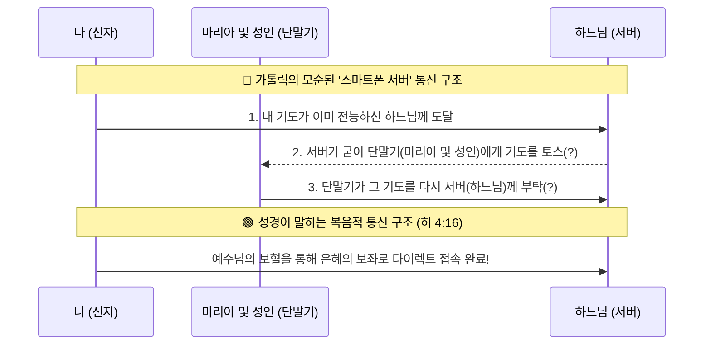

# 카톨릭 교리 댓글 공방 대화록

> **참고**: 본 문서는 가톨릭 채널의 유튜브 댓글 공방을 기록한 것이며, 이 안에는 가톨릭 신자뿐만 아니라 가톨릭 방에서 활동하는 '자유주의 신학자'의 댓글(예상)도 포함되어 있습니다. 오해가 없으시길 바랍니다.

> **형식 안내**: 🔵 **가톨릭측 댓글** 항목은 실제 원본이 아닌 실전을 참고한 **(예시)** 입니다.
> 실제 댓글과 동일하지 않으며, 공방 맥락을 이해하기 위해 재구성한 것입니다.
> 🔴 **TheScriptureMaster 답변**은 실전 답변 원문 그대로입니다.

---

## 📌 공방 1 — 구원론 / 직분론

🔵 **가톨릭측 댓글** *(예시)*
> "개신교가 '만인 제사장'을 주장한다면, 목사님도 필요 없겠네요. 그리고 누가복음 13장에서 예수님은 착한 일을 한 사람들을 칭찬하지 않으셨나요? 예레미야 17:10에도 행위대로 갚으신다고 나오는데, 이건 행위 구원을 가르치는 거 아닌가요?"

🔴 **TheScriptureMaster**
모든 성도가 제사장이라는 말이 목사님이 필요 없다는 뜻은 아닙니다.
모든 성도가 제사장이라는 뜻은 이제는 신부나 사제 같은 중간 사람 없이, 예수님을 통해 누구나 하나님께 직접 나아갈 수 있다는 것이죠.
교회 안의 직분을 없애라는 말이 아닙니다.
에베소서 4장 11절에서 "하나님이 어떤 사람은 목사로, 어떤 사람은 교사로 세우셨다"고 직접 기록했습니다. 사람마다 역할이 있는 겁니다.

누가복음 13장은 착한 일을 많이 해야 구원받는다는 내용이 아닙니다.
거기서 문 밖으로 쫓겨난 사람들이 뭐라고 했는지 26절을 볼까요? "우리가 착한 일을 많이 했습니다"가 아닙니다.
"우리가 주님이랑 같이 밥도 먹고 설교도 들었잖아요"라고 했습니다.
예수님은 착한 일이 부족해서 쫓아내신 게 아니라, 진짜 믿음의 관계 없이 아는 척만 한 사람들을 내보내신 겁니다.

마태복음 7장을 보면 "우리가 주의 이름으로 많은 권능을 행하지 아니하였나이까?"
오히려 주님 이름으로 기적을 행한" 행위 자랑꾼들이 가장 먼저 쫓겨납니다.

요한복음 6장 29절
"하나님의 일은 그가 보내신 이를 믿는 것이니라"라고 하셨습니다.
예수님이 열어 놓으신 구원의 문으로 들어가는 방법을 바울이 그대로 전한 것이 '오직 믿음'입니다. 두 분 말씀 사이에 충돌은 없습니다.

---

## 📌 공방 2 — 타락한 목사 vs 마리아 중보 (논점 이탈)

🔵 **가톨릭측 댓글** *(예시)*
> "개신교 목사들도 타락하고 이단도 많잖아요. 개신교는 뭐가 그리 대단하다고 가톨릭을 비판합니까?"

🔴 **TheScriptureMaster**
말씀하신 타락한 교주들은 성경 말씀을 정면으로 어긴 사람들입니다.
그래서 정통 개신교는 성경에 근거해서 그들을 즉시 이단으로 규정하고 잘라냅니다.
또 개인적으로는 WCC WEA 종교다원주의에 가담했다면 이단이라 생각합니다

그런데 마리아 중보 교리는 다릅니다.
바티칸이라는 거대한 조직이 앞장서서 성경 말씀을 아예 교리로 뒤집어버린 겁니다.
디모데전서 2장 5절 "하나님과 사람 사이의 중보자는 오직 그리스도 예수 한 분뿐이시다." 이 말씀을 무시하고 마리아를 중보자로 법으로 만들어버린 것입니다.

너희 개신교에도 타락한 목사가 있지 않느냐는 말은
마리아 교리가 성경적이라는 것을 증명하지 못할 때 나오는 화제 돌리기? 논점이탈 아닌지요?
타락한 교주가 존재한다고 해서 마리아가 우리의 중보자가 될 수는 없지 않을까요?

---

## 📌 공방 3 — 마리아는 살아있으니 기도를 들을 수 있다

🔵 **가톨릭측 댓글** *(예시)*
> "마리아는 천국에서 영원히 살아있는 분입니다. 살아있는 분이니 우리 기도를 들을 수 있는 거죠. 성도의 교제는 천국과도 연결되지 않나요?"

🔴 **TheScriptureMaster**
마리아가 영원히 살아있다고 해서 전지전능한 것은 아닙니다.
논리적으로는 범주 오류라고 합니다.
아시죠? 마리아님이 전 세계 성도들의 수많은 기도를 듣고 예수님께 전달하느라 쉴 틈이 없는 거요?
그런 능력을 전지전능이라고 합니다. 천국에 살아 있으면 다 그런 능력이 있을까요?

성도들과의 교제를, 죽어서 하늘에 계신 분들과 대화하는 것과 혼동하지 마세요.
성경은 산 자가 죽은 자에게 대화를 시도하는 것을 금합니다.
성도의 교제는 예수님 안에서 성령을 통해 하나로 연합되어 있는 영적인 교제를 말하는 것이잖아요?
예수님 안에서 성도의 연합이 천국에 있는 사람과 5G로 연결된 게 아니잖아요?

이것을 범주 오류라고 합니다.

---

## 📌 공방 4 — 예레미야 17:10 행위대로 갚으신다 (자충수)

🔵 **가톨릭측 댓글** *(예시)*
> "예레미야 17장 10절에 '각 사람에게 그의 길과 그의 행위의 열매대로 갚겠다'고 하셨는데, 이건 행위로 심판받는다는 말 아닙니까?"

🔴 **TheScriptureMaster**
바로 윗줄 9절까지 같이 볼까요?
마음은 만물보다 속임수로 가득하고 극도로 사악하니, 누가 마음을 알 수 있으리요?
나 주는 마음을 살피고, 중심을 시험하나니, 곧 모든 사람에게 저마다 그의 길들에 따라, 그가 행하는 것들의 열매에 따라 주느니라.

아시죠? 인간의 마음은 철저하게 썩어 있습니다.
하나님이 그 썩어빠진 마음에서 나온 알량한 '행위'를 저울에 달아보시고 천국 보내주실까요?
만약 행위로 심판받는다면 지옥 안 갈 사람 한 명도 없을걸요?

예레미야 17장은 행위로 천국 간다는 내용이 아닙니다.
내 육신의 공로를 의지하면 저주를 받고(5절), 오직 여호와만 의지해야(믿음) 복을 받는다(7절)는 내용이잖아요?

행위구원론을 방어하시려다가 본인 교리를 완전히 무너뜨리는 구절을 가져오시면 어떡합니까?
어제도 비슷한 분이 계셨는데? 같은 분 아닌지요?

이런 걸 자충수라고 합니다.

---

## 📌 공방 5 — 야고보서 5:16 "서로 기도하라" = 마리아 전구?

🔵 **가톨릭측 댓글** *(예시)*
> "야고보서 5장 16절에 '서로 기도하라, 의인의 기도는 역사하는 힘이 크다'고 했잖아요. 마리아는 가장 거룩한 의인이니 마리아에게 전구를 부탁하는 건 성경적입니다."

🔴 **TheScriptureMaster**
서로 기도하라 의미를 모르십니까?
살아 있는 성도들끼리 수평적으로 아픔을 나누고 상호 중보하라는 뜻입니다.
우리가 마리아에게 죄를 고백하면, 마리아도 우리에게 자기 죄를 고백합니까?

바로 다음 구절(17절)을 읽어보시면 본인 주장이 틀렸음을 아셔야 할 텐데요.
야고보서 5:17 엘리야는 우리와 같이 동일한 성정들에 속한 사람이었는데 그가 비가 오지 않도록 열렬히 기도하자 삼 년 육 개월의 기간 동안 지상에 비가 오지 아니하였느니라.

16절에서 "의인의 간구는 역사하는 힘이 크다"라고 한 뒤에 17절에서 그 '의인'의 예시로 누구를 데려왔는지 보십시오. 바로 구약의 위대한 선지자 엘리야입니다.

야고보 사도가 초대교회 성도들에게 "엘리야는 역사하는 힘이 큰 의인이니, 하늘에 죽어 있는 엘리야에게 너희 기도를 대신 전해달라고 빌어라"라고 가르쳤습니까?
정반대로, 살아계신 하나님께 직접 믿음으로 기도하라는 거 아닌가요?

'천국에 있는 피조물(마리아)에게 기도를 부탁해라'는 교리의 근거가 될 수 있는 구절이라고 보시는지요?

한 골은 넣으셔야 할 텐데요… 계속 실점하시는 것 같습니다.

---

## 📌 공방 6 — 외부 자료로 사도신경 인용 (자책골) (가톨릭 방에서 활동하는 자유주의 신학자 예상)

🔵 **가톨릭측 댓글** *(예시)*
> "보세요, 이 자료에 보면 사도신경에도 'Catholic'이라는 단어가 나옵니다. 개신교도 가톨릭 전통을 따르고 있는 셈이죠."

🔴 **TheScriptureMaster**
이 외부 자료는 놀랍습니다.

1) 사도신경의 'Catholic'이 로마 바티칸이 아님을 증명하고,
2) 개신교는 인간의 전통(사도신경)보다 성경을 더 높인다는 위대한 팩트를 입증하며,
3) 사도신경 내의 문구조차 후대에 인간이 임의로 '첨가'한 것임을 만천하에 폭로하는 '가톨릭 교리를 스스로 무너뜨리는 증거 자료' 였다.

이런 글이네요. 왜 이런 글을 올리셨을까요? 자책골인데요? 계속 보니까 저와 같은 편이신 것 같습니다.

---

## 📌 공방 7 — 삼위일체 부정 / 아리우스파 동조 (가톨릭 방에서 활동하는 자유주의 신학자 예상)

🔵 **가톨릭측 댓글** *(예시)*
> "아리우스의 주장이 오히려 더 성경적이고 명석한 것 같습니다. 삼위일체는 결국 로마 공의회가 만든 가톨릭 이론 아닌가요?"

🔴 **TheScriptureMaster**
형제님, 혹시 자유주의 신학자이십니까?
가톨릭도 예수님이 참 하나님이시라는 '삼위일체'를 공식 교리로 굳게 믿고 있는데, 지금 형제님은 가톨릭 신자이면서도 본인 교단마저 이단으로 규정하는 발언을 당당하게 하고 계시네요.

아리우스 이단을 "명석하다, 성경적이다"라고 칭찬하시다니,
가톨릭 신부님이 이 댓글을 보시면 뒷목을 잡고 쓰러지실 일입니다.

"카톨릭 이론"이라고요? 이론은 아직 증명되지 않은 학설을 뜻합니다.
단어 선택에 주의하셔야죠. 정말 카톨릭이 이론으로 봤습니까? 후덜덜

그리고 니케아 공의회(325년)에서 성령은 "성령을 믿는다" 한 줄이었습니다.
이건 3위일체가 아니라 2위일체입니다.

성령의 신성은 56년 뒤 381년에야 추가됐죠. 그런 조직이 만든 이론을 믿으십니까?

그런데 마태복음 28:19는 325년보다 훨씬 전에 이미 아버지 아들 성령 셋을 동시에 기록했습니다.
성경이 먼저였고, 공의회는 이단이 나올 때마다 성경에 있던 걸 방어한 것뿐입니다.

마태복음 28:19 "아버지와 아들과 성령의 이름으로 세례를 베풀고"
요한복음 1:1 "말씀은 하나님이시라"
요한복음 10:30 "나와 아버지는 하나이니라"
골로새서 2:9 "그 안에는 신성의 모든 충만이 육체로 거하시고"
요한일서 5:7 "하늘에 증거하는 셋이 있으니, 아버지와 말씀과 성령이시라. 또한 이 셋은 하나이니라."

---

## 📌 공방 8 — 논리 바닥나자 인신공격 + 베드로 반석 주장

🔵 **가톨릭측 댓글** *(예시)*
> "그런 식으로 논쟁만 할 게 아니라 가족과 사이좋게 지내세요. 어느 교회 다니세요? 베드로가 반석이라는 건 예수님이 직접 하신 말씀이고, 교회가 성경을 채택했으니 교회 권위가 성경보다 높습니다."

🔴 **TheScriptureMaster**
논리가 막히셨나요? ^^
토론에서 성경적 논리가 바닥나면 상대방 사생활을 건드리는 인신공격이 나오는 법입니다.
"가족과 잘 지내라"는 말이 딱 그겁니다.
대구침례교회? 다른 논점을 이야기하고 있는 것도 증거죠 ^^

논리학에서 이걸 '백기 투항'이라고 하죠. 패배 인정으로 받겠습니다. 가족 걱정은 안 하셔도 됩니다.

베드로 반석 얘기 하셨는데요.
예수님이 그 반석 위에 교회를 세우겠다 하신 지 5구절 뒤(마 16:23)에 베드로에게 "사탄아 물러가라"고 하셨습니다. 반석을 사탄이라 부르셨을까요?
베드로 본인도 베드로전서 2장에서 교회의 반석은 자기가 아니라 예수 그리스도라고 직접 선포했습니다.

성전이 성경을 채택했다고 하셨는데요. 하나님의 말씀이 교회를 낳은 겁니다. 바티칸이 권위를 부여해서 진리가 된 게 아니라, 원래 진리인 말씀을 초대 교회가 알아보고 받아들인 것이죠. "너희의 전통으로 하나님의 말씀을 폐하는도다." (막 7:13)

주님과 하나님이 같은 분이냐는 질문은 이미 답했는데... 이해를 못하신 거죠...

---

## 📌 공방 9 — 고린도전서 15:29 "죽은 자를 위한 세례" = 사후 소통 근거? (가톨릭 방에서 활동하는 자유주의 신학자 예상)

🔵 **가톨릭측 댓글** *(예시)*
> "제가 찾은 목사님 글에 보면, 바울이 고린도전서 15:29에서 죽은 자를 위한 세례를 언급한 건 죽은 자와의 소통 가능성을 열어둔 것 아닌가요?"

🔴 **TheScriptureMaster**
복사해 오신 목사님 글 어디에 바울이 죽은 자와의 소통을 '긍정'했다고 적혀 있나요?
원문에는 "이미 죽은 자들을 위해 산 신자들이 할 수 있는 것은 아무것도 없다는 것이 기독교의 입장" 이라고 못을 박아 뒀는데요.
본인이 가져오신 글을 본인이 왜곡하시면 어떡합니까?

고린도전서 15:29는 부활을 부정하는 거짓 교사들의 모순을 조롱하려고 이교도 풍습을 끌어온 것입니다.
"부활이 없다면서 왜 이상한 대리 세례를 받느냐?" 바울이 그 행위를 인정한 게 아니라 모순을 꼬집은 겁니다. 문맥을 보셔야죠.

바울이 말한 '성도'는 로마서 1:7, 고린도전서 1:2, 에베소서 1:1 보시면 다 이 땅에 살아있는 신자들입니다. 바울은 단 한 번도 "죽은 성도에게 기도해라"라고 가르친 적이 없습니다.

---

## 📌 공방 10 — "천국에 살아있으면 기도 들을 수 있다" (2차)

🔵 **가톨릭측 댓글** *(예시)*
> "천국에서 구원받은 성인들은 산 자들입니다. 살아있으니까 기도를 들을 수 있는 거예요."

🔴 **TheScriptureMaster**
그렇죠 지옥에 가지 않고 구원받았다면 산 자죠
지금 그게 핵심이 아니잖아요?
'살아있는 것' <> '전지전능한 것' 이 문제란거죠
저도 지금 한국에 살아 있고, 멕시코에 있는 형제님도 살아 있습니다.
둘 다 살아 있죠. 그렇다고 해서 제가 한국 제 방에 가만히 앉아서,
멕시코에 있는 형제님이 마음속으로 하는 기도를 텔레파시처럼 다 들을 수 있습니까?
없잖아요? 왜요? 우리는 살아 있긴 하지만 전지전능한 하나님이 아니라 시공간의 제약을 받는 피조물이기 때문입니다.

---

## 📌 공방 11 — 대리 세례(침례) 교리 질문

🔵 **가톨릭측 댓글** *(예시)*
> "고린도전서 15:29의 '죽은 자를 위한 세례'는 죽은 사람을 대신해 세례를 받는 의식을 가리키는 것 아닌가요? 이건 성경에 기록된 사실인데요."

🔴 **TheScriptureMaster**
이 진리는 아는 사람이 별로 없는데요......
형제님은 하나님이 사랑하시는 분 같습니다.
성경을 공부하는건 정말 큰 축복입니다. 꼼꼼하게 읽어주세요.

죽은 자의 세례는요, 단어부터 바꿔서 봐야 이해가 됩니다. 사실 '세례'란 단어 자체가 오역입니다.
헬라어 βαπτίζω(바프티조)는 '물에 완전히 잠기는 것'이지, 머리에 물 뿌리는 게 아닙니다.
예수님도 요단강에서 물 위로 올라오셨지, 머리에 물 뿌림을 받으신 게 아니잖아요? 그러니까 세례가 아니라 침례가 맞습니다.

그런데 여기서 더 중요한 게 있습니다. 침례는 물침례만 있는 게 아닙니다. 마태복음 3:11을 보시면 침례 요한이 이렇게 말합니다.
"그분께서는 너희에게 성령으로 침례를 주실 것이요, 또 불로 침례를 주시리라." 바로 다음 절(3:12)에서 "쭉정이는 꺼지지 않는 불에 태우시리라"고 했습니다.
정리하면 성경에는 세 가지 침례가 있습니다. 물침례 회개의 표시로 물에 잠기는 것. 성령 침례 믿는 자에게 성령님이 임하시는 것. 불침례 심판, 즉 불지옥입니다.

이제 고린도전서 15:29를 다시 읽어보세요. "죽은 자들로 인하여 침례를 받은 자들은 무엇을 하겠느냐?"
여기서 핵심은 "로 인하여"입니다. 죽은 자들을 "대신해서" 침례를 받았다는 게 아니라, 죽은 자들 "때문에" 침례를 받는다는 뜻입니다. 그러면 물침례, 성령 침례, 불침례 중에 어떤 게 맞을까요?

죽은 자들 때문에 물침례를 받는다? 말이 안 됩니다. 죽은 자들 때문에 성령 침례를 받는다? 이것도 안 됩니다. 죽은 자들(순교자들)을 죽였기 때문에 불침례(심판)를 받는다? 이게 맞습니다.
바로 다음 구절이 이걸 확인해 줍니다. 30절 "그리하면 어찌하여 우리가 매시각 위태로운 상황 가운데 서 있느냐?" 31절 "나는 날마다 죽노라."
29절은 성도를 죽인 박해자들의 심판을 말하고, 30-31절은 박해당하는 성도들의 고난을 말합니다. 부활이 없다면 박해자들의 심판도, 우리의 고난도 전부 의미가 없지 않느냐 — 이게 바울의 논증입니다.
고전 15:29를 대리 세례나 죽은 자와의 소통 근거로 쓰시면 안 됩니다.

---

## 📌 공방 12 — 화체설 비판에 대한 반박

🔵 **가톨릭측 댓글** *(예시)*
> "개신교는 성만찬을 물리적으로만 생각하니까 모순이 생기는 겁니다. 우리가 말하는 건 물리적 변화가 아니라 영적 실재입니다."

🔴 **TheScriptureMaster**
사제가 축성하면 빵이 예수님의 물리적이고 실제적인 살과 피로 본질이 변한다는 것이 가톨릭의 '화체설'입니다.
빵이 진짜 살덩어리로 변한다고 우기면서 이걸 부정하는 수많은 개신교인들을 물리적인 것만을 생각하니 모순이라고요?

우리는 빵과 포도주가 상징물이며 영적으로 예수님과 연합한다고 믿는 사람들입니다. 물리적인 마술에 집착하고 있는 쪽은 가톨릭인데,
도리어 개신교를 향해 물리적이라고 모순이라고 하시네요?

예수님은 '나는 양의 문이다'라고도 하셨는데, 형제님 주장대로라면 왜 예수님이 진짜 물리적인 '나무 문짝'으로 변했다고는 안 하십니까?
빵과 포도주에만 마술을 적용하면서 그걸 '신비'라고 포장하고 있습니다.

---

## 📌 공방 13 — "화체설 말고 실체변화라고 해야 한다"

🔵 **가톨릭측 댓글** *(예시)*
> "화체설이라는 표현은 잘못된 거고, 정확히는 실체변화라고 합니다. 그리고 물리적 살과 피가 아니라 본질적 살과 피로 변하는 것이니 상징이 아닙니다."

🔴 **TheScriptureMaster**
화체설이 아니라 실체변화 라고 말씀하셨는데요
사실 이 둘은 같은 단어입니다.
가톨릭이 공식 사용하는 라틴어는 Transubstantiatio이고 영어로는 Transubstantiation인데,
이걸 한국어로 번역할 때 개신교는 '화체설'로, 가톨릭은 '실체변화'로 부르는 것뿐입니다.
용어만 다를 뿐 가리키는 의미는 동일합니다.

그리고 "물리적 살과 피가 아니라 본질적 살과 피"라고 상징이 아니라고 하셨는데요
누군가 빵을 가리키며 "이건 진짜 소고기야"라고 합니다.
그래서 현미경으로 들여다봤더니 단백질도 없고, 근섬유도 없고, 피도 없습니다.
"아니 소고기라면서요? 고기 성분이 하나도 없는데요?"라고 물으면
"물리적으로는 빵이지만, 보이지 않는 본질이 소고기로 바뀐 거야"라고 대답하는 겁니다.

눈으로 봐도 빵이고, 맛도 빵이고, 성분도 빵인데 "본질은 소고기"라고 하면 그건 결국 '상징'이죠
상징이 아니라고요?

요한복음 6장에서 살과 피를 먹으라는 말씀을 하신 바로 그 자리에서, 63절에 이렇게 기록되어 있죠
"살리는 것은 영이니 육은 무익하니라 내가 너희에게 이른 말은 영이요 생명이라" 요 6:63

예수님 본인이 직접 "내가 한 말은 영적인 말씀이다"라고 해석표를 주신 겁니다.
물리적으로 고기를 먹으라는 뜻이 아니라, 말씀을 믿음으로 받아들이라는 영적 선언이었던 것이죠.
예수님의 그 해석을 따르지 않을 이유가 있을까요?

---

## 📌 공방 14 — 성만찬은 사제만 집행할 수 있다

🔵 **가톨릭측 댓글** *(예시)*
> "성만찬은 사도들의 후계자인 사제만 집행할 수 있습니다. 예수님이 사도들에게만 '이를 행하라'고 하셨으니까요."

🔴 **TheScriptureMaster**
성만찬을 사도(사제)만 집행할 수 있다고 하셨는데요,
바울이 고린도전서 11장에서 성만찬을 가르칠 때 뭐라고 했는지 같이 볼까요?
"너희가 같이 모여서(11:20)... 너희가 이 떡을 먹으며(11:26)"
바울은 "교회에 파송된 사제나 감독만 집행하라"고 말하지 않았습니다. 이 편지의 수신자는 특정 사제 계급이 아니라 고린도 교회 성도 전체입니다.
평신도들에게 직접 "너희가 먹으라"고 한 겁니다.

실제로 초대교회는 가정 교회였습니다. 성도들이 집에 모여 함께 떡을 떼었지, 제단에서 사제가 집례하는 구조가 아니었습니다.

그리고 한 가지 더 중요한 게 있습니다. 신약성경은 교회 지도자를 장로 또는 감독으로 부릅니다. 제사를 집례하는 '사제(Hiereus)'라는 직함으로 부른 적은 단 한 번도 없습니다.
사제 계급이 성만찬을 독점한다는 교리는 성경이 아니라 중세 가톨릭이 만든 것 아닐까요?

---

## 📌 공방 15 — 히브리서 10:10 단번의 제사 vs 미사

🔵 **가톨릭측 댓글** *(예시)*
> "미사는 십자가 제사를 '재현'하는 것이 아니라 현재화하는 것입니다. 그러니 히브리서의 '단번에'와 충돌하지 않습니다."

🔴 **TheScriptureMaster**
그리고 가장 중요한 질문인데요, 이 부분은 대답을 회피하셨습니다.
히브리서 10장 10절 "이 뜻을 따라 예수 그리스도의 몸을 단번에 드리심으로 말미암아 우리가 거룩함을 얻었노라"

예수님께서 십자가 위에서 "다 이루었다(요 19:30)"고 선언하시고, 단 한 번의 희생으로 영원한 제사를 끝내신 겁니다.

그런데 가톨릭은 미사를 단순한 식사가 아니라 '참된 제사'라고 공식 교리로 명시하고 있습니다.
예수님이 십자가에서 영원히 완성하신 제사를, 왜 사제들이 매 미사 때마다 제단 위에서 다시 바쳐야 합니까?

"단번에 영원히 끝났다"와 "매주 다시 바친다" 둘중 뭐가 진실이죠?
이것은 예수님의 십자가가 단번에 완성되었음을 부정하는 것 아닐까요?
이 부분에 대해 성경적으로 답변이 불가능하겠죠?

---

## 📌 공방 16 — 예수님의 기도가 곧 축성이다

🔵 **가톨릭측 댓글** *(예시)*
> "예수님께서 빵을 들고 하늘을 우러러 기도하셨을 때 그것 자체가 축성입니다. 그 기도로 빵이 변화한 것이죠."

🔴 **TheScriptureMaster**
예수님께서 빵을 들고 하신 기도가 축성이라고 하셨는데요,
그건 유대인의 유월절 식사 때 가장이 양식을 주신 하나님 아버지께 올리는 감사 기도입니다.
기도를 올린 대상은 '빵'이 아니라 '하나님'이셨습니다.
감사 기도를 드렸다고 해서 빵이 갑자기 실제 살로 변한다는 건 성경 근거가 없습니다.

마태복음 14장 19절, 오병이어의 기적을 보시면 예수님이 똑같이 떡을 들고 하늘을 우러러 기도하시고 떡을 떼어 주셨습니다.
그러면 5천 명이 먹은 그 떡도 전부 예수님의 '본질적 살'로 변한 건가요?

누가복음 22장 20절에서 예수님은 "이 잔은 내 피로 세우는 새 언약이니"라고 하셨습니다.
가톨릭 식으로 글자 그대로 해석하면, 포도주를 담은 그 '잔' 자체가 '새 언약'이라는 추상적 개념으로 본질 변화를 일으켜야 합니다.
금속 잔이 계약서로 변했습니까? 아니죠. 이건 문학적 은유라는 걸 누구나 알 수 있습니다.

성만찬이 엄숙하고 거룩한 예식이라는 점은 동의합니다.
하지만 세례를 베풀 때 엄숙히 기도를 올린다고 해서 세례통의 물이 예수님의 피로 변하지 않는 것처럼,
기도가 동반된 거룩한 예식이라는 사실이 빵이 창조주의 살로 변하는 것은 말이 안되죠

---

## 📌 공방 17 — '로마 가톨릭'이라는 호칭은 비하다

🔵 **가톨릭측 댓글** *(예시)*
> "'로마 가톨릭'이라는 표현은 비하하는 말입니다. 그냥 가톨릭이라고 불러주세요. 개신교도 미국교, 캐나다교라고 부르면 기분 나쁘지 않겠어요?"

🔴 **TheScriptureMaster**
그리고 '로마 가톨릭'이라고 부르는 게 비하라고 하셨는데요,
그건 비하가 아니라 교리 그 자체입니다. 가톨릭의 핵심은 전 세계 교회가 '로마 주교(교황)'의 수위권에 복종해야 한다는 것이잖아요.

개신교는 미국 선교사가 복음을 전해줬을 뿐, 미국의 특정 목사를 교회의 머리로 모시거나 전 세계가 그에게 복종해야 한다는 교리가 없습니다.
교회의 머리가 '로마 교황'인 구조와 단순히 복음이 출발한 '미국'을 같은 선상에 놓고 비교하는 게 말이 될까요?

---

## 📌 공방 18 — 교무금 안 내도 장례미사는 당연히 해준다

🔵 **가톨릭측 댓글** *(예시)*
> "어떤 목사님 블로그에서 교무금 안 내면 장례미사도 못 본다고 하던데, 그건 완전히 틀린 말입니다. 가톨릭은 헌금 강요를 절대 안 합니다."

🔴 **TheScriptureMaster**
한국 천주교 사목지침서 제133조와 교회법 제222조에 신자의 교무금 납부 의무가 명시되어 있습니다.
교무금을 장기 미납해서 판공성사를 보지 않으면 '냉담자'로 분류되고, 대부모 자격이 상실되거나 관면혼배, 장례미사에 제한이 생기는 건 가톨릭의 실제 행정 절차입니다.
물론 "돈 안 내면 무조건 장례를 못 본다"는 건 아니고
현장에서는 신부님의 개별 판단에 따라 달라질 수 있는 행정적 권고이니까요.
하지만 그 행정적 제한 자체가 존재한다는 사실은 변하지 않습니다.
없는 사실을 지어낸 게 아니라 사실에 기반한 직설적 표현이었을 수 있죠
오히려 일반 신자분들이 본인 교회의 행정법을 잘 모르시는 경우가 많아서 목사님 설교를 오해하신 것 같습니다

---

## 📌 공방 19 — 성인 전구, 전승, 제2경전

🔵 **가톨릭측 댓글** *(예시)*
> "우리는 마리아를 중보자로 보는 게 아니라, 예수님이 유일한 중재자임을 인정합니다. 그리고 성경과 성전(전승)은 같은 권위를 가지며, 제2경전도 정경이 맞습니다."

🔴 **TheScriptureMaster**
첫째, '성인 전구(기도)'의 문제입니다. 문서상으로는 예수님이 유일한 중재자라고 하셨지만, 실제로는 마리아와 죽은 성인들에게 수없이 중재 기도를 올리시죠. 더 큰 문제는 전 세계 수억 명이 각자의 언어로 동시에 드리는 기도를 죽은 성인이 다 듣고 알아듣는다고 믿는 것입니다. 이는 오직 창조주 하느님만의 절대 속성인 '전지전능'과 '무소부재'를 피조물인 인간에게 부여하는 셈이 됩니다. 이것이 저희가 우려하는 피조물의 신격화입니다.

둘째, '성경과 전승'을 동등하게 두는 것의 위험성입니다. 예수님 시대 바리새인들도 성경(토라)과 자신들의 '전승'을 동등한 권위에 두었습니다. 그때 예수님은 "너희의 전통(전승)으로 하느님의 말씀을 폐한다(막 7:13)"고 엄히 꾸짖으셨습니다. 인간의 전승이 성경의 명백한 선언(중보자는 오직 한 분)과 충돌하고 이를 덮어버린다면, 결국 전승이 말씀 위에 군림하는 결과가 됩니다.

셋째, 제2경전(외경)과 연옥입니다. 유대인들조차 정경으로 인정하지 않았고 예수님께서도 단 한 번도 인용하신 적 없는 외경을 근거로 교리를 세우는 것은 무리가 있습니다. 무엇보다 성경은 "한 번 죽는 것은 정해진 것이요 그 후에는 심판이 있다(히 9:27)"며 죽음 이후의 사후 기회(연옥)를 엄격히 차단하고 있습니다.

주님안에서 형제님의 평화를 빕니다.

---

## 📌 공방 20 — "천국에선 통역이 필요 없다"

🔵 **가톨릭측 댓글** *(예시)*
> "천국에서는 언어의 장벽이 없습니다. 통역사가 없어도 성인들은 다 알아들을 수 있습니다. 그러니 수억 명이 기도해도 문제없습니다."

🔴 **TheScriptureMaster**
다만 댓글이 여기저기 달려서 text 의 압박이 있습니다. 마태오 형제님을 조금 이해할 수 있을 듯 합니다.

먼저 답을 드리자면, 
"아닙니다. 천국에는 민족 간의 통역사가 필요 없습니다." 영적인 존재들은 언어의 장벽 없이 완벽하게 소통할 것이라 믿습니다.

그런데 이 역질문은 제가 제기한 가장 치명적인 본질적 질문을 슬쩍 피해 가는 '논점 일탈'의 오류로 보입니다.
제가 지적한 문제의 핵심은 단순히 '언어가 달라서 번역이 불가능하다'는 1차원적인 언어학 문제가 아닙니다. 
피조물에 불과한 인간이 어떻게 창조주만이 가지신 절대 속성인 '무한성(전지함, 동시 처리 능력)'을 흉내 낼 수 있느냐는 심각한 '존재론적 모순'을 지적한 것입니다. 

첫째, '언어'를 통역 없이 이해하는 것과 수천만 개의 기도를 '동시에 처리'하는 것은 완전히 다른 범주의 이야기입니다. 
통역사가 필요 없다 한들, 멕시코, 한국, 로마, 필리핀 등 전 세계에서 수백만 명의 가톨릭 신자들이 같은 시간, 같은 1초 동안 마리아와 성인들을 향해 각자의 고통을 쏟아낼 때, 
피조물인 그들이 그 수백만 개의 각기 다른 생각들을 동시에 수신하고, 서로 섞이지 않게 분류하고, 모두 이해하여 하나님께 전구할 수 있습니까?

이것이 가능하려면 마리아는 무한한 정보 처리 능력인 '전지'를 지녀야만 합니다. 
통역사가 필요 없는 것과, 피조물이 조물주의 '전지함'을 소유하는 것은 전혀 다른 차원입니다.

둘째, 이보다 더 결정적인 성경적 충돌이 있습니다. 신자들의 기도는 육성으로도 나오지만, 상당수는 입술을 떼지 않고 '마음속(침묵)'으로 올립니다. 
피조물인 천국의 성인들이 지상에 있는 수억 명의 '속마음'을 실시간으로 꿰뚫어 볼 수 있습니까?

열왕기상 8장 39절
"주는 계신 곳 하늘에서 들으시고 사하시며 각 사람의 마음을 아시오니... 주만 홀로 사람의 마음을 다 아심이니이다"

인간의 깊은 속마음과 생각은 천사도 사탄도 마리아도 알 수 없으며, 오직 "여호와 하나님만 홀로 아신다(렘17:10)"고 성경은 명백하게 선포합니다. 
만약 마리아가 수억 명의 마음속 기도를 다 듣고 안다면, 마리아는 성경이 "주님만 홀로 아신다"고 맹세하신 창조주의 고유 권한은 거짓인가요?

---

## 📌 공방 21 — 솔로몬의 기도와 계시

🔵 **가톨릭측 댓글** *(예시)*
> "하나님이 선지자들에게 계시를 통해 마음을 알려주셨던 것처럼, 마리아도 하나님이 계시해주시면 속마음을 알 수 있는 것 아닙니까? 솔로몬도 행위대로 갚아달라고 기도했잖아요."

🔴 **TheScriptureMaster**
하나님이 선지자에게 특정 사실 하나를 '일시적으로 계시'해 주신 것과,
피조물인 마리아가 영원토록 전 세계 수억 명이 쏘아 올리는 속마음 기도를 동시에 다 듣고 처리하는
'전지전능함'이 같다고 우기시는 겁니까?

주신 성경 공동번역 보죠. 
"오직 당신만이 사람의 마음속을 낱낱이 아십니다." 
그런데 어떻게 피조물에 불과한 마리아가 전 세계 수억 명의 속마음 기도를 실시간으로 다 꿰뚫어 본다고 주장할 수 있는지요?
오직 하나님만 아신다는 창조주의 고유 권한, 즉 전지성을 왜 마리아에게 갖다 붙이시냐고요. 이런 걸 피조물의 신격화, 즉 우상숭배라고 합니다.

그리고 행여나 구절 중간에 있는 '행위대로'라는 단어에 또 꽂히신 거면 곤란합니다. 
지금 솔로몬이 하나님께 자기 행실을 자랑하고 있습니까? 
아니잖아요. 구절 앞부분을 보세요. 
"하늘에서 들으시고 용서하여 주소서"라며 자비를 구하고 있습니다. 
왜요? 
우리의 속마음이 얼마나 부패했는지 하나님이 낱낱이 아시니까, 
행위대로 심판받으면 다 죽게 생겼으니 제발 용서와 은혜를 베풀어 달라고 매달리는 거잖아요?

이것도 자충수라고 합니다. 다른말로 자살골이죠?

---

## 📌 공방 22 — 연옥 교리와 성도의 교제

🔵 **가톨릭측 댓글** *(예시)*
> "천국에는 더러운 것이 못 들어가니 정화의 과정(연옥)이 필요합니다. 고린도전서 3장 15절에 불 속에서 구원받는다는 내용이 연옥의 증거이고, 천상 전구도 성도의 교제입니다."

🔴 **TheScriptureMaster**
형제님, 디모데전서 본문과 고린도전서까지 언급하시며 꼼꼼하게 반론해 주셔서 진심으로 감사합니다. 
그러나 형제님의 반론을 성경의 빛에 비추어 볼 때, 안타깝게도 가톨릭 교리가 예수 그리스도의 '십자가 대속의 보혈'이 가진 완전성을 스스로 약화시키고 있다는 사실을 발견하게 됩니다. 
조심스럽게 세 가지 성경적 팩트를 나누고자 합니다.

첫째, "연옥이 반드시 필요하다"는 주장은 십자가 보혈의 완전성과 충돌합니다. 
형제님의 말씀대로 천국에는 더러운 것이 절대 들어가지 못합니다. 그렇다면 그 더러운 죄의 얼룩을 대체 '무엇으로' 씻느냐가 구원론의 핵심입니다. 
형제님의 논리(연옥 교리) 밑바탕에는, 하느님의 아들이 흘리신 십자가의 피가 내 죄를 완벽하게 씻어내기에 '부족했으므로', 
내가 연옥의 불구덩이 속에서 내 자신의 고통으로 남은 얼룩을 마저 지워야 한다는 안타까운 전제가 깔려 있습니다. 
이것은 "그 아들 예수의 피가 우리를 모든 죄에서 깨끗하게 하실 것이요(요일 1:7)"*라는 말씀과, "한 번의 제사로 영원히 온전하게 하셨느니라(히 10:14)"는 십자가 대속의 완성을 무색하게 만듭니다. 
피조물이 연옥에서 받는 징벌의 고통이, 어떻게 창조주 예수님의 보혈보다 죄를 더 완벽하게 씻어줄 수 있겠습니까?

둘째, 고린도전서 3장의 불은 영혼을 씻는 연옥의 불이 아닙니다. 
고린도전서 3장 15절("불 속에서 목숨을 건지듯")을 연옥의 근거로 쓰신 것은 본문의 문맥을 간과한 아쉬운 오독입니다. 
12절부터의 문맥을 찬찬히 살펴보면, 그 불은 영혼의 더러움을 정화하는 불이 아니라, 
바울이나 아볼로 같은 '사역자들'이 이 땅에서 세운 '사역의 공적(결과물 - 나무/풀/금/은)'을 테스트하는 심판의 불입니다(13절). 
내 사역의 열매(공적)가 불타 없어질 수는 있으나, 반석이신 그리스도 위에 선 사역자 본인은 은혜로 구원을 얻는다는 문맥이지, 
영혼의 죄를 불의 고통으로 씻는 연옥과는 전혀 연관이 없는 구절입니다.

셋째, '성도의 교제'와 '천상 전구' 사이에는 무서운 존재론적 비약이 숨어있습니다. 
제가 지상의 형제에게 기도를 부탁하는 것은 물리적 시공간 안에서 소통하는 아름답고 정상적인 교제입니다.
하지만 전 세계에서 수백만 명이 동시에 '마음속(침묵)'으로 올리는 기도를 천국에 있는 피조물이 다 듣고 알아챈다면, 
그것은 피조물이 창조주만이 가지신 '무소부재'와 '전지(속마음을 꿰뚫어 봄 - 왕상 8:39)'라는 하느님의 고유 권한(신성)을 취하게 됨을 뜻합니다. 
성도의 교제를 핑계로 피조물에게 하느님의 절대 속성을 부여하며 선을 넘는 것은 우리가 매우 경계해야 할 신학적 오류입니다.

형제님, 내 불완전한 고통(연옥)으로 구원의 부족함을 보충해야 한다는 불안한 마음을 내려놓으셨으면 좋겠습니다. 
우리의 더러운 얼룩을 단 한 방울도 남김없이 완벽하게 씻고 천국 문을 여는 것은 오직 '예수 그리스도의 피'뿐입니다. 
이 놀라운 복음의 은혜가 형제님께 온전한 평안을 주기를 빕니다.

---

## 📌 공방 23 — '스마트폰 서버' 비유와 이신칭의 오해

🔵 **가톨릭측 댓글** *(예시)*
> "기도는 서버(하느님)를 통해 단말기(성인)에게 전달되는 스마트폰 서버 같은 구조입니다. 개신교의 오직 믿음은 불안하기 때문에 연옥 교리가 필요한 겁니다."

🔴 **TheScriptureMaster**
형제님, 수준 높은 변증 감사드립니다. 
(오늘 대화가 많았습니다. 마태오 형제님의 다음 영상때 또 보시죠)
 '스마트폰 서버' 비유와 '프로테스탄트의 불안'에 대한 언급은 형제님의 신앙적 깊이를 엿볼 수 있는 매우 흥미로운 접근이었습니다. 
그러나 형제님의 그 정교한 변증을 성경적 판례에 비추어 볼 때, 역설적으로 가톨릭 교리가 가진 구조적 문제가 보입니다. 

첫째, '스마트폰 서버' 비유가 낳는 성경적 모순입니다. 
형제님이 고안해 내신 비유를 적용해 보면, 
기도의 흐름이 나(단말기) >  천주(서버) > 성인(단말기) > 천주(서버)로 전달된다는 뜻이 됩니다. 
형제님, 내 기도가 이미 중앙 서버이신 전능하신 하느님께 '다이렉트'로 완벽하게 도달했는데, 
하느님은 왜 굳이 그 기도를 피조물인 성인들에게 다시 '전달(토스)'해주시고, 
성인들은 그걸 또다시 하느님께 부탁하는 것입니까? 

성경은 "우리가 긍휼하심을 받고 은혜를 얻기 위하여 은혜의 보좌 앞에 담대히(직접) 나아갈 것이니라(히 4:16)"고 선포합니다.
예수님의 보혈로 지성소의 휘장이 찢어져 하느님께 직접 닿게 된 은혜를 놔두고, 
하느님을 굳이 성인들과의 통신을 돕는 매개체(서버)로 묘사하는 것은 십자가의 공로를 다소 무색하게 만드는 것 아닐까요?

둘째, 개신교인은 성화의 불완전함 때문에 결코 불안해하지 않습니다. 
"프로테스탄트의 불안을 연옥이 해결해 준다"는 형제님의 분석은, 안타깝게도 개신교의 핵심인 '이신칭의'에 대한 오해에서 비롯되었습니다. 
천국에 들어가는 자격은 '내 내면이 연옥의 불로 완벽하게 세탁되었기 때문'이 아니라, '예수 그리스도의 완벽한 의가 내게 덧입혀진 것(전가)이기 때문입니다(롬 8:1). 
그 가장 완벽한 성경적 판례가 바로 '십자가 강도'입니다. 그는 평생 악행을 저지르다 죽기 직전에 예수님을 믿었습니다. 
내면의 삐뚤어진 성향을 세탁할 시간도, 죗값을 치를 시간도 없었던 가장 불완전하고 더러운 자였습니다. 
형제님의 논리(연옥의 세탁기)대로라면 이 강도야말로 연옥의 가장 뜨거운 불 속으로 가야 했습니다. 
하지만 예수님은 무어라 하셨습니까? 
"네가 오늘 나와 함께 낙원에 있으리라(눅 23:43)." 
예수님의 피는 '연옥'이라는 정화소가 단 1초도 필요 없을 만큼 단번에, 즉시, 완벽하게 우리를 정결케 하십니다.

셋째, 고린도전서 3장의 불은 영혼을 태우는 연옥 불이 아닙니다. 
아무리 훌륭한 교부의 해석이라도 성경 원어의 문맥을 이길 수는 없습니다. 
고린도전서 3장 13절 헬라어 원문을 보십시오. 
그 불이 각 사람의 '공적'이 어떠한 것을 시험할 것임이라 고 명시되어 있습니다. 
불이 태우고 제련하는 대상은 죽은 신자의 '영혼(프쉬케)'이 아니라, 사역자가 살아서 행한 '사역의 결과물(에르곤)'입니다.

형제님, 내 불완전한 영혼을 씻기 위해 '연옥'이라는 가상의 공간에 소망을 두지 않으셨으면 좋겠습니다. 
우리의 유일한 소망은, 십자가의 강도조차 단 한 번에 완벽하게 씻어 낙원에 직행하게 하신 '예수 그리스도의 보혈' 단 하나뿐입니다. 
평안을 빕니다!
(자기전에 마지막으로 보내드립니다. 좋은 꿈 꾸시기를)

---

## 📌 공방 24 — '천주의 어머니' 칭호 논쟁

🔵 **가톨릭측 댓글** *(예시)*
> "루카복음에 엘리사벳이 마리아를 '내 주님(하느님)의 어머니'라고 불렀습니다. 그러니 마리아는 천주의 어머니가 맞습니다."

🔴 **TheScriptureMaster**
네 루카복음 보겠습니다.
엘리사벳의 고백인 "내 주님의 어머니(눅 1:43)"를 인용하시며 괄호 안에 '(하느님)'이라는 단어를 덧붙여 주셨습니다. 
마리아를 향한 형제님의 깊은 공경의 마음은 잘 이해합니다. 다만, 성경 원문의 단어 선택이 가진 정밀한 의도를 조심스럽게 나누고 싶습니다.

첫째, 성경 원어(헬라어)의 엄격한 단어 구분입니다. 
엘리사벳은 성령의 감동을 받아 헬라어로 "내 주님(Κυρίου, 퀴리오스)의 어머니"라고 고백했지, 결코 "하느님(Θεοῦ, 데오스)의 어머니"라고 부르지 않았습니다. 
물론 예수님이 본질상 삼위일체 하느님이 맞으심은 우리 모두의 흔들림 없는 고백입니다. 
그러나 아시겠지만 신약성경은 단어를 아주 정밀하게 구별해서 사용합니다. 
성육신하여 인성을 입고 오신 '메시아'의 직분을 나타낼 때는 철저하게 '퀴리오스(주님)'를 사용하며, 영원 전부터 자존하시는 창조주 본성을 지칭할 때는 '데오스(하느님)'를 사용합니다. 
마리아가 인성을 입고 오신 메시아(주님)의 훌륭한 육신적 어머니임은 성경적 사실이지만, 
성경은 단 한 번도 선을 넘어 창조주의 본성을 뜻하는 "데오스(하느님)의 어머니"라는 칭호를 사용한 적이 없습니다.

둘째, 성경 원문이 멈춘 곳에 대한 존중입니다. 
성경이 "주님의 어머니"라고 아주 정밀하게 선을 그어 놓은 곳에, 후대의 우리가 괄호를 치고 '(하느님)'이라는 단어를 치환하여 넣는 것은, 
자칫 성경 원문에도 없는 '하느님의 어머니'라는 교리를 정당화하기 위해 성경 본문을 임의로 확장하는 결과가 될 수 있습니다. 
성령의 완벽한 감동을 받은 성경의 저자들을 보십시오. 그들은 마리아를 깊이 존경하면서도 철저하게 "예수의 어머니(요 2:1)", "내 주의 어머니(눅 1:43)"로만 정확하게 기록했습니다.

개신교가 '하느님의 어머니'라는 호칭을 경계하는 것은 마리아를 폄하하려는 것이 결코 아닙니다. 
"성경이 멈춘 곳에서 우리의 신학도 멈추는 것"이 피조물로서 가장 안전하고 참된 신앙의 태도라고 믿기 때문입니다. 
성경 원문에 없는 '하느님'이라는 괄호를 인위적으로 끼워 넣기보다는, 
성경이 기록한 그대로 '내 주의 어머니'로 공경하는 것이 가장 성경적인 태도일 것입니다. 늘 평안하시기를 빕니다!

---

## 📌 공방 25 — 구약 70인역과 '퀴리오스'

🔵 **가톨릭측 댓글** *(예시)*
> "구약 70인역에서 '야훼'를 '퀴리오스'로 번역했습니다. 따라서 엘리사벳이 부른 '퀴리오스의 어머니'는 곧 '야훼 천주의 어머니'라는 뜻입니다."

🔴 **TheScriptureMaster**
형제님, 구약 70인역(LXX)의 번역 역사까지 인용하시며 '퀴리오스(주님)'를 설명해 주셔서 감사합니다. 
다만, 그 번역의 역사를 바탕으로 엘리사벳의 '주의 어머니' 고백을 '천주의 어머니'와 완전히 동일시하시는 결론에는, 
1세기의 역사적 문맥을 간과한 안타까운 논리적 비약(개념 치환)이 숨어있습니다. 
형제님의 주장을 역사적 팩트에 비추어 조심스레 역질문을 드리고 싶습니다.

첫째, 헬라어 '퀴리오스'의 언어적 범위입니다. 
유대인들이 구약의 거룩한 이름 '야훼(YHWH)'를 감히 부르지 못하고 '아도나이(주님)'로 바꾸어 불렀고, 
그것이 70인역 헬라어 성경에서 '퀴리오스(Kyrios)'로 번역된 것은 역사적 사실이 맞습니다. 
하지만 이 사실을 근거로 *"야훼가 퀴리오스로 번역됐으니, 엘리사벳이 부른 '주의 어머니'는 곧 '야훼 천주의 어머니'와 완벽한 동의어다"*라고 연결하시는 것은 무리가 있습니다. 
헬라어 '퀴리오스'는 야훼를 번역할 때도 쓰였지만, 당시 일상 언어에서는 '인간 왕, 주인, 혹은 다윗의 자손으로 오실 메시아'를 부르는 호칭이기도 했기 때문입니다.

둘째, 1세기의 유대인들의 역사적 문맥을 살펴보아야 합니다. 
형제님의 말씀대로 엘리사벳이 쓴 '퀴리오스'가 완벽하게 '야훼 천주'의 동의어라고 가정해 보겠습니다. 
그렇다면 엘리사벳은 지금 마리아에게 "당신은 야훼의 어머니입니다"라고 선언한 셈이 됩니다. 
형제님, 구약의 엄격한 유일신 사상 속에서 뼈가 굵은 1세기 유대인 엘리사벳이, 감히 "영원하신 창조주 야훼 하느님에게 기원(어머니)이 있다"는 신성모독적 발상을 할 수 있었다고 생각하십니까? 
그것이 역사적으로 가능한 일입니까? 엘리사벳이 고백한 '내 주(퀴리오스)의 어머니'는, 
시편 110편의 예언대로 오실 '왕이신 메시아'를 잉태한 여인에 대한 위대한 찬사였지, 
결코 "당신이 창조주 야훼 천주의 기원이다"라는 뜻이 될 수 없습니다. 
형제님의 논리는 1세기 유대인들의 철저한 유일신적 문맥을 간과하고 계십니다.

셋째, 가톨릭 스스로도 인정하는 존재론적 모순입니다. 
형제님 스스로도 "마리아가 천주의 신성을 창조했다는 뜻이 결코 아니다"라고 고백하셨습니다. 
맞습니다! 마리아가 낳은 것은 참 하느님이신 예수님이 시간 속에서 취하신 '인성'일 뿐, '신성'을 낳은 적이 없습니다. 
하느님의 신성을 낳은 적이 없다는 것을 본인들도 인정하시면서, 왜 굳이 대중들에게 "피조물이 조물주를 낳았다"는 오해와 우상화를 양산하는 '천주의 어머니'라는 타이틀을 끝까지 고집하십니까?

'천주의 어머니'는 기원후 431년에 에페소 공의회에서 후대 교회가 확정한 신학적 산물일 뿐, 성경의 언어가 아닙니다. 
성경의 저자들이 그토록 철저하게 지켜낸 '조물주와 피조물의 경계선'을 단어의 융합으로 허물어 버리는 것은 너무나 위험한 접근입니다. 평안을 빕니다!

---

## 📌 공방 26 — 세례가 구원의 필수 조건인가?

🔵 **가톨릭측 댓글** *(예시)*
> "세례는 구원의 필수 요건입니다. 바울 서신에서 이신칭의를 강조한 것은 이미 유효한 세례를 받은 자들을 향한 재교육 목적이었습니다."

🔴 **TheScriptureMaster**
'바울 서신은 이미 유효한 세례를 받은 자들을 향한 재교육 목적이다'라는 의견 깊이 묵상해 보았습니다. 
형제님의 시각에 일견 고개가 끄덕여지는 부분도 있습니다. 
다만, 그 논리를 성경 본문에 조심스럽게 비추어 보았을 때, '세례가 구원의 필수 조건'이라는 
가톨릭의 교리와 맞부딪히는 몇 가지 성경적 판례들이 있어 제 의견을 조심스레 나누고자 합니다.

첫째, 바울 서신의 핵심 주제와 세례의 관계입니다. 
만약 형제님 말씀대로 바울의 서신이 '이미 유효한 세례를 받아 구원이 확정된 사람들을 위한 재교육'이라면, 
바울이 로마서와 갈라디아서의 그 많은 분량을 할애하여 "사람이 율법이나 예식이 아닌 오직 믿음으로 의롭다 하심을 받는다(이신칭의)"고 
그토록 간절히 설파할 이유가 없었을 것입니다. 바울이 서신을 쓴 핵심 이유는 "예수님을 믿는 것만으로는 안 되고 할례(물리적, 예식적 행위)를 꼭 받아야 구원받는다"는
거짓 교사들의 주장을 막기 위함이었습니다. 오늘날 "믿음만으로는 안 되고 유효한 세례(예식적 행위)를 꼭 받아야 구원받는다"고 가르친다면, 
바울이 그토록 경계했던 율법주의적 논리에 빠질 위험이 있지 않을까요?

둘째, 사도 바울 스스로가 내린 세례에 대한 정의입니다. 
'세례가 구원의 필수 징표'라는 관점에서 본다면, 사도 바울이 고린도전서 1장 17절에서 한 고백은 매우 당혹스럽습니다. 
바울은 "그리스도께서 나를 보내심은 세례를 베풀게 하려 하심이 아니요 오직 복음을 전하게 하려 하심이로되"라고 고백합니다. 
만약 '세례'가 구원의 가장 핵심적인 요건이라면, 바울은 지금 "예수님은 나를 영혼 구원하라고 보내신 게 아니다"라고 선언한 셈이 됩니다. 
이 말씀은 바울 본인이 '구원의 본질인 복음'과 '외적 표징에 불과한 물세례'를 명확히 분리하여 물세례의 영적 한계를 정립해 준 중요한 구절로 보입니다.

셋째, 사도행전 10장에 나오는 고넬료 사건을 보십시오. 
베드로가 복음을 전할 때, 이방인 고넬료 일가는 '물세례를 받기도 전에' 말씀을 듣고 믿음으로 이미 성령을 받았습니다(행 10:44). 
내면적인 구원(성령 세례)이 먼저 임한 것입니다. 깜짝 놀란 베드로가 "이 사람들이 우리와 같이 성령을 받았으니 누가 능히 물로 세례 줌을 금하리요(47절)"라며, 
이미 임한 내적 구원의 결과로서 이후에 물세례를 베풀었습니다. 만약 '사도적 물세례가 구원의 원인이자 필수 징표'가 맞다면, 
고넬료 일가는 세례를 받기도 전에 구원을 받아버린 성경 오류가 되어 버립니다.

물세례는 우리 신앙에서 참으로 귀하고 아름다운 예식입니다. 
하지만 그것이 예수 그리스도의 보혈과 우리의 믿음이라는 완벽한 구원에 '추가되어야만 하는 필수 조건'이 될 수는 없음을 성경이 말해주고 있는 것 같습니다. 
진지하게 성경을 나눌 수 있는 형제님이 계셔서 감사합니다. 평안을 빕니다.

---

## 📌 공방 27 — "세례는 확실한 징표일 뿐" (가톨릭측 양보)

🔵 **가톨릭측 댓글** *(예시)*
> "세례가 구원의 필수 조건이라고 한 적 없습니다. 구원의 확실한 징표일 뿐입니다. 구원은 오로지 예수님의 권한이지 피조물이 이러쿵저러쿵 말할 바가 아닙니다."

🔴 **TheScriptureMaster**
형제님, 이번 답변은 저도 공감하며 반론이 없습니다. 
형제님의 이번 답변을 읽으며, 저는 형제님의 깊은 신앙심에 감탄함과 동시에 묘한 동질감을 느꼈습니다. 
왜냐하면 형제님께서 남겨주신 두 가지 훌륭한 고백이, 놀랍게도 개신교가 생명처럼 추구하는 핵심 진리와 완벽하게 맞닿아 있기 때문입니다. 
형제님의 말씀을 그대로 인용하여 나누고 싶습니다.

첫째, "세례가 구원의 필수 조건이라고 한 적 없다. 구원의 확실한 징표일 뿐이다"라고 하셨습니다. 
형제님, 놀랍게도 그것이 바로 개신교 구원론의 정확한 뼈대입니다. 
개신교는 물세례를 '구원을 주는 필수 조건'이 아니라, 믿음으로 구원받은 자가 기쁨으로 나타내는 '순종의 외적 징표'로 봅니다. 
반면 가톨릭 교도권(트렌트 공의회 등)은 역사적으로 세례 성사의 물 자체가 원죄를 씻고 구원을 주는 '필수적인 은총의 도구'로 가르쳐왔습니다. 
형제님께서 성경의 명백한 판례(고넬료 사건) 앞에서 "세례는 필수 조건이 아니라 징표다"라고 유연하게 답해주신 것은, 
결국 가톨릭의 율법적 성사주의를 넘어 성경이 말하는 '오직 믿음(이신칭의)'의 은혜에 다가서신 셈입니다. 이 귀한 고백에 깊이 공감합니다.

둘째, "구원은 오로지 예수님의 권한이지, 약속하신 바를 제외하고 피조물 인간이 이러쿵저러쿵 말할 바는 아니다"라고 하셨습니다. 
요한복음 1장을 보면 예수님은 말씀입니다. 
제가 이 긴 대화를 통해 형제님께 꼭 드리고 싶었던 가장 완벽한 결론을 형제님이 직접 말씀해 주셨습니다! 맞습니다. 
구원은 오직 창조주 예수님의 권한이며, 성경에 분명히 약속하신 말씀 이외의 것을 피조물이 함부로 덧붙여서는 안 됩니다.

그런데 형제님, 예수님께서 성경을 통해 약속하신 적도 없는 '연옥', '면벌부(면죄부)', '교황 무류성', '마리아 무염시태 및 몽소승천' 등을 끊임없이 덧붙이며 
성경 밖의 거대한 교리들을 만들어낸 조직이 바로 중세 바티칸 교회가 아닌지요?

형제님의 그 훌륭한 고백이 백번 지당합니다. "약속하신 성경 말씀을 제외하고 피조물이 이러쿵저러쿵 덧붙여서는 안 됩니다." 
바로 그것이 개신교가 2천 년간 인간들이 덧붙인 거대한 전통들을 단호히 거부하고, 
오직 순수한 하느님의 약속인 '성경 말씀'으로만 돌아가자고 그토록 간절히 외쳤던 진짜 이유입니다.

형제님의 성경적이고 훌륭한 통찰에 깊이 감사드리며, 늘 주님 안에서 평안하시기를 빕니다!

---

## 📌 공방 28 — 양과 염소 비유와 공로주의

🔵 **가톨릭측 댓글** *(예시)*
> "마태복음 25장의 양과 염소 비유를 보세요. 결국 착한 일을 해야 양이 되는 겁니다. 이신칭의는 그냥 인간들의 주장일 뿐입니다."

🔴 **TheScriptureMaster**
형제님, 마태복음 25장의 '양과 염소' 비유를 들어 이신칭의를 비판해 주셨군요. 
저를 향한 형제님의 충언에 진심으로 감사드리며, 저 역시 형제님의 영혼을 향한 진심 어린 충언을 성경의 팩트 세 가지로 돌려드리고자 합니다.

첫째, '이신칭의는 그냥 인간들의 주장일 뿐이다'라는 이 말씀은 안타깝게도 사도 바울이 기록한 성경 본문 자체를 부정하는 결과가 됩니다. 
로마서 3장 28절을 보십시오. "그러므로 사람이 의롭다 하심을 얻는 것은 율법의 '행위'에 있지 않고 '믿음'으로 되는 줄 우리가 인정하노라." 
갈라디아서 2장 16절 역시 "오직 예수 그리스도를 믿음으로 말미암는 줄 안다"고 명백히 선언합니다. 
이신칭의는 루터 같은 후대 인간이 발명해 낸 주장이 아니라, 성령의 감동을 받은 사도 바울이 직접 선포한 복음의 절대적인 뼈대입니다.

둘째, 마태복음 25장의 '구원의 원인과 결과'에 대한 근본적인 오해입니다. 
최후의 심판 때에 염소가 착한 일을 많이 해서 양으로 '변한' 것이 아닙니다. 
창세 전부터 하느님의 은혜로 '양'으로 다시 태어났기 때문에, 그 새 생명의 본성을 따라 자연스럽게 선한 열매(행위)가 맺힌 것입니다. 
개신교는 선한 행위를 결코 부정하지 않습니다. 다만, 가톨릭처럼 착한 행위가 구원을 쟁취하는 '원인(조건이나 화폐)'이 되는 것이 아니라, 
오직 믿음으로 구원받은 자에게서 맺히는 멈출 수 없는 '결과(열매)'라고 가르치는 것입니다. 
사과가 열렸기 때문에 사과나무가 된 것이 아니라, 사과나무이기 때문에 사과가 열리는 당연한 이치입니다.

셋째, 마태복음 25장은 오히려 가톨릭의 공로주의(상선벌악)를 완벽하게 무너뜨립니다. 
예수님께서 양들(의인들)의 선행을 칭찬하실 때, 정작 구원받은 의인들이 어떻게 대답했는지 37절을 다시 읽어 보십시오.

"주여 우리가 어느 때에 주께서 주리신 것을 보고 공양하였으며...?"

만약 가톨릭의 교리처럼 그들이 구원을 얻기 위해 계산적으로 착한 일을 쌓았다면, "주님, 제가 구원받으려고 평생 선행의 공로를 열심히 쌓았습니다!"라고 당당히 외쳤을 것입니다. 
그러나 진짜 의인들은 놀랍게도 자신들의 선행을 전혀 기억조차 하지 못했습니다! 왜냐하면 그들의 선행은 천국 입장권을 사기 위한 이기적이고 율법적인 '상선벌악'의 조건이 아니라, 
십자가의 은혜로 값없이 구원받은 것이 너무 감사해서 내면에서 무의식적으로 흘러나온 '기쁨과 사랑의 열매'였기 때문입니다. 
반대로 율법적 행위주의에 빠진 염소들은 "우리가 언제 안 했습니까?(44절)"라며 끝까지 자기 행위와 공로를 계산하며 앞세우다 쫓겨났습니다.

형제님, 내 선행의 공로를 모아서 천국을 살 수 있다는 상선벌악의 율법주의는 성경이 가장 경계하는 교만입니다. 
오직 예수 그리스도의 십자가 은혜만이 우리를 살립니다. 
이 위대한 진리가 형제님께 진정한 자유와 평안이 되기를 빕니다!

---

## 📌 공방 29 — 공의회와 성경의 권위, 그리고 교회의 변질

🔵 **가톨릭측 댓글** *(예시)*
> "삼위일체도 로마 공의회가 정한 것인데 왜 마리아 교리는 부정합니까? 로마 가톨릭이라고 부르면 가톨릭 신자들이 실소할 겁니다. 교황을 '파파'라 부르는 깊은 뜻이 있고, 교회는 유기체처럼 성장해 나갑니다."

🔴 **TheScriptureMaster**
공의회가 로마 제국 치하에서 열렸다는 역사적 사실을 부정한 적이 없습니다. 
제 글의 요지를 조금 오해하신 것 같아 다시 한번 명확히 짚고 넘어가려 합니다.

핵심은 "삼위일체 교리의 기원이 로마 공의회가 아니라 성경이다"라는 점이었습니다. 
381년이 로마 치하인지 아닌지를 따지는 것은 제가 말씀드린 논점(성경이 먼저냐 공의회가 먼저냐)을 완전히 벗어난 동문서답입니다.

그리고 "삼위일체가 성경에 근거가 있으니, 가톨릭이 내세우는 마리아 교리나 고해성사 구절도 다 인정해야 하는 것 아니냐"는 말씀은 논리적으로 주장하기에는 무리가 있죠

삼위일체는 성경 전체가 일관되게 증언하는 본질(마 28:19, 요 10:30 등)입니다. 
반면, 마리아 무염시태(원죄 없음)나 몽소승천, 천상 전구 교리는 성경에 명시된 구절이 단 하나도 없을 뿐더러, 
오히려 "하나님과 사람 사이의 중보자는 오직 한 분 예수 그리스도(딤전 2:5)"라는 성경의 대원칙과 정면으로 충돌합니다. 
성경이 지지하는 교리와 성경을 위배하는 교리를 그저 뭉뚱그려 "둘 다 교회가 정한 것이니 인정하라"고 하시면 곤란하죠.

또한 "'로마 주교에게 복종해서 로마 가톨릭이다'라고 하면 실소할 가톨릭 신자가 여럿일 거다"라고 하셨는데, 교회의 헌법을 잘 모르고 계신 것 같아서요.

1870년 제1차 바티칸 공의회에서 가톨릭이 스스로 확립한 공식 핵심 교리가 바로 '교황 수위권'입니다. 
전 세계의 모든 가톨릭 교회와 신자는 로마 주교의 최고 권위에 절대적으로 복종해야 한다는 것이 가톨릭의 가장 중요한 정체성입니다. 
"교계제도에 따른 사도좌를 인정하며 순명한다"는 형제님의 말씀 자체가 결국 그 최정점인 '로마 주교에게 복종한다'는 뜻입니다. 
본인 교회의 최고 헌법을 두고 실소하신다면, 도대체 가톨릭 교리의 정체성은 어디에 있는 것입니까?

교황을 '파파'라고 부르는 것에 깊은 뜻이 있다고 하셨지만, 
예수님은 마태복음 23장 9절에서 "땅에 있는 자를 너희 아버지(Papa)라 하지 말라"고 명확히 금지하셨습니다. 
종교적 권위자에게 영적 아버지라는 타이틀을 부여하는 것 자체를 금지하신 예수님의 명령을 정면으로 어기며 칭호를 고집하는 것을 '깊은 뜻'이라고 포장할 수는 없습니다.

끝으로 "교회는 소통을 통해 유기체처럼 형성되어 간다"는 말씀에는 저도 동의합니다. 
하지만 유기체 생물학의 원리를 생각해 보십시오. 유기체는 성장하지만 그 본질(종)이 바뀌지는 않습니다. 
사과나무가 자라서 가지가 뻗어나갈 수는 있지만, 갑자기 배가 열리지는 않습니다.

사도들이 심은 초대 교회의 씨앗은 '오직 믿음, 유일한 중보자 그리스도'였습니다. 
이 진리가 유기적으로 성장해야 하는데, 바티칸을 거치며 면벌부(면죄부), 마리아의 은총 분배자 역할, 연옥 등 성경에 전혀 없는 '돌연변이 열매'들이 맺혔습니다. 
성경의 진리를 이탈한 변화는 성장이 아니라 '변질'입니다.

문맥을 다시 한번 찬찬히 살펴보시길 바라며, 그 어떤 유구한 역사나 전통도 성경의 절대 진리를 덮을 수는 없음을 기억하셨으면 좋겠습니다. 평안을 빕니다!

---

## 📌 공방 30 — 바울 서신의 권위와 천사 숭배

🔵 **가톨릭측 댓글** *(예시)*
> "바울 서신은 인간 바울의 개인적인 생각일 뿐입니다. 우리는 소통할 능력이 부족하니 당연히 천사와 성모 마리아를 거쳐야 합니다. 성경에도 천사가 마리아에게 찾아오지 않았나요?"

🔴 **TheScriptureMaster**
바울 서신이 인간 바울의 개인적인 생각이라고 보시나요?
베드로후서 1장 21절 "오직 성령의 감동하심을 받아 하나님께 받아 말한 것"입니다.
창조주 성령님께서 직접 도구로 쓰신 완벽한 말씀을, 어떻게 마리아나 성인들에게 부탁(기도) 하는것을 비교하나요.
우리는 소통할 능력이 없어서 마리아와 천사를 거쳐야 한다고요? 
예수님이 돌아가실 때 성전 휘장이 위에서 아래로 찢어진 것(마 27:51)은, 
이제 죽은 성인이나 사제 없이도 예수님의 피를 의지해 누구나 하나님께 직접 나아갈 수 있게 되었다는 걸말합니다.
지금 신약 시대는 우물가의 여인처럼 영과 진리로 기도할 수 있습니다. 
천사가 마리아에게 찾아왔으니 우리도 천사와 성인을 찾아야 한다고요?
천사들은 '심부름꾼'으로 내려보내신 것과, 지상의 우리가 하늘에 있는 천사나 죽은 성인에게 기도를 올려보내는 것이 같을까요?
사도 요한이 천사에게 엎드려 경배하려 했을 때, 천사는 하나님께 경배하라(계 22:9)고 꾸짖었습니다.

이제 그만하시죠. 답은 항상 같아요. 

---

## 📌 공방 31 — 마리아의 성경적 위치와 신격화 논란

🔵 **가톨릭측 댓글** *(예시)*
> "지상에서 전도하는 것처럼 천상의 성인에게 기도를 부탁하는 건 당연합니다. 개신교는 달랑 성경 위에만 세워져서 신비 체험을 모릅니다. 마리아를 예수님께로 인도하는 중재자로 여기는 게 어떻게 신격화입니까?"

🔴 **TheScriptureMaster**
지상의 누군가에게 전도를 받는 것과 천상의 피조물에게 기도를 바치는 것이 같은 것으로 보이시나요?
성경 어디에 하늘에 죽어 있는 자에게 영적인 기도를 올리는 내용이 있나요?
성경은 분명히 "하나님과 사람 사이의 중보자는 오직 한 분, 그리스도 예수뿐(딤전 2:5)"이라고 말씀하고 있습니다.

사도행전을 직접 확인해 보셨나요? 
사도행전에서 마리아는 딱 한 번, 1장 14절에 등장합니다. 
거기서 마리아는 무엇을 했을까요?
사도들과 다른 여자들과 "더불어 마음을 같이하여 기도에 힘쓰더라"고 기록되어 있죠
마리아는 기도를 '받는' 존재나 기도를 이끌어주는 사람이 아니라, 
초대교회 성도들과 똑같이 엎드려 하나님께 기도를 '드리는' 피조물 중 한 명이었습니다. 
성경 어디에 "마리아에게 기도를 부탁하라"는 가르침이 성경 몇장 몇절인지요?

개신교는 달랑 성경 위에 세워져서 신비한 체험을 모른다고요? 
창조주의 절대 진리인 성경을 '달랑 성경'으로 취급하고, 
그 위에 인간의 주관적인 체험이나 꿈을 올려놓을 때 발생하는 것이 바로 이단과 미신입니다. 
우리는 그런 불완전한 체험이 아니라, 오직 변하지 않는 확실한 말씀 위에만 서 있음을 오히려 자랑스럽게 생각합니다.

'신격화'의 의미는 누군가를 예수님께 인도한다고 신격화라고 부르는 게 아닙니다. 

전 세계 수억 명의 신자가 서로 다른 언어로, 심지어 입술도 달싹이지 않고 
'속마음'으로 동시에 바치는 기도를 피조물인 마리아가 다 듣고 수신할 수 있다고 믿으시지 않습니까? 
오직 창조주만이 홀로 가지신 절대 속성인 '무소부재'와 '전지함(속마음을 아심)'이 마리아에게도 있다고 보시는 건가요?
그것이 바로 신격화이자 성경이 그토록 경계하는 우상숭배 아닌가요? 

---

## 📌 공방 32 — 천국 직항과 환승 연옥 비유

🔵 **가톨릭측 댓글** *(예시)*
> "천국에 가려면 영혼의 정화가 필요하므로 누구나 연옥을 거쳐야만 합니다."

🔴 **TheScriptureMaster**
가톨릭 교리의 문제는 천국 '직항'이 안 되고 '환승 연옥'에 들러야 한다는 것인데, 만약 성경 말씀대로 연옥이 정말 없다면 엄청난 낭패죠!!

---

*본 문서는 카톨릭.md 원본 답변을 기반으로 제작되었습니다.*
*🔵 가톨릭측 댓글은 실제 원문이 아닌 맥락 이해를 위한 (예시) 재구성본입니다.*
*🔴 TheScriptureMaster 답변은 원문 그대로입니다.*

---
> 🎙️ **TheScriptureMaster 변증 오디오 & 분석 팟캐스트 (NotebookLM)**
> 본 문서의 치열한 교리 공방과 성경적 변증 논리들은 구글 NotebookLM을 통해 오디오 오버뷰 및 AI 심층 분석으로 재탄생되었습니다. 아래 링크를 통해 성경적 진리를 수호하는 변증의 현장을 더욱 생생하게 확인하실 수 있습니다.
> 🔗 [TheScriptureMaster 신학 대법정 NotebookLM 바로가기](https://notebooklm.google.com/notebook/1e2ec3f3-f74d-4599-ae49-d46f7a1d12b9)

> 🔗 **연관 문서 읽기**: [⚖️ 신학 대법정 판결문 (카톨릭_법정.md)](./카톨릭_법정.md) | [📖 성경적 변증 보고서 (카톨릭_변증.md)](./카톨릭_변증.md)

