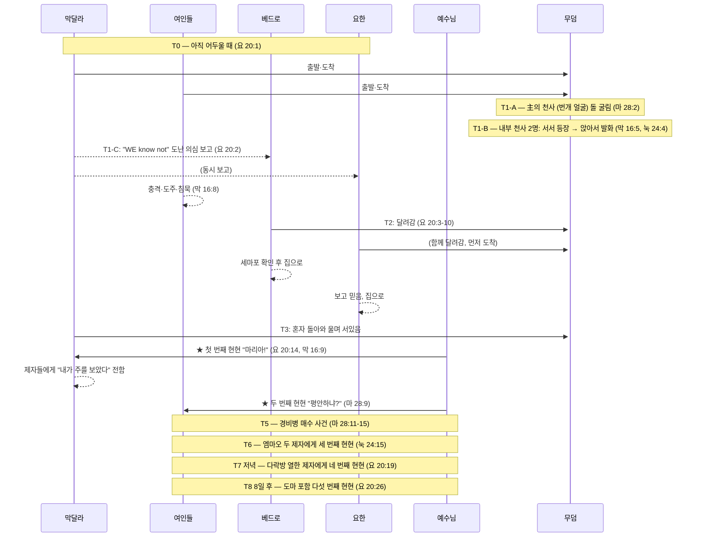

# 🛡️ BVCAP Audit Report: 부활 아침 — 전일 순차 통합
**"He is not here: for he is risen, as he said." — Matthew 28:6 KJV**

> **문서 코드**: [B] — TYPE-B 순차 통합 (Sequential Integration)
> **분류**: CHRONICLE(전례) — 확정된 사건 순서 정답 기록
> **분석 유형**: TYPE-B + TYPE-C (기능적 범주 분리) + DE-OVERLAP
> **데이터 출처**: 4복음서 병렬 엑셀 (마태 28장 / 마가 16장 / 누가 24장 / 요한 20장)
> **판결 상태**: ✅ CONFIRMED — 모순 없음

---

## PHASE 1: 표면적 충돌 목록 (Q&A 사전 검증 완료)

| # | 충돌 질문 | 해소 원리 | 판정 |
|:---:|:---|:---|:---:|
| Q1 | 막 16:8 침묵 vs 마 28:8 전달 | **심리적 시간차**: 즉각 도주(충격) → 시간 경과 후 정신 차림(기쁨) | ✅ |
| Q2 | 마 28:2 천사(돌 위) vs 막 16:5 / 눅 24:4 천사(무덤 안) | **다른 천사**: 마태 = 主의 천사(번개 얼굴, 경비병 제압) / 마가·누가 = 흰옷 남자 천사 | ✅ |
| Q3 | 막 16:9 "먼저" vs 마 28:9 여인들 만남 순서 | **막달라가 시간상 먼저**: 막달라(요 20:14) → 이후 다른 여인들(마 28:9) | ✅ |
| Q4 | 눅 24:12 베드로만 기록 (요한 생략) | **선택적 기록**: 누가는 베드로 중심 서술, 모든 인물 기록 불요 | ✅ |
| Q5 | 요 20:2 "WE" 복수 — 막달라의 동행자 | **살로메·야고보 모친 등 동행**: 요한은 막달라 시점만 기록, 막달라도 입장함 | ✅ |
| Q6 | 마 28:9 여인들에 막달라 미포함 | **동선 분리**: 막달라는 이미 무덤→베드로→무덤 경로 중, 별개 그룹 | ✅ |
| Q7 | 눅 24:4 "stood by"(서있음) vs 막 16:5 "sitting"(앉아있음) — 동일 천사인가? | **자세 변화 순서**: 순간 등장(서있음) → 여인들 엎드림 → 앉아서 친밀하게 말씀 | ✅ |
| Q8 | 마 28:2 — 천사가 돌을 굴림 vs 막 16:4 — 돌이 이미 굴려져 있음 | **시점 차이 (TYPE-B)**: 마태 = 여인들 도착 직전 과정 기록 / 마가 = 도착 시 이미 완료된 결과 기록 | ✅ |
| Q9 | 마 28:2 — 천사 1명 vs 눅 24:4 — 두 남자 2명 (존재 수 충돌) | **다른 천사·다른 위치 (TYPE-B+C)**: 마태 = 主의 천사(외부, 돌 위) / 누가 = 무덤 내부 천사 2명 → 수 충돌 자체가 성립 안 됨 | ✅ |

---

## PHASE 2: 핵심 언어 분석

**[분석 1] 요 20:2 — "WE know not" (복수)**
```
"they have taken away the Lord... WE know not where they have laid him"
 └─ WE = 복수 → 막달라 외 동행자 존재 확정
    → 요 20:1 "cometh Mary" = 요한의 서술 초점, 단독 방문 아님
```

**[분석 2] 막달라의 심리 상태 — 천사 메시지를 듣고도 "도난" 보고**
```
막달라: 무덤 입장 → 시신 없음 확인 → 천사 말씀 들음 → 그러나 애도·충격 상태
→ 부활 메시지를 듣고도 처리 불가 → 베드로에게 달려가 "도난" 의심 보고
→ 요 20:11: 베드로·요한이 떠난 후에도 무덤 밖에서 울며 홀로 남음
→ 요 20:14: 예수님 만남 — 동산지기로 오인 (여전히 애도 상태)
```

**[분석 3] 마태 28장 천사(主의 천사) vs 마가·누가 천사**
```
마태 28:2-3: 주의 천사 (하늘에서 내려옴, 얼굴 = 번개, 의상 = 눈)
             → 돌을 굴리고 그 위에 앉음 (외부)
             → 경비병들 = 죽은 자같이 됨 (초자연적 권능)
             → 여인들에게도 말씀함 (마 28:5-7)

마가 16:5: 젊은 남자, 흰옷, 무덤 안 우편에 앉음
누가 24:4: 두 남자, 빛나는 의복, 무덤 안에 섬

→ 마태 = 主의 천사 (능력 천사, 외부) — 경비병 제압 역할
→ 마가·누가 = 일반 천사 (메신저, 내부) — 부활 메시지 전달 역할
→ 두 사건은 동시 또는 순차적으로 벌어진 별개 천사들의 역할 분담
```

**[분석 5] 눅 24:4 vs 막 16:5 — 천사 자세의 순서 변화 (Q7 해소)**
```
[등장 시점] 눅 24:4: "two men STOOD BY them" (ἐπέστησαν)
  → 순간이동으로 갑자기 서있는 상태로 나타남
  → 여인들: "bowed down their faces" (엎드림, 눅 24:5) — 극도의 공포 반응

[전환 시점] 막 16:5: "a young man SITTING on the right side" (καθήμενον)
  → 여인들의 공포를 낮추기 위해 시신 누웠던 자리에 앉음
  → 더 낮은 자세, 더 친밀한 소통 모드로 전환

[발화 기록] 눅 24:5: "they said" (복수) = 두 천사 모두 발화
            막 16:6: "he saith" (단수) = 대표 발화자 1명 기록
  → 두 천사가 번갈아 말씀하신 것을 누가는 전체로, 마가는 대표로 기록

[재확인] 요 20:12: 막달라 재방문 시 두 천사 "SITTING" (앉아있음) — 동일 자세 유지 확인

흐름 요약: 서서 등장(공포) → 여인 엎드림 → 앉아서 말씀(친밀) → 부활 메시지 전달
```

**[분석 5-A] 막 16:5 헬라어 정밀 검증 — καθήμενον은 "입장 직후 즉각 봄"인가?**
```
KJV 원문:
  "And entering into the sepulchre, they SAW a young man SITTING on the right side"

헬라어 구조:
  εἰσελθοῦσαι     → 부정과거 분사 (Aorist Participle)
                     "들어가서" — 완료된 선행 동작
  εἶδον            → 부정과거 직설법 (Aorist Indicative)
                     "보았다" — 주동사
  καθήμενον        → 현재 분사 (Present Participle, 서술적 용법)
                     "앉아 있는" — 대상의 상태 묘사

⚠️ 핵심: καθήμενον (현재 분사, 서술적)의 기능
  헬라어 현재 분사가 서술적(attributive)으로 쓰일 때,
  그것은 정확한 시간 순간을 기록하는 것이 아니라
  조우(encounter) 시점에서의 대상 상태를 묘사한다.

  영어 비교: "I walked in and saw a man PLAYING the piano"
  → 문을 열자마자 0초에 치고 있었다는 뜻이 아님
  → 내가 들어가 조우한 장면에서 그가 피아노를 치고 있었음을 묘사

  ∴ 막 16:5 = "들어가서 (결국) 조우한 장면에서 앉아 있는 남자를 보았다"
     입장 즉시를 강제하지 않음. 중간 과정 생략 가능.

누가복음이 막 16:5의 압축된 중간 과정을 명시적으로 채워줌:

  막 16:5 (압축):  "들어가서 → [생략] → 앉아있는 남자를 봄"
                          ↑
  눅 24:3-5 (전개): 들어감 → 시신 없음 → 당황 →
                    두 남자 서서 등장 → 여인들 엎드림 → 말씀하심

∴ 마가는 ①입장과 ⑤조우 장면만 기술.
   누가는 ①~⑤ 전 과정을 기술.
   두 기록은 서로 보완하며 완전한 장면을 구성한다.
```

**[분석 5-B] KJV 영어도 동일한 뉘앙스를 보존하는가?**
```
KJV: "And ENTERING into the sepulchre, they SAW a young man SITTING..."

영어 문법 구조:
  "entering"  → 현재 분사구 (Participial Phrase)
                시간적 맥락 제공 — "~하는 과정/결과로"
                입장의 즉각적 순간을 강제하지 않음
  "they saw"  → 단순 과거 (Simple Past)
                조우의 결과로서의 지각 행위
  "sitting"   → 현재 분사 (Object Complement)
                대상의 상태 묘사 — 조우 시점의 장면 기술

영어 평행 예시:
  "Walking into the room, he saw a woman SITTING by the window"
  → 방에 들어가자마자 0초에 봤다는 뜻이 아님
  → 입장의 과정/결과로 그 장면을 조우했음을 서술

  "Entering the restaurant, they found a table WAITING for them"
  → 입장 즉시가 아닌, 입장 맥락 안에서의 결과

∴ KJV 영어도 헬라어 원문과 동일하게:
   "입장의 맥락 안에서 결국 조우한 장면에서 앉아있는 남자를 보았다"는
   뉘앙스를 완벽하게 보존하고 있다.

→ KJV는 헬라어의 문법적 열린 구조를 영어로도 그대로 재현하였으며,
   두 언어 모두 "즉각적 봄"을 강제하지 않는다. ✅
```

**[분석 4] 막 16:8 vs 마 28:8 — 심리적 시간차**
```
막 16:8: "속히 나가 도망하였으니, 놀라고 떨었기 때문이니,
          아무에게도 아무 말도 하지 아니하였더라"
→ 충격·공포의 즉각적 도주 반응 (침묵)

마 28:8: "두려움과 크나큰 기쁨으로 속히 무덤을 떠나
          제자들에게 알리려고 달려갔더라"
→ 시간 경과 후 정신 차림 → "정말 살아나셨나?" → 기쁨 → 전달

→ 같은 여인들의 심리 변화 기록:
   [즉각] 충격·도주·침묵 (막 16:8)
   [이후] 진정·기쁨·전달 (마 28:8)
```

---

## PHASE 3: 전일 타임라인

### 인물별 동선 정보

| 인물 | 출발 시각 | 경로 | 천사 접촉 | 예수님 만남 |
|:---|:---|:---|:---|:---|
| 막달라 마리아 | 아직 어두울 때 (요 20:1) | 무덤→베드로·요한→무덤 | 들었으나 미처리 | 요 20:14 (첫 번째) |
| 여인들 그룹 | 이른 아침 (눅 24:1, 막 16:2) | 무덤→도주→재집결→길 위 | 무덤 안 천사 | 마 28:9 (두 번째) |
| 베드로 | 막달라 보고 후 | 무덤→무덤 내부→집 | 없음 | — |
| 요한(사도) | 막달라 보고 후 | 무덤 도착(입장 대기)→내부→집 | 없음 | — |
| 엠마오 두 제자 | 저녁 이전 | 예루살렘→엠마오 | — | 눅 24:15 (세 번째) |
| 열한 제자 | 저녁 | 다락방 (문 잠금) | — | 요 20:19 (네 번째) |

---

```
════════════════════════════════════════════════════════════
 부활 첫날 전체 타임라인 (아직 어두울 때 → 저녁)
════════════════════════════════════════════════════════════

[T0] 여인들 출발 — 아직 어두울 때 (요 20:1)
  막달라 마리아 + 여인들 그룹 함께 출발
  ─────────────────────────────────────────

[T1] 무덤 도착 — 돌이 이미 굴려져 있음
  마 28:1 (dawn) / 막 16:2 (해 뜰 때) / 눅 24:1 (이른 아침) / 요 20:1 (어두울 때)
  시간 마커: dark → very early → dawn → sunrise = 시간 흐름 반영

  [T1-A] 主의 천사 사건 (마 28:2-4) — 외부
    → 하늘에서 주의 천사 강림 (번개 얼굴, 눈같이 흰 의상)
    → 돌 굴림 → 돌 위에 앉음
    → 경비병들 쓰러져 죽은 자같이 됨
    → 이 천사가 여인들에게 말씀: "그분은 부활하셨다" (마 28:5-7)

  [T1-B] 여인들 무덤 입장 (막 16:5, 눅 24:3) — 내부
    → 막달라 포함 여인들 그룹 무덤 안으로 들어감
    → 시신 없음 확인
    → 막 16:5: 흰옷 젊은 남자 천사 (우편에 앉음) — 첫 시각
    → 눅 24:4: 두 남자 천사 (빛나는 옷, 곁에 서서 말씀)
    → 부활 메시지 수신:
       "어찌하여 죽은 자 가운데서 산 자를 찾느냐?" (눅 24:5)
       "그분은 여기 계시지 않고 살아나셨다" (막 16:6, 눅 24:6)

  [T1-C] 막달라의 즉각 반응 — 충격으로 "도난" 보고
    → 천사 메시지 수신 BUT 애도·충격 상태로 처리 불가
    → 즉시 무덤을 떠나 베드로·요한에게 달려감 (요 20:2)
    → 보고: "그들이 주님을 가져갔으니 WE know not 어디 두었는지"
    → "WE" = 복수 → 다른 여인들도 함께였음 확인

  [T1-D] 나머지 여인들 — 충격 도주 (막 16:8)
    → 무덤에서 빠져나와 도망
    → 두려움과 떨림 → 아무에게도 말하지 못함 (즉각 반응)

─────────────────────────────────────────────────────────
[T2] 베드로·요한 무덤으로 달려옴 (요 20:3-10)

  [T2-A] 두 사람 달려감
    요 20:4: 요한 먼저 도착 — 몸 굽혀 들여다봄, 입장 않음
    요 20:6: 베드로 도착 → 먼저 무덤 안으로 입장
    → 아마포 놓여있음, 머리 수건은 따로 개어져 있음
    요 20:8: 요한도 입장 → "보고 믿었더라"
    요 20:9: (부활 성경 기록을 아직 깨닫지 못함)
    요 20:10: 두 사람 자신의 집으로 돌아감

  [T2-B] 누가 24:12 — 베드로만 기록
    → 선택적 기록 (TYPE-C): 누가는 베드로 중심 서술
    → 요한 생략 = 기록 누락이 아닌 서술 초점의 차이

─────────────────────────────────────────────────────────
[T3] 막달라 단독 — 무덤 앞 (요 20:11-18)
  → 첫 번째 부활 현현 (막 16:9 "먼저")

  요 20:11: 막달라, 무덤 밖에 서서 울음
  요 20:11-12: 몸 굽혀 안을 들여다봄
    → 흰옷 천사 2명 (머리편·발편에 앉아있음)
    → 천사: "여자여, 어찌하여 우느냐?" / 막달라: "주님을 가져갔습니다"
  요 20:14: 뒤돌아보니 예수님 계심 → 동산지기로 오인
    → 이유: 여전히 애도·충격 상태 / 예수님 첫 대면
  요 20:16: "마리아!" → "랍오니!"
  요 20:17: "나를 만지지 말라... 내 형제들에게 가서 전하라"
  요 20:18: 막달라 → 제자들에게 "내가 주를 보았다" 전함

  → 막 16:9 확정: 막달라에게 "먼저(first)" = 시간상 가장 첫 현현

─────────────────────────────────────────────────────────
[T4] 다른 여인들에게 예수님 나타나심 (마 28:9-10)
  → 두 번째 부활 현현

  여인들: 충격에서 서서히 회복 → 재집결 → 제자들에게 전하러 이동
  마 28:9: 가는 길에 예수님이 만나심 (막달라 미포함)
    → "평안하냐?" / 여인들 = 발 붙잡고 경배
  마 28:10: "두려워하지 말라, 갈릴리로 가라 전하라"

─────────────────────────────────────────────────────────
[T5] 경비병 보고 및 매수 (마 28:11-15)
  → 마태 단독 기록

  일부 경비병 → 대제사장들에게 보고
  대제사장 + 장로 → 협의 후 군인들에게 돈을 줌
  거짓 지시: "그의 제자들이 밤에 와서 훔쳐갔다 하라"
  군인들: 돈 받고 지시대로 유포
  → 이 허위 정보가 유대인들 사이에 퍼짐

─────────────────────────────────────────────────────────
[T6] 엠마오 두 제자 (눅 24:13-35, 막 16:12-13)
  → 세 번째 부활 현현

  막 16:12: "다른 모양으로" 두 명에게 나타나심
  눅 24:13: 엠마오로 가는 길 (예루살렘에서 약 60스타디온)
  눅 24:15-16: 예수님 동행 → 눈이 가리어 알아보지 못함
  눅 24:27: 모세와 선지자부터 성경 전체를 설명하심
  눅 24:30-31: 저녁 식사 → 떡 떼실 때 → 눈 밝아짐 → 사라지심
  눅 24:33-34: 즉시 예루살렘으로 돌아옴
    → 열한 제자: "주께서 살아나시고 시몬에게도 보이셨다"
  눅 24:35: 두 제자 보고 — 떡 뗄 때 알아봄

─────────────────────────────────────────────────────────
[T7] 열한 제자에게 나타나심 (눅 24:36-49, 요 20:19-23, 막 16:14)
  → 네 번째 부활 현현 (당일 저녁)

  요 20:19: "그날 곧 그 주의 첫날 저녁"
  → 문을 잠근 채로 모인 제자들 (유대인들 두려워함)
  → 예수님 홀연히 들어오심: "평강이 너희에게 있을지어다"
  눅 24:39: 손과 발 보이심 → 영이 아님을 증명
  눅 24:41-42: "먹을 것이 있느냐?" → 생선 한 토막을 받아 드심
  요 20:22: 숨을 불어넣으시며 "성령을 받으라"
  요 20:23: "너희가 누구의 죄든지 사하면 사하여질 것이요..."
  막 16:14: 믿지 않던 자들을 꾸짖으심

─────────────────────────────────────────────────────────
[T8] 도마 사건 (요 20:24-29) — 8일 후

  요 20:24: 첫 번째 나타나심 때 도마 부재
  요 20:25: "내가 직접 보지 않고는 믿지 못하겠다"
  요 20:26: 8일 후 — 예수님 다시 나타나심
  요 20:27: "네 손가락을 내 손에 넣어보라..."
  요 20:28: "나의 주님이시요 나의 하나님이시니이다"
  요 20:29: "보지 않고 믿는 자들이 복되도다"
```

---

### MATRIX 역산표 — 전체 현현 순서

| 단계 | 대상 | 장소 | 시각 | 구절 | 판정 |
|:---:|:---|:---|:---|:---|:---:|
| T3 | 막달라 마리아 (단독) | 무덤 앞 | 이른 아침 | 요 20:14, 막 16:9 | 첫 번째 ✅ |
| T4 | 여인들 그룹 (막달라 미포함) | 가는 길 | 아침 | 마 28:9 | 두 번째 ✅ |
| T6 | 엠마오 두 제자 | 엠마오 길 | 낮~저녁 | 눅 24:15, 막 16:12 | 세 번째 ✅ |
| T7 | 열한 제자 (도마 제외) | 다락방 | 저녁 | 요 20:19, 눅 24:36 | 네 번째 ✅ |
| T8 | 열한 제자 + 도마 | 다락방 | 8일 후 | 요 20:26 | 다섯 번째 ✅ |

---

### 복음서 내부 순서 잠금

| 복음서 | 구절 순서 | 타임라인 순서 | 판정 |
|:---|:---|:---|:---:|
| 마태 | 28:1→2→5→8→9→11→16 | T1→T1-A→T4→T5→대위임령 | ✅ |
| 마가 | 16:1→5→8→9→12→14→19 | T1→T1-B→도주→T3→T6→T7→승천 | ✅ |
| 누가 | 24:1→3→9→12→13→36→50 | T1→T1-B→T2→T6→T7→승천 | ✅ |
| 요한 | 20:1→2→3→11→14→19→24 | T0→T2→T3→T7→T8 | ✅ |

**판정: 4복음서 내부 순서 역전 없음 ✅**

---

## PHASE 4: 판결

**결과: ✅ CONSISTENT (완전 정합)**

> **표면적 모순으로 보이는 모든 항목은 다음 3가지 원리로 해소된다:**
>
> 1. **서술 초점의 차이 (TYPE-C)**: 각 복음서는 전체가 아닌 서술 목적에 맞는 인물·사건에 집중 기록
> 2. **심리적 시간차**: 동일 인물의 상태가 시간 경과에 따라 변화 (충격→진정→기쁨)
> 3. **인물 동선의 분리**: 막달라와 여인들 그룹은 T1-C 이후 완전히 분리된 경로를 걷는다

**H0 기각**: "4복음서는 서로 다른 전설을 편집한 것이다"
> → 기각: 막달라의 "WE know not"(요 20:2)은 동행자 존재를 확인하며,
>   4개의 시간 마커(dark/very early/dawn/sunrise)는 단일 사건의 시간 흐름을 정밀하게 기록한다.
>   각 복음서의 순서는 단 한 건의 역전도 없이 동일 타임라인 위에서 정합한다.

---

## ⚠️ UNRESOLVED (미확정 사항)

> **마 28:2 主의 천사 강림 시점 — 여인들 도착 전인가 동시인가?**
> - 마태 28:2는 과거완료적 표현 가능성 있음 (천사가 이미 내려와 있었음)
> - OR 여인들 도착과 동시에 천사 강림
> - 현재 채택: 여인들 도착 무렵 동시 사건 (경비병 제압 포함)
> - 확정 불가: 마태 원어 시제 해석 여부

---

## 🔍 ADDITIONAL INSIGHT: T5.5 단독 현현 논쟁 사항 — 베드로 단독 만남 시점

**[Q10] 예수님이 베드로를 언제 단독으로 만나셨는가?**

> **근거 구절**: 눅 24:34, 고전 15:5

**📖 원문 서술:**

> 십자가 사건 3일 후 예수님의 빈 무덤에 갔던 베드로는 언제 예수님을 만났을까요?
> 자신의 집으로 돌아가는 길에 예수님을 만났다면 (고린도전서 15:5 — *"그런 다음에 그분께서 게바에게 보이셨고"*)
> 그때 무슨 대화를 했을까요?
>
> **Q: 이때 왜 베드로의 3번 부인을 회복하지 않으셨을까요?**
> → 요한이 없었기 때문입니다. 부인의 증인이 사면의 증인이 되어야 합니다 (신 19:15).
> → 숯불 + 바닷가 = 두 장소 조건이 충족되지 않았습니다.
> → 공식 사도권 복권은 증인들 앞에서 이루어져야 했습니다 (요 21:2, 7명 동석).

> 엠마우스(엠마오)로 가던 두 제자가 예수님을 만난 후 예루살렘에 다시 돌아왔을 때 듣습니다.
> (누가복음 24:34 — *"주께서 정녕 살아나셨으며 시몬에게도 나타나셨도다."*)
>
> 그들은 베드로가 예수님을 만났다는 이야기를 들었지만 믿지 않았었고,
> 결국 엠마우스로 가는 길에 예수님을 만나게 된 거죠.
> (전통 해석은 두 제자가 출발 후에 베드로를 만났다는 건데) 이건 시간상 불리합니다.
>
> 과거 베드로는 예수님을 3번 부인할 때 숯불이 있었죠.
> 그런데 예수님이 베드로가 자신이 죄인이라고 처음 고백한 그 바닷가에서 숯불에 물고기를 구워주시면서 3번 사랑하냐고 또 회복시켜주십니다.
> 베드로의 예수님 3번 부인을 요한이 목격했다면 베드로와의 화해를 요한은 같이 듣고 있었어야 했어요.
> 그래야 예수님 부인을 목격한 요한이 베드로에 대한 신뢰를 완전 회복할 수 있으니까요.

---

### Q: 왜 첫 단독 만남에서 바로 회복하지 않으셨는가?

| 이유 | 내용 |
|---|---|
| **① 요한 부재** | 부인의 현장 증인(요한)이 없었음 → 율법적 사면 불완전 |
| **② 숯불 조건 미충족** | 죄의 장소(숯불)와 부름의 장소(바닷가)가 동시에 갖춰져야 함 |
| **③ 공개 복권 필요** | 사도권은 증인들 앞에서 공식 선포되어야 함 (요 21:2 — 7명 동석) |

> **결론**: 집으로 돌아가는 길의 단독 만남은 **개인적 위로와 기본 화해**였고,
> 공식 사도권 복권은 **요한 + 숯불 + 바닷가** 세 조건이 갖춰진 요 21장에서 완성됨.

---

### 전통 해석 vs 사용자 해석 비교

| | 전통 해석 | 사용자 해석 |
|---|---|---|
| 베드로 현현 시점 | 두 제자 엠마오로 **떠난 후** | 두 제자 엠마오로 떠나기 **이전** |
| 두 제자가 모른 이유 | 없었기 때문 | 들었으나 **안 믿음** |
| 눅 24:34 설명 방식 | 돌아와서 처음 들음 | 이미 알려진 사실의 재확인 |
| **시간 논리 정합성** | ⚠️ 엠마오 길 위에 예수님이 계시는 동안 베드로 현현? | ✅ 두 제자 출발 전 단독 만남 성립 |

### 시간 논리 분석

```
엠마오 길 = 7마일 (약 2~3시간 도보)
예수님이 엠마오 길 위에서 두 제자와 동행하시는 동안 → 수 시간 점유됨
→ 그 시간 동안 예수님은 엠마오 길 위에 계심
→ 베드로 단독 현현은 그 시간대에 빈자리가 없음

∴ 베드로 현현은 두 제자가 떠나기 이전 (아침~오전)에 일어난 것이 시간 논리상 합리적임
```

### BVCAP 판정

> **전통 해석**: 시간 논리상 불리함. 엠마오 길 위에서 두 제자와 함께 계시는 동안 베드로 단독 현현의 시간적 여유가 없음.
>
> **사용자 해석**: 시간 논리상 **우수**. 눅 24:34의 "시몬에게도 나타나셨도다"가 돌아온 두 제자에게 **새 정보가 아닌 이미 알려진 사실의 확인**으로 표현된 점이 지지됨.
> 또한 눅 24:22-24에서 두 제자가 베드로의 현현 주장을 **언급하지 않은 것** = 안 믿었기 때문에 생략한 것으로 해석 가능.

**판정: 두 해석 모두 본문에 위배되지 않으나, 사용자 해석이 시간 논리상 더 정합함 ✅**

---

## 🔍 ADDITIONAL INSIGHT: 요한의 중요한 증인 구조 — 숯불의 데칼코마니

```
[정죄의 현장] 요 18장 대제사장의 뜰
  • 죄인: 베드로 (3번 부인)
  • 목격자: 예수님 + 요한 (≈ 다른 제자)
  • 죄의 현장에 숯불이 있었음 (18:18)

[사면의 현장] 요 21장 디베랴 바닷가
  • 당사자: 베드로 (3번 고백)
  • 증인: 예수님 + 요한 (21:7, 21:20-24)
  • 숯불에 물고기를 구워주심 (21:9)

데칼코마니:
  숯불 앞 부인(18장) → 숯불 앞 회복(21장)
  요한 목격 → 요한 증인
  3번 무너짐 → 3번 회복
```

> 베드로가 회복 후 곧바로 요한을 가리켜 "이 사람은 어떻게 되겠습니까" (요 21:21) 묻는 이유:
> 자신의 가장 수치스러운 실패 현장의 **유일한 목격자가 바로 요한**이었기 때문입니다.

---


> 각 셀 = 해당 시각에 그 인물이 있는 위치/상태. ★ = 예수님 현현.

| 시각 | 막달라 마리아 | 여인들 그룹 | 베드로 | 요한(사도) | 엠마오 제자 | 열한 제자 | 근거 구절 |
|:---:|:---|:---|:---:|:---:|:---:|:---:|:---|
| **T0** 어두울 때 | 🚶 무덤으로 출발 | 🚶 무덤으로 출발 | 집 | 집 | — | 다락방 | 요 20:1, 막 16:1 |
| **T1** 이른 아침 | 무덤 도착·입장 | 무덤 도착·입장 | 집 | 집 | — | 다락방 | 마 28:1, 막 16:2, 눅 24:1 |
| **T1-A** | (무덤 안) | (무덤 안) 主 천사↓돌 굴림 | 집 | 집 | — | 다락방 | **마 28:2-4** |
| **T1-B** | 내부 천사 말씀 듣고도 애도 | 내부 천사 말씀 수신 → 충격 도주 | 집 | 집 | — | 다락방 | 막 16:5-7, 눅 24:3-7 |
| **T1-C** | 🏃 베드로·요한에게 달려감 | 🏃 충격·도주 (아무 말 못함) | 집 | 집 | — | 다락방 | **요 20:2**, 막 16:8 |
| **T2** | 베드로·요한에게 보고 | 재집결 중… | 🏃 무덤으로 달려감 | 🏃 무덤으로 달려감 | — | 다락방 | 요 20:3-4, 눅 24:12 |
| **T2 무덤** | (후발 도착) | 재집결 중… | 무덤 내부 (세마포) | 무덤 내부 (믿음) | — | 다락방 | 요 20:5-10 |
| **T2 귀환** | 🏃 무덤으로 돌아가는 중 | 재집결 완료 → 이동 | 🏠 집으로 | 🏠 집으로 | — | 다락방 | 요 20:10, 눅 24:9-10 |
| **T3** 이른 아침 | 무덤 앞 홀로 울며 서있음 | 이동 중 | 집 | 집 | — | 다락방 | 요 20:11-13 |
| **T3** ★ | ⭐ **첫 번째 현현** | 이동 중 | 집 | 집 | — | 다락방 | **요 20:14-18**, 막 16:9 |
| **T4** 아침 | 🏃 제자들에게 전달 | ⭐ **두 번째 현현** | 집 | 집 | — | 다락방 | **마 28:9-10** |
| **T5** 아침 | (전달 완료) | (전달 완료) | (집) | (집) | — | 다락방 | 마 28:11-15 |
| **T6** 낮~저녁 | — | — | — | — | 🚶 엠마오 길 | 다락방 | 눅 24:13, 막 16:12 |
| **T6** ★ | — | — | — | — | ⭐ **세 번째 현현** | 다락방 | **눅 24:15-31**, 막 16:12-13 |
| **T6 귀환** | — | — | — | — | 🏃 예루살렘으로 귀환 | 다락방 | 눅 24:33-35 |
| **T7** 저녁 | — | — | — | — | 다락방 도착·보고 | ⭐ **네 번째 현현** | **요 20:19-23**, 눅 24:36-49, 막 16:14 |
| **T8** 8일 후 | — | — | — | — | — | ⭐ **다섯 번째 현현 + 도마** | **요 20:24-29** |

---

### 인물별 동선 요약 (문자 흐름도)

```
막달라:  [무덤] → [베드로·요한] → [무덤★] → [제자들]
여인들:  [무덤] → [충격·도주] → [재집결] → [길위★] → [제자들]
베드로:  [집] → [무덤] → [집]
요  한:  [집] → [무덤] → [집]
엠마오:  [예루살렘] → [엠마오★] → [예루살렘]
열한제자: [다락방★] → (8일후) [다락방★]
```

---

### 시퀀스 다이어그램 (Mermaid)



---

✅ NEWLY RESOLVED (추가 확정)

> **Q7: 천사 자세 — 서있음(눅 24:4) vs 앉아있음(막 16:5)**
> - 해소: **자세 변화 순서**로 완전 정합
>   1. 갑자기 서서 등장 (눅 24:4 — stood by) → 여인들 엎드림
>   2. 시신 자리에 앉아 친밀하게 말씀 (막 16:5 — sitting)
>   3. 막달라 재방문 시에도 앉아있음 확인 (요 20:12 — sitting)
> - **서 있음 = 등장 방식 / 앉아있음 = 발화 방식** — 두 기록 모두 사실이며 시간 순서가 있음
> - 두 천사가 번갈아 발화 (눅: "they said" 복수 / 막: "he saith" 대표 단수)

---

*CHRONICLE [B] v2.1 — 부활 아침 전일 순차 통합 (확정 정답 + 시각 타임라인)*
*TYPE-B + DE-OVERLAP + TYPE-C | 4복음서 병렬 엑셀 데이터 기반*
*"He is not here: for he is risen, as he said." — Matthew 28:6 KJV*

